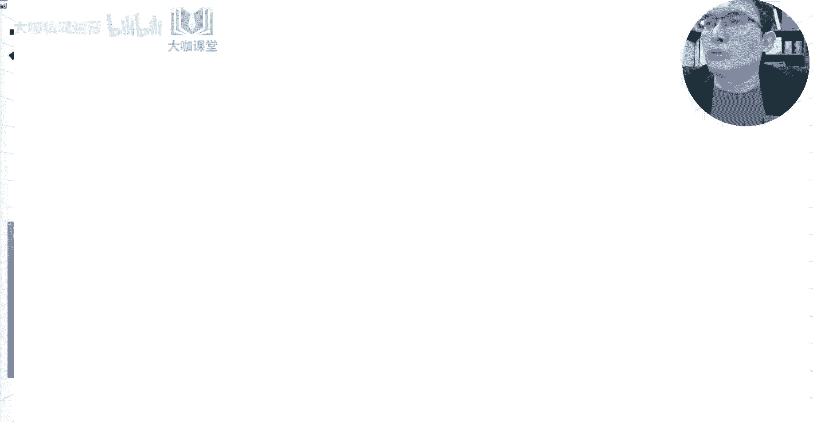
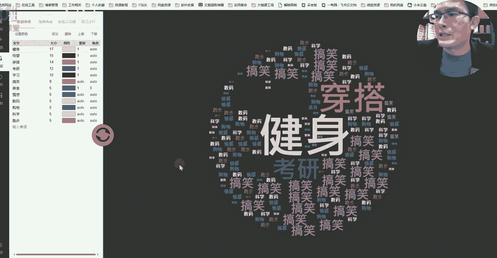
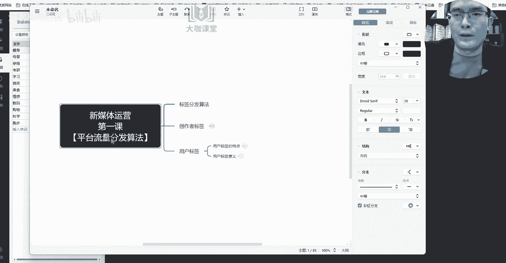

# 【打败全网99%的新媒体运营课程】零基础自学运营天菜教程 小红书运营起号／抖音短视频／直播带货 全平台精讲！ - P4：3、新媒体运营第二课：用户标签-大数据下的千人千面分发算法 - 大咖私域运营 - BV11VtTesEM6

嗨大家好，我是方宇老师。那么上一堂课呢，我们跟大家详细的聊一聊关于创作者标签它的一个意义，它的作用。还有这个我们账号的第一波流量，或者说我们账号起号的时候，我们视频背后每一个播放或者浏览它所代表的意义。

以及我们整个账号标签，或者说我们整个流量它的一个升阶的这么一个过程到底是怎么形成的平台是怎么来判断我们的内容是关于什么的。那么这堂课呢，我们重点来了一聊关于用户标签。用户标签是什么意思呢？

就是我们每一个人你们去使用一款app这种短视频的也好，或者说我们的图文笔记也好，你在使用这个app的一个第一时间，用户啊，我们的平台就会对你有一个这样的一个标签。那么这个标签会随着你浏览内容的一个变化。

或者说你的一个兴趣爱好的一个变化。这个标签呢，它会有实时的这样的一个可变性。好吧，那么这就是我们要了解用户标签它到底是什么用户标签它的一个意义或者它的一个特色啊，首先呢我们来了解一下用户。😊。

用户标签的特点。首先第一个用户标签呢，它具有多样化，什么意思呢？它跟我们的这个创作者标签不一样。我们创作者标签，我们为了实现流量分发的一个精准化。我们上节课已经讲了，比如说我们做的是美食的视频。

我们自然是希望平台跟我们分发的这些流量不管是1000000也好，这些流量呢都是分发出去的用户，他们都是对美食感兴趣的对吧？所以说呢我们要保证我们账号的一个标签的唯一性。

这样呢我们前期的这个流量才能分发的更加精准，那么到了后期呢，这是后期要考虑的问题，用户标签就不一样了。用户呢他喜欢的内容多种多样，对吧？他喜欢很多的，比如说呃单纯的美食。或者说美妆对吧？

护肤还有什么用户可能喜欢这个APP啊，或者说喜欢喜欢这个什么喜欢游戏或者喜欢健身等等啊。这个呢所有的这些内容都是根据用户的一个喜好来决定平台呢会对用户所有的喜好进行一个罗列，并且按照用户的一个什么呀？

按照用户对内容感兴趣的一个程度给他对进行这对内容进行分级啊，对内容对这个用户的一个标签进行分级，他到底是喜欢美食的内容多一些，还是喜欢美妆的内容或者护肤的内容多一些呢？你们觉得这些标签的一个分发系统。

他有没有办法去判断，完全有办法，对吧？你只要在浏览内容上面，你有一些细微的变化。比如说你今天看的视频当中，100个视频，你浏览美食内容的视频当中有5个美食的内容的视频，你平均浏览的都在10秒以上。

然后其他的这个视频呢，你浏览的内容。时长都只有两三秒三五秒这样的一个时间。那么这样平台就能判断哎，你这个用户呢对美食比较感兴趣。那么我这个平台为了留住你，我让你长期在我的这个平台上面去使用。

你去刷你喜欢的内容，我势必要在第二天或者说在你接下来的使用当中给你推荐更多对美食跟美食相关的内容，这就是平台留住用户的一个策略，也是他为了给用户去打标签的这么一个作用。

那么为什么这么你这个点你们应该也能理解，为什么说平台他们要去给我们的创作者打上这样的一个标签呢？就是为了把这个优质的内容筛选出来，通过层层用户的一个行为反馈筛出来，然后再推给那些精准的用户。

他一定要知道我们的账号到底是做什么东西的，我们做什么方向的，他才能决定把我们的内容推给哪些人，因为他要保证内容的一个质量。并且呢他不能说我们做的一些呃很垃圾的这种内容，然后去推荐给了很多的这种用户。

最后最终导致所有的用户。哎，这个短视频平台现在特别垃圾，我不想用它，那么会形成一个用户的流失。那么这个就是我们讲的是吧？就是讲的我们讲的这个用户标签和我们创作者标签以及平台。

他为什么要做这样的一个事情的一个根本的原因。好吧，那么我们刚才讲了还有一个什么呀？用户标签呢，它还会有什么呀？还会有分级是吧？😊，分级就是我们刚才说的哪一个，比如说我们像美食对吧？美食这个东西呢。

假设说啊我把这个拿过来吧，我们还是通过模型来演示这个分级。比如说用户对美食特别感兴趣，我们给它加个粗，然后呢给它变个颜色。好，这个是美食。然后美妆呢我们也给它加个颜加加粗。

美妆呢它可能感兴趣的程度稍微弱一点。那么我们给他一个淡一点的红色，然后呢，护肤护肤的内容呢，他也挺感兴趣，但是没有前面两个感兴趣。那么我们给他呢，我们不加粗，我们来给他加上一个淡一更淡一点的颜色。

那么这样的一个区分，你们能不能看得出来，对吧？能够理解用户关于内容这一块平台是怎么去区分的。这个就是用户标签，也就是说我们所有的用户，他浏览了你的内容，他喜欢的你的内容，但是他不光是对你的内容感兴趣。

那么这个在我们后续的课程当中，我们也会跟大家去讲怎么利用用户的一个兴趣点去制造这种更多的非精准用户的一个这个获取的一个方式，好吧，这个是我们讲的有分级，对吧？用户标签有分级，还有一点是什么呢？😊。

用户标签它具有一个可变性。什么叫可变性呢？我们刚才是不是讲到了一个原理。比如说这个用户他今天对美食的内容浏览的时长都非常长，对吧？对美妆或者护肤类的内容呢，浏览的时间比较短。

那么平台会认为这个用户当前他对美食内容特别感兴趣。不管你是半夜的时候啊，或者说你平常的时候好O那么假设说你第二天平台给你推荐了很多跟美食相关的视频，但是你这个时候你又不想去看美食了，我吃饱了。

这个时候我又对什么呢？我可能对健身的内容特别感兴趣，我就想刷点这种内容。O那么这个时候美食的内容，你他会把你就是说你推到你的面前，你会把它刷走，对吧？你这个时候你不想看一个刷走两个刷走。O好。

你刷到了一个健身的视频。那么这个时候呢，你突然你在健身的内容当中呢，你又停留了很长时间。😊，对吧假设说你就停留了长达一分钟的时间，其他的视频呢，可能你看个几十秒，这个时候平台会认为什么呢？

他的数据实时的波动当中，他会发现哎这个用户他现在突然对健身的内容感兴趣了。好，那么你停留了一分钟。那么接下来我继续给你推跟健身有关的内容，我来尝试一下你这个用户是不是你这个兴趣需求变了。好。

尝试第二个视频，哎，你也喜欢第三个视频你也喜欢O那么这个时候你的平台判断的这个用户他的一个兴趣行为可能就产生了一定的变化。那么包括后期在给他推送这个内容的过程当中，可能就会以健身为主。

那么用平台在根据用户对当前内容的一个实时反馈来决定我接下来减少哪部分内容的推送，我增加哪部分内容的一个推送，这个大家能不能理解好吧，这个就是我们用户他的一个需求的一个可变性啊，一个可变性。

那么在可变性当中呢，我们用户变了这样的一个呃浏览行为了之后，那么这个时候呢，美食他可能就没有兴趣了啊，没有兴。😊，可能就是说放到最后啊，放到最后都有可能。那么这个时候呢健身成了他第一感兴趣的内容。

这个时候它的标签呢就变了，是不是这个就是用户标签的一个可变性啊，可变性。还记不记得我们上堂课跟大家讲呢？当我们的内容分发到了5000的时候，为什么说原本对美食内容感兴趣的这个1000个用户。

我们可能应该要获取到600个这样的一个互动数据。但是为什么没获取到一个是基于用户兴趣标签，它存在一个可变性。第二个是用户对内容的一个筛选。对内容的一个挑剔程度变高了啊，这个就是用户他们的一个变化点。

那么呢用户标签呢在平台这边呢，他其实还有一个什么东西呢？就是用户除了这些兴趣行为之外，我们还有一个平台会还会有一个用户的一个数据库？😊，这个用户数据库它就跟兴趣这些可能没有太大的关系。这个是平台。

为了来区分每一个用户他是在哪里，他做什么事儿，他现在是什么性别，他什么年龄，他经济能力是怎么样？这部分属于平台上面特有的一个用户数据库。这个用户数据库，你们觉得他能来做什么呢？

这些用户数据库可以精准的实现什么呀？就是我们的广告投放。比如说我们现在要在某短视频上面，我们去投放一个广告，那么在人群的一个标签筛选当中呢，我们肯定要去筛选哪些用户，我们想把我们的广告推送给哪些用户。

对吧？这些用户呢，他们的经济能力怎么样，对吧？比如说是哪个年龄层级的，然后是重点投放哪些地区的，我们是投同城的还是投全国的，这个时候用户数据库，他就派上了硬场用场啊。

我们通常来讲用户数据库肯定是至少包含比如说地区比如说性别年龄，然后呢所使用的设备，还有他的一个经济能力，他的职业以及他的什么呀？呃呃以及他的这个呃时间吧，对吧？以及它的这个时间等等啊。

就是它的一个使用的时间。等等啊等等。那么很多人会疑虑哈，我们这当中呢有些东西它到底是怎么去判断的呢？比如说地区这个好判断对吧？

根据IP来判断你的IP呢归属地是哪里的这个好判断你的性别这个玩意儿怎么去判断判断性别两者。第一者呢是给你浏览的内容的趋势和方向，这个是完全可以通过大数据来分析出来的。比如说90%或者80%的女性用户。

他们浏览的都喜欢哪些内容，这是有一个共通性的，那么突然来了一个新用户，这个新用户，他刚好他喜欢的内容就属于这80%的女性用户喜欢的内容当中，这个用户呢可以把它判别为判断为一个女性用户，然后呢。

通过他日常发的视频或者说通过他自己填写的资料信息，这也可以作为一个初步的判断，然后他的兴趣内容是可以做更精准的判断的对吧？然后年龄对吧？年龄呢从我们填写的这个数据啊，或者说你感兴趣的方向内容啊。

这个也可以来判断，对吧？设备这个很简单，然后你的经济能力，从你的购买力，对吧？从你喜欢你家购物车，对吧？你平常蹲的直播间，这个也能。😊，筛选出来。比如说你喜欢蹲那种9。9块的直播间，对吧？然后呢。

你又喜欢蹲那些卖高端奢侈品的这种直播间，你的这个经济能力倒是一目了然，以及你的购买行为。你的这个甚至说还有一种可能性，就是你在其他电商平台上面的一个购买行为，也能成为这里判断你经济能力的一个参照，好吧。

职业职业这个东西呢，平台也是有办法去判断的。好吧，它会有一个大致的一个标签啊，非常这个分析是非常呃复杂的，还有使用时间，这个就很好说的。为什么说需要你的一个使用时间呢？

这个是提供给在不同的时间段分发给较精准的系统，把这个广告分发给哪些人群。好来，这对这些用户呢做一个行为筛选。比如说你就是半夜你是属于那种在半夜来使用这个app的。然后呢，你平时白天用的很少。

那么你的这个平台的广告呢，它会尽量在你使用特别频繁的时候，把这个广告推送给你，然后你的点击行为，你的重度浏览时间。😊，都是能够得到的。好吧，这个叫做用户数据库。那么通过这个东西呢。

我们能够判断出来什么呢？平台对每一个用户他都有非常强的这个用户画像分析系统。也就是说而且这个分析系统特别特别庞大，而且特别特别精准。为什么说这个某些短视频平台，或者说某些图文笔记平台现在能做的好。

就是基于这么一套系统它能精准的把内容一些优质的内容精准的分发到用户的面前，对吧？为什么说我们很多人去做内容啊，你们觉得哎呀我辛辛苦苦做了很多这个视频做了很多笔记，为什么我就是没有流量，就是因为什么呢？

你没有突破平台对你的一个考核，或者说对你的内容筛选的这么一个过程，你的内容根本就到达不了你精准用户的面前，啊，这个就是我们用户标签，它这么一个平台对它控制的一个特别重要的一个点，好吧。

那么通过我们这一系列的分析啊，我们可以看出什么呀？用户标签它有哪些意义啊。用户标签它有哪些意义？首先第一个用户标签决定了。决定了系统给你推荐什么内容，这个是非常重要的一点。

如果说你的账号你想特别看什么内容怎么办？你可以去着重搜索啊，你的这个搜索行为，然后你的这个点赞收藏的这些数据，还有你内容的一个浏览时长，这些都可以为你即将要改变的这些内容方向去提供支撑。

你通过这些行为呢，你的搜索行为平台也会关注。然后你的点赞收藏，你的这个内容浏览时长，这些都可以改变你接下来想要浏览的内容，这个就是平台用户标签这一块的一个波动。好，然后呢。

用户标签这个它反向的决定了什么呢。用户标签他反向的决定了。你的账号标签。什么意思呢？就是用户标签这个就反向的决定了你的账标账号标签的，它的核心意义就是平台知道你这个用户它到底是什么属性，对吧？

它可以通过你现有的这些标签，比如说我们刚才讲的你喜欢什么内容，你比如说美食，比如说美妆护肤，或者说呃这一类内容可以判断我们当前这个账号呢是一个女性，对吧？还有一定经济能力的这么一个女性。

而且呢比较喜欢美食，那么假设说我们现在有一个用户，他经常关注什么呢？关注考研，对吧？关注周末去哪玩，然后关注一些这个学习呃，我们考研的这些资料啊，或者说在一些考研的这个直播间蹲守的时间比较长啊。

那么这个用户的标签是什么？他就是一个正在准备考研的这么一个大学生，是不是那么这个就是我们什么呀？我们的这个用户标签，他决定了我们就是我们感兴趣的，我们所有的这个用户打上的这些标签数据。

他能决定平台知道我们现在这个账号我们是什么人，对吧？可以。😊，判断我们目前是什么人。好，那么我们通过这么一篇分析呢，我们大概知道他的流程是这样。那么如果说你还有你还是没有办法来理解这一点。

那么接下来我们通过一个图形的方式来再度了解关于用户标签这么一个东西。那么如果说你看得懂这个图，我现在界面上这个图，你就应该大致了解这个图呢，其实就是我们每一个平台，它的后台对用户的一个标签的画像。

现在呢这个标签，我们放在这个地方的，可以代表什么呀？它可以代表的就是一个完整的用户的画像。

完整的用户画像。那么我们可以看到在这个画像当中，美食是居于第一位的，他是最大的一个标签。哎，那么这个用户他现在就是喜欢美食。哎，他对美食就是最为感兴趣。那么这类用户他更容易刷到什么。

更容易刷到跟美食相关的内容。那么比如说我们现在看一下啊，母婴考研穿搭学习，对吧？我们按照这个地方有排序，对吧？美食呢是呃感兴趣最大的，然后母婴其次穿搭其次，考研学习好。

那么这个时候可能用户平台我们的平台给这个用户分发的内容比例，他有可能就是这样的。那么美食是10个，对吧？美食的内容10个，然后母婴的内容呢可能有8个，然后穿搭的内容呢可能给你分发6个考研的呢。

可能给你分发5个或者4个学习给你分发几个，给你分发三个或者两个，然后剩下的这些内容呢，可能基于去试探你对这些内容感不感兴趣，他会随机给你穿插一些这些其他可能你暂时没有特别感兴趣的内容。推荐过来。

然后看看你的反应，你是直接划走，还是你继续浏览很长时间，或者说你提供一些互动的这种行为。OK那么这就是我们整个用户标签。那么假设说现在这个用户我们来演示一下它的一个变化的一个过程。

我们假设这个用户现在他对这个什么呀，他对健身突然感兴趣了，对吧？对对健身突然感兴趣了，我们来看一下。😊，美食呢他可能突然不感兴趣了，我们给它改为5，然后健身呢16ok。17吧啊健身呢他突然。特别感兴趣。

我们来看一下他的画像马上就变了啊，平台呢它也是实时去变动的。我把这里数字呢改成一。OK那么这里能不能看得出来，很明显的能看得出来。哎，这个用户我那么在平台的这个系统的视角里。

他就能发现当下这个用户他就是对健身特别感兴趣。那么我是不是这个时候应该调整我推送的内容方向，如果这个时候我继续给他推送关于美食的，但是他就是不感兴趣。他持续刷不到他想要的内容会造成一个什么后果。

我对这个app现在瞬间没有了这个吸引力。对吧？这些内容都不是我感兴趣，我会有一个什么举动，我会把这个app给他关掉，啊？那么系统他也要在运营，他也要去运营用户去做那用户给用户推荐他喜欢的内容。

这就是我们来研究什么呀？我们所有做运营的人，你一定要了解的这么一个点，对吧？用户标签和创作者标签，他对我们整个怎么说呢？对我们整个账号运营过程当中的一个意义。

或者说我们系统的他的一个平台的流量分发的一个算法。O好，那么这节课就给大家讲到这里。😊。

