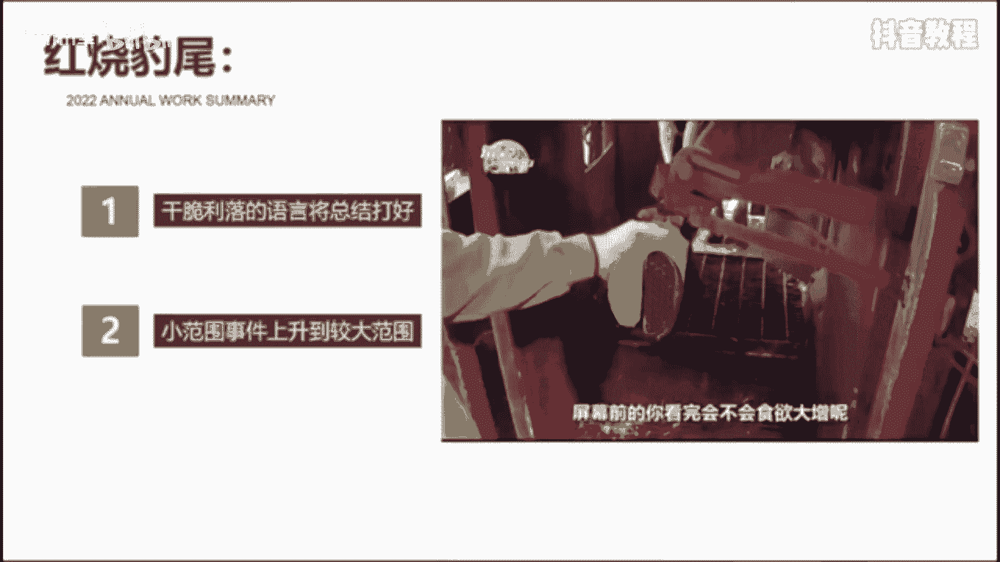
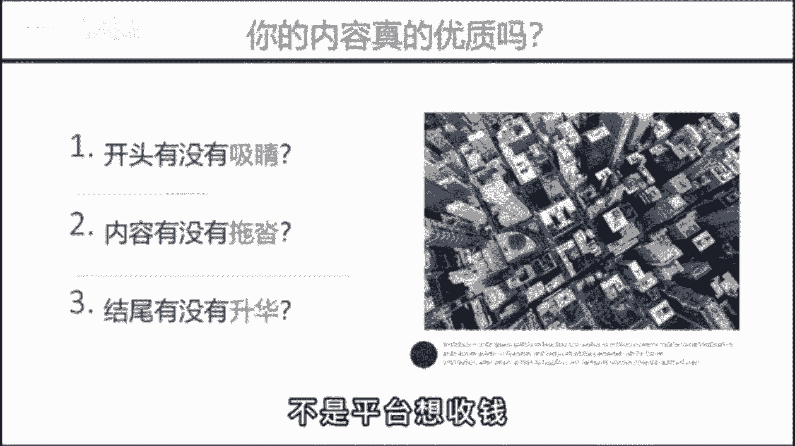

# 【抖音教程】2024年做抖音怎么快速起号？3天养出一个高权重抖音账号，掌握这7点，抖音快速养号小技巧！ - P17：怎么发视频有推荐量 - Quinn幸 - BV1BzvPexEam

🎼我也知道好内容才会被推荐，但到底什么才是好内容，这也太抽象了，有没有什么办法能把抽象的价值变成可视化的短视频语言呢？😡。

🎼还真有教你一个公式，爆炒虎头十几猪肚，红烧爆肚，什么意思呢？有句话叫客户买的不是产品，而是感觉。

🎼爆炒虎头就是说开头的5秒要开的精彩，像虎头般斑斓夺目。比如这样，那一天，上海感受到了被吞噬的恐惧，夜空中出现了一张血魂大头，钢筋森林都被他洗进嘴里，开头就写出它的具体表现。

而不是给大家推荐一部高分末日电影，再或者这样，有人说来上海旅游没什么好玩的，那可能是你的打开方式不太对。作为十年的老护漂，我想送你今天这份上海旅行攻略，写出你要为观众解决什么苦恼。

而不是我给大家分享三个上海的景典。😡。

🎼石锦猪肚呢则是内容，又像猪肚那样饱满丰富。🎼包括画面的切换，也要符合情绪的递节。比如这样，然而啊过了一天，个股股市呢又普遍的回血，那问题就来了。接下来这场仗对全球的经济到底会有什么样的影响呢？

内容充实、丰富饱满，一定不能出现任何的节奏拖沓，华而不实的内容。😡。

🎼红烧鲍尾则是指豹子般意味深长的结尾，用最简短有力、干脆利落的语言将总结打好。比如这个屏幕前的你看完会不会食欲大增呢？反正我能多带两碗米饭，用一句反问来提高评论互动数据。再比如这个吞陷了委屈。

味大的格局，改变不了别人就改变自己。把前面写的小范围事件，才恰到较大的饭围，从而升华视频的主题。😡。

🎼明白了这个故事后，你再问问自己，你的内容真的优质吗？是不是开头不够细节，内容节奏拖沓，让人看不到最后。而结尾呢就一句，我们下期再见。😡，🎼这就是你头抖家没效果的核心原因。🎼不是平台想收钱。

而是你不充钱，连自嗨都做不到。😡。

