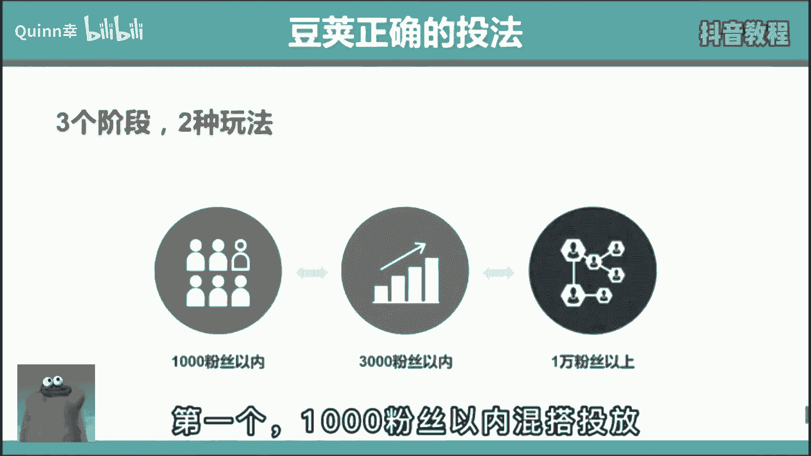
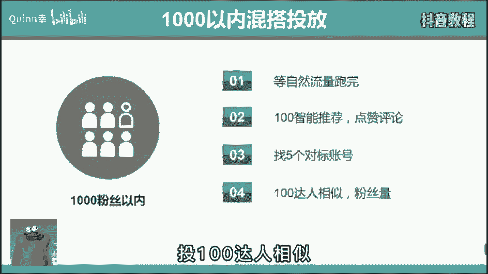
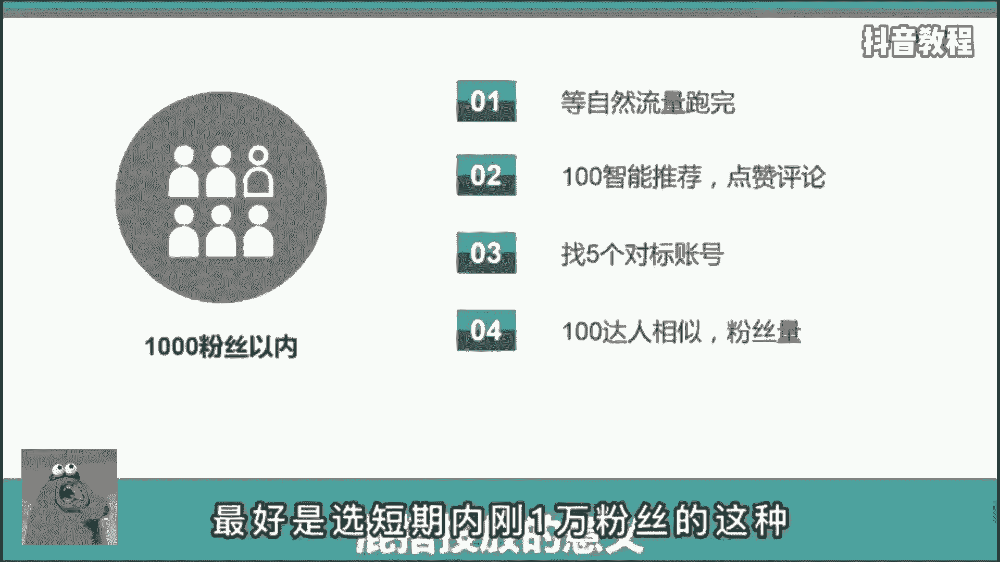
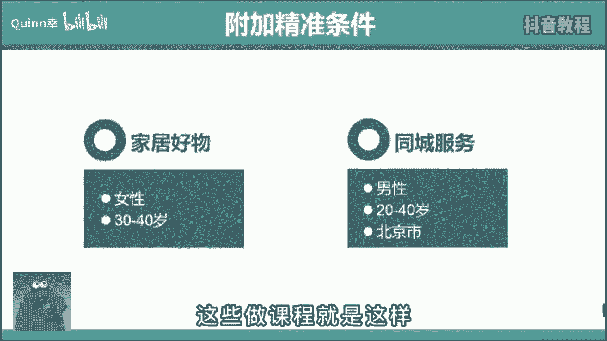
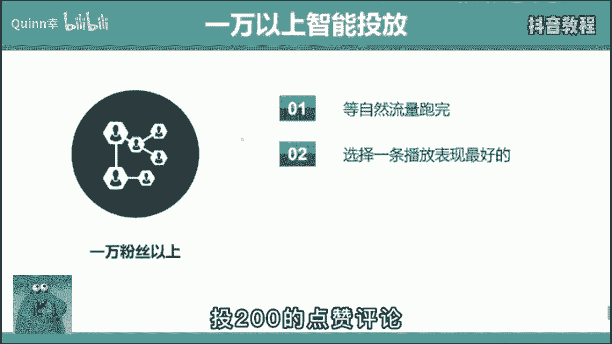

# 【抖音教程】2024年做抖音怎么快速起号？3天养出一个高权重抖音账号，掌握这7点，抖音快速养号小技巧！ - P22：运营篇丨DOU+投放技巧全攻略！ - Quinn幸 - BV1BzvPexEam

🎼专业玩家是怎么偷豆家的？首先分三个阶段。第1个1000粉丝以内混搭投放，在自然流跑完后先选择100智能推荐，选择点赞评论。

🎼跑完之后再选择5个对标账号，投100达人相似。

🎼那这里啊选择对标账号的标准，就是最好是选短期内刚一万粉丝的这种。😊。

🎼因为这种粉丝啊粘性不强，而且不在乎你是不是大号，所以呢对新号就很友好。而第一步先投100智能推荐的原因是让系统啊给你美发一下数据，点赞评论多一些，大家才更愿意多看两眼。😊。

🎼这就是利用了心理上的从重行理。🎼第二个，3000粉丝以内定向投放。🎼在视频自然流跑完后啊，直接选择投200的大人相似，同样选择短期内刚有1万多粉丝的这种。但到这里啊还没结束，你要根据自己的账号受众。

选择年龄、性别、地域等附加条件。😡，🎼比如呢你是家居好物，你就肯定啊要选女性30到40岁左右。你要是同城号的话，再加个地狱，这样呢能让你吸的粉丝更精准，加速打上标签，冲击1万粉丝。

🎼很多人啊都不告诉你这个秘密，这些做课程的就这样。那今天呢我都告诉你了。😡。

🎼第三个，1万粉丝以上智能投放。🎼在视频资然流跑完后啊，选择一条播放表现最好的投200的点赞评论。那这俩啊不投达人相似的原因是1万份基本啊账号都打标签了，你会有一个稳定的播放量，几千帮几万不等。😊。

🎼就是纯靠粉丝撑，你也有一半的播放。🎼所以此时呢破播放对你来说就不再是那种。🎼投放的意义在于，冲击热门。🎼通过热门去增粉，而不是靠洗同行的粉。🎼所以这个阶段我的建议是可投可不投。

你就专注打磨作品质量就行。🎼但是如果啊你觉得某条作品自己很满意，是呕心沥血的佳作，肯定能上热门。但结果呢事与愿违了，你就可以啊投个走家试试，让他参加个补考，也许呢还有希望。😡。

🎼那以上呢就是完整的投放策略。

