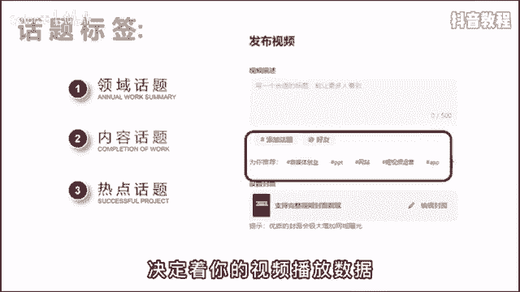

# 【抖音教程】2024年做抖音怎么快速起号？3天养出一个高权重抖音账号，掌握这7点，抖音快速养号小技巧！ - P28：基础篇丨抖音的话题标签该怎么选择 - Quinn幸 - BV1BzvPexEam

🎼话题选不好，流量少一半，很多人啊觉得话题这个功能鸡累没啥用，不重视。但我劝你啊，可别小看这个功能。这其中呢隐藏着大大的心机，用好了，能够帮助信号快速完成能启动。

因为添加一个合适的话题能够帮你带来更多的曝光机会和精准流量。一般来说啊，话题分为三类。领域话题，内容话题和热点话题。😊。

🎼领域话题用来覆盖行业大类内容话题，细分识别人群热点话题就是蹭流量的。🎼话题选择的优先级与正确与否决定了你的视频播放数据。

🎼举个例子来说，你是做某宠吃播的账号，分别对应的话题啊，就是领域、宠物日常内容、编布吃播、热点、宠物出道计划。🎼这个热点话题啊有可能是时下热电，也有可能呢是平台的流量扶持计划，需要啊你自己去找找。

但是呢你可千万别看别人用什么，你就用什么。🎼很可能啊那个热点已经过时了。🎼具体方法呢就是登录电脑版的抖音服务中心，选择创作灵感，点击创作素材，再点击热门话题就可以看到了。这里面都是时下热门的话题标签。

你可以根据自己的行业来选择，比如刚才说的萌宠，你就可以选择动植物，排名第一的就是宠物出造计划，然后点击后边的发布视频就可以自动打上该话题。😊，🎼那关于话题标签啊，另外还有两种情况，第一，你是星号旗。

则内容话题大于领域话题，大于热点话题。🎼原理呢是让系统快速精准的知道你究竟是干什么的。🎼盲目的测热点有可能啊会影响你的标签。第二是老号破圈，则领域话题大于热点话题，大于内容话题。

🎼原理呢是老后的流量比较稳定，需要通破领域的限制、破圈，获得更多的流量推荐。

🎼但是呢就算学会了这个方法，你也不要指望一定能上热门。任何的运营技巧都是锦上添花的操作，最重要的还是要打磨你的作品质量，不然呀就会像标题党一样虚有其表，会出现点开每两秒就立马关闭的情况。

你还是涨不了粉儿。🎼好了，如果你还有其他的运营问题，可以在评论区向我提问，我也正好看看最后讲什么好。😊。

