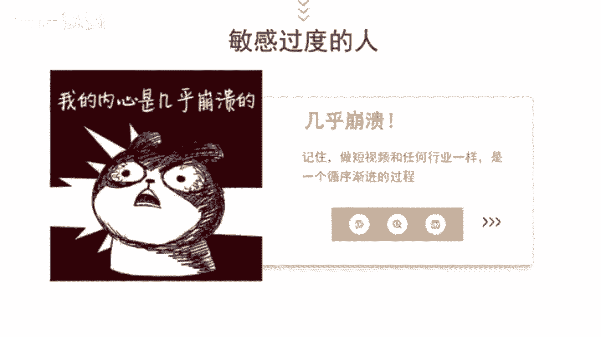
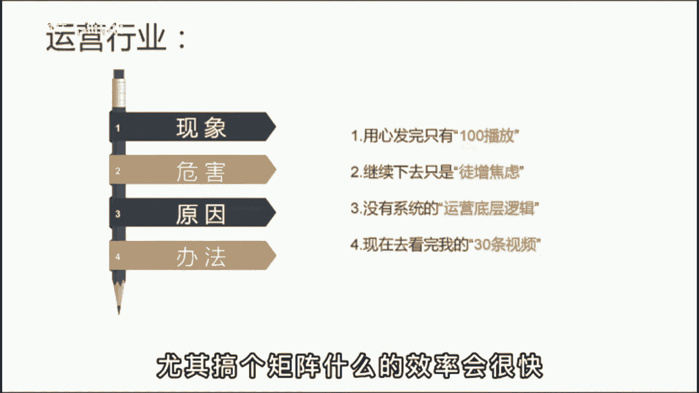

# 【抖音教程】2024年做抖音怎么快速起号？3天养出一个高权重抖音账号，掌握这7点，抖音快速养号小技巧！ - P30：基础篇丨爆款文案套路 - Quinn幸 - BV1BzvPexEam

🎼给你们经历一个爆款文案套路，各行各业谁用谁活。在这个内容为王的时代，运营者必须要具备一定的脚本创作能力。而想要拥有创作能力，我们首先要弄清楚什么是好文案。其实啊就一点记好了，要让对方认为与自己有关。

也就是所谓的引起共鸣。如果你说的我的不关心，怎么可能会有人看呢？😡。

🎼那道底是明白了，要怎么做呢？给你一个万能公式，线象加危害加原因来解决办法。🎼怎么理解呢？现象筛选用户关系与你有关就会停留危害，负则放大情绪，不让你5秒滑走原因引导继续观看，提高完播率。

最后呢给出解决办法，鼓励点赞，提升互动率。😊，🎼那举个例子来说，比如服装行业梨形身材的女孩太难买裤子，挑错了样式，显得腿又粗又短，但梨形身材呢是天生的，很难改变。而这三种裤子不仅显瘦，还显腿长。

穿上第二天就被小哥哥搭讪了。姐妹们赶快收藏起来吧。你看这段短子是不是完美契合了这个公式，开头一句话就把目标客户给锁定了，然后不断勾物团看完视频，有了这样的精争粉丝，后面变现起来呀，也很容易。😊。

🎼我们再来个运营行业，每天啊用心制作短视频，但发完只有100播放，继续下去呢，只是浪费时间徒增焦易。这跟你啊没有系统的运营底层逻辑有关。现在呢去看完我的前三条视频，不花一分钱也能学会运营制付。😊。

🎼还不快快行动起来。🎼懂了吧？用好这个套路，不管什么行业，网一套肯定没问题，都是不足30秒的短文啊。后边派遣起来呀也轻松，尤其搞个矩阵什么的，效率会很快。😊。

🎼但以上呢我已经举一反二，至于反三就交给你了。🎼你可以根据你的行业特性，把你的思考过程发出来，让我来帮你判断一下可行性。

