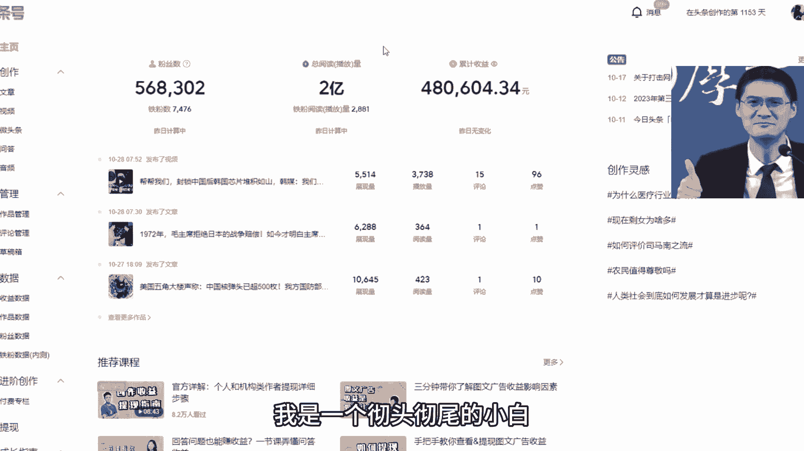
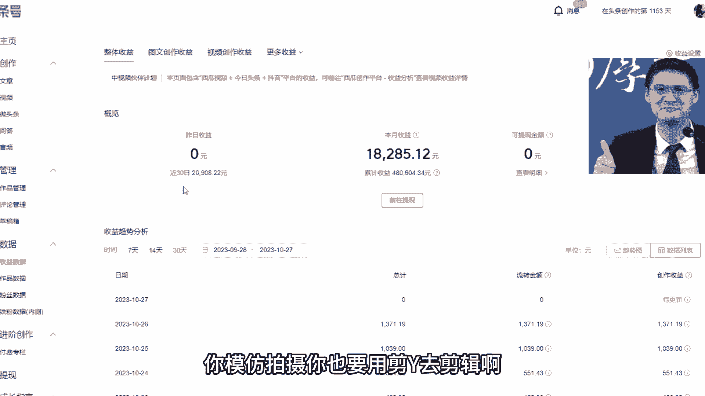
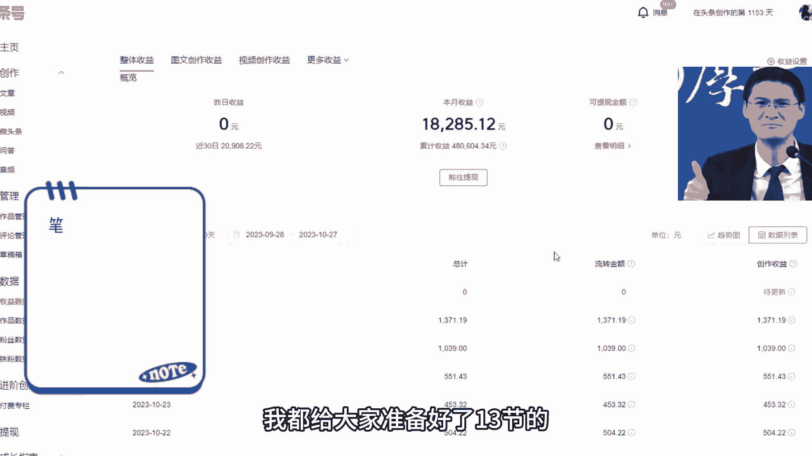

# 【抖音教程视频】(冒死上传！)新手必看：抖音运营全套教程，手把手带你玩转自媒体，运营、剪辑‘、创业全搞定！教你如何快速涨粉起号！！ - P1：一、如何快速涨粉起号 - 出发班德尔 - BV1Ti421d777

好帅呀，涨粉2000多，只用了24个小时，我这个号呢就是从零粉开始做的，今天呢我把这个方法给大家做一个公开视频，设计一些合金的干货建议啊，先点赞收藏下，就怕你想看的时候啊，找不到了，在视频的最后呢。

我还给大家准备了一份详细的教程，废话不多说，咱们直接上干货，首先在抖音首页的顶部，那个放大镜里边去搜索创作灵感，然后就看到了创作灵感的入口，我们点这个图片进入进去之后呢，我们就会看到啊。

在创作灵感里边呢，他会推荐你很多个话题板块，这些话题啊都是跟你的账号的创作标签有关的，它会根据你以往发布的作品是什么类型的，给你推荐相关的话题，那么有人说我是一个新号，怎么办啊，没有发过什么作品。

那么这个时候啊，你可以在它的顶部里边选择你所在的行业，比如说他有体育的啊，有时尚的，还有娱乐的，游戏的等等，选择你对应的板块就可以，那么在他推荐的这些话题里边儿，找一个千万级别的热度话题。

点后边的立即拍摄，那么进去之后呢，选择我们要发布的作品，选择好我们自己的作品之后，他会给我们推荐背景音乐，一般呢都是热度比较高的啊，这个时候呢我们选择第一个，接下来重点来了，选择好之后啊。

我们调一下音量，把我们视频的原声调到最大，然后我们选择的配乐调到最小，也就是说实际上我们是不用它这个背景音乐的，我们只是为了蹭它的热度，那么点击去发布呢，你就会看到来到发布页面之后啊。

它自动就打上了一个叫创作灵感的话题标签，有的人可能会说啊，你这招我早就用过了，但是我的作品啊播放量还是很低，那是因为啊你只学到了皮毛，接下来才是重中之重，就是你不要啊单独在这地方留一个话题标签。

这个地方你会在下边看到一堆，系统给你推荐的话题标签，这些标签都是非常精准的，因为抖音的算法非常强大，它会根据你上传的视频的内容，来分析你到底属于哪个标签，所以你可以从里边选择3~5个话题标签。

一定得给它添加进去，这一步非常重要，也非常关键，那么做完这一期啊，你再去发布你的视频，一定比不做这些动作啊，你的流量要大很多倍，那么有的人还说了，我就算知道你这个方法，那我的视频还是不会创作呀。

这个问题呀可就更恶心了，不过我不会藏着掖着，直接告诉大家，还记得我们一开始进入到的这个，创作灵感的页面吗，它里面推荐了很多话题，那么在立即拍摄之前呢，我们可以点击一下这个话题进到他的主页里边。

这个时候你就会看到很多相关的视频，都是这个话题下边所属的，你会看到这些视频，他的点赞量都非常高，有10万的，有20万的，那播放量肯定是几百万级别了，找一个我们自己觉得还不错的，然后进行一比一的模仿拍摄。

因为我们知道呢火锅的内容它还容易载货，这样的话我们就解决了内容创作的问题，同时呢经过前边的一系列操作，我们又蹭上了音乐和话题的热度，你的视频想不爆都难，那还有的人会说我是一个彻头彻尾的小白。

我连剪映都不知道怎么用，你模仿拍摄，你也要用剪映去剪辑啊。

别着急啊，我都给大家准备好了13节的视频课。

那这是我最近的一个收益啊，可以看到是很稳定的，大家现在开始也不晚哈。

只要有付出就会有回报的，下方给我一个三连扣六，我把整理好的笔记免费分享给大家好了。

我们下期再见，我没上车啊。