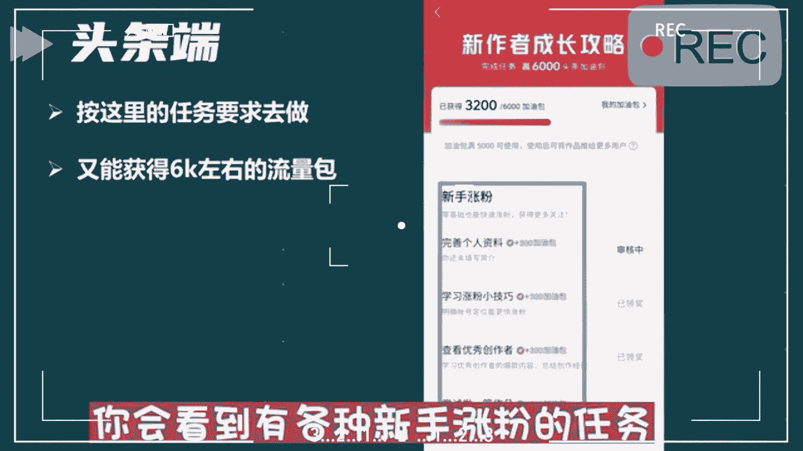

# 【抖音教程视频】(冒死上传！)新手必看：抖音运营全套教程，手把手带你玩转自媒体，运营、剪辑‘、创业全搞定！教你如何快速涨粉起号！！ - P2：二、怎么玩 - 出发班德尔 - BV1Ti421d777

这是现在唯一能够快速加入中视频计划的方法，能够让你快速达到1。7万的播放，快速开通中视频计划，为什么我说唯一呢，就是现在你可能看到市面上有很多人告诉你，各种各样的方法去通过中视频计划。

但是啊这里边大部分都是坑，你真的去用了，你会发现按照他说的做呢，要不然就是通过不了，要不然就是通过之后呢，平台找你秋后算账，所以很多人他不知道，又想着快速达到1。7万的播放，快速加入，所以呢就会去踩坑。

今天我给大家带来了唯一的这个方法，为什么说它唯一的就是，因为它是通过官方的渠道去实现的，那么下面啊废话不多说，咱们直接上干货，建议点赞收藏一下。

首先呢我们打开我们的西瓜客户端，然后呢在右下角我的这里边呢找到创作训练营，我们点进去，那么进去之后你会看到有一个去学习的入口，就在最下边，当然我这边已经学习过了，显示的是已结束，那么作为一个新号新手。

你还没有通过中视频计划，你这个地方呢一定是去学习，然后呢点击去学习，在这个页面呢可以学习官方的这些课程，学完了之后呢，提交作业，一般只要你踏实去做这个作业都能够合格，那么这个时候你就拿到了1万个流量包。

注意这1万的流量包可以直接用于作品的投放，那么接下来第二个呢就是头条，注意咱们换了客户端了，这会儿呢要进入头条里边，然后呢也是点右下角，我的里边呢有个创作中心，点到这个创作中心里边之后呢。

你会看到有一个新作者成长攻略这样的海报，我们点一下这个海报，那么进去之后你会看到有各种新手涨粉的任务。

那么这些任务加起来就有6000左右的流量包，那么这个流量包啊，也可以直接用于我们作品的投放，这样的话这两个端口，你完成这两个任务加起来就有1。6万的播放，最后还剩下1000的播放器。

随便发几张作品就能达到了，你们还会觉得加入中视频计划审核，那1。7万的播放有多难吗，知道了这些你是不是觉得它非常简单呢，好了，其实关于操作中视频啊，现在真的不是说随随便便去操作。

就能够达到一个不错效益的时候了，现在必须啊专业的事情用专业的方法来做，你必须要有一个系统的思维，系统的方法去操作中视频，才能够在这个赛道闯出自己的一片天，如果你对中视频计划比较感兴趣的话。

可以中视频为大家准备好了，关于操作中视频各种各样的问题，比如说中视频计划它到底是怎么样一个逻辑，那么新号和老号去操作中视频的时候，应该注意什么，它有哪些坑，他应该怎么做选题等等啊，这些呢都有涉及。

如果大家还有关于中视频其他的问题啊，也可以评论区留言，咱们一起探讨好了。

