# 【拼多多推广】新店老店都应该了解的获取曝光80000+的微付费推广方法，订单稳定，投产更高，拼多多基础运营付费教学， - P1 - 老头电商-干货分享 - BV1k1xEeLE7u

🎼很多人做拼多多啊无非就两个问题，强付费没有利润，自然流量做不起来。那么你想在拼多多中生存下来，你就必须要学会怎么去做维护费才能获取大量的流量以及稳定的利润。你们所看到这个店铺就是按照微付费的操作来的。

只有说做到了这种程度，你才能说做好了拼多多。当然想做维护费肯定是有一定方法的，同时也要看链接是不是可以去做维护费。第一个我们当然是要去测试链接的。直接用我们的链接去开车，设置为保本投财。

限额200的去跑，观察数据，只要我们的200限额花的越快，那我们链接承接自然流量能力就会越强。同时你的剩余自然单量也会更多。如果说你的跑不动，那你就考虑去优化链接，或者说换其他玩法也是可以的。

其他的玩法我也整理好了，可以看我一键三连都可以在评论区领取。再接着讲回来啊，首先呢我们要去做微付费，先要了解它的底层。

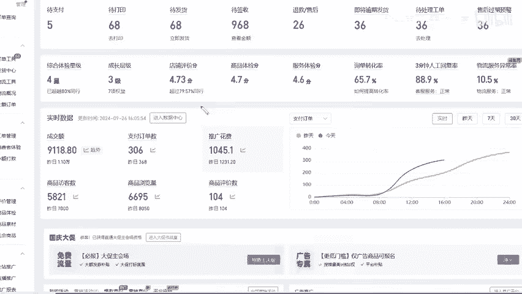

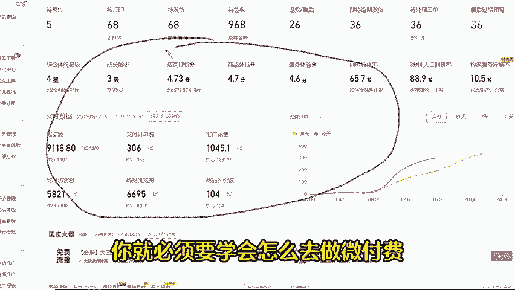

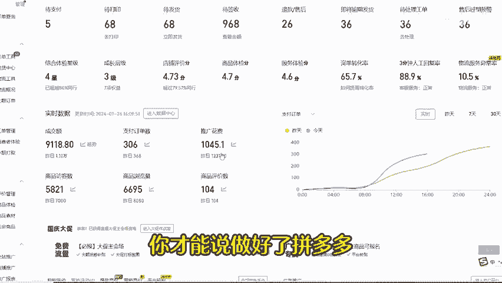

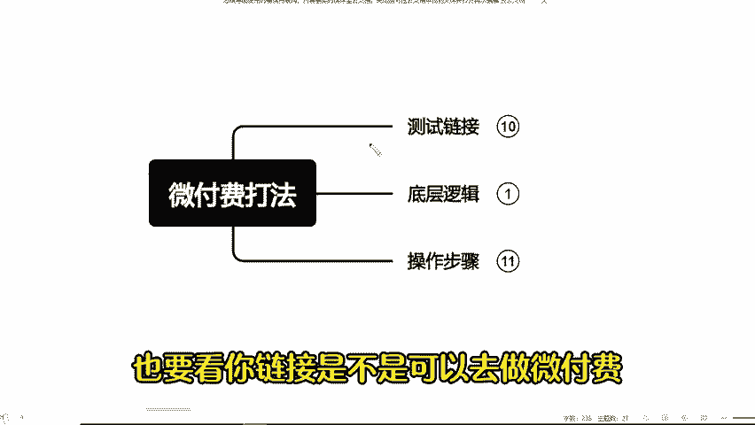

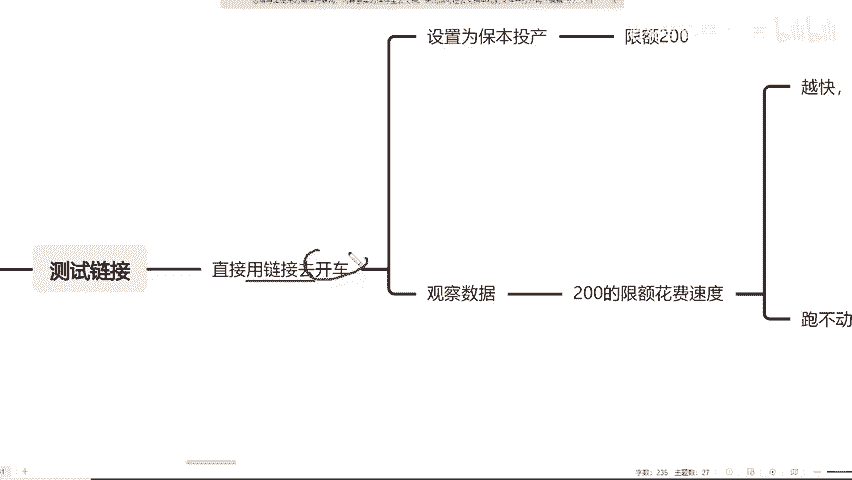

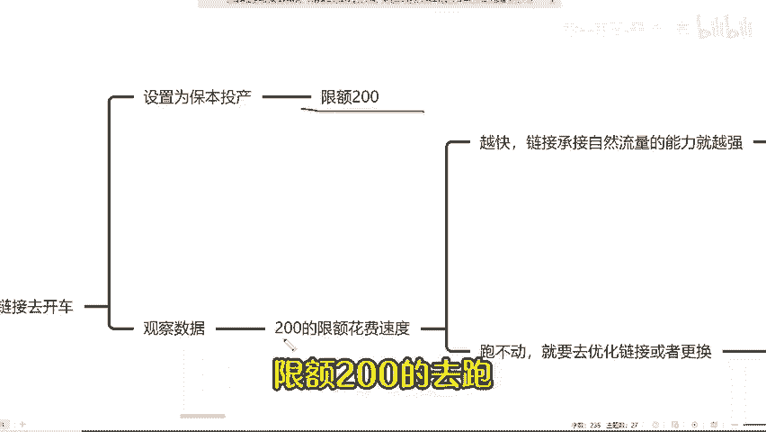

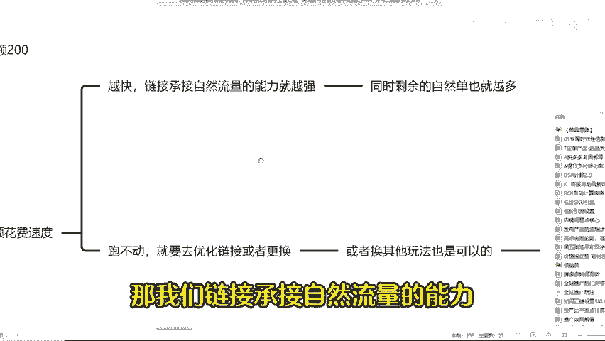

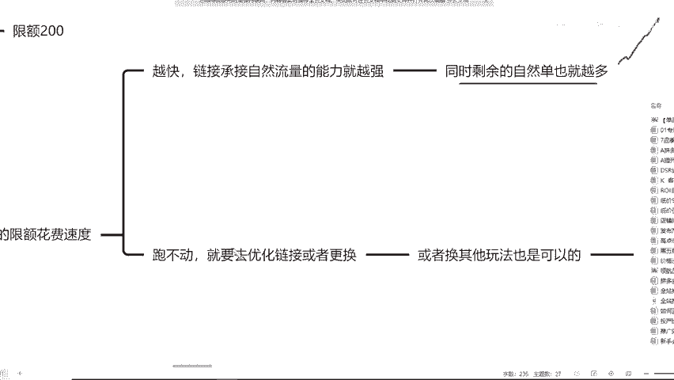

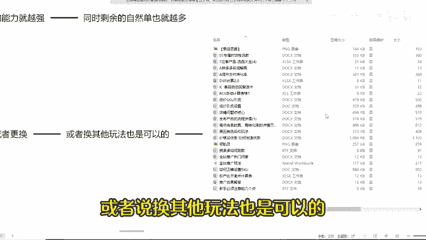

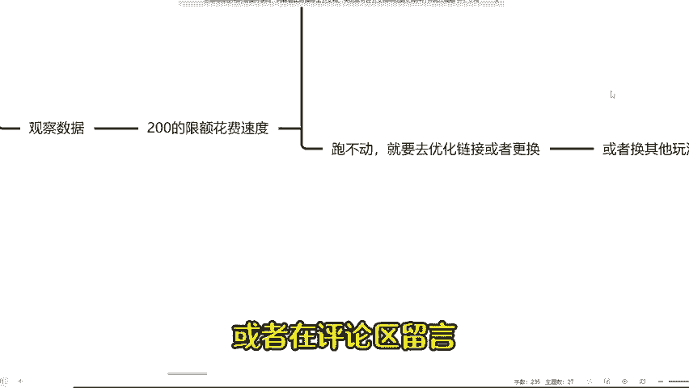

🎼其实很简单啊，就通过获取付费流量的同时，能承接住一部分的自然流量，基本上我们能达到付费的30%的自然栏，就差不多完成了我们的微付费的玩法。跟我们以前玩的那种卡高投产的玩法是很相似的。

因为主要就是体现为投产会比较高，怎么操作呢？第一个我们首先要偏低的投产值也就是大概50%左右的保本投产，全天开支同时不限额不卡自然流，用两天的时间让链接尽快的入职，同时尽快的激活链接。

接着我们在第三年的时候就开始做递增投产。保持在10%左右去做递增。那我们递增到什么程度就可以停止呢？第一个上限加到3倍保本投产的情况下就不用再加了。如果说你想快速拉升，也可以用15%去做递增。

你不用担心它会被锁投产也不用担心它会断流。为什么呢？因为这个里面付费就是付费的流量，自然就自然的流量。

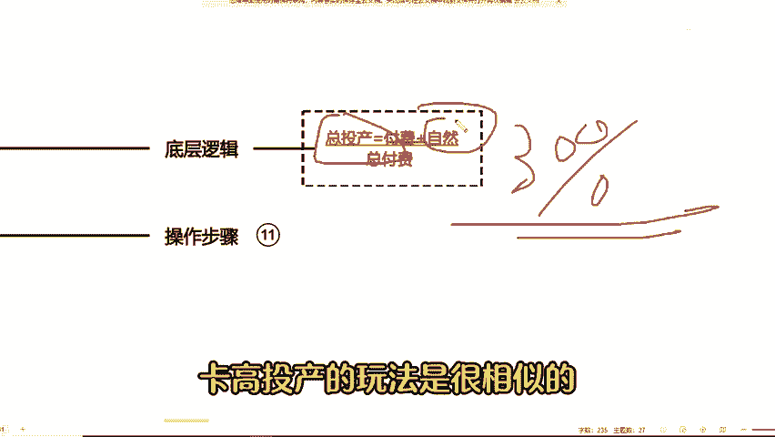

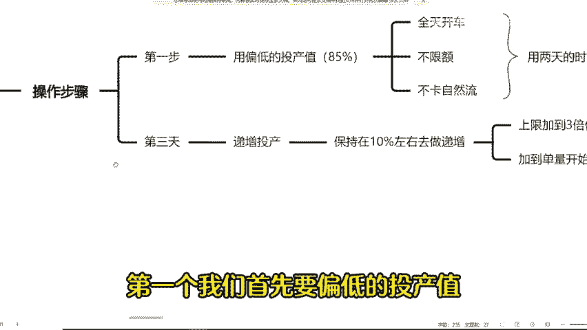

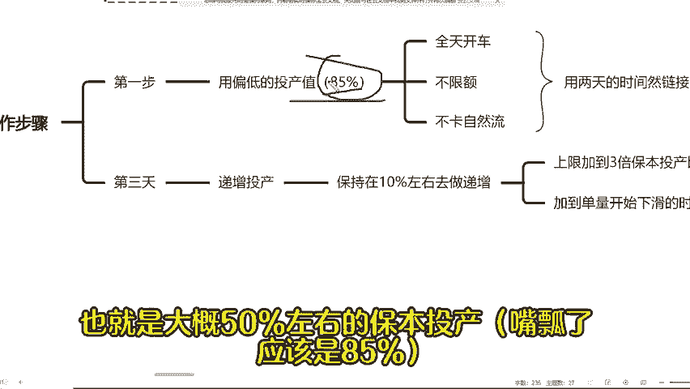

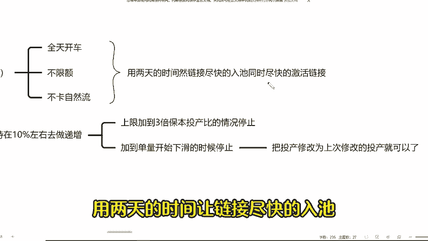

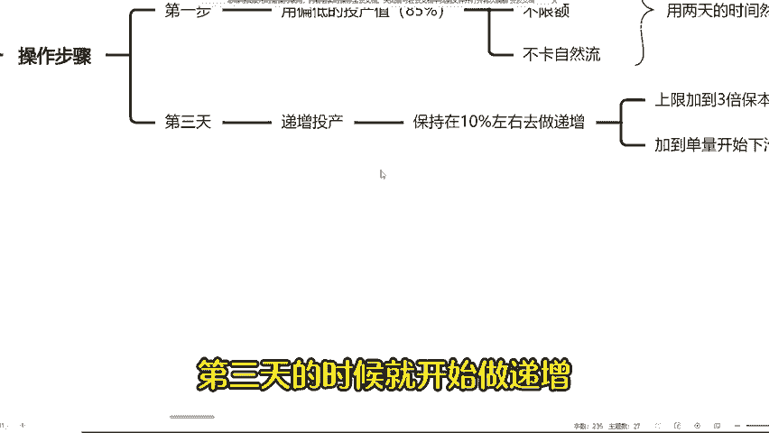

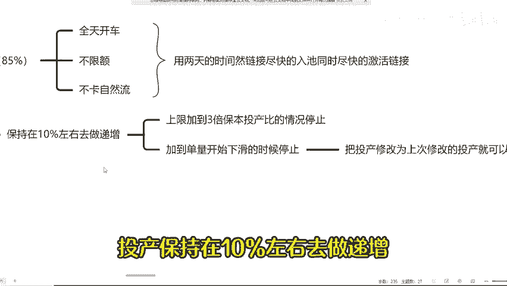

🎼所以说你自然进入到付费的阶段，它会帮助你解锁投产的上限，就算被锁了，也能快速的解开。而断流就更加不可能了。因为这边的自然大部分是不吃付费的，所以大部分也是吃不到的。第二个呢就是加到单量开始下滑的时候。

为什么呢？因为当你的投产值，比如说明明我能够开到保本的2。5倍。那我们现在把它开到2。8倍了，那的单量肯定就开始下滑了。这个时候下滑的单量里面，其实是付费单量不是自然单量啊，自然单量是不吃这个投产值了。

其这个投产值只是付费，所以投产过高，而这份付费的流量进不来，它出现下滑，我们需要把投产改为上次修改的投产就可以了。按照这个方法，只要说链接能够稳定的话，就没有什么问题了。好了，还有什么不懂的。

可以关注我。

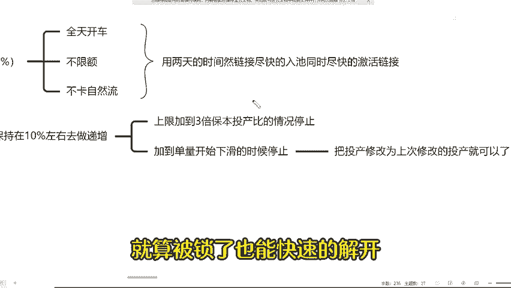

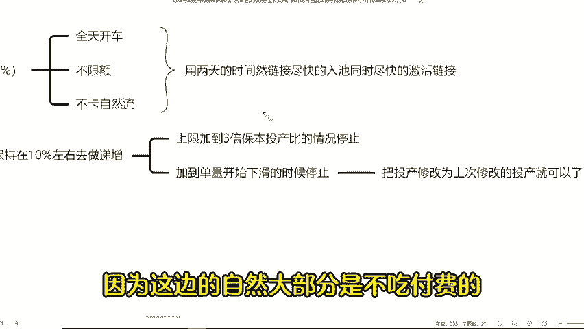

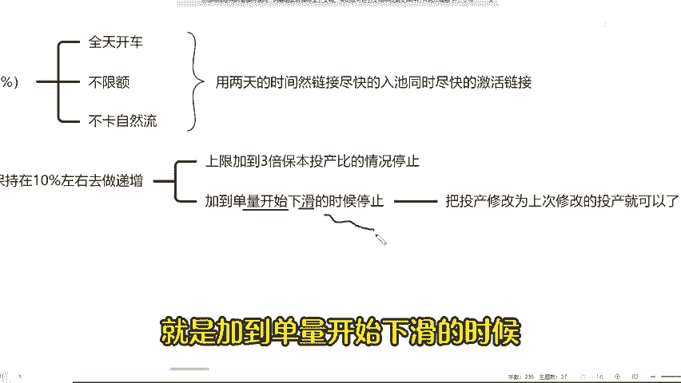

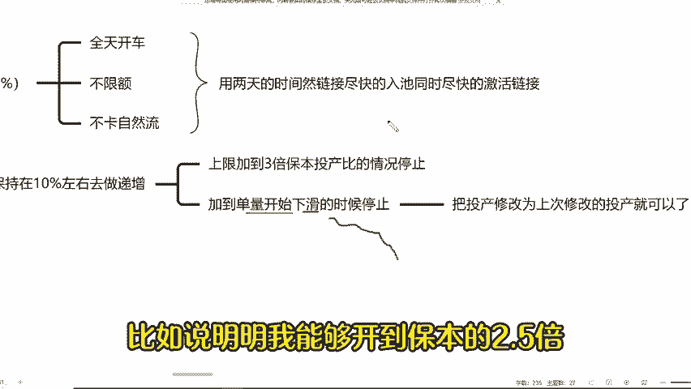

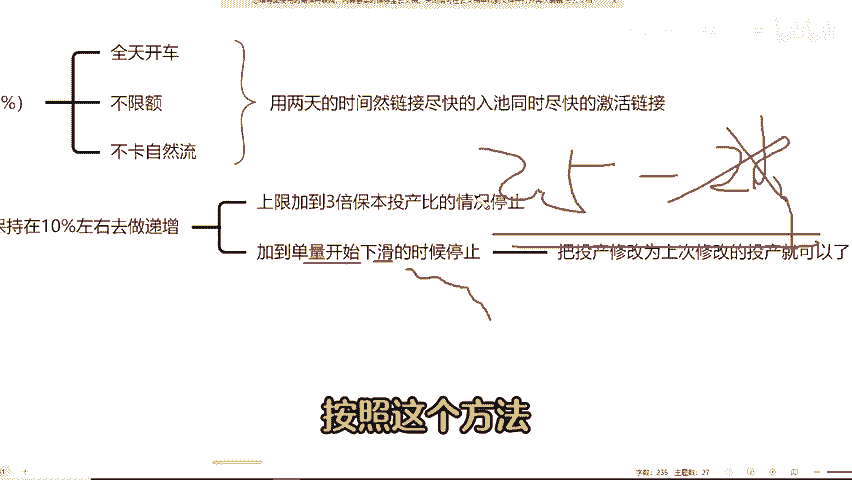

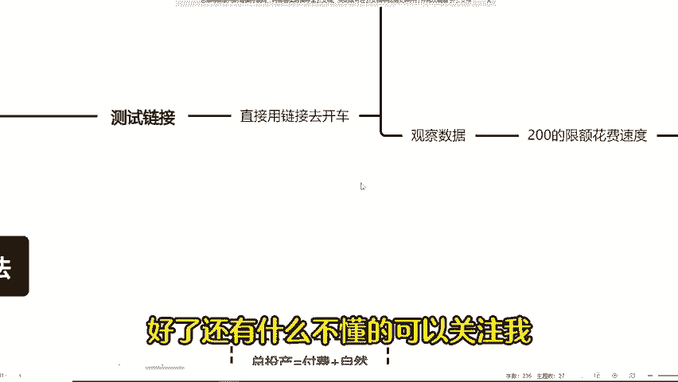