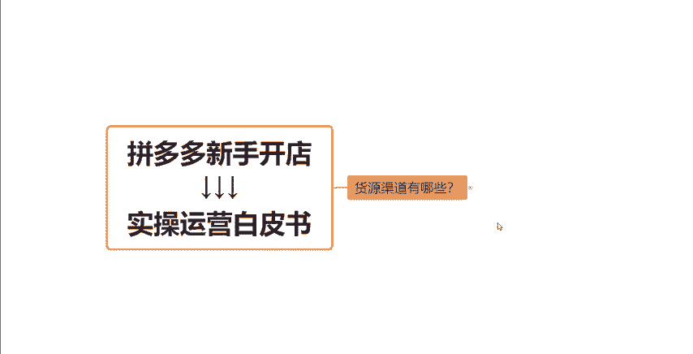

# 【拼多多运营】2024年最系统的全套拼多多运营教程，适合所有拼多多开店新手小卖家自学，10年资深运营师手把手教你从0到1起店实操。 - P10：10-货源渠道有哪些？ - 拼多多运营教程_ - BV1H62ZYREs4

hello大家好，我们今天呢继续来聊一聊关于我们拼多多新手开店实操运营白皮书系列课程当中的这一个呃货源渠道这一期视频啊。那么之前呢跟大家讲到了我们的这个选品的渠道，对不对？那今天我们讲讲货源的渠道。

因为有很多小伙伴在开店之前呢，都会纠结到一个问题，就是哎我自己呢不没有厂家，对吧？我自己也不是厂家，那我也没有这种呃自己这这些供应链这些线下的一些货源，对不对？那我在这种情况下，我想开一个网店能不能做。

其实是也是可以做的啊，因为有非常非常多的商家啊，他们做的都是这种一键代发的一些形式啊，来完成店铺的运营的。当我们的产品销量啊，就是我们整个店铺的销量，有一个比较稳定的一个出单之后呢，我才会去考虑说。

哎我自己要不要自己去打版，自己去做货，或者说我自己去囤一点货，或者是跟厂家在。

谈一下更深层的一些合作啊，对不对？那毕竟如果说我们自己的一个工厂，我产品情况都不清不楚的，然后我就去拿一批货，或者说囤一点货放在这，我就去卖，对不对？那如果是卖卖完了还好，如果说卖不动呢。

是不是这种东西啊，它无形之中就是对于资金来讲，非常非常大的一个压力。所以说这一点大家可以注意一下，如果说你自己不是本身不是工厂不是这个供应链，或者说你没有这种好的这种产品的话。

那你就先从一件代发去开始做这个店铺，好不？那一件代发的话，哪些这个货源渠道可以找到我们想要的一个货源呢？今天这一期视频呢，就给大家完全的整理了一下，来我们来看一下啊。

其实在这个拼多多上，大体的这个这个商品的类目啊就分为这些点，对不对？服装、玩具、车品、包包、配饰、鞋、鞋帽、鞋子、泳衣、包包、百货、五金化妆品。其实这已经涵盖了大部分就是这个类目啊。

也是非常推荐里面就是没有自己没有自己没有货源的商家小伙伴们啊，你们做一件代发的话，就可以先尽量的去选择这里面的这些类目来去做啊。呃，因为有非常多的产品，非常多的商家在这些类目在这些平台当中都有去入驻啊。

首先第一个，如果说你想要找一个综合平台呢，1688这个东西，我相信很多小伙伴都是耳熟能详的，对不对？都非常清楚了。那么在这个平台里面呢，你可以找到一些呃带有这种牛头标的一些呃就是等级比较高的这种。

厂家啊比较资深的厂家去找他们的货源来做。因为像这些呃找这些工厂的话，就不用担心一些。比如说库存问题啊，或者说质量问题啊，或者说发货问题啊，这些你是不需要太过于去担心的，理解吧？

那如果说你是打算去做这个服装啊，还有做玩具或者说做车品的话，你可以去关注一下货捕头这个网站啊。货普头上面呢也有很多的一些产品啊，包括说服装啊，玩具啊，车品啊，其实都有的。那么质量呢也是还不错的啊。

包括说整个的这个服务流程这一块也是比较完善的，它也是属于一个呃早期的一个货源网站的啊。那还有如果说你是想要做服装包包配饰的啊，做这个类目的，大家可以去看一下四季星座啊。

四季星座是杭州那边的一个就是很大的一个批发市场啊，也是杭州那边的一个货源啊，这一块的话就是杭州的货啊在价格方面来讲，如果说有了解过广东货的这个小伙伴呢。

杭州货从价格方面来讲会比广东那边的稍微的高一点点啊。但是一般来讲，杭州的他们的商品的质量来讲会更好一点点。好吧，那如果说你是打算像做一些服装啊，做鞋子这一块的话，可以去考虑一下这个收款网。

可以去看一下收款网。收款网呢是广州的一个货源网站啊。然后他们那边的一个货源呢，基本上也全部都是广州货源啊，广州货源的。啊，但是呢就是刚才是刚刚刚才跟大家讲的那个点，就是同类型的商品啊。

或者说是同价位的商品。我个人还是会觉得杭州这边的货源会稍微的好一点点啊。当然如果说我们在拼多多这个平台上去做这个店铺嘛，对不对？呃，我如果说打算去做一些客单价比较低的，卖的比较便宜的这个产品呢。

我肯定还是说从这个货源的成本上，我可能会稍微的去控制一点，我尽量的找这种成本稍微低一点的这种产品来做，对不对？好吧？那除了其他的除了这个收款网之之外呢，像其他的，比如说我如果说是想要做服装，做鞋帽的话。

我可以去这个网商源啊。

网商员这个平台上去这个去看一下。那如果说我是打算做鞋子的呢，做鞋子，你们可以去开箱网和构图网这两个网站上去看一下啊。他们那边的一些货源啊，包括一些皮鞋啊，包括一些休闲鞋啊，都还是非常不错的啊。

如果说你们打算做泳装的话呢，可以去有多网上看一下啊，有的网可以去看一下。

然后做包包的话，包包如果说有了解过的小伙伴应该都清楚啊，像包牛牛这个网站还是比较的有知名度的啊，还有这个17网这两个网站都是知名度算是比较高的一个网站的啊。然后包牛牛本身就是白沟那边的一个货源网站啊。

包括产品啊，包括款式啊，包括价格啊，都还是可以的啊，都还是非常不错的。可以考虑一下啊。

如果说你们想要做百货呀、五金啊这些类目的话，你们就去义乌购啊，去义乌购上去看一下就可以了啊。当然义乌购上还有很多其他的一些小商品都是不错的啊，你们也不一定呃局限性不一定那么强啊，都可以看一看。

那如果说你是想要做这种化妆品的话呢，你就去这个个秀名装上去看一下啊，这些都是非常不错的啊，以上给大家分享的这些网站呢都是作为货源网站来讲当中啊，还是就是从产品的质量方面，从产品的价格方面来讲，都是。

比较不错的啊，我才会去分享给大家的。所以说大家可以根据你们自己想要做什么产品，做什么类目，去找到对应的网站，找到对应的会源网去看一下就可以了。基本上在这些网站当中。

基本上能都能够找到你们想做的这种产品的。好吧，那如果说还有想要其他的一些具体的这个链接地址啊，包括有遇到其他的一些问题啊，大家都可以在评论区来找我跟我交流沟通一下啊，然后这一期的视频就跟大家分享到这。

感谢大家的一个观看。

