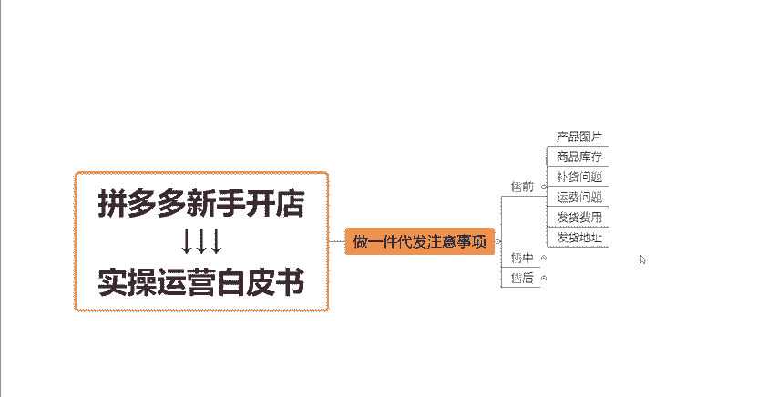
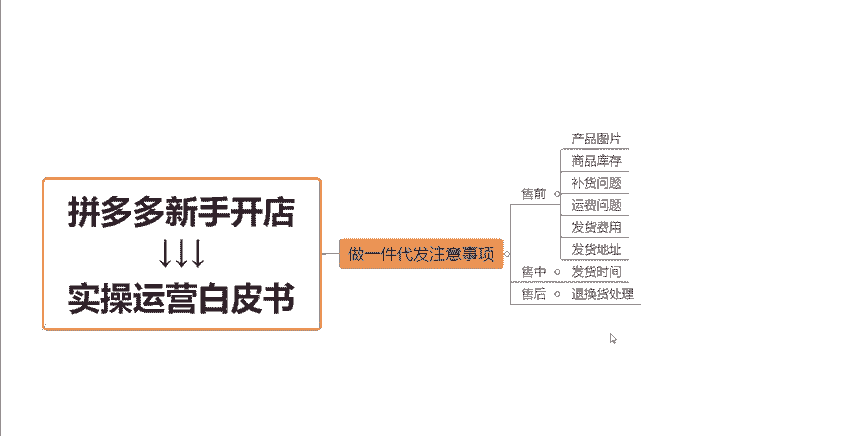

# 【拼多多运营】2024年最系统的全套拼多多运营教程，适合所有拼多多开店新手小卖家自学，10年资深运营师手把手教你从0到1起店实操。 - P11：11-做一件代发注意事项 - 拼多多运营教程_ - BV1H62ZYREs4

hello，大家好。那么今天呢我们继续来聊一聊关于我们拼多多新手开店实操运营白皮书系列课程当中的这一个呃这一期课程啊，今天要跟大家分享的是关于我们做一件代发的小伙伴。

在做一件代发的过程当中需要注意的一些问题啊，有非常多的小伙伴呢在这个坐店的过程当中会遇到一个问疑问啊，就是我现在呢要在网上找这个一件代发的这个货源去供货，对吧？那我在上架产品之前呢，我在卖东西之前。

我需不需要先跟这个货源渠道跟厂家去达成这个有效的交流沟通，对不对？我是不是可能说哎能够拿到更多的优惠呢？这些东西啊，其实这个完全没有必要的啊，为什么这样讲呢？因为我们绝大部分的网站啊。

包括那些货源网站啊，他的这个实际经营者，并不是厂家也不是老板啊，而是说线线下有这么样一帮人啊，他是把所有的这些货源去进行一个汇总。

总和，然后去放在这个网站上啊，呃放在网站上之后呢，他就根据我们平台的一些这个代发的一些商家啊下单的一些情况啊，然后去采购去发货的那同时呢他们可以收取每笔订单，他们可以收取一个什么打包的这个服务费啊。

那同时他们的这个快递成本的话，因为他们的这个单量是很大很大的，肯定是比我们这种小卖家来的大的。所以说他们的这个快递成本，他们也可以压的很低啊，但是呢因为我们是散货嘛，对吧？我们前期在坐店的过程当中。

订单肯定不会特别的多。所以说。

呃，在快递费这个方面呢，我们的一个差价呢就会比较高一点啊，就会比较高一点。🤧嗯。所以如果说你们想要找平台去沟通的话，你在前期没有太大的一个体量的情况下，嗯。

是基本上不会就不可能说拿到一个特别好的一个优惠的，对不对？因为你本身在没有体量的一个情况下，人家为什么要去给你这些优惠呢？为什么要愿意去给你这些帮助呢，对不对？说白了打铁还需自身意，是不是？

所以说一般情况下，我都是要求大家说我们前期先正常的去经营。然后能够体量了之后呢，我们再去考虑说哎呀我跟这个厂家去谈一下啊，跟货源方去谈一下，对吧？从这个呃产品的成本啊，供货的方面的一些问题啊。

再去谈一下，看看有没有更多的一个优惠，好吧？那么说到这里呢，就是我们在日常的运营过程当中，如果说我们去做代发，到底应该注意哪些方面，对不对？那么根据我们销售的这个状态不同啊。

其实是有一些不同的一个点呢比。

比如说啊我们把它分为了售前售中售后。那首比如说售前啊，首先第一个点就是我们上架产品之后，我必须先要搞清楚这个图片的情况，对不对？这个图片呢，他是这个厂家自己拍的，对吧？就是他们有没有这个图片保护。

他们有没有这个图片的这个原图呃，如果说是呃他们这个原图是他们的话，那么我们去上架之后，他是允不允许我们去上架的。如果说能够允许我们上架啊，这就没有问题。如果说他不允许我们上架，不允许我们用他的图片的话。

或者说这个图片的原图，也不是他们的那我们上架之后是会有可能图片会被投诉，会被投诉下架的，理解吧？

所以说我们在上架产品的时候需要去注意这个图片这个点啊。然后还有呢就是我们的这个产品的这个库存方面也要去沟通好啊。正常情况下呢，我们在做店铺的时候，比如说我们要主推哪一款商品，对吧？

我一定要搞清楚这个产品它的库存量怎么样，对不对？如果说没有一个稳定的库存的话，哎，万一我们的这个产品起样的，卖爆了啊，哎厂家那边没有货了，或者说货发不出来了，这个是非常非常严重的啊，一旦你哎卖断货了。

到时候一大批货在你的后台发不出去了，这个对你店铺的这个影响也是很大的啊，也是很大的。那如果说遇到了这个断货的问题，对不对？缺货了，那么正常情况下，你还需要去搞清楚，就是厂家它从生产到出货这个过程。

它的这个时间周期是多久，对不对？我们把这些东西搞清楚了之后呢，就方便我们后续啊在。去进行一个这个库存的一些设置啊，去进行一些发货啊等等这些东西，我们就会有一个更好的一个把控的，对不对？

那还另外一个呢就是运费方面的这个问题啊，呃不同的产品，不同的平台，他们的这个运费呢其实是不一样的那包括说我们发到不同的地区的运费也是不一样的。所以说我们在产品上架之前呢，我们要跟厂家那边搞清楚，就是。

产品这个产品它支持配送，就是支持包邮的地区有哪些。然后不同的地区它的这个运费啊有没有差异，差异是什么样的？因为拼多多这个平台啊，它本身是一个默认包邮的一个平台。所以说大家要去搞清楚这个点。

然后合理的去做这个做我们的这个运费模板啊，去包括做我们的这个产品的一个成本啊，定价这些东西，理解吧？啊，然后下面这一个呢就是发货的一个费用的问题啊。就像我刚刚跟大家讲到的，因为很多平台呢。

他们都会针对于订单收取一个什么打包发货的一个服务费啊，那这个服务费到底是多少，对不对？高不高？如果说这个服务费比较高的话，那也可能会影响到我们产品后面定价的这个问题啊，我们就呃如果说服务费太高的话。

我们就肯定要去更换啊，要去替换一些其他的这种货源替换一下其他的这种渠道了，对不对？那最后还有一个点呢，就是发货地址的一个问题啊，因为我们做的是一件代发啊。我们产品在发货过程当中。

平台它会考核到我们物流的这样的一个情况，对吧？所以说我们的这个发货地址啊，就是我们店铺后台设置设置的这个发货地址，要跟厂家那边的发货地址是保持一致的。

知不知道你要去把就是去问厂家问清楚他们的发货地址是哪里，让他发给你。然后你在你的。店铺后台把这个地址设置好就可以了啊。如果说你的这个发货地址跟就是买家收到之后。

发现哎你的店铺写的这个发货地址跟实际他发过去的那个地址不一样的话，会容就是有可能会引起投诉的啊，如果引起投诉了之后呢，对于我们的店铺肯定也会有很大的一个影响。还有可能会导致我们店铺的一些降权啊。

或者说赔付啊，这些这些其实都是没有必要的。理解吧？所以说以上的这几点几个点，这些东西我们先搞清楚之后，我们再去运营，再去操作我们的产品，理解吗？

然后售中这一块呢，就是主要是我们的这个产品的发货时间啊，你要去跟厂家那边沟通清楚，就是呃这个产品的发货时间到底是什么样的。比如说我在他的这个店铺，我在他厂家这边下单了之后，他是多久之内可以发货。

是24小时之内可以发货呢，还是48小时之内可以发货，又或者说是哎什么呃72小时啊等等。这个具体的时间，你一定一定要问清楚，然后你还要去问一下厂家那边就是一般情况下，哎，比如说每天结单的时间是几点，对吧？

就是呃一般来讲呃作为这个商家来讲啊，比如说每天下午之前的这个订单，我可能说当天都能够保证发出去，对不对？所以说你也要问一下厂家那边就是每天结单的一个时间是几点。这个对于你后台的一个设置啊。

就是你因为我们在商家产品的时候，是需要设置这个发货时间。的发货周期的。所以说你这个发货时间也要跟厂家那边的发货时间保持同步的，知不知道？如果说这个东西啊。

就是如果说厂家那边没有办法给你完全保证做到24小时之内发货的话，就建议大家尽量的去选择48小时之内发货来去维护啊，维护一下我们店铺的这些权利权益啊，利益啊等等啊。

因为拼多多对于这个发货这个是管控的很严格的。发货超时的话，每一单都会要赔付的啊。别到时候做下来，钱没赚到，还赔了不少，对不对？嗯，那么与此同时呢，最后一点就是我们的一个售后的一个问题了，对不对？

售后这个问题呢也是很关键的一个问题啊。比如说。

呃，我们遇到了这个退货啊，遇到了一些其他的售后问题，我们应该怎么去解决，对不对？呃？这个呢我们就要去厂家那边沟通好啊，厂家来帮我们去协调来处理，对不对？如果说有换货，有退货的话。

那我们通过什么样的一个方式，通过什么样的一个地址啊，把这些产品给厂家这个送回去。那我们应该怎么去填写我们的一个店铺信息啊，和我们的一些联系人的一个信息来确保就是我这个订单退回之后啊。

不会说是因为啊这个订单的这种信息不明确啊，或者说地址不明确，导致说哎这个货物退回来，退丢了啊，或者说没有办法跟踪到，然后造成了这样的一个货物的一个损失。这些都是得不偿失的，知不知道？所以说这些东西啊。

你们都要去搞清楚了，搞清楚这些之后ok那么我们就可以呃正常的去进行销售了啊。那么在销售的时候一定要记住一个点啊，就是你们大家一定要实时的去接。

控一下这个产品的一个发货情况啊，实时的去根据呃厂家他们的一个库存情况去做我们的这个链接的一个调整。如果说商家那边啊这个链接已经下架了，对不对？或者说库存已经没有了。

那么okK第一时间我们要在自己的店铺上去做对应的一个处理，知不知道？如果说是啊就是上家他的一个发货时间比较长的话，那我们也要第一时间的去联系我们的这个买家啊，去做出一些调整啊，去跟他沟通。

比如说呃能不能够等啊，或者说要不先申请退货啊，或者说一些其他一个操作啊，来避免来减少一下我们店铺的这种损失，知不知道？如果说呃没有及时发货的啊，如果说是可以发货，但是没有及时发货的话。

我们第一时间呢就要去呃去把我们的这填写我们的这个订单编号，然后去发货啊，减少这个物流方面给我们带来的一个损失。知不知道？那以上呢就是我们做一件代发这个方面需要注意的一些事这个事项啊，注意的一些点。

售前售中售后这些所有的店全部跟你的这个货源方跟你的这个厂家沟通好，沟通清楚之后，你再来上架产品来做后续的一些操作。好吧，那么这期的视频就先分享到这啊。如果说大家还有一些其他的什么问题。

大家都可以在评论区找到我来跟我交流沟通的，感谢大家的一个观看。

