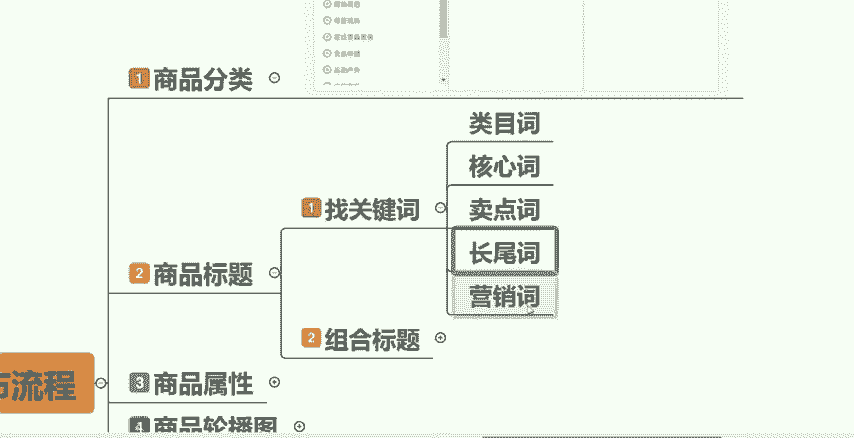
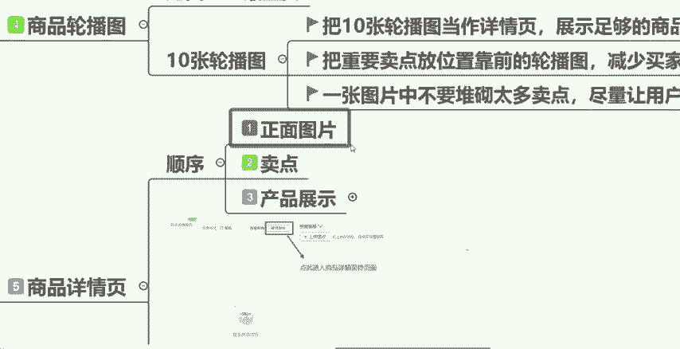

# 【拼多多运营】2024年最系统的全套拼多多运营教程，适合所有拼多多开店新手小卖家自学，10年资深运营师手把手教你从0到1起店实操。 - P12：12-完整商品发布流程 - 拼多多运营教程_ - BV1H62ZYREs4

hello，大家好。那么今天这一期视频呢还是要跟大家讲到关于我们拼多多新手开店实操运营白皮书系列课程当中的这样的一期视频啊。

今天这期视频跟大家分享的是关于我们完整的一个商品发布的一个流程操作是什么样的啊。今天这一期视频会跟大家讲清楚。O那么其实发布商品这个操作啊是挺简单的，基本上就分为这两个点来跟大家讲清楚。

一个是发布商品的一个路径。我们一个店铺当中商品发布在哪里呢？其实很简单，找到这三个地方。第一个拼多多的商家后台，你打开找到商品管理。第三个发布新商品就可以了。就是这样的一个发布途径啊，这个没有太多的。

可以跟大家讲的，来跟大家讲一下具体的发布的一个流程。好吧，基本上就这9样东西啊，这9项东西，大家记清楚，一步一步的来听我讲就好了，好不好？然后第一个点啊，我们的商品分类。大家可以看一下这张图啊。

你点击了发布新商品之后呢，大就会让你选择一个。

你的产品属于什么样的一个分类，分类里面分为了很多啊，比如说我们的家居生活、数码电器、美容各户服饰鞋包，然后这是一级分类啊。同样的，你点完一级分类之后，它还会有二级分类，还会有三级分类。

每一个不管你做的是什么产品，它都会给你分到很细致了，知不知道？所以说这一个点大家记出记清楚一个东西就可以了。我们的商品分类一定要选择正确，不要选错了，好不好？如果说你这个商品分类选错了的话。

对于你后期想要获取精准的流量是很难的。好不，这是第一个点啊。然后第二个点，我们商品的标题，商品的标题这一期呢就是这一节课呢不会跟大家细致的去讲，我主要是跟大家讲两个点，一个是找关键词，一个是组合关键词。

那么具体的去哪找找哪些，以及到底怎么去组成，一个是我们最好的一个商品标题，我会放在后面单独哪一节课程来跟大家讲清楚，好不好？那么这一期视频我先简单的跟大家讲一下一个好的商品标。

它会给我们带来更大的一个曝光，然后会帮我们找到更精准的目标用户，那么也会来提升我们的点击。然后第一个点找关键词。其实我们拼多多当中啊关键词基本上就分为这五类关键词，一个叫类目词，一个叫核心词。

然后叫卖点词跟长尾词跟这个营销词，先跟大家分别讲一下这五个分类，它的一个具体的是什么意思啊，首先第一个什么是类目词呢？比如说我们做的是什么女装，或者说我们做的是连衣裙啊，或者是我们做的是半身裙。

或者你做的是什么牛仔裤。那么像这样的就是你做的是什么产品。那么你的类目词就是什么？好吧，这是第一个点。第二个什么是核心词呢？你产品的关键的核心词，就叫做比如说你是卖裙子的，对不对？

但是裙子当中有很多的分类，你卖的是什么样的一个裙子呢？比如说你卖的是这个什么毛呢短裙，对不对？那么这个就叫做你的产品的核心词，能不能够理解？第三个点卖。

点词卖点词顾名思义啊，就是你的产品它有什么样的一个特点，有什么样的一个卖点，对不对？比如说你卖的这一个衣服，它是高腰的啊，卖的这个裙子，它是高腰的啊，又或者它是显瘦的，对不对？显瘦，啊。

又或者它是修身的，像等等这样一系列的就是形容你产品卖点的关键词，它就叫做卖点词，这个应该很好理解啊，然后第四个长尾词，长尾词是什么意思呢？就是由多个关键词组合起来，达到了一定的长度的就叫做长尾词。

比如我给大家举个例子，比如说我们卖这个皮裙啊，半身裙新款中长款，对不对？你你在拼多多上偶尔会看到这样的一些关键词，对不对？那么它就叫做长尾词，也就是由多个关键词组合起来，达到了一定的长度之后。

这个关键词它就叫做长尾词，理解吧？那最后一个什么叫做营销词呢？这个其实就更好理解了。比如说我们经常会在有的。

产品上面看到啊，有的产品他可能说会把这个顺丰包邮写在它的标题最前面，对不对？这也是一个它的卖点，也是它作为营销的一个噱头。然后还有的比如说我们的什么买一送一，对不对？这也是它的一个这个营做的一个活动嘛。

做的一个营销，还有等等什么下单送赠品啊，送什么东西啊等等，这都叫做它的营销词。那么我们拼多多当中的关键词基本上就分为这五类啊，这五类大家记一下就可以了。然后我们找到了关键词之后呢，我们要做什么。

我们要做组合标题，就是把我们找的这些关键词把它全部组合起来，成为我们最终的这个产品标题，那么组合标题给大家两个公式啊，两个公式，第一个公式，品牌词加类目词加核心词加属性词组成你的产品标题。

第二个营销词加核心词加热搜词加卖点词组成你的产品标题，好不好？你可以大家可以就是找到了关键词之后呢，按照我给大家这按照我给大家的这两个组合标题的公式来进。

你的这个产品的标题组合就可以了。然后这边有一个点，大家要就是注意一下，就是我们的一个产品标题最多是可以写30个汉字的，30个汉字大家要记得啊。然后还有一个需要给大家讲的一个就是也叫做什么呢？

算是一个小技巧吧。来，我打开一个这个产品页面来给大家看一下啊。那比如说这个时候我们打开了一个连所谓的连衣裙的这个界面啊，这个是我们每一个作为消费者来讲，在拼多多上都能看到的一个界面。

那么大家看一下这个界面当中呢，你们去看一下这些产品的标题，他们有一个什么样的共同点。大家可以如果说你们有细心的同学啊可能会发现，对不对？是不是我们所有的标题，我刚刚跟大家讲的，就是我们一个产品的标题。

它是最多可以写30个字的。但是你在这个拼多多的页面上你只能看到多少个字，只能看到12个字，对不对？也就意味着我们的一个标题在这个拼多多上它的搜索页面上最多只能展示前12个字啊，你的标题的前12个字。

也就意味着你们要在这个组合标题的时候啊，要在这前12个字当中，尽可能的体现出你的产品的一些核心卖点，一些重要的信息点。

把它写在前12个字当中，能不能够理解我给你们讲的这个点，好吧，这也算是一个小技巧啊，大家记一下就可以了。那么我们商品标题这个点讲完呢，讲第三个点，商品的属性啊。

商品的属性两个点给大家讲清楚，一个叫做详细，一个叫做准确。因为你们在特别是比如说做服装的同学啊，做服装的小伙伴们，你们在填写标题这个商品属性的时候，会发现啊，它让你就是。

它会让你写特别特别多的这种商品的属性。比如说你的这我我打开一个给大家看一下啊，比如说我们随便打开一个。

来，我们看一下它的一个商品属性啊，就是平台它会让你写你的品牌是什么，你的发货地是什么？你的这个连衣裙是什么面料，什么材质的，以及你的这个材质面料的成分占比是多少，以及你是什么风格。

你的流行元素是什么组合形式、款式袖长裙长、领型适用年龄是否加绒以及袖型等等等等，非常非常多的属性。那谈到这个点呢，可能有的小伙伴就会觉得啊，我不知道你们在自己坐店的过程当中，是不是这样的。

我会看到很多很多的属性，就我又会觉得很麻烦，对不对？我填到一半哎，我不想填的，我就跳过了，其实我这边要跟大家说这个点，一定不要跳过，就是你知道的这些元素，以及就算你不知道的，你也要尽可能想办法的去知道。

我们尽量把所有需要填写的这个属性都给它填写完整，知不知道为什么呢？因为你如果说把你的商品属性填写完写，填整填写完整了之后，更加的详细，更加的。准确满足了这两个点之后啊。

它是可以提高你的这个产品的搜索权重的，知不知道它可以平台，它会根据你的这个商品属性来帮助你获取更精准的流量来提高你的转化的。这个点是非常非常重要的。我希望各位小伙伴都能够明白啊。而且你们要知道一个点。

平台它的流量的匹配逻辑是精准化匹配，什么意思呢？就是人群它会细分的打标签，商品它也会按照不同的维度打标签，然后平台会根据它的这个算法模型，在搜索和推荐等等这样的场景下进行一个匹配。也就是什么意思？

比如说当你把这些商品的属性全部填写完整之后，这个时候出现了一个买家，他想买的这个衣服的类型刚好是你这些商品属性当中满足符合匹配的类型，他就会优先的把你的产品推送在这个消费者的面前，能不能够理解反之啊。

如果说你的商品属性填写的不够完整或者填写错误了，那么就会把。你的产品推送到错误的消费者面前，推送到错误的消费者面前之后会带来什么样的后果呢？就是要么消费者他不是想买你的产品，他就不会点开看。

那又或者他偶尔点开看了之后，哎，觉得不是我想要的，我就不会买，对不对？就会造成这两个后果。所以说商品属性这个点啊，我只跟大家强调两个方面，一个是详细，一个是准确。好吧，然后我们讲第四个点啊。

商品的这个轮播图，其实商品的轮播图啊，我们可以它是我们这个什么呢？我们商品的门面，它跟我们的点击率啊是息息相关的，也就意味着它是我们这个产品当中最重要的一个东西，好吧，最重要的一个东西。

然后我们一个产品呢是可以上传10张轮播图的啊，这边给大家三个要素，大家可以记一下。

十0张轮播图。第一个要第一个要素，你们把这十0张轮轮播图呢当做什么？当做你这个产品的详情页来编辑。你要在这10张轮播图当中去展示足够的商品信息，然后充分的利用好这十0张轮播图的位置，尽量的不要控制。

也就是什么意思？他平台他允许你上传10张轮播图，你就尽量的不要去偷懒，不要去上传个4张、5张、6张，尽量的把10张都传满，好不好？然后第二个要素把重要的一些卖点，重要的一些图片，尽量的放在靠前的位置。

放在前面。因为很多一些消费者，他在看你的商品图片的时候，他不一定会把你这10张图片全部看完，知不知道？他可能看到前面两张3张4张，他就点击进来了，去往下看了，看你的这个属性，看你的详情页去了，好不好？

所以说你把重要的这些图片，尽量的放在前面几张啊，不要放在最后面了。然后第三个要素，一张图片当中不要堆砌太多的卖点，尽量的让用户第一时间抓住你的主要卖点。什么意思？比如说你的这个时候你的产品有七八个卖点。

对不对啊？我们说少一点，可能说有五六个卖点，而你又想把这五六个卖点都表达出来。那你你能不能把它一股脑的做在你一张图片上呢，肯定不行的。到时候你的这个整个图片就会像牛皮癣一样，非常的不美观的。

会影响你的点击率的，知不知道？

所以说你尽量的。😡，把就是在一张图片上只展现一个卖点或者两个卖点就可以了。比如说你有多个卖点，你就把它分开，把它做在多张图片上，能不能够理解？比如说第一张主图，我放一个卖点或者两个放卖点。

当然第一张图片是最重要的，对不对？它是你的门面嘛。那么你第一张主图上的卖点，它一定要是最能够打动消费者的最有吸引力的一个卖点，你把它放在第一张图片上，然后其他的卖点呢。

你就分别的把它放在第二张第三张第四张图片上就可以了。好吧，这是我们商品轮播图的这个10个页三个要素啊，大家记好这三个点，根据这三个点来去做你们这10张轮播图就可以了。好吧，然后第第五个点啊。

我们讲到商品的详情页啊。

商品的详情页呢，它其实是有一个顺序在里面的啊，我把它分为了三个点来跟大家讲。第一个正面图片。第二个卖点，第三个产品展示。也就是说你们在做这个产品详情页的时候啊，按照我这三个点，按照我这个顺序来去做。

什么意思呢？就是你把它分为三个部分啊，最前面的部分呢去展示你这个产品，正面的一些图片，知不知道来我给大家打开，随便打开一个这个产品来给大家举个例子啊。

那比如说我这个时候我是卖晚的，对不对？我卖晚的，那么我的详情页。

大家可以看一下，在详情页的前几张，我一定是去什么？一定是去展示我产品的这个正面的，去完整的把我的这个产品展示出来的。然后再往下呢，我就会用一些这种小图。

用一些场景图搭配上这个文案搭配上这个文案去把我的什么，把我的卖点给展示在图片上。比如说哎这个盘子简约搭配，每一件淘器什么什么的，每一个细节，每一个纹路都怎么样怎么样的，看到没有？然后接下来还哎看到没有？

沉浸之美，这同样的是什么？同样的也是产品的卖点，能不能理解，然后最后呢就是我们的产品展示环节了，大家可以看到，看到没有？最后这些图片，它没有卖点的说明了，对不对？它展示的是什么呀？展示的是这个盘子。

它在我们居家的生活场景当中的一些使用场景的图片，哎，我端上这个盘子在我家吃饭大概是什么样什么样的一个样子，看到没有？装上这个食物是什么样的一个感觉，对不对？

它把它展示出来了，看到没有？展示出来了。所以说这是你们去做这个商品详情页的一个正确的顺序啊，大家记好这三个点。第一个先去放你产品的正面图片。第二个去展示出你产品的卖点。

最后来放你产品的一些实际的产这个场景展示。比如说你产品的功能，你产品的一些场景图片，你产品的一些信息放在最后面，理解吧，大家按照我教你们的这三个点以及它的一个顺序来做你们的商品详情页就可以了。好吧。

肯定没错的啊，按照我这个来OK那么商品详情页讲完，我们再来讲商品的一个规格啊，商品的规格。

商品的规格呢，其实大家我这边打开一个这个给大家看一下啊，商品的规格来，大家可以看到这个地方就是我们的规格与库存。大家在拼多多上买东西的时候，经常有会发现啊，有的产品啊，它会有很多个规格。

比如说我拿这个卖花的这个呃产品来给大家做做解释啊。因为嗯大家如果说有养过花的这些小伙伴呢应该清楚啊，我们比如说月季花，它是有很多品种的，对不对？比如说我们有我有什么果子阳台，有天方夜谭，有二桥。

这都是不同的品种。那么我们这个时候呢就要在规格当中去把这些不同的品种都编辑出来，看到没有？都编辑出来，你是什么样的一个品种，你的这个盆子是多大的，对不对？你是卖什么样的一个规格的。

那么你都把它在你的这个产品规格当中去写清楚，写详细，能不能理解？然后规格，我们填写完了之后呢，我们要把不同的规格，它的一个价格给这个。

就是编辑好啊，去编辑好什么样的一个规格，你要买什么样的一个价格，不同的规格，你要买什么样的一个不同的一个价格，全部把它编辑好。好吧，这就是一个商品的规格跟它的一个价格啊。

你可以整理出非常非常多的一些规格来啊，比如说我们同样的。

你看就算我们是卖这个盘子的，它也有什么呀，也有什么不同的规格。你看比如说这个它是卖这个4个的，对不对？这个是卖6个的，然后这个是这个是7英寸的，这个是8英寸的啊，对不对？它的尺寸有不同。

它的个数也有不同。那么就会它的价格呢也会不同，好吧？这个点大家记一下啊，这个点大家记一下，然后接下来呢我们把商品的规格跟价格做完了之后，我们要去做什么，要去设置好我们的这个运费模板啊，运费模板。

运费模板呢大家记住这个路径啊，在我们的拼多多商家后台，然后发货管理，然后物流工具，然后运费模板里面就可以去编辑我们的这个运费模板啊，呃，我们可以选择已有的模板啊，也可以去自己去设置一个。因为一般来讲。

我们在拼多多这个平台上它的一个运费模板呢，就是我们大部分的商品啊，就是呃全国包邮的。除了什么呢？除了一些偏远地区，比如说我们的。

新疆啊、宁夏啊、西藏啊、内蒙古啊等等这些偏远的地区，我们可能说不包邮，或者说不发货。那么其他的大部分地区啊都是要去做正常的包邮的。好吧？这个运费模板就没有太多的东西给大家讲啊。

然后最后一个我们的这个售后承诺，其实拼多多上的一个售后承诺还是很多的。大家可以看到服务与承诺，主要的是什么呢？就是你的这个产品是不是二手的，是不是定制的产品，然后你做不做预售。

然后你的这个发货时间要多久，对不对？还有比如说你是做一些呃我们比如说鲜花呀或者说水果呀这种生鲜类的产品，那么你还要去设置一些。比如说我们坏果包赔呀，或者说一些坏的包赔啊等等这样的一些售后保障服务。

这些你是要去设置好的。然后必须要设置的是哪些呢？必须要设置的就是我们的这个比如说7天无理由，这个我们除非你是定制产品啊，不然你的7天无理由是一定要去勾选的，好不好？然后像假一赔十。

这个也是要需要去勾选的，其他的呢，就根据你们实际的情况来就好了。好不好？呃，比如说这个发货时间，发货时间你们一定要呃记得设置好。如果说你们是自己有货源，就是我自己去发货的，你可以保证这个发货时间。

你能够决定的。那么你就比如说你当天你能发出来，你就设置24小时。如果说你一般是隔天发，你就设置48小时就好了。如果说这个货源，就是不是你自己的货源，你是做代发的。

那么你一定要跟你的这个对应的厂家去确定好。

他的一个发货时间，他给你保证的，比如说他是24小时发货还是48小时发货，还是72小时发货，你要先跟他确定好，再来设置你的发货时间。如果说你的发货时间超时了，你是会受到平台的处罚的，好吧。

这个大家注意一下就可以了。然后其他的就没有什么东西了。基本上我们把这几个点全部设置完之后呢，呃我们就把所有的信息呢都填写完毕了。最后你去点击这个提交并上架的一个按钮，你的商品就上架完了，好不好？

大家记一下这几个点啊，如果说还有不会的呢，大家都可以在后台找到我。包括你在自己做店的过程当中，有遇到什么样的一个问题，或者还没有开店，然后也想开拼多多的店铺的这些小伙伴呢，都可以在后台找到我来私信我。

呃，我有空的话呢，也可以带大家去做一下店铺都是没有任何问题的，好不好？那么这一期的视频呢就跟大家分享到这，感下感谢大家的一个观看。

