# 【拼多多运营】2024年最系统的全套拼多多运营教程，适合所有拼多多开店新手小卖家自学，10年资深运营师手把手教你从0到1起店实操。 - P13：13-如何设置运费模板 - 拼多多运营教程_ - BV1H62ZYREs4

hello大家好。今天这一期视频还是跟大家讲关于我们拼多多新手开店实操运营白皮书系列课程当中的这样的一期课程。今天这期视频要跟大家分享的是关于我们如何设置运费模板。

先我们呢先来了解一下到底什么是运费模板，其实运费模板呢就是我们在这个店铺当中为同一批商品去设置同一个运费啊，当你修改的这个配送地区和运费的时候呢，你的这个运费模板所关联的这个商品啊，就会被一起的修改啊。

这个就叫做运费模板。第二个呢就是运费模板啊，它是可以支持部分地区的一个就是设置配送运费的啊，那么我们的这个运费模板到底是去在哪里设置呢？先跟大家告诉大家一个我们的一个设置的路径啊。

在我们的商家管理后台啊，我打开店铺给大家看一下，在我们的个商家管理后台在这个发货管理页面，有一个物流工具。点击物流工具之后就可以看到这个地方运费模板我们新建。

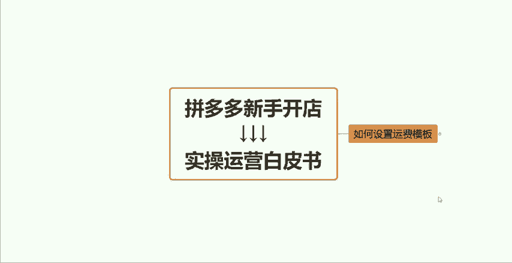

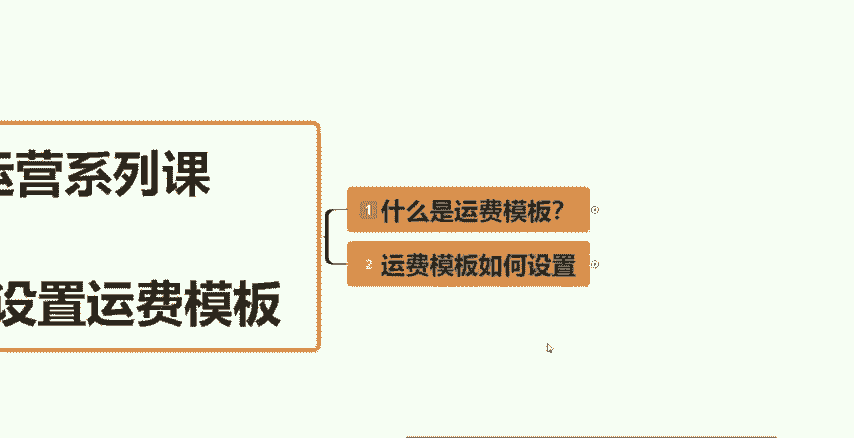

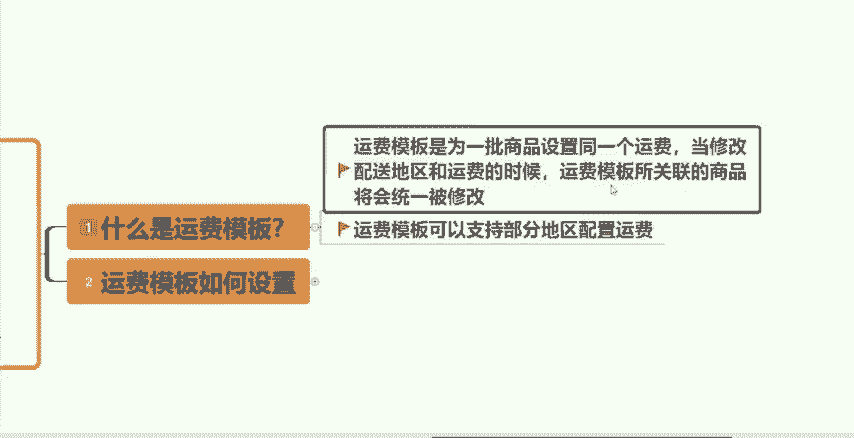

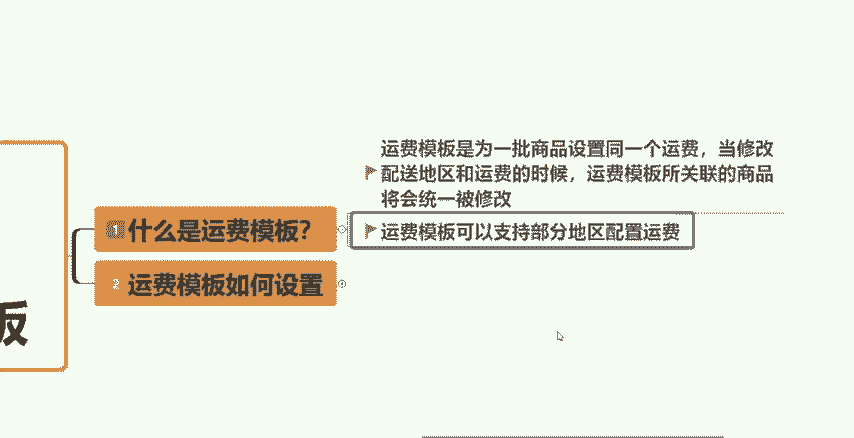

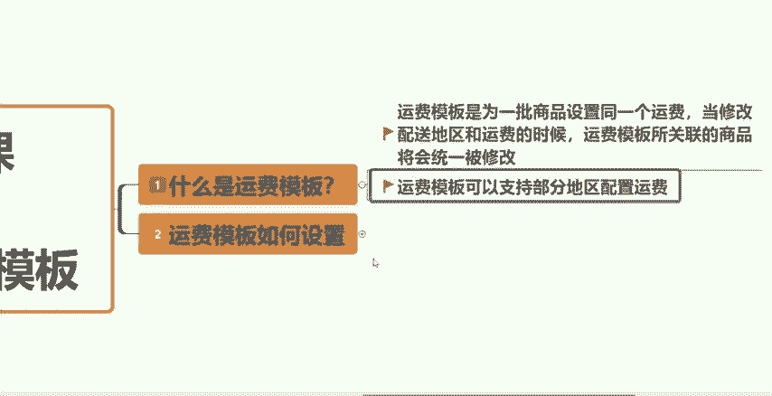

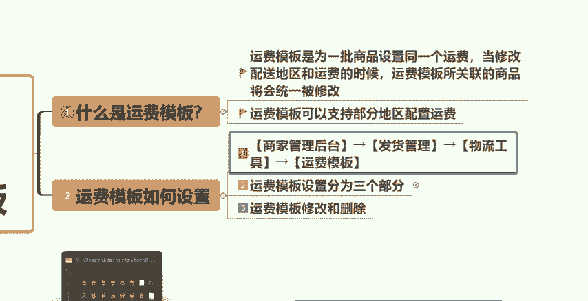

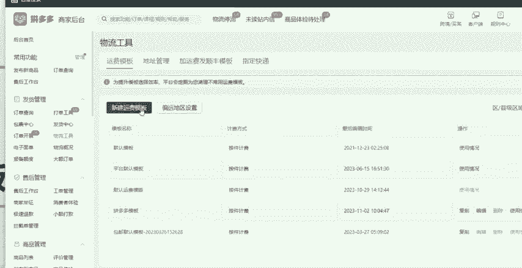

那个运费模板就可以了啊，这个就是我们设置运费模板的一个路径啊。运费模板呢它的一个设置分为三个部分，第一个是模板的基本信息，第二个是包邮的配送区域。第三个就是买家的付邮费的一个区域啊。

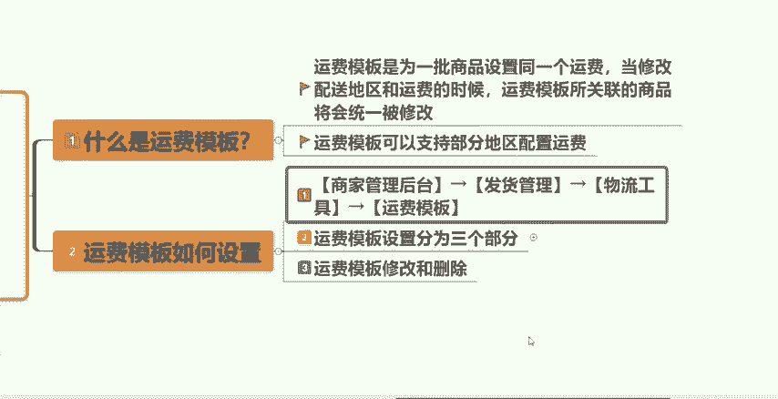

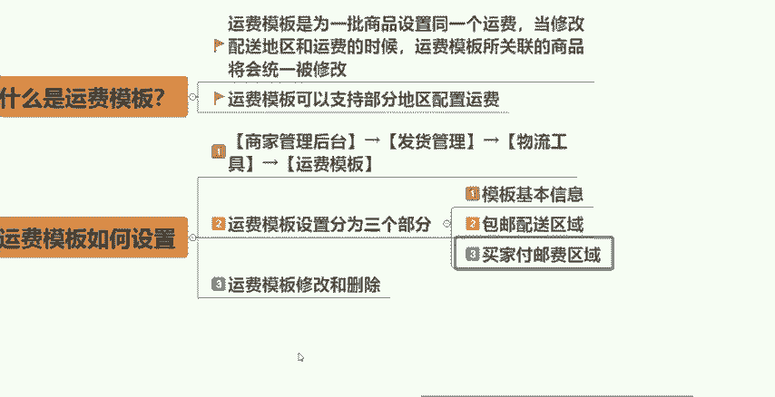

那么我们来实际的一个操作一下啊，首先我们打开了刚才说的这个路径啊，就是我们运费模板的一个页面啊，我们点击新建运费模板。大家在这个地方就可以看见。首先我们需要去填写一个运费模板的一个名称，这个模板名称呢。

大家可以自己随意的去填啊，这个没有什么特殊的一个作用啊，那比如说我们去这个地方我们就给大家做一个测试啊，运费模板这个是我给大家做一个演示啊，所以说我也就随便填了啊。

然后接下来呢我们需要去设置我们自己的一个发货地址啊，这个呢就你们自己去填写就好了。你们商家你们自己是在哪个地区的发货的一个具体地址是哪里，你就填哪里就好了。但是大家一定要去填写真实的一个地址啊，知道吧？

因因为如果说这个地方你可以看到，如果说发货地与您的这个实际发货地不符合的话，可能会导致物流投诉，不是说一定会导致物流投诉啊。当然如果说比如说有的小伙伴说我是做一件代发的，对不对？

这个产品这个货源不是我自己这边的，你就去问。你代发的这个厂家，他们的发货地址在哪里，你把这个地址问清楚之后啊，他们的发货地区填在这个地方就可以了。好吧，这个就是设置这个发货的一个地址啊。

接下来呢模板类型我们选择自定义模板就好了啊，选择自定义模板。接下来我们需要去设置一个包邮配送的区域啊，包邮配送区域呢顾名思义啊，全程包邮啊，全部包邮的一个意思啊，全部包邮一个意思。

买家它是不需要去承担这个运费的啊，像这些地区呢有几个特点啊，比如说新疆啊或者说香港啊、台湾啊，像这种地区还有西藏一般情况下，我们都是默认不选择的。因为像这些都是属于偏远地区呃，我们常见的快递。

比如说三通一达发这些地区的话，它的物流的成本价格太贵了，所以说可能会导致我们没有利润空间，甚至还会要贴钱去发快递的，所以说这个几个地区呢，我们都是选择不包邮的，好不好？如果说啊你的这个产品啊，包括。

你谈的快递真的是打算去做新疆去发香港，台湾都能发的话，你根据你自己的一个实际情况去勾选也可以。好吧，这个就看大家了。一般来讲是不勾选的。然后这个地方有一个叫做顺丰包邮啊，顺丰包邮。如果说你有顺丰包邮呢。

那么在这个地方你就可以把它啊去勾选出来。那一般来讲我们在拼多多这个平台当中，如果说你是发的顺丰的话，在平台当中它是有一定的这沉重加成的啊，所以说大家如果说你们发快递谈的是顺丰的话。

那么这个地方你去把它勾选起来就好了。好吧？如果说没有的，不要勾选了啊，没有就不要勾选了。接下来是这个买家付邮费的一个区域，什么意思呢？就比如说上面我跟大家讲的一些偏远地区，我是不包邮的，我是不勾选的。

但是我又想发这部分地区，对不对？我的有一部分买家又刚好是新疆啊，西藏或这些要偏远的地区了，我想给他们发怎么办呢？那我可不可以让买家自己来付邮费，对不对？我给他发快递呢，可以的。

这个地方去给大家设置就好了啊，比如说我们设置指定的这个区域运费，看到没有？台湾、澳门、香港、新疆、西藏就是你上面这个没有抽选的一个地区啊。比如说我是啊设置一个新疆，这个地方它分为两种。一个是按件数计费。

一个是按重量计费。一般来讲，你的这个产品如果说不是那种很重的那种大件商品的话，一般我们都是选择按件数计费的，知道吧？比如说一些衣服啊等等之类的。

8块递没有超过首重的1公斤2公斤这样子的那就按件数计费了啊，件数什么意思呢？比如说我们可以设置在一件以内啊，多少钱，根据你们自己谈快递的一个价格来填写就可以了。呃，比如说你发新疆一件。

可能说运费贵10块钱，那我就一件内，我设置个10块钱就可以了，知道吧？我设置个10块钱，增加一件呢，我可能说每增加一件运费多个8块钱，对不对？这样去设置就好了。接下来这个地方有一个指定条件包邮啊。

比如说呃这个时候消费者他买的数量比较多，对不对？比如说消费者一下子买了5件或者说买了10件。那买了多的话，我可以给他包邮，对不对？那这个地方你就根据自己的一个去设置啊，比如说满10件啊，包满5件包邮。

对不对？那你就可以自己去设置，知道吧？或者说你可以设置。满多少钱给他包邮啊，这些都是可以的。好吧，这些都是大家可以自定义去设置的啊。接下来是这一个不配送的一个区域。比如说像澳门，像香港，像台湾。

这些大家都可以去添加进来啊，包括还有一些像新疆啊、西藏这些地方，如果说你没有办法去配送的话，那么你就可以在上面这个地方把它的一个打勾给去掉。下面这个地方它就会自动的匹配出来，你上面没有选择的地区。

然后你就可以去啊设置，一般来讲就是选择这个合作的快递不配送此区域，把这个地方设置完成之后啊，你啊点击下面有一个提交，点击提交之后，你的这个运费模板啊，就设置好了。大家在这个发布产品的时候。

来我打开给大家看一下，在你们发布产品的时候呢，划到当你们上面的这些全部都已经设置好了，对不对？在下面这个地方就会让你去选择这个运费模板的。看到没有？你点击这个其他模板。

在这个地方你就可以看到刚刚你设置好。

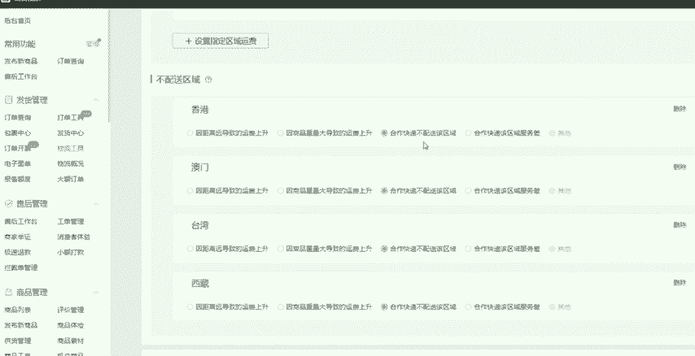

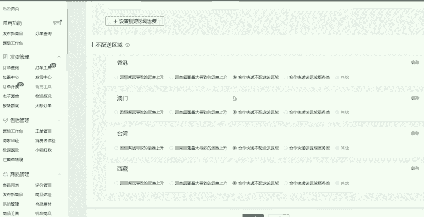

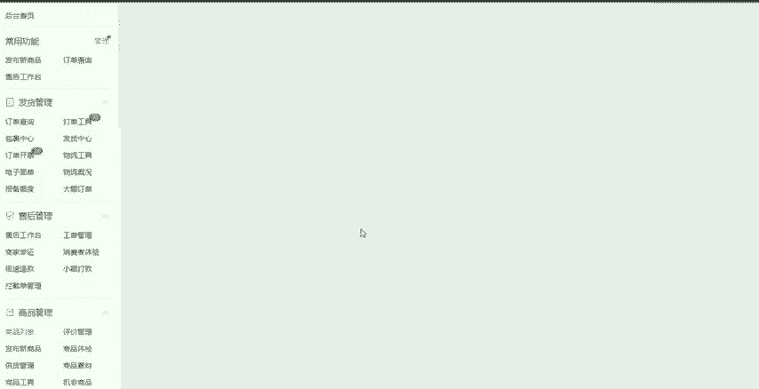

的运费模板。如果说你这一批商品啊，比如说某你某一批商品要选用这个模板，你在这个地方就可以去把它选择起来就可以了。好吧，就可以了。这个就是我们完整的一个运费模板的一个设置流程啊。我相信还是比较简单的。

大家应该都能学得会，好吧，这这一期的一个视频就跟大家分享到这。如果说大家在自己坐店的过程当中，还有什么不懂得的一个地方呢，大家都可以在评论区找到我。我可以有时间的话，大家诊断一下店铺啊。

去解答一下大家的一些问题啊，都是没有问题的。好吧，感谢大家的一个观看。

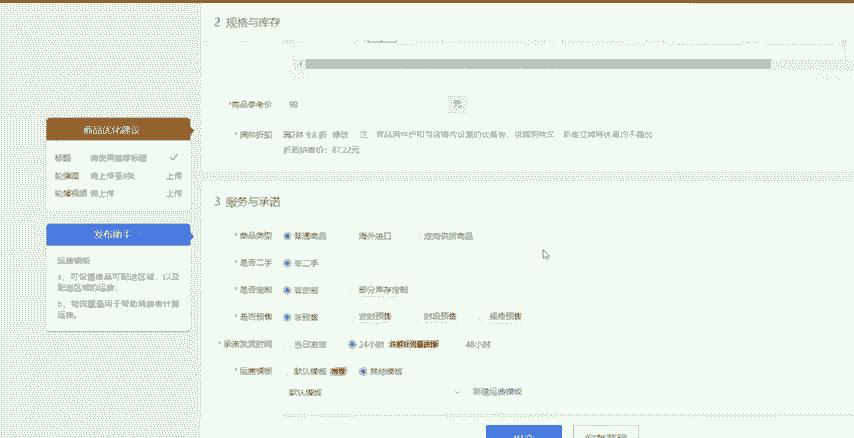

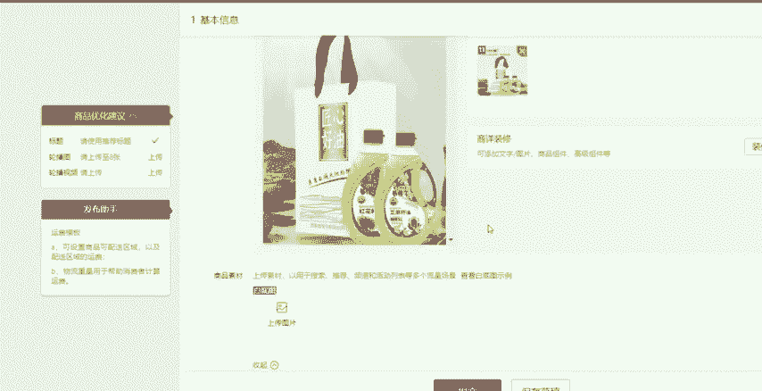

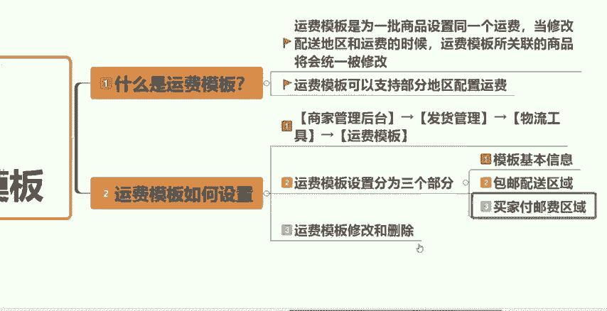

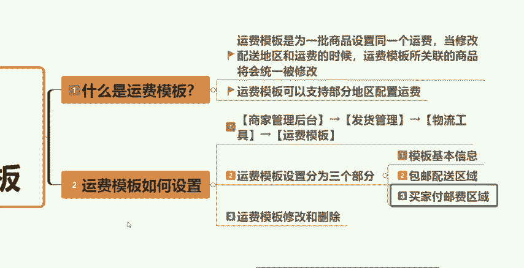