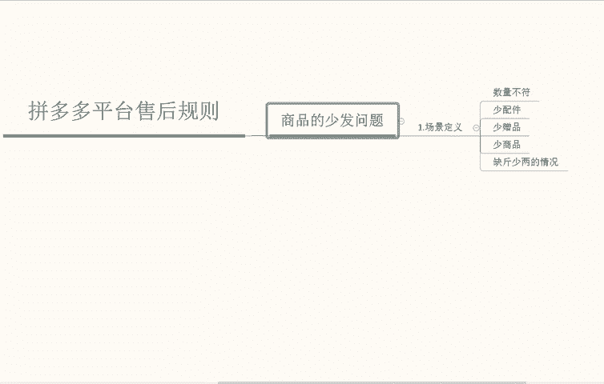

# 【拼多多运营】2024年最系统的全套拼多多运营教程，适合所有拼多多开店新手小卖家自学，10年资深运营师手把手教你从0到1起店实操。 - P16：16-拼多多平台售后规则1 - 拼多多运营教程_ - BV1H62ZYREs4

呃，目前很多同学可能在对于平台的一个售后判断责任当中存在一些疑问。那么了解场景的一个定义和服务规范特别重要。接下来我们就针对到几个特定的一个高发的一个售后场景给大家做一个具体的解析。

首先呢我们先来分析一下啊。说一下第一个场景，商品的少发问题。

商品的一个少发问题。首先呢。这一个场景的一个定义。什么叫商品的少发问题？

我们可以理解是。商家未按照平台的一个明细啊，网页商品描述以及消费者在商聊当中达成一致的一个结论发货订单的一个商品。消费者投诉到订单商品存在。商品信息几个点啊，商品。数量不符啊，第一个数量不符。少配件。

啊，少赠品。以及少商品。啊，还有缺斤少两的一个情况。

那么了解到这个场景景的一个整体定义以后啊，我们再来说一下它这个服务的规范要求。

服务的一个规范要求。第一个我们商品相关描述啊应该是。商品的一个相关描述。

应该是真实规范真实规范的。我们需要保证。对应商品的数量组件做如实的一个描述啊，不应该出现误导买家整体的一个情况。如果说多包裹发货，我们要提前告诉买家啊。比如说我们的SKU里面啊展示。拍两件啊，送一件啊。

那么。

我们这个就不要错误的引导买家，买二送一。不是买二送一。那么我们再来说一下。

第二个小点。商品的履业应该保质保量。

应该保量。如果商家我们应按照买家所拍下的一个商品数量与买家协商一致的内容，确保发货后不会出现商品数量信息不符，少配件，少赠品，少商品，或者是说缺斤少两的一个情况，从而影响买家的一个消费体验。

那么这个点我们一定要记住。第三个就是。

少对应。少发售后问题。及时的去解决啊及时的去解决啊。比如说买家反馈少发的问题，我们商家应该第一时间与买家协商少发的问题，同时对买家做出额外的一个补偿啊，弥补对消费者的影响。这个是第一件你要去做的事情。

那么第二个就是。

自查自纠一下，针对对发货的检查降低少发的问题。如果因为商品展示图SQ图误导啊，导致买家消费者误解。那么我们应该尽快的去调整商品SQ图的一个选项，营造好一个整体的商家的一个售卖生态环境。

