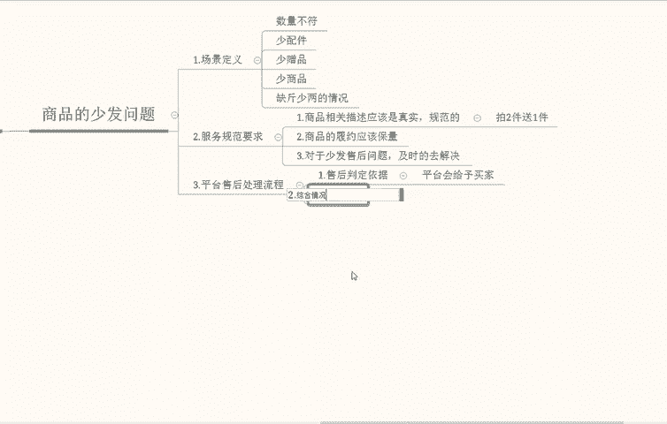

# 【拼多多运营】2024年最系统的全套拼多多运营教程，适合所有拼多多开店新手小卖家自学，10年资深运营师手把手教你从0到1起店实操。 - P17：17-拼多多平台售后规则2 - 拼多多运营教程_ - BV1H62ZYREs4

这个就是整体的一个少发问题的一个定义。那么我们再来说一下第三个平台售后处理的一个流程，平台售后。

平台的一个售后处理流程。

还是分几个点给大家做一个解析。第一个售后的一个判定条件依据。术后。

判定依据。说判定依据啊平台。平台会基于买家在啊平台会基于买家在商家聊天页面当中一个反馈啊，申请售后提交凭证描述，通过平台客服等渠道反馈相关的一个问题内容，做综合判定分析确定双方的一个原因啊。

具体的一个责任。那么第二个。

啊，除了我们刚才所提到的一个上述第一个点以外，同时平台也会根据商品的一个具体营销情况，具体包括不限于店铺的综合分其他买家综合的一个反馈情况。在这个商品当中，同行中的一个排名情况做综合的一个判定。

确认双方的一个条件，综合情况比较多啊，这个综合情况比较多。

那么第二个。啊，第二个买家的一个。啊。买家体验补偿的一个。

买家体验补偿的一个原则。平台对消费者反馈的少发问题，为了弥补买家在订单当中体验损失，影响后续的一个购买行为可能会采取几个点啊。由于我分别给大家说一下啊。第一个，由于商家少发的问题。

导致买家货款金额受到损失。平台会根据相关的一个售后处理规则，对消费者进行合理的一个货款补赔偿。一般是10%到5%左右。具体看你的订单金额为准。

根据订单金额补偿，我们就可以这样去理解。那么第二个，由于商家少发的问题，导致买家的日常体验受到影响，包括但不限于缺少配件或者一些赠品啊，这些我们上面所提到的缺斤少两这些都有。

那么未弥补这种情况受到的影响，平台也会根据买家进行一个合理的货款补偿。我们也可以理解是订单金额的一个补偿。那么第三个，由于我们商家少发问题，导致买家啊造成了其他损失。

包括但不限于买家与商家解决少发问题所耗的时间成本，少发问题一直未被解决，导致买家多次寻找平台反馈的时间等等啊，未弥补这一类型，买家由于少发导致的时间成本以外。

平台根据相关的一个售后处理规则也会对消费者进行一个合理的规划补偿，也相当于就是从我们的一个订单金额当中，但不限于是订单金额。啊，因为上面他也提到了啊，也有这部分的一个时间损失在里面。这个大家能够明白吧。

那么我们再来说一下啊，如果说我们商家遇到买家反馈少发的问题，建议的话，建议及时。

建议及时的跟进消费者的一个售后需求。

及时跟进消费者的一个售后需求。如果给予货款补偿补发、换货等等，避免消费者升级投诉。如若买家升级投诉的话，平台会额外的去增加一些其他因素的惩罚金额，用于补偿给消费者。也就是说我们处理的话。

尽量就不要去给买家增治什么。他说缺的话，那我们补偿给他们，马上这个问题得到解决，也不会对于我们售后情况造成更多的一个影响。

