# 【拼多多运营】2024年最系统的全套拼多多运营教程，适合所有拼多多开店新手小卖家自学，10年资深运营师手把手教你从0到1起店实操。 - P18：18-拼多多平台售后规则3 - 拼多多运营教程_ - BV1H62ZYREs4

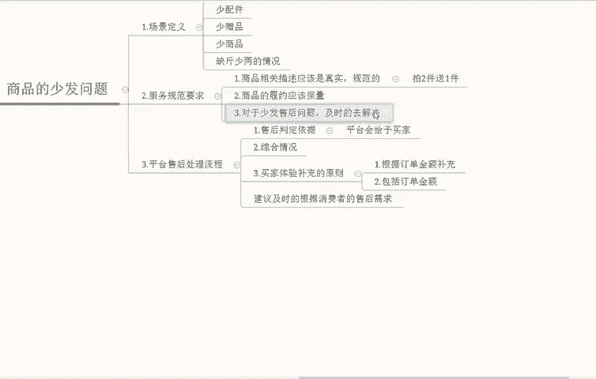

好，我们继续。啊，我们再来说一下啊，我们再来说一下第四个大点啊第四个大点。

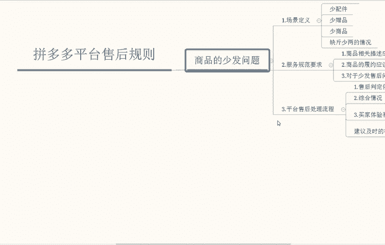

那么我们上面提到的都是给予买家的一个配合原因上面啊配合原因上面。那如果说如果说真会出现某一种实际就是买家的问题，那这种情况我们该如何去做处理呢？如果遇到用户提交虚假的凭证，或者是说用户在未。

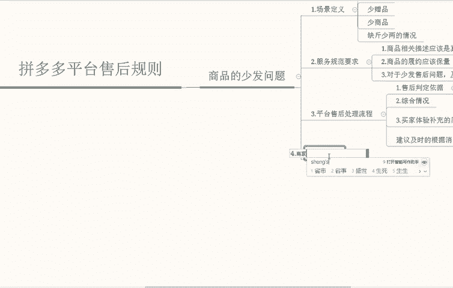

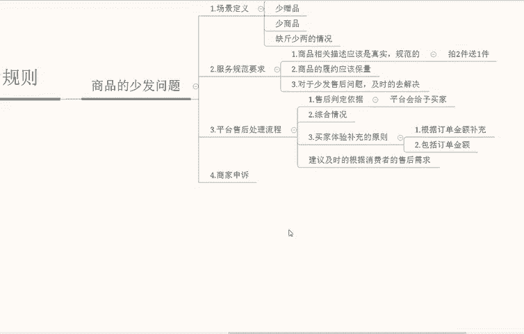

在各渠道反馈商品相关的问题，但会被平台判决。你可以通过就我们商家可以通过平台虚假凭证入口啊进行反馈虚假凭证啊，同时提供有效的凭证。在有效期内对应的申诉。

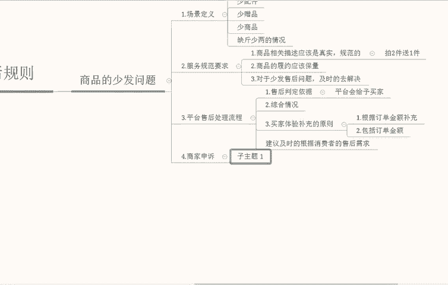

进行货款一个申诉。大家可以看一下，就是这个链接我给大家放在这里。那么我们这里有几个案例给大家分享一下典型的。

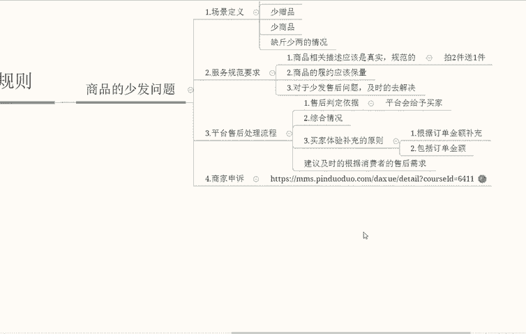

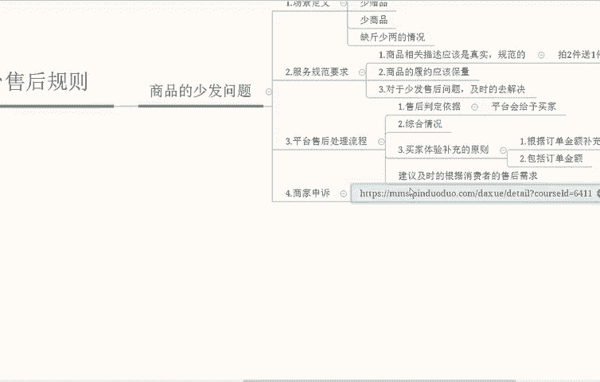

典型。

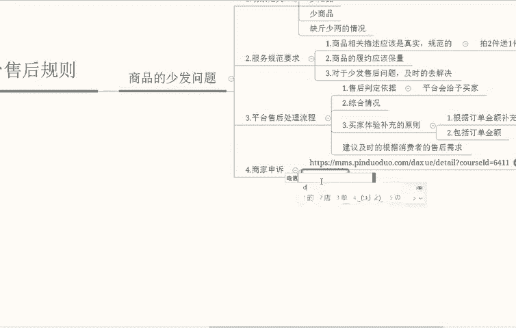

典型的一个错误事例。第一个啊商品SKU展示拍。拍两件。送一件错误引导买家买。

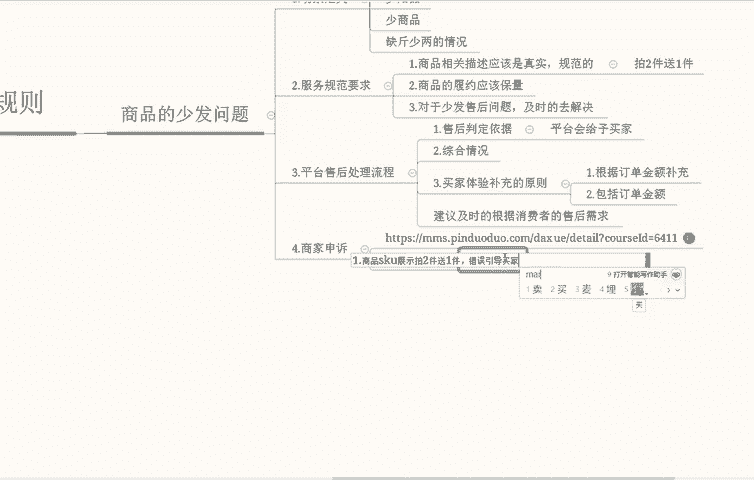

二送一。这个我给大家找张图吧，你们看一下。

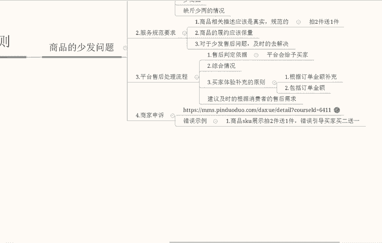

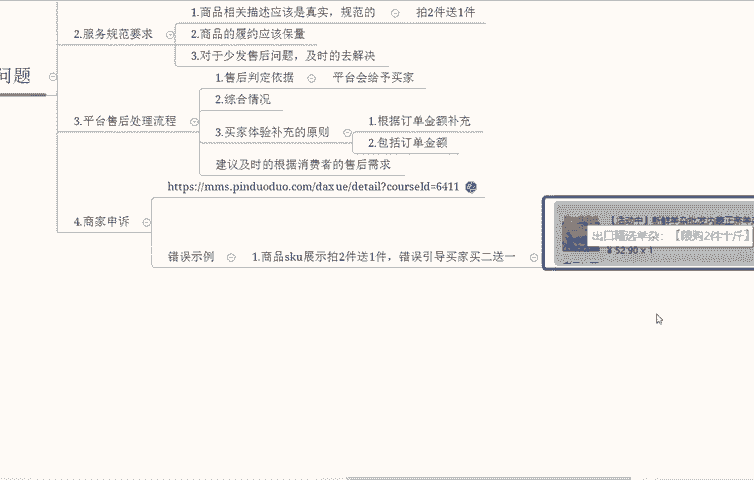

这个能够看到吧啊，能够看到吗？SKU错误引导买家消费者那平台将会额外增加罚金啊，用于补偿买家，这个大家能够明白吧？我们再来说一下。

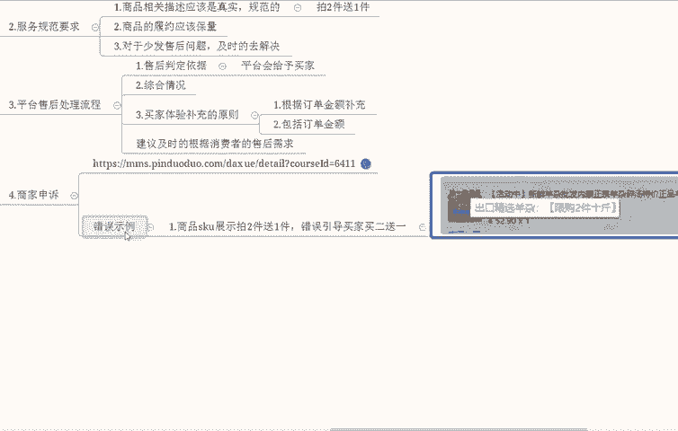

啊，消费者也就是说我们就说买家吧，买家少发，商家未及时。积极有效回复。也就是上面我说的，耽误了买家时间嘛，平台也会有额外的一个判法啊，也会有额外的一个判法。平台会针对商家未积极有效回复消费者。

会根据消费者除了货款以外啊，就是时间。这一方面也会对买家造成一个啊其他的额外补充。

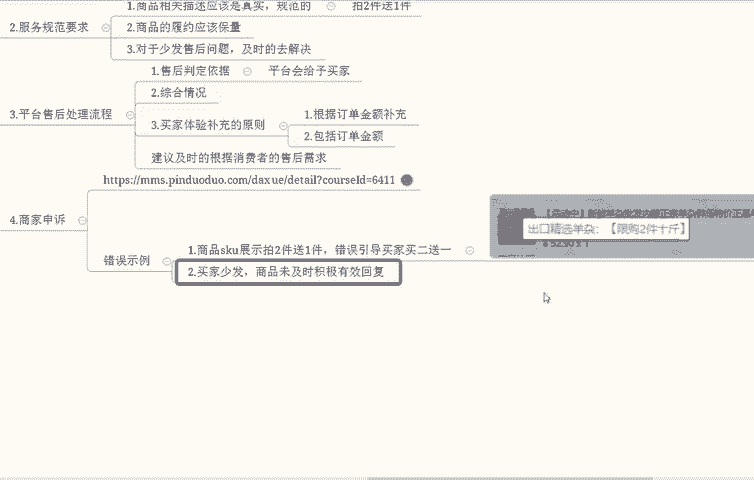

其他的额外补充。第3个啊，买家收到货少发且等了很久啊，少发，并且等了很久等了很久。因。给予除了货款。损失金额补偿外的一个补偿。就是由于少发问题，平台除了给买家提供货款补偿以外。

也会为买家提供等待时间的一个成本补偿。比如和上面一致。

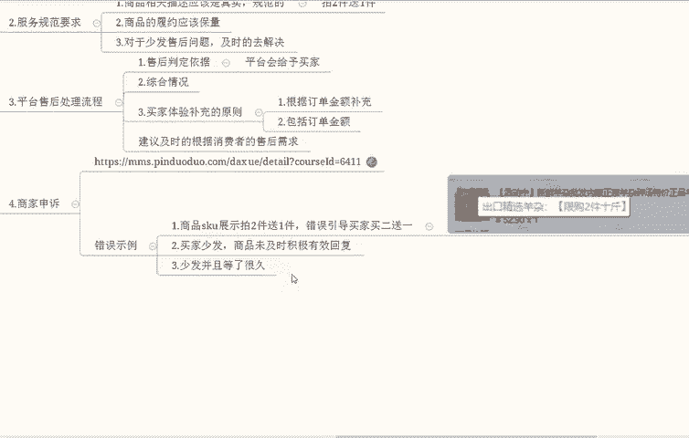

这个你能够理解吧？那这些就是整体的一个场景一的问题。我们再来说一下场景二，商品错发问题。

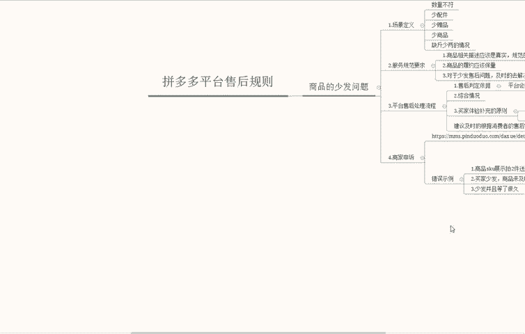

商品错发。

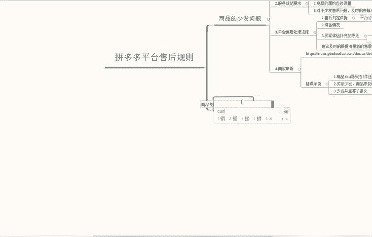

嗯，还是先来定一下场景啊，定一下场景，错发场景。

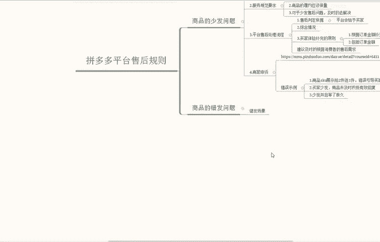

啊，什么是错发场景？错发这个其实不能理解，商家未按照订单明细、网页商品描述以及与买家在商聊当中达成一致结论。发货后订单的一个商品，消费者投诉收到订单商品存在。信息不符，比如说颜色、尺码、款式等等情况啊。

这种情况。那我们再来细分一下规则啊，我们再来细分一下规则。服务的一个规范服务的一个规范。这个为给大家列一下，比如颜色、尺码、款式、型号。型号不同的一个情况下面。那我们再来说一下服务整体的一个规范。

服务整体规范的话，商品信息发布规范信息明确，这是第一个点啊，商品信息发布规范。啊，规范并且信息明确啊，我们商家应当对商品详情页做出详细的一个描述，不得出现误导消费者的一个情况。比如说由于版本信号啊。

版本型号不同，导致商品外观产生不一致，需要清楚的在详情商品详情页当中啊，详细的去描述，同时告知买家，这个是第一个点。

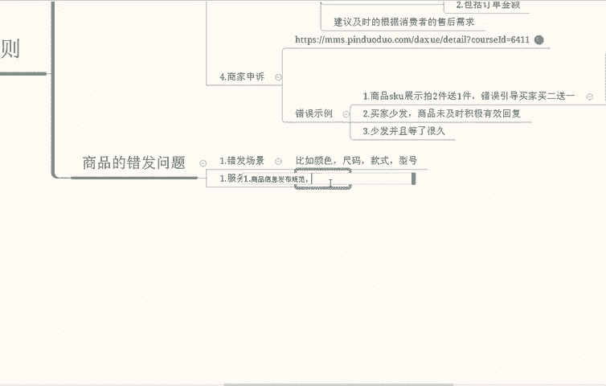

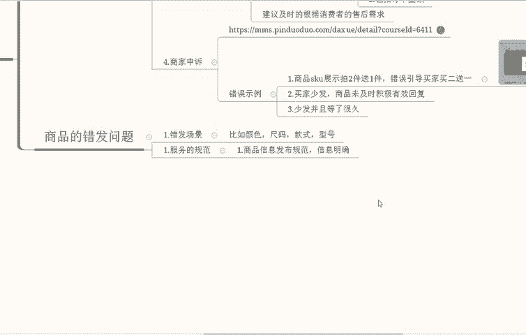