# 【拼多多运营】2024年最系统的全套拼多多运营教程，适合所有拼多多开店新手小卖家自学，10年资深运营师手把手教你从0到1起店实操。 - P19：19-拼多多平台售后规则4 - 拼多多运营教程_ - BV1H62ZYREs4

OK那我们这期继续来讲。首先呢我们售后判定的一个依据的话啊，这个先要从平台的一个处理流程开始讲解嗯，我们先说一下售后他整体的一个判定依据。

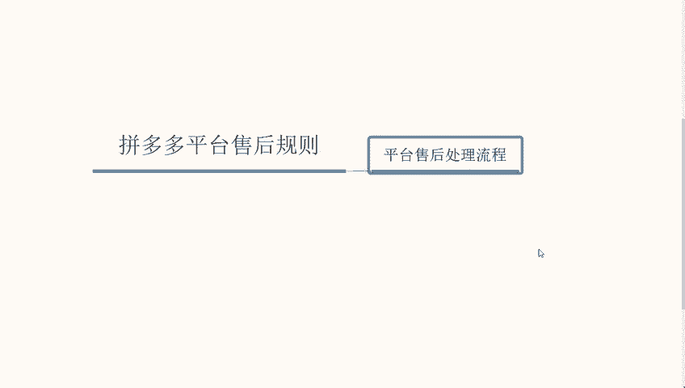

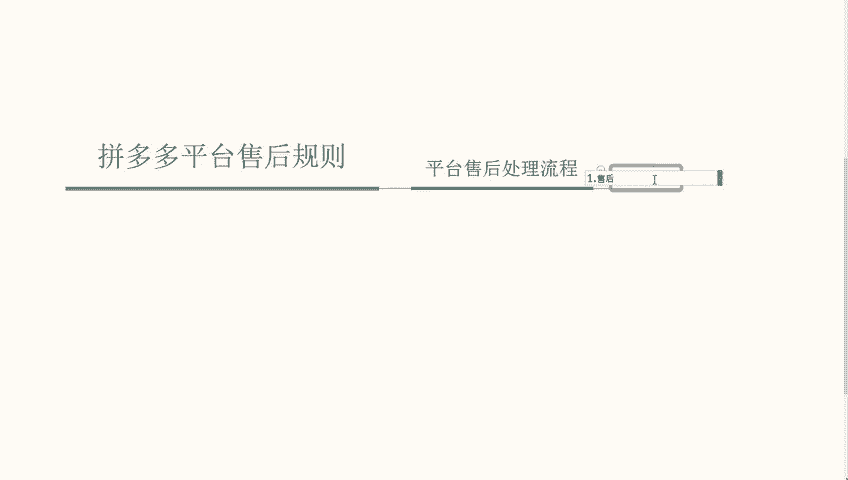

呃，首先呢第一个点。平台基于消费者，也就是基于买家通过在商家聊天反馈的内容申请售后提交、凭证、描述，通过平台客服等渠道反馈相关的一个问题内容做综合的一个判断分析。也就是说啊看谁的。谁的？证据。

证据更充分一些。但是呢嗯这个平台的话啊，他最少。最少的概率是偏向于商家的大部分。

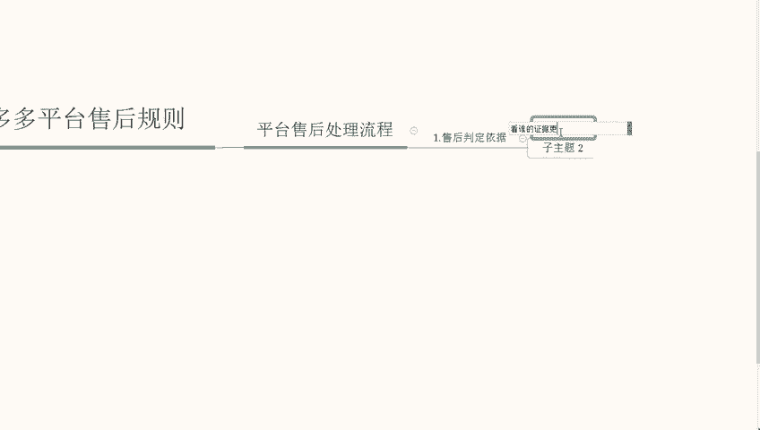

还是啊。你买家的。证据为主啊，这个点大家一定要做好心理准备。所以说你提供的证据一定要完善的一个情况下面才去啊做这一块的一个提报。那第二个点呢，就是除了我们说到的看谁着证据跟充分以外啊，除了这一个点。

平台也会根据商家啊这个商品的具体经营情况，具体包括不限于店铺的，比如说啊服务体验分啊，其他买家综合体验综合的一个反馈。以及我们这个商品在同行排名的一个情况下做综合的一个分析确定双方的一个责任啊。

这个包括但不限于比如说店铺的一个服务分啊，以及买家体验反馈，就是好评差评这一类型的嘛。因为虽然拼多多没有好评差评这一块。但是也有这样一个服务分在里面啊，再次就是商品。在同行的一个排名情况啊。

做综合的一个判断分析。

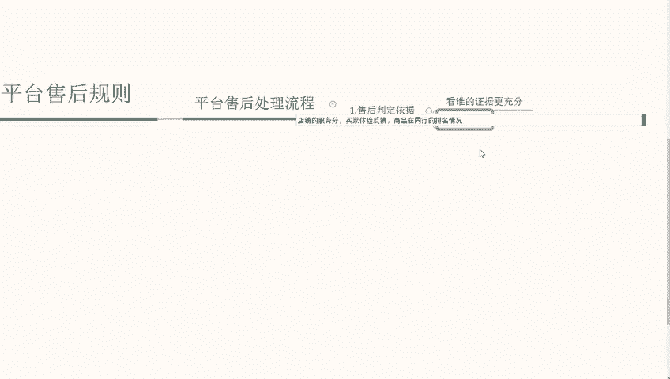

那么这个就是整体的一个判断依据。第二个啊就是。买家体验补偿的一个原则。

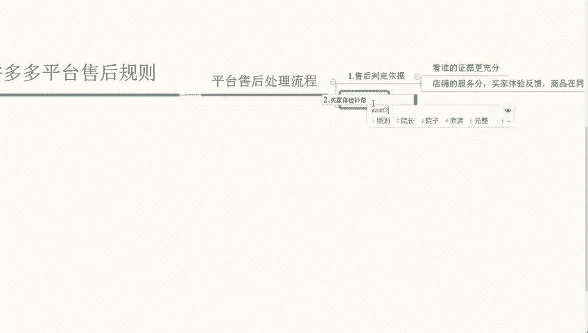

啊，买家体验的一个补偿原则。嗯，这个点的话，我们可以分析一下，就是平台对于买家反馈的错误问题。为了弥补买家在体验订单中啊造成的一个服务损失嘛。我们可以这样去理解。

影响后续的一个购买行为可能会采取啊几个点几个点的一个呃处罚。

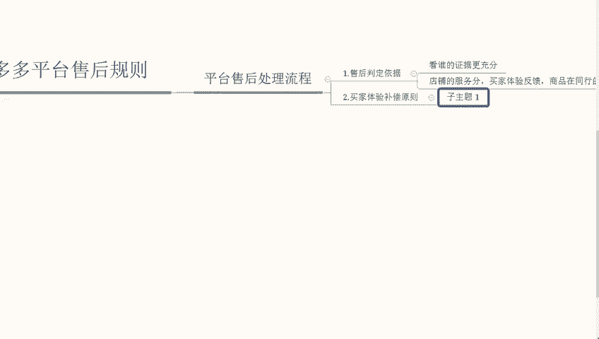

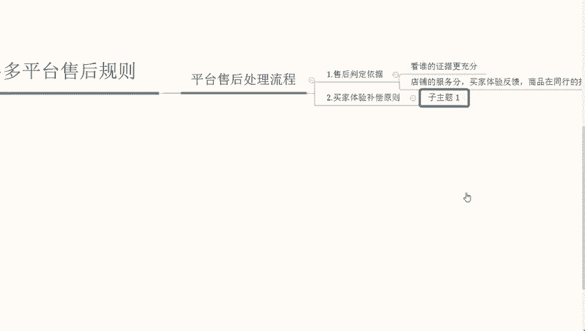

比如说我们先说第一个啊，由于商家发错问题导致买家货款金额受到损失，那么平台他会根据相关的一个啊售后处理规则，对买家进行合理的一个货款赔偿啊，也是依据以买家为主的。那么第二个就是由于我们商家错发问题啊。

导致买家日常使用受到影响。这一块为了弥补买家受到的影响，平台依据相关的售后规则，也会对商家进行处理，对于买家进行合理的一个货款补偿啊。那么有的同学可能会考虑，就是为什么啊这些一定是要偏向于买家的。

因为买家他是要做啊这个平台他是要做整体的一个售后服务的啊，他要做买家体验的，所以说买家是基于商家为主的。

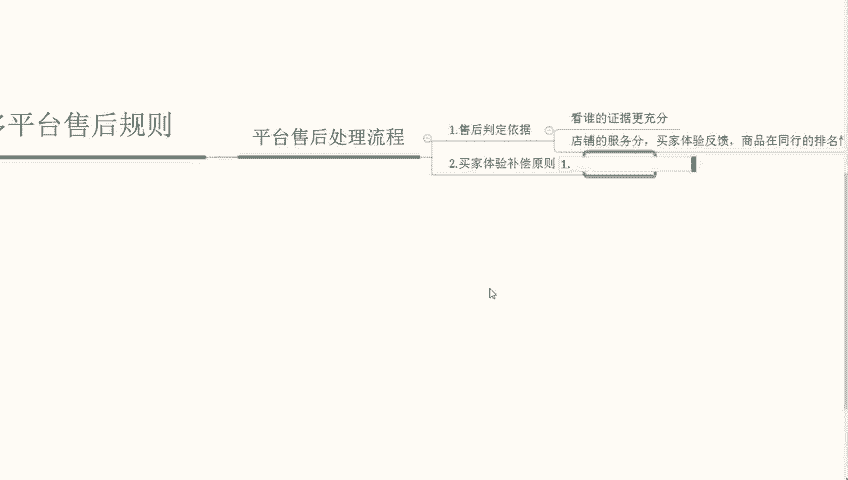

啊，这个点大家一定要记住，就是买家才是这个平台的主要消费地。我们做的就是买家体验啊这个点一定要记住，我们再来说一下啊。商家申诉这一块。啊，商家申诉这一块商家申诉这一块的话啊，我们可以就是比如说啊。

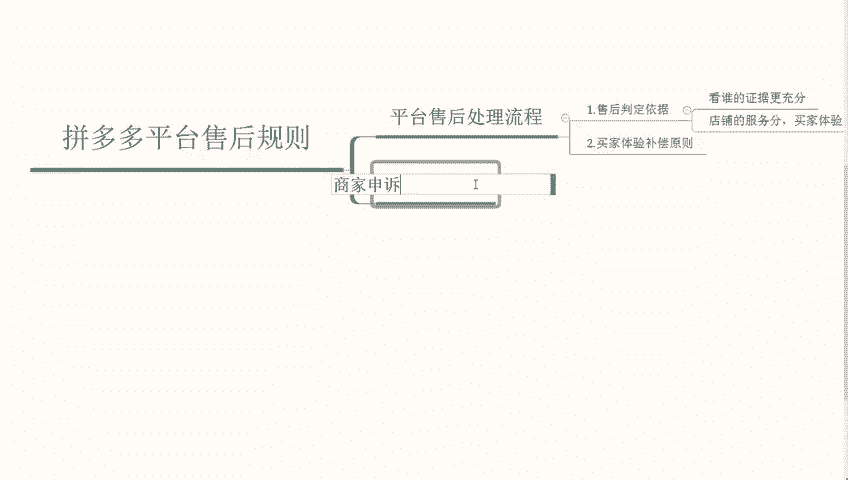

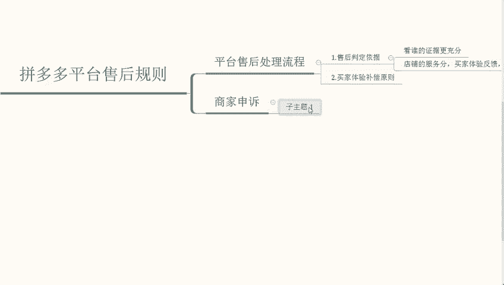

多次发错货啊，比如说多次发错货，平台将会根据每一个就是反馈我们商家发错的发错货的一个行为。对商家除了货款补偿以外，也会对我们做出一些其他的惩罚来支持买家。比如说啊限制我们的流量。

限制我们的啊展位这一类型的等等啊，这些都有概率。那么第二个就是消费者由于急用等待比较久，也就是说消费者啊等待较久。

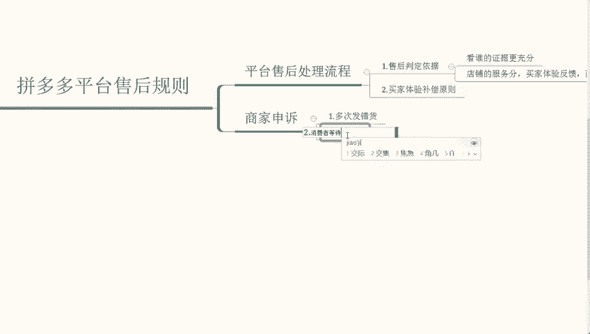

啊，等待较久啊，结果我们发收货，并且还没有及时的提供解决方案。那么平台除了货款补偿给买家以外，也会为买家提供等待时间的一个补偿行为在里面。

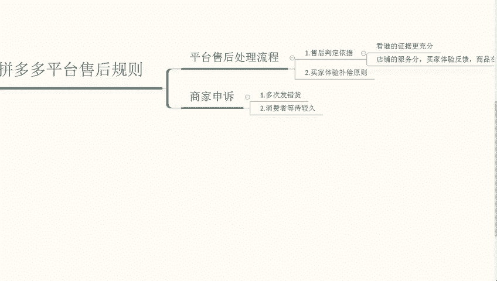