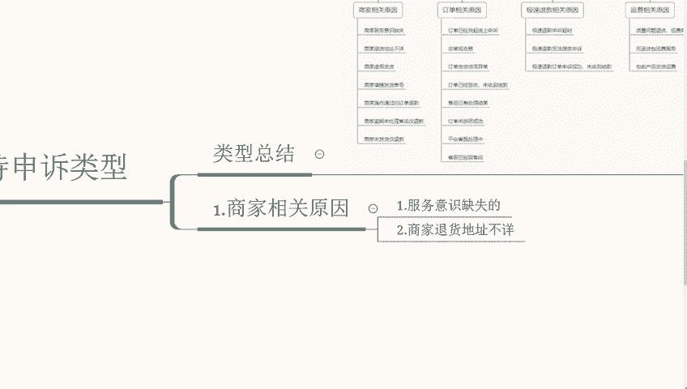

# 【拼多多运营】2024年最系统的全套拼多多运营教程，适合所有拼多多开店新手小卖家自学，10年资深运营师手把手教你从0到1起店实操。 - P20：20-拼多多平台售后申诉类型1 - 拼多多运营教程_ - BV1H62ZYREs4

那我们再来讲一下售后申诉不吃迟的一个申诉类型。这个的话我给大家做一个总结，你们看一下啊，这个我单独放一个分支，你们看一下。

那我们放大看一下。呃，我们先来说一下，就是相关啊商家相关的一个原因。

我们先来说一下这个部分。商家相关原因嗯，首先呢就是第一个点，商家服务意识缺失。

比如说。你在和买家的沟通当中辱骂或者说有其他的，比如说恶意的一个言语啊，如果你存在恶意辱骂买家服务态度缺失等问题，这一块就不支不支持申诉，除非你不想开店了，你可以这样去做。但如果说你想要开这个店。

那我们就需要一个提供好的服务，毕竟平台也是做服务的。所以说对于这一块的一个要求是比较严格的啊，以及商家。

退货地址不详。啊。首先，如果说你的退货地址填写的不详细，不完整，或者说未更新，或者逾期未给到正确的一个退货地址的话，就不支持申诉。为避免产生不必要的售后啊，建议我们就是我们自己做一个更正啊。

及时的更正店铺默认的一个退货信息啊，这个一定要做好一个详细的准备。那么第三个就是。

虚假发货啊，这个在前面几句，我们没有讲过虚假发货申诉的入口啊，一般是在虚假发货规则通知里面有个战队性啊，也就是通知我们违规了，里面有个战内性可以申诉。这个就根据看具体的一个情况，到底是快递的问题。

还是说我们发错的问题，还是说啊买家收到货不对版的问题啊，这一系列等等。这个就看具体的原因进行申诉。如果说确实是我们这边的问题，那这个申诉的必要性也就不大了。那么第五个就是商家操作通过的订单退款。

这个是什么呢？

如果说这个订单是由我们自己自行同意退款或者自行同自行通过售后单，就不支持申诉啊。如果说后续存在售后纠纷，这个就只能建议就是我们自己去联系买家协商处理。比如说举个例子。

如果说我们在聊天当中啊工单当中回复同意或者退款，那么这个系统平台就会按照默认我们所表达的一个协商方式进行处理。那如果说处理结果没有不是我们预期的话，那么这个就要具体找买家去做协商了。

那么我们再来说一下第六个啊第五个点。2。啊，如果说我们填错发货单号的话。并且没有正确的驳回退款原因，就不支持做售后申诉。所以说建议的话慎重选择好物流，仔细填写好并发货。物流信息啊，做好买家的一个服务。

我们再来说一下。第六个，就是如果说商家啊逾期未。

逾期了啊，逾期未处理售后禁。啊，没有我们主动去处理仅退款，而是系统帮助我们处理的话啊，那么平台会借助办理退款，这个是默认的，就不支持做申诉。所以说我们一定要关注好售后情况来进行有效的处理。

我们再来说一下第七个啊，我们未发货仅退款。商家未发货仅退款。

如果说订单因为买家申请请退款，我们商家没有。还未发货的话，系统判定退款，这个就不支持申诉。如果我们以线下发货，这个就只能说联系会计去做召回，避免不这个不必要的一个损失。

