# 【拼多多运营】2024年最系统的全套拼多多运营教程，适合所有拼多多开店新手小卖家自学，10年资深运营师手把手教你从0到1起店实操。 - P21：21-拼多多平台售后申诉类型2 - 拼多多运营教程_ - BV1H62ZYREs4

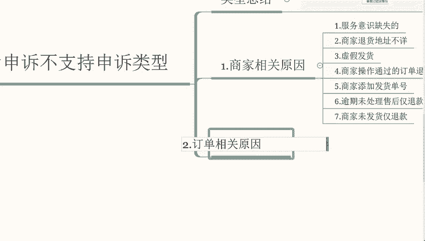

那上一期我们讲到了商家上面的一个原因。那这期我们再来讲一下，就是订单相关的一个原因啊。订单相关的原因。嗯，首先订单已经发起了线上啊，线上的一个申诉啊，订单已经发起了线上的申诉。

如果说订单已经提交线上申诉。平台正在加紧核实处理的话，这个就只能说我们关注一下最终的一个处理结果，这个就没必要去多次发起申诉。因为他只会申诉，只会审核一个啊。第二个点，非常规交易。

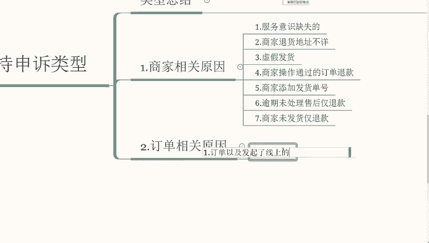

什么叫做非常规交易？如果我们的订单属于非常规交易订单，就不支持申诉啊，这个就我们要注意规范经营，严格遵守平台规则啊，规范经营。

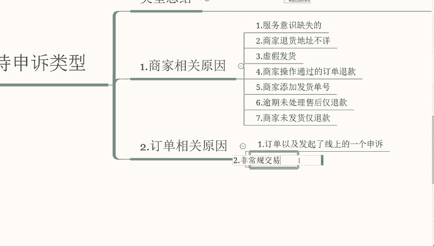

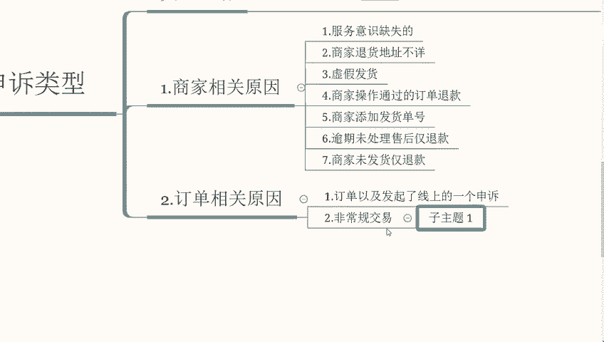

那么我们再来说一下第三个点啊，第三个订单发货物流异常。如果我们的订单因为发货物流异常包括啊，但是不限于规定时间内没有揽收信息，物流更断，时间过长的话，就是非买家所在的地区签收情况，这些等等。

这些是不支持申诉的，就只能够建议。

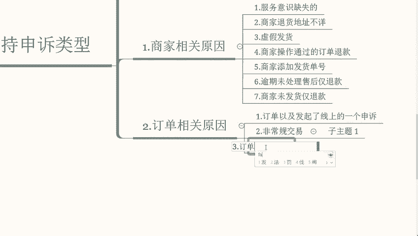

联系快递召回就是我们发布的产品，这个我们可以啊自己多结合实际情况去做考虑。那么我们再来说一下第四个点，订单已经签收，但是未收到货款啊，没有收到买家的一个货款，货款入账它是需要用户主动确认收货的。啊。

用户主动确认收货，系统自动确认收货以后自动入账的。那么我们这个可以在商家后台账户资金货款对账账单明细当中就可以对应查询了。这个比较简单，因为我们提现也是从这个啊这个渠道进入的。那么第五个是。

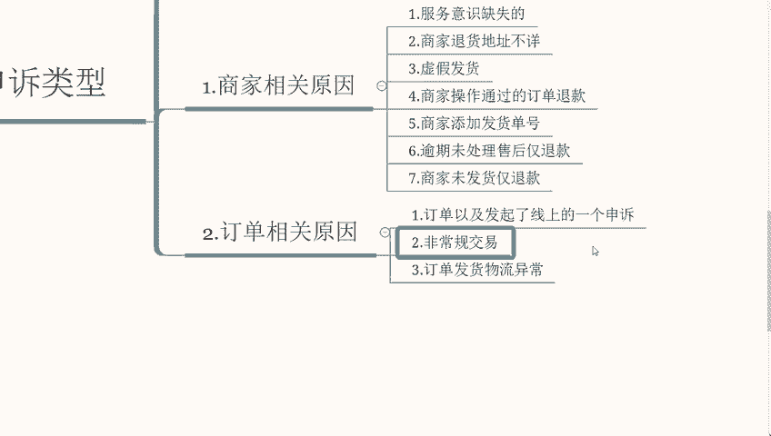

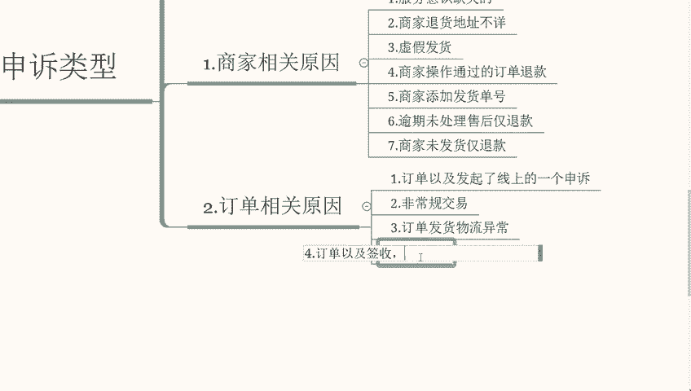

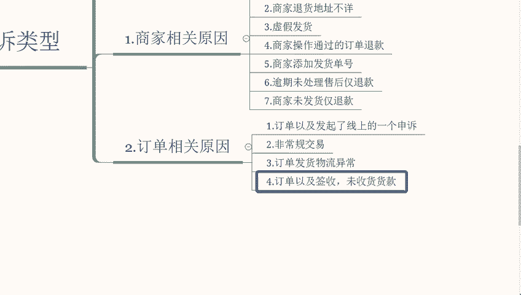

售后已有处理。

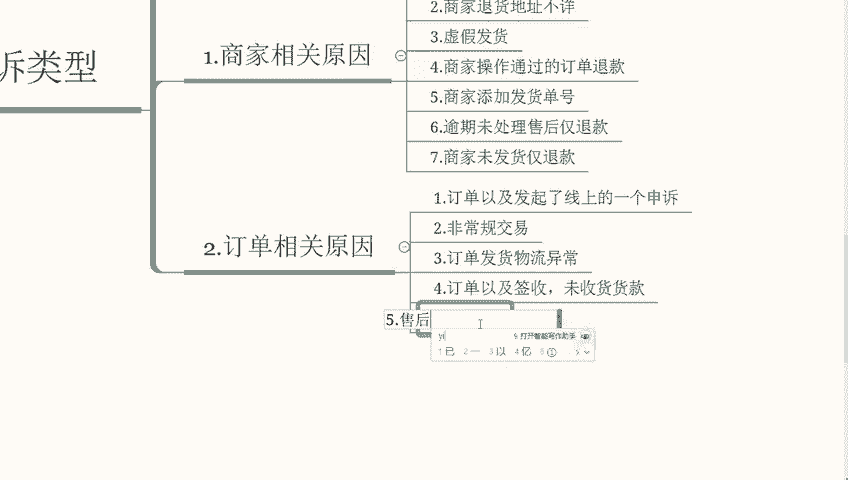

已有处理结果。那么这个点这个叫具体去核实平台已经处理完毕，可以在售后。详情页中核实查询啊，这个建议我们及时去处理订单的一个售后问题啊，这个要看实际情况而定。那么第六个点，订单未拼。

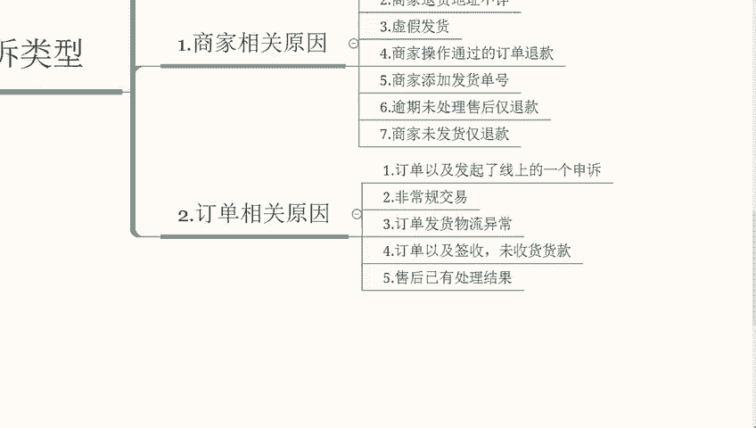

还成功啊如果说是订单没有成功。我们商家是无法在后台进行查询的啊，我们是无法在。后台进行查询的商家，如果在24小时以内没有拼传成功的话，会自动退回给用户。这个没必要去做申诉，也申诉不了啊。

我们再来说一下第七个平台客服处理中。

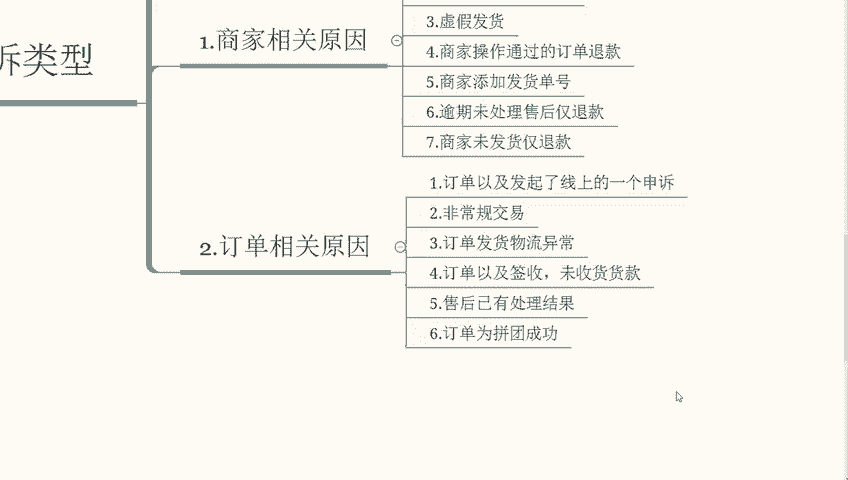

啊，我们这个前面有讲到。我们只发起了一个申诉的话，那就没有必要去发发起第二个申诉。因为他只会审核一个申诉啊。那么如果是平台订单。客服正在处理的话，就是以平台处理的结果为准。

如如果说我们的订单经平台介入且操作同意退款的话，在退款成功7天以后，我们对订单的处理如果有异议的话，可以在售后详情进行维权申诉。点击之后再。售后详情页面当中查看申诉的一个处理和他的一个处理结果。

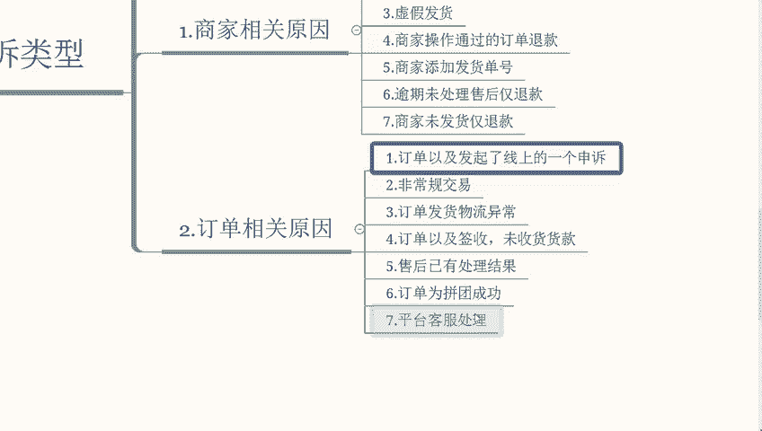

再来说一下第八个第八个点就是客服已经驳回售后。简单一点说，就是如果订单客服就是平台客服已经驳回售后的话，退款失败。那这个我们在售后页面进行核实查询，他这个点也不支持做有效的一个申诉。

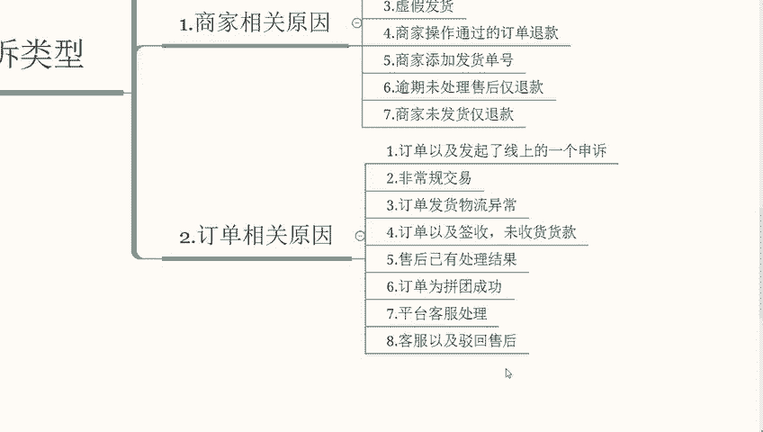

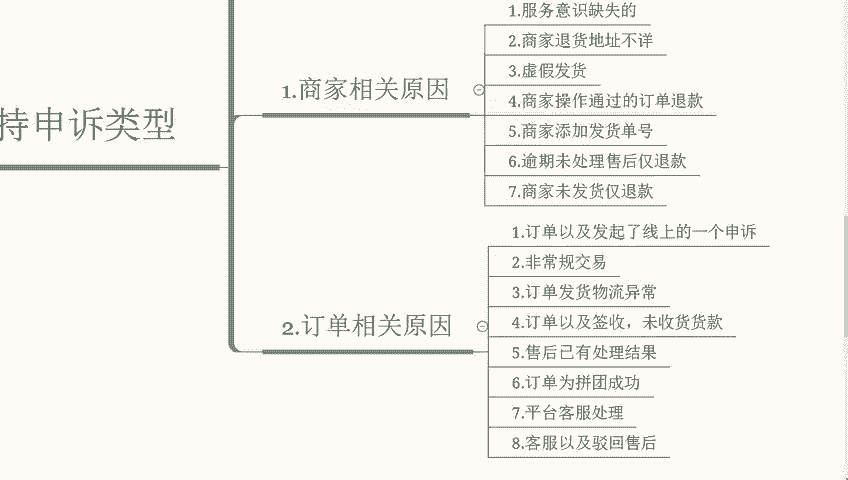