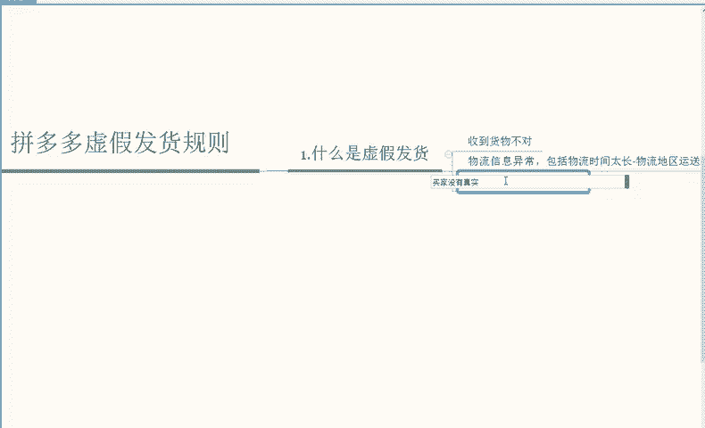

# 【拼多多运营】2024年最系统的全套拼多多运营教程，适合所有拼多多开店新手小卖家自学，10年资深运营师手把手教你从0到1起店实操。 - P22：22-虚假发货规则1 - 拼多多运营教程_ - BV1H62ZYREs4

嗯，首先呢我们今天给大家分享一下关于虚假发货这一块的一个整体的规则解读。那么虚假发货这一块，我们首先要了解到它的一个影响，包括什么是虚假发货，还有造成哪些原因，可能会出现虚假发货。

通过这些综合方面帮助大家去避免一些不必要的操作损失。嗯，首先呢我们第一个点是需要了解到什么是虚假发货啊，其实虚假发货这个字面意思就很简单啊，就是我们发出去的产品可能不是买家所需要的。

而我们只需要通过物流产生。

这样的一个交易记录。所以这个产品它本身是虚假的。那么虚假发货通过官方的一个我们解读，可以存在为啊产品不真实以及物流或者信息这些有异常啊。正常来说的话。

像指的是我们买家商家上传至拼多多平台后的一个物流单号对应的一个物流信息存在明显的异常。情况也就是说你物流可能出现了延迟，可能出现了运送地区错误的一个情况，以及买家没有真实。

收到产品或者说收到产品啊出现了和产品不一致的一个情况下，可能就会出现虚假发货的一个情况啊。那这些规则解读的话，我给大家啊都综合的。分别出来。首先呢就是收到货物啊，不对啊，货不对版。

那么其次是物流信息异常啊，包括。包括什么物流。包括物流时间太长以及啊物流地区运送错误啊这几种情况。那么还有一种就是买家没有真实收到啊收到产品啊。

买家没有真实的收到。

产品啊就会出现这样的一个异常情况。那么我们了解到这些因素可能会影响到虚假发货形成以后啊，那么形成了以后，它的后果是怎么样的。那么扣款或者处罚又是怎么样的啊，虚假发货的影响后果。

正常来说的话，我们买家我们商家对于虚假发货订单给予买家补偿啊，或者说赔付。如果说当天这个商品虚假发货。如果说超过30单的话，并且超过该商品当天发货总量的30%啊。那么我们店铺就会受到影响。

就不只是单方面的链接影响，它会限制我们的店铺提现呀，移除资源位啊，商品下架或者搜索权重。降权啊这样的一个影响。这个具体的一个判罚标准来说，主要就是影响到这些方面。那我这里给大家还是做一个具体的参考。

首先呢最轻的就是给予买家补偿啊，这个是最常见也是最轻的处罚。那么如果说你的单量太多啊，比如说你的单量超过了啊30单，或者是说你的单量就是你这个商品的当天发货总量的30%啊，当天。

当天发货。总量的30%超过了这个数的话，那么就会出现什么情况，就会出现啊限制提现以及。

移除。

资源位。还有什么？商品强制下架啊商品强制下架以及。

搜索权重啊限制流量。这样的一个影响。所以说你的单量个别的给予买家补偿就可以了。如果说太多的话，那么影响到这些综合方面，这些都是店店铺上至关重要的限制提现影响我们的回款移除资源位降低我们的流量。

商品强制下架的话，那我们这个商品就相当于是废了啊。如果搜索流量限制权重的话啊，限制流量的话，那么也是直观的影响到整体的一个店铺流量，店铺流量会出现一个全面性的一个下滑。所以说这个点的话。

我们一定是要注意好啊。这个点我们一定是要注意好的。

