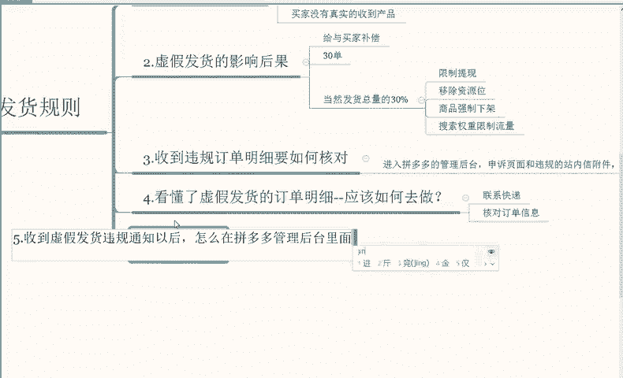

# 【拼多多运营】2024年最系统的全套拼多多运营教程，适合所有拼多多开店新手小卖家自学，10年资深运营师手把手教你从0到1起店实操。 - P23：23-虚假发货规则2 - 拼多多运营教程_ - BV1H62ZYREs4

好，我们继续。那如果说我们的店铺不幸被系统所查到，那么收到了违规订单明细，我们要如何去做核核对？嗯，首先呢第一步先进入拼多多的一个管理后台啊申诉页面啊申诉页面和违规的一个站内性附件啊，它里面会有啊。

这个附件里面就会有对应的明细按钮啊，明细按钮啊，点击进去就可以看到啊内容就是虚假发货的订单明细这些订单明细就包括什么包括我们的发货时间啊，店铺ID商品名称啊，商品ID商品名称、商品类型、快递公司啊。

以及快递的单号以及违规类型和参考的一个解决规则啊，这些综合方面。其中一个点我们要注意的是什么？就是我们需要关注主要的违规类型和参考规则。同时我们自己可以根据规则去核对对。对应的一个订单违规的一个原因。

然后去申诉解决，看有没有通过的一个概率。但是相对来说通过的概率会更低一些啊，这个我们了解到如何去做查看，然后因为什么原因，然后对应的准备相应的一个证据进行申诉就可以了啊。

但是这个申诉率还是像我刚才说的啊比较低。那么我们看懂了虚假发货的一个啊订单。

明细以后知道了哪一些订单被判定虚假发货了。那我们啊应该如何去做啊。刚才我说到的申诉是一个方面。嗯，首先我们应该是尽快的去核实发货的一个情况以及快递的一个单号。比如说你的物流延迟了以后。

那么你就应该联系快递去解决一下，看这个快递能否正常的一个发出，还能不能正常的更新物流信息，或者是说他单纯的就是运送比较慢。比如说你发的邮政或者是发的一些偏远地区，它本身运送的一个时长就比较久一些。

所以说先核对具体的一个原因。然后我们再去参考解决的一个方案，包括说快递的一个单号，快递公司信息以及正确的填写，包括说包括未提交公司的，我们也尽快交寄啊，快递公司未及时包裹发出的，也要催快递那边尽快发出。

包括说信息填写错误的，也及时更正。比如说买家的一个收货地址这些。

啊，都会有一个影响。所以说这个一是一个综合方面啊，综合方面总的来说就是联系快递啊以及。核对。

订单信息啊以及核对订单的一个信息。

那么。第五个点，我们收到虚假发货违规通知以后啊。

如何。怎么在拼多多的一个管理后台啊里面进行申诉。啊虽然说。

申诉的一个通过率不高，但是我们也什么都不能不做啊，这个做和做没做成功是两个概念。所以说我们一定要去做，做了以后才能产生我们需求的一个效果概率。我们就不说他百分百能够通过。但是我们不做的话。

那这个处罚就是百分百的。所以说我们需要去做的啊，还是。

在于。这个平台的一个申诉当中啊，虽然说申诉通过率不高，那么我们怎么样去解决呢？这个叫要下载啊，下载查看虚假发货违规订单啊，就是我这个点给大家说到的啊啊这个点给大家说到的啊，看一下战内性里面。

下载一下，看一下虚假发货违规明细当中订单具体的违规原因啊，了解违规原因，具体是因为什么是快递运送慢，还是买家收到错误，还是说收到货板不对啊，根据违规的原因提交对应的申诉材料，申诉材料可以。是文件也好。

图片也好，视频也好啊，平台会根据提交的材料啊进行审核。那比如说。你的物流。你的物流是正常运输的，你也找快递核实了。那么你就把找快递核实的，比如说聊天记录呀啊。

包括说嗯语音通话呀这这一类型的一个视频类型都可以作为申诉啊，都可以作为申诉。或者说找快递开一个材质证明。那么如果说买家要求改地址，但是原订单地址没有修改，我们又寄到他修改的地址里面去了。

那这个就把买家核实。比如说你和买家沟通的一个聊天记录，然后放到这个申诉材料里面进行申诉就可以了。

