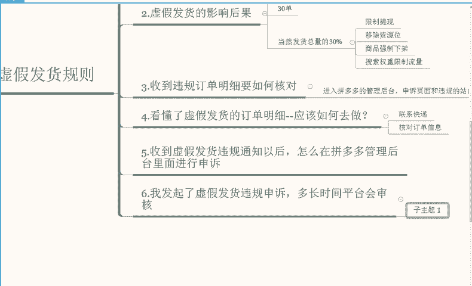
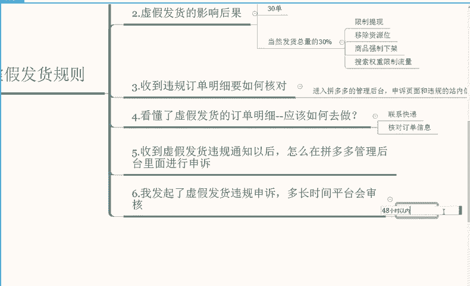
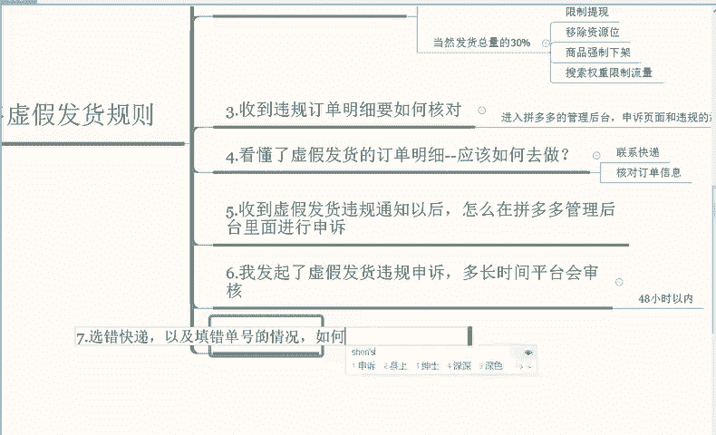
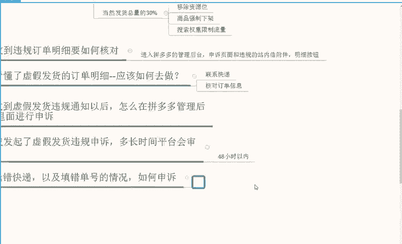
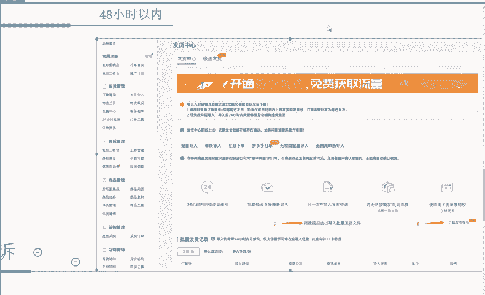
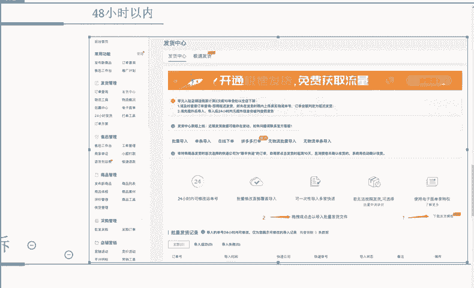
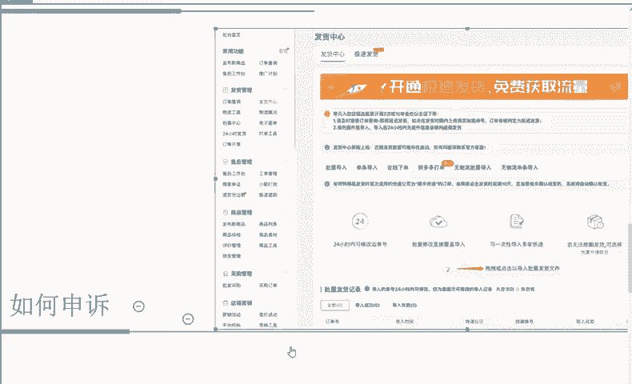
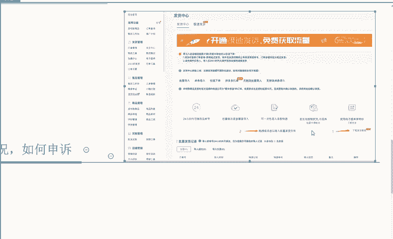
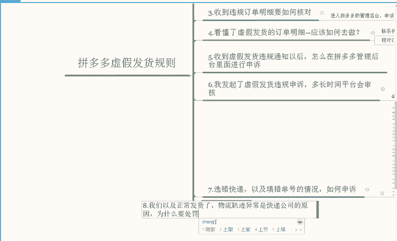
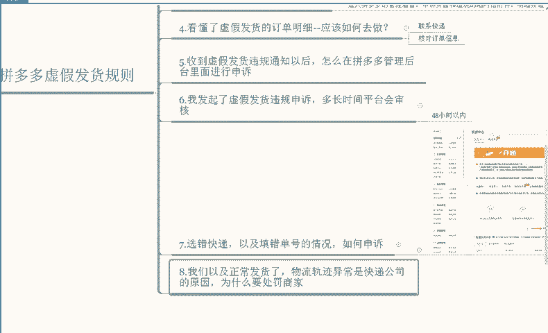

# 【拼多多运营】2024年最系统的全套拼多多运营教程，适合所有拼多多开店新手小卖家自学，10年资深运营师手把手教你从0到1起店实操。 - P24：24-虚假发货规则3 - 拼多多运营教程_ - BV1H62ZYREs4

好，我们继续。那么我们发起了申诉以后啊，多久时间平台才会审核通过，或者说审核结果出来。嗯，一般来说的话，我们指的是。定期限内发起的申诉。正常来说的话，就是在48小时以内啊，会有一个审核结果。

那么我们就可以根据审核的一个结果去针对性的做进一步的一个处理啊。这个就我们记录好时长就可以，48小时以内啊。

那么我们再来说一下呃，核对完明细以后有选错，或者说快递。单号填错的一个情况下，我们该如何去做有效的一个申诉就是选。选错快递以及填错单号的情况如何申诉啊，这个给大家说一下，这个比较重要。

就是针对到订单在30单以上的申诉，在核对的订单明细当中啊，它的一个物流单号，如果发现存在快递公司选错或者物流单号填错的的一个情况下，我们可以在表格当中啊，我们可以在表格当中就是我们的这个明细啊。

我们的这个附件明细里面就可以看到，就是针对到正确的快递单号填入到里面啊，然后到后台进行申诉，并描述好情况，等待审核就可以了。那么针对到违规订单在30单以内以下的一个情况啊，申诉的话。

我们在核对明细的物流当中。如果发现快递公司选错或者说物流单号填错的一个情况下，可以在申诉页面根据。

具体的一个情况，选择相应的一个理由进行申诉，等待审核。平台审核就可以了啊，那么审核人员的话，他在这个期间这个过程中会给我们开通一次更改单号的一个机会啊，会给我们更改的一个单号机会。是哪一部分。

我给大家说一下啊，就是这一块。

这个我们放大去看一下，会给我们更改的一个单号机会。那么我们就可以按照这个模板和我这张图片啊，123给大家标注的啊，下载发货模板。然后按照相应的模板和步骤上传正确的物流单号啊。

上传正确的一个物流单号覆盖原来的物流单号，在APP上面啊，这是手机端已经确认收货订单无法更改的啊，我们这个时候可以在后台备注啊，注意后台备注正确的单号啊，完成。

后我们就可以再次申诉上传覆盖成功啊，这样的一个截图，最后给审核人员给出相应的一个处理结果啊。具体的一个图片的话，你们可以看一下这个我也给大家做个标注啊，这个你们可以看一下先。

那么这一部分我们解决了以后啊，这一部分我们解决了以后，那么还要解决什么？就是。

如果说我们已经正常发货了啊，物流轨迹异常啊，这个是快递公司的一个原因啊，为什么要处罚？处罚商家呢。

这个是为什么？明明是物流错了，为什么要处罚商家呢？首先呢物流服务为我们店铺当中指标的一个服务一项。也就是说，物流是我们店内的一个指标，我们有就是商家有责任去保证物流正常走件。

你也需要去有效联系快递公司进行处理，并且买家可以在合理时间内收到购买的商品啊。那么平台也会根据拼多多的一个发货规则，对商家进行考核，同时针对违规的订单。以及。对于买家的一个补偿啊，有违规的订单。

对于买家进行一个相应的补偿就可以了啊，这个能理解吧？

