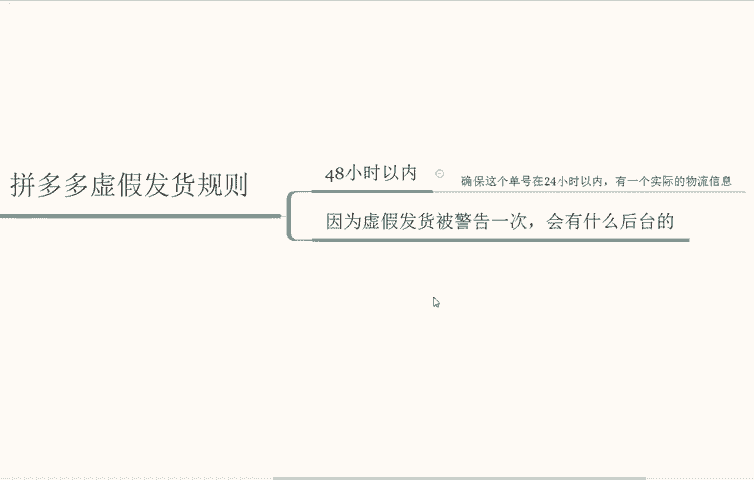
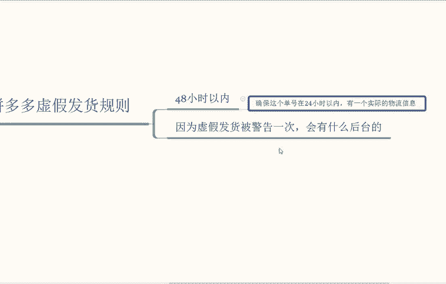
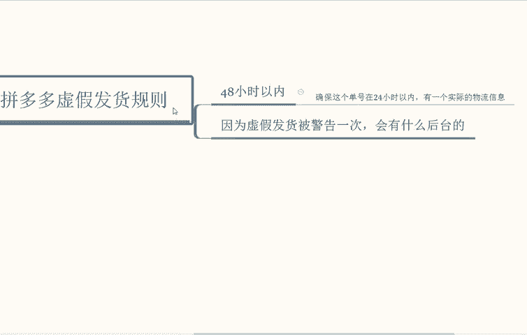
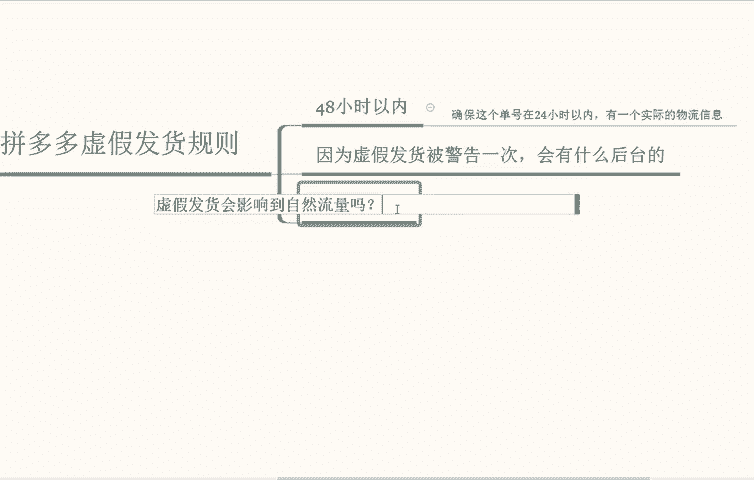
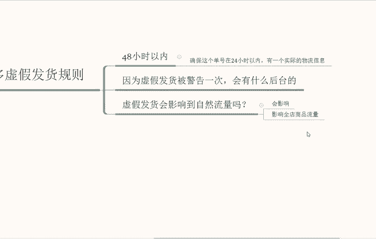
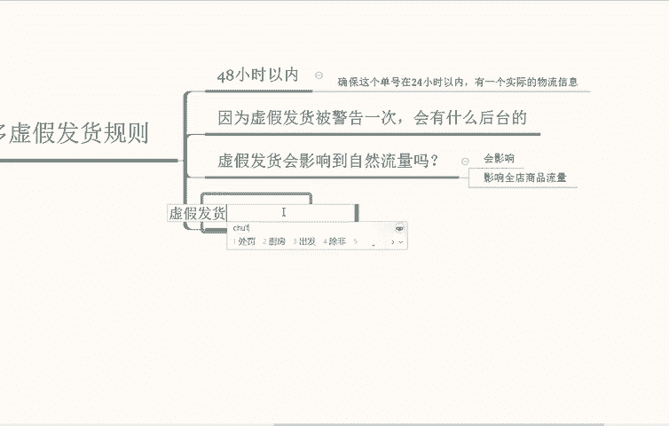
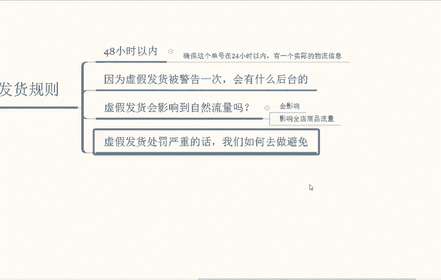
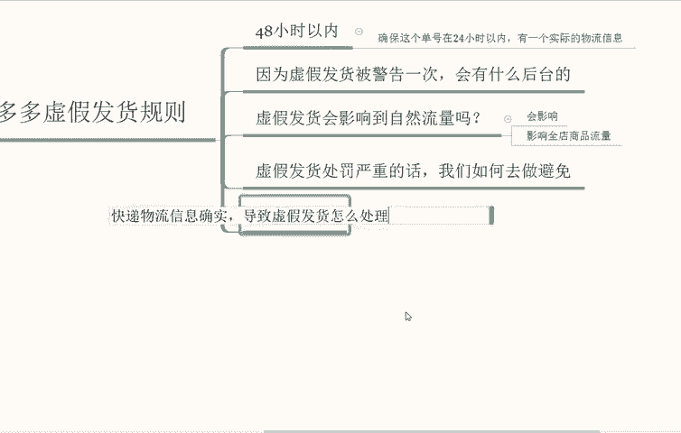
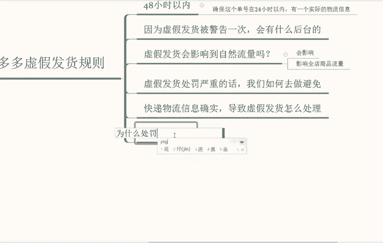
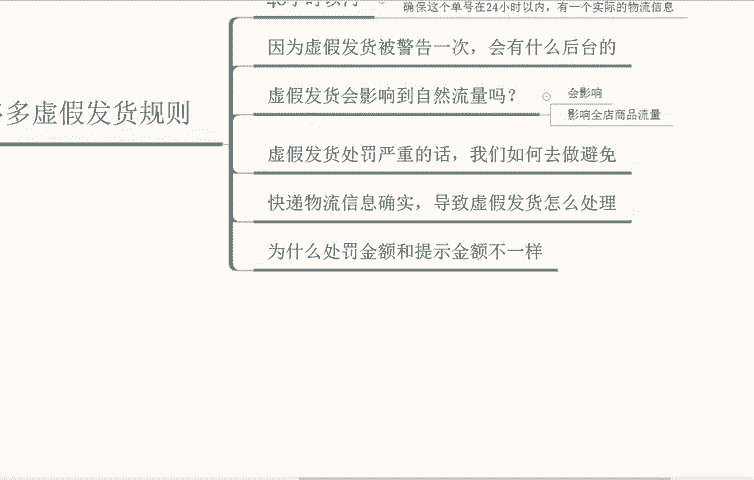

# 【拼多多运营】2024年最系统的全套拼多多运营教程，适合所有拼多多开店新手小卖家自学，10年资深运营师手把手教你从0到1起店实操。 - P25：25-虚假发货规则4 - 拼多多运营教程_ - BV1H62ZYREs4

好的，那这一期我们继续给大家讲一下拼多多的一个虚假发货规则。呃，上面几期我们也讲到了很多关于拼多多整体的一个规则。那么这一期我们主要核对的就是啊比如我们正常发货在48小时以内啊，小时以内进行发货。

但是为什么在承诺时间内上传的单号，点击了发货还会被判定啊，虚假发货呢，其实这个有一个原因就是点击发货以后我们还要应该确保这个单号在24小时啊以内有一个实际的物流信息在里面。也就是说，你发货了以后。

物流它是需要正常更新的，并且始终是正常走件啊，否则就有可能会被判定为虚假发货。所以说很多人可能会导致这个点。或者说忽略了这个小点啊，造成这样的一个处罚因素在里面。那么我们在规避之前的话。

就要把这一块的一个规则进行一个有效的了解。那么其次就是店铺的话啊，如果说因为虚假发货被警告了一次的话，会有什么样的一个后果？因为虚假发货被警告一次啊，会有什么后果？平台对于虚假发货进行了警告。

不会对店铺采取什么实质性的一个限制措施啊。当啊当次他也不会累积到违规的一个次数里面。那么接到警告通知的。

我们自己商家应该及时排查一下店铺运营当中的一个问题，做好发货管理的一个工作，并且注意好啊快递以及供应商提供服务时效时以及更新物流的时间信息。也就是我们上面提到的一个点啊，避免再次出现发货的问题啊。

这个点大家记住，警告一次，这个其实没有什么关系的。

那么虚假发货的话，店铺处理啊，它的一个措施是否会影响到自然流量啊，虚假发货会影响到自然流量吗？

会影响吗？这个答案是会影响啊，肯定是会影响的啊，并且店铺处理措施将影响全店的商品流量啊，影响全店商品流量啊，不是你说你那个个别的商品没有发货过去啊，他只处理你个别的商品，它是以全店为方式。

而不是某一个违规的商品啊，平台可能会采取。店铺处理措施的情况以及具体的措施。这个我们要去看一下后续的一个处罚结果，以他发给我们的。

情况而定。那么。我们再来说一下。虚假发货的后果太严重了的话，我们应该如何去避免虚假发货处罚严重的话，我们如何去做避免啊，如何去做避免？

买家商家发货虚假发货可能会存在多个原因啊，有些商家可能因为短时间内销量增加，导致库存不足而发不出去货。没办法，也有的商家会因为遇到自然灾害不可抗力等物流原因异常啊等等这些要避免此类情况。

那我们就应当在日常的一个经营过程当中注意库存的一个管理啊，根据商品实际库存自身发货能力以及物流供应商的一个产能等等因素，随时去调整商品的一个在线库存情况啊，这个也和我们运营有一个直接关系啊。

并不是说我们缺货我们还有理。这个我们自己就要做好把控，进行平台，它不会看松这些。因为自身原因所导致的啊客观因素。那么。😡，如果说遇到了自然灾害啊以及或者恶劣天气情况，比如说最近那个东庭湖不是发大水嘛。

部分那个地区肯定就没办法运送了们。那么恶劣天气等不可抗力情况下面或其他特殊情况下面，商家啊我们自己应该及时联系店铺对接运营，或者说平台商家支持人员沟通处理等等啊，不要贸然的去上传快递单号点击发货啊。

否则平台将会试做我们可以正常发货啊，可以确保物流订单物流轨迹正常，同时会按照规则进行监测，或者说处罚。所以你要及时进行上报啊。

那么。快递的一个物流信息缺失的话，导致了平台虚假发货。我们需要怎么样去做？快递物流信息缺失啊，违规发货虚假发货怎么处理？这个我们就要及时联系快递公司去修复缺失的过据信息，并保留好相关的一个材料。

同时及时的在申诉期内提升申诉说明情况，等待这个平台工作人员的一个审核，并补充人员要求的一个申诉材料。那么我们再来说一下最后一个点，为什么订单违规订单处罚金额与。

虚假发货的规则所提示的计算金额不一样。为什么处罚金额和提？金额和提示金额不一样。

如果说你违规的订单包含平台的活动订单，因此啊这个违规的订单处罚金额以及啊店铺的一个活动服务协议当中计算的一个金额为准，并非平台活动订单正常按照虚假发货的一个规则进行计算，这个能明白吗？

