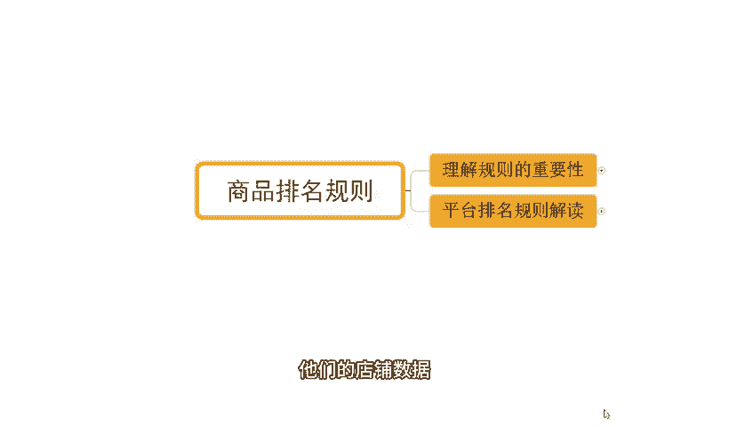

# 【拼多多运营】2024年最系统的全套拼多多运营教程，适合所有拼多多开店新手小卖家自学，10年资深运营师手把手教你从0到1起店实操。 - P26：26-拼多多商品排名规则 - 拼多多运营教程_ - BV1H62ZYREs4

hello，大家好，我是西楼。那么今天给大家分享的内容呢是我们拼多多新手开店爆款打造步骤中的商品排名规则内容啊。那么规则呢，对于我们商家运营来说。可以说是双刃剑吧，既保护了我们的发展。

也限定了我们的发展。所以我们也要了解清楚它，并且加以利用。那像我自己开店，包括说像我带实操的小伙伴的话，我们也都会完全的去理解规则，并且加以利用，好吧？可以看一下，近期跟着我一起实操小伙伴呢。

他们的店铺数据啊，像这些店铺，对不对？是一个从零开始的一个新店来的，对吧？最早呢是临访客啊。

那么从银房开始呢，跟着实操，那么访客呢快速增长，对吧？到后期呢做了一个小的爆发啊，最终呢访客是形成了一个1000的一个数据啊。一天啊，那么一天订单呢是1800多单啊，转化率呢13。85啊。

那么除了这个店铺之外呢，还有像这个店铺对不对？那么访客呢一开始呢是有1000多，对吧？那跟着实操之后呢，整个店铺呢也是呈现出一个访客快速增长的一过程，到后期呢，访客一天也是做到了13000，对不对？

订单的话一天是1600多单啊，转化率呢12。23啊，那么类似这种店铺呢还有很多啊，这里呢我就不一一展示了啊，总之规则的利用呢，对于我们新店来说，对于我们老店来说都是非常非常重要的，对不对？当然呢。

对于很多的新的小伙伴来说，尤其是小白可能什么是规则都不清楚，对吧？更别说去加以利用了啊，那么对于店铺操作来讲的话，也会有到很多很多的困难，对吧？这个很正常。因为本身自己不懂啊。

那如果说你是有这种店铺操作方面的问题，或者是需要资料的，都可以找我。那有时间的话，我也可以带着你一起实操做店啊，就像这些小伙伴一样，对不对？我们一起呢把店铺呢啊做到一个快速提升的一个一个效果啊，OK啊。

那继继续啊直接开始。那首先呢我们了解清楚规则的一个重要性，对不对？理解规则，那这样呢才能够正确的去对待这个事情啊，首先呢我们来说说规则的一个重要性啊，他首先是可以提高我们这个用户的体验的啊。

那么呃用户呢他在针对到我们的平台推荐过程中呢，那么系统呢会加以分析，对不对？那针对到我们用户的一些行为习惯啊，比如说他的一个啊搜索历史或者是这个购买的行为或者是一些偏好啊，加以识别。

那么这个时候有了这样的一个规则之后呢，后期整个用户呢，他也会更加精准，带来更好的转化数据，得到更好的发展啊。那所以我们在整个过程中呢，就需要去加以我们设有结果的一个优化啊。那么这个优化过程中呢。

也是针对到我们规则的一个理解啊，有了一个清晰的目的之后，有了目标，我们才能有到一个更好的效果，对吧？那到底什么是规则，这个规则到底怎么去玩的啊，我们来看一看啊。

首先呢平台对于我们商品的排名呢是有到一个非常非常清晰的一个啊这个规定的啊。那平台的类目商品排名呢是按照一段时间的商家商品上新时间啊，我们的销量、价格质量、售后、商品评分等综合因素进行排名更新的啊。

这个是官方的明文规定啊，不是说我说的啊，那么有了这样的一个这个规定之后呢，我们所有的排名优化啊，就需要遵循着啊以上的这些内容来展开啊，而整个的排名考核的话啊。他说的这些东西的话。

其实呃不管是上意时间也好，还是说我们的销量也好，还是价格也好，或者是售这个质量，或者售后或者是综合评分，对不对等等这些东西啊，它是进行综合计算的。那么综合计算就很有意思啊，那我们需要在各个领域。

各个细分的项目里面去做文章。那不是说单独做好某一个点就可以了。所以这个是我们很多小伙伴坐店的一个呃非常大的一个缺陷啊，它只盯着某一个点去操作，可能就会导致整个提升的过程非常缓慢，或者是没有效果。

那整个的这些内容呢其实是划分为了4个考核项目的哪4个呢？分别是我们的呃店铺数据、商品质量、商品数据，还有处罚率这四个项目。而其中呢店铺数据呢是我们的3分钟人够回复率，30天投诉率。

这个物流服务异常率、品质退款率、纠分退款率等等啊，那么。商品质量呢这个东西不是说我们商品能够用多久，用的什么工艺，用的什么材质啊，而什么呢？而是我们商品的标题、关键词、主图、详情图片、价格属性等等啊。

而而我们的商品数据呢是我们商品的销量收藏转换率，剩下时间。处罚类的话就很好理解了，对不对？我们店铺呢有没有违规，有没有虚假发货，有没有受到限制，有没有低价引流，有没有描述不符，有没有历史违规等等啊。

那么都是属于处罚类的。而这些数据考核呢，它实际上是有侧重点的。这里我要重点说明什么呢？就是对于店铺数据和我们处罚类来说，这两个项目呢，它的考核仅限于。降权不管加权。什么意思呢？

当我们的店铺数据达标的时候，当我们的这个处罚类达标的时候。我们店铺呢是可以正常曝光的。但是如果说我们这两个数据板块考核的时候呢，你不达标，那么平台可能在你正常曝光的基础之上会减少你的曝光数据。

而商品质量和商品数据呢才是真正意义上去给到我们更好加权的，给到我们更多曝光的一个东西啊。所以我们后期重点优化的话，是以这两个板块来的啊。而这个部分的话，我通过啊画图的方式给大家重点来说明一下啊，好吧。

大家可以认真看一下。O。那么现在呢我来。现在呢我来画一个图哈。

来。那么现在呢这边有一个框子啊，这个框子呢，我们可以理解为就是平台啊。那么在平台呢，我们某一个商品呢，它的一个曝光情况呢是分为呃各种数据的嘛，对不对？我们画出一个横轴啊，那同时呢我们再画出一个竖轴。

那横轴这个部分呢，我们可以理解为它是什么呢？它是我们的这个店铺的一些这个考核点，对吧？我们的一个基础数据，我们的商品质量啊，那竖轴这边呢啊从上往下是我们的呃商品数据。那我们的商品曝光呢。

它是基于一个点展开的这个点呢就是中间这个小圆点啊，这个部分啊这个部分是一个圆点啊，是访客零的一个状态啊。当我们的店铺数据啊，能够去做到最好。当我们的这个商品质量能够做到最好的时候呢。

它能够覆盖完整的整个的曝光范围啊，就是这个橙色的这块啊，它是我商品能够覆盖到的最大的曝光范围。而我们商品刚发布的时候，我们没有任何数据的情况之下，可能它的一个数据呢是基于零点的对吧？是这个小圆点。

在这个部分啊，那么当我们的呃商品的质量。考核达标的时候，那我的覆盖范围其实更大了，对不对？当我的产品的标题达标。好，我可以往这边往我们的右边挪一挪，对不对？当我们的呃商品的图片达标。

我可以再往这边挪一挪。当我们的更多的数据，比如说我的价格，我的属性啊，还有我的这个其他的一些这个呃东西能够达标的时候呢，我可以覆盖完整的一个内容，对不对？那我们整个商品的数据板块的话，我的产品的销量。

我的产品的转化率等等这些达标对吧？那么它可以往上爬啊，当这个数据呢越来越好的时候，我的这个整体范围会来越大，直到最终呢覆盖到整个范围。那么这是我们的最大的曝光状态，对不对？而这个时候大家注意看了啊。

有一个非常重要的点是什么呢？那呃我们竖轴往下这个部分啊，这条轴啊，我们可以理解为是我们店铺的一些违规。啊，是我们店铺违规啊，那呃或者是我们的数据不达标的一个状态吧哈，我们这样理解吧，嗯整个的这一个数轴。

等一下啊，我得重新画一下啊，这个图片被我给弄坏了啊。

OK再来一次啊啊横轴和竖轴啊，这个也比较快速啊。以红色颜色还是刚刚的方式画出来。然后我再切换成黄色啊或者橙色啊，把整个范围画出来啊。好，这个是我们整个商品的曝光状态。那么横轴这边呢。

刚刚我们提到的是我们的商品的。这个质量对不对？这里呢我把文字打上去啊。商品。商品质量。那数轴呢，这边是我们的。商品数据。O。那么数据不达标，数据或或者说是数据考核比较弱的话，它会少吧，对不对？

达标的话是撑满的啊，那这个时候呢，再往下面这个部分呢，我们讲它是我们商品的。

啊，刚刚这个不小心双击了一下啊，再一次。

这边啊那么竖轴这边呢是我们的这个呃商品的。这个店铺啊店铺的这个呃数据。然后呢，这边是我们店铺啊违规。处罚类吧啊，我还是写的。标准一点啊，OK可以看到啊，当我们店铺的数据不达标的时候，对吧？

那整个这一个橙色部分啊，原本的这个橙色部分它就没有办法再完整的去覆盖了啊。我们换一个颜色，画一个框子啊，来画一个绿色。好，这个是我们。真实的店铺数据真真实的这个商品数据啊，当我们店铺数据不达标，对吧？

我们刚刚讲的30天投诉率啊，或者是我们其他的一些东西不达标的时候，它可能就会往下降啊，它的起点会从原点往下走啊，起点会从原点往下走。于是乎呢我们整个的曝光数据呢就会减少。

减少部分呢就是这一个呃橙色和我们绿色这个空隙这一块啊，那如果说我现在店铺的呃，还有这个处罚在对不对？OK那我们可能整个曝光呢又会往左移。对吧那么又会损失掉一部分。最终呢我们得到的结果呢。

可能就只能剩下啊这个紫色这一部分，对不对？那整个这个过程的话啊，当我们有处罚，有店铺数据不达标，那么整个的数据呢就会越来越少，对吧？最终可能就会呃慢慢慢慢的变成最少的一个状态啊。

如果说严重违规或者是电铺数据，确实呃怎么DSR评分呢，各种各样的东西呢都不达标的时候，那我们连曝光都很难获取。我们可能知道这个最下面去了。所以这是一个非常恐怖的事情。而我们在操作过程中的话啊。

处罚类和店铺数据的话，这个东西不是我们说能够去呃很好的去杜绝的啊，我们要尽可能的去做好一些呃防止店铺数据不达标，防止我们被处罚的一些问题，像我们发货过程中的一些细节啊。

包括说我们在针对到客户的一些售后处理方面的一些一些细节啊，我们要做到位，对不对？包括说我们在店铺运营过程中，我们各项的一些服务指标也要达标。那么这样才能保证我们的一个正常运营。而保证这些处罚类店铺数据。

不出现问题的前提情况之下。我们就要针对性的去运营好我们商品的质量，还有我们生品数据，对吧？那保证我们产品呢本身是有到一个很好的标题，很好的主图，很好的价格，很好的属性，才能够有到更大的基础曝光的范围。

它影响的是我们整个商品流量的广度。而我们整个商品数据呢，就是影响到我们整个商品的曝光的深度。广度越大，深度越多，我们整个的曝光，整个的流量也就越多啊。那么具体的每一个数据考核细节。

那么这个呢是因我们产品不同而不同的啊，所以这个板块呢，我没有办法去拿到具体的数据给大家进行分享啊。那如果说大家对于整个自己产品的考核点，哪里不清楚的呢，我们可以多交流好吧。

对于整个店铺的一个啊排名规则的话，那么到这个部分呢，应该是能够去相对来说讲的比较清楚的。如果说哪里不清楚不明白的话，也可以直接跟我说啊，尤其对于我们很多的线在小伙伴来说，可能呃对于店铺运营来讲的话。

会有到很多很多的一些问题。我刚才提到过，对不对？那么如果说是有这种店铺招方面的问题啊，需要资料的，可以找我好吧，那有时间有机会呢，也可以带着你们一起实操做店，就像这些小伙伴一样呢。

我们一起呢把店铺呢给他快速的做起来，好不？有个更好的一个方法去操作的话，其实也会更快速。OK的啊，那关于规则的介绍呢就到这个地方。

那后期呢我也会针对到更多的关于我们拼多新手开店爆款打造步骤的一些详细讲解啊，分享给大家。那么大家可以关注一下，今天的视频分享呢到这此里结束，我们下期再见，各位，拜拜。

这边呢给大家准备了将近100份的一个文档，可以帮他更好的了解我们拼多多运营拼多多，能够提高大家运营水平。如果大家需要的话，评论区找我领取。

