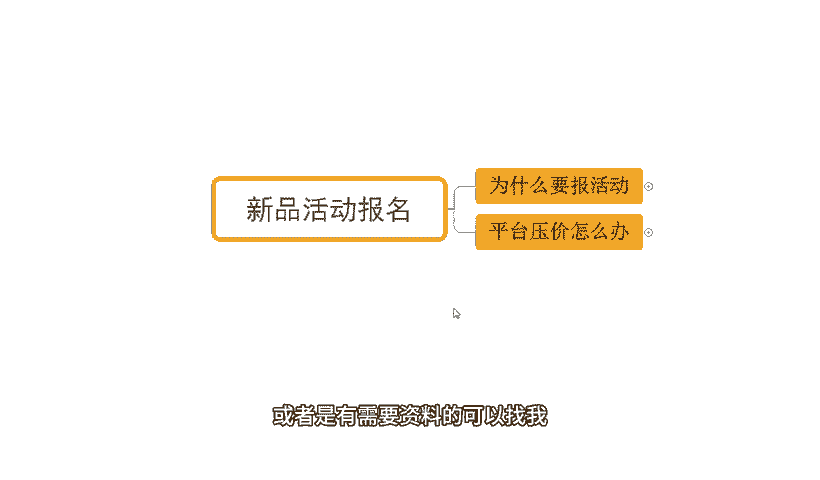
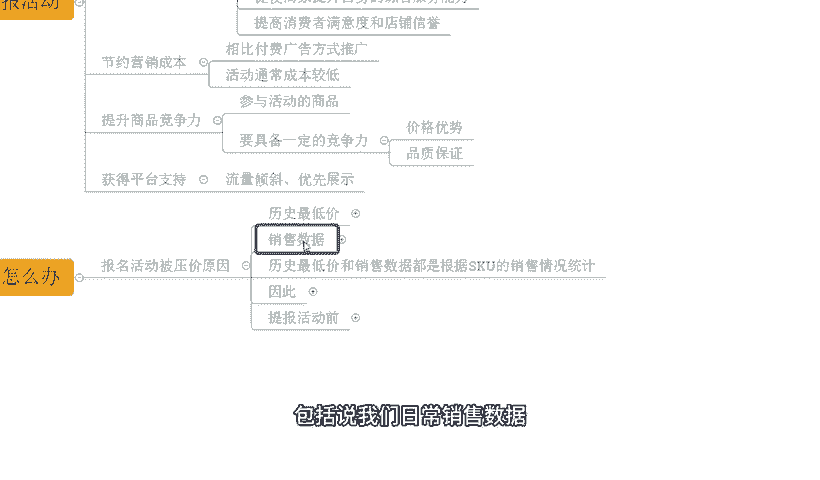

# 【拼多多运营】2024年最系统的全套拼多多运营教程，适合所有拼多多开店新手小卖家自学，10年资深运营师手把手教你从0到1起店实操。 - P28：28-拼多多新品活动报名 - 拼多多运营教程_ - BV1H62ZYREs4

hello，大家好，我是西楼。那么今天给大家分享的内容呢是我们拼多多新手开店爆款打造步骤中的新品活动报名的内容啊。那么对于店铺运营来说的话，活动报名是一个非常非常重要的部分啊。

因为它可以带动我们店铺的访客增长，带来更多的订单啊。那么具体活动报名应该怎么去玩？OK的那我们也会进行详细分享。首先呢先看一下啊，那近期呢跟着些时尚小伙伴他们的店铺数据，好吧。

那么像这个店铺呢，最早呢访客是一个啊临访客的一个店铺啊，那从最早临访客呢跟着实超。那整个店铺数据呢一直啊快速提升。到后期呢一个小爆发之后，访客呢做到了1300一天啊，一天订单呢1800多单。

转化率呢13。85啊。还有像这个店铺也是一个新店来的，最早临访客对吧？跟着实超之后呢，整个店铺数据呢也是非常快速的增长啊，做到了一天呢，访客是6300啊，订单的话一天是1100多单。

转化率呢做到了18。13啊，也是非常不错。那除了这种临访客的新店之外呢，包括说还有这种店铺，对不对？原本呢是有一定数据的那最早的访客是1000多，跟他实施之后呢，整个店铺也是非常快速增长，对吧？

做到了将近14000啊，13000多，对吧？那么整个的订单呢一天是1600多单，转化率呢12。23啊。

那么类似这种店铺呢，还有很多，这里呢，我就不一去展示了。好吧，那对于店铺运来说的话，有非常多的小伙伴呢会有到很多很多问题，对吧？

就比如说我们的活动提报来说吧啊会有到很多的一些小伙伴呢会觉得不知道怎么去报名活动啊，活动报名的时候呢，会有到一些这个压价之些的东西啊。

那么没关系啊，如果说你是有这种店铺操作方面的问题啊，或者是有需要资料的，可以找我有时间的话，我也可以带着你们一起去实操做店啊。就像这些小伙伴一样呢，一起呢把店铺呢做起来好不好？O啊，那么回到主题中来。

那么首先呢我们要去做活动的话，就要搞清楚为什么要报名活动，对不对？报名活动都没什么好处啊，把这个东西搞清楚之后呢，才能有到更加清晰的一个运营思路啊。首先呢第一个点。

报名活动的话可以提高我们店铺的流量和销量啊，这是必须的。为什么这样说呢？首先报名活动呢，它可以快速增加我们产品的曝光率和流量啊，包括说像我们的活动呢，它会有到自己的独立的啊活动的展示渠道。

包括说一些活动的专题页啊，或者是搜索端口的一个优先推荐啊等等。

那这种情况之下的话，我们的访客可以得到提高。那访客提高如果说转化不变的话，那我们整体的订单也可以得到增加，对不对？当然了啊报名活动之后本身我们有到一个活动优惠。那么这个时候呢。

往往转化率也可以得到提高的啊。所以这种情况之下呢，我们整个的一个产品群众来说啊，也可以得到一个快速的拉伸啊。那么再一个呢就是我们整个报名活动呢，是可以帮我们提高我们店铺的知名度的啊。

那么通过活动报名时候呢，我们可以产品得到更多的展示，得到更多的曝光机会。那么有了更多曝光机会之后呢，同时也可以得到更多的用户关注和认知。同时呢也可以提升我们产品的品牌知名度和形象啊。

带来更好的产品的访客啊，积累更多忠实的一个访客。

那么再一个呢，就是我们整个报名活动呢，可以提高我们店铺的服务能力啊。首先知道一件事情就是说我们在报名活动的时候呢，平台是需要考核到我们的服务质量的。

那么这个服务质量呢包括了我们的售后服务、商品品质以及我们的物流服务等等啊。那么为了让我们去能够完成活动的提报，那么我们这个时候呢也会自觉的去维护好我们店铺的综要服务能力啊。

带动我们整个店铺的一个服务提升。那从而呢保证我们店铺呢在消费者满意度上，还有我们店铺的信誉上面能够得到一个很好的增长啊。同时呢我们整个的活动提报呢，还可以节省我们的运营成本啊。

那我们相对于说付费推广来说，报名活动的方式肯定会更加节约成本的这个是必须的啊，也是经过认证的。大家可以去了解一下。

那么再一个呢，就是我们在正常的报名活动的时候呢啊报名活动呢可以提高我们产品的竞争力啊。因为我们产品报名活动的时候呢，是会有到一个价格的浮动的，对不对？我们价格可能会减少啊。那么这个价格减少之后呢。

我们的商品具备一定的一个竞争力之后。

我们产品呢有一到价格优势，并且呢也能够保证我们店铺的一个品质，对不对？OK那我们的整体转化也会得到增长啊，商品呢也可以达到更好的一个啊数据提升。我觉得这个是好的。

那最后呢还可以帮我们去获得我们平台的一些支持啊，很多的活动呢都会有到活动的专属页。这个我刚刚说了啊，而且呢哪怕他没有专属页的话，也会有到正常的活动推荐啊，所以这个时候报名活动呢。

我们整场的一个曝光是可以得到提高的。而且还有一点就是什么呢？同样的商品有活动的跟没有活动的商品群众一样的话，优先展示的一定是活动上面的，所以说我们在正常的店铺运营过程中呢。

尽可能的去多的一些提报活动好吧？O那么再来说一说大家可能比较关键话题吧。很多小伙伴呢说哎我有去做活动啊。但是呢我报名活动时发现一个问题啊，平台会压价呀，对吧？那这怎么办？

那首先我们搞清楚压价的原因是什么，好吧。

那么这平台压价呢是一个必然的状态，因为它会从我们的历史最低价，包括说我们日常销售数据多个维度去考量啊。那首先我们要说历史最低价啊，那活动提报的时候呢，要求我们的产品的活动价格呢不高于历史最低价啊。

或者是低于历史最低价。所以这个时候呢，如果说我们自己报名活动的时候呢，这个活动价格比较高，或者是之前呢有的更低的价格，那么就会受到限制。

那么我们就可以去调整，哎，让我们价格比之前低一点啊。那再一个就是我们的日常的销售数据啊。首先呢平台呢会针对到我们日常销售数据进行考核。如果说我们日常销售数据很差啊。

那么这个时候呢平台就会判定我们的商品没有价格竞争力。那为了提高我们产品的活动的产出，那么也会根据我们同类商品呢来做出一个预估的价格给到我们的一个建议价，那么这个建议价呢就会可能比较低一点。

或是啊就会压我们价格会什么样的啊，那么。

根据这上面的一个了解的话，那么我们可以知道就是我们的历史租定价也好，我们的这个销售数据也好呢，它其实都是根据我们当前SKU的一个销售情况进行统计分析的。

所以说这个时候呢，如果我们要杜绝被压价的话，那我们就可以去做一个没有历史数据的SQU来规避历史最低价和销售数据的考核。那么这就可以了。所以操作方式如下啊，在我们进行活动提报之前。

OK我先去添加SQU那么这个SQU呢，我们去设置成什么呢？用目标活动价除以折扣的方式来计算它的拼单价。

那么这个时候报名活动之后呢，我们的产品价格呢就可以得到一个比较高的一个价格啊。同时呢，如果说我们有优惠券的话，我们可以用到这个呃先减去优惠券的方式来计算啊，可以的啊。

比如说今天呢我们的活动价呢是10块钱。那么我在活动活动报名的时候呢，是报5折，于是乎呢，我的拼单价就是10除以0。5啊，等于20，那么如果说我是有优惠券对吧？比如说我优惠券有10块啊。

那么我就要用到这个1先去加上10块，对吧？要把优惠券的部分加上去啊，那么然后呢再去除以5折。比如说我现在呢加上优惠券就是2020除以0。5就是40，那我报名活动的时候呢，就要报40块钱啊。

那么然后呢在上活动的时候呢，我们去做这样的一个新的SQ，让它能够规避掉我们的历史价格的一个考核。同时呢把原本的SQ呢可以下架掉。那么这个时候再去报名活动就可以了。或者是我们在报名活动的时候呢。

针对到我们新增的SQ去报名啊一样的可以的。那么这个时候正常的活动提报就可以通过了，而且是以原价的方式去报名的。OK啊，那么对于我们店铺运营的话。

像有很多很多的一些细节问题呢是大家可能在日常运营中会遇到的，对不对？那包括像我们刚刚提到的这个新品报名活动呢，其实是一个小的一环，但是也是很关键的一环。那么如果说店铺操作过程中呢。

还有到什么一些其他不清的问题，或者需要资料的啊，可以找我啊，有时间的话我也可以带大家一起去实做店啊，像这小伙伴一呢，一起呢把店铺给做起来好不好？O啊，那么后面呢我也会针对到我们这个新手开店步骤呢。

更多的一些细节进行详细分享。那么今天呢关于我们新品活动提报的内容呢，就到这个地方我们下次见各位拜。这边呢给大家准备了将近100份的一个文档可以帮更好的了解我们拼多多运营拼多多能够提高大家运营水平。

如果大家需要的话，评论区找领取。

