# 【拼多多运营】2024年最系统的全套拼多多运营教程，适合所有拼多多开店新手小卖家自学，10年资深运营师手把手教你从0到1起店实操。 - P2：02-拼多多店铺类型 - 拼多多运营教程_ - BV1H62ZYREs4

hello大家好。那么今天呢我们来学习一下关于拼多多新手开店实操运营白皮书系列课程当中的第二章的内容。今天要跟大家分享的知识点呢是关于我们拼多多店铺类型的一个讲解。

如果说我想要在拼多多这个平台上去开一个店铺。那么首先我得搞清楚拼多多平台，它的店铺类型到底有哪些？我自己要卖的这个商品呢是适合哪一种类型的店铺去运营的。如果说啊我选择错误的一个店铺类型。

那对于我后续的这个运营是有很大的影响的，甚至可能还会造成不必要的一些损失。那么首先我们来看一看啊，到底拼多多店铺有哪些店铺的类型呢？首先我们的店铺呢可以划分为两种类型，一个叫做个人店铺。

一个叫做企业店铺。那么个人店铺呢又根据我们的这个经营主体啊，又可以划分为这一个个人的这个店铺以及个体工商户的这样的一个个人店铺。

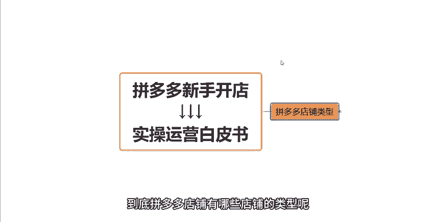

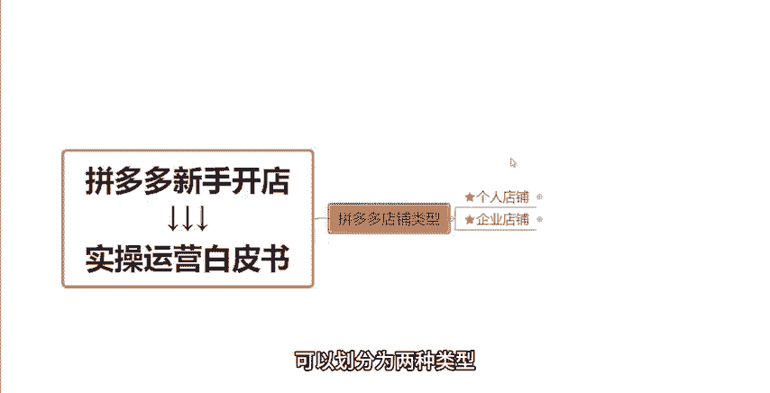

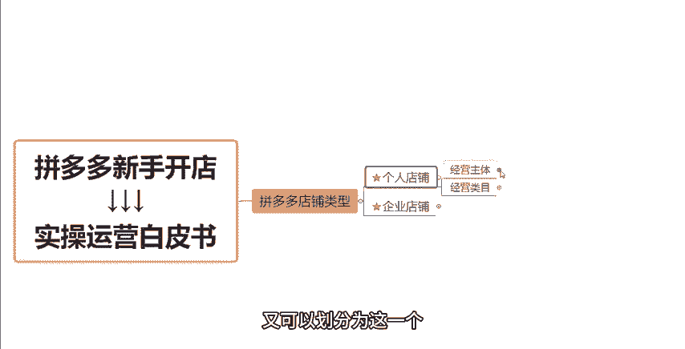

那么这两种类型呢，可能大家对于这个点是很容易产生误区的。这两个这两个类型啊都是属于这种叫做个人店铺的。哪怕就是说我们的这个个体工商户，它是有营业执照的。但是它仍然是属于个人店铺的。而在经营类目方面。

我们可以看一下啊，在我们入驻类目啊选择类目的时候呢，有两种类目是可以选择的，一个叫做普通商品，一个叫做医药健康。那普通商品呢，它又划分为11个大类。

分别是我们的水果生鲜美容美容各户、家居生活、服饰、箱包以及母婴玩具。

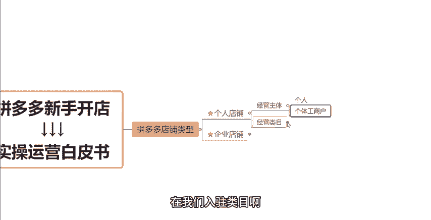

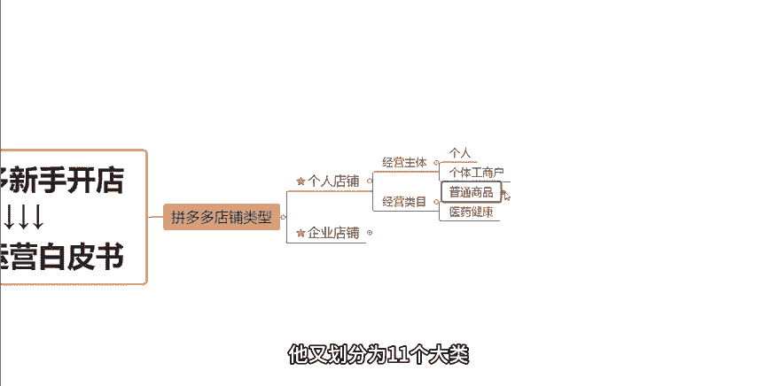

这边是美容以及食品保健以及虚拟商品以及户户运动、户外、数码电器以及家纺、家具、家装和气片摩托。那么在这些类目当中呢，我们实际的运营过程当中啊，不同的类目，它会有这种不同的一些对应的资质要求。

那在这个具体的要求啊，具体资质。我们在后续给大家讲这个店铺入驻资料的时候呢，会给大家详细的讲解，大家不用着急。而这里我要重点给大家说明的是什么呢？就是像我们的一些比如说虚拟商品啊，像这一个一些门票啊。

然后车票啊，或者说这种话费充值啊，这种Q币充值啊等等，这种特殊的商品啊，是只允许企业店铺去经营的。当然也有人去做这个类目是通过这个个人店铺发布的啊。

那通过这个个人店铺发布呢是直接通过这种比如说本地生活服务啊，这些其他类目去发布。这样呢可以避免我们店铺入驻。

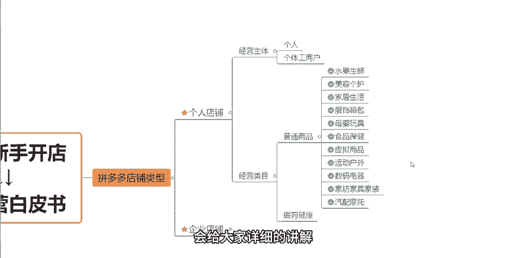

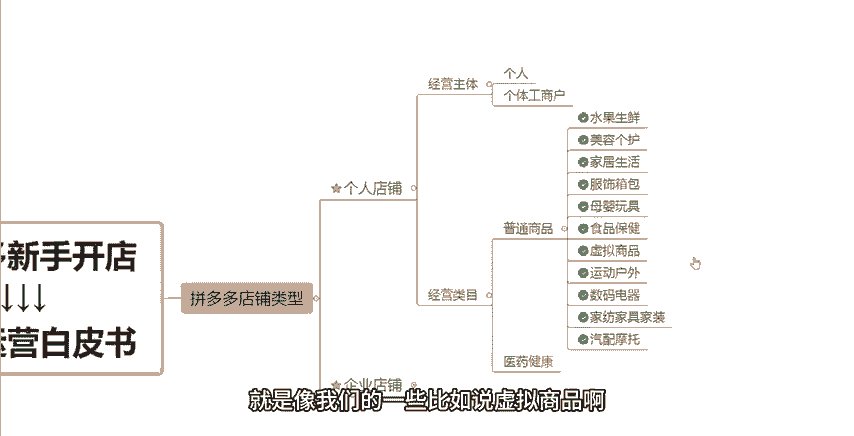

入驻的时候，它的一个资质的一个限制啊，以及说呃因为做这几个类目的话，它的一个保证金是非常非常高的啊，这样就可以规避掉。我们需要去交一个这种非常高的一个保证金。但是啊它会有一定的这种叫做什么呢？

排查的风险。如果说平台排查到你的这个店铺啊，可能会导致你的店铺会被封电的，这些都是有可能的。那么企业店铺呢我们来看一下它的一个店铺类型啊。

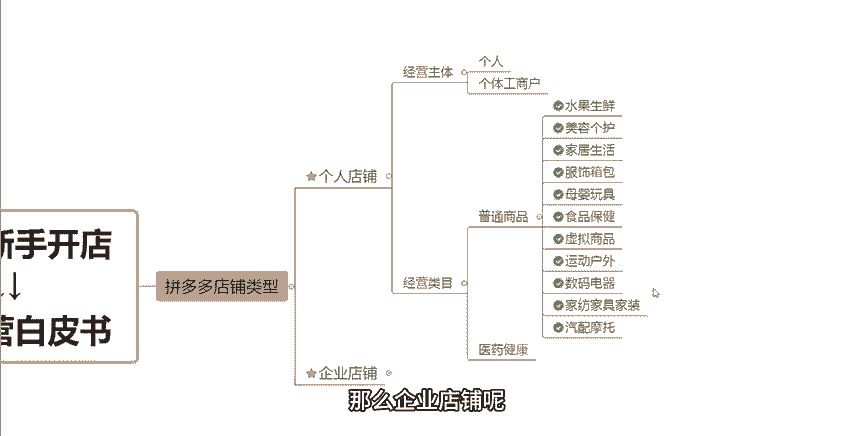

企业店铺的店铺类型会相对的多一点啊，主要有这个旗舰店、专卖店、专营店跟普通店四种类型。那么其中呢旗舰店啊它是经营一个或者多个自由品牌的企业店铺。而我们的专卖店呢，它是经营一个自由品牌的这种企业店铺啊。

那么专营店是这个拼是这个拼多多商城啊，同意招商大类下一个或者多个品牌的一个这种企业店铺啊，而这个普通店铺呢，对于这个什么？对于这个品牌啥的啊，是没有任何的这种要求的啊。那么在经营的过程当中啊。

这几种店铺的话，它的权重实际上是会有一定的这种差异的。旗舰店它的一个权重啊是会高于我们的专卖店的啊，高于我们的专营店的。那么专卖店跟。

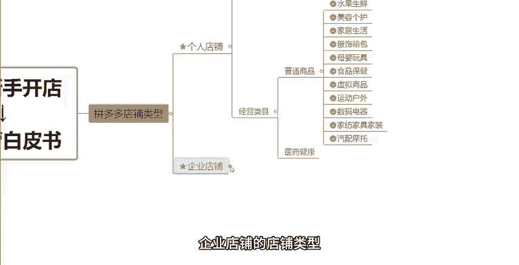

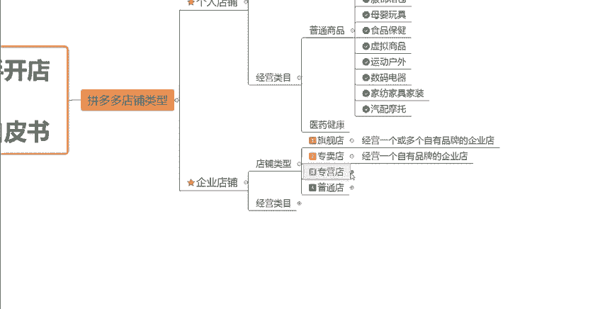

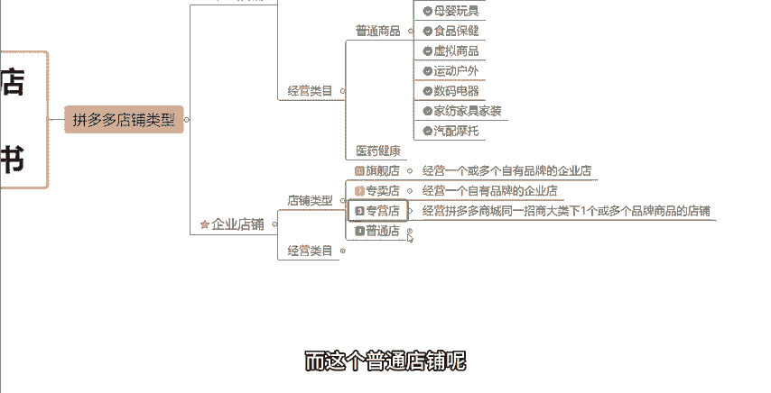

普通店啊其实没有太大的一个差别，就是他们之间的有有差别，但是可以忽略不计啊可以忽略不计。那有这个普通店铺呢，它甚至跟我们的什么就是个人店铺它都没有太大的一个区别。在店铺推荐方面在权重考核方面。

其实普通店铺它跟个人店铺没有太大啊，几乎是可以忽略不计的一个差异的。因为我们在后续啊在活动方面就是活动一些审核啊，一些提报啊，活动报名的一些方面，旗舰店铺它会优先于个人店铺的一个活动审核的。知不知道？

因为企业店铺大大多数都是有品牌的。而拼多多这个平台呢，它会认为有品牌的商品，它可以自带流量。也就是说它可以有这种更加专业以及更加好的这种产品以及更加好的这种服务。所以平台啊它会优先的展示啊。

优先的去审核这样的一个呃旗舰店的企业店铺。但是普通店铺呢，它本身是没有这些东西的啊，所以说是普通普通的企业店铺跟普通的个人店铺是没有什么太大的差别的。那么在我们日常的运营过程当中啊，在这种经营类幕方面。

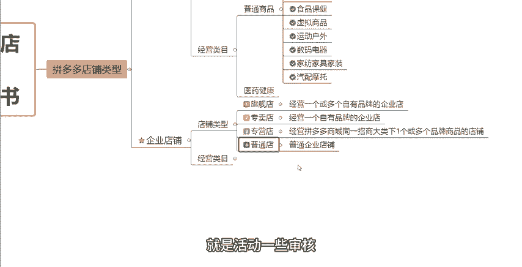

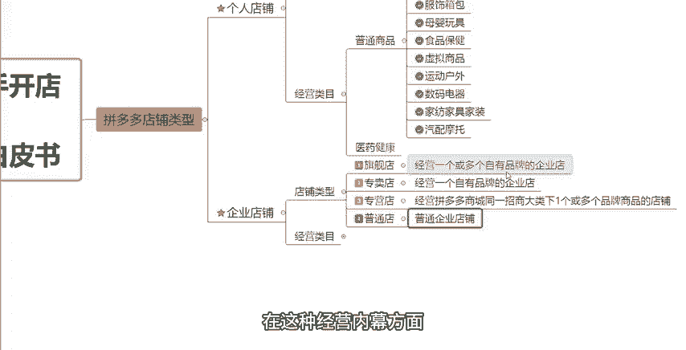

就是跟个人店铺呢是一样的，也是去选择这个普通商品或者医药健康。而普通商品里面刚才也讲到了，对不对？除了一些特殊的商品是只允许旗舰店上传的或者发布的那如果说你不清楚自己想要做的这个产品是应该用哪种店铺类型去操作比较合适的。

没有关系，可以在评论去找到我，我来给你我来给你推荐来给你分析一下，好不好？那还有如果说啊你自己在这个店铺的运营过程当中啊，呃，遇到了任何不懂的问题啊，大家都可以找我啊，在评论区找到我。

我会我也愿意拿出更多的一些这种运营干货运营知识来给大家去做分享，来呃教大家一些东西。好吧，所以说也欢迎大家随时来找我跟我进行一个交流沟通。那么这些的视频呢，就先跟大家讲到这，感谢大家的一个观看。

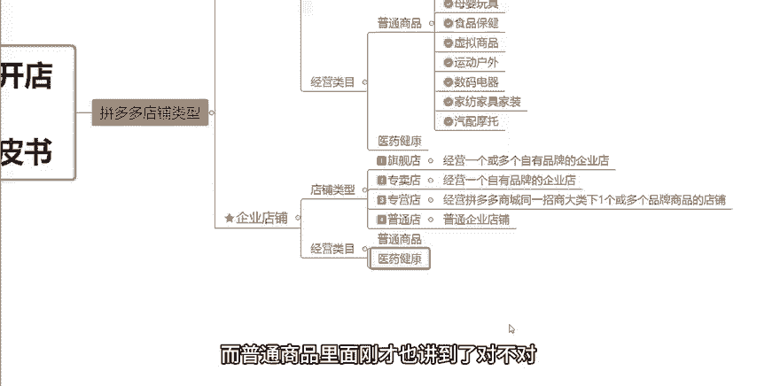

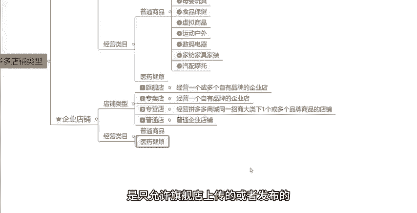

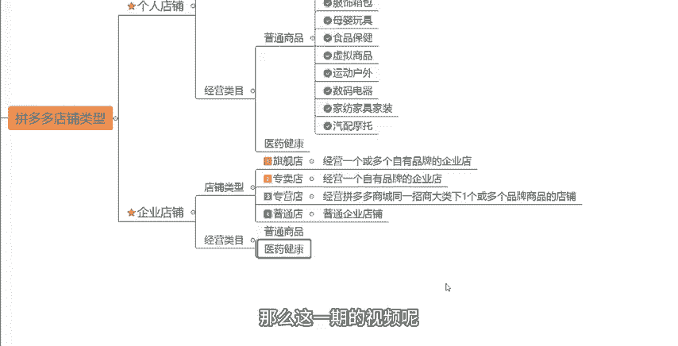

这边呢给大家准备了将近100份的一个文档，可以帮他更好的了解我们拼多多运营拼多多，能够提高大家运营水平。如果大家需要的话，评论区找我领取。

