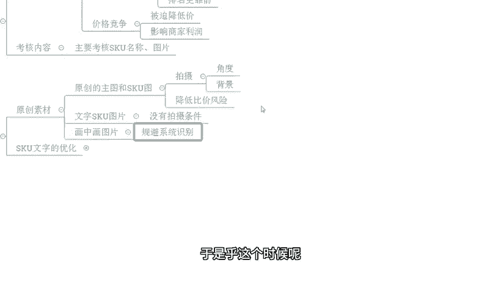
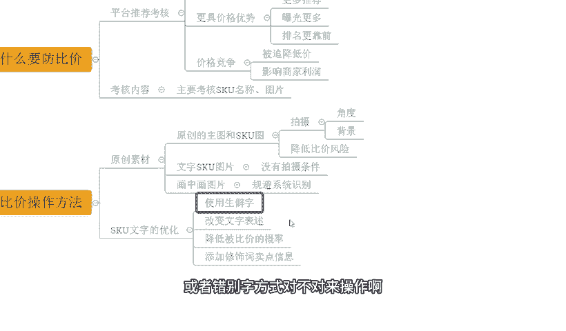
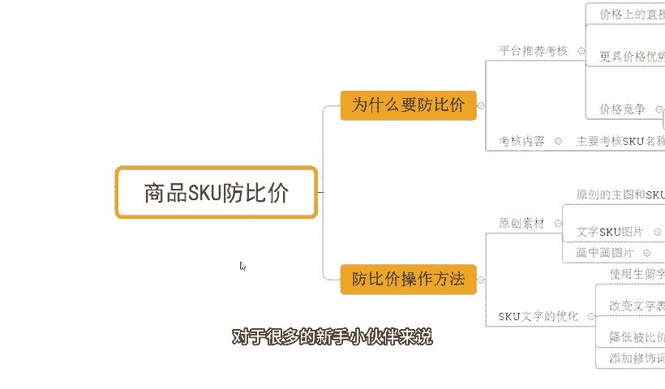

# 【拼多多运营】2024年最系统的全套拼多多运营教程，适合所有拼多多开店新手小卖家自学，10年资深运营师手把手教你从0到1起店实操。 - P30：30-商品SKU防比价 - 拼多多运营教程_ - BV1H62ZYREs4

hello，大家好，我是谢楼。那么今天给大家分享的内容呢是我们拼多多新手开店爆款打造实操铺中的拼多多商品SQ仿比价的内容啊。那对于店铺运营来说的话，仿比价是一个非常非常重要的一个点啊。

因为我们在正常的日常运营过程中，对吧？不管是活动提报还是产品的日常销售，那都会受到一些比价的影响。因为平台呢他就是一个愿意去做比价这么一个动作的一个事情的一个平台啊。那如果说我们一旦被比价呢。

可能会导致我们整个商品呢在订单上造成流失在访客上会减少，对吧？而这个问题呢，解决方式对于很多的新小伙伴来说可能会比较迷茫，对吧？不知道怎么下手啊，没关系，那么今天呢就会详细的针对到这个点呢进行讲解啊。

那首先呢还是看一下近期跟着实小伙伴他们的店铺数据好不好？像这个店铺呢，最少访客是1000多啊。

那么跟着实操之后呢，整个店铺的数据呢也是非常快速的增长啊，到最后呢做到一天访客呢是13000多，对吧？那么整个的订单的话，一天是1600多单，转化率呢12。23啊，除了这个店铺之外呢，还有像这个店铺啊。

那么最早的访客就有几百个，也是跟着实操之后呢，整个店铺呢访客呈现出一个非常啊这个稳定的一个上升趋势啊，访客呢啊做到了一天啊12000多将近1万3，那么订单的话一天是2000多单转化率呢16。37对吧？

那除了这种有数据的店铺之外呢，另外也有的一些小伙伴是纯新店起步的对吧？像这个店铺呢最早是零访客的一个新店。那么从最早零访客开始呢跟着实操那整个店铺数据呢也是非常快速稳定的增长。

到后面呢一天做了6000多访客对吧？一天订单呢是1100多单啊，转化率呢18。13啊，非常不错的数据。那么类似这种店铺呢还有很多这里我就不一一介绍了啊，那对于我们很多。

新的小伙伴来说的话，店铺操作呢肯定会有很多很多困难的。这个我刚才提到过，对不对？如果说有店铺操作方面的问题，或者有需要这个运营资料的，可以找我啊。那么有时间的话，我也可以在这里面一起实操做店，对吧？

像这些小伙伴一样呢，我们一起呢把店铺做起来，好不好？OK回到我们主题中来，那既然说我们要去做访品价。那到底为什么要去做价啊，看有什么意义？我们来看一下，先第一点的话啊。

那平台的一个推荐考核规则呢，它就会体现到我们的呃同款和相似款的考核。如果说我们有同款有相似款，那么而且呢在价格上进行比较的时候，那么这个时候呢更具价格竞争优势的产品呢就会得到更多推荐。

曝光就会更多排名呢也会更靠前啊，那所以这个时候呢就会导致一个问题就是平台呢就会陷入一个价格竞争的一个啊非常恶劣的一个环境里面来啊，很多的商家呢就会被迫降价。为什么？

因为我希望我希望我的产品呢能够去有到更好的排名啊，我希望我的产品能够拿到更多曝光啊，对吧？所以说它会影响到我们产品的一个呃商家的利润，对不对？

那么而这整体的一个考核的话，其实是围绕着我们商品的啊SKU的名称和图片来展开的。

啊，是以这两个为核心的啊，那我们要去调整优化好我们的房品下呢，其实重点呢就要通过这两个方面来入手。

OK反比一下的方法，我们来看一看啊。首先呢我们要有到一个原创的素材。那么这个原创素材呢，其实主要就是我们的产品的主图SQ图片啊。那么这个呢我们可以通过自己的一个拍摄来完成啊，我们可以用到不同的角度。

不同的背景。

来创造一个新的图片啊，这样呢整个的制作的一个成本呢也不会太高，对不对？那整体的一个呃仿比价的一个风险呢也会被降低掉啊。那同时呢我们在进行产品的这个图片制作的时候。

可能有小伙伴说哎我这个没有一个很好的图片的拍摄的能力啊，对吧？我没有这样的一个摄影师，我也没有摄影技巧啊，我也没有这样的一个成本去做这个事情OK的那没关系，有到一个更加廉价的方式。

我们去做一个文字版的SQ图片，什么意思呢？就是说哎我没有条件去拍摄，我没有办法做到原创。好，那我用到同样图片的话，肯定会被比价的，对不对？于是乎呢我就把我产品信息呢，在一个空白的文案啊，这个图片上呢。

我把这个文案打上去啊，描述清楚我的SQ的一个信息。

那么是以文字形式展示的这个时候呢，别人用的是照片，而我用的是一个文字的组合形式。那么这个时候也可以保证我图片的原创性啊，或者是保证我SQ的一个图片的原创性，对不对？那这是一方面。另外一方面的话。

我们还可以用到一个画中画图片的一个解决方式来处理它啊，那它的一个核心逻辑呢就是规避系统的一个识别。比如说今天呢我们有到一个呃这个产品啊有到一个这个图片。那么这个图片呢上面呢商品的主体呢是非常非常清晰的。

对不对？于是乎这个时候呢，我就在这个非常清晰的这个页面里面呢，我去加入一些其他的元素啊，让这个信息呢混入在我们这一个所有的元素里面去。

这个时候呢把这一部分图片呢稍微的做的小一点点，或者是稍微的去给它呃做的没有那么的显眼一点的话，O这个时候整个图片呢里面很多产品很杂，系统在识别的时候呢，就是识别不到我们的产品主体。

也可以让我们产品呢在图片上呢能够做好一个规避，得到一个原创的一个啊权重啊，那除了这个地方之外呢，另外一点就是我们SKU的一个文字的优化了啊。这个文字优化就是我们SQ名称。

那这个时候呢在进行我们SKU的一个名称设置的时候呢，我们可以使用到一些生僻字啊或者错别字方式，对不对？来操作啊。那这是第一个点啊，比如说举个例子啊。

那我们的产品呢是一个呃连衣裙，对不对？我们可以用到一个连衣裙。啊，我们可以用到一个连衣裙的一个一个这个呃文字名称去描述我们的SKU对不对？那我们在连衣裙的描述过程中呢。

我们也可以用到其他的一些属性词修饰词。而这些属性词修饰词呢，我们可以直接用到一些错别字的方式来啊描述啊来展示，或者甚至我们直接在这个连衣裙这个文案上呢下文章，我们也可以做一些错别字都是没问题的啊。

那一样的可以帮我们去做到这个仿比价的操作啊。那再一个呢，就是我们要改变我们的一个文字的描述习惯啊。那往往来说，我们正常来进行产品的SQ展示的时候呢，更多的是以一个产品展示的角度来描述的，对不对？

我们是描述了我们产品的颜色。我们也产品的一个什么呃，这个呃。

尺码对不对啊等等等等啊，这种信息。那这些信息的话在描述过程中，它其实比较干瘪的那我们要改变这种状态。就是说我要去更加生动客观的去展示出我产品的属性，对不对？那比如说颜色的话。

我们可以把我们颜色呢下一些定义啊。我虽然说是红色。那我也可以把我的红色呢做出一些其他定义。比如说什么什么东西一样的一样的红啊。那么这样呢我们的啊SQ的一个颜色信息呢，虽然说也是有红色信息。

但是会有到更多的其他一些文案描述来做好一个区分。那么同时呢我们在文案里面也可以加入到其他些卖点来增加我们的文案的一个吸引力啊，来突出我们产品的特点啊形成转化，提升我们转化率。那么这些方式操作呢。

其实都可以是降低我们被比下的概率的啊。不管是我们刚讲的用生僻字啊，或者是添加一些其他的一些属性呢，或者是用到一些其他的一些这个修饰词来表示我们的卖点等等啊，这种方式都可以。那这些东西做到位之后呢。

我们整个商品呢能够去做到一个防比价。而防比价做到位之后，O那我们的产品呢就不会说因为我们价格问题，因为同行做低价恶意竞争的问题，导致我们什么没有流量，或者我们的订单流失啊。

这是我们去需要去注意的一个事情。那么呃整个的一些更多的运营细节，关于我们拼多多新手开店包括达到步骤的中信息的话，会在后期呢会跟大家详细讲解啊，那么大家可以关注一下。对于很多的新手小伙伴来说。

店铺运营呢可能会有到很多很多困难啊，这个我这也调过对不对？那如果说你在正正常的进行店铺操作过程中有遇到店铺问题或者有需要运营资料的。

可以找我。那有时间呢，我也可以带着你们一起去食刀住店啊，就像这些小伙伴一样呢，一起呢，我们把店铺好好操作起来，对不对？那么今天的视频分享呢就到这里，我们下次再见，各位，拜拜。

这边呢给大家准备了将近100份的一个文档，可以帮他更好的了解我们拼多多运营。拼多多，能够提高大家运营水平。如果大家需要的话，评论区找我领取。

