# 【拼多多运营】2024年最系统的全套拼多多运营教程，适合所有拼多多开店新手小卖家自学，10年资深运营师手把手教你从0到1起店实操。 - P32：32-拼多多发货注意事项 - 拼多多运营教程_ - BV1H62ZYREs4

hello，大家好，我是西楼。那么今天给大家分享的内容呢，是我们拼多多新手开店爆款打造步骤中的发货注意事项的内容。那对于我们店铺运营来说的话，发货呢其实有非常非常多的一些细节需要我们留意的。

而这些细节如果没有处理好，OK的，轻则受到店铺的订单处罚，赔付订单金额，重则店铺项权。

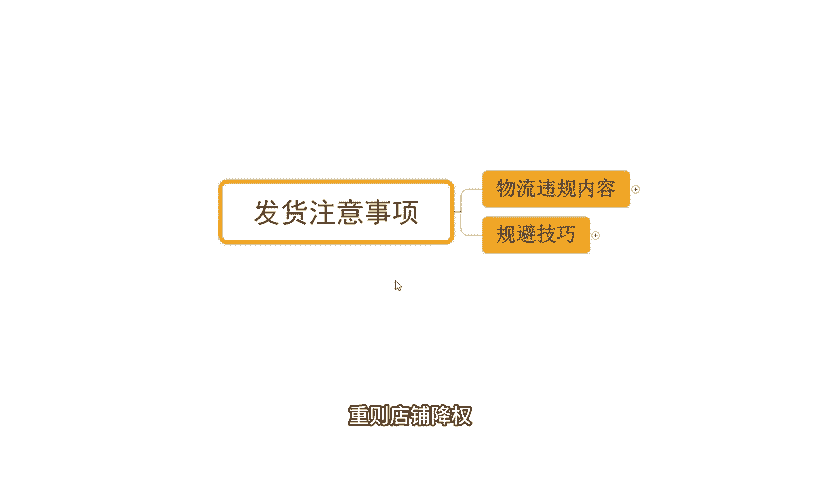

那么在详细分解我们的这个发货注意事项之前呢，还是老规矩啊，先看一看近期跟着我一起时尚小伙伴，他们的这个数据。

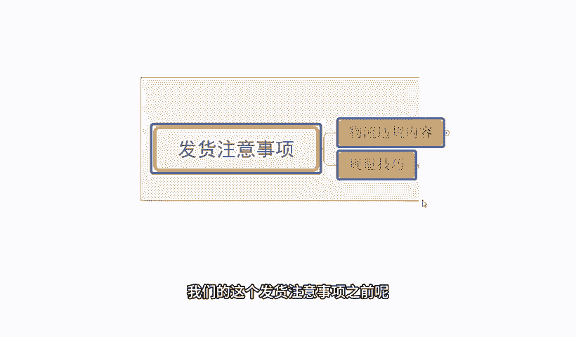

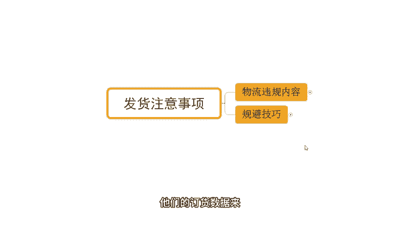

来可以看到这个店铺呢，最早呢访客是一天也就1000多，对吧？那么跟着实操之后呢，整个店铺数据呢快速增长到后期呢，一天的这个访客呢做到了13000啊。那么订单的话一天是1600多单，对不对？转化率呢是2。

23。还有像这个店铺啊，最早的访客只有几百个，对吧？跟着实操之后呢，整个店铺数据呢也是非常快速，而且稳定的增长啊，到后期呢一天访客呢做到了12000多，将近13000啊。订单的话一天是2100多单。

转化率呢16。37，对不对？除了这种有基础有访客的店铺之外呢，那么零访客的新店也是一样的啊，可以看到这个店铺啊，最早是零访客的一个店铺，对不对？从零访客开始跟着实操。

那么整个店铺呢数据啊也是非常稳定的提升到后期呢一天访客呢是做到6000多，订单的话一天是1000多单啊，那么转化率呢18。13。

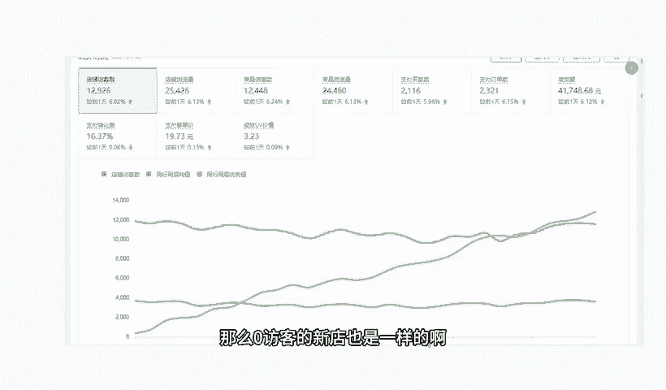

那么除了这些店铺之外，还有很多啊，那么这里我就不一去展示了，对不对？对于我们店铺运营来说的话，其实很多的一些细节来说，对于很多的新的小伙伴来讲啊是很难去把控的，对不对？

那么很多的问题呢可能也是我们新小伙伴容易去踩坑的啊，那么这个其实很正常。毕竟来说的话，对于一个全新的领域陌生的领域对不对？那不可避免的有很多不清楚的地方啊，那如果说是有这种店铺问题啊。

或者需要运营资料呢哎可以找我啊，有时间的话，我也可以带着一起实操做店对吧？就像这些小伙伴一样呢，我们一起呢快速提升啊，把店铺做起来，好吧？O啊，那回到我们主题中来，那对于我们发货注事里面呢。

我们会有到很多的东西。首先我们来看一看物流违规的内容有哪些啊，那针对到这些内容呢到底怎么赔付的，怎么判定的。我们搞清楚它然后我们再来聊一聊如何规避。

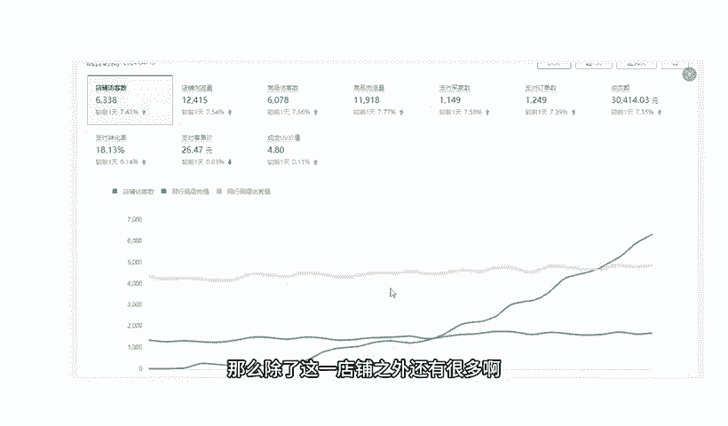

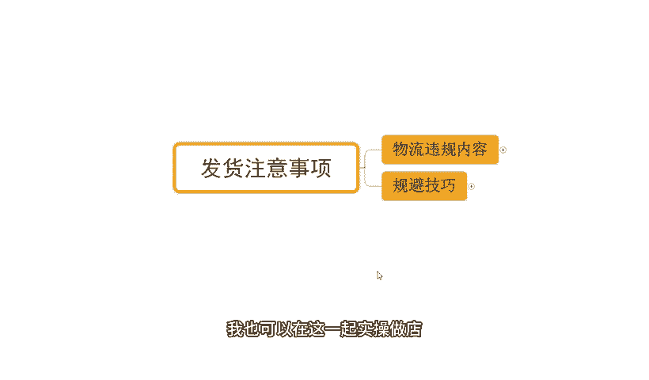

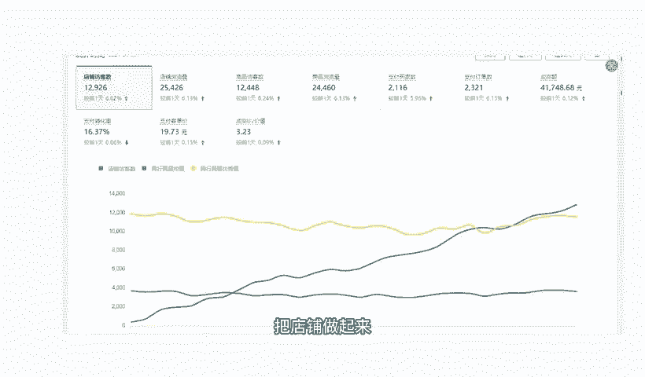

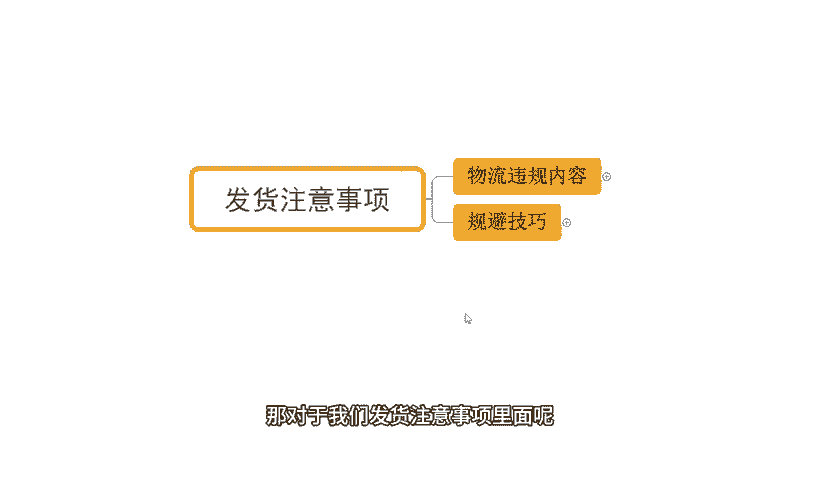

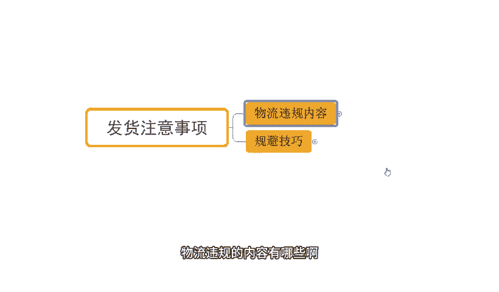

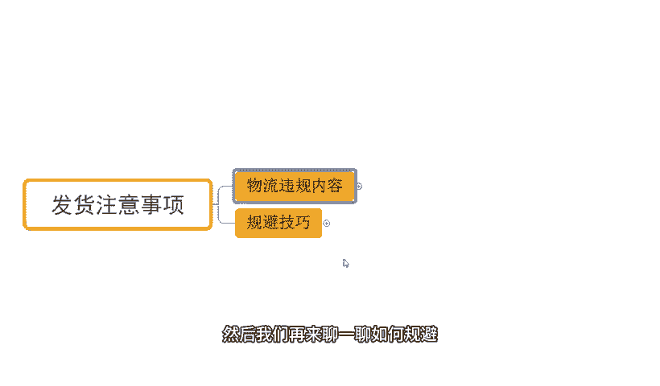

首先呢物流违规的内容呢，我把它分为四个大板块啊，一个呢是我们的延迟发货。那其次呢是我们的虚假发货虚假轨迹，再就是我们的欺诈发货以及我们的商品缺货啊。那不同的违规呢是有不同的判定标准，也有不同赔付标准的。

所以这一点大家注意一下。首先第一个呢是我们的延迟发货。那延迟发货，从这个字面意义上来讲，应该就是我们的发货延迟了，对不对？那么他呢平定是有规定的。就指的是我们商家没有在规定的发货时间范围内完成发货啊。

所谓的完成发货是什么呢？OK来看一下。

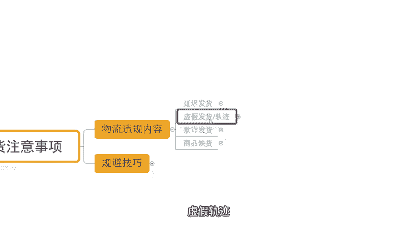

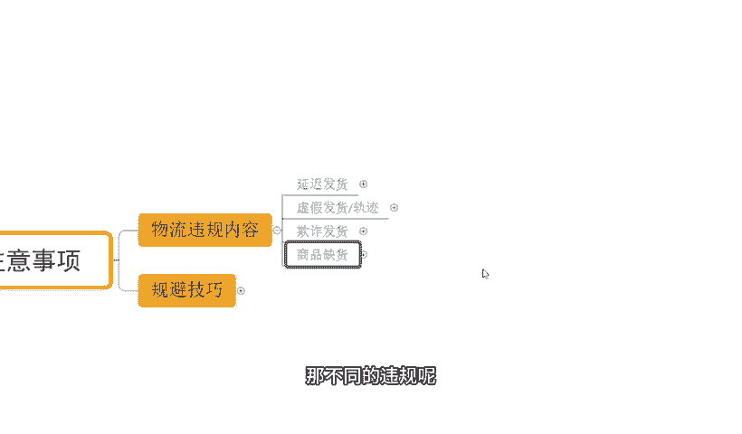

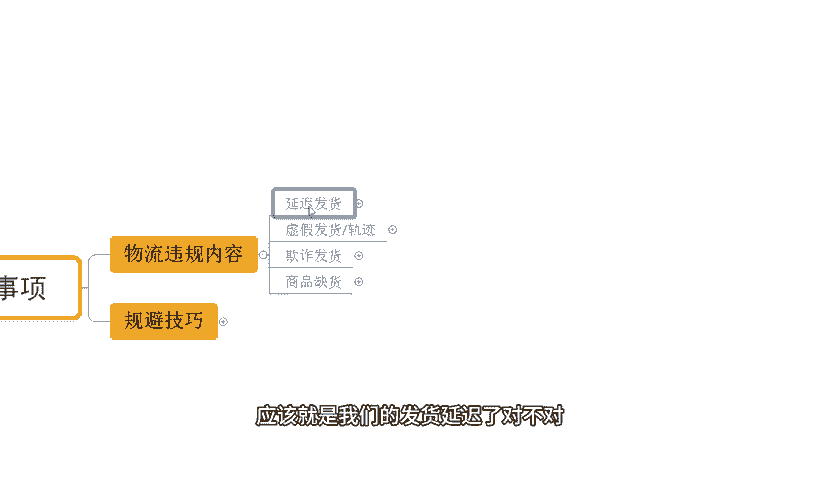

第一，我们没有在对应的快递里啊，对应的这个订单啊里面去上传我们对应的快递单号。其次呢我们没有去点击发货这个动作，什么意思啊？比如说今天呃我的店铺里吗？有人下单了，对吧？下单之后呢，我因为忙啊。

我这个产品其实已经让快递发货拿走了，但是因为我忙啊，我忘了去点击上传我的物流单号了，我忘了点击发货了。抱歉啊，一旦这种情况出现超时之后一样会判定我们是延迟发货的，所以这点大家重点留意一下。

当是呢还有情问就是说，哎，我确实我也想去发货，但是呢我的供应商呢，他的这个发货时间比较慢啊呃，他需要三天才能发货，对不对？第二天还没发货呢，对吧？OK的抱歉啊，这种情况呢？一样的。

也会导致我们的延迟发货出现，那么他是有赔付的，赔付的时候呢，按照什么样的标准来算呢？来看一下。

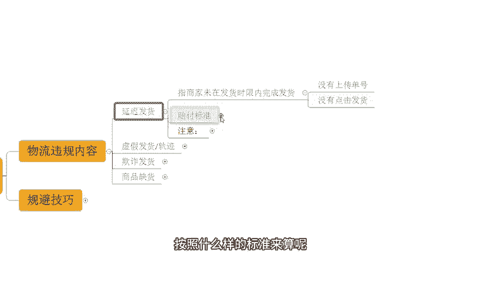

按照我们订单金额的1%赔付。那如果说订单金额1%比较小小于3块，最低呢也按照3块钱赔付。当然呢，如果说订单金额比较大啊，比如说这个1万块的产品赔付1%要100块了。OK那么我们也是最高不超过30的。

所以这一点大家注意一下，可能单笔订单来看的话，大家觉得这个金额呢不痛不痒，对不对？没有太多，没有太恐怖。但是如果订单很多的情况之下，那么这个东西也蛮难受的啊，所以大家注意一下啊，那这里呢另外说到一点啊。

一个注意事项。

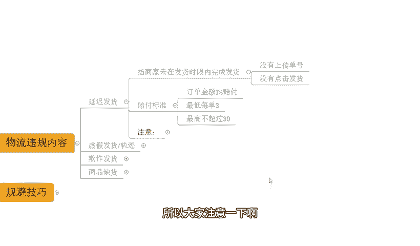

延迟发货呢，不代表说就不发货了，对吧？他仍然需要发货的。那么当我们被判定延迟发货之后，时间3天范围内仍然我们需要进行发货。如果说这个时间没有发货。那么保险兄弟，你除了被判定为延迟发货之外，又会被判缺货。

那么这个会有二次赔付。啊，所以大家注意一下，那么再来看一看我们的虚假发货虚假轨迹啊。这个东西呢，通过字面意义思来讲，其实大家也能很好理解，对吧？它其实就指的是我们的店铺的发货的物流信息啊。

存在明显的异常，对吧？像我们的物流轨迹呀，包括说我们的发货地呀，对不对？这些东西有明显异常的话，也会导致我们啊存在说是这个。

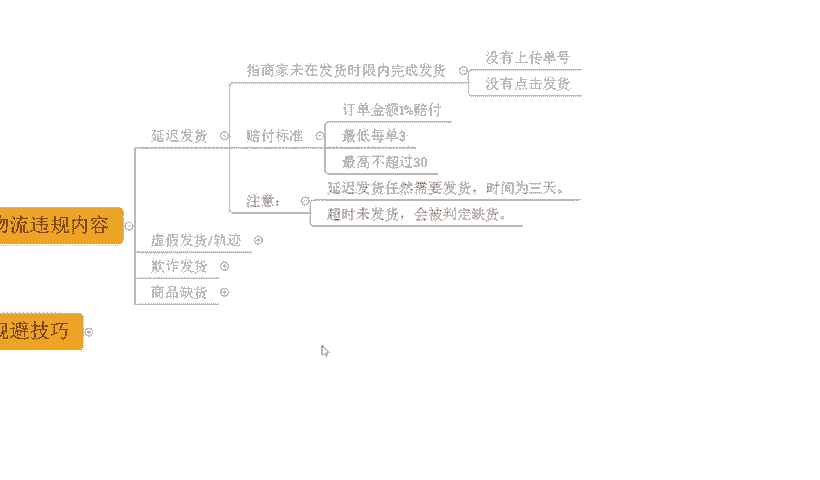

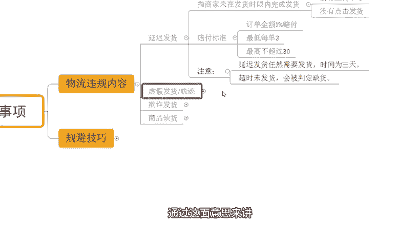

虚假发货或者虚假轨迹的一个情况啊。而这个赔付呢，相对来说会比我们的这个延迟发货要这个金额更大啊。那么他呢按照我们支付订单金额的25%来赔付的。

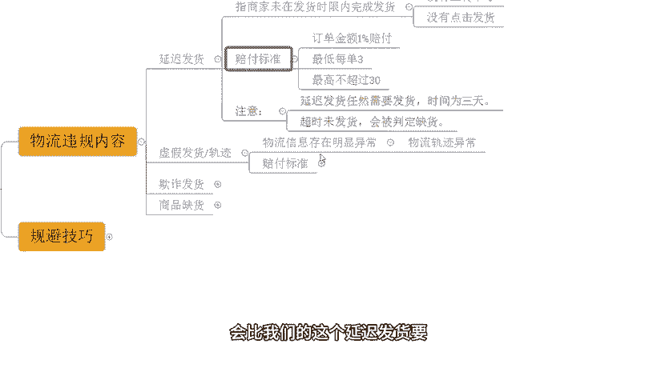

最低一单呢不呃，这个不低于5块钱，最高呢不超过100块钱啊。那么这个东西就蛮厉害了啊。我就举个例子吧，假如说我们按照之前来说，我订单的金额是20的话，对不对？那么延迟发货呢，一单呢按照1%。

我也就只赔上去3块钱，但是按照这个呃虚假轨迹啊，按照这个虚假发货啊，这样的情况的话，我一单哎我就需要赔付多少呢？5块钱了，对不对？所以他的一个赔付金额会大很多啊，那么尤其是我们订单的金额越大呢。

按照百分之比百分比的一个赔付比例的话，OK那么就更恐怖了啊。O那这个情况呢，这里我要说明一下，有很多种情形会导致我们这个虚假轨迹啊，比如说我的快递已经发货了。

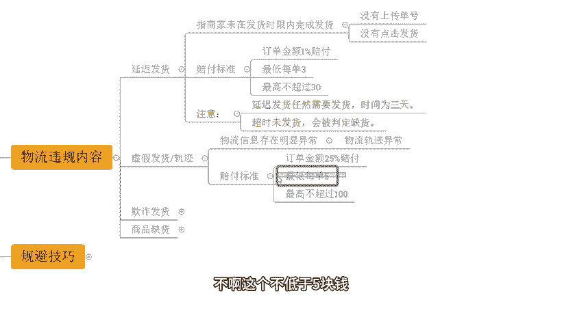

发货之后呢，哎我没有让快递员过来收件。快递员收件之后呢，哎没有在20小时之内完成揽件信息。OK那么这个时候呢，就会存在说虚假轨迹或者是虚假发货的一个啊赔付。又或者是我们商品呢已经发货了，对不对？

快递员呢已经拉走了，拉走之后呢，那些揽件了，但是揽件之后哎，后面呢没有去把这个货运走，出现了停滞状态。那么超过24小时也会形成虚假轨迹。所以整个的过程呢有很多的东西呢需要我们留意的啊。

OK那我们再来看一看欺诈发货啊，欺诈发货其实根据这个名字就能看到的对吧？其实就是说难听一点，你没有支持发货吧，对吧？那比如说我在给客户发货的时候呢，我没有发商品，我就发了一个空包裹。😊。

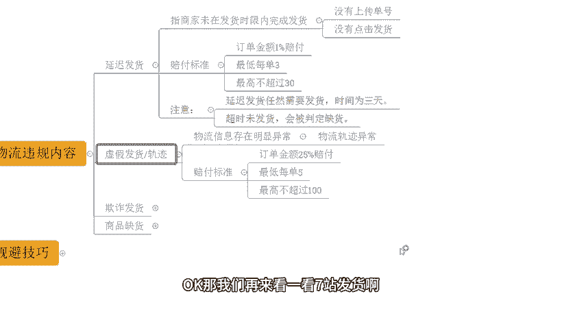

对吧欺诈发货吧，或者是我发的这个东西呢，跟我实际销售的这个东西呢明显不符。哎，我卖了一台电脑，我发了一张显卡，对吧？我卖了一个这个呃桌子，我给他发了一张椅子，是吧？这都属于欺诈发货。

那么如果存在欺诈发货的话，OK那么这个时候呢也会面临着比较大金额的一个赔付啊。

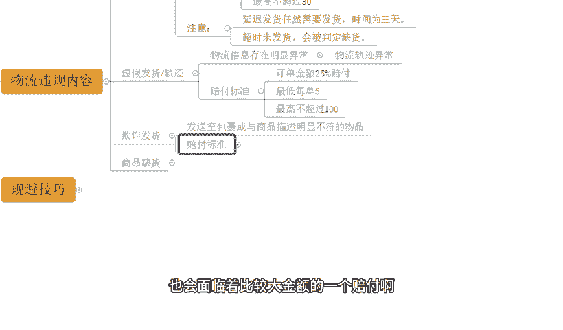

赔付金额真的不少啊，可以看到，按照订单金额实收的一倍，且不低于10块钱一单赔付，最高不高于500块1单。所以他的一个订单赔付金额的话，会就比我们之前说的这个延迟发货呀，对不对？虚压轨迹啊。

要要严重的多了啊，人家是按百分比，这个只接按倍数来算的啊，对吧？所以比较恐怖一点。

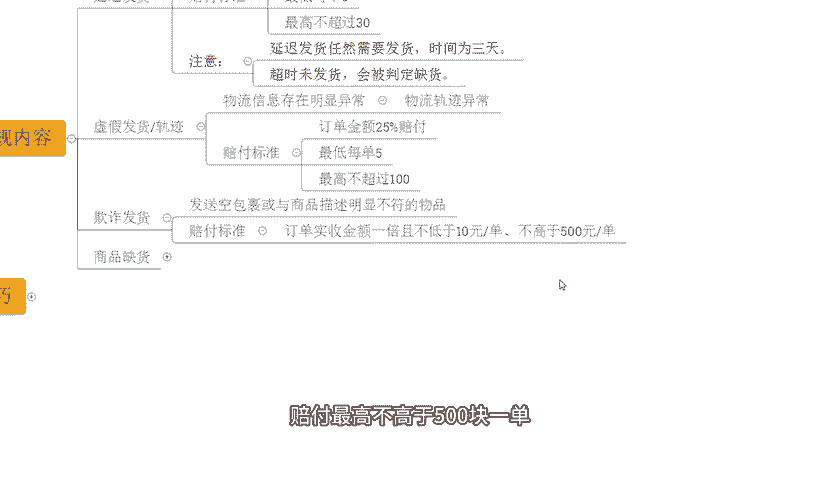

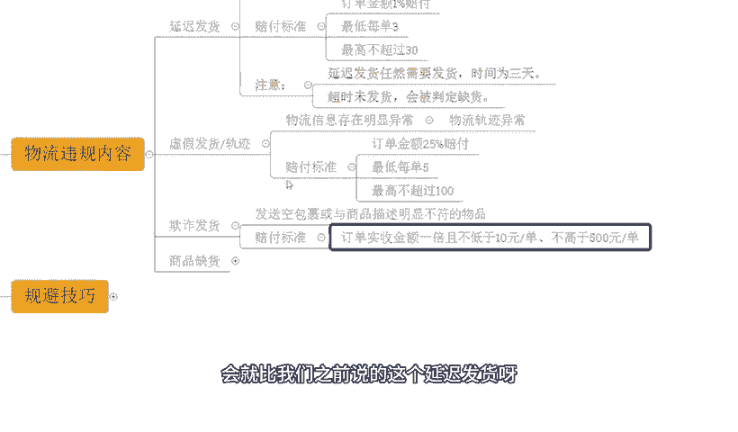

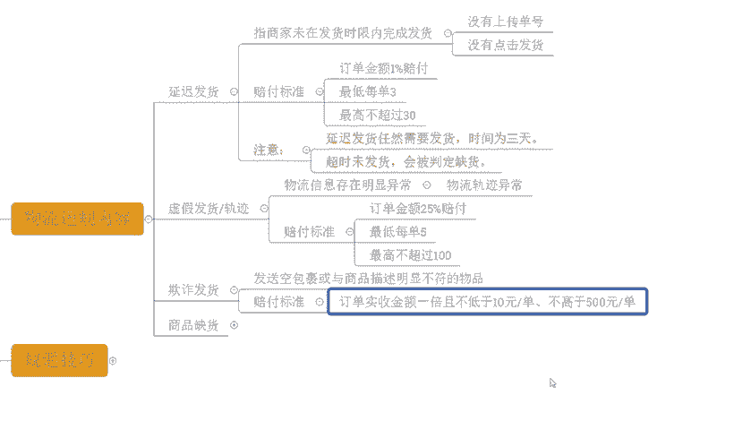

那么再来看一看啊，还有一个就是商品缺货，商品缺货呢，其实就很正常了。就吧有的时候我们确实这个产品呢卖的比较好，会导致呢我没有办法去很好的管理我的库存。那么有的时候呢，用户下单了，但是我没有货了，对吧？

所以这个时候呢我可能就会通过这个聊天记录啊，这样的一个方式啊，告诉我的消费者，不好意思，哎呀，你这个产品呢已经缺货了，对吧？我没有办法给你发货了，或者是我通过平台申请哎，商品缺货不发货啊。

那么一旦存在这种情况呢，也都会判定我们商品缺货的。

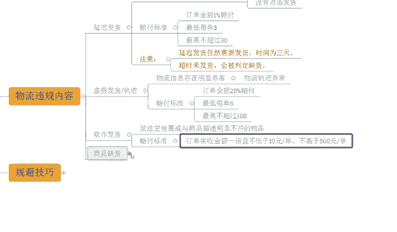

那么缺货呢，除了我们刚刚讲的这种情形之外，还有到一个情形就是什么呢？哎，我们有其他的违规，而且在违规的约定时间范围内没有真实发货的，也都会判定为缺货。哪些情况呢？刚刚我们提到过的第一种情况，对不对？

我们延迟发货了，三天时间内你没有发货的。好，那么你是缺货，对不对？或者是你。

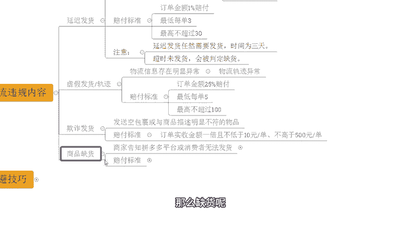

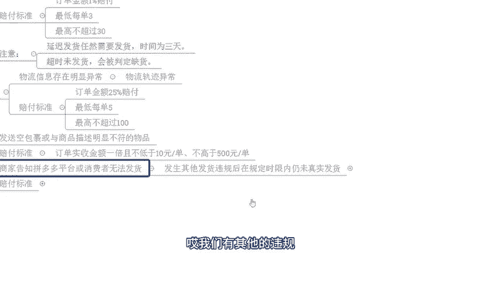

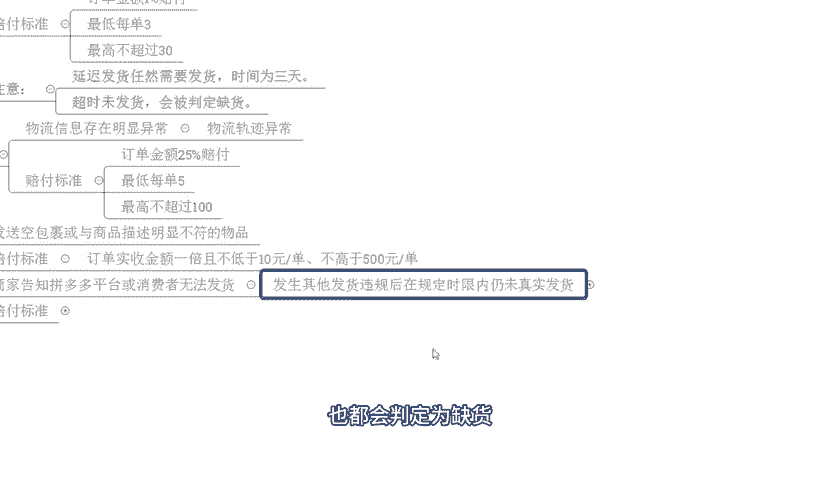

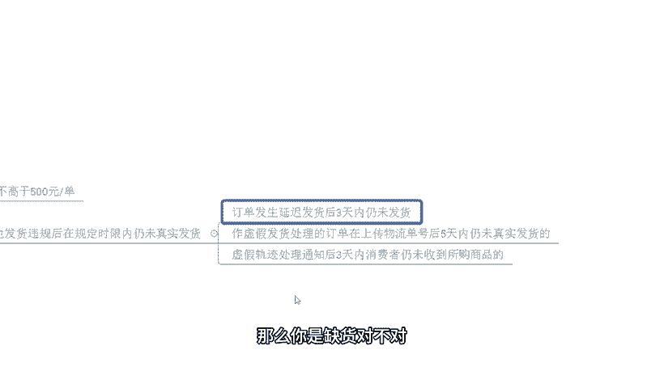

虚假发货对吧？虚假发货了啊，那么这个订单呢，没有这个呃5天之内啊，还没有正式发货的啊。

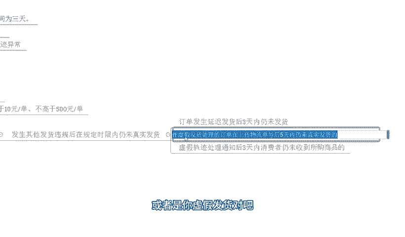

缺货又或者是我们这个订单呢出现的这个呃虚假轨迹。三天之内呢，这个用户呢还没有收到这个商品的OK缺货。

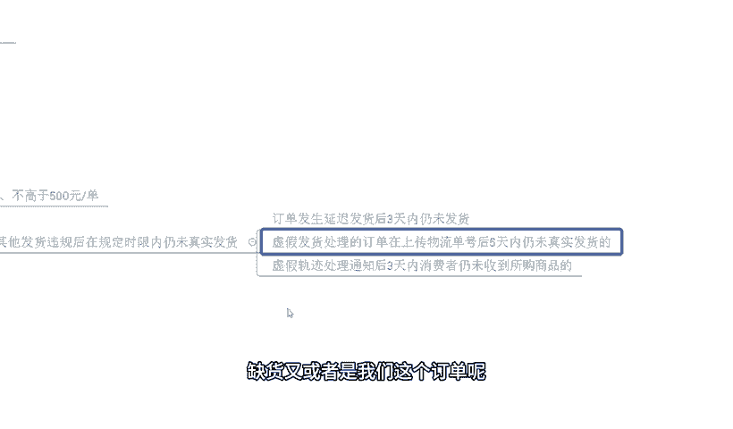

那么缺货之后的赔付啊也是比较坑的。可以看到啊。那么如果说我们的订单的发货时间是小于等于48小时的话，可以看到啊。那么按照我们订单金额的5%赔付每笔订单最低呢是5块钱，最高不超过500。

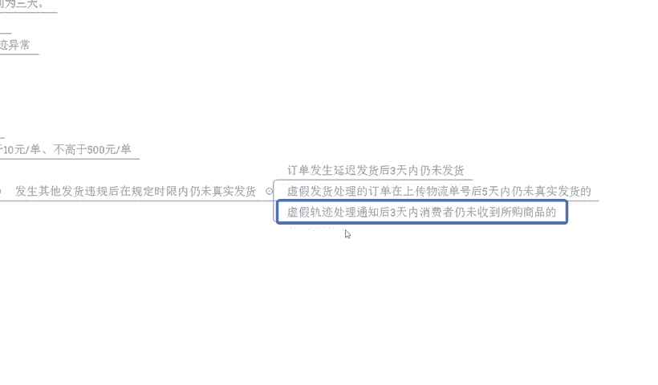

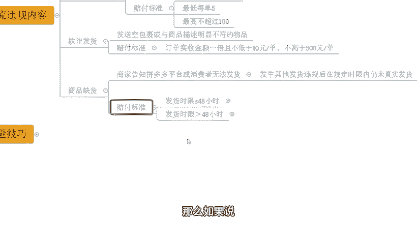

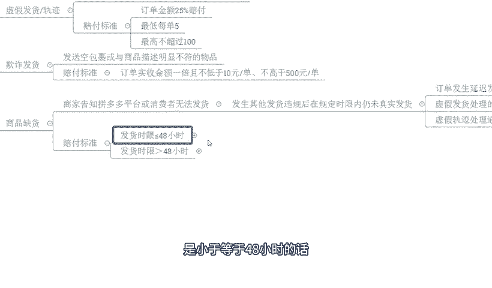

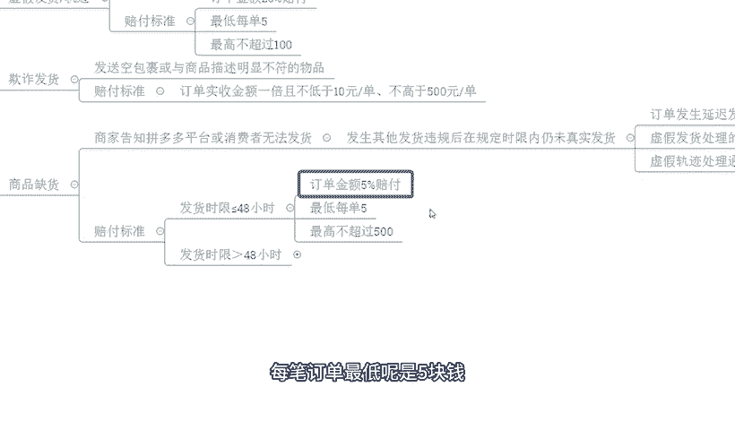

那如果是发货时间大于48小时的这种情况的话，OK每笔订单的赔付金额呢，按照订单金额10%赔付，每笔订单不低于5块，最高不超过1000。那所以是非常非常坑的一个事情。而在这些地方的话，我说一下啊。

像我们的虚假轨迹呀，这种东西啊，它的考核其实像如果说我们是有这个开通电子名单。那么基本上呢还是可以出存在这种免罚的一个情况的啊。所以大家能够去开通电子名单，通通去开通啊，能够用电子名单发货的。

通通用电子名单发货啊，这样是更好一点。然后我们来重点说明一下我们的规避技巧。

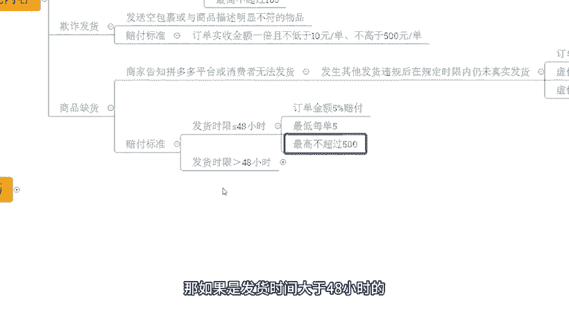

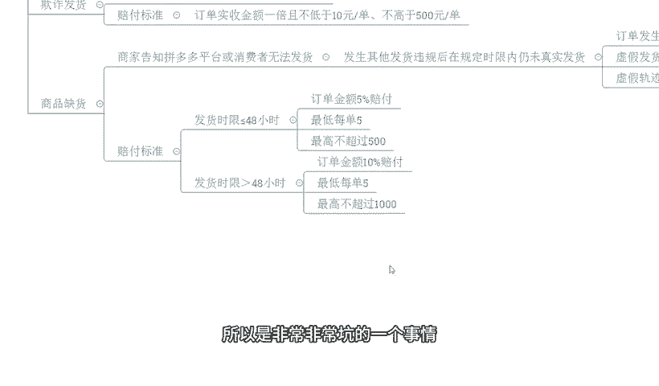

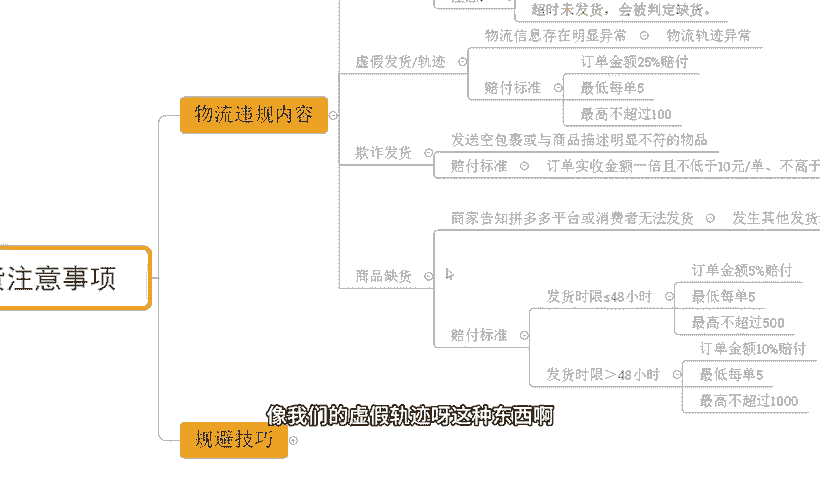

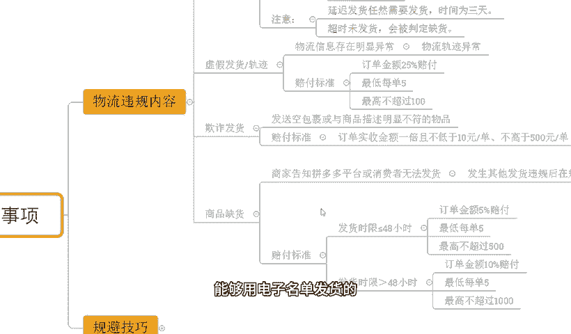

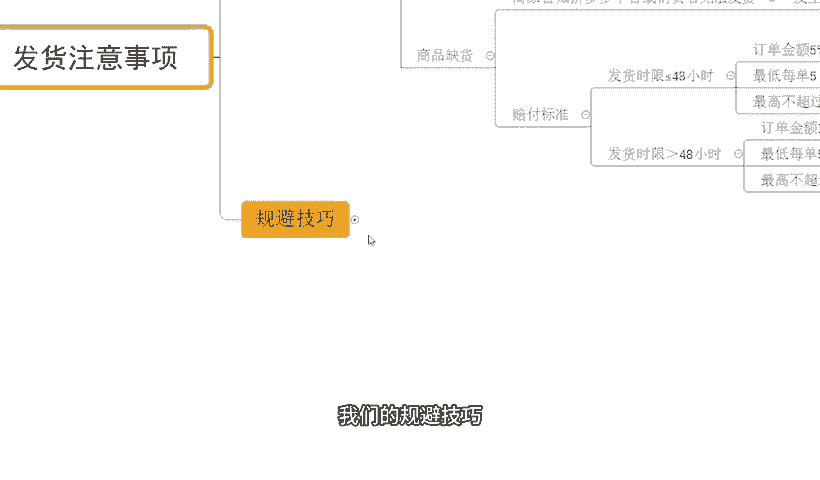

那首先第一个点呢就是我们的发货时间设置，对不对？发货时间呢，大家一定不要去设置24小时发货啊，而设置48小时发货。虽然说我们在后台里面可以看到人家这个平台有说哎，你设置24小时发货啊，有流量扶持对吧？

有加权啊，但其实上这个东西呢是没有太大的一个意义的呃，这个东西影响群众的一个板块呢微乎其微，除非是我们的用户呢，他去筛选了24小时发货，不然的话，对于我们正常来讲的话，影响不是特别大啊。

那再一个是即将超时订单，这种情况啊，我们快超时了，那怎么办呢？如果说我能够确定在正常的超时24小时范围内，我能够完成发货，并且能够完成订单的揽收的话，O那么这种情况之下呢，我们就去做一个动作。

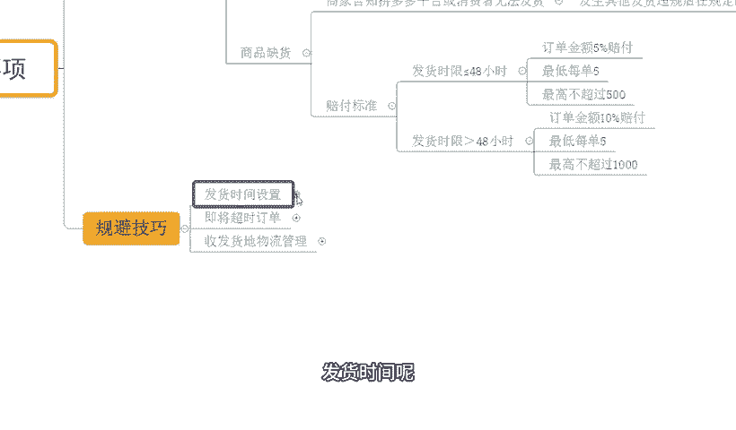

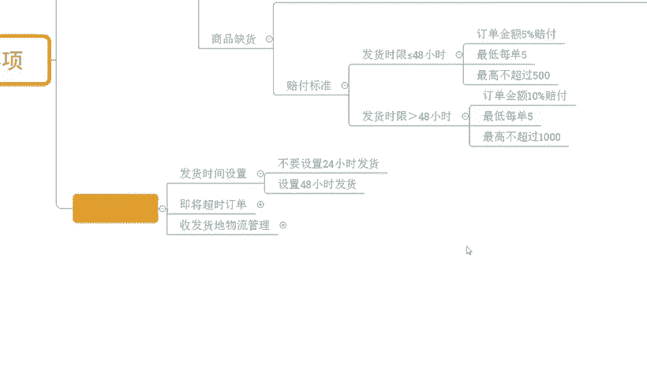

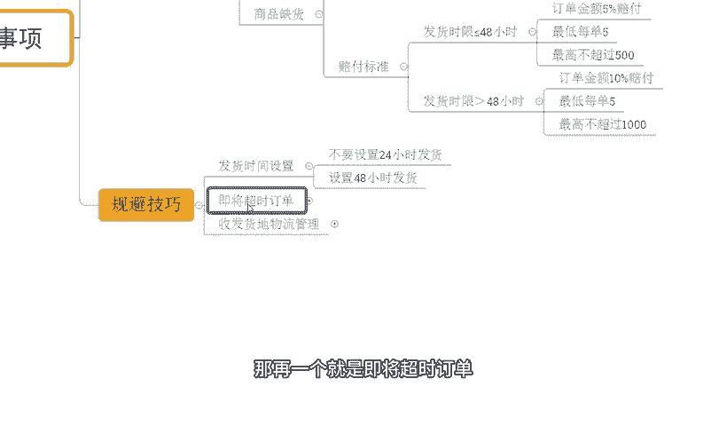

啊，什么动作呢？上传一个礼品单。上传订名单之后呢，我们把这个延迟发货这个东西呢给他呃取消掉，就等于说是对不对？让它失效。那这个时候呢，平台会按照我们上传订单编号。

上传我们的快递单号的24小时来进行我们物流更新的一个计算。所以我们需要在24小时之内修改正确的物流单号，并且让这个订单呢，在整个一开始最早一次上传物流单号的这个20小时内完成揽件信息的更新。

OK那么就可以了，就可以啊摆脱我们被处罚的一个风险啊。那么再一个呢，就是我们收发货物流地的一个管理，对吧？那不同的快递呢，它是有到不同的一个啊快递的一个服务状服务状态的，对不对？

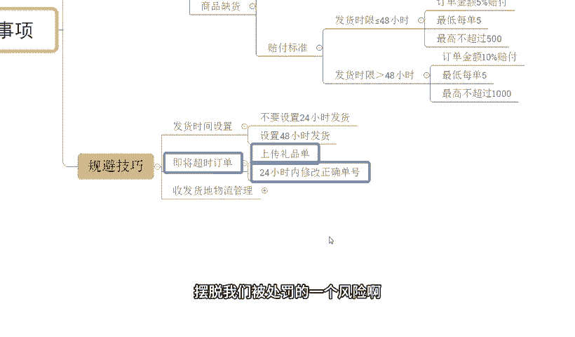

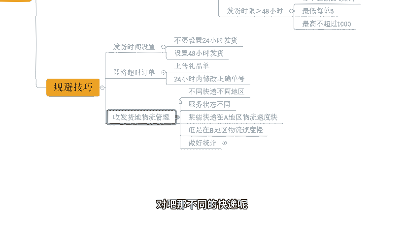

那呃有些快递呢，他在A地区可能会比较快一点，可能在B地区呢就会比较慢啊，反之也是一样的。所以这个时候呢，像我们如果是为了规避这个物流更新的异常情况的话，ok那我们要做好统计，对吧？

那哪些快递在哪些地方快。哪些快递递呢在另外一个地方就慢啊，我们要记录下来，后期呢对应的这些定地址的一个订单呢，我们需要用到一些更加快速的方式，更加好的快递方式来发送啊，来保证我们的一个呃物流啊。

不会说是因为延迟或者是因为这个更新异常导致被赔付啊，O的啊，那么这就是我们整个的发货注意事项的一个内容啊，比较啰嗦啊，但是很重要啊，尤其对于系手小白来说啊，那么呃对于整个的店铺操作来讲的话。

还会更多的一些细节啊，我会在后面进行详细讲解，大家可以关注一下啊，那对于我们的新手小白来说，还是那句话，如果说是有这种店铺操作方面的问题，对不对？有需要资料的可以找我那么。😊。

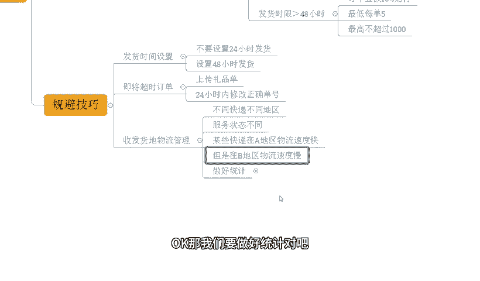

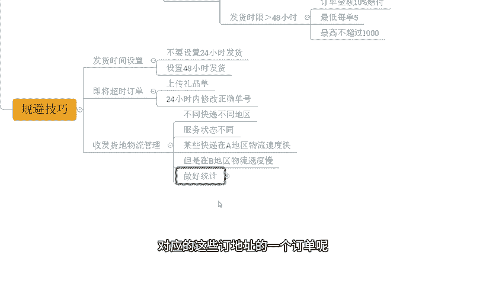

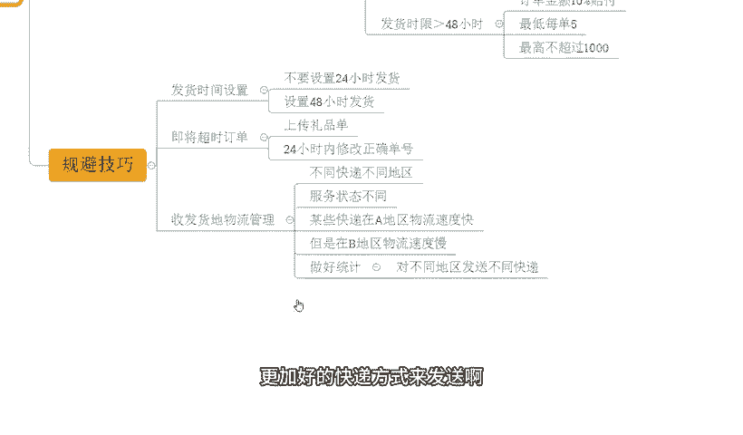

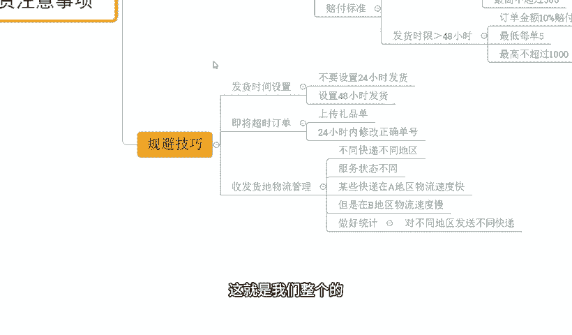

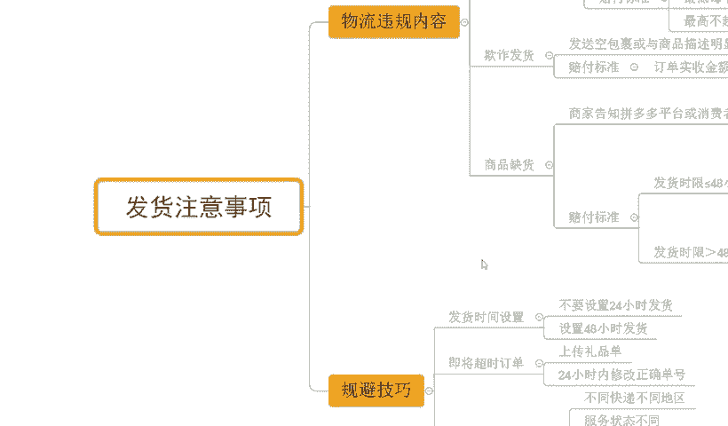

同样的有时间的话啊，那也可以带着大家一起实操坐店，就像这些小伙伴一样，对吧？一起呢我们把店铺好好做起来，好吧，OK啊啊，废话不多说，今天的这个视频分享呢到这里结束，我们下期再见，各位，拜拜。😊。

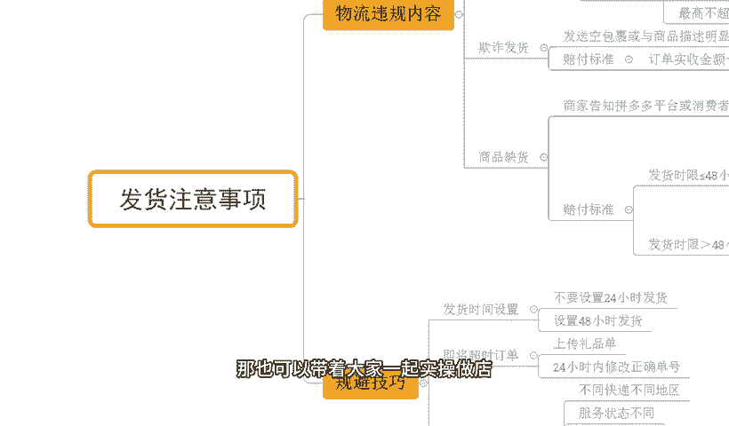

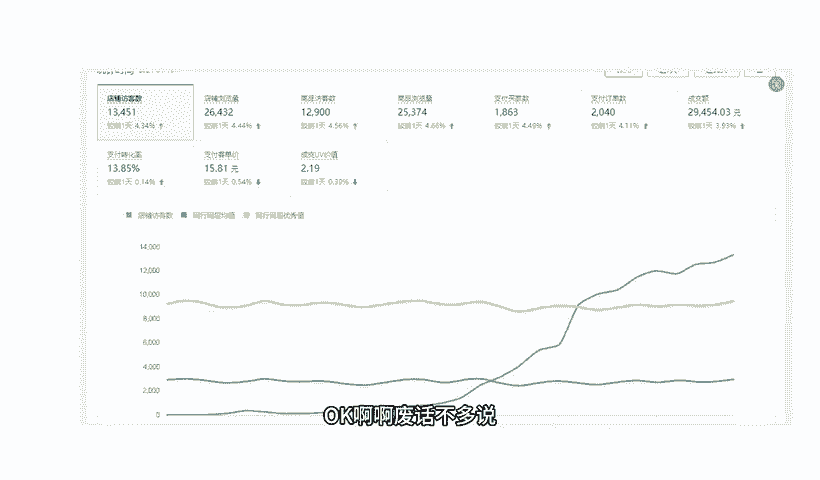

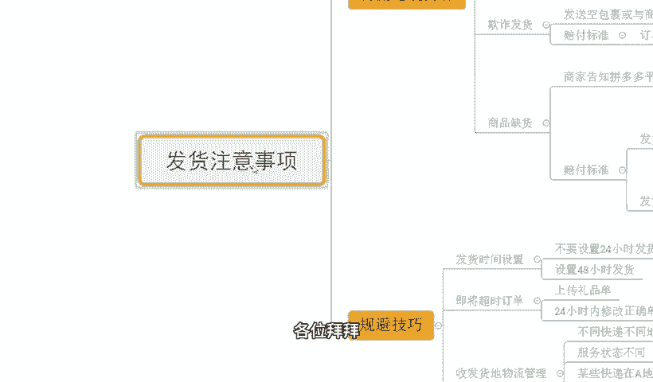

这边呢给大家准备了将近100份的一个文档，可以帮他更好的了解我们拼多多运营拼多多，能够提高大家运营水平。如果大家需要的话，评论区找我领取。

