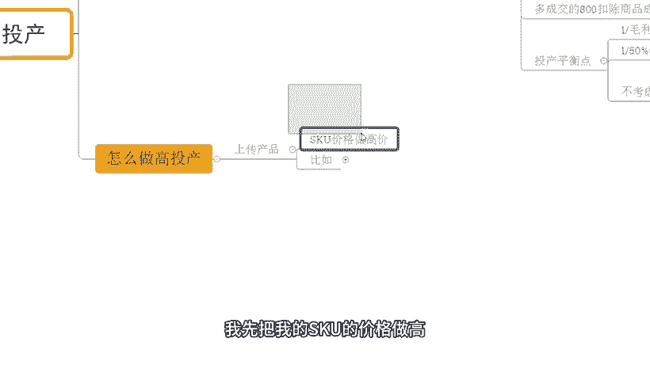
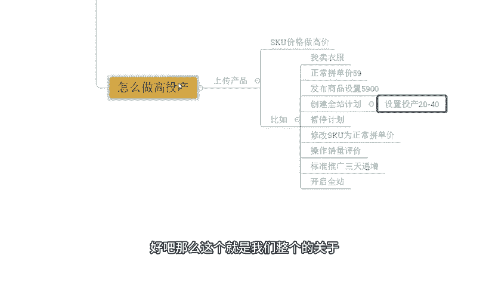

# 【拼多多运营】2024年最系统的全套拼多多运营教程，适合所有拼多多开店新手小卖家自学，10年资深运营师手把手教你从0到1起店实操。 - P34：34-拼多多卡付费高投产 - 拼多多运营教程_ - BV1H62ZYREs4

hello，大家好，我是谢龙。那么今天给大家分享的内容呢是我们拼多多新手开店包款打造操作步骤中的卡付费高投产的一个玩法啊。那么。对于店铺运来说的话啊，很多时候呢，我们很多小伙伴做付费推广呢都是亏损的。

对不对？之所以亏损呢就是因为我们投产太低了。而卡高投产的方式呢，其实就是为了解决我们这个付费成本高，然后呢会费产出低的一个状态的啊。那么在详细分析之前呢，还是老规矩先看一看近期跟一实小伙伴。

他们的店铺数据，好吧，像这个店铺可以看到啊，一个零访客的新店啊，最早对不对？从零访开跟实操整个店铺呢数据快速提升到后期呢一天的访客呢是做到了13000对吧？那么店铺的一个订单的话。

一天是1800多单转化率呢13。85啊，那除了这个店铺之外呢，还有像这个店铺也是一样的吧是一个零访客的新店，最早临访客实操对吧？那么也是非常快速增长，访客呢做到6000多一天的话1100多单，对不对？

转化率18。13啊当然呢除了这种临访客的店铺之外呢，还有到一些。

基础店铺也是用到同样的方式方法去操作，能够达到快速提升的啊。比如说这个店铺可以看到啊最早的访客只有几百个，对不对？那几百个访客确实很少啊，后来跟实到之后呢，整个店铺也是快速提升啊。

到后期一天的访客呢做到了12000多接近13000订单呢是2100多单，对不对？转化率呢16。37啊也都非常不错的。那类似这种店铺呢还有很多啊，这里我就不去一一展示了。好吧，那回到我们主题中来。

对于很多的新术小伙伴来说的话，我刚刚提到过对不对？很多的操细节可能是没有办法去很好的理解或者吃透他的。对于店铺操作呢也会有了很多很多困难跟问题，对不对？如果说是有这种店铺操作方面的问题或者是需要资料的。

可以找我啊，有时间的话，我也可以带着一起实操做店啊，就像这些小伙伴一样呢，我们把店铺呢快速做起来，能够得个好的提升。好吧O啊回到主题中来。😊。

那么嗯既然说我们今天分享的内容呢是卡付费高投产，那到底为什么要卡高投产呢？其实我刚刚一开始有提到过，对不对？卡付费高德产呢核心目的嘛就两个字赚钱。

对吧那对于我们店铺运来说，我去做服务推广，对不对？投产越高呢？O那我的利润空间也就越大，对吧？我赚钱的概率也就越大啊，当然呢，可能有小伙伴说哎系统，我这个店铺还没开啊，我不知道底什么叫投产，对吧？

你能不能给我解释一下啊，当然没问题了。那首先我们来看看什么是投产啊，投产呢就是我们店铺的投入产出比啊，那么它的计算方式呢是用交易额去除以花费，比如说今天我啊这个去做了付费推广，对不对？

那么这个付务推广呢，我的成交额是1000块钱，我推广的这个花费成本呢是100块钱好，那么这个时候呢我的投产，也就是我的投入产出比就是10。

那我现在商品的毛利率呢是50%。其实我推广费花了100的话，那么这样子成交额只要做了200，我就不亏的，对不对？那么这个时候呢，多出来的800的这个啊费用呢，扣除掉我们商品的成本呢，就是我赚的钱。

啊，是这样子的啊，而这里还会有到一个东西叫做投产平衡点啊，也就是我们达到什么样一个数据，我的投产做了这么一个数据，我就不亏的一个一个一个算法啊。那么这里大家可以看一下，就是用到一除以毛利率。

啊，比如说我的这个毛利率是50%，我就用一除以毛利率50%。那么这里得到22就是投产平衡点。那么在不考虑退货，售后的问题情况之下呢，O那么这个时候呢我的投产大于二，我就是赚钱的。小于二就是亏钱的。

如果等于二好，我保本。那对于店铺推广来说的话，只要保本我觉得都是可以做的啊，那么为什么呢？因为我能够通过付费的方式去不断的优化投放，那数据肯定会越来越好的。

而且就算是我没有把我的这个付费投放的数据做的更好的话，只要我不亏，我通过这种方式去做，我的整体的呃产品的订单呢也会累积的越来越多。当我的数据量变大之后啊，那我整个的呃产品呢也会有更好的人群访客，对不对？

后期呢。

整体的这一个数据呢也会得到提高。所以这么个情况啊，那呃这里呢我们要去做的话，就要把我们投产做高做大，对不对？做的更好。那怎么去做呢？啊？这个问题可能是大家更加关心的一个点，对不对？哎，说了这么多对吧？

那怎么做高投产高投产到底是什么做对吧？好麻烦啊，听着好累啊，没关系看一下那么这里呢就要求我们做一个事情，就是上传产品的时候，我们就要开始布局我们的高投产计划啊，是这样子的。

所以很多小伙伴呢在上传产品的时候可能就没有做这些动作啊，所以也没有办法去做了一个很好的啊推广的一个结果，就这个原因。那么上述产品是怎么做呢？比如说ok我首先第一件事情呢，我先把我的SKU的价格做高啊。

比如打个比方啊，我现在卖衣服的正常呢我这个产品的拼单价呢，我就做59块钱，对不对？好，那我发布商品的时候呢，我就把这个商品设置一个。

个5900的SKU。不。太变态了，对吧？价格涨了100倍啊，但是问题不大啊，我们之所以做这个事情是为了干嘛呢？为了欺骗我们的系统。那根据我们当前的产品金额不同。也会影响到我们设置推广计划的时候。

平台给我们匹配到的投产啊。那么按照正常来讲的话，如果说我是59的一个价格，可能我设置的一个投入层出比就会很低。但是如果我去设置了1个5900的这个金额的话，OK那我在创建计划的时候呢，投产就会很高啊。

那么这里呢一般建议大家啊在设置权赚计划的时候呢，刚开始上传产品之后，对不对？可以把投产设置在20到40，不用设置太高，太高，其实意义不大的，反而有风险啊，有的时候会被屏蔽下架的啊。

那么设置完这个动作之后好，我们去暂停计划啊，暂停计划。暂停完成计划之后呢，我正常的去干嘛呢？修改我SKU的一个拼栏价格，把它恢复到正常的一个价格。比如说原本不是我设置成五星9的吗？

我现在把它改成59没问题。好，改完之后呢正常的去操作我们产品的销量评价啊，那么这些东西都正常去用，弄完之后O我们产品呢有数据啊，就好。没数据的话，没关系。如果说我们要提高效率的话，要快速去起报的话，好。

马上可以去设置一个标准推广计划，数据呢做递增，做3天的一个投放。做完这个投放的过程中呢，我们再去通过啊报名活动的方式来拉伸我们的系统推荐流量，对不对？同时呢再去开启全站。这个时候啊，全站呢。

因为我们前期的推广积累了很多人群。

包括说我们去做付费了，做这个啊活动提报啊，对吧？也会得更好的推荐。这个时候呢就能够通过全站的完成收割。全站的转化率呢往往会比较高一点啊，而我们又设置了一个高投产。

那么这个时候呢整个订单的汇率成本呢会相对比较低一点。好吧，那么这个就是我们整个的关于我们高投产的一个操作方式啊，那么呃如果说你是进入小白的，对不对？对于整个店铺运营呢，哪里有问题的。

也欢迎大家跟我交流沟通。那虽然说我今天这样去讲解，可能在实际运营过程中呢，还是会有到很多很多细节问题大家不清楚的这个没关系啊，正呢还是那句话有问题需要资料的找我就可以了啊，那么有时间有机会的话。

我也可以带着操作店就这些小伙伴一样，对不对，把店铺呢快速的做起来。好吧，O啊，后面呢我会详细的再次把更多的关于我们这个新手开店包括打造作的细节呢进行分享啊，大家可以关注一下。今天视频呢到这里结束。

我们下次再见。各位拜拜。

这边呢给大家准备了将近100份的一个文档，可以帮他更好的了解我们拼多多运营拼多多，能够提高大家运营水平。如果大家需要的话，评论区找我领取。

