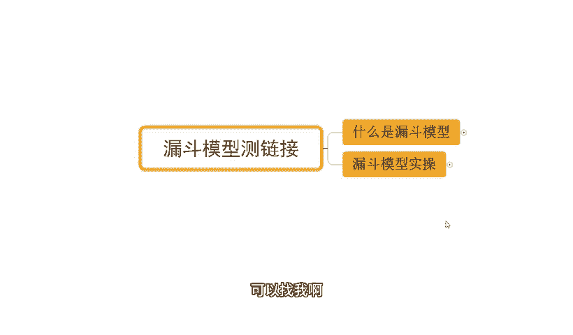
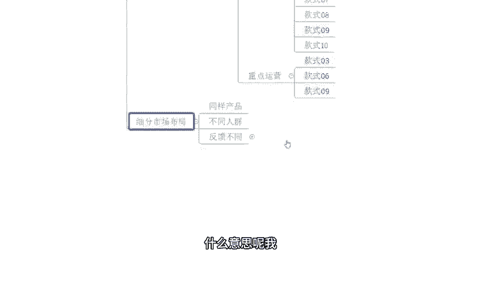
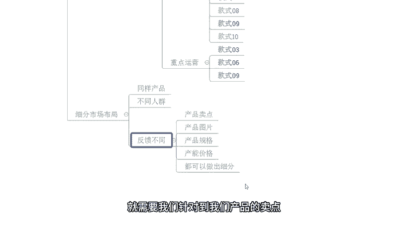
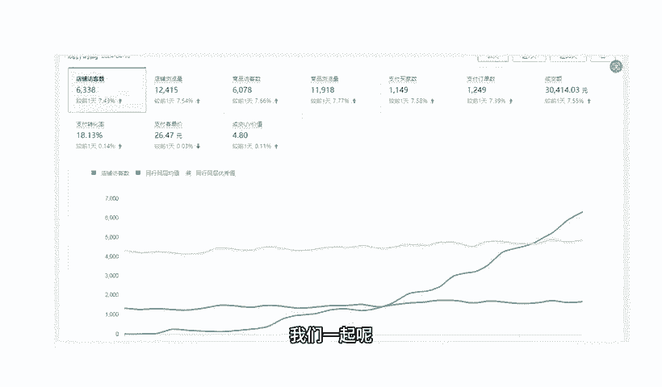

# 【拼多多运营】2024年最系统的全套拼多多运营教程，适合所有拼多多开店新手小卖家自学，10年资深运营师手把手教你从0到1起店实操。 - P35：35-拼多多漏斗模型测链接 - 拼多多运营教程_ - BV1H62ZYREs4

hello，大家好，我是谢楼。那么今天给大家分享的内容呢是我们拼多多新手开店爆款打造步骤中的漏斗模型侧链接的内容啊。那对于漏斗模型呢，肯定很多新手小伙伴呢是不清楚到底是什么的对吧？那么不用担心。

那今天呢会详细的为大家分享到底什么是漏斗模型，怎么样去玩这个漏斗模型，怎么去应用它啊。当然呢，在分享之前呢，还是老规矩啊，先看一看啊，近期呢跟着我一起实施的小伙伴，他们的店铺数据，好吧。

那么这个店铺大家可以看一下啊，是一个丛林操作的一个新店啊。那么最早的访客是零。那跟了实操之后呢，整个店铺也是快速提升。而在这个过程中呢，就应用到了乐斗模型，通过乐度模型呢去完成了我们爆款的一个筛选啊。

那超了后面呢一天的访客呢做到了13000啊，一天的订单呢是1800多单转化率呢13。85啊，那除了这个店铺之外呢，还有像这个店铺也是一个从林起报的新店啊，最早呢是零访客对吧？跟了实操之后呢。

整个店铺也是非常快速的增长啊，到后面呢一天是做到了6000多的访客。当然这个访客呢没有刚刚另外一个店铺多啊，但是呢呃问题不大啊，一天呢也有1000多单，对不对？18。13的转化率啊，转化率非常不错。

那除了这两个店铺之外，对不对？啊？除了这个新店之外，也有到一起店铺呢是有基础有数据的店铺啊，一样的啊，可以很好的去操作。像这个店铺呢呃最早的访客是有几百个，对吧？那么同样的用到这种方式去操作之后呢。

访客一天呢是做到了后期的将近13000啊，有2000多，对不对？一天的订单是2100多单啊，转化率16。37啊，就非常不错。

那么对于店铺操作来说的话，其实有很多的一个新手，包括说这个小白对吧？啊，会觉得有很多很多的困难，很多很多的问题。甚至有的时候呢连问题是什么都不清楚啊。那这个没关系啊，其实对于一个陌生人领域来说的话。

我们去操作去接触，肯定会有到一些问题跟困难的啊，这都没关系。那如果说是有这种店铺操作方面的问题啊，或者是有需要资料的呢，可以找我啊，有时间的话，我也可以带着一起去实操桌店啊，就像这些小伙伴一样呢。

一起呢我们把店铺呢快速给他做起来，好吧？O啊，回到主题中来，那么今天呢讲的是漏斗模型车链接，那到底什么是漏斗模型呢？其实漏斗模型呢，他就是一个销售模型的应用啊，那什么意思呢？举个例子。

今天呢我开了一个饭馆，对吧？我开了一个饭馆呢，我不可能说一天能够进来一个人就成交一单，就在在我店铺里面去买一份餐食或者是定义桌，对吧？肯定不是这样子的，可能会有很多。

人从我门口路过，路过这些人呢也都看到我的店铺了。那么他们不一定会来我店铺里面去这个呃。吃饭对吧？那有人进来了之后呢，他可能可先看一看菜单，看一看我的这个呃。装修对吧？等等这些东西啊。

那么有人觉得还不错啊，然后他就留下来吃了啊，有人可能觉得哎好像不是很满意，然后就离开了，对吧？那么这个呢就跟我们啊店铺上传产品一个道理的，对不对？那么整个店铺呢可能有很多的曝光，对吧？

那么有了这个曝光之后呢，有人觉得还还不错啊，就点击这个链接进来了啊，进来之后呢，觉得还行啊，不错，就买了。有的人觉得可能还呃，不是特别满意，或者是有想去再多对比一下，对吧？于是后呢就退出去了啊。

是一个道理的。那么这个就漏斗模型，它是一个。这个从每一个销售环节过程中啊，一步一步筛选我们客户的一个过程，对吧？就我们刚刚讲的哎，我们的曝光，我们的访客，我们的这个订单啊不一样啊。

比如说我有100个访客啊，100个曝光啊，然后呢，我有到10个访客，对不对？那么这个时候呢，我的点击率是10%。那么这10个人里面呢，到我店铺里面啊，完成订单提交的有一个人，那于是乎呢。

我的转化率也是10%。他是一个。

数据层面啊从上到下从多变少的过程，像一个漏斗一样啊，就这个意思。

那么漏ot模型的特点呢就是说呃每个阶段的数据呢会逐渐减少啊，那么它呢就是我们去筛选啊去优化的一个非常重要的考核指标啊，那么呃了解清楚什么是漏ot模型之后，我们再来看一看啊，到底怎么去应用漏ot模型。

怎么去进行实操啊，其实呢这个不难啊，那首先呢我们就从产品结构布局上来说啊，那在我进行产品的选品的过程中，我们一定是根据数据化去完成选品的，对不对？那么这个选品过程中呢，我们会定位出很多啊。

在数据层面上具备潜力爆款属性的产品。那么这些潜力爆款的商品呢，我们进行上架。上架之后呢，O这个时候呢平台也会根据我们上架的产品的数据呢？啊，这个进行推荐。

并且呢在后期呢有的更多的一些这个成交数据或者是订单之后呢，又会进行第二次的一个推荐，对不对？

那么这个不断推进的过程呢，就是我们需要去筛选的过程。那举个例子。

今天呢我通过数据分析呢，我去上传了很多产品，对吧？多少个呢？10款。那么这10款呢可能款式不同，属性不同，价格也不同，对不对啊，造型也不同或者怎么样的啊，那么每一个款式呢其实都是具备前列曝款属性的。哎。

我觉得都还不错，于是乎我去上传了。那么上传之后呢，这10个产品呢就在我店铺里面进行展示。同时呢也会被系统推荐。那么当系统进行推荐的时候呢，通过抓取的商品信息完成基础曝光得到基础曝光之后呢。

哎O这个时候呢就会有到不同的产品会有到不同的反馈。比如说这10个产品里面有三个款式，03款06款，还有09款，对不对？这三个款式呢分别呢在进行平台推荐的时候呢，会有到一个相对比较不错的数据啊。

那么他们呢整体的访客会多一点啊，整体的这一个收藏会好一点啊，甚至呢还会有出单。那么虽然说是新品，对不对？那这个时候呢我们也可以针对性的去重点运。

这三个产品啊，以这三个产品为核心来进行产品运营。后期我们在进行新品上架的时候呢，也可以参照这三个产品来完成新品的布局。

那么这个就是漏ot模型的一个筛选过程，对不对？我从最早的多个款式上传来进行一个呃流样的获取或者曝光的获取。获取之后呢，再筛选出一些优质的商品。那么呃简单来说，可能我们上传的产品呢，它虽然说是前期爆款。

但是呢并没有说真正的意义上就是爆款，对不对？那么呃众多的链接，众多的商品上权之后呢，可能有一部分，那么它是能够有到一个比较好的数据。那么这个时候呢就是一个筛选过程，对吧？从多变少嘛。

那么再到后面呢进行重点运营之后，那我们又可以从里面呢挑选出一些数据更好的来进行一个重点维护。那么最终呢这一个产品呢可能就是我的主推款主推爆款啊。

那么这就是漏ot模型在我们产品的选品过程中的一些操作方式啊，那除了这个地方之外呢，还有就是我们的细分市场也可以运用到漏斗模型完成操作。什么意思呢？我们产品可能已经确定好了对。

同样的一个款式，这个款式呢我们已经明确了，它就是潜力爆款。但是呢虽然说这个链接这个款式已经确定好，但是针对到不同的人群，针对到不同的购物人群和使用人群他们的需求不一样。他们的这个关注的点不一样。

他们的这个呃对我们产品属性或者对我们产品的一些这个卖点的敏感度也不一样。于是乎呢我们可以把这单一的某一个产品拿出来，根据不同的人群，根据不同的用户需求来做出更多的不同的链接啊。

一个品发布多个链接的方式去做。这个时候呢我们就可以通过投放啊，来进行测试，根据我们的不同人群的反馈不同啊，那么来判定哪一个人群，哪样的一个产品的卖点是更具吸引力的，是能够得到更好的市场细分人群的啊。

那么这个地方呢就需要我们针对到我们产品的卖点图片。

价格规格对吧？来做出细分。然后呢，后期我们再进行对应的产品上新的时候呢，就可以直接以到对应的细分人群来进行选品。这样子的话，整个的操作呢，后期也可以减少一些成本啊，对对我们整个店铺的操作呢。

也会有到效率的提升，而不至于说是盲目的去操作啊，因为我们每个人的产品不可能说是把所有人所有的这个用户呢都能够去包含进去，这个不太现实，对吧？所以有重点有方向的去运营的话，对我们来说转化会更高。

尤其是对于新手小伙伴本身可能呢运营能力不足，资金也不是很充裕。那么这个时候如果说你盘子铺的太大，定位的人群铺的太开，对不对？你反而会因为捡的芝麻而丢了西瓜。好吧。

O那么以上呢就是我们关于漏斗模型车链接的一个分享啊。当然呢，对于整个店铺来说呢，肯定还会有到很多很多的一些问题，包括说今天哪怕我去给大家做了这么一个。

分享可能在应用的时候，或者在操作的时候呢，也会有很多细一些这个细节问题啊，大家可能不清楚。没关系啊，如果说是有这种店铺操作方面问题，或者是有需要资料的对吧？可以找我啊。

那有时间的话我也可以带大家一起去实操做店啊，就些小伙伴一样呢，我们一起呢把店铺呢快速做起来，好不好？OK啊，那么今天的分享呢就到这里结束，我们下次见，各位拜拜。这边呢给大家准备了将近100份的一个文档。

可以帮他更好的了解我们拼多多运营拼多多，能够提高大家运营水平。如果大家需要的话，评论区找我领取。

