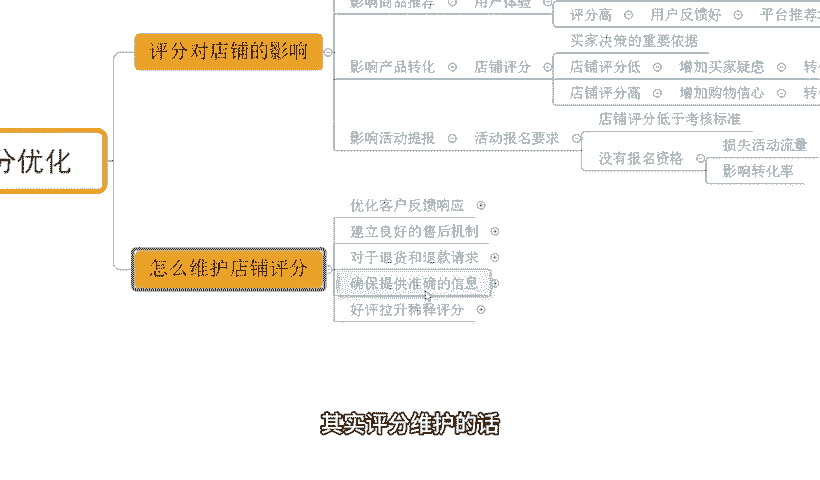

# 【拼多多运营】2024年最系统的全套拼多多运营教程，适合所有拼多多开店新手小卖家自学，10年资深运营师手把手教你从0到1起店实操。 - P36：36-拼多多店铺评分优化 - 拼多多运营教程_ - BV1H62ZYREs4

hello，大家好，我是西楼。那么今天给大家分享的内容呢是我们拼多多新手开店爆款打造步骤中的店铺评分优化啊。

店铺评分呢对于非常多的小伙伴来说，可能是一个比较陌生的东西，对吧？尤其是新手来说，那么可能也并不知道到底应该怎么去优化这个评分啊。不过没关系，今天的话会为大家详细的去分享如何优化我们的店铺评分。当然呢。

在分享之前还是老规矩啊，先看一看近期呢跟着一起实操小伙伴，他们的店铺数据。好吧。

来，像这个店铺呢，最少访客呢是有个1000多啊，200不到。跟了1号之后呢，整个店铺数据呢也是非常快速的增长啊，到后期呢，一天是做到了13000的一个访客啊。那么订单的话，一天是1600多单，对吧？

转化率呢12。23。

同样的，还有像这个店铺呢，最早访客只有几百个，对吧？那跟了实超之后，整个店铺数据也是非常快速的提升。到后期一天的话做到了12000多访客啊，将近13000啊，那订单的话一天是2100多单，转化率呢16。

37啊，当然呢，除了像这种原本有技术有数据的店铺之外，对吧？那么也会有到非常多的一些零访客的新店跟着实操。像这个店铺可以看到最早是一个零访客的新店来的那跟了实操之后呢。

整个店铺数据呢也是非常快速的增长啊，到后期一天的访客呢是600啊，这个一天的这个订单的话是1100多单。

嗯，转化率呢是8。13。非常不错的数据，对不对？当然呢这种店铺呢还有很多啊，这里我就不去一一介绍了，好吧，那店铺的评分操作跟优化来说的话，有很多的小伙伴我刚刚提到过，对不对？不知道怎么去做啊。

这也很正常。因为很多的小伙伴是新手，对吧？那如果说你是有这种店铺操作方面的问题，或者是有需要资料的O可以找我啊，有时间的话，我也可以带着大家一起去实操做店。就像这些小伙伴一样啊。

我们一起呢把店铺啊好好做起来好吧，OK回到主题中来，首先呢我们来看一看评分对于我们店铺的影响啊，然后呢我们再来说具体应该怎么去优化。

那么影响方面有很多。第一个点呢，就是对我们商品的权重的影响。

什么叫对上面权重的影响呢？OK的。在我们进行产品发布之后，系统呢会根据我们的商品来进行推荐，考核我们排名。而这个排名考核过程中呢，其实有4个项目啊。

那么其中有到一个项目呢，就叫做店铺数据。那店铺数据呢又包含很多的内容啊，包括说我们店铺的这个3分钟人工回复率呀、物流服务异常率呀、34天投诉率啊等等啊，都是在这里面的。其中呢也包含了我们的店铺评分。

那么店铺评分越高，对吧？那么这个时候呢，我们整个的产品权重也会更高。为什么呢？因为系统考核店铺数据的时候，它就会针对到我们产品针对我们店铺整体进行考核。那么店铺数据如果说不达标，对吧？

平台就会判定说哎你这个店铺呢呃这个做的不是很好啊，产品不是很优秀或者什么其他的一个原因，然后呢会导致限制曝光，但是啊如果说你达标的话，OK那么就是正常曝光，你能拿到更好的数据，好吧。

那再一个呢就是对我们商品推荐的影响啊，商品推荐呢，其实呃在评分的层面上来讲的话，它重点考核的就是我们的用户体验。

如果说我今天我们的店铺评分低，那么起码说明一点就是我们的用户反馈比较差啊。那么当用户反馈比较差的时候呢，OK平台也会减少推荐啊，因为他不希望说一些不好的产品给到推荐到更多的人。然后呢。

这些人都会拥有一个不良的客物体验的话，那么平台的长久发展来说是不利的啊，那么再说一说评分高啊，刚刚也提到过了，对吧？评分高低与否呢是反馈的用户的一个喜爱度，用户的一个反馈情况。那么如果说评分高。

用户反馈好，那自而然我们整个平台呢也会为我们店铺啊增加更多的一个曝光，或者我们可以得到更好的更加稳定的曝光。

那么再来说一个啊评分对我们的影响。那么这个地方呢就是我们产品的转化问题了。那店铺评分的高低。其实呢对我们转化来说影响非常非常大啊。为什么这样说呢？因为买家在进行购物的时候呢。

他们基本上呢也都会有大部分人呢会去参考到我们的店铺评分。如果说你的店铺评分低，那么这个时候呢我们的买家就会产生一些疑虑。哎，这个店铺这个商品感觉还不错呀，为什么评分这么低啊。

是不是有质量问题或者其他原因啊，对不对？那么这个样子的话就会导致我们整个转化率也会比较低一点啊，当然呢还有一种情况就是说我们店铺评分比较高啊，那么店铺评分比较高的话。

这个时候就会增加我们消费者的购物信心，他一看到哎这个店铺还不做哟，对不对？卖了这么多的产品之后呢，整个评分也非常好，那一定是这个产品还不错，于是乎呢就会提高我们转化率增加我们购物信心啊，那另外。

还有一点呢就是说呃这个店铺评分呢也会影响到我们的一个活动提报啊，活动提报呢其实都是有要求的。而这个要求呢，不同活动是不一样的啊，这里我就不去一一去详细讲解了。大家可以去参考一下活动渠道报名的一些要求啊。

那么如果说今天我产品的评分过低的话，那么这个地方呢就会导致一个问题，就是我可能连报名活动的资格都没有。当我损失这个资格之后呢，其实说白了啊，就是审多这个损失更多的这个活动流量啊。

那么也会导致呢我可能这个转化比较低，整体数据比较差。好吧，O那么这个是我们影响的一些东西啊，讲完那现在呢我们来说一说到底应该怎么去维护啊，其实评分维护的话也是需要我们通过不同的具体问题来展开的。

首先第一个点呢，就是我们要去反馈这个用户信息的时候呢，一定要更加高效一点。包括说我们在进行回应的时候，也是一样。

对不对？那如果说今天我们的这个评分啊不是很好，那么呃在买家进行打分的时候，就有可能是我们买下的伏笔，什么伏笔呢，就是我响应时间很长。用户问了一个问题之后，我很久不回复。或者是用户在进行售后处理的时候呢。

我可能回复的这个效果也很差，不是很及时。那用户呢已经给我发了一些消息之后，我没有第一时间响应的话，平台或者是用户呢，他也会判定说哎这个店铺好像不咋地，对吧？哎，店大欺客呀啊。

对我们这个用户的响应不是很及时啊，会导致我们损失掉很多的一些订单，包括说推进权众啊，那么像我们用户的一些咨询啊问题啊，都需要我们通过快速响应来解决的啊。而这个也是对我们评分有非常大影响的一个环节。

那再一个呢就是说我们需要去建立一个非常良好的售后机制。

那并且呢提供一些更加简单快捷的处理流程。对于我们用户呢反馈到的一些问题呢，我们需要主动的去跟进啊。比如说用户说哎我这产品质量好像有问题。OK那没关系啊，那我第一时间去跟进这个产品到底是什么样的原因啊。

那么这个东西呢，我们如何去更加高效的去用到更新的产品呢，给到我们的商家，给到我们的买家对吧？都是有说法的。那么呃这个售后的一个处理机制的话，其实也是为了完善，或者是更好的去服务我们的消费者。

带来更好的售后用户体验，对不对？而这个售后用户体验做好之后呢，其实呃一方面呢可以帮我们去更好的去要评价啊，那么另外一点呢，我们也可以根据用户反馈的情况呢，及时做出我们的服务调整。

给到我们用户更加这个好的客物体验。好吧，那再来一个呢，说一说这个关于这个退货和退款的一个请求啊。那么呃用户。

后呢，如果说是觉得哎好像我这个产品不想要了，或者我这个产品呢有问题。我觉得呃这个不是我想要的东西，或者是我对它的功能不满意。好，那么我们一定要更加高效的去解决并且处理它啊。

其实刚刚讲到这个售会机制的时候，也说的这个事情，对不对？

那再一个呢就是我们要确保我们的信息准确啊，尤其在我们产品的发布之前的一些这个卖点的策划方面啊，或者是其他一些东西啊。那我们要准确清晰的描述我们的产品，不要说让我们的消费者产生误会。

不然的话可能有人他没有办法逐字逐句的去详细的去阅读我们的这个主图详情啊，包括是我们的标题的话，那么就会导致可能买家收到货之后，觉得哎我好像买错东西了啊，造成我们的售后问题。

或者是对我们售后的一个进度不是很满意，或者对我们的产品不是很满意，导致一些不良的评价啊，都有这种情况的。

然后呢呃如果说出现了我们的评分很低怎么办？那操作方式呢其实比较简单的那首先第一个点呢，我们可以通过去操作好评来拉伸稀释我们的评评分啊，那我评分变得更高。那么这个呢如果说我们要去更好的去经营店铺的话。

那一定是需要针对到我们具体的原因来分析的。比如说我这个整个服务过程中呢，我的这个买家啊他觉得我这个服务有哪里有问题，我们在及时跟进的时候呢，后期也要做出一些调整来确保店铺的一些评分能够更好一点。好吧？

那么治标和治本的方式呢都分享给大家那整个的一个店铺评分优化呢去讲到这里，对不对？后期呢也会针对到更多的一些这个新手开店，包括到不中的一些流程进行详细讲解，大家可关注一下啊。

同样的对于很多的新手小伙伴来说，我刚讲到的可能还会面临着非常非常多的一些实际的问题。因为毕竟自己没有做店铺。所以对于操作店铺来说还是比较。

陌生的啊。那如果说是啊有店铺操作方面的问题啊，或者需要资料啊，可以找我啊。当然那有时间的话，我也可以带着你一起去实操做店，对吧？就像这些小伙伴一样，刚刚讲到对不对？一起呢把店铺给它做起来，好吧。

OK今天的视频分享呢就到这里，我们下期再见，各位，拜拜。

这边呢给大家准备了将近100份的一个文档，可以帮他更好的了解我们拼多多运营拼多多，能够提高大家运营水平。如果大家需要的话，评论区找我领取。

