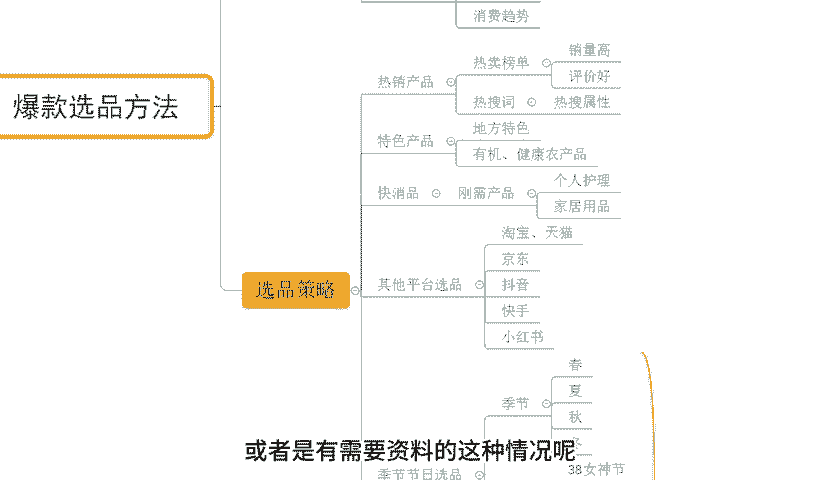

# 【拼多多运营】2024年最系统的全套拼多多运营教程，适合所有拼多多开店新手小卖家自学，10年资深运营师手把手教你从0到1起店实操。 - P38：38-拼多多爆款选品方法 - 拼多多运营教程_ - BV1H62ZYREs4

hello，大家好，我是谢荣。那么今天给大家分享的内容呢是我们拼多多新手开店爆款打造实操步骤里面的爆款选品方法的内容啊。那首先呢还是看一下近期跟着我实在做店的小伙伴，他们的店铺数据，好吧，像这个店铺呢。

最早呢访客只有几百个，对不对？跟着实操之后呢，整个店铺呢属于快速增长啊，从最早的几百个访客呢做到了一天访客呢啊12000啊，将近13000啊，一天的订单呢是2000多单，对不对？转化率呢16。37啊。

还有像这个店铺啊，那么最早访客呢只有1000多两天不到啊，跟着实操之后呢，整个店铺也是非常快速增长啊，访客呢做到了13000多啊，将近13500啊，那么一天的订单呢是1600多单啊，转化率呢12。23。

对不对？包括还有这种零基础的店铺啊，对吧？最早零访客啊，直接做到了访客呢是啊6000多啊，一天的话1100多单，转化率呢18。13啊，还有像这个店铺啊，最早呢也是零访客的新店来的啊。

从最早临访客呢做到了访客13000啊，那么一天的话1800多单，13。85的转化率。

对不对？对于店铺操作来讲的话，很多的一些线路小白，那肯定会面临很多很多的困难跟问题啊，这个很正常。因为毕竟的话店铺操作不是说我们想当然的啊，在做的过程中，很多时候呢甚至我们连发现问题。

找到问题的的一个能力都不具备啊，但是没关系啊，如果说是你有这种店铺操作方面的问题或者有需要资料的啊，可以找我那有时间的话，我也可以带着你们一起去实操做店对吧？就像刚才你们看到这小伙伴一样。

我们一起呢快速的把店铺给他做起来好吧？O啊，回到我们今天分享的这个真实人中来。那关于我们这个爆款选品方法的话，其实从两方面去探讨啊。第一个呢就是我们的市场分析。那之所以要去做市场分析呢。

这个我之前有提到过，对不对？可以帮我们去更好的了解市场，了解我们竞争对手能够去帮我们去更好的做好我们产品的一个选品啊做好。

定位来保证后期进的一个正常进行对吧？那市场分析呢，它到底分析什么东西呢？OK首先第一个点呢就是了解我们的用户。

那么了解什么用户呢？了解我们的目标用户，了解我们用户的一个需求，我们用户的一个偏好，以及他们的购物习惯。比如说我们有很多的用户呢，他们在购物过程中呢会选择购买一些折扣商品，对吧？或者对折扣会比较敏感。

OK那我们在后期经营的时候呢，我们就需要去做更多的活动提报，做更多的折扣信息来更好的让我们消费者进间选择，对吧？包括说我们讲到的这个啊偏好啊，对吧？不同的产品款式，不同的颜色，不同的尺码。

那也都会有到不同的人群，也都会有到不同的需求。我们要做好分析，保证后期经营呢能够去更好的触达到我们的消费者。那再一个呢就是我们的竞争分析竞品分析来的了啊。

那么这个东西呢就直接针对到我们的竞争对手去了解清楚他们的产品结构，产品的实际情况啊，包括它的一个材质怎么样啊等等这些东西，对吧？然后再到它的价格，以及它的营销策略。哎，我的同行它是报了什么活动。

他报名活动报的什么价格，对吧？那么这个活动到底能不能给他带来更好的产出，这个东西呢，我们都可以分析因为这个分析完之之后啊，后期我们在经营的时候，可能说没有一个明确的目标的情况之下呢。

你竞争对手前进的一个呃轨迹来进行我们自己单品运营呢，是一个非常简单有效的销售方式。那么在这个过程的重点就是干嘛呢？我们需要去找到我们的差异化。

结合到我们产品实际情况和我们的竞争对手呢，找出我们产品的核心卖点是什么？这样子我们在后期经营的时候呢，才能够去保证我们的消费者能够去有到一定的优势，或者是能够去更好的吸引我们的消费者，保证产出。

那么搞定这些东西之后呢，再一个呢是我们需要了解清楚我们的行业趋势啊，那么这个行业趋势呢是我们的行业动态，包括说热门产品以及我们的消费趋势等等啊。那如果我们想要进入这个市场。

它是持续走低的一个下行的一个状态。我们去操作的话，这个时候呢可能就会导致我们整个的操作会比较吃力，或者是我们整个在后期啊数据提升之后，我做了大量工作的情况之下排名提升啊，对不对？

但是就没有办法得到一个相对来说更好的或者是更加长久稳定的一个产出啊，所以这就没必要了，对不对？那了解完这些东西之后呢，我们就可以针对到我们的产品呢去做好我们的。

选品策略了对吧？那产品嘛是核心。如果说产品不能够满足用户需求，我们去操作去优化去投放。ok那么这个时候呢也不可能带来很好的一个消费结果，对吧？所以说呢我们一般呢可以针对到我们的热销商品来完成选品。

所谓的热销商品选品呢，其实有很多的一些方式方法，包括第一个呢就是我们的热门榜单，对吧？在拼多多平台呢会有到一个这个榜单信息。那么这里面呢我们可以直接看得到占据榜单的商品是谁。那么这些在榜单的一些产品呢。

往往都具备销量高评价好的这么一个特点，对吧？因为它的评分很低的话，也不可能出现在这个地方，如果说呢数据确实很差的话，也不可能专门会有到这么一个榜单来记录它。

所以它的意义呢是可以帮我们快速确定市场的一些热销商品的一个样子，对不对？来完成后期产品的选品，包括说我们后期的一个定位啊，那么在。

这点呢就是我们的呃热销产品的一个热搜词，对不对？那这些关键词呢也都会对应到一些热搜属性。那结合这个呢，我们也可以判定这样的产品可能在市场上的需求会比较大一点，来保证后期经营，对吧？那所以这个时候呢。

我们在选品的时候呢，就可以直接通过榜单，或者通过我们的一些热搜词来进行操作啊。

那再往后呢，我们也有到一个方式啊，是特色产品的一个经营啊。这个东西呢就看我们自己的实际情况了。如果说你所在的地方会有到一些呃具备地方特色的一个产品。O的，我觉得完全没问题。

这个也可以拿出来作为我们的一个产品进行经营。那么啊这个地方呢也举个例子啊，包括像一些这个有机的农产品呢，包括一些健康的农产品，对不对？这种呢也是啊非常具备地方特色的一些产品啊。

也可以帮我们去啊更好的去获取到一个相对比较精准的访客，那再往后呢，我们也可以通过啊选择一些快消品来完成我们产品的选品策略啊，那么这个快消品呢。

它其实啊跟我们后期经营是脱不开关系的因为快消品呢它存在说一些方这个优势吧啊也不说别的，至少来说它的需求稳定，而且呢是消耗品啊，所以整个市场体量会非常大啊，那么这里呢也给大家举一个例子啊。

比如一些跟这个客户的一些产品啊或者一些家居用品啊，那么呃基本上呢也都会有到一个非常好的市场需求，而且很稳定啊。那再往后呢我们可以参考到一些其他平台选品，对不对？

包括像我们的淘宝啊、天猫啊或者京东啊或者抖音、快手啊、小红书啊等等啊。那通过这些渠道去选择一些呃当下比较热门的产品也是非常ok的。这些产品的话，我们选择出来之后呢去经营。

那么也能够起到一个事半功倍的效果。因为本身这些产品呢，它已经经历过市场的筛选了，确实在我们啊很大程度上来说，其他平台都能够用这些产品呢做好一个转化，包括说用户留存。所以这种情况之下呢，我们去操作呢。

也可以走到一个啊比较稳定的一个道路上去啊。那再往后呢，我们也可以去通过季节节日性选品啊，那么季节节日性选品呢是其实是两个一个是。

节是节日啊，那季节呢就有春夏秋冬，对不对？四季不同呢，我们人对于我们所需要的这个产品需要的一些事物也是不一样的那不同产品呢会有到不同的对应的一个收容群体，而不同季节呢也会有到不同季节对应的一个产品。

对吧？比如说我们春季啊。

那么这个时候呢天气慢慢发生改变啊，原本是冬季的一个寒冷啊，转换为了一个比较清凉的一个状态。所以呢我们也会换一些啊相对来说可能比较薄一点的外套啊，或者是衣服之类的，对吧？啊，或者说是其他一些产品啊。

比如说像我们的夏天啊，天气比较炎热，那可能我们会需要非常多的一些这个防晒啊啊防中暑或者是一些这个呃防蚊虫的一些产品。因为这个在夏季呢就很常见的一些这个自然现象，对吧？

包像我们冬季还有这个秋季类似一样的道理，然后再一个就是我们的节日产品啊，像我们的什么三八女王节啊，618呀、端午节、国庆节中秋节呀，对不对？那不同的节日呢都会有到不同的一个呃产品需求的放大。

那在这些对应的节日里面啊，有到什么样的产品是一些可能啊刚需啊，或者是需要我们去使用的一些产品的话，我们也可以提前去做好这个布局。比如说像我们的这个端。

节中秋节对不对啊，会有到粽子跟月饼啊或者其他的些周边的产品。那么这些呢也都是我们去呃选择运营的一个方向啊。但是呢季节性和节节性选品的话就会有到一个通病，我们需要去做到一个时间的提前量。

你不能说产品刚好已经啊到了日子了，你才去做啊，你肯定是要打提前量的。比如说我们的啊端午啊或者中秋，对吧？或者是像我们新年的一些产品。我不可能等到节日到了之后才去买啊，通常是节日到来之前。

我就会去完成这个购买，对吧？而他在购买这个期间，我们产品一定是能够去获得一个比较好的排名的一个状态，而不是刚刚起步，刚开始运营的一个状态。所以这个也是非常重要的啊。那有了这些东西之后。

我们能够去明白清楚的知道市场的一个产品，它都是什么样受众群体，用户喜欢什么样的产品，并且呢我们通过哪些渠道可以去对标找到一些可以提供给我们参考的一些产品，完成产品选品。O这就是我们第一步做好这个事情呢。

我们就可以开始去着手下一步的准备了啊，比像我们的图片啊标题等等这些东西啊，那对于店铺操作来讲的话啊，可能听到这里还是有很多小伙伴会觉得啊，感觉也好迷糊啊，我不知道到底该怎么做啊，但这个没关系啊。啊。

如果说不清楚呢，也可以结跟我家人沟通，或者是直接多看几些视频啊，多去结合自己产品的实际情况，结合自己。

那一个实际情况呢啊思考一下。那当然呢还是那句话，对于很多的新的小伙伴来说，对不对？本身这是小白，可能有的时候呢你没有办法去很好的解决店铺操作分卖的一些问题。没有关系啊。那如果有问题呢。

或者是有需要资料的这种情况呢，可以直接找我啊，那有时间的话，我也会愿意啊带大家一起去实操坐垫啊，一起呢像这些小伙伴一样啊，把店铺呢给他快速的做起来，对不对啊。

那么这些店铺呢也实操的那对于整个店铺上来讲的话，后续呢我会进行一个更多的一些内容分享，包括说我们之天讲到的一些爆款图片策划等等这些东西。那么有兴趣小伙伴呢可以关注一下啊。那今天的视频呢就到这里结束。

我们下次再见。这边呢给大家准备了进行100份的一个文档可以帮他更好的了解我们拼多多运营拼多多能够提高大家运营水平，如果大家需要的话，评论区找我领取。

