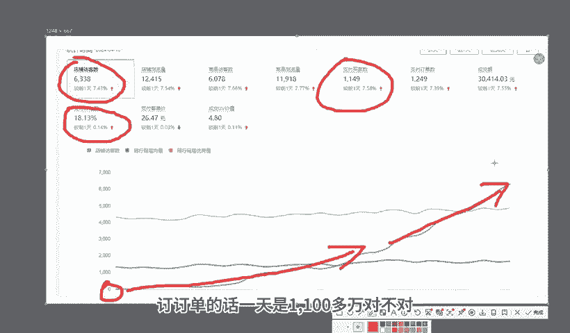

# 【拼多多运营】2024年最系统的全套拼多多运营教程，适合所有拼多多开店新手小卖家自学，10年资深运营师手把手教你从0到1起店实操。 - P39：39-拼多多爆款图片策划 - 拼多多运营教程_ - BV1H62ZYREs4

hello大家好，我是西楼。今天给大家分享的内容呢是我们拼多多新手开店爆款打造步骤中的爆款图片策划的内容啊。那之所以会有这么一个分享呢，是因为图片对我们店铺真的很重要。但是有很多的小伙伴呢却不以为意。

好吧，首先呢还是看一下，跟着我实操小伙伴呢近期的一个店铺数据好不好？像这个店铺呢相对来说数据会大一点啊，也快一点啊，最早呢访客是从零开始的啊，一个新店来的，对不对？临访客那么跟着实操之后呢。

访客快速提升，到后面的一个小的爆发，对吧？到之后呢一天访客也是做到了10三1天啊，一天的订单呢是1800多单转化率呢13。85啊，那除了这个店铺呢，还有这个店铺啊，也是一个从零起爆的新店啊。

那访客呢相对来说会少一点啊，因为品类不一样啊，最早呢访客也是零的对不对？看到没有？从这里开始操作其提升啊，访客呢一路增长啊。

到后面呢做到了一天访客呢是6000多，转化率呢比较高一点啊，18。13转化率啊。订订单的话，一天是1100多单，对不对？除了像这种店铺之外啊，也有一些啊有基础有数据的店铺也是跟着实操的。像这个店铺呢。

最早呢访客是呃这个1000多啊，可以看到那从最早的1000多访客呢开始操作啊，一直数据呢处于一个稳定增长的过程，到后期呢一天的访客呢是做到了13000多，对不对？一天的订单呢是1600多单。

转化率呢12。23啊，那类似这种店铺呢还有很多我就不一一介绍了，对不对？对于很多的新售小伙伴而言呢，可能会觉得哎这个做店铺啊确实有很多问题很麻烦很困难啊，这个很正常。因为本身你自己不懂啊。

所以说就会面临着很多的问题，对不对？那么如果说是有店铺操作方面的问题啊，或者是需要这个资料啊，对吧？可以找我啊，有时间的话，有机会我也可以带着大家一起去实操做店啊，就像这些小伙伴一样呢。

我们一起呢把店铺的给他做起来，好不好？O啊，回到主题中单，那么。

我们的爆款图片策划的话，首先第一件事情呢，我们要搞清楚优质图片的作用。因为我们很多小伙伴呢对图片的重视程度是不够的，甚至可以说是不以为意，对吧？只有我们正确认知了优质图片的作用之后。

我们才能够更好的去面临啊或者是面对这个事情，更好的去做好这个事情，好吧，那么到底有什么作用呢？首先第一个点呢就是吸引点击，啊，那这一个部分呢重点呢是针对到我们产品主图的。当我们的产品啊。

通过各种途径获取到曝光之后，对不对？这个时候呢用户呢可以呃进行浏览。那这个图片呢确实有非常不错的一个展示效果，对吧？图片质量很好，能够很好的吸引人的注意。那么这个时候呢就可以提升我们的点击率。

而点击率的提升，这个就关乎着我们商品排名了。点击率越高，在我们前期的时候呢，越容易获取到更多推荐曝光。对我们产品排名的提升呢越大啊，那么再往后呢，我们图片呢还可以更好的去展示我们产品的特点啊。

那么这个部分呢是我们的主图和详情都需要去做的事情。那我们的用户呢想要去购买什么样的产品，或者是我们如何去说服我们的消费者来购买我们的产品。那么这个地方呢就需要我们啊作为商家通过我们的主图。

通过我们的详情进行表达，充分的去展示出我们产品的卖点和优势。然后呢，同时能够去更好的和我们的通行做法区分。O那么这种情况之下呢，我们就可以有利于提升我们的产品竞争力得到更好的转化。

让我们产品呢能够有到更好的产品推荐群众得到更多的曝光。那另外一点呢，我们有一个好的啊这个产品的图片输出的话，也可以帮我们增强我们用户的一个信任感啊。尤其。是我们的图片呢不要去用那种啊非常模糊的啊。

或者是图片的一个效果很差劲的一个图片啊，那一定是高质量的。因为产品的图片质量越高的话，越能够增加信任感，他至少不会觉得哎你这个店铺做的很随意，感觉随时要跑路的感觉，对吧？

或者是他觉得你这个店铺呢就感觉就是个山寨货啊，没有一点这种好的视觉感官的话，就会让人觉得信度大大降低的对吧？然后再一个呢就是我们通过一个很好的表达的话，也可以让我们消费者呢更好的去了解我们的产品啊。

当他了解好我们产品之后呢，也能够去减少我们的退货率，提升我们的满意度，那从而呢提高我们商品的排名，对吧？当我们的呃退货率低。当我们产品的评价好ok那么这种情况之下呢，我们产品的推荐也会变得更多啊。

然后再一个呢点呢也可以影响到我们的用户体验啊。那如果说我们的图片效果很差进用户呢进来我们店铺之后呢，可能也不会说更多的去关注我们的产品，或者是浏览我们产品，可能就直接闪退。

对吧那这种情况呢也会让我们的系统判定平台的这些用户呢对我们产品呢可能啊不感兴趣，或者是啊不喜欢，对吧？所以有到一个很好的图片的话，可以增强我们的用户体验啊，可以让我们停留时间更长一点。

可以让我们用户的这个体验更好，让平台判定我们产品呢啊更被买家喜爱。然后再一个呢就是我们呃提升转化部分，对不对？就是我刚刚讲到的我们的商品的主图详情，能够去充分的表达我们产品的特点。

能够去表达清楚我们产品的优势，能够去啊搞清楚我们产品的使用方法等等啊，这些呢都可以有利于提升我们啊买家的一个购物信息，帮助完成购物决策。那么这种情况之下呢，我们的转化率也可以大大提高啊。

当转化率提高之后呢，我们才能够去有到更好的销售数据啊，最终呢产到更多钱嘛，对不对？OK这是我们优质图片的作用。那我们到底应该怎么做啊，我们来看一看策划思路。策划思路的话分开来进行分享啊。

首先第一个点呢就是我们的主图。那对于主图来说的话，唯一重要的一个点就是点击率。点击率是我们的核心。因为用户呢它通过各个渠道来进行商品的查找的时候，或者是平台对我们商品进行推荐的时候。

那用户看到的就是我们的主图，也就是我们讲的轮播图，对不对？所以这个时候呢我们一定要去做好差异化。那差异化呢能够去帮我们产品呢更好的吸引户眼球啊，而差异化呢它的一个表达方式呢啊这里呢总结归纳为两个方面啊。

一个呢是我们的颜色差异化。一个是我们的这个展示差异化。那么呃展示差异化和颜色差异化呢，它能够让我们的产品呢区别于同行，更容易被看到，更容易被点击啊。那什么意思呢？我们来举个例子，好不好？

这里呢有到很多的商品图片呢被展示出去。那么其中呢我们的产品呢都是服装，对不对？那么有用户呢看到的这个产品呢，哎发现呢这个商家呢做的是模特图。而，这个商家呢做的也是模特图那么这个商家呢也是模特图。

OK在中间呢穿插的一个产品。那么这个产品呢做的是一个平铺拍的一个图片，或者是挂拍的一个图片。OK那么这个时候呢，他就会显得很显眼啊，是这个意思。那么这个就是我们讲到的展示差异化的一个表达。

那所有人用的是模特图的时候呢，我就用平铺拍，所有人用皮铺拍的时候呢，我就用挂牌，所有人用挂拍的时候呢，我也可以选择是模特图或者是。

其他的方式表达，又或者是我放一个非常大的细节图展示等等都可以啊。而颜色差异化的话，同样的道理，对不对？当我们的平台所有的其他的同行用的产品颜色是红色的时候，我弄一个黑色。当他们的背景颜色是白色的时候。

我弄个黑色。那么它都可以把我们完成。我们想要达成的这个目的啊，获取到更好的吸引力，得到更好的点击。然后再往后呢，我们就是卖点的一个表达了啊。卖点表达的话，这个呢是呃针对到我们的用户痛点来展开的。

我们要搞清楚我们的消费者在购买我们商品或者是在购买类似这种产品的时候，会面临着的问题是什么？他们的关心的问题是什么。然后呢我们要针对性的去表达，只有针对性的去表达。

针对到我们的痛点去输出我们的卖点才是有效的卖点，不然的话都不痛不痒，没有意义的，对不对？那再往后呢就是我们的轻视觉的一个观点啊啊。那我们在视觉呈现上啊。

不要说是同一个图片或者是一瓶的一个图片里面展示出过多的一个我们想要表达的卖点。卖点太多等于没有卖点。这句话大家注意一下，对不对？那我们可能是单一的一个图片，某一个呃这个图片，对吧？一瓶的一个展示。

那么它是围绕着。一个主题展开的啊，一个图一个主题。然后呢，这样子我们的卖点会更加清晰一点。当然这个一个图一个主题并不是说一个图我只放了一个卖点啊，不一样的啊，什么意思呢？

比如说我今天要展示出我产品的做工好，对吧？那我可以告诉我的消费者，哎，我的做工很好啊，这个用多久用不换。那为什么呢？因为我用的什么样的一个面料，我用的什么样的一个工艺，我的这个走线是怎么走的。

对不吧等等啊，那么这些细节来进行呈现。这些细节我是可以去输出的，只不过我要把我的卖点啊归纳为是我耐用，归纳为我的质量好，然后去输出给到我们消费者。

那么这样的一个方式呢，在用户接收的时候呢，就会更加的容易一点啊。O的啊。那么这个就是我们整个爆款图片策划的一个呃方式方法啊。当然呢可能还是比较笼统一点啊，因为我们涉及到具体的分析，还是需要介绍产品来的。

所以呢也只能给到大家一个大的方向啊，那如果说是有这种店铺操作方面确实自己操作的时候会面临很多问题比较困难的情况下呢，O的，也可以选择更多实操。好吧，对于店铺操作而言的话。

有很多的新的小伙伴呢会觉得很困难啊，这个我也反复强调，如果说是有什么店铺操作方面的问题啊，或者是有需要资料的呀，可以找我，对吧？有机会有时间的话，我也愿意带大家一起实操，像这些小伙伴一样呢。

我们一起呢把店给他做起来。好吧，O啊，那么今天的一个视频分享呢就到这里，下一次呢会继续的啊为大家分享到我们整个爆款操作步骤的更多其他内容，大家可以关注一下。这边呢给大家准备了这100份的一个文档。

可以帮他更好的了解我们。

拼多多运营拼多多能够提高大家运营水平。如果大家需要的话，评论区找我领取。