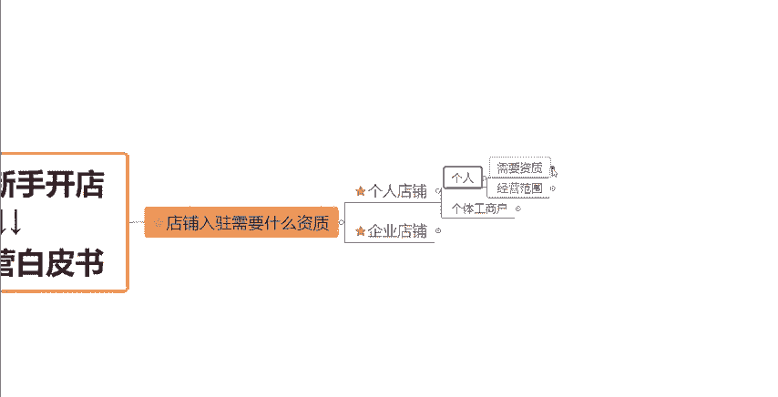
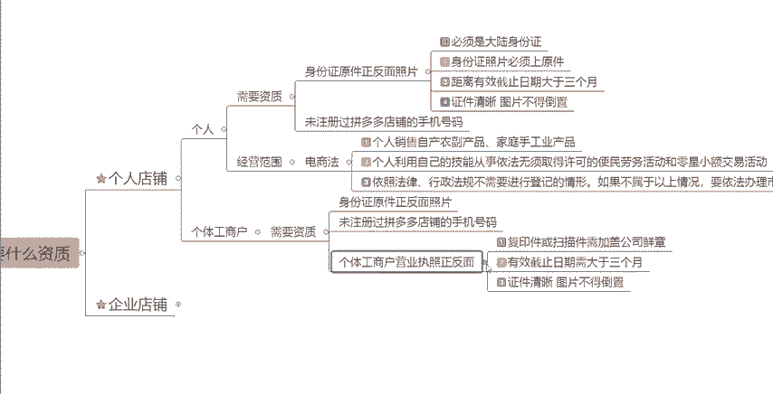
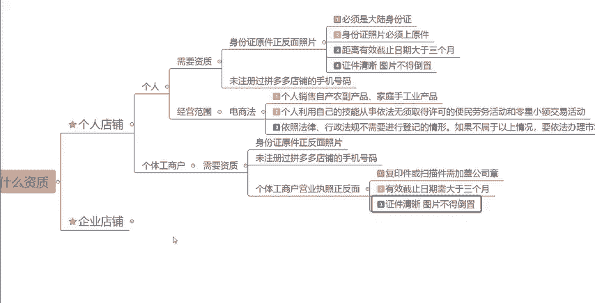

# 【拼多多运营】2024年最系统的全套拼多多运营教程，适合所有拼多多开店新手小卖家自学，10年资深运营师手把手教你从0到1起店实操。 - P3：03-店铺入驻资质要求 - 拼多多运营教程_ - BV1H62ZYREs4

hello大家好，那么今天呢我们来学习一下关于拼多多新手实操开店啊，实操运营白皮书系列课程当中第三章的一个内容。今天我们要来学习的是我们拼多多店铺开店前的一些准备的工作。

那么我如果说想要在拼多多这个平台上去开店，对不对？我需要去准备什么样的一些材料，需要哪些证明，需要哪些资质。那这些资质证明我应该向哪些部门去申请去这个出具去去办，对不对？那我们一起来看一下呃。

首先呢根据我们店铺的类型不同啊，我们可以看一下前一期的视频呢，跟大家讲过，我们拼多多的这个平台当中啊，是分为个人店铺和这个企业店铺的那如果说我们根据我们是个人店铺的话，根据我们经营的主体不同。

我们又可以分为呃个人的一个主体经营的个人店铺，或者说呃以个体工商会个体工商户为主体的一个个人店铺啊。那如果说。

是个人为主体的话，这个时候啊我们需要去提供一个这个个人的一个身份证啊，个人的一个身份证正反面的一个照片。那同时呢我们还需要一个没有注册过拼多多店铺的一个手机号码。那有了这两个东西之后呢。

我们就可以完成店铺的一个入住了。但是呢像我们的身份证呢是有一定的这个要求的。首先第一个是你必须要是试这个大陆的一个身份证。如果说你是比如说港澳台地区的一些身份证啊，或者说一些海外地区的身份证啊。

那这个是没有办法在拼多多上开这个个人店铺的啊，那同时呢我们再上传啊，一定要是原件，知道吧？身份证的照片，一定要是原件，而且你的这个身份证上面它的一个有效期啊。

要大于3个月才可以的那最后呢就是你们在这个上传图片的过程当中啊，一定图片要清晰，而且是不可以倒置的，知道吧？而关于我们的这个手机号码，有的小伙伴。

人会说了，哎，如果说我是之前开过店铺已经退店了，对吧？后面我重新退店，不想做了，那这个手机号码是不是可以重复使用呢？啊，这个是可以的啊，可以的。但是这个是官方给到的一个回答。

但是根据我们之前很多的一个开店啊，一些测试啊，就是说即使我退店成功的啊，基本上在半年之内啊，我们这个店铺啊就是如果说你是用同样的手机号码再去入驻一个店铺去操作的话，啊，是比较难的。

因为它会有就是隐形当中的一些限制啊，给你限流啊之类的等等。所以说大家还是要去注意一下这个店啊，而在经营范围方面的话，大家可能会担心的一个点，就是哎我这个店铺是以个人为主体的这个店铺，对吧？

我没有提交这个营业执照，我可不可以开店。大家可以看一下啊，根据我们就是最新的这个电商法第十条的一个规。

规定。我们第一个。个人销售自产农副产品、家庭手工业产品啊，或者是这个个人利用自己的一个技能，从事依法无需取得许可的这种便民劳务活动和零星的小额交易活动。呃。

第三个是依照法律这个行政法规不需要进行登记的情形，那如果说不属于以上三种情况呢？你就要去这个去办理营业执照了。如果说你是属于就是以上这三个点的话是不需要去办理这个营业执照的啊。

当然如果说是一些特殊的商品啊，这个是需要去这个登记的，需要去办一些资质的。比如说食品啊药品啊之类的，这个这个我们就另当别论的。好吧，那么我们接着来看一下个体工商户啊。

我们个体工商户跟个人开店有哪些区别呢？其实大体上是差不多的啊，个体工商户你开店的话，首先第一个也是。

要身份证原件的正反面照片。第二个就是也是要一个没有注册过拼多多店铺的一个手机号码。那唯一的一个区别呢就是多了一个个体工商户的营业执照。而这个营业执照呢，大家可以看一下，也是有要求的啊。

首先如果说你是原件的话，你就直接把原件的这个照片上传上去就可以了。如果说你的这个营业执照是复印件或者是扫描件的话，一定要去加盖这个公司的一个这个章啊，公司的一个章。那第二个呢就是你的这个营业执照。

它的一个有效截止时间，也是需要大于3个月的啊。然后上传的时候，你的这个证件的一个照片要清晰啊，也不能这个倒置的。好吧，那么我们在个人店铺方面啊，这些材料准备好之后，我们就可以去开对应的这个个人店铺了啊。

个人店铺开店的话，还是非常非常的简单的。

然后第二个呢，企业店铺我们来看一下。

企业店铺根据我们店铺的这个类型不同啊类型不同。那我们是需要去上传这个就是在身份证这个方面呢，我们是需要去上传两个人的。就是呃一个是企业的这个法定代表人，一个呢是我们的这个店铺的管理员管理人啊。

但是其中啊企业这个法定代表人呢，他的一个身份证啊，可以是港澳台地区的，也可以是海外地区的身份证不限于我们大陆的身份证啊。所以说这个时候就ok了。如果说是海外的一些同胞啊，对不对？想要在拼多多上开店的话。

那你是可以去开一个这样的一个企业店铺来进行操作的。但是呢我们在这个店铺的开店过程当中啊。

就是店铺管理人身份的一个身份证，它是有要求的啊，就是企业法人，你是可以用这个港澳台以及海外的一些身份证来办理。但是如果说你是店铺管理人那个身份，你就必须还是要大陆的一个身份证的啊。那其他的这些点呢。

基本上都是一样的，就不跟大家去一一的去做赘述的。我们来再看一下其他所需要的一些资质啊资质，根据我们店铺的类型不同。因为我们的企业店铺是划分为了这个旗舰店专卖店专营店跟普通店的，对不对？

根据这种店铺的类型不同啊，他们所需要的一个资质的要求也是不一样的。如果说我们是经营一个或者多个自有品牌的这样的一个旗舰店，那么你就需要什么，是需要这个企业三证的啊，质检报告，还有这个商标注册证的。

如果说你是经营一个授权品牌的这样的一个旗舰店啊，然后。

他是需要一个这个除了要以上三个这个企业三证资质报质检报告跟商品住质证，你还需要有一个这个品牌授权书，而且是需要一级的这个授权书。因为它这个授权书是分为等级的，一级、二级、三级的。

你这个是需要一级的这个授权书的，好不好？

那还有比如说这种卖场型的这个品牌旗舰店啊，呃卖场型品牌旗舰店的话，嗯这个和我们个人就没有太大的关系了。因为它的一个要求比较高，一般都是拼多多主动去邀请入驻的啊，这个跟我们中小买家，其实就没有什么关系了。

我们就不过多的去讲了。好吧，那我们再来看一下我们的这个专卖店啊，专卖店，如果说你是经营一个自由品牌的一个专卖店的话，okK那这种情况下，我们只需要去上传我们的企业三证质检报告以及商标注册证就可以了啊。

那如果说你是经营一个这个授权这个品牌的一个专卖店的话。

那你要注意啊。就是你除了要以上这三个东西，那么你还要额外去提交一个授权书，而且这个授权书等级不能超过二级，知道吧？刚刚跟大家讲过了，我们的授权书都是分为等级的。如果说你是要开这样的一个专卖店的话。

你授权书的等级不能超过二级，好吧，那么继续跟大家讲这个专营店啊，专营店。分为很多个情形啊，对吧？

比如说你是经营一个或者多个自由品牌的，或者说你是经营一个或者多个其他人的这样的一个品牌啊，那这种情况下，我们需要去提交的是什么东西呢？

一个是我们的这个企业三证啊，一个是这个质检报告啊，还有我们的商标注册证，那还有我们的一个授权书啊授权书。

那如果说因为这这是几个专营店几种不同的一个情况，就是刚刚给大家讲的啊，你需要这些东西，大家记一下，或者说截个图就可以了。好吧，那如果说我们是去开这个普通的企业店铺呢，这个时候就简单很多了啊，简单很多了。

呃，只需要一个什么呢？就是企业的三证啊，企业的三证跟你这个呃营业执照，就是你这个公司的一个开户证啊，开户许可证明就可以了。好吧，这是普通店铺的一个资质要求比较简单啊。嗯。

然后还有后面会跟继续的跟大家讲到关于我们一些不同的类目啊，它的一些资质要求，这个内容就比较多了，我们放在后面的视频，继续去跟大家去做分享。如果说大家还有什么想要了解的地方。

或者说大家在自己做店的过程当中有遇到任何的问题，大家都可以在评论区找到我啊，我们可以一起交流分享一下。

感谢大家的一个观看啊。😊。

