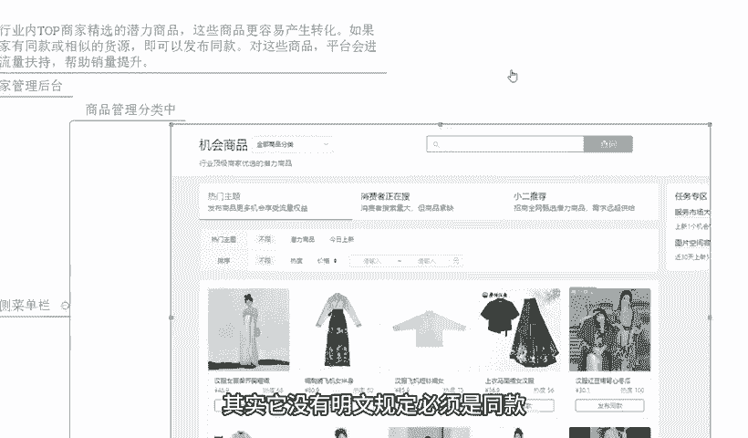

# 【拼多多运营】2024年最系统的全套拼多多运营教程，适合所有拼多多开店新手小卖家自学，10年资深运营师手把手教你从0到1起店实操。 - P41：41-拼多多新品上架技巧 - 拼多多运营教程_ - BV1H62ZYREs4

hello大家好，我是西楼。那么今天给大家分享的内容呢是我们拼多多新手开店爆款打造步骤中的新品上架技巧啊。那么产品上架呢在我们整个运营过程中都是一个非常非常重要的板块啊。因为如果说你不会上架产品。

或者在上架产品过程中的一些细节没有做到位的话，O那么可能会导致我们整个运营呢在后期面临着非常多的一些困难啊，那今天呢我会详细的为大家分享产品上架的技巧。那么建议大家呢可以认真观看啊。

当然呢在分享之前呢还是老规矩啊，先看一下近期跟着我一起实操的小伙伴，他们的店铺数据情况怎么样，好不好？O可以看一下像这个店铺呢，最早访客呢是只有几百个，对吧？那么从几百个访客跟着实操。

整个店铺数据呢也是非常快速稳定的增长啊。那么做到了访客一天呢是12000多啊，一天的订单呢是2000多单啊，转化率呢16。37，对吧？那除了这个店铺之外呢，还有像这个店铺啊也是跟着实操的。

最早呢访客是1000。

啊，2000不到啊，那么跟着实招之后呢，整个店铺数据呢也是非常稳定的增长啊。到后期呢有一个小的爆发。然后呢，一天的访客呢做到了1300。订单的话相对来说可能会少一点啊，只有1600多单一天啊。

那转化率呢12。23啊，那整个的成长过程呢还是蛮快速的，整个体数据也是非常不错的啊。但然呢除了这种有数据的有基础的店铺之外呢，还有很多这种临访客的新店啊，新手开始跟着实操的像这个店铺可以看到啊。

那也是一个纯新店啊，从最早零访跟着实操。那整个店铺的数据呢提升也是相对来说比较稳定的，而且很快速的一个爆发，对不对？做到后期呢一天访客是13000啊，那么订单的话一天是1800多单，对不对？

那转化率呢13。啊这个85啊，那这一店铺呢也都跟着实操的啊，像类似这种店铺呢还有很多啊，这里我就不一介绍了。那对于店铺运营来说呢，有很多的新手小伙伴对吧？一小白可能会觉得很困难，有很多的问题啊。

其实这个可以理解啊，那如果说你自己对店铺招到方面有问题，或者是有需要。

资料的可以找我啊，有时间的话，我也可以带着你们一起实操坐垫啊。像像这些小伙伴一样呢，我一起呢我们快速的把这个给它做起来，好不好？OK啊，闲话不多说，回到主题中来。

那首先呢我们来说一说新品上架的技巧里面的一个发布方式问题。那么发布方式呢，大多数的小伙伴呢可能在目前情况之下呢啊选择呃通过其他的呃这个发货平台，然后呢进行一个呃一键上传或者是一键搬家方式比较多，对吧？

那这种方式呢，其实我一直以来是不推荐的。为什么呢？因为在整个平台的同步数据过程中，因为平台不一样。那么某一些参数它其实考核方式不一样的啊，会导致呢我们产品的一些重要信息的一些错误或者是遗漏啊。

然后另外一点的话，一键搬家的方式呢，在平台来说，它本身就会判定你是铺货。导致我们店铺呢在基础群重考核上面呢没有得到一个很好推荐啊，所以说我们一定要是手动发布。而手动发布的话。

我们通过机会商品的入口去完成操作啊，那可能可能小伙伴会说，哎机会上面来什么东西呢？来我们来看一看官方对于机会商品的一个详细说明。一。官方是这样说的啊，那么机会商品是行业内拓商家精选的潜力商品。

这些商品更容易产生转化。如果商家有同款或相似款的货源，即可发布为同款。对这些商品平台会进行流量扶持，帮助销量提升。听懂了没有？道理很简单啊，这些产品呢就是平台希望我们去经营的产品。

你经营这些东西就是在顺应平台，对吧？平台就会给你扶持，就这么简单。那么操作入口在哪里呢？OK我们来说一说啊，操作入口呢其实比较方便的啊。那如果说我们打开商家管理后台的话啊，在我们左侧的菜单栏啊。

可以直接有看到一个叫做商品管理的分类啊。那么这个这个分类里面就会有到一个基位商品进去就可以了。点击进去之后呢，这时整个商品的界面啊或者整个渠道的一个界面呢会发生一些改变啊。我给大家截个图啊。

那么这个界面呢会怎么样子呢？来可以看到啊，这个是我们去进行机尾商品发布之后进入的一个界面。

来放这边来。那整个的这个界面呢可以看到它是会有到不同的主题的对吧？啊，有热门主题，有消费者正在收，还有小儿推荐三个主题。那么这个不同的主题呢。

我们去选择商品都是没问题的那假如说我今天经营的是一款这个汉服OK刚好是这一个呃这个齐胸的褶群，OK我可以点击发布同款。那么这里我说一下，重点说明。那平台呢是讲我们是有同款或者是相似款的货源都可以啊。

这里呢其实它没有明文规定，必须是同款。所以你不要看它发布同款的字样，写的是同款。哪怕你不是同款，只要你是这么一个产品，是这个风格的产品都可以去发布的。

那么只不过呢在发布过程中呢，可能有的时候呢，在审核方面，平台会再次审核，会导致有的时候我们打标打不上去啊，会有这种情况的。所以只要我经营的产品是这种产品的话，OK没问题，我都可以去做。

那么我们在经营商品发布的时候呢，我如何去找到这样的产品去发布，或者是我如何去发布我自己想要去发布的产品呢，OK简单啊，那么几种方式可以去做。第一个呢就是我在基本商品后面呢会有到一个全部商品分类啊。

我可以找到对应的我自己想要经营的产品的分类，点击搜索，然后呢筛选出来，去找到对应的一个相似的产品呢，去点击发布，或者是直接搜索关键词啊，我做的产品呢是这个毛巾，O我就搜毛巾。我做的产品呢是手机壳。

我就搜手机壳。我做个产品是水杯，我就搜水杯啊，搜完之后点击查询，也可以把对应的商品呢发掘出来。然后根据我们自己产品实际情况呢，选择发布通款就可以了。那进入发布同款这个界面之后啊，点击之后。

它其实就是我们正常的商品编辑页面啊，我们可以在里面呢正常的去设置好我们产品的标题属性啊SKU库存价格等等这些东西啊，还有包括我们图片，那么这就搞定呢，就只能发布了啊，所以发布方式不难。

那么大可以去尝试操作一下。那一旦完成达标，我们得到的机位商品的达标之后呢，是可以得到额外的推荐曝光的。而且如果说我们商品权重相同的情况之下，我们的商品是优先展示的，可以得到更多的曝光。好吧。

O那么这个是我们的机位商品。那再往下呢就是一个非常重要的部分呢，就是属性啊，有很多人在发布商品的时候呢，对于属性呢是会有到一些错误认知的属性呢对我们店铺里来说非常非常的重要。我们一定要去重视它。

那怎么个意思呢？来看一下。首先属性呢可以帮我们去明确用户的。

一个需求。当用户去搜索或者去找到某一个产品的时候，一定会有到他自己的一个呃想要的产品的那一个形象的，或者是他一个功能的一个需求的，对不对？

所以这个时候我们的属性填写呢如果说和我们的消费者的属性需求符合了。好，那么你就可以得到更多的访客，拿到更多订单。但是如果说不匹配。好，那么可能你就没有访客也就没有订单，对不对？换句话说呢。

我们在填写属性的时候呢，一定要去结合到用户需求。当然这个具体怎么去玩，后期我会进行分享啊，没关系。然后再一个就是我们的一个市场情况啊，那我们的属性呢会有到多种多样的，对不对？啊。

那么这些属性呢也都会有到一些属性呢是热销的，有些属性呢可能就卖的不好。那这种情况之下呢，我要尽可能啊保证我自己。编辑发布的这个产品属性，在合理情况之下，能够去做到更好的市场里面去，对不对？

让我的这个属性呢和我们的热销属性是贴合的。那么这个时候我才能够得到更多的访客拿到更多订单，说来听一点，我也可以赚更多的钱，是不是？OK再往下的话，我们来说一说我们的这个推荐机制啊，关于属性板块。

那么属性板块的话，这个地方呢，大家可以注意一下。当我们用户啊他在搜索的时候，或者首页浏览的时候，或者在内部业经查找的属候呢，其实都会涉及到千人千免的推荐。

那么如果说我们当前这一个商品属性和用户的这个需求是重叠的。是一致的。OK那么在这些对应的入口，其实我们也可以得到优先曝光的一个状态啊，或者是一个条件啊，那么这个是非常好的一个事情。

那呃再从排名方面去具体说一说我们属性的一些小的操作方式，好不好？OK首先呢属性板块呢我们去做的话可以有利于我们的筛选排序啊。筛选排序呢这个部分呢其实呃很好理解。

就是用户呢在进行产品的搜索的时候呢会用到关键词，对吧？或者是会去筛选某一些属性，而这些的话啊，它跟我们产品是匹配的情况之下呢，也都可以得到优先曝光。比如说我们的用户呢搜索的某一个关键词。

而这个关键词里面具备了某一条属性。那么这个属性呢，哪怕是我的标题里面没有的。只要我的商品属性里面有填写。OK那我仍然是可以被抓取的。当然也有情况就是用户呢他搜索的某一个关键词。

然后呢针对到筛选选项来去找到某一些属性也是有的。那么这种情况下呢，我也更符合了，对吧？就不用说了啊，那那这些情况之下，我都可以保证我产品呢能够优先曝光啊，所以呢我们需要正确的填写属性。

并且让我的属性呢能够有到更好的更大的市场覆盖人群，就像我之前讲到的关于热销的这个部分，对不对？那么什么意思呢？我们以服装举例子，对吧？那么服装常见的属性呢有很多。

包括就像我们的款式啊、材质啊、风格呀、年龄啊等等，对吧？而款式来说的话，可能线下啊比较呃这个销量多的属性呢是什么韩版哪对吧？或者是欧美啊啊或者是什么这个呃新中式啊等等这些东西啊，各种各样的都有啊。

那具体情况我们可以结合产品实际情况来啊，那我产品是什么啊，可能我写韩版，他也说得过去写这个欧美他也能看得过去，对吧？它其实没有那么固定或者没有那么明确的一个呃标准啊，去判定它，因为本身服饰实品标品嘛。

对不对？那这种情况下呢，我们可以选择到更好的市场人群的一个属性去发布我们产品啊，比如说发布到韩版对吧啊，当然这个只是举个例子啊，那么其他属性呢也都可以这样去做啊，只要是确实和我产品没有冲突的是一致的。

或者是我能够去在某种层面上来讲啊，说。通的。对吧能够去贴合的OK我都可以的啊。那再来说一说另外一个点就是可以呃这个属性呢有利于我们这个商品的这个质量分的提高啊。

那本身呢首先平台呢它是鼓励我们去更加完整准确的去进行属性填写的对吧？因为属性填写的越完整，我们商品的推荐也越精准。我们用户的一个体验也会越好。包括说我们在整个呃其他的一些考核层面上来说，对吧？

也是这样子啊，所以呢这个时候呢我们要尽可能的去完整的填写它。然后那个关于我们商品的质量分这个板块呢也是这样道理啊，它也是影响到我们产品的排名的啊，而商品的质量分呢，它对于属性填写呢也是呃有要求的对吧？

那么最后呢再一个就是我们的重要属性的扶持啊，这个就重要了啊。那么这个呢就是我们今天提到的关于我们平台上的一些热销的属性啊，那用户呢在进行这个产品属性进行搜索的时候，或者是在进行关键搜的时候。

平台呢也会识别到某一些重要属性。比如说某一些属性呢，它是平台上卖的很好的，市场的效果也很好的O那么这些属性呢就会被标记成重要属性。

那么那这个时候如果说我的重要属性是满足的是匹配的O那么在进行商品的呃这个推荐的时候呢，就会区分开进行重点的推荐或者优先展示啊。所以很多时候呢一些小的细节就很重要了啊。然后再一个就是我们的搜索。

还有推荐露出啊，这个属性填写的越完整越丰富啊，或者是越准确，也有利于我们平台的抓取跟曝光的优化啊，能够拿到更好的展展。是啊得到更好更好的一个上面数据。那么再一个点就是我们的用户精准度了，对不对？

我属性填写的越精准。我刚刚讲到过，用户呢推荐也越精准。那么这个时候呢，我们整个商面的转化也就会越高。那同时呢推对于我们这个推荐的一个曝光的话。人群的一个精准度转化的好的话，它也会放大啊。

那么整个商品的曝光啊，包括说整个产品的排名呢也会大大提高。好吧，这就是我们整个的呃商品的上架过程中的一些小的细节啊，包括说我们的发布方式，还有我们的属性板块啊，当然可能还有很多的一些其他的一些细节呢。

因为时间关系没有办法去呃分享更多啊，那如果说大家对于产品发布过程中还有什么其他的疑问，你都可以跟我交流沟通啊，对于店铺操作来说，有问题不可怕，可怕的是，你没有办法去解决这个问题。

或者是你根本就不知道的一个问题，这是最可怕。好吧，所以有店铺操作问题的，或者需要这样的，可以去找我有时间的话，我也愿意带家一起去实操做店啊，就像这些小伙伴一样呢，我们一起呢把店铺呢给它做起来，对不对？

能够有到一个更好的提升啊，这个最好的。好了，那么今天的这个视频分享的就到这个地方啊，后期呢我也会针对到我们这个新手开店曝括找到的步骤呢进行更多的分享啊，大家可以关注一下。今天的视频到这里结束。

我们下期见。各位，拜拜。这边呢给大家准备了将近100份的一个文档，可以帮他更好的了解我们拼多多运营拼多多，能够提高大家运营水平。如果大家需要的话，评论区找我领取。

