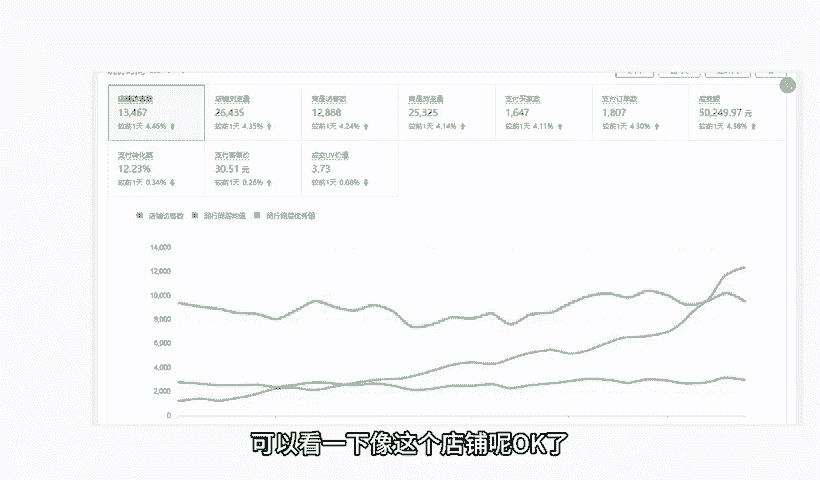
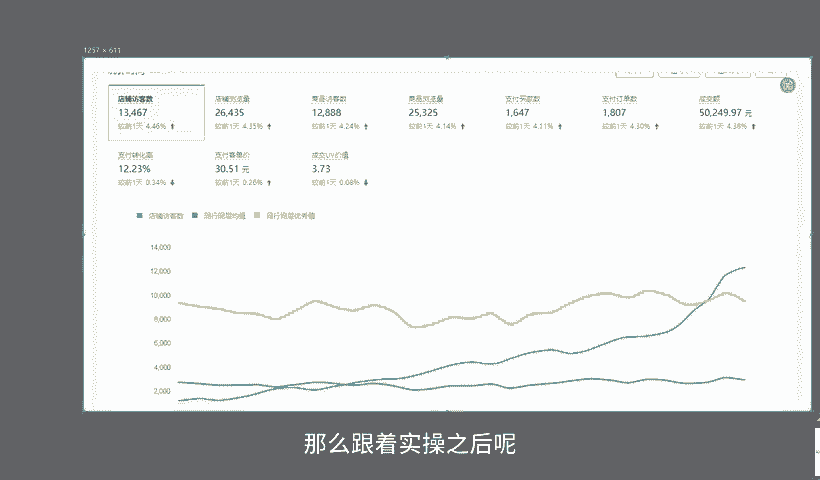
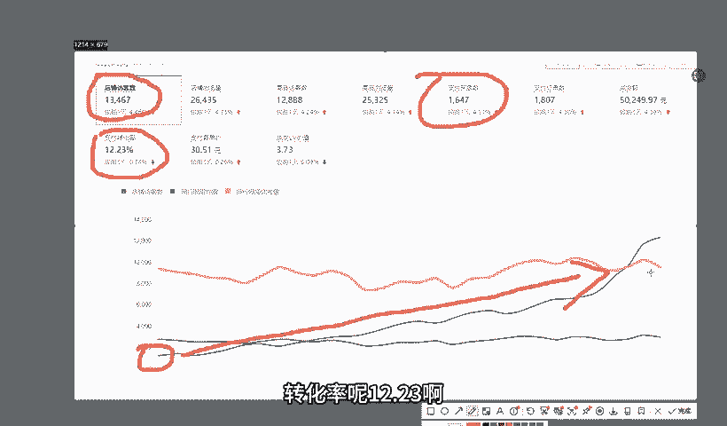
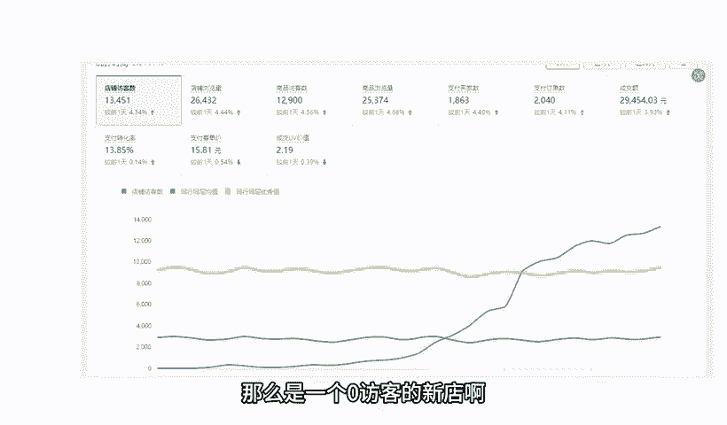
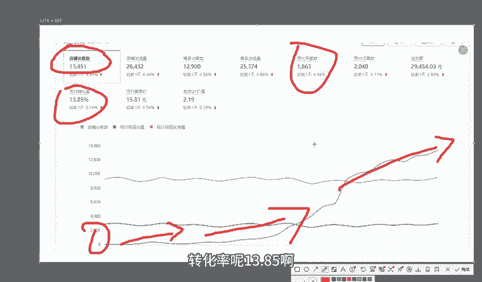
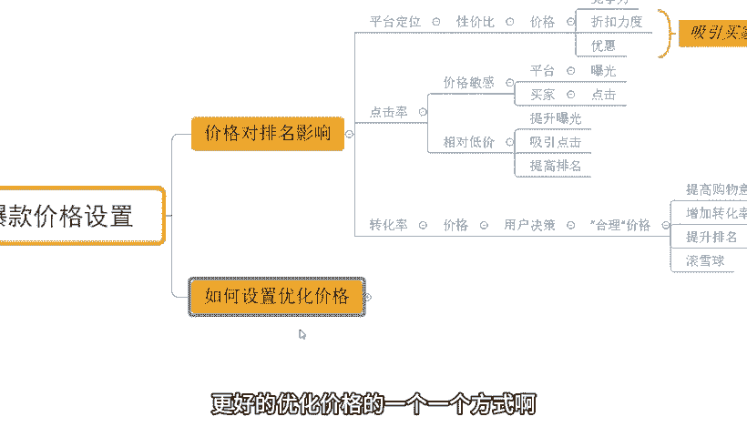
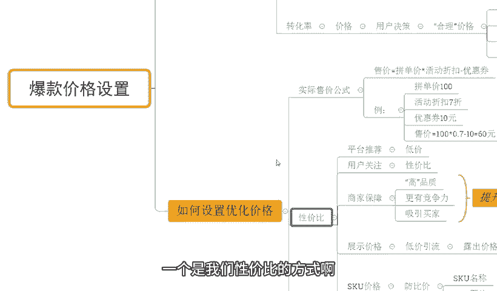
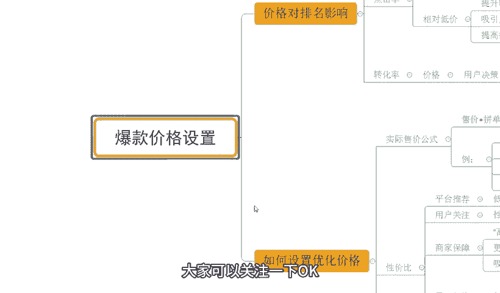

# 【拼多多运营】2024年最系统的全套拼多多运营教程，适合所有拼多多开店新手小卖家自学，10年资深运营师手把手教你从0到1起店实操。 - P42：42-拼多多爆款价格设置 - 拼多多运营教程_ - BV1H62ZYREs4

今天给大家分享的内容呢是我们拼多多新手开店爆款打造步骤中的爆款价格设置的一个问题啊。对于产品的价格设置呢，其实。新手呢可能更多的是以主观的方式去进行一个编辑啊。但是真正运营的话。

肯定是需要有到一个更加科学的方法来获取到平台更多的曝光的对吧？所以说今天呢我们就会针对这个问题呢进行详细分享。那么在分享之前呢，还是请大家先看一下。目前跟着我实尚的小伙伴，他们的店铺数据。

那么这些店铺呢也都是用到这样的方式在做我们的一个啊价格的一个策划啊，好了啊，可以看一下，像这个店铺呢，OK的。

最早呢访客只有1000多，对吧？那么跟着实操之后呢，整个店铺数据呢也是非常快速的增长，对不对？得到了一个非常快速的提升啊，到后期呢一天的访客呢做到了13400啊，一天的订单呢是1600多单啊。

转化率呢是2。23啊，那除了这个店铺之外呢，还像这个店铺啊，那么是一个零访客的新店啊，那么最早呢访客是零啊，从这个啊开始上架之前就跟着一起实操，对不对？做好产品分析之后开始上架，那么一路提升啊。

到后期呢一天也是做到了啊13400的一个访客，一天的订单呢是1800多单啊，转化率呢13。85啊，非常不错的数据啊，那么像这个店铺也是一样的，对不对？从最早呢是零访客开始实操。

那么做到了一天访客呢是6000多啊，但是这个店铺的数据呢访客数据相对来说少一点，但转化率很高啊，做到了18。13啊，那类似这种。

基本还有很多啊，这里我就不一去展示了，对不对？对于很多的这种新手小伙伴来说，店铺操作呢肯定会有到很多很多的这个困难和问题的。这个很正常。因为小白嘛啊，你可能很多东西的话，你本来就不怎么理解。

所以面对这种这个一个未知的领域的话，有问题暂常不过，对吧？那如果说店铺操作方面有问题或者有需要资料的对吧？可以找我啊，那有时间的话，我也可以带着你们一起去实操做店啊，就像这些小伙伴一样呢，我们一起啊。

把店铺给做起来，好不好？OK啊，回到主题中来。那对于我们爆款价格设置的话，首先我们要了解清楚就是价格对于排名的影响。了解清楚这个之后呢，我们才能正确认识价格的一个重要性。

才能够去更好的去设置好我们自己的价格。OK首先呢来看一下啊，那么产品的价格呢，在对于平台的定位上面是有影响的啊。那本身平台定位呢，对于我们的商家来说，他希望的是我们的商品呢。更具性价比对吧？

那么这个更具性价比呢，其实就是从我们价格方面能体现的，对不对？那我们价格上面来说啊，相对来说可能更低。那么ok那你的产品的竞争力可能就会更强啊。

那么这个呢跟我们的折扣力度跟我们的优惠的一个情况呢是息息相关的啊。那有到一个更好的更具价格竞争力的一个产品呢，那么对买家的吸引力也会更大。那么这个时候呢平台呢也会进行优先推荐，从而提高我们产品的排名。

好吧，那么再一个就是通过点击率的一个影响，对吧？那平台的商家很多，那么商品也很多，但是用户呢啊可能他在呈现出一个上升趋势过程中啊，慢慢慢慢慢的也会啊归于一个比较平稳的一个状态。

甚至是处于一个慢慢逐步下滑的一个状态。因为有很多平台就会相间抢流量的嘛，对吧？这个很正常。而拼多多平台的一个用户呢，他对于价格的敏感度是非常非常高的啊。所以这种情况之下呢。

那平台是希望呢我们有到更啊低的一个价格或者更具竞争力的价格。然后呢给我们更多曝光。而我们的这个买家来说的话，你的价格竞争力越好。那么越能够去刺激我们的消费者。

那它也能够带来更多的点击我们的点击率也会更好。那从而呢能够提高我们商品的群重。好吧，O再来一个啊再说一个就是我们的这个相对低价的概念啊，就是点击率提升的话，他在很多时候啊啊。

就是我们讲的价格竞争力也好或者怎么样的啊，它不是说一个固定的一个极致的低价，而是相对低价啊。这个概念非常重要。那么呃对于我们产品来说的话，相对低价呢，它是可以促进曝光，增加我们产品的一个这个推荐的。

对不对？也能够去吸引到更好的点击，提高我们的排名。但是如果说你去做到一些特别恶意竞争的一些极致的一个低价的话，这个时候呢也可能会导致我们产品呢被屏蔽啊，这种情况也得不偿失。所以说在做这个东西之前呢。

我们首先可以去观察一下，那我当前经营的这个品类呢，它具体平台推荐的价格都是什么样一个价格。好吧。O再往下呢，就是我们转化率了，对不对？价格嘛，这个东西很好理解。用户呢他要支付的一个金额，对吧？

那所以呢在用户的决策上来说的话，价格就显得尤为重要了，对吧？一个合理的价格，对吧？这个合理呢是指的是在我们买家心理层面上，或者他的认知里面的一个呃这个范围，对不对？那这个时候呢我们的消费者呢。

他就会有到更高的一个购物意愿。那么同时呢也会增加我们商品的转化率。当我们转化率停成之后呢，我们商品排名也可以得到增长，对吧？从而呢呈现出一个滚雪球的状态。我们整个店铺的商品呢访客也会越来越多啊。

带来更好的数据。OK那说了这么多，我相信大家对于这个价格应该会有到一个比较清晰的认知啊，对不对？那当然呢如果说不清楚，小伙伴也可以跟我交流沟通。

这个没关系的那现在呢我们就来说一说我到底应该如何去设置一个啊更好的优化价格的一个一个方式啊，O首先我们来说一下啊，那么实际售价呢，它是有计算的方式的啊。

当然这个计算方式呢我不是说我们应该设置一个什么价格或者怎么样的。而是说在针对到我们设置的价格啊，这个基础之上去进行计算啊，什么意思呢？来看一下，那么售价呢，它等于我们的拼单价乘以活动折扣，再减去优惠券。

什么意思呢？比如说今天我的商品的拼单价呢是100块钱。

那我当前呢去报名了官方活动活动呢，我去设置了一个7折啊，然后本身我店铺呢还会有到一个10块的优惠券啊。那这个时候呢，我的实际售价呢，就是100乘以0。7再减去十等于60元啊，这是我实际售价。

所以我们在操作的时候呢，一开始设置价格是我们要考虑清楚我最终的售价是多少。然后呢，我要去报活动的话，通过什么样的一个折扣力度去提报活动。然后呢，我店铺的优惠券是怎么样一个金额。

然后我再根据这个反推我自己的平单价啊，当然这个具体的最终售价多少呢？也是要去参考到我们的市场情况的啊，让我们的平台让我们的这个消费者能够去呃更好的认可我们的价格。好吧，那后整个过程中呢，我们要。

体现出性价比啊，那么性价比什么意思呢？OK简单来说就是平台推荐的价格嘛，对吧？这个价格呢就是低价的低价呢是跟我的同类型商品来说，我的价格可能会更低一点。那么这个低价呢，在设置的时候呢。

我们通常称之为低价引流。可能我某一个产品，我在对外展示的时候呢，用户看到的价格呢是10块钱。但是当这个用户点击进入我的商品之后，会发现这个10块钱呢可能它只是一个配件，或者是一个他可能在购买过程中。

在这个使用过程中用处不大啊，可或者说是这个需求不高的这么一个一个规格啊，然后呢，把我们真正意义上愿意去销售的一个规格的价格能把它放大啊，能够去有到充分的利润空间这样去操作O的啊。

那么再来说一说我们的啊用户的关注的一个点啊。那么性价比的话就是说我们的产品呢在同样的商品的质量的情况之下，我的价格更低，或者同样的价格情况之下呢，我的质量更好。

我的功能更多或者是我的福利更好或者怎么其他的东西都可以的那这些都需要我自己在设置过程中去体现出来的。这个没关系啊。那再一个呢点呢就是我们的。じあ。呃，商家它的一个保障，对不对？那我们要体现出性价比嘛。

对吧？要让我们消费者满意嘛，这个时候呢我们就需要有到一个啊高品质的一个商品啊。那么这个高品质呢是相对来的啊，它没有固定的一个标准。就像我们刚讲到的我们的性价比，其实是一个意思啊。

那这样呢我们整个产品呢才会有到一个更好的竞争力，才能更好的吸引我的买家，然后呢提升我们的平台的推荐啊。那这边呢另外一点就是我们的展示价格，刚刚也提到过了一个东西叫低价引流，对不对？就是我们的露出价格。

那么这里呢我们举个例子对不对？我产品呢本来可能卖的是100块钱啊，1000块钱。那呃我同行呢他可能有展示出去的一个价格呢是500块。那而这个时候呢，我为了让我产品呢能够有到一个更好的借流效果。

我去设置了1个400块的SKU那对外展示的SQ就是400。那么这个时候呢平台在外面看到我的商品的时候，或者是用户在外面看到过商品的时候，他会发现。对外展示的价格是400块钱。于是乎呢。

我的整体的价格优势就会从原本的劣势转换为优势啊，而整个过程的话，我们可以在一开始设置的时候呢，价格设置在一个合理范围之内，上架之后再去通过我们的这个活动方式去打折就可以的。这个没关系。

操作方式比较简单一点啊。然后最后呢，我们再来说一说SKU的价格。那么SKU的价格呢，这方面呢，在体现性价比的时候呢，我们需要去注意好，就是仿比价。那么仿比价怎么做呢？O在我们的商品的仿比价过程中呢。

平台考核的就是我们SKU的图片和我们产品的一个SQ名称。那所以我们在上传编辑商品的时候呢，我们的SKU名称一定要做到差异化跟同行做区别。同时我们图片呢也最好是能够去和同行做好一个区分。

这样才能保证我们在后期的经营过程中呢，有到更好的一个效果啊。当然这个具体操作方式，后期我会进行一分的大用召急啊。然后再一个就是我们的用户评价啊，在我们整个设置体现我们价格优势的这个过程中呢。

用户评价其实也是可以有到一个帮助的啊。当然这个帮助只是一个辅助的一个作用。那我们可以在我们的商品评价里面呢去对对应的一些我们希望成交的SKU呢进行一个初评。然后呢。

这些初评呢也可以帮助我们的一些消费者完成决策，对吧？比如说我们在购买商品的时候呢，哪。些产品的规格是呃我们希望用户成交的那我们就对应的这种规格的SQ的订单呢去做出评价。然后对应的这个评价呢。

我们做出一些引导啊啊，我们可以夸一夸输出好处什么的对？都可以的那这个时候呢也可以提高我们用户的一个满意度啊，那同时呢也可提升我们的成品的排名，对不对？所以整个的价格设置方面的话啊从多个维度去考虑啊。

一个是我们展示的方式，一个是我们性价比的方式啊，那么去做好这些东西呢，基本上问题不大啊，当然呢具体操作可能还是需要结合的产品去进行计算和一个数据分析的啊，只是这样去讲解的话。

可能对于很多的技术小伙伴来说，还是会有到很多的疑问啊，这个没关系，如果说是有这种店铺操作方面的问题呢，或者是有这个需要资料的呢，都可以找我啊。那有时间的话呢。

我也可以带着你们一起去操作店铺把店铺呢像这些小伙伴一样呢一起快速的给他做起来。

OK啊，今天呢关于我们这个爆款价格设置的一个分享呢就要这个地方。下一次呢我会分享到更多的一些关于我们拼多多新手开店爆款打造骤的一些内容啊。大家可以关注一下。OK今天的视频到这里结束，我们下次再见。各位。

拜拜。这边呢给大家准备了将近100份的一个文档，可以帮他更好的了解我们拼多多运营拼多多，能够提高大家运营水平。如果大家需要的话，评论区找我领取。

