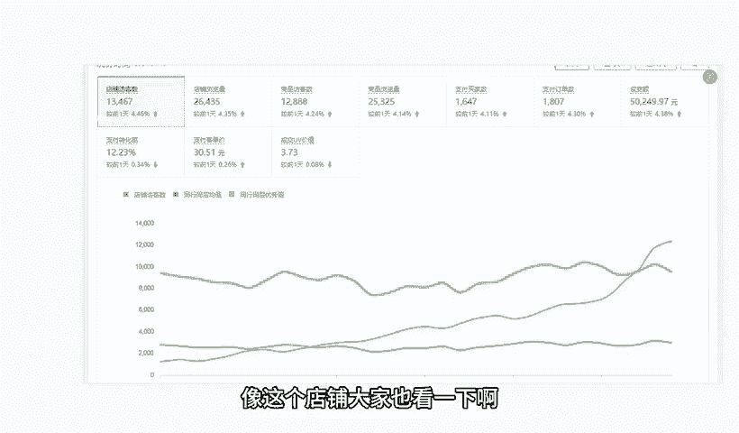

# 【拼多多运营】2024年最系统的全套拼多多运营教程，适合所有拼多多开店新手小卖家自学，10年资深运营师手把手教你从0到1起店实操。 - P43：43-拼多多爆款SKU布局 - 拼多多运营教程_ - BV1H62ZYREs4

hello，大家好，我是谢楼。那么今天给大家分享的内容呢是我们拼多多新手开店曝光打造步骤中的。爆款SQ布局的内容啊。

那么SQ呢对于我们店铺运来讲是非常非常重要的一个好的SQ布局可以帮我们产品带来更好的啊曝光，包括就可以带来更好的转化，提升我们产品的权重啊，那么今天呢我们就会针对到SQ的一个布局方式进行详细讲解啊。

当然呢在讲解之前还是先给大家看一下，跟着我一实操小伙伴他们的店铺数据好不好？像这个店铺大家也以看一下啊，最早呢跟着实操的时候呢，访客只有1000多一千出头，对不对？跟着实操之后呢。

整个店铺数据呢也是非常快速稳定的增长啊，到后期呢做到了一天访客是13000啊，那么1600多单一天啊，转化率面12。23。

那除了这个店铺之外呢，还有像这个店铺啊，也是跟着实操的，最早访客呢会相对来说少一点啊，只有几百个啊。那从最早的几百个访客呢跟着实操快速提升，对不对？整个店铺数据呢做到了后期一天访客呢12000多。

将近13000对吧？2000多单一天啊，16。37的一个转化率，对不对？那么类似这种店铺还有很多啊，包括说一些零基础的新店来的，对不对？像这个店铺可以看到啊，是从最早零访客开始跟着实操的啊。

那么呃从最早零访客开始做，对不对？跟着实操一路开始提升到后期做到一个小的爆发，也是访客呢做到了130三01天啊，那么订单的话，一天是1800单，转化率13。

85啊，那么这些店铺的转化都非常好啊，其实跟我们去做好了这个SQ布局的一个呃影响是脱不了的啊，有必然联系的那到底是怎么去玩的呢，对于我们很多的现小伙伴来说。

可能会觉得哎呀这个店铺操作上有很多的一些问题跟困难啊，觉得好麻烦啊，那这个东西也正常的对吧？如果说你有这种啊店铺操作的问题或者需要资料的，可以找我啊，有时间的话，我也可以带着你一起去实操做店啊。

就像这些小伙伴一样的，我们一起呢把店铺呢快速做起来，好吧，那么在正常的操作过程中，可能还有很多的小伙伴对于SKU到底是什么都不清楚啊，这里呢我先简单做一个扫吗。

SKU呢就是我们产品的规格选项啊。就比如说我们买衣服，它会有到不同的颜色，不同的尺码。那么这个具体的某一个颜色的某一个尺码就是1个SKU。那么这个就是我们要做的一个事情。而我们在做的时候。

SQU的设置呢却非常非常的重要。首先我们来说一说SQU的一个作用啊，那么SQU呢它是可以提高我们产品的权重和曝光的什么意思呢？OK首先第一点SQ的名称呢，它是会被系统收入的。

比如说我们的SQU里面呢有某个颜色，某一个属性，对不对？哪怕我产品的标题里面没有这个属性，没有这个颜色，那我仍然是可以被搜索的那么这样呢可以增加我们的曝光率，好吧。

那么再一个呢是可以更好的灵活应对我们市场变化啊。那我们在针对到SQ布局过程中呢，我们尽可能的去呃做好一些调整，对不对？啊，比如说我们可以根据我们的市场需求和我们的技争状况，对吧？

来设置组合我们的SQ布局。比如说我们会有到呃某某颜色的衣服，组合某某颜色的裤子，某某颜色的裤子，又组合某某颜色的裙子，对吧？啊等等类似这种套路吧啊，那么把我们的产品呢进行拆分组合。

创造出更多的新的低价SQ来，那么这样呢能够更好的提升我们商品的市场竞争力啊，带动我们整个店铺的增长啊，也是可以的。那另外一方面呢，我们也可以提高我们用户的购物体验啊。

那么可以让我们的消费者呢更加容易的去完成决策，做好选择。那么找到自己想要的产品，减少购物过程中的一些困惑，对吧？提高我们的效率啊，那么再一个呢就是可以引导我们消费者进行达成购买的一个。动作啊。

那么一个合理的SQ布局呢能够去更加容易促进转化啊，那么我们能够去更好的突出一些希望被买家购买成交的SQ的话，O那也可以达成到更好的利润的一个获取，好不好？所以SQ呢对于我们整个店面来讲很重要。

那这么重要的话，我们到底应该怎么去做。OK来看一下啊，关于我们SQ的一个布局技巧。这里呢给大家分享两个啊，一个呢叫做价值定价策略啊。那么所谓的价值定价策略呢。

其实这个东西呢是基于我们消费者对于我们产品或者是对我们服务的一个感知价格来设定的商品价格的方法。好吧，那这个东西呢是一个呃相对来说可能对于新手来讲，理解起来会比较抽象的一个东西啊啊，给大家解释一下。

那么我们的。企业或者我们作为商家，不仅仅是要根据我们成本来进行一个啊加成的一个定价，也要考虑我们用户，我们的消费者，我们的买家啊，他认为我们这个产品值得支付的价格是多少。他觉得我们产品值不值这个价啊。

换句话说，对吧？所以这个方法呢是呃认识到我们不同的消费者呢会有到不同的一个价格感知。然后呢，通过我们提供不同的规格的产品来满足不同的消费群体的一个需求和支付的意愿啊。那么这里呢我举一个例子啊。

来说明一下这个这个逻辑。比如说我们有某平台的一个手机哈，那么这个手机呢有到不同的。这个规格啊，那么这个规格呢是呃100呃12G的运存，加上256G的一个内存的一个规格。

还有16G的一个运存和512G的一个内存的一个规格，以及16G的运存和1个T的一个呃内存的一个规格哈。那么这三个不同的规格的产品呢，它都会有到不同的价格，对不对？比如说那首先第1个12G加256G的呢。

它是啊39啊3999元的一个价格哈。那么这个时候呢，消费者就会觉得哎呃那针对到这个产品的各种的属性和细节进行描述之后，哎，它的一个配置呢，大家会觉得哎好像还不错，好像值这个价，对不对啊，还不错的样子啊。

然后这个时候呢，如果他需要有到更高的运行内存的一个手机的话，他就会觉得是以这一个价格基点往上加的啊，比如说我们设置了一个4299的价格。哎，消费者就会觉得哦，这个价格很划算呢。

因为我买12G的加256G的这个时候呢就要3900将近4000块钱，对不对？但是我只需要区区的再多加个呃两三0百块钱，我就可以得到一个运行内存更大跟这个储存内存更大的一个手机啊？

那么这个时候呢用户的一个呃定位价格的锚点呢，就从我们原本的一个自己的个性化的，或者是自己的一个主观意识的一个需求，变成了一个399的一个锚点。啊，那同样的道理。

我在网之后呢去添加更多的一些这个呃不同的内存，不同的运存的些规格的话，那么也可以帮我用户选择。而在这个过程中注意。那么一般是建议大家把价格做成3到4个档位。啊，为什么这样说呢？因为最开始的展示价格呢？

这个我们可以去操作啊，也就是我们所谓的做店铺的时候的一个低价引流，它可能没有太高的利润，或者是它有利润但是不多，对不对？而整个过程中呢，我们让更高价格的规格的产品呢，在这里面呢体现出所谓的性价比。

让消费者来购买。这个时候呢，可能它的毛利率更高，也可能它的整体的支付的客单价更高，对我们店铺后期的一个增长也会有到更多帮助，对不对？那么最后的一个高价呢，他其实呃有一部分人会有需要。

但是呢绝大部分人呢他是看到我们最低价进来的，对不对？那么我们是用到最低价和最高价来反复衬托我们中间档位的一个性价比。导致我们消费者能够去快速的下决策，购买我们这个中间价格的一个产品。好吧。

所以这就是我们价值定价策略啊。然后再一个是价格指引策略。那么价格指引策略呢，它其实是呃有分解到很多的一些这个营销方式啊，包括说像我们的呃增值营销促销的一个决策啊，包括说我们的心理定价啊等等啊。

多方面来实现我们消费者做决策影响的一个方法，能够更好的帮助我们消费者完成决策来下单啊，那么还是以这个某手机来举例子，好不好？今天呢我们去商场啊看到了某个手机。

那么这个手机呢它的这个规格呢是有12G加256G的16G加512G的16G加1个T的，对不对？三种不同的规格。那其中呢100这个12G加256G的产品呢，它卖价呢是这个3999元。

那16G加512G的呢，它的卖价是4499元，对不对？然后最后呢是1个16G加1个T的，是4899元。那么。这个时候可以看到，可能这些价格差异就会比较大了，对不对？中间档会比较空啊？

但是这个时候呢我们在这样的价格体系里面去做出一些引导啊，我添加了两个有优惠属性的营销标识的SKU啊，一个叫新品会，对不对？16G加2512G，一个是16G加1个T，对吧？

那么他们的价格呢分别是4299元和4699元OK。当消费者看到我的价格之后，他会发现哦，那么这两个规格呢，它是有在做营销的对吧？有在做活动的，它的价格呢会呃有减免啊，很划算啊。跟我正常去购买的话。

有便宜很多，对不对？那么呃正常购买的情况之下的话，可能我要去买一个呃这个16G加510G的呢，我需要4499元啊。这个价格呢我看了一下啊，跟我们这个呃。心理价位的3999元呢还是呃有一点出入的。

但是呢我觉得这个配置呢也值这个价。不过这个时候我突然发现哎它有一个优惠活动。完蛋了啊，我沦陷了，对吧？就跟这个小年轻谈恋爱一样的，哎，突然一下看对眼了，对不对？啊，不行，我就无法自拔。

我就我教要他对不对？就这个感觉啊，然后呢可以帮我们更加快速的去完成这个成交决策，能够去带来更好的一个产品的销量啊。那么这就是我们爆款SQ布局的一些小技巧小方法啊，希望能够帮助大家。

当然整个方式可能讲到这个地方呢，也有很多小伙伴会存在说有不懂不理解的对吧？尤其是对于系统小白来说，对吧？本身做店呢就会有到很多的困难啊，那如果说是有这种店铺操作方面的问题，或者是需要资料的。

那么可以找我啊，有时间的话，同样的，我也愿意带着大家一起去实操做店对吧？就像我之前讲的跟这一店不一样呢，我们能够去一起呢快速把店铺做起来啊，找出一些弯路，好不好？O的啊。

今天那么关于我们这个爆款SQ布局的一个分享呢，就到这里，后期呢我也会针对到我们拼多多新手。开演的爆款打造步骤呢进行详细分享啊。那么有兴趣的小伙伴呢可以关注一下。今天的视频到这结束，我们下期再见，各位。

拜拜。

这边呢给大家准备了将近100份的一个文档，可以帮他更好的了解我们拼多多运营拼多多，能够提高大家运营水平。如果大家需要的话，评论区找我领取。

