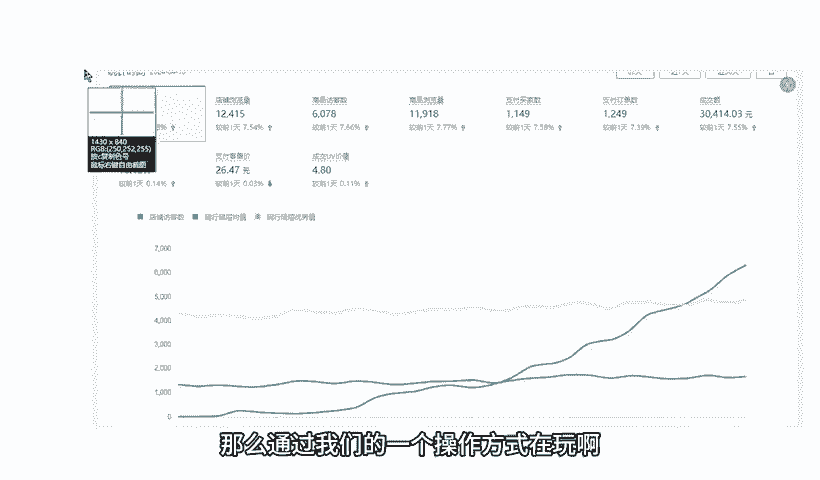
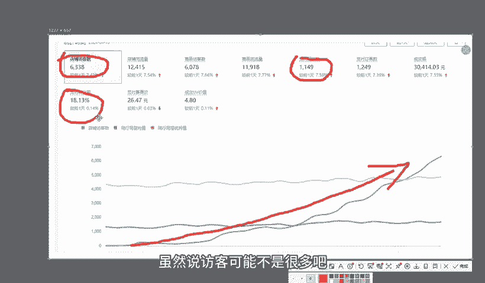
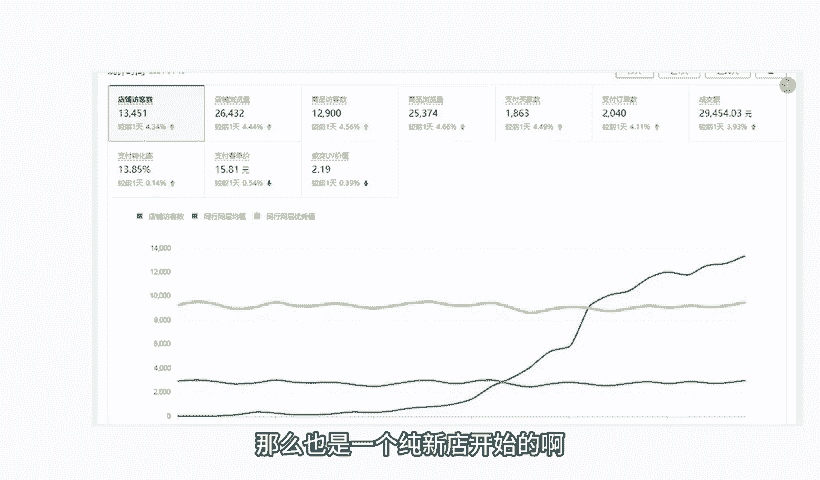
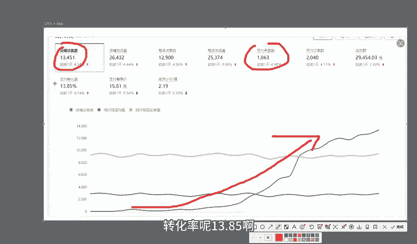
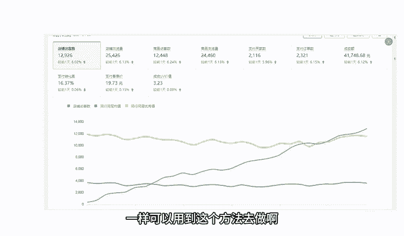
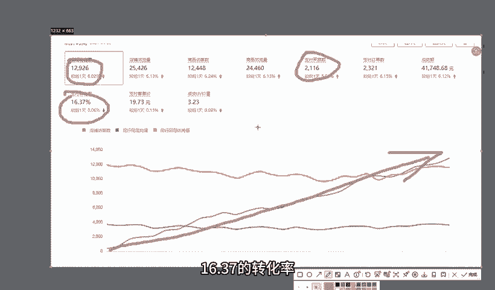
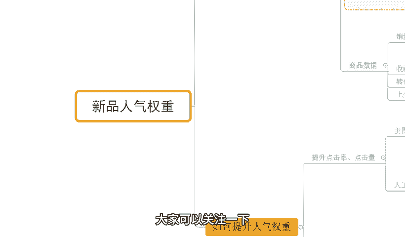

# 【拼多多运营】2024年最系统的全套拼多多运营教程，适合所有拼多多开店新手小卖家自学，10年资深运营师手把手教你从0到1起店实操。 - P44：44-拼多多新品人气权重 - 拼多多运营教程_ - BV1H62ZYREs4

hello大家好，我是谢楼。那么今天给大家分享的内容呢是我们拼多多新手开店爆款打造过骤中的新品人气权重的内容啊。那对于店铺运来讲的话，新品人气是我们前期操作的一个关键。

但是可能大多数小伙伴呢对这个逻辑是不清楚的。首先呢还是给大家看一下，跟着我实的小伙伴，我们通过这种方式操作的店铺数据好吧？可以看到像这个店铺呢是一个纯新店来的，对不对？

最早呢是零访客的一个店铺那么通过我们的一个操作方式在玩啊，那从最早的订房开始做呢，访客人呢也是快速提升，对不对？做到最后呢一天访客是6000多啊，一天订单呢是1100多单转化率呢是8。13啊。

虽然说访客可能不是很多吧，但是转化率非常高啊。那同样的还像这个店铺，那么也是一个纯新店开始的啊，那最早的访客只有多少呢？零访客对吧？也是纯新店，那从最早开始跟实销之后呢，访客也是快速增长啊。

做到后期呢一天访客是13000啊，那么整个的店。

订单呢一天是1800多单啊，转化率呢13。85啊。同样的啊，还像这种店铺啊，有基础的店铺一样可以用到这个方面去做啊。像这个店铺呢，最早呢访客是只有几百个，对不对？那跟着实操之后呢。

整个店铺呢也是非常快速的增长啊，做到了访客一天呢将近13000啊，10012000多，对不对？那么一天的订单呢是2000多单啊，16。37的转化率，好吧。

那对于整个店铺运营来讲的话，就像我讲的，可能很多小伙伴呢，对于我们平台的一些规则，一些玩法或者一些东西呢并不是很清楚。或者是对于运营过程中呢也会面临着很多很多的困难跟问题啊，这个很正常。

因为本身你自己对于一个陌生的领域有这些疑惑的话，有这些困惑的话，是一个再场不多的事情啊。那如果说是有这种店铺操作方面的问题啊，或者是需要资料的呀，可以找我啊。那有时间有机会的话。

我也可以带着你们一起实操做店啊。就像这些小伙伴一样啊，我们一起呢来把店铺呢给它做起来，好不好？OK啊，那回到这题中来。那首先呢我们了解清楚啊这个新品人气呃可以有到一个很好的一个效果之后。

我们来说一说到底什么是人际权重，对吧？OK可以看一下啊。人气权重呢，这个东西呢我们要了解它的话，就要根据我们平台的一个考核机制来了啊，这个之前呢也提到过我们排名规则嘛，对不对？我们来一起探讨一下。

那首先呢我们现在做我们产品的上架。当然我们产品上架之后呢，平台会根据我们上架的商品的信息完成系统的收入。那么收录好这个信息之后呢，又会根据这个信息呢完成基础权重的一个考核，对不对？那么这个考核呢。

如果说我们的权重比较高，就可以得到更多的推荐曝光，对吧？那么得到更多推荐曝光之后，OK这个时候呢，我们产品呢有到一个呃好的呃，产品的访客，对吧？可能会有到更多的数据啊，来进行我们的数据考核。

但是有一个问题。什么问题呢？那这个时候平台考核我们的什么？是直接考核我们的商品数据吗？嗯，考核我们的销量，考核我们的收藏，考核我们的转化率，考核我们的收量时间吗？其实不是的那如果直接这样考核的话。

明显是不公平的，为什么呢？OK我们来看一下。首先呢我们当前是一个新品的状态。我们的产品呢是没有销量的。我们的商品也是没有评价的，所以这个时候直接考核转化，考核商品数据它是不公平的。

我们没有办法在整个的商品的数据层面上和那些有数据的商品来竞争，对不对？一些老链接可能他们本身就有到很好的产品转化，有了很好的产品的销量，对不对？那你说我们一个新品怎么考核，怎么去打啊啊，不不公平，对吧？

那我们公平的竞争的话是跟同类型的差不多的一个产品来进行考核的。而这个考核阶段考核的什么？考核的是我们的曝光点击反馈。什么是曝光链接反馈呢？就是我们整个产品进行曝光之后的点击率和点击量啊。

那么这里呢同等的点击量的情况之下，点击率越高，群重越高。同样的同等的点击率的情况之下，点击量越高，权重越高。那么我们在整个过程中的话啊，就需要我们能够去有到更好的曝光的承接能力。那在这个基础之上呢。

后续才会去考核我们的商品数据，对吧？那么进行我们的销量考核，收藏考核转化考核和生产时间考核。那么其中呢，商品的销量呢又分为很多的一些具体数据，对吧？包括像我们的单量，销售额客单价由于价值等等啊。

这些东西才会在后期完成考核。那么考核之后呢，我们确实有到一个不错的反馈。那么整个数据呢也会不断的被放大，我们的推荐权重也会不断的增加，带来更好的成品曝光。那讲到这里，可能肖萌会说哎，哎呀，这个。

听着好像是这么个逻辑，那到底怎么去提高我们的人体权重呢？来一起看一下啊，其实呢操作也没有大家想象的那么的复杂啊。当我们了解清楚这一个逻辑之后呢，其实我们就可以明白，我们想要去提升我们的商品人际权重。

重点就是提升我们产品的点击率和点击量。对吧那怎么提升？两种方式。第一种方式呢是做好我们的主图策划。另外一种方式呢，我们可以人工操作。那主织策划这个东西呢，其实之前有提到过关于我们这个图片的一个策划方式。

对不对？那我们可以把我们图片呢做的更好的差异化，让我们图片呢更加显眼，从而呢让我们图片呢更具吸引力。那么这个时候当我们图片在同类音视面进行展示的时候呢，我们就可以得到更好的点击效果，带来更高的点击率。

同等曝光情况之下，我的点击率啊同等。曝光啊。点击率啊越高，那我的访客也就越多。自然而然，平台有判定用户喜爱度。啊，用户喜爱度啊越高。那么整个的产品的权重也会越高啊，就这么简单。

那这个东西呢就需要我们去做好我们的视觉策划啊。这个具体策划方式呢之前有提到过，我这里我就不去详细讲解了。那我们重点来说一说人工操作的方式。那么人工操作方式呢，我们围绕着点击量和点击率两个方面来展开啊。

那举个例子给大家说明一下，今天呢我们产品呢是呃这么一个状态啊，我们去发布了啊，我们其中一个产品呢可以有到100的点击啊，另外一个产品呢会有到150个点击。那同样的产品，同样的曝光情况之下呢。

那肯定是150个点击的这个产品呢会啊更优秀，对吧？这个是没有问题的那如果说今天我的产品发布的时候也是100个点击。或者我们的点级数据可能会更少，对吧？这个东西我们就不去纠结它。

我们主要是看这个数据的分析方法啊。那我今天产品一开始发布的时候呢，我只拿到了100个点击。OK那怎么办呢？好，我现在呢就可以去通过人工的方式去做50个啊，那原本100呢就变成了150个。那么这个时候呢。

同样的针对到我们商品的数据呢也会发生改变，对不对？平台的考核逻辑呢就开始生效了啊，那刚刚我们提到过的点击量越高，人气更高，也更受买家喜爱，后期的推荐权重也会更多，对吧？

就以我们最开始说的这个100个点击来举例子。那如果说我们的点击率是1%。点击了100个，对吧？那我们的曝光量呢就是1万个，对不对？而我们去做了50个点击之后呢，好，我的点击率其实是变成了1。49。

我的点击量呢变成了150，对吧？我的曝光量呢变成了。1050。那么这个时候在点击率在点击量两个层面上来讲的话，我都会比我原本更优秀啊，这是跟我自身对比的。所以这种情况之下呢。

我整个商品的推荐权重会比原来更高。而把这个数据作为一个对比对比到我的同行也是一个道理的。当我们的商品都发布的时候，我们商品都没有曝光，我们商品都没有点击，我们商品都没有点击量。但是我有好。

你在同类商品里面就会被判定，用户喜爱度更高，得到更多推荐，就这么简单。而这具体的操作数据的话，这里我也说一下啊。不同的类目，不同的产品数据是不同的。所以你们不用说呃说哎这个戏楼我到底应该去怎么做做多少。

这个没有固定的啊，你可以根据自己的实际情况来，在我能够去更好的或者是能够去呃正常的去把控我们商品的后续数据的情况之下，对吧？我们能够维护好我产品的转化收藏的这个情况之下呢，我可以尽可能的做的多一点啊。

而整个操作呢，我是建议做降序的一个操作。前期呢比如说第一天我做150，第二天我做100，第三天我做50。那么整个这个数据呢是呈一个下降的趋势，对不对？但是呢慢慢到最后呢会归于我所有数据的真实数据。

只不过我通过前面几天时间呢来养了我的一个推荐权重。仅此而已。那么这个时候呢，我的整体的转化方面呢也会越来越好啊，那么整个店铺数据呢也会越来越啊这个漂亮，对不对？那整个权重也会越来越高啊。

那么O这就是我们商品的人气权重的一个分享啊。当然到这里可能也有很多小伙伴，尤其是新的小伙伴可能说呃不好理解，或者是不知道具体的操作方式，这个没关系。如果说是有什么不清楚的。

包括说什么店店铺操作方面的一些问题啊，或者需要资料的呀，都可以找我好吧，当然呢有时间的话，那我也可以带着你们一起坐店啊，就像这些小伙伴一样呢，我们一起呢把店铺快速给做起来，对不对啊。

像这些店铺呢也是用这个方法在做的啊，前期呢都是通过一个降学的方式，看到没有？把我们产品的人气养起来的O啊那么今天呢关于我们这个新品人气分享到这里对吧？

后期呢我也会针到我们更多的产品的新品打造爆款的步骤呢进行分享啊，大家可以关注一下，那么今天视频等结束，我们下次见各位拜拜。这边呢给大家准备了这100份的一个文档。

可以帮他更好的了解我们拼多多运营拼多多能够提高大家运营水平。如果大家需要的话，评论区找。

去。