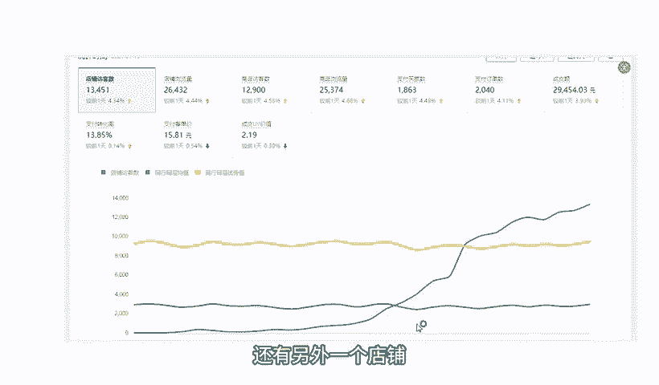
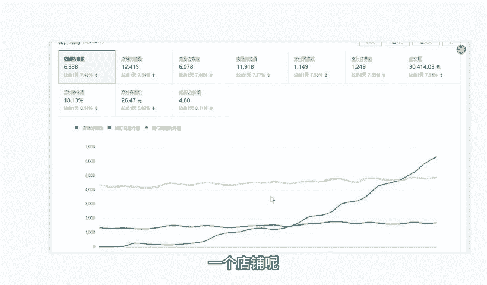
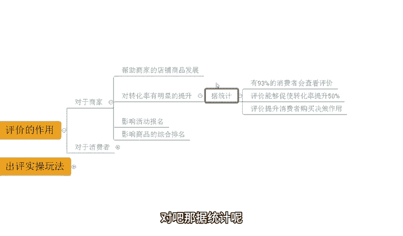
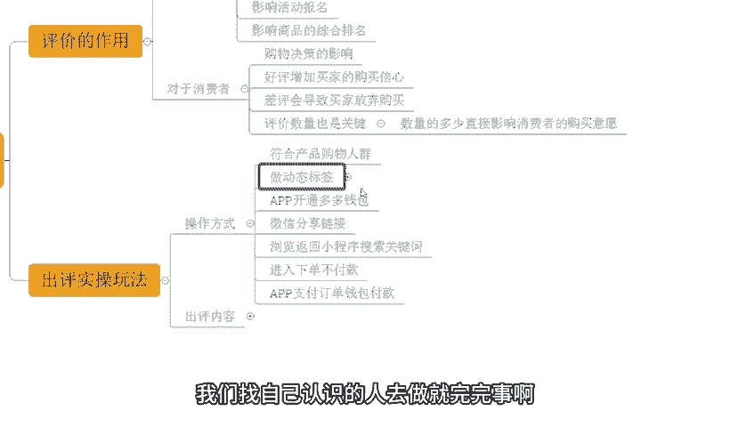

# 【拼多多运营】2024年最系统的全套拼多多运营教程，适合所有拼多多开店新手小卖家自学，10年资深运营师手把手教你从0到1起店实操。 - P46：46-新品基础评价 - 拼多多运营教程_ - BV1H62ZYREs4

今天给大家分享的内容呢是我们拼多多新手开店爆款打造销售步骤中的新品的技术评价啊。那首先呢还是给大家看一下，近期跟着一起实操小伙伴他们的店铺数据，好吧，那像这个店铺那是一个从零开始的新店啊。

那最早呢是零访客的跟着实操。那整体的数据呢也是非常快速提升，到后期的一个小爆发之后呢，做到了一天访客呢是1300啊，那么一天的订单呢是1800多单，对不对？转化率呢13。85啊，那除了这个店铺之外呢。

还有另外一个店铺，像这个店铺啊，那么整体的访客呢也是从零开始喜报的一个新店来的，对不对？从最早的零访客呢也是快速提升，做到了一天呢访客是6000多啊，那么访客的一个数据呢可能没有刚刚这个店铺呢好啊。

但是呢整体的订单呢一天是做了1100多单转化率呢做到了18。13啊，为更高的转化啊。当呢除了这组。

纯新店起报之外呢，还会有到一些这种有数据的一个店铺呢，也会有这样一个一个数据啊。像这个店铺可以看到啊，最早呢访客是有个几百个的，对不对？

那么也是跟实超那整体的数据呢可以说是非常稳定的快速的一个增长过程啊，做到了一天访客12000多将近13000，对吧？店铺的订单呢是2000多单一天做到了啊，那么一天的这个转化率的话，16。37，对不对？

那数据呢是非常不错的，类似这种店铺呢还有很多啊，这里我就不一展示了，对于我们整个店铺运营来说的话，其实有非常非常多的一些新手小白对吧？肯定会遇到非常多的困难，这个其实很正常。因为本身你自己不懂。

你自己就是一个新手，对不对？所以说有问题呢很正常的。这个大家不用去啊太过的担心。

当然了啊有这种店铺操的问题啊，或者是。或者是有需要这一个资料啊，对吧？都可以找我啊，那有时间的话也可以带着大家一起去实操做店，对不对？就像这些小伙伴一样呢，我们一起呢把店铺呢快速做起来，对吧？

那对于我们店铺操作来说的话，基础的评价呢是一个非常非常重要的板块，到底评价有什么作用啊，这里我们首先来观察一下，我们来聊一聊，对吧？那对于我们店铺评价来说呢。

他对于我们的商家对于我们消费者其实有到不同的意义啊，首先呢对于我们的商家，对吧？它第一个点呢是可以帮助我们商家店铺呢有到更好的商品发展，对不对？

毕竟的话我们的商品的评价呢可以有利于我们商品的评分和店铺评分的提升，并且呢对于我们呃这个评价内容的一个露出的话，也可以帮助我们的消费者的提高我们的信任度带来更好的转化。

包括说评价呢也是我们作为消费者来判。

我们这个商家他商品的这个品质的一个重要途径，对不对？可以帮助我们更好的做决策啊。那除了这地方之外呢，还会有到就是说对我们转化的提升。这个地方呢也提到过，对不对？我们的这个用户呢。

他大多数呢实际上是去会去这个参考评价内容的对吧？那据统计呢是有到93%的消费者啊都会去查看评价。

那评价呢它是能够去提升到50%以上的转化率的啊。那么比如说现在呢我转化率是3%，那评价的一个评影响，可能就会影响到其中1。5%的转化啊，如果说我的转化率现在是10%，那么评价可能影响到其中5%的转化啊。

那么这个都是评价带来的作用，而评价呢是可以帮我们消费者的去达成一个购买决策这么一个作用的啊。那除了这个地方之外呢，评价还会影响到我们商家对于活动的提报。因为本身评价呢。

它也是计算到我们商品评分跟店铺评分的对吧？那我们报名活动的时候呢，就会考核到我们的评分内容。如果说我的评分过低。那么这个时候抱歉。

你是没有办法去正常提报活动的那除非呢你的评分呢是达标的这个时候你才有资格去报名活动。

那除了之外呢，还会有一点就是评分呢，它也会影响到我们的商品的综合排序。因为在我们产品的综合排名里面，就有到我们商品评价的考核项，对吧？那如果说你的商品评价确实很拉垮，对吧？确实评分很低，那么抱歉呢。

这个时候呢，当我们其他的所有的数据考核都相同的时候，哪怕就只是仅仅因为你的商品的评价，商品的评分偏低一点点。那么也会导致你的商品排名更加靠后啊，那么其他的产品呢也会优先展示，这个时候呢是不利的啊。

那除了之外呢，还有就是说那对于我们消费者呢评价呢也会有到不同的意义啊。首先呢刚刚提到过了，对不对？评价呢会影响到我们消费者作为决策啊，会这么一个影响，对不对？那么呃同时呢有到更多的好评的话。

可以帮助我们的买家呢提升他的一个。

购物信心。但是如果说有差评呢，也有可能导致我们的买家呢放弃购买，所以评价的好坏很重要，而且评价的数量也很关键啊。那么有多关键呢来看一下。

数量多少会直接影响到我们买家的购物意愿。如果说今天我们的商品是一个新品，评价就只有寥寥无几的两三个，对吧？那么这个时候作为消费者同样的产品，别人的评价几万几十万。

甚至是啊大几百万OK那么这个时候你会选择购买哪一个呢？对不对？毋庸置疑，那我们肯定会多选择去这个啊评价更多产品的吧。尤其是如果说评价少，你还有差评，你的差评率还高。那么这种情况之下呢。

往往啊作为消费者的话，我是不敢在你店铺购买的。因为我担心我购买你的商品，也会带来非常多的一些其他的呃这个不良的反馈，或者是给到我不好的购物体验。啊，所以我是不愿意购买的对吧？

那到底应该怎么去提升我们的出屏，到底应该怎么去提升我们的评分，这也是非常关键的一个点啊，那么怎么去玩呢来呃，首先第一个那么这一个方式的话是我一直以来强调大家可以去操作的一个方式。

但是他呢出评率其实是没有一些所谓的呃技术流操作去出屏率高的，但是呢他胜在什么呢？能够去拉伸我们的标签，能够胜在拉伸我们。

整体的呃客单价和坑产啊能够有到更高效的这个订单的一个效率啊。那如果说我们通过其他一些方式没有标签权重的话，那你可能做一个十单100单，还不如这个做一单的一个一个一个数据效果啊，有的是候这样子的啊。

但是啊这个出屏确实没有一些所谓的技术流要多，或者是一些黑科技要多啊。这个实话实说。当然了，后期呢我也会给大家分享关于如何用到一些黑玩法去做触屏的一个操作方式啊，这大家不用着急。

那么首先我们来说说操作方式啊，那对于操作方式来说呢，第一步呢，我首先得找到符合我产品的购物人群。那么这个呢你可以找你的七大姑八大姨，对不对？你的这个亲朋好友都没问题的。

只要他是符合我们产品的购物人群的就可以的。哪怕他是不符合的，没关系，那我们也可以先去完成一个动态标签的操作啊，这个呢我们找自己认识的人去做有完完事啊，那么这个动态标签怎么去做呢？

OK我们直接让这些人呢去做一些啊关键词的搜索啊，相似商品或者是一些啊这个同类型的爆款的浏览啊，直到呢首页出现这种对应产品的推送就可以了。

那么操作完成之后呢，下一步我们直接进入到APP的多多钱包里面去开通它，开通多多钱包功能，然后啊再通过我们的微信分享链接啊，那么在小程序里面。进行一个搜索浏览啊，那么完成下单不付款，或者说什么呢？

去到我们的多多果园，完成搜索下单不付款啊，再回到我们的APP里面啊，进行一个支付订单的啊这个钱包支付啊，完成这个动作之后呢，ok整个订单后续呢，我们正常的去发货，正常的去走物流，正常的去签收就可以了啊。

那么签收之后呢，再去做出评。而这个初评注意一定要分清楚我们的比例，不要说所有的订单你全部去做晒图评价，这个也太假了，对不对？那么呃70%的文字评价，30%的这个啊图片的一个评价啊，这就可以了啊。

如果说你能够真的去把所有评价都做出来，那真的是太厉害了，对不对？那所以这个情况的话。

那我们去呃有到一个合理的心态啊。

那评价的内容到底应该怎么去做？首先呢呃我们整个的评价的话，就像我刚讲到的啊，评价呢我们需要拉伸我们的呃出评的一个周期来呃这个拉伸我们的出评率，对吧？比如说今天我们整个订单呢是有做到实单。

那三天之后呢签收，那么其中呢我就找到两三个人去完成评价就可以了。其中呢可能呃有到两个人是做文字评价。一个人做图文评价，对吧？那后面呢再把周期拉长之后呢，再把其他的人安排出来做这个事情，而整个的内容的话。

我说一下文字评价端口的话，一定是要用到关键词加上卖点的方式来进行评价。

那关键词是什么呢？就是我产品的搜索词。比如说我产品做的是一款水杯，OK我就直接说哎这款水杯怎么怎么样，对吧？那么如果说我做这件衣服，哎，我做这件连衣裙好，那么这一件连衣裙怎么怎么样啊。

我做的是一个雪纺连衣裙，这一件雪纺连衣裙怎么怎么样。各位，这一点大家应该能清楚，对不对？那用到这个方式的操作呢是为了去增加我们关键词候我们产品的一个相关性。啊，他也可以提升权重的那同时呢。

在整个评价内容中呢，我们加入到卖人描述一个评价。围绕一个主题去写出我们产品的卖点就可以了。比如说我讲哎这个衣服还不错，对吧？质量挺好的啊，那么哪里质量好呢？哎，整个的面料呢比较结实。而且呢不会掉色对吧？

这个不会这一个脱色，哎，我觉得还不错。啊，简单几句话就可以了。文字不要太多最近呢是有到这样的一个规律啊，就是初评文字超过30个字很难出屏的啊，尽可能的压缩压缩再压缩。

把评价内容呢压缩在15个字左左右就可以了啊。然后呢，整个的图文比例的话，就像刚刚讲到的70%的订单投这个出评呢做文字评价30%的做这个图片图文啊就可以的。那么呃这就是我们整个的新品的技术评价的一个部分。

而基础评价的一个投放的话，一个展示的话是可以帮我们去拉伸我们产品权重可以帮我们去出进转化的，这是一个非常重要的点啊。

那整个的呃新品的操作的话，其实还有很多很多的细节跟内容啊。这个呢我在后期呢会为大家详细讲解。那么呃今天关于这个新品技术评价的内容呢，就到这个地方，对不对？那如果说对于很多的新的小伙伴来说。

可能会觉得店铺操作很困难对吧，有很多的疑问，这个没问题的啊，有问题呢啊或者是需要资料呢可以找我啊，有时间的话，我也可以带着你们一起去实操做店啊，就像这些小伙伴一样呢，我们一起呢把店铺操作起来，对不对？

那对于整个的呃其他的内容的话，后续呢进行详细分享啊，这边的话大家可以关注一下啊，那么今天的视频到这结束，我们下次见，各位拜拜。

这边呢给他家准备了将近100份的一个文档，可以帮他更好的了解我们拼多多运营拼多多，能够提高大家运营水平。如果大家需要的话，评论区找我领取。

