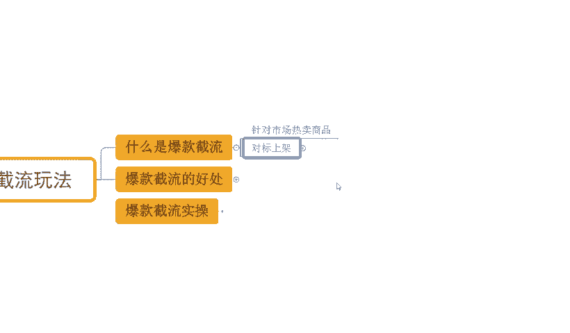
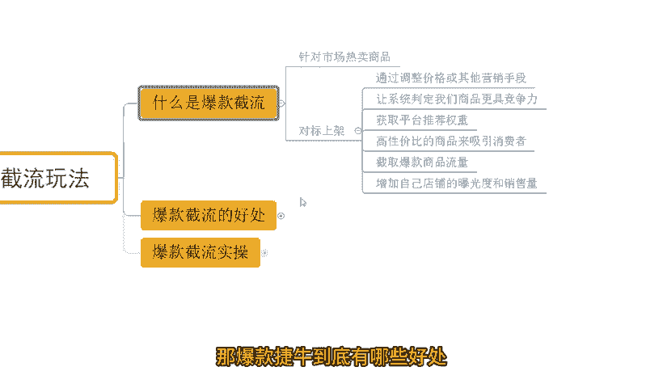

# 【拼多多运营】2024年最系统的全套拼多多运营教程，适合所有拼多多开店新手小卖家自学，10年资深运营师手把手教你从0到1起店实操。 - P47：47-爆款截流玩法 - 拼多多运营教程_ - BV1H62ZYREs4

hello，大家好，我是西楼。那么今天给大家分享的内容呢是我们拼多多新手开店爆款打造实操步骤中的爆款截流玩法啊。对于店铺运营来说的话，其实有很多种操作方式都可以非常快速的提升我们店铺数据啊。

而爆款节定玩法呢是一个非常高效的打造爆款的方式。那么今天呢会为大家详细讲解。当然呢在讲解之前呢，老规矩还是看一看近期跟着一起实操作进的小伙伴，他们的店铺数据好吧。

来可以看到像这个店铺呢最早是一个新店来对不对？从女访客开始跟实操，那么整个店铺数据呢也是非常快速增长啊，到后期呢一天的访客呢做到了13000多对吧？店铺订单呢是1800多单啊，转化率呢13。85啊。

同样呢还有这个店铺也是一个零访客的新店，最早呢是零访客看到没有？那么从零开始跟着实操。那么访客一路增长后期呢一天访客呢做到了6000多，对吧？那么订单的话一天是1100多单转化率呢18。13啊。

当然呢除了这种临访客的新店之呢，有访客的一些店铺呢一样的，适用到这个方法可以看到像这个店铺呢最早呢访客只有几百个。

那么跟着实操之后呢，整个店铺数据非常快速，而且稳定的增长啊，那么做到了将近13啊12000多，对不对？那么店铺定单呢是2100多单，转化率16。37啊，那么这些店铺都是跟着实操的，对不对？

像对于很多的信售小伙伴而言，对吧？哎，本身的话自己不懂运营，没有操作经验，可能对于店铺运营的时会觉得很困难啊，也会有到很多很多的一些麻烦。那如果说是有这种店铺操作问题啊，或者是有需要资料的呀。

可以找我好吧，那有时间的话，我也可以带着一起实操做店啊，就这些小伙伴一样呢，一起呢快速的让店铺呢有到更好的提升。好吧，OK啊，回到主题中来，那么既然说我们今天分享的内容呢是爆款节流玩法。

那么到底什么是爆款节流呢？来一起看一下。

其实所谓的这个爆款截流呢，就是针对到我们市场中的一些。

热卖商品啊，然后呢进行对标的上架。那么这个时候上架之后呢，我们这个产品呢本身是经过市场验证的。所以它的市场的体量或者需求来说的话。

一定不会太差，对不对？然后呢，上架之后，我们再通过调整价格呀，或者通过一些其他的运营手段让。让系统判定啊我们的产品更具竞争力，从而获取到我们平台的推荐权重。那么这个时候呢高性价比呢。

这个产品的一个状态呢，就可以吸引来更多的消费者完成对我们爆款商品的截流。那么爆款商品的订单，还有它的访客流失到我们店铺之后，那么它的数据会不断的减少。而我们的数据会不断的放大，形成一个拉采的过程啊。

那我们整个店铺呢，它的曝光啊，还有它的销量呢都会得到一个很好的提升。那么这么就是我们的这个爆款截流的一个操作方式跟思路啊。那爆款截流到底有哪些好处，我们来看一看。首先爆款截流呢。

它的一个起款的这个时间短啊。

那么呃整个的时间周期的话，其实一般情况下的话，一个星期左右啊都没什么太大毛病的。毕竟的话它是直接针对爆款去做的那另外一点呢，它可以减少我们的市索成本，对吧？如果说我自己去做一个产品，那这个产品好不好卖。

我不知道。但是如果说是一个爆款商品的话，那它一定是好卖的。所以我们的运营成本来说，市索成本来说要低很多的，对不对？而还有一方面呢，就是我们的整个转化会比较高。因为本身呢作为这种产品呢，它市场的需求稳定。

而且高的话。不会有太说太低的就转化的。而我们的呃价格方面呢又比较有竞争力。那么这个时候呢转化往往来说会比较高一点，好吧。那么说到这里呢，究竟我们应该怎么去做这个爆款金流，对吧？

这个才是比较关键的一个点啊，对不对？虽然说我们听了很多了，哎，我也知道了这个爆款金流到底是什么。

你知道它的好处了，那怎么做呢？OK来看一下。😊，首先呢三个步骤啊，第一个步骤呢是去确认好我们的爆款链接。

那么这个爆款链接呢，我们就可以找到我们自己啊想要经营的这个品类的一些平台爆款啊。但是呢，在确认的时候呢，我们还要去注意一个事情什么呢？好评占比高的，而且差评少的这种啊，你找这种。如果说这个产品呢。

它本来就没卖几个，对吧？差评一大堆你去做。哪怕你找了这个供应商还不错，但是你难免可能说也会有到一些问题。那么因为我们的这个客户啊，他给到一些差评，的有的时候。你真的很难解释啊真的很难解释啊。

所以这个点的话，大家注意一下。那当然了，如果说你确认过产品确实没问题，那么也可以啊，正常去经营都是OK的，对不对？但是呢一般来讲的话啊，建议呢去找到一些。好评占比高，产品少的产品啊去做啊。

那么这是第一步。第二步呢，我们需要去干嘛呢？我们需要确认好我们的大盘走势。

什么叫大盘走势呢？OK假如说今天你想要去新开店铺，或者你要去做一个产品的话，OK我不管你什么样的情况吧啊，那么我们都要去选择一些这个整体趋势向上的啊这样的一个体类或者单品。比如说那么夏天快来了，对不对？

你非得去做棉衣。

那么这种情况呢，毋庸置疑肯定大盘趋势是往下走的，对不对？那如果说夏天快来了，对吧？那我现在去做下装，那后期整体的上品趋势呢一定是向上的那么这个才对的啊，那我们在选择爆款情节的时候呢。

也要去这样子思路去构思，对吧？不要去说找到一些大盘下降的产品去做呃，做下之后呢，发现也没卖几单卖不动了啊，也市场量掉了啊，那就没意义了，对不对？所以这是第二点。

然后第三个点呢，OK我们确认好产品，确认好大盘都没问题的话，我们就可以发布同款链接了。那发布的时候呢，有很多的地方呢需要我们注意。首先第一个点，我们一定是通过机会商品的入口去发布的啊。

那么在发布过程中的话，产品的主图SKU的图片SQU的名称，那么可以一比1的去复制我们这个同行的。

那么复制完同行之后呢，最终呢我们在呃做这个价格的时候呢，我们要做同行的一个爆款的低价啊，要比它低一点。那么同时呢我们再去做一套比我们正常同行的价格高一的一套SKU那么我的链接里面呢就有两套SKU。

一套是低的，一套是高的啊。那么低的这一套呢，如果说我们是有亏损的OK那我们设置库存，如果是有的赚的那不用管它直接正常卖啊就可以了。那。如果是这种呃第一套低价SQ呢，它是亏损的状态的话。

O那我们设到亏存之后呢，比如说一天十单，第二天二0单第三天三0单啊类这种方式让我们去强调同行的订单能够维持我自己商品转化啊，能够去快速的带动我店铺访客提升也是可以的对吧？那么整个的过程中的话。

会有到一些小的细节或者争议吧啊，有很多人会说哎我做店嘛，对吧？我的我不可能说是为了亏钱的，我肯定要赚钱的嘛，对不对？那我这个时候去做这个低价，我亏钱怎么办？对吧？其实呢这个东西到底很简单。

首先第一个点呢有个东西叫做规模经济啊，那如果说一开始我们的发货量只有一单一天或者没有单子，那我去找我的上家发货的话，那肯定会给到我一个价格比较高的，而且是零售价的，对不对？但如果说今天我的单量比较多了。

我一天发个100单，一天发200单啊，这个时候呢可能我的上家就会跟我讲哎。

兄弟，哎，你这个档表多不错呢？啊，那我我给你一个相对比较低的价格，对不对？给到你一个这个呃发货价的一个一个价格啊，那么你的成本会降低，这个时候呢你可能会有利润了，对吧？当然这个点的话。

我们可以在一开始跟供应商达成合作的时候呢，就去沟通好，对不对？但然如果说我们这是厂家的话，那就更容易了，对吧？当我的产能增加了之后，我整个商品的生产成本也会降低的啊，这是必然的。所以这个时候呢。

利润空间就会放大啊。然后另外一点的话就是同款不同制。有的东西啊，你看的图片是一样的，但是图片一样，不代表产品的材质一样，工艺一样，对不对？那么有的时候呢，我们也能找到一些呃比较便宜的产品啊。

那么这个时候呢，我们可以用这种产品来。替代啊来保证我们的利润空间。那么还有一个套路呢，就是说哎我们用替换产品的方式。什么替换产品呢？我发布上面的时候呢，我是用同行的这个信息发布的，对不对？

发布一模一样的。但是我正常的在经营过程中的话，我会在我的。SQU或者是我会在我的上命详情里面注明啊，我会有到新款跟旧款、升级款跟老版本啊两种版本。那么。如果说用户下单呢，他看到的图片呢。

那么这个时候呢他就是老款，对不对？我发货呢，我发的是我自己的一个成本比较低的一个产品。那么它是另外一个产品。只不过呢可能款式功能差不多接近一点啊。那这个时候呢，用这个方式来替换掉产品。

那用户下单之后告诉他，哎，我们发的是新款啊，那么其实也是我们这个呃同款不同制的一个逻辑，一个变通的方式啊，那用了这种方式呢，我们整个商品呢就可以去很好的操作我们的报款截流。

也不至于说担心我们的一个利润方面受到损失。那这种方式呢操作起来的话。

同样的订单逐渐减少，我们订单不断的增加。那么自而然整个店铺数量就可以到快速提升。好不好？O啊，那么对于整个店铺运营来说呢，还有到很多很多的细节啊。

后面呢我也会针对到我们这个新手开店包款打造步骤呢进行详细分享，大家可以关注一下。那同样的还是那句话有很多的新小伙伴呢可能对店铺运营来说呢，有很多很多问题。包括像我今天讲的很详细的一个爆款简玩法。

可能还是有很多人不懂啊。没关系，如果说是有这种店铺问题啊，或者需要资料的，可以找我啊。有时间的话，我也可以带大家一起去实操做店啊，就这些小伙伴一样呢快速把店铺做起来。

这边呢给大家准备了100份的一个文档可以帮他更好的了解我们拼多多运营拼多多能够提高大家运营水平。如果大家需要的话，评论区找我领取。

