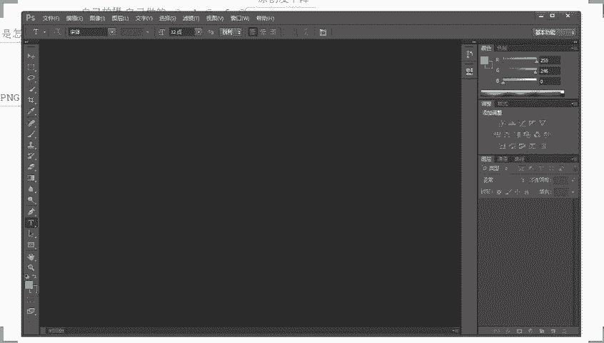

# 【拼多多运营】2024年最系统的全套拼多多运营教程，适合所有拼多多开店新手小卖家自学，10年资深运营师手把手教你从0到1起店实操。 - P48：48-拼多多新品推荐加权 新手小白必备技巧 - 拼多多运营教程_ - BV1H62ZYREs4

Hello hello hello。😊，呃，撤下麦啊，这边所有的目前已经在直播间的小伙伴们啊能够清楚的听到我的声音啊，能够看到我这边电脑桌面的话啊，声音跟画面如果都没问题呢，现在可以公屏上的扣一个一。

好吧，来确认一下啊，所有人动起来啊，声音跟画面都没问题吧。OK啊，一别这边是OK没问题的啊，其他小伙伴呢？好，没问题，对不对？那就太好了啊。如果说是有这种啊听不到声音的啊，听不到声音的。

或者看不到画面的。抓紧时间退出重进啊。那么一会儿呢，两点钟就开始正式分享。还有这个小十分钟时间啊，可以抓紧时间调整一下啊。那么呃在这一个时间里面呢，我们也顺便呢先等一等那些还在路上的小伙伴们啊。

那么一起呢先把我们这个直播间的一些小规矩呢先说一下，对吧？因为确实呢有很多小伙伴呢是第一次来直播间，对吧？所以呢今天我们也先把这个直播间的一些小规矩先说一说啊。嗯。OK啊，那么呃在整个的店铺运营中呢。

大家可能会有很多很多的疑问，对不对？所以在平时的沟通跟交流过程中呢，可能大家也是想要说去了解一些或者解决一些目前自己所需要去了解的，或者是真正意义上跟自己当前的店铺经营情况相关的问题，是吧？

这个我非常可以理解啊，但是呢这里有一点要跟大家提个醒，就是在直播间里面啊，如果说你有问题跟我们当前分享的内容不相关的呢，你等到我正式内容分享完之后再提问，或者是干嘛呢？等到我下播之后单独问我都可以的。

在直播间里面的话，不是说不允许大家提问啊，那么大家可以提问啊，可以提问。但是呢问题啊问题仅限当前内容相关的啊相关的内容啊。这一点的话，大家了解清楚啊。那为什么会这样说呢？

因为其实我们直播间的人说多不多啊，但说少肯定不少的对吧？也有那么目前来看的话，也有那么几十百8号人了，对吧？那如果说我去给大家解决问题，你们每个人提一个问题，我来回答一个一两分钟的话。

那我们时间是肯定不够的那另外呢还有是说呢，有的很多的一些可能确实基础比较差的一些纯新的小伙伴们啊，那我们如果说是问题东一个西一个的话，他们可能就完全没有办法理解，听不懂。啊。

所以这个点呢希望大家能够明白啊，那么也相互配合一下啊，那么这是第一个点。第二个点的话啊，这里呢我也重点说明一下啊，就是在整个直播过程中呢，我希望大家能够去做到积极互动。😊，OK啊，老欧又来了啊哎。

老欧这一个老熟人了啊。来这一点的话，希望大家能够配合一下啊。那当我在分享某一个知识点的时候，对吧？当我在讲某一个操作方法的时候，OK当我分享过程中呢，我会跟大家提问，确定大家的理解情况。

并且呢也会跟大家去了解清楚大家是否能够听明白。或者是在整个分享的过程中呢，我也会跟大家进行一些提问啊，来了解大家的一个基础状态，或者是对于这些问题的一个思考情况。那这些呢都希望大家能够去积极的互动。😊。

那你带着问题去思考呢，这样子你的吸收跟理解可肯定会更好的这一点毋庸置疑，对吧？另外一点的话啊，那当我跟大家确认是否能够听懂的时候呢，你积极的反馈给我，让我知道你的状态的话。

那么这样呢也方便我们后面的分享，对吧？不然我不知道你情况怎么样，我以为你懂了，但实际上你没有明白，对不对？那可能后面所有的东西呢，你是没有办法吸收理解的啊。

所以这一个点呢也希望大家能够去呃认真的对待一下哈。那么除了这两个点之外呢，还会有到另外一个。非常非常重要问题什么呢？就是说大家在整个的店铺经营过程中。

如果说是确实本身自身的一些运营技术不是很好的情况之下啊，那么。记得一件事情。当你啊当你听到我分享的东西。那么一定要去认真思考是不是你店铺有没有做到位的地方。那是不是你店铺需要的，是不是适合你店铺？

如果是的话，记得去实操。啊，记得去实操，因为你不去实操的话，那么你听了再多，你看了再多都等于你。各位刚刚讲的这几个点的话啊呃都没问题，都能够明白，都能够理解的话，公屏上呢可以扣个一，好吧。😊。

OK啊很多老熟人啊啊星兴旺啊，这个呃老欧啊，对吧？包括像我们的生于海港啊，玉玉林枫叶呀，对吧？都是老熟人了啊，然后呢我有看到也有很多小伙伴呢是最近这几天才刚刚这个加到我这边的一些新的粉丝啊。

那么可能有很多小伙伴对我的情况呢不是特别的了解，对吧？可能对我不是很熟悉，是不是O的啊，呃那这边呢还是也也老规矩吧，你给大家顺便先做一个简单的自我介绍吧哈，免得说等会儿哎西楼你到底是干嘛的，对不对？

我平时看你视频也看蛮多的，觉得你确实还有点东西的啊，听你这个直播分享呢也确实很有东西，但是呢你是干嘛的，我不是很清楚，对吧？那我先做一个自我介绍吧反正时间还有嘛，吧？

还有几分钟时间大家呢平时可能叫我比较多的，叫我老师对不对？这里呢我也郑重说明一下，你们以后不用叫我老师的啊，叫我西楼就可以了啊，叫我西楼就可以了。😊，啊，这一点的话我说清楚啊，我也不是什么老师啊。

我只不过可能做电商呢比你们做的早而已啊，我就是一个老商家老运营啊。那我最早呢自己在这个电商的道路呢，最早开始进入电商行业呢，是08年的时候啊，最早08年开始从事这个电商的工作啊，那么10年的时候呢。

就开始自己独立运营店铺啊，这个时候呢确实也是运气比较好啊，那么时间比较早一点。当时的这个经营环境啊，包括说我们的一些这个玩法呢也都比较的呃相对来说啊可能比较简单一点啊。那在13年的时候呢。

我自己经营的这个淘宝女装店铺呢就入选了这个呃拓二十强啊，在女装类部里面啊，那么也赚了点小钱吧，算是啊呃在整个的后期为我呃另外的一个这个拓展呢，包括事业的开拓哎，也做了一些铺垫啊。那15年的时候呢，是。

这个受邀在淘大呢做了一些分享啊，当时呢也被评选为了这个优秀讲师啊。那么呃也在这个时候呢认识了很多人接触了很多的一些官方的一些这些的这样的一些大牛吧。

算是啊也算是人脉的一个拓展啊那17年的时候呢自己呢就开始啊玩了拼多多。那当时呢拼多多呢也不是我自己想玩的啊，这里跟大家讲一下吧，其实在我们这种老淘宝人眼里面啊，什么京东啊，什么拼多多啊都扯淡的。

我们都不放在眼里的。说实话啊，当时呢拼多多在我眼里也是根本就不屑一顾的一个一个平台啊，那也是机缘巧合。当时我的一个玩的比较好的朋友啊，他是加入了拼多多在拼多多管理团队里面啊。

跟我透露一信息说哎拼多多未来这个一年的话要大力的去去发展，要发力了。你可以看看尝试一下看是不适合开店去搞一搞啊。当然当时他没有让我去进股市这一块啊啊，我一直可。对吧那要是让我进股市去搞一搞拼多多的股票。

我觉得很爽啊，对不对？那呃在这一年呢也刚好是做了拼多多啊，也是算去比较好啊。那这一年的营业额呢做了8700万啊。当然呢也是这一年对不对？一家港交所的上市公司呢邀请我做了他们的电商顾问啊。

在19年时候呢也是在全国电商大赛上呢获得了认证奖一个称号啊，20的时候在成都移动电子会上呢被评训为了电商金融top1022年呢被华南电商协会授予了一个荣誉副会长的一个称号啊。

那么这些呢就大概就是我自己的一个从业的一个经历了啊。那自己呢做的店铺呢也比较多一点我自己目前经营的店铺呢像。😊，服装类啊食品类还有这个啊五金类跟数码，还有家具我都在做啊，都在做。

那当前呢这些店铺也都是给到我自己培养这些运营的小伙伴们，他们在打理啊，我自己呢能够把这个大方向把控一下，吧，腾出手来做一些别的事情啊，大概是这样子的。所以说呢呃如果说大家有这种店铺招商问题呢？

不管你什么内目的。我我相信呢我也都会有到一个呃比较独到的见解吧，算是啊也都小有心得吧，我个人呢比较擅长的就是整体运营策划SU化以及自动车板块好吧。OK那这就是我大概的一个情况了啊。呃。

这个南京美罗说哎你带徒弟吗？呃我是有带徒弟的啊，这个是实话啊，我有我有这个带实操这一个板块啊，但是这里我我先讲清楚啊，你们不用着急啊，你们不用着急啊，如果说你自己目前是属于这种确实想要长期做店的。

但是呢自己没有什么很好的运营方法的O的那么可以把这个心思稍微收一搜，认真的听完我今天的分享，你觉得确实泄露有点东西，对吧？你觉得确实是你需要的这样的一个这个方式方法，O的，你可以跟着来实操好吧。

以后我会给到你们讲的这个具体的一些实操的要求的啊，跟我实操的话，不是说你愿意花钱就可以。这里先说一下啊，你必须要满足我的条件，你有时间去做这个事情，你的这个运营的一个态度要是这个正确的一个态度，对吧？

这些才是才是重点啊O的啊那么这个时间差不多了，差不多了。😊，还有一分钟不到的时间啊，这边的话我最后再确认一次喽，好不好？来所有的目前在直播间的小伙伴们。😡，有在认真听直播的小伙伴们啊。

能够听清楚我声音的，能够看到我这边电脑桌面的再一次啊公屏上来扣一个一啊，我再确认一次好不好？来动动快啊，所有人没问题的话，公屏小艺组起来O啊，有还不错啊，还不错啊。今天你们的这个回复的效率啊。

比之前几次直播要高很多啊，我感觉啊啊这个速度很快啊，O的啊啊也有看到很多很的小伙伴啊是比较熟悉的啊，加油吧好？兄弟们啊，像这个呃这个老欧啊，对吧？像这个呃这个耳濡目染啊，对吧？还相濡以沫呀。

还有镜啊啊还有这个呃这个这个这个星兴旺啊，还包括我们彩虹啊对吧？都是一些比较熟悉的小伙伴啊，可以的可以的可以的O啊好，那今天我们要分享内容呢是什么呢？这边我跟他说一下叫做新品推荐加权新手小白必备技巧啊。

我知道今天我本来我讲我说。😊，哎，给到你们做这么一次分享呢，我相信啊可能有大部分的小伙伴呢可能对这样的一个一个标题呢是不屑一顾的啊。我我我我我心里面很清楚啊，但是我为什么要来给大家分享这么一个东西呢。

对吧？大家放心啊，我不是闲的蛋疼，没事干，对不对？那一定是这个东西对大家有帮助的我可以很负责任说，我今天不管你们在座的各位老板是做了多久店铺的啊，那么但凡是你自己真正意义上想去把做好店铺的话。

那今天分享内容一定对你是有帮助的。😊，各位这个自信我是有的啊，如果说没有用，对吧？我哪天直播倒你洗头好不好？😊，对吧这个这个这个底系我有的啊OK那这个时候呢我们就直接开始了啊。

今天我们讲的首先能搞清楚这个东西叫什么啊，新品推荐对吧？各位呃，我先问大家一个问题吧，拼多多平台你们觉得啊拼多多平台，你们觉得有新品推荐吗？😊，我们讲的是新品推荐，就是指我们的新在发布的产品啊。

它是不是有这个额外的呃曝光扶持这种东西啊，有没有有吗？有对吧？OK啊，老欧说有，然后呢，彩虹也说有胡杰说有，你丹说有，相濡以沫，也说是有的O大家都是这个认为是有的对吧？O微风也说是有的好，没错啊。

一定是有的啊，一定是有的啊，这个是有的，这个没有毛病啊，这个是有的啊，那问题来了啊，那如果说新品推荐是有的，新品加权也是有的，新品扶持也是有的那为什么我们有很多人产品发布之后没有访客呢？嗯。

这个问题就很严重呢，对吧？哎，我产品啊，我的产品发布了啊，没有访客。😊，这个是一个常态啊，这个不是个别现象啊，这是常态来的。是不是各位，这个这个他同意吧，这个他同意吧啊，这个不是个别现象啊。

这是一个常态。😡，同意的话，公民打一啊。如果说大家同意的话，公民打一好吧。😡，那这个东西就问题来了呀。哎，你又跟我说有新品推荐，你又告诉我，我的产品发布了之后又没有反客。那你这不是自相矛盾吗？

你这不是扯淡吗，对吧？哎，欺负老是人嘛？这不是对不对？😡，那你给我扶持扶持到哪里去了，你给我的推荐推荐到哪里去了，对吧？😡，咱们不能这样玩，玩的文这游戏没有意义呀，对不对哎？😡，真的是文字游行吗？

不是的啊，那我们的新品推荐一定是有的那我首先跟大家讲一下新品推荐的逻辑啊，这个东西逻辑大家搞清楚之后呢，我们再来说具体的操作怎么去通过一些小的操作方式跟技巧来完成这个新品的流量获取好吧好？

首先第一件事情，那我们说说这个推荐的一个规则啊，推荐的规则或者推荐逻辑吧啊，推荐逻辑，这样讲可能更加的严谨一点啊，推荐逻辑。那呃有没有人是在18年之前有接触过，或者你了解过拼多多的有没有。😊。

准确的说是18年的7月份之前啊，有没有在座的各位有没有这个时间段有了解过拼多多的？😡，有吗？都没有吗？啊，OK啊，如果说没有倒没关系啊，那我说一下啊，在那个时候啊，在那个时候啊。

拼多多对于产品的考核就只有一个东西。😡，销量。那如果说你不知道，但是这个事情你一定听说过的，早期拼多多就是销量为王。😡，啊，就是销量为王，对吧？谁销量高，谁靠钱。😡，啊，谁向原告，谁靠钱？啊，谁销量高？

谁排名靠前啊，跟我之前说的一样，对吧？早期的时候就做都在做淘宝，看不上拼拼多多是吧？O呃，你说这句话就真的是啊呃印证了一句话就是什么呢？呃鄙视拼多多理解拼多多，后成为拼多多，是不是现在都这样子啊。

你们可以看到，现在各个平台啊都在向拼多多靠近是不是是不是这样子？最后发现呢确实拼多多的这个策略呢还真的是挺厉害的，他唯一让人吐槽的嘛，也就是这个呃比较恶劣的这种裂变的营销方式对不对？

砍一刀啊这种东西对吧？可能这个东西比较让人觉得反感啊，但是他的大多数的这种东西的话，目前来讲的话，各个平台都在模仿他，那但是在这个情况之下呢，我要实话实说啊。

不管是哪个平台他现在如果真正在模仿拼多多的话，实际上作为高层他们的策略一定是一定是这个错误的啊，这句话我跟大家把这个。😊，话说在这个地方啊，兄弟们，今天我们一起做一个见证啊，我把这个话说在这个地方。

就不管是淘宝也好，还是说像抖音也好，还是说其其他平台也好的，他们可能目前来讲已经在非常大的一个策略层面上来像，譬如说靠近了。但是他们的这个策略的调整。其实对于商家也好，对于用户也好，都是一种伤害。😊。

他们不可能成功。在这方面来说，各位你们信不信？你们信不信？有没有有没有不信的来，有没有不信的？如果信的话，打一个6好不？如果信的话，打一个6。如果不信的呃，打一个这个2好吧。😡，OK啊都信啊。哎呦。

看来我们还是志同道合的一帮人啊，兄弟们啊。😊，对吧还看来我们还是比较这个达成统一的这种这种想法上来说，对不对？其实很简单嘛，对吧？用户群体不一样嘛，你像淘宝对吧？

早期的时候可能更多是一二线城市的用户居多嘛，那现在他全部把这个东西砍掉去，搞得跟拼多多一样的话，最终呢都会有到这种。😊，以次送啊商家会越来越多。那么像我们早期的时候，可能在淘宝购物的时候流传一句话。

对吧？很多人说呃，淘宝的这个用户呢，他可能是呃害怕买到假货，对吧？在拼多多买买东西的人，可能他就不怕买到假货，为什么？因为在在淘宝买东西的时呢，他是花买这个真货的钱去买到假货，他所以他害怕啊。

在拼多多呢可能他花了钱很少，对吧？就是花买假货的钱，买到真货就是赚的，买到假货无所谓，对吧？就这个意思当然呢这个只是早期的一个调侃啊，啊，现在其实已经不是这样子的了。呃。

为什么拼多多不能给商家搞一个这个仅收款。😊，哎呀呃可以可以啊，你这个想法很好啊，下次我跟他们这个高层聊天的时候，给你把这个想法说出去啊，让他们看看能不能调一调哈，搞个紧收款哈，试一下呃，我真的是醉了啊。

其实你要真的说仅收款的话，还是真可以的啊。真的可以仅收款的啊。兄弟们，你你们可能不知道啊，你真的要搞紧收款是可以搞出来的啊。在我们店铺后台里边的话，是有一个这个商家的收款码的。这个大家知道吧？

有没有人有没有人不知道的，有没有人不知道的啊。😊，商家是会有到一个收款码的啊，一个这个支付二维码，知道吧？收款码你们可以拿这个去收款啊，可以可以可以仅收款的。😊，是不是只要他愿意付啊，也是可以的啊。

也是可以的。😊，好了啊，不开玩笑了不开玩笑，扯的很远啊，刚扯的点远啊。我们把这个思路说一收收回来啊。来，兄弟们啊思路说一下啊。早期的时候啊，我们这个拼多多平台呢，它是以销量为王啊。那么这个时候呢。

谁销量高，谁赔别靠前，对不对？那这个时候就有了一个问题，那如果说今天我呃打个比方啊呃我是卖这个。😊，食品的啊打个比方啊，兄弟们啊，打个比方，我是卖食品的，我卖零食的啊，我卖零食的。哎，我卖的是辣条。😊。

对吧我卖的是辣条啊，那么我现在呢有很多的这种呃辣条的这个产品跟链接，我已经发布出去了啊。打个比方啊，那么每个辣条呢它其实都可以卖的很好。为什么呢？因为它确实是一个非常畅销的产品，对吧？啊。

它是一个非常畅销的产品嘛？那但是呢有一个问题，今天呢我又要去做一个店铺，我可能需要去卖一个东西，什么鸭脖。😊，啊，我要卖个鸭脖，或者我要卖个牛肉干。😡，好吧，我要买个牛肉干啊。

那么这个时候像鸭脖牛肉干这种东西呢，确实啊它在某种意义上来讲也是畅销的商品，对不对？各位？这个要同意把，跟跟这个辣条来对比的话啊，跟辣条来对比的话啊，我们我们这些产品是不是其实都算是畅销的一些零食啊。

没错吧。😡，是不是都吃三量零食啊，但是有一点可以肯定啊，那销量最大的一定是辣条啊，这这几个产品来说，但凡你们是了解市场的话，应该都清楚的对吧？那销量最大的一定是辣条啊，那如果今天我们只是看销量，对吧？

它可能就存在一个问题，就是我们这些所谓的呃类幕曝光也好，推荐曝光也好，它会被这些本身内幕体量很大的一个产品呢所垄断掉啊，这是一方面。另外FM方面呢，在同类型商品里面的话啊。

那么低价商品永远是比高价的商品卖的多的。😊，对不对？低价商品可能一天卖个1000单啊，打个比方，今天我们有一个产品辣条对吧？一毛钱一包，他一天卖个1000单。另外一个辣条呢，10块钱一包。

他一天只能卖10单，对吧？有这种情况的那这个时候怎么办呢？你如果说只看销量也不对。😡，啊，也不对。那么这个时候我们会造成一个非常大的一个困扰，就是这些跑量的低价商品呢，就会去冲量。

尤其是一些商家他们去做排名的时候呢，会疯狂的冲量。这个时候呢一些有钱的老板呢，他们砸现的砸得很猛，对吧？那作为我们中小商家，作为我们真正意义上想要把店铺做好的商家，可能我们就很难去拿到曝光。

于是乎呢平台在这样的一个大环境下面呢，在18年的下半年的时候呢，对这一个销量排名的一个这个考核呢，做了优化啊，他除了考核销量之外呢，又加入了坑产。啊，又加入了坑产。什么是坑产呢？就是我们的交易额。啊。

就是我们的交易额。那么这个时候呢，就会有到一个问题，就是你销量考核的同时呢，也会考核你的交易额。打个比方，今天你卖1000单，对不对？你只卖了1000块钱，啊，你只卖了1000块钱，但是人家卖十单。

他也卖了1000块钱，对吧？他也卖了1000块钱，虽然说你们的销量不一样，在销量上你是占了绝对的优势的，但是在你的坑场上你没有任何优势，而反观在我们的客单价来说的话，人家客单价是100。😡。

你客单价只有一。啊，你客单价只有一。所以在这种情况之下呢，我们会认为客单价更高的这个商品呢，对我们的流量的利用率可能会更好一点，它的优惠价值也可能会更高一点。对不？

当然这个优惠价值还要考核到我们的是个商品的一个访客啊，各位这样的一个逻辑，大家能够听懂吗？如果说能够听懂公屏上打个一，好不好？如果说没有理解没有关系啊，也可以打个问号，我再给大家讲一下都可以的。😊。

OK啊，能理解，对不对？😡，啊，有没有有没有小伙伴不清楚的，没关系啊，这个很正常，有不清楚很正常。大家不用去说担家说觉得自己做了不理解，会觉得没面子之类的啊啊啊，这个点刚进来是吧？没关系啊，没关系啊。

刚进来没关系，可以认真听一下啊，一会儿的话这些东西呢目前来讲的话，你只是一个相当于是一个基础板块的东西啊，相当于一个扫盲啊，不用着急啊，无所谓的啊。那么在整个的这个呃过程中的话。

那我们平台呢它除了会考核你的销量之外，也会考核你的坑场。但是在考核坑场的时候，它就必然会进行下一步的考核，怎么考核呢？考核我们的可堂价，对吧？考核我们的UV价值。😊，啊，它是必然的。

因为在这些数据跟它是息息相关的，是同步进行的啊。那么所以我们产品在考核的时候呢，它除了考核销量，考核我们的客单价，考核我们的优惠价值之外呢啊会进行一个啊更大的一个维度的一个考核，不是像原本那么单纯。

对吧？同样的，在商品考核过程中呢？这个时候如果说平台在所有的位置只去考核这些东西也会面临一些问题。什么问题呢？你们想一下啊，这些考核，它是基于什么的。😡，各位来这些考核数据它是基于什么的？来这一点呃。

有没有谁可以给到我一个答案的，或者是能够去呃这个把思为发散一下。根据这个数据这些这些东西来来给到我这样一个答案的，有没有？😡，啊，这个这个不是这个不是一个非常重要的一个点啊。

只是一个看看大家有没有在认真听有没有非常灵活的去吸收消化这个东西啊，这一部分内容的一个一个点啊，就是目前来看的话，就这些内容它对于我们产品排名的考核，它是基于什么东西考核的？😊，嗯。😊。

有没有有没有人知道的？如果说不知道，没关系，打个问号啊呃，如果说不确定不知道，没关系，都可以打问号啊，动得快啊，都不清楚呢，我就直接讲啊，就不用浪费时间。OK啊，那么这个呃倪丹说哎商品数据。

然后这个呃账文是吧，是账文吧，就说哎。😡，呃，是这个曝光跟流量吗？啊，然后这个点说是权重啊，OK啊好。没关系啊没关系啊，呃，然后彩虹啊彩虹你也不知道啊，你你作为一个运营，你也不知道啊。

你你这个就说的有点有点过分了啊。那我觉得你这个跟着实操这个事情刻不容缓啊啊，彩虹知道吧？来彩虹能听到扣一啊，能听到扣一啊，那这里的话认真听了，认真听啊，彩虹能听到扣1啊。

那我先来把这一个部分呢给大家认真的去详细的去讲一讲啊，那这个地方一定要认真听啊，其实我们刚刚有反复提到过一个东西的对吧？那这里呢销量啊，这里呢是坑产，那不管是什么，不管是什么，它的考核都是基于什么？

基于成交来的呀，是不是？各位没错吧，其实刚刚你们的小麦也提到过，对不对？根据我们的商品数据，那么这个商品数据是什么？就是我们的这个成交的一个数据嘛，对不对？然后这个有点说是权重。

那么这个权重是根据什么考核的，也是我们的成交数据嘛，是不是各位。😡，嗯。同意的话啊，公民扣一。同意的话，公屏扣1。好，那么这里就有到另外一个问题又产生了啊。如果说拼多多平台进行商品排名的时候。

他只考虑成交就会有到一个非常严重的问题出现。😡，那什么严重的问题呢？在我们的产品排名过程中，平台考核的销量也好，考核的坑场也好，它都是要根据我们订单的数据反馈来的，对不对？那么作为我们是新店。

我们是新品的话，那么你新店啊新品。你怎么办？你是不是就没有机会了，就等于说那这个时候呢，他是不利于我们平台发展的。😡，平台呢希望我们的消费者呢能够有到一个很好的购物体验跟购物环境，知道吧？

所以说他不希望说我们的平台的商品展示过程中出现垄断。为什么这样说呢？来各位，我们现在随便举一个例子啊，我们现在随便举一个例子，各位你你们是做什么产品呢？来可以说一下啊，可以说一下，你们做什么产品的。😡。

我拿你们产品来举例子，这样子可可能大家的一个理解可能会更加的深刻一点啊。好，OK老A说是做童装啊，老A说做童装的啊，然后呢，这一个我们就说童装了啊，好不好？我们就童装啊，呃。

你们其他人做的这个产品呢是什么啊，无所谓啊，现在其实也不是很重要啊，重要的是我们现在把这个逻辑带入进来，好不好？我们现在把这个逻辑带入进来哈，来各位我们现在说一个童装这个事情啊。

我们现在说一个童装这个事情，我现在来来说一个事情啊，假如说今天我们去搜了一个词叫做外套。😊，啊，就是外套啊。假如说今天我们收了一个词，叫做外套啊。各位，我想问一下外套这个词有没有明确的这个具体的产品？

😡，呃，可能这个逻辑大家没有特别好理解啊，呃，他是夹克吗？他还是什么呢？对吧？哪怕我前面加了一个男装啊，哪怕我加了一个男童啊，哪怕我加了一个男童，他有吗？啊，他有吗？他其实没有具体的指向，对不对？

他没有具体的啊，那么这个时候就有到一个问题，但凡是跟这一个词，他有关联的啊，符合这个词的搜索的规则的这个所有的商品都会被抓取出出来，对不对？那么他被抓取出来之后呢，如果。按照我们刚刚的逻辑，他按照销量。

按照坑产去考核的话啊，按照销量按照坑场去考核的话啊，那么这个时候呢，当下应记的卖的多的数据好的这个产品就会呈现出一个垄断的状态。各位，这个大家承认吧。当下。销量高。啊，然后卖的多的。啊。

就会有一个垄断的一个状态。是不是？没错吧，就会呈现出一个垄断啊。那如果说根据整个考核，它只只是考核销量的话，那更恐怖啊。那么只是考核销量的话，可能还有去年的甚至大前年的商品还在霸榜，还在第一名展示。

对吧？那么这个时候呢，对于我们的消费者而言呢，他可能看到的商品呢都是一些所谓的爆款商品，他一直看到的都是些所谓的爆款商品，他没有太多的新鲜感，他会觉得这个平台给到我的产品都是一样的。

我今天可能在这里买了，我第二天我想买的时候，或者我过了一个月想买的时候，他到东西还是一样的东西。各位这个逻辑能能能不能懂。😡，抛开这一个应不应记这个事情不说的话，那么当下啊当下这个季节。啊。

这个季节我看到的啊我看到的都是差不多的东西。或者我每次看到的都是一样东西。那这个时候你觉得我在这个平台上能购物购几次呢？一次、两次、三次，我相信不会太多。各位是不是这个这个逻辑能不能理解？

作为消费者来说，我的购物体验很差。我每次来我找不到我喜欢的或者是我看不到一些新鲜的东西，每次都是同样的东西，我没有新鲜感。那作为平台来说的话，同样的道理，那么没有办法给到用户一个很好体验的话。

是不能做到用户留存的。😡，啊，所以这个也是一个非常重要的一个一个呃对我们来说不好的一个影响吧，算是啊。那么在这个基础之上呢，所以这个时候呢，平台呢也会加入到季节性的考核，针对到应急商品呢进行加权。

对不对？各位，这个这个这个没问题吧，应急商品会进行加权啊。比如说你现在是夏天，那么春天的产品，哪怕你在平台上有在卖，那它同样也不会有到特别多的权重。😡，他的权重在同类型商品考核过程中。

他是对应急商品是优先展示的。那么这是一方面。另外一方面呢，平台会针对到新品进行。啊，针对到新品进行随机推荐啊，什么意思呢？来，我给大家画一个图啊，打个比方，这个是我们拼多多啊，这个是我们拼多多啊。

这个界面啊是我们拼多多啊，在拼多多这个界面里面呢会有到不同的宝贝，不同的商品，对不对？在这边进行展示啊，我们随便画一下啊，随便画一下啊，我们随便画一下，这个东西大家不用去管画的正不正啊，画的好不好看啊。

无所谓啊，好不好？无所谓啊，我们只是做一个演示而已啊，那打个比方，这里呢是我们拼多多界面，对不对？在这个界面里面呢会有到不同的位置，这个是第一个位置，这是第二个位置，这是第三个位置，对吧？

这是我们商品的展示位置啊，然后第5个。😊。

然后第6个啊，那这个时候呢，假如说啊兄弟们。假如说啊第一个位置啊第一个位置它是什么呢？它是我们的这个呃广告位啊，广告位啊，打个比方啊，它是我们的广告位。然后第二个位置呢，是我们的这个呃。

推荐商品位推荐商品位啊，是根据我们历史的行为，历史的足迹啊进行的一个推荐啊，比如我浏览过的商品呢，或者是我收藏过的商品呢这种这种推荐位啊。然后第三个呢可能是什么呢？呃高销量的。😡，啊。

然后后面呢可能是高坑产的。啊，高分产的再往后呢，可能是这一个好评率高的。啊，好评率高的那再往后呢可能会有到这么一个位置。比如说第六个位置啊，这个位置它就是一个新品推荐位。啊，这个新品推荐位不是固定的啊。

我只是拿这个地方来举个例子而已，它不是固定的啊，它不是固定的好不好？平台会根据人群来进行区分。有些人他喜欢新鲜事物，喜欢新品，那么就会针对到这些人呢会有到新品推荐位。

但有的人呢他可能只是喜欢一些爆款或者喜欢一些低价商品的时候呢，哎他对新品不是很敏感的时候，他是没有新品推荐位的。这个点注意一下啊，这个是根据千人切面来的。所以当有人喜欢新品的时候。

这个新品呢就会推荐出去进行展示。而展示的时候呢，这个新品推荐位呢，他会根据当下属于。😡，新品的商品啊，在这个商品词里面来进行随机推荐。啊，可能对这个人呢今天推荐的是商品一，明天可能推荐的是商品2。

后天可能商品3，对吧？然后呢，对不同的人呢可能推荐的是不同的商品。那么这些时候呢，针对到后面这些新品正常的进行了这个推荐曝光之后会形成一个点击反馈，会形成后续的呃这个成交数据等等这些东西。

然后进行商品考核。😊，是这么一个逻辑。而这个时候如果说有新品通过这个推荐位表现的很好的话，那么这时呢平台也会根据这个推荐很好的新品呢来完成数据的扩散，至遇到更多的人进行推荐。这个时候的推荐呢。

它就不是说单纯的新品推荐呢，而是标签推荐啊，而是标签推荐各位这个逻辑现在大家能够明白的话，公屏上打个一，好不好？来。啊，O。这个部分呢我讲的时间比较多啊，花的这个篇幅呢也比较长啊。

我之所以花这么多时间花这么多的功夫去给他讲这个事情呢，是希望大家能够去重视这个这个东西啊。那么这个东西呢，对于我们作为新店运营，作为新手运营来讲，是一个非常非常重要的部分。如果说你做不到位。

如果说你没有做好。那么你前期的初始曝光就会少很多。对于我们店铺来讲的话，这个东西影响很大啊，影响很大啊。对于我们来说这个东西呢，这个呃这个影响就是可以可以可以这样说吧。就好比说你今天做了一个销量。

我今天要做100个销量来追你，就这个差异。😡，啊，就是个差异啊，好吧，因为它是影响到我们初始曝光的那当然呢可能有小伙伴说有没有这么夸张啊，我不是很理解啊。OK那我们可以想一下。

如果说前期你和我都是新品的情况之下，我实品推荐比你多。😡，比你多十0倍，比你多100倍。那这个流量差异是不是产生了呢？如果说这个幸用推荐在产生之后，我们的数据反馈也会有差异。我有很高的点击率。

我有很多的用户收藏甚至转化。那么这个差异是不是又变多了呢？当然有小伙伴可能说哎，那我可以自己去做单子啊，但是各位我不知道大家有没有注意到啊，目前来讲的话，在拼多多平台上已经有很多的人发现的一个规律。

就是现在他整个的这个虚假交易的处罚力度，或者是处罚了这个概率值越来越低了。我不知道你有没有发现啊，在之前的时候，早期的时候，我们可能还偶尔听到说有谁被判了什么虚假交易，对吧？各位有没有听过这个东西的。

😡，在我们去年上半年之前，大家有没有经常说是偶尔会就是也不是说经常吧，至少来说偶尔会听到说有人店铺会什么会这一个呃虚假交易，对不对？但是现在店铺需假交易，其实真正意义上给你处罚少很多了。😡。

但是你会发现一个事情，现在你去做了订单，做了评价，做了销量，你会发现没有效果。😡，啊，做完之后呢，会需假发货跟这个没关系啊，跟这个没关系。那么做完之后呢，即使说你原本是有数据的。

你会发现你店铺好像被屏蔽了。😡，是不是没有访客，没有订单了。😡，对吧各位有没有发现这个差异啊，有没有发现的？如果有发现的啊，公屏上可以打个一。那为什么？嗯，原因很简单，因为平台知道这个东西不可避免。

也正是因为我们很多商家喜欢去做这个事情，才把我们拼多多做的很繁荣啊，至少来说这个在官方数据层面上来讲的话，会让我们的数据变得很繁荣，但是它又不能让我们这种需要交易的风气呢来影响到正常的店铺操作。

所以说他会把店铺的考核数据啊，做的更加的严谨同时呢去把它进行一个隐形降权的一个操作，而不是放在店铺违规上啊，当然呢也有人可能说哎这个是拼多多平台呢做了一个调整之后，他想放长线钓大鱼。

前期的时候呢就给你小小的来个屏蔽，逼着你去做更多订单，然后你然后呢让你订单变多之后呢，来冻结你的店铺啊，这个也是比较腹黑的一种想法啊。😡，当那我们也呃不知道平台怎么想的，但是也不排除啊，对吧？

但是不管怎么样来说啊，那我们做店铺的话，你如果说只是靠去人工操作订单，那一定是得不偿失的，或者是一定是干嘛呢？一种错误的方式，是不是？我们要做的是做好权重，做好推荐曝光，而不是说我们为了做店铺呃。

我们为了去做这个销量去做销量，对吧？我们为了去做评价而去做评价，对吧？这个就肯定不对的啊，那呃新品的权重，刚刚推荐逻辑呢，我们也讲清楚了。那现在我又想问大家一个问题了，这个问题呃。

跟大家可能息息相关的啊，那新品的推荐。😊，是怎么推荐的？新或者是这个新品的这个考核啊，是怎么考核的？来这个问题我问一下啊这个问题我问一下好吧呃，有没有人知道的啊，当然呢，有很多类目呢。

它是没有新品标的啊，有些类目是有新品标的。那么这里我也顺便先说一下啊，不管你的类目有没有新品标。😡，它都是有新品加权的这个毋庸置疑啊，只不过有新品标的呢，它是有外露的一个展示啊，它是有外露的展示。

但是呢没有新品标的店铺，它一样是有新品加权的啊，OK这个句号说是点击率啊，还有别的这个不同的答案吗？新品的新品考核啊，新品考核是怎么考核啊，好不好。😡，换句话说，平台怎么去识别出你是新品的？好吧。

你们不要这个跑偏了啊，我就感觉你们这个东西跑的有点偏啊，好吧，然后这个呃lucky star啊。😡，来问一下，那，你知不知道？😡，你知不知道啊？😡，你呢也做了一个几个月时间了啊。

这个问题我我觉得你应该是能够清楚的吧。😡，嗯。😊，在不在luck在不在拉 star。😡，不会说是在直播间里面挂机吧啊，哎呦说鸡不说八啊，这个文明你我他啊，刚刚这一个嘴瓢了啊，大家装装作没听见啊，好不好？

😡，啊，然后这个呃。😊，呃，这个赵文说是销量和评价，然后呢，橘子味的猫说是这个价格标题主图，然后天天说是标题和主图。然后呃彩虹说是产品品质，我的天哪。呃，彩虹啊，你让我觉得很担心你啊，对吧？

作为一个专业的运营来说的话，你你这个每次给到我的答案都让我觉得有点不尽人意啊，稍微有点这个。稍微有点偏啊啊稍微有点偏，好吧。稍微等偏啊。然后这个。哎，我我又看到一个这个一个熟人了。呃，baase。啊。

为在不在？在的话来在的话来这个问题，你你回答一下。😡，OK这个战斗说是标题主图，还有SQU啊，标题主图还有SQ好吧，来。我在吗？我的天什么情况什么情况啊，我怎么老是看到一些在直播间的人，然后又不说话的。

是是是是不在吗？现在那算了算了，不纠结了。好O啊，那我们继续往下啊O啊，说是这一个潜力新品吧啊，然后点击啊标题主图销量等等啊。O啊，行行行啊，不纠结了啊，那我直接公布答案吧，好不？我直接公布答案啊。

我直接公布答案啊，就不去纠结了啊，其实在针对到我们拼多平台考核到我们产品的时候呢，说怎么去考核新品的话，其实很简单一个东西，对吧？考核我们产品的原创度啊，就这一个点。😊，啊，就考原创度啊。

那么这个原创度考到哪些东西呢？刚刚你们其提到了，对不对？标题。啊，然后还有主图对吧？包括说我们的详情啊，包括我们详情，还有我们的SKU这些都是考核的啊，这些都是考核的。各位注意了啊，注意了啊呃。

标评怎么办啊哎呦。😊，都有是吧啊，刚刚这个为什么是已经回复了啊，除非自己搭配okK我说一下啊，标品。😊，他不是说我产品必须是独一无二的，这个就叫原创度啊。兄弟们啊，这个要搞清楚啊。

不是说我产品要独一无二的，要有混装，这个就叫原创度。原创度是指平台识别出我的产品，识别出我的这个链接是原创度。😡，能理解吗？链接是原创和你产品的原创度，这个是两个概念来的啊，这两个概念来的。

那么在我们进时的时候呢，首先第一点大家记住了，你的标题一定不要去抄袭啊，一定不要去抄袭。当然呢你说我就是去抄袭了行不行？行，没问题，这个无所谓啊。这标题的板块来说还好一点，没有那么严重啊，好吧。

这个呢大家尽可能呢根据产品实际情况好吧，结合平台搜索词。啊，结合平的诉讼词以及我们用户的需求。以及我们自身的一个什么定位来做我们的标题啊，这个是第一点啊。然后呢，重中之重的部分是什么呢？

就是我们这几个板块的图片和我们的SQ布局。😡，如果你想要去做一个原创度很高的产品的话，你的SQU不要去跟同行做的一模一样。哪怕是在文字描述上，哪怕是在我们图片上做出差异都是好的。

这一点大家注意一下好吧好，然后呢，再就是我们图片，我们的什么主图，我们的详情。😡，啊，那么来我问一下啊我问一下，现在我问一下啊，各位你们的图片啊你们的图片。😡，你们的图片啊。是怎么来的？是自己做的吗？

自己拍摄自己做的吗？😡，来扣1啊，这种情况扣1啊。😡，证确扣1，如果不是啊，如果不是okK扣个2。啊，如果不是扣根儿。啊，如果不是扣2，好吧。OK啊啊，有扣一的有扣2的啊有扣一的有扣2的啊呃。

扣一的少部分啊，扣2的是大多数啊。然后呢小伙伴们就说哎，我也想自己拍，对吧？像一米阳光说，哎，我自己拍拍不好啊。OK行，没关系啊，来兄弟们啊，来注意了啊。😊，注意了啊，现在到了关键点了啊。

现在到了关键点了。来，我给我给你们看一下啊。对于我们店铺来讲的话，你前期如果想去得到一个很好的新品考核，拿到推荐权重的话，那么前期在这个板块一定要做到位。😊，啊，我给你们看一个新店啊。

我给你们看一个新店啊来。😊，哎，等一下来这一个啊这一个新店啊，这是一个新店来的。各位它请量大家觉得怎么样快吗？😊，从零开始的新店啊从零开始新店啊，操作了有这个小半个月啊，就开始起量啊，就开始爬升啊。

到后面的话，一个小爆发就冲到了差不多1万房客。那到这个时候才多久啊，对不对？才大半个月吧。😊，啊，其他的朋友吧，后面的话是一天做到了1万五的访客啊，注意啊，这个店铺做的是存置按钮，一分钱的推广费没花。

😡，一分钱催广费没花啊。啊，怎么说呢？呃，店铺操作嘛，对不对？肯定是有这个不同的数据的。像他本身有一点啊，他的框价比较低一点啊，框价比较低一点，所以它起量也会比较快一点。当然这个也跟我们的品类有关系啊。

好吧，可能我们不同产品呢也是不一样的。这个东西没有固定的啊。那但是有一个问题什么呢？我们想要去有到这数据的前提。😡，想要有了这样诉据的前提，一定是有到一个很好的精理推荐啊，初期做了评价跟销量维护吗呃。

我不知道你说的这个评价和销量维护是指的哪方面啊，是指的去呃自己去做销量做评价呢？还是说怎么样做这个店铺我跟大家讲一下，他直接做的是竞价啊，直接做的竞价，没有去做没有去做这个S单啊，没有做S单啊啊。

我们做店铺啊，你去做销量做评价方法有很多，你可以去S单，你也可以通过别的方式去做，对吧？方法有很多，最终的目的只不过是帮我们把这个把这个评价做出来，把这销量做出来，能够去促进转化，仅此而已。

是不是所以方法很多啊，方法很多，看你怎么去用它而已，看你怎么去做它而已。好吧？那么这个店铺怎么做的呢？来我给大讲一下啊，首先针对到原创度的操作各位。😡，平台在识别我们产品的时候，他怎么去识别新品？嗯。

各位来，我现在问一下啊，平台在识别我们产品是不是新品的时候，他怎么去识别我们新品？😡，识别的是我们的标题，识别的是我们图片，识别的是我们详情，识别是我们SQ对不对？刚我们说过了。

那么这个时候来重点说一说这几个点主图详情还有SQ它都包含一个内容叫做图片，对吧？所以刚刚我问了一下，你们图片怎么来的？这个地方我说一下啊，不管你们的图片是自己拍摄的也好。

还是说你们是这个呃通过供应商提供的，或者是倒图也好，无所谓，都不重要，重要的是你们都要保证自己图片的原创性，如果说你自己是厂家的，对吧？你可能说我自己去拍摄，然后我会把这个图片呢分发出去给我的分销商。

有没有？刚刚扣一的小伙伴有没有这种情况，你们会把图片分发出去给你的这个分销商吗？会不会会的话，打个6好不？如果会的话，打个6啊，刚刚是扣一的小伙伴们来。😡，如果说不会的，okK的也可以打个2，好吧。😡。

OK啊，行啊好，行行行啊，是有的，对不对？那如果说你的图片就是自己在用，这种情况还好一点啊，还好一点。如果说你要分发出去给别人用，那么这个时候有到一个问题，你图片虽然说是你自己是原创的。

但是可能跟你用一样，图片的人很多，就会导致你的原创度。😡，下降。能懂吗？因为平台考核性品的时候就会考核你的同款跟相似款。😡，如果你的同款跟相似款特别多的话，你不仅会原创度下降。

你还会减少你的新品权重时间。我们因为很多人做服装类目，对不对？可能有些产品呢本身不是什么爆款，它的新品标可以有到一个月时间，对吧？但是有的爆款商品呢，你上架之后发现新品标只有7天，甚至只有5天。

甚至只有3天就没有了。为什么？因为你同款相似款太多了，平台证对的这种产品呢，它会压缩新品的时间，😡，就这么简单啊，然后这个居委的妈说，哎，我都是从厂家直接拿着用的OK啊，那么很多人呢也是这种情况。

对不对？从厂家拿来用的，或者是去盗图的那么这种情况你们是扣2的那这个是一样道理，你能够找你的供应商拿，别人也可以找你的供应商拿，你可以盗你同行的图，别人也可以到同行的图，用这个图片的人太多了。😡。

对吧用这个图片人太多了，所以这个时候就回答一个问题啊，所有人都能用这个图片。那么这个时候呢，你的原创度就会很低。然后这个呃赵文说发机会商品会不会更好一点呃，发机会商品的就是这样子。

就是我们在发布商品的时候，肯定是通过机会商品这个渠道去发布。😡，知道吧？但是不管你通过什么样的方式去发布，后期的这些操作一样的啊，渠道其实都是小事情啊，渠道是小事情啊。那么来啊注意看啊。

那这里我们说一下啊，图片的考核怎么考核的。😡，我们在网络上传播图片呢，什么格式大家知道吧？😡，JPG对不对？然后JPEG。是不是？还有这个片NG。没错吧，你们如果说去发布商品的话，应该会看到吧。

平台对这个图片的格式要求。😡，对吧。😡，各位，这个这个应该有看到过吧。😡，图片格式大家都知道吧。😡，来，我问一下啊，刚刚有人的图片呢是自己拍摄自己做的。那么这些图片在这个呃平面来讲啊。

在这个图图像的一个成像来讲的话，是有一个名称叫什么，大家知道吗？😡，这些。这些图形啊这些图片格式啊格式的呃这个统称啊统称啊，在在图像的一个成像的一个模式上来说啊，在成像的一个一个形式上来说啊。在城像。

的形式。来说。是什么图片啊，什么什么类型图片来各位。啊，这里多多了一个字啊来说啊来。刚刚是有自己做图的，对不对？然后呢，你们应该是懂一点设计的，懂一点这一个呃摄影的，那么应该是懂这个东西的。

然后这个李丹说像素点。呃呃，说到说到这个地方是对的啊，但是这个呃表述呢是有点错误的。你们可以去呃，我相信啊可能现在你们因为你们没有答出来嘛，可能你们大家不是很清楚啊，你们可以搜一个词汇啊。

你们可以搜一个词汇，叫做点正图。😊，啊，你们可以搜一个词啊，你们可以自己到时候在百度里面搜一搜这个图叫点正图啊，好不？点正图，你们可以搜一下啊。点正图呢就是我们刚刚讲的这些格式。

它的一个呃按图形的成像类型来说的一个一个一个图片啊。那么这些图形呢，他们是有个特性啊，就是它是有一个一个的像素啊，有。有。像素构成的。啊，由像素构成的啊。那么由像素构成的这些点正图呢。

在互联网上进行传播的时候，其实平台也好，互联网也好，电脑也好啊，电脑也好啊，他们是没有办法去直接识别出这个图片的，各位知道吧？在平台来讲，在电脑来讲。

它不会说直接就是一个图片展示在我们的这一个算法里面去啊，它只是一段一段的代码。各位能懂吧？啊，做店铺掌握的真多啊，系统你这里面哎呀，小事情啊，这东西小儿科的东西啊，我都不想跟大家说这种东西的啊，对吧？

来这个东西大家注意了啊，这一个啊这一个在电脑语言里面，它其实也是二进制了，对吧？它不会说是直接说给你一个图片，它只不过是一串二进制的代码，对吧？😡，0001啊00010001100啊，打个比方啊。

这样子啊，那它可能识别出来这个所有的图片呢，就是这么一串代码识别出来的。可能不同的图片呢，它的代码形式不一样，对吧？各位没错吧，那么这个时候呢平台会进行识别。哎，这一个图片呢，它是一个呃多大的由由。

多少像素？构成的图片啊，它会它会有它会有进行拆分，对不对？然后呢，查多少像素。😡，宽啊多少像素？是不是？然后呢，这些像素呢，它是怎么样排列的？每个像素。颜色是什么颜色？各位。😡，我知道啊。

可能我这样讲的，大家不是很清楚。没关系啊，我打开PS，然后呢，我们来随便找一个图片来给大家演示一下，好不好？来稍等一下啊。😊，嗯，我现在去百度里面啊，我去找一个图片啊呃，看看，我们来随便找一个产品吧。

mm。刚刚你们说是做什么来的？童装是吧？童装啊，童装我们来我们来顺便找一个童装图片啊。

啊，来，我们随便找一个童装图片啊。好，假如说这个吧是吧，假如说这一个吧，哎，这个图片稍微有点小一点啊，不过无所谓啊，也能用啊。😊，好OK我复制一下啊，我复制一下。😊，等一下没加载完，是不是没加载完。

上面还在转圈圈啊，没加载完，应该格式还不对啊，大小格式还不对。稍微有点卡稍微有点卡。

啊，算了，我换一个吧，这个不知道是不是图片问题啊，有点慢。啊，这个吧试一下，看看会不会好一点。哎，这个图片大一点啊，然后唉一下瞬间下找完了。这个图片啊，但是这个图片有点模糊啊，那无所谓啊。

反正我们只是演示一下而已啊，只是给大家讲一下这个逻辑而已啊，来各位。😊，来。现在我们把这个图片呢拿到PS里面来，好不好？各位。所有人能够看清楚，没问题的话，公屏人打个一，好不好，动得快。😡。

这个是我们刚刚复制过来的图片啊，这是我们刚刚复制过来的图片啊。那么正常来讲的话啊，这一个图片呢，等下我把这一个稍微裁剪一下吧。因为这个格式啊，这个这个图尺寸不对啊。

这个尺寸是我之前创建过的一个长图的尺寸啊，来这样子啊。好，这个是我们我们的主图啊，打个比方，这是我们主图，对不对？那我们可以看到啊，这个时候呢平台就会识别出这一个图片呢，它是由多少个像素构成的呀。

它的长是多少个像素，宽是多少个像素，对不对？来，这里啊看到没有啊，等下这是厘米啊，单位是厘米来的，我改一下吧，改一下这个呃，改一下这个这个这个这个。😊。

改一下这个。单位啊这样子大家可能看的更清楚一点好，来看到没有？长宽都是500像素啊，这边啊W500像素H500像素，对不对？长宽都是500像素啊，那么在这个时候呢，平台就会识别出，哎，现在有一个图形。

它的长和宽都是500像素。那么这个时候呢呃整个的像素呢长有500个，宽有500个啊，在第一排的第一个像素呢？它是谁，它是由什么样的一个颜色构成的，看到没有？我把它放大啊，看到没有？来能看清楚吧。

这里呢有一个这里呢有一个小格子啊，这就是第一排的第一个像素啊，各位有看到的打一个6好吧，有看到的打一个6啊，这个地方这第一个小格子呢，就是我们这个图片的第一个像素。😊。

那这个时候呢，平台就会判定说哎我们这个像素呃，这个图片呢是由多少个像素构成的对吧？是500乘以500个像素构成的啊，然后呢，在第一排的第一个像素是什么样子的颜色，第一排的第二个像素是什么样颜色啊。

以此类推啊，把整个图形最后拼接出来，形成的这么一个一个一个图片啊，这是我们图形啊，这种图形，然后呢，这个时候就有一个问题啊，这个是就有个问题。那。😊。

平台在识别的时候呢，它会识别出整个这个图片每一个像素的一个颜色信息跟我们具体的一个呃产品的一个形状，一个形态啊。如果说产品的主体啊？如果说产品的主体比较接近，那么它就是相似款，对不对？

产品的主体比较接近，它就是相似款啊，产品的主体呢它呃这个一模一样，它就是同款，各位？这个逻辑我不知道大家能不能听明白啊，但是有一个点你们可以试一下，你们可以试一试以图收款啊，你们可以试一试以图收款啊。

😡，啊，以图收款啊，什么意思呢？你可以拿拿出你的手机，对不对？你去拍摄一下，你去看一看啊。比如说我现在拿出手机，对不对？我去拿这个照相机功能，我去拍摄啊，就是我们打开拼多多之后啊。

拿照相机功能去拍摄这个图片，对不对？我会发现啊拍摄完之后呢，这个图片会被抓取出来，对不对？然后呢，这个时候会有到一个小的红色的框子，把这一部分框出来，或者把这部分框出来，让你去选择搜索啊。

让你去选择搜索，各位这一个有看到过的公屏打一，或者有用过的公屏打一，好不好？有看到过的有用过的公屏打一。😊。

OK那么这个时候产品的识别的话，是以产品的主这个主体部分啊为主的产品主体。

部分为主啊，并且呢是根据这个东西来进行识别啊，对这个东西来进行识别，识别你的同款或者相似款啊，是这样子的啊，买衣服就要用这个是吧？O的啊，很正常。因为很多时候我们可能对这个衣服的表述不是很清楚。

但是拍一下图片，对不对？拍个照，比如看到这个路上有一个这个美女啊穿的这个穿搭很好看啊，觉得自己也很喜欢哎，拍一下对不对？然后回去搜一搜哎这个衣服什么衣服对吧？对吧？是这意思啊，差不多这个意思吧。

所以这种情况就会有到这么一个一个一个功能出现啊，然后这个功能的话，在这个识别过程中呢，就识别这个产品主体部分啊，那我们如果说想去做好这个原创度的话，那就要利用好这些东西来对吧？

我们要去改变我们的像素信息啊。那各位来如果说我们的图片是用的同行的，我们图片是用的这一个呃这个供应商的所有人的图片都是一模一样的。这个时候这个图片是不是。😊，他的像素信息是没有任何改变的。

那么这个图片是不是就同一张图片？😡，如果说是同一张图片，你是不是就是这个呃没有没有这个这个怎么怎么说呢？就是没有原创度的。😡，没有吧。嗯，是不是就是没有原做的，是不是？😡，呃，然后这个wper说哎。

我如果说我是标品，不管怎么识别，我总是会有同款出现怎么办？注意啊，有同款不可怕，可怕的是你的原创度识别出来是没有的，理解吗？你产品的新名推荐，不是说你有同款，你就不推荐，它是根据原创度来进行推荐的。😡。

现在你能理解吗？有同款跟相似款，这个不是说可怕的事情，不是最可怕的事情啊，可怕的是你没有圆重度，这个才可怕。本身像我们大多数的标品，你是没有新品标的，你只是有新品的权重，而新品权重和新品标不同。

有新品标的话，你说我同款很多，我会掉这个标签，对吧？我没有标签怎么办，对不对？但是你是新品加权，新品加权不管标签的事情来s啊，能够理解公能打一。😡，包括我们其下小伙伴啊，如果说有同样的疑问。

小伙伴啊能够明白我说的这个意思的话，郭斌先生现在可以打个一。😡，我们要的是新品推荐，而不是说我要的新品标啊，懂吧？OK那么继续往下啊继续往下。那在这样的一个情况之下，我现在要做的就是原创度。

你说哎谢了我自己拍摄，我拍不出来好的图片，我没有办法。😡，找摄影师拍。哎，找摄影师拍，我没有钱去找他们拍，我这个资金比较紧张啊，我这个确实很难去实现说我每个产品都找人去拍图，就算拍图我还要去做图片。

我要去做详亲，我也没有这个能力去做，我找美工做呢，我也舍不得这个钱，那没办法啊。如果说你自己都不具备这种条件的话，来，我给大家讲一个小套路，一个小操作这个操作方式的话。

包括我自己包括说跟我实操的这些小伙伴，好不好？我们都在用。😡，啊，我们都在用啊。理解吧，可以可以。😡，怎么去看这个推荐这个这个东西你是看不到的。这个东西你是看不到的。

你只能根据后续你产品的数据来来来看啊，你有更多的这个产品的权重，你有更高的访客，那你就是有推荐的。比如说我现在我两个产品，对吧？一个店铺发布了，另外一个店铺呢也发布了这个店铺呢是有访客的。

另外一个店铺没有访客，那说明你另外一个店铺是没有被推荐的能够理解我的意思吧。所以这个东西你是看不见的，但是它又很重要平台它就是在这些所谓的很重要的地方呢，给你玩点不透明的东西在里面。😡。

让你琢磨不透他。😡，理解吧？所以越是这种我们没有办法掌控的东西，我们越要做到位。😡，如果说什么东西都跟你说的很清楚，都跟你说的很明白。你今天你要去发货商品，明天你要去做一个销量，后天你要去做一个评价。

什么东西都给你做的很清楚的话，那你想想所有人都能做，凭什么你能做起来？😡，各位。😡，我说了这个大家觉得有道理的话，公屏上打个6好吗？😡，所以说我们做店铺就是在这些细节上。

在这些平台给我们没有说的很清楚的地方去做。那怎么做呢？来，我们要去把我们的这个产品图片呢做的跟同行不一样，保证它的原创度，就是要去改变它的像素信息，这句话大家记一下好？这个要大家记一下。

那么改变像素信息怎么改变呢？来，现在我直接给他演示一下，我就不去给你们讲那么多理论了，我直接实操给你们看好吧？如果说你认真听，能够去看明白，能够看懂，能够记住的话，O那是你的本事啊，如果说你不认真听。

你没看懂，没看明白的话，不能怪我啊，不能怪我好不？那么现在干什嘛干嘛呢？来，我们把我们这个图片，这是我的产品图片，对不对？我刚刚已经把它放到PS面去了，对不对？然后我现在去做一个事情。

就是我去找一张颜色背景很复杂的图片过来。😡。

啊，这个图片是你自己随便找的，你想找什么样找什么样啊。来，这个是我找的一张图啊，这是我找的一张图。😡，那么放到我们这1个PS平台之后呢，可以看到啊，它在我们刚刚添加的图层的上方在上面啊。

所以它是会覆盖掉我自己的产品图片的。它会覆盖掉，对不对？覆盖掉之后呢，现在做一个事情，我把这一个图片呢稍微拖动一下，变形一下。😡，啊，稍微拖动一下，变形一下啊，稍微拖动一下，变形一下。

让这一张图片呢完全覆盖掉我们产品图片啊，看到没有？我们产品图片在下方啊，完全覆盖掉啊，覆盖掉之后干嘛呢？把这一张图片不透明度调低。😡，比如说2%。来各位。现在啊这一张图片大家看到的话。

会不会觉得有什么问题啊？我现在问大家这个产品大家看得清楚吗？来，产品看得清楚吗？啊，暂斗是说醍醐过题是吧？啊，看到你已经懂了啊，看到你已经懂了，对吧？来，这个时候图产品看不看得清楚，产品有没有什么问题。

如果说清楚没有问题，打个6好吧，所有人动起来啊，如果说产品没有问题，很清楚，打个6。😡，但是啊这个时候虽然说产品我们看的很清楚，但实际上这一个产品的图片和我们原本是完全不一样的两张图片。啊。

它是完全不一样两张图片。为什么这样说呢？因为我们的这个图片啊，虽然说它的像素都是500乘500啊，没有改变啊，这个大小没变啊，500乘500，对不对？还是500乘500啊。

但是呢它的像素信息已经发生了根本性的变化，什么意思来看一下啊，我们把这一些细节点大家注意看一看啊，来，我把这里给大家圈起来啊，这里给它圈起来，就如这一块啊，这一块有没有看到一个个条文啊。

有看到的公屏打一，有看到的公屏打一，如果说我们不注不这个不知道的话，就晃眼一看，甚至还会以为是一个很大的脚印子，是不是有一个条纹，一个两个3个4个，这样一个条纹啊，这样一个条纹我给来画一下吧。

我给来画一下啊，呃，大概是什么样子的，我给来画一下啊。😡，哎，这是你啊来。应该是能看到的吧，这个这个条文对不对？应该能看到啊，我来我来这个给他稍微的画一画啊。啊，有这么一个条纹，对不对？

差不多有这么一个条纹的这个地方啊，对吧？一杠两杠的，像个大脚印子一样的啊是吧啊，隐约透过去的啊OK那么这个东西有什么用呢？来。😊，各位，我们把这个不透明度调回来啊，百分之百，它就是这个印子。

就是我们原本的这一个上面这一个图层的印子啊。😡，啊，这是你不付钱能学的吗？这个无所无所谓了。这种东西其实可能在你们看来啊很重要很干。但是对我来说这种小儿科的东西啊，好不好？来，所以这个时候呢。

虽然说这个图片还是原本的图片，但是经过我们的操作，它的像素信息其实已经发生改变了。除了这个地方之外，每一个地方其实都有这种看到没有或多或少的一些印记发生改变的啊，甚至说我们产品主体部分也会有的。

只不过可能它的不充能度比较低，所以没有那么特别的明显而已，但是有一点大家记住了。平台在识别商品的时候，会根据商品的像素信息来识别，而像素信息识别的时候，细微的差距就可以识别出我们产品图片的差异。😊。

这样可以预防这个铺货吗？有一定帮助啊一定帮助啊。因为我们至少来说图片的原创性解决了。所以这个时候你说他不是铺货，也能说得过去，能理解吧？😡，但是有一个点很重要，就是这个时候呢。

我们是可以得到新品权重的啊，怎么样弄平台查不查，就这样弄平台查不查，这样弄平台是不查的啊，这样弄平台是不查的。当然呢，也不能说排除有人就针对到你的店铺进行投诉，说你盗图，知道吧？😡。

这个也不能排除说有人会投诉你啊，这个不能排除的啊。但是有一个点可以肯定什么呢？就是如果说我们这样去做的话，因为我们图片的一个原创都是有的。只要说我能够提交一个证据，证明这个图片是我自己原创自己拍摄的。

😡，那么我们去申诉是可以通过的。啊，OK我先问一下吧，好不好。😊，有多少人觉得刚刚我分享这个东西很干的，我先问一下。😡，如果说你不清楚啊，如果说你不懂这个啊，如果说你不懂这个。

你你不清楚它到底有有什么用有多干，你不清楚的话，可以打个问号啊。你说哎其周到目前为止，我都不懂你在讲什么，你可以打个问号，好吧，没关系，可以打个问号。😡，如果说你觉得这个东西很干，你真的能听懂的话。

你公屏上打一个干字啊，你公屏上打一个干字好吧，我看一下我看一下啊。😡，O啊O。😊，这样的操作啊，它仍然是会被识别出相似款的，这个是候可以被识别出来的啊，这是被识别出来。但是我们做出来之后呢。

它是能够体现出原创度增加权重。好不好？是这样子的啊，OK啊呃。😊，如果再换一张图片，是不是又有新的啊？不是的啊，不是的，是这样子啊，就是我们新品的考核，它除了会考核你的图片信息之外。

还没考核你的发布时间的，知道吧？如果说你发布时间很久了，你说你去做这么个操作有没有用没有用的。理解吗？所以是从新品时候开始操作啊，蔡光啊，你看作为运营，你这样的话问出来真的是啊拉出去打一顿啊。

真的O那这个东西我说一下啊，刚刚你们说很干啊，确实他很干，确实这个东西你们在别地方可能不会听到啊，那我给大家讲出来，但是有一个点我跟他说一下啊，这个操作的话，我刚刚也提到过，对吧？也有人在问，哎。

是不是他就不会被这个平台处罚，不会被平台查。😡，甚至说有人可能直接会说他会不会被这个投诉这个盗图啊。好，那这里的话呃，我我我说一个点吧，给你们报一个再大的一更大的一个干货吧，好不好？

我给你们再报一个更大的干货吧。😡，刚刚呢，其实我也提到过，对不对？我说如果我们能够提供出我的原图，让平台判定我这个图片就是自己拍摄的，就是我自己做的，那么我们是可以申诉的，对不对？😡，是不是？

是不是已经发布了有销量，但效果不好怎么办？这个这个我不清楚你的具体数据啊，天天啊店铺操作的话是单店单一的，要结合实际情况来的啊。只是这你说的这么个情况的话，我不是很清楚啊。

没办法给你到你一个很好的建议啊。啊，如果说真的是想要重期做店，自己不懂运营的话，我的建议，反正你后面可以跟着实操。好吧。那刚刚呢我有提到过说这个呃这个这个关于这个倒图的问题。😡。

用AICC也是算原创的也算原创啊，这个是可以算出来的，可以算原创的啊，这是没问题的啊，这是没问题的那呃但是有一个点啊，各位我们在盗图这个道路上来说，如果说是被识别被被投诉了，那我们要去申诉，对吧？各位。

你们想不想知道怎么去做出来一个真实意义上我自己拍摄的一个原创图片，通过这种方式去做，能怎么能做出来，大家想不想知道。😊，来，小判知道，如果想知道的话啊，现在公应上是不是该动起来了？😡。

让我感受到你们的热情嘛，至少得对吧？😡，哎，不错啊，还是有懂有懂事的小伙伴啊，还是有懂事的小伙伴啊，可以的可以的可以的啊。😊，来，所有的有在认听的小伙伴啊，现在可以公屏打个一，好不好？

我给你们我给你们这个呃报一个巨大的干货啊，好不好来。😊，注意啊，这一趴你没有扣一的小伙伴，你说你下播之后来问我说哎，其实你今天讲的那个东西我没听明白，没听懂，你再跟我说一下，抱歉啊，对吧？

你公屏上都没冒个泡，你说你过来找我问问题，对不对？那我才拿来理你呢，是吧？好吧？好，OK啊，行了啊，准备开始了啊，那其实呢互联网在识别我们图片是不是原创的，他怎么识别的。😡。

一个识别我们图片的一个刚刚讲到的像素信息文件信息，对不对？还有就是识别我们自己的这个图片的一些最底层的。格式信息啊，我不知道你们有没有听说过啊，就是我们拍照的时候啊，我们拍照的时候啊。

你拍摄出来这个图片呢会记录下来你拍摄的这个相机的型号啊，或者是手机的型号啊，你的曝光大小啊，你的这个曝光延迟是多少啊，你的白平衡多少啊，对不对？等等这些东西都会被记录下来，你们知不知道的。

有没有人懂摄影的，有没有懂摄影啊，听海是知道对不对？知道的啊O那平台如果要去识别你这个图片是不是原创的，它会识别这个信息，啊，它会识别这个信息，你的拍摄时间，你拍摄的这一个呃地理，甚至你拍摄的地理位置。

你拍摄的这个呃呃这个灯光大小，你拍摄的这个曝光时长，你拍摄的白平衡多少对吧？等等这个信息，所有信息都会记录下来。而这些信息，如果现在啊我们现在是这张图片，我们现在是这张图片啊。

它经过我用PS处理生成的这个图片，它。😊，是没有这些信息的。各位大家知道吧？😡，我通过PS生成的这个图片，它是没有这些信息的啊啊，我我我随便在这个电脑上打开一个图片的文件格式啊。

属性信息我给你们看一下啊，好吧？我来打开一个这个图片的一个信息给你们看一下来，这是我在我电脑上随便打开的一个信一个图片，对不对？来这边啊这边它只有什么呀？只有这个宽度大小对吧？

然后详细信息里面它是没有这个拍摄的日期啊，版权信息啊，还有这些相机格式啊，这些看到没有？这些东西它都没有的，对不对？相机的类型啊，相机的型号，相机的制造商光圈大小、曝光时长，IOS速度啊。

然后呢曝光补偿多少，焦距多少，最大光圈多少啊，测光模式都没有。但是如果说我是通过拍照拍出来的图片，它这些信息是会记录下来的。😊，嗯，也就是我们的这个exFexF的一个文件信息啊，是这个信息来的。啊。

这是信息来的。那如果说今天我要去做一个原创图片的话，我就要让我的图片也拥有这些信息，知道吧？我要让我的图片它具备这些信息。当这个图片有这些信息的时候呢，OK在平台互联网识别的时候呢。

它就是一个拍摄的照片，而不是一个做出来的一个图片。😡，好吧，那怎么去做呢？😡，嗯，那怎么去做呢？什判知道。😡，我就给你们我去给你们搜出来给你们看一下这个工具啊，这个地方我就不去说了啊，我就不去说了啊。

😡。

有这么一个东西啊有这么一个东西。我把我把文字啊我把文字打到公屏上啊啊，我把我把文字输到做到这个浏览器里面啊，你们可以去你们可以去看一看啊，你们可以看一看啊，这个我就不说了啊，这个我就不说了。

有在认真听的，有的认真看的应该是能看得到的。如果说没有认真听，没有认真看的，对不对？这个时候可能就会错过他啊，好吧？就错过他O啊，这个地方呢大家有看到吧，有看到扣个一啊，有看到扣个一。😡，有看到合个一。

来，刚刚有看到的扣个一啊，有看到是不是？好，那就行啊。那么这个东西呢就可以帮我们生成我们刚才说的这些信息。当我们这个图片呢去生成这些信息之后，它就是一个我自己原创拍摄的一个全新的图片。😊。

那如果真的有一天我们涉及到一些所谓的倒图投诉的话，那我拍摄时间比较早，我的原图有在这个地方，我能证明这个图片是我自己拍摄的。OK的那有什么资格来反驳我不是原创的？当然呢可能我们真正意义上去深究的话。

去做技术鉴定的话，他可能会被识别出来的，对不对？但是啊但是在互联网的这种机制的考核过程中的话，这个东西其实比较粗浅的，是可以跳过的啊，好吧？这些东西你们怎么想出来的？其实还好吧，做电商的话。

你不能只看到这个做单做销量做评价，对不对？还有很多东西的啊，OK了啊，呃行了啊，多的我就不多说了。今天时间就不早了。那如果说兄弟们今天在座的各位老板，你们有这种人就是觉得哎基楼啊楼啊。😡。

我自己不会坐店。啊，我没有完整的思路。啊，我想要长期坐垫。啊。对吧如果说你是这样情况的小伙伴的话，来公屏上可以扣个一。😡，他他可以给加权啊，也可以给加权，也可以去做到这个防申诉啊，好吧。

它都是同步的操作的啊，好吧，只不过呢？我们一般来说做到第一步去做一个颜色叠加就可以去去得到权重啊，就不用那么复杂而已。😊，好，OK好，那么如果说你们是这种情况的，兄弟们，那我也说一下。

店铺运营呢有很多种方式方法。😡，店铺操作呢也有很多种手段，对不对？就像你们有很多人喜欢去什么做销量做评价一样的对吧？你说他有没有用，当然有用呢，别人做都有用，对不对？那为什么说你自己做是没有用呢？

可能很多时候这个方法是没有问题的。😡，但是不符合。你的实际情况啊，所以说你去操作之后呢，你会发现没有效果或者效果很差啊。那么这个也是有很多人明明可以听我的直播，看我的视频，能够学到很多东西。

后来还是选择跟我实操的原因。因为。😡，自己去摸索自己去看视频，自己去这一个呃听直播，跟实操是有本质区别的啊。如果说你自己确实在运营能力上有所不足，想要去好好把店铺做起来的话，对不对？OK的。

可以跟着实操。好吧。目前呢跟着我实操的话，是有名额的，好吧，还有名额啊，但是呢我要说清楚，不是说所有人都可以跟着我实操的，我是有条件的，什么条件呢？OK首先第一件事情，做店铺呢？

你如果想的是今天这个花了钱跟着实操，明天你店铺就能报，对吧？想到这种一夜报付的。😡，对吧这种情况就不要来的啊，这种情况不要来的啊，方式先不着急啊，我先把我的要求先说清楚啊，放在好好不好？方式先不着急啊。

一会儿我把方我把这个要求说清楚之后，我们再再说方式，好吧好？没问题，扣个一啊，有问题可以扣个一，好不好？那么。😡，那如果说我们店铺操作，你想的是一夜包付，对不对？想的是哎我们随便搞两下。

就能把店铺做起来的话，那么这种情况就不要来做店铺呢它是一个循序渐进的过程，知道吧？我们店铺呢不是说一天两天就能做好的，一定是有过程的。就好比说我们自己感冒生病了，吃药我也不是说这个药吃药去马上好的。

对不对？他也要你吃个几天之后，你才能够消炎才能够退烧，才能够才能去缓缓解症状才能够好转嘛，对不对？是不是？所以做店铺也是样道理啊，你如果想要夜暴这种不要来啊，而是干嘛呢？能够有到一个长期去操作的啊。

去发展的这样一个一个想法的啊，这样可以来的啊，那同时呢还有就是什么呢？那跟着坐店的话，一个最起码最简单的一个要求，你能够有时间。😡，啊，你在周一到周五啊，周一到周五白天时间，你能够抽出一个小时以上啊。

😡，那一个小时。一个小时以上啊。好，这是最起码的我们要能够去沟通清楚你店铺的问题是什么。你店铺当前的问题我们应该怎么去做？我们为什么要做这个事情？这个我们要沟通清楚啊，那如果你是打算尝新做店的。

能够有时间去操作的啊。同时呢对于店铺操作来讲的话，是想要去好好做，当做一份事业去做的这种情况OK可以来啊，可以来可以跟着实操。那么当然呢这个很多小伙可能说哎是可以跟着实操，我也想跟着实操。

但是我还不清楚怎么实操啊，你这个到底怎么玩的，对吧？像比如像我们的这个啊欢乐猴对吧？有这么一个一个疑问，对不对？O那么来啊，兄我说一下啊，那具体跟着实操的一个方式啊。😊，注意了啊。

跟着实操的话啊跟着实操啊跟着实操啊，听清楚了啊，跟着实操的话啊，听清楚不是培训教学。😡，不是评行教学呃，这个看视频啊，看资料听清楚了啊，跟着实操的话，不是平行教学看视频看资料啊，而是什么呢？而是。😊。

针对店铺针对个人进行单独指导，好不？听清楚没有？那么你把你的子账号开给我好吧，比如像我们的这个时间是吧？像我们时间，像我们这个陈小红，像我们居志部的猫，对吧？OK把你们的子账号啊给我。然后呢。

我带着你一起分析。😡，分析你的店铺问题，然后针对到你的店铺。我们需要做什么？为什么要做这个？然后怎么去做这些带着你去分析清楚，把，你给他思路理顺，然后你去安排陆地执行。在操作过程中。

如果有任何不清楚地方呢，OK直接跟我沟通。并且在你操作之后，对吧？OK数据。😡，反馈给我啊，我会带你一起诊断。那么现在呢，店铺有什么问题？店铺操作有没有？不对的地方。或者需要调整的地方。

然后针对店铺呢来进行一个实时的调整优化，好吧？这个是这个是实操方式啊。当然呢，我知道有小伙伴可能是完全没有基础的，还没有开店的，来有没有有没有有没有还没开店呢？我我记得这个时间你就是还没开店的嘛。

对不对？是不是时间是没开店的，还有像这个呃，听海是不是听海是不是也没有开店啊，😡，来。天是不是也没开店啊？我没没记错吧。😡，OK如果说你说SO嗯对，没错。我这个店铺呢呃我想跟你实操，但是我还没有开店。

我可不可以跟你实操，我还没有任何店铺操作，我我都不懂运营的。okK没关系，可以看一下啊。如果说你还没有开店啊，没有开店的。😡，来，首先第一件事情呢，我先带着你干嘛呢？做一个事情。😡，市场分析啊市场分析。

我们先搞清楚我们想要经营的这个市场，我们想要去做的这个目标市场，他能不能做他能不能赚到钱。做完这个东西之后呢，OK我们再来做另外一个动作叫做竞争分析。😡，我们要搞清楚我们的竞争对手是谁。

他们卖的价格什么样的价格，他们的优势是什么？应该怎么去玩，他们怎么操作的那我们去做的时候，我们有没有优势，我们有没有利润空间？好，OK如果有的话，好，我们进行下一步就是爆款选品。😡，啊，进行报款原品。

那我们要去找什么样的产品来发布，发布之后呢，它能够有到更大的起爆的几率，对不对？我们去做这个事情，做完之后再进行下一步啊。😡，货源对接对吧？我找货源没问题了，我找选品没问题了。选好品质，我要有货呀啊。

我们去找到这样的产品来进行对接。那么我们怎么去跟供应商谈判，怎么样去谈这个价格，怎么样去谈这个这个发货跟售后的问题，这怎么衔接这个带着你去一起玩对吧？搞定之后呢再往后呢？我们去做一个店铺搭建，对吧？

我们怎么去开店啊，开店过程中呢，我们要去注意什么东西，我们应该怎么去设置我们店铺信息，我们要怎么设置我们店铺的一些服务的一些这个呃这个考核的一些内容，对吧？好，这所有东西搞定之呢。

我们再往后呢来做我们产品的布局，对吧？我们怎么去设计我们店铺的产品啊，做什么样产品做引流款，做什么样产品作为我们的这个利润款，做什么样产品做我们的这个互补款，做什么样产品作为我们的这个流量款，对不对？

我们每一个环节都要去把它梳理清楚。搞定之后再往下呢我们要针对到我们店铺的一些具体的操作进行操这个展开对？比如说我们的。😊，策划。啊，我们如何去完成我们店铺的爆款图片的一个策划。

怎么去做我们卖点的体验啊等等。搞定之后后后面我们再去做我们的什么新品运营，对不对？我们新品应该怎么去上架啊，我们新品应该怎么去操作我们的权重啊，那么再包括我们后面呢可能还会涉及到我们的什么活动运营。

我们应该怎么去报活动，应该怎么去这个设置我们的优惠，对吧？再往后呢，我们还可能涉及到什么呢？哎，我们还去做直播运营。😊，啊，对吧我们应该怎么去设置我们的直播，应该怎么去玩我们的直播引流，对吧？

包括后期我们可能还会去做什么啊付费推广，对吧？我们要不要做全站，我们要不要去做我们的这个呃标准推广等等，对吧？再往后可能我们还会去涉及到我们的什么数据维护。😊，啊，这些每一个环节都是我带着去实操的。

换句话说，你是零基础啊，我从零开始。啊，如果说你是有技术有数据的，那么根据店铺实际情况来好吧，你是有技术有数据的，我们直接根据店铺实情况来，这个是实操方式。各位实操方式没问题的话，公民可以打个一好吧？

实操方式可以，如果说没问题，公民可以打个一啊，这个实操方式O这个暂为没问题啊，其他小伙伴呢实操方式OK吗？O实间是没问题了，对不对？好啊，那就行啊，那就行啊。

那么呃这个呃像我们的这个被抛弃的自己没问题是吧？换了盒没问题啊，胡节没问题啊，离账没问题O啊，然后这个。😡，呃，感叹号没问题对吧？好，OK啊，就根据自己对啊，可以这么理解啊，就根据自己实际情况来的啊。

没问题啊，就这个意思就这个意思啊。然后这个呃追风啊，我有看到你啊，追风今天今天有空来，是不是啊，来，我问一下啊，我问一下追风。😊，方式没问题吧。😡，方式没问题吧。啊，微风出来了啊，我我叫追风啊，兄弟。

哎，我发现我这个普通话确实有点不太标准啊，不过不过问题不大啊，微风没有问你也行啊。😡，回问没问题也行啊啊。😊，好了好了好了啊，那我们继续啊，既然说方式没问题。那么那么可能有很多学伙说，哎，那么系统。

那我到底应该怎么跟你实操，怎么找你呢？好好，大家都有微信吧，对吧？大家都有微信啊，有我微信的小伙伴。😊，啊，小伙伴啊。😊，直接微信找我就可以了啊，直微信找我。如果说没有我微信的小伙伴啊。

没有我微信小伙伴可以加我的实操微信啊。这边我把我实操微信发出来啊，这个是我的实操微信啊，这是我的实操微信啊，没声音了，不会吧呃，声音正常吗？声音在画面正常吗？😡，其他人呢其他人呢。

其他人是一个方面正常吗？😡，啊，对对对啊啊，其他是正常啊其他正常的啊，然后这个天天晴天啊，这个天天天晴啊，我也没办法跟你讲啊，对吧？你听不到我声音，我也没有跟你说，你你那力有问题啊，这个就很尴尬啊。😊。

O啊啊只能靠我自己了，可能设备问题啊，可能设备问题。好，那么这个是我实操的一个微信啊。如果说你们有我微信小伙伴可以直接加直接这个找我的微信就可以了。如果说没有微信小伙伴呢，可以直接加我的这个实操微信啊。

叉B69880吧，这是我的操微信啊，那么这里呢我也说一下，可能小伙说哎那你说了这么多，对不对？我也知道了你的实操方式我也确实时间方面没问题的那这个对是我是我是我啊，是我到是我的啊，然后我也说一下。

那具体的这个费用啊，我还没说，对不对？可说哎你还没说费用呢，我想跟你实操，但是我不太敢呢，你万一这个几万十几万这大几万这个费用我给不起啊，方式是没问题，我也很喜欢对吧？我也知道这种方式肯定不会很便宜？

但是各位放心啊，价格绝对不贵的啊，目前来讲的话，来这里啊，现实价啊。😊，目前来讲的话啊，限时价呢是4988啊，这是限时价啊，目前是限时价啊。那么呃这个如呃这个费用的话，我说一下。

是直接带到你自己独立运营的，好吧，是直接带到你自己独立运营的啊，然后这个感叹号。😊，你你可以你可以微信找我一下，我我这个好像没没见过你啊，没看见你人啊。😡，我一下没看到你啊。😡，我一直没看到你。

你你之前是是换号了吗？你是还是什么情况？😡，嗯，你你你微信可以找我一下啊，你微信可以找我一下啊，好吧，呃，我我我这边没看到你人啊，然后这个是费用啊，这个费用。

然后呢你全部可能说哎那西楼啊是你这个费用呢确实也不贵对吧？那到底这个这个贷多久啊，这个能带多久啊，这个能带多久啊，对不对？我说一下啊，O我看到你看看到啊，那我说一下啊，这个费用啊，听清楚了啊，听清楚了。

因为我们每个人的这个呃基础情况不一样。我们每个人的这个吸收效率也不一样。这样平台呢是在实时更新跟变化的。所以说时间方面呢是灵活的啊，时间是灵活的啊，我们以最终的结果为导向，什么结果呢？你能够独立运营啊。

当然呢就算是你独立运营之后，兄弟们也不用担心说哎西楼呢是不是后面我就没办法给你这个继续这个去了解店铺操作了呀，没办法提升了呀。来，我说一下，那整个店铺操作来讲的话，即使是说你独立运营之后。😊。

有店铺问题也可以随时找我，包括平台有更新，可以随时找我。相当于呢我就是你店铺的这个呃顾问啊，运营顾问这么个形式。只不过后期是没有没有任何其他收费的啊，没有二次收费的，费用的话，一次性的啊。

后期没有任何费用，好不好？兄弟们费用方面啊，包括说我们的这个方式方面都讲的很清楚了。如果说你确实是属于这种啊，有需要提高的，想要去好好坐店的，OK的，可以来啊。然后像这个感叹号，对吧？

你本身呢自己是做这个。😊，抽纸的也有合作做这个卫生巾啊，店铺呢也比较基础。我我讲真的，本身这个品类是没问题的，但是有一个点很重要啊呃，我不知道你们有没有了解到啊，就是我们这个呃。抽纸也好，卫生巾也好。

它本人属于这种半标品，甚至说它就是标品来的啊，甚至说它就是标品来的啊。那么所以在运营上面的话，会有一个问题，就是产品的同质化其实是比较严重的。

所以他更加的考虑到我们产品的这个呃运营策略跟经营的一个方式啊，更重要一点，好不好？所以运营技巧方面是必不可缺的。😡，理解吗？因为产品都同质化很严重嘛，都差不多大差不差。

那所以说更多时候呢就是在于运营策略的一个呃差异跟技巧的一个差异啊。那如果说你自己没有一个好的运营方法，没有一个好的运营手段的话，那可能你是很难提升的。然后被发现自己我说一下啊，刚刚也讲过的啊。

那么因为每个人的这个销收情况跟效率情况不一样。所以时间是灵活的啊，是带到独立营为一个宗旨的。最终呢呃是呃根据这个为导向的啊。😊，好吧，然后这个呃其小伙伴这边。😊，是如果想跟着时尚的小伙伴啊。

可以直接微信找我，也可以直接跟我讲啊。那么如果说有什么情况，其他地方不清楚的，也可以直接问啊。😊，哎，胡杰。胡杰还有什么其他问题吗？😡，然后我就说啊，农产品啊，农产品这个好做吗？啊，我的天呐。呃。

农产品这个板块啊，具体我不清楚你的产品是什么。但是有一个点我可以很肯定告诉你这个品类在市场上来说的话，是有很大市场的，好吧，是有很大市场的啊，这一点是可以肯定的。然后这个呃，老龙啊，确定跟对我实操吗？

确定的话，可以公屏上或者是直接微信跟我讲一下，扣个一，好不好？😡，然后胡杰，所以呃产品方面的话，你是不用担心的啊。当是呢如果说你不确定你可以把你具体产品是什么告诉我啊，或者是你可以自己呢去试一下。

在你的店铺购台去搜一搜。OK老龙这边是确定购实操的，对不对？好，那我直接把这个呃付款方式帮你了，搞定之后呢，截图给我好不好？然后呢，领取这个信息登记表，我们就下一波直接开干。好吧，没问题，打个6啊。

没问题打个6。😡，OK啊，胡杰，我看到了看到了，我先通过一下啊，我先通过一下。😡，OK啊胡杰通过了啊，胡杰，你这边是确定的时吗？如果是的话，公民可以打个一好吧？然后老龙，你这边的话是什么情况？

确定的话啊，没问题，可以打个6啊，我把这个现息，我把这个付款方式发给你啊。然后呢搞定之后呢，我们下播直接开干啊，O啊胡杰那我把这个付款方式发你了。胡杰好吧，然后这个还是一样的啊，啊，搞定之后呢。

截图给我，然后下播之后呢，我们就直接开整啊，然后领取现金率表就可以了。呃，这个橘子的猫说之前店铺之前不会玩，违规有点多，需要开新店吗？😡，我跟你讲啊啊，这个橘子啊，新店老店其实我觉得都无所谓。

重点是看你是否会运营。如果你会运营，那么新店老店其实都无所谓的。如果说你不会，那这才是一个很严重的事情。你做新店做老店都是一样的。所以说如果说你跟着来实在的话，OK的，这一点不用去担心。

我会带着你去分析你的老店能不能做，你的新店要不要开，理解吧？那如果说确实店铺之间的这个呃状况不是很好，那我们直接做新店，这个也不麻烦，如果说可以做，我们直接做就可以了啊。然后这老龙啊。

我说一下小白不可怕啊，小白小白不可怕啊，这个东西不影响的啊，小白不可怕，理解吧？那你可以看到啊来。😡，来来来来来，这个老龙来有看到吗？有看到扣个一，有看到扣个一。😊，有看到跟个一小白啊，这个这个老龙啊。

小白去了啊，来这个店铺重新建来的，最早是没有任何数据的一个店铺，看到没有？从最早的临访客开始跟着实超的，他是不是小白，是小白吧，他连产品都没有。😡，而且这个这个这个我我讲真的啊，我不怕你笑话啊。

这一个的话是一个大妈啊，这一个是一个大妈啊，这一个是一个大妈呃，快50岁了啊，快50岁了。一个大妈啊，快50岁了，他可能在某些意义上来讲，对跟我们这个一些年轻人来说的话，他电脑都不是很很很懂。😡。

知道吧？他电脑都不是很懂啊，那么在整个运营过程中的话，一样的，他不懂电脑，他也不懂运营，他也不懂电商。他只不过想说去找一点事做一做，对吧？能够去有一点是开通开通脑筋，能够去赚一点钱都行O的好。

那跟实操之后呢来首先呢我带着他去干嘛呢？做了数据分析，那怎么做数据分析呢？我们去找到市场里面这些产品我们来看同行都是做什么的，卖什么产品的，他们卖的怎么样对吧那么这个平台呢，他大概的这些产品呢。

在市场上他们的拿货价多少，他有没有利润空间啊，那么做的时候呢，他们是怎么做的，他们的规格怎么玩的，每一个操作细节，我带他去分析，然后呢怎么去玩，我告诉他他按照我给他的方式去操作，对吧？

哪里不清楚东西地方直接问我对吧？实在是不贵的地方，甚至可以远程。所以说小白不可怕。可怕的是你自己不去操作，你不去探入这一步，这更可怕？你现在唯一要确定的是你要不要去做这个事情，要不要去做啊？老龙。

如果说你要去做电商，你想去做电商，要去做电商，公屏打个一啊，这个点很重要啊。O啊呃胡杰啊，有看到啊，然后那个胡杰，我把这个信息登记表已经发给你了啊，信息登记表我发给你了，然后你填写一下啊，填写好之后呢。

回给我好不？啊，O啊O啊啊老龙，既然说你要做它，你要做电商，你要做做拼多多，那么现在就有个问题，就是你自己目前的运营能力是不够的。因为你说了你是小白，对不对？所以说你更需要什么？有到一个更好的操作方法。

有到一个完整的操作思路，不然的话你操作店铺呢，可能就是走一步看一步，说白了就是浪费钱。😡，知道吧？因为你自己不懂啊，你所做的这些所谓的操作都是你自己觉得要做的，或者你根本就不知道做什么。

这个时候呢你就浪费时间，知道吧？所以跟着实操的话，每一个做作细节我带着你去实操。那么每一个地方我们应该做什么怎么去做，我给你讲的很清楚。那么这样呢你整个操作的节奏也好，你操作的效率也好，就会很高。

那么也不会说去走一些弯路，花一些冤枉钱，能够明白吧？能够明白公屏打个6好吧。😡，所以说你讲说小白，我是小白行不行？小白不可怕。其实我戴实操，我更喜欢小白。😡，为什么这样讲呢？

因为有一些人呢他觉得好像自己很懂一样的啊，有些人呢觉得自己很懂一样的，对吧？然后呢他你跟他说什么，他就老是跟你唱反调。

他要他总是喜欢站在他的这个理解里面去去跟你去争论一下啊所以小白的话听话他讲什么他可以很好去执行去落地去操作。所以这个时候呢效率反而会更高一点的好吧所以我觉得O的，完全没问题。小白其实没问题的啊。

这一点的话的啊然后时间你这边怎么确定吗？确定的话可以打个一啊，可以公屏打个以直接微信跟我讲都可以的时本身你是说这个方式方面也都没问题的嘛，对不对？没错吧？像方面呢。

包括说这个费用方面呢其实你都很清楚的啊那如果说是的话，确定时话可以直接扣个一啊后我把这个付款方式发给你搞定之，我们就直接开始就好了？就我这个简。😊，简单一点啊，然后老罗。

你觉得呢你觉得呢呃你目前的一个情况，如果说是自己做店铺能做好吗？嗯，你觉得你自己目前的情况自己做店铺自己能做好吗？啊，如果说你觉得你自己做店铺能做好，O你可以打一个能做好对吧？那么你可以自己做没关系。

你可以自己尝试去摸索都可以的，无所谓。如果你觉得做不好O那么就很很很简单了，对吧？那你一定要去提升呢，那怎么提升，就现在无无非就是说你找谁代理把你领上道，仅此而已，对不对？

然后像大老像说你看你的视频确实很有东西，这一点不是我吹嘘啊，来有所有所有人啊目前有在直播间的小伙伴公民可以扣个一啊，好不好？你们有多少人啊，你们有多少人目前就是确实看了我的视频，包括说看了我的直播。

确实有真切性感受到西楼有点东西的西楼有点本事的西楼讲的东西确实是干货的，如果说是。😡，有这种想法的小伙伴，公屏上可以打个6，好不好。😡，来。如果说在直播间小伙伴ok刚刚打一了啊，来时间，还有橘子的猫。

还有百分号、向天，对吧？还有我们的欢乐猴啊，还有零度啊。😊，对。OK的啊，觉得是有点东西，对不对？啊？没问题啊。来，所以这个就很关键一个点啊，这就很关键一个点。那像老罗，如果说你自己呢又做不好。

你现在无非就是想找一个真的有本事的人，我有没有本事，不用我说我说什么其实没有意义的，对不对？群众眼睛水亮的。😡，对吧大家能够真切感受到的对吧？包括你们看我视频也好，包括你们看我直播也好。

我相信如果说我在我在直播分享里面也好，我的视频也好，没有干货的话，你们不会去跟我去聊天，不会去跟我讲那么多废话，对吧？不会去来到我直播间里面听我讲那么多东西。

是不是肯定是认可我的能力确实觉得我有货才会来才会来的，对不对？😡，那么我呢跟别的那些所谓的其他的那些呃这个教学培训的那种机构老师也不太一样，甚至我都不是什么老师，我也说过的，对吧？

我更多呢就是一个老商家老运营而已。那我在分享的时候呢，我就给他们讲干货，我就跟你们讲了很多一些你们可能在别听不到的东西。那为什么包括像之前这一个战斗，他也说了，哎。

西楼你讲的这个东西是我可以免费听得到的东西吗？啊，我觉得很神奇，为什么因为这些东西你们可能在别地中听不到，你们可能觉得这个东西很干，但对我来说这些东西其实说白了吧，😡，就如一毛的东西啊，好吧，理解吧？

你们可能在别的时候可能会觉得这个东西确实呃很难去在别地上听得到。但对我来说这个东西不算什么，那么免费的直播分享，包括说我在做一些免费的视频分享的时候，讲这些东西，我都可以想的很干的话，你可以想象到对吧？

跟什么样子的好吧？这个我就不去多解释那么多了，对吧？一个人你不要看他说了什么，你要看他做了什么，对不对？你看我分享这么多干货，我有说去给自己说脸上贴多少金去吹多多大牛逼吗？没有的，是不是啊洒洒水啦。

对吧？O了，就这个啊，然后这个追风。😊，对方啊。😡，呃，最方现在是不方便吗？不方便说话吗？如果是的话，扣个一啊，打个打一个数字回复一下，应该没问题吧。如果说是确定整个的时差啊，可以扣个6，好吧。😡。

来追风。OK又不说话啊又不说话啊，我不知道干嘛的。这个这个这个这家伙啊真的是啊，然后这个呃。😊，时间。啊，时间在了对吧？OK啊，我就说试一下，看是不是这个呃麦有什么问题呢。来，时先，我问一下啊呃。

你目前怎么想的，你可以说一下啊，也可以说一下。😊，然后像这个老龙啊，还有老龙啊，所以说呢特别多了，对吧？你可以直接说说你的想法。反正我的个人建议的话，刚刚我也在微信跟你讲了，对不对？可以直接开始的。

你觉得呢啊，你觉得呢？对于店铺商来讲的话，本身你自己呢是没有办法去很好经营的啊。😡，呃，实先说我听着有点懵啊，觉得很屌啊。是这样啊，我我讲一下，我说实话。

因为很多东西呢可能你现在对于完全没基础的情况之下，你可能接触的比较少一点啊，你会觉得确实有的时候难以理解。那为什么？因为你还没有做，你没有去实操，你真的去实操的时候呢，这东西其实你都可以很好理解的。

知道吧？所以这一点的话我觉得O的。那么既然说你想要去好好做店的话，这个过程你是必不可少的，对不对？而跟着实操的话，一定是可以帮你去少走很多弯路的，你同意吗？同意的话扣个一啊，同意的话，扣个一。

因为你自己去摸索，自己去试错的话，那么这个时候你每个每个点你不知道它对不对，你得去试一遍这个试的过程中毋庸置疑会去花费时间花费资金，对不对？但是如果你有到一个很完整的操作方法。

有到一个非常成熟的运营给到你经验的支撑用了很清晰的操作思路，带着你去完成店铺操作的话，那么你可以非常快速理顺利的一个思路，操作的时候呢，你会少走弯路，知道吧？所以这个时候可能你看是说我要。😊。

前期花钱去实操。但是实际上在你后面操作的时候，你会减到很多的弯路去走，对吧？节省到大部分的一个操作时间跟资金，所以这个是一个啊非常重要点。那如果你确定想要去好好坐店的话啊，你后面是真的是这样想的。

要去做要去坐店的话，你可以扣个一。啊，你如果确定是想去好好做店，长期做店，想去做电商的吗，可以扣个一。OK那么这里啊包括像老龙啊，包括像时间，那这里我说一下啊，你们都是想去做店的。

你们也都想去把这个店铺做好，对吧？但是我要告诉大家，我不得不去泼一个凉水，你们目前的经营能力，你们目前的运营能力几乎为0。😡，没错吧。那么在这个时间节点上，我告诉大家一个事情。😡，本来早在一个星期之前。

如果说你去操作店铺的话，你可以抢占一部分先机。这个我实话实说，肯定是这样子的。那么现在来做的话，可能已经有很多的商家已经开始动起来了。因为我们618的一个影响已经结束了，知道吧？

所以这个时候你如果说还是在那里原地不动。你还是没有一个好的方法去做，你还是用到一些所谓的这个方式，自己理解的一些所谓的干货的方式去操作的话，那么你浪费时间之后呢。

在未来下半年的一些这个平台的高峰期爆发期的时候，你是没有办法去游到一个很好的权重的。😡，甚至说你想要去追你的同行都很难，因为我们一步快步步快，知道吧？确实实间很重要，对不对？哦。

橘止的猫是知道的那你想什嘛，就像跑步一样的，对不对？我现在本来就跑的比你快，我还比你先起跑，你怎么追得到我？😡，是不这时间，所以说现在你们本来。😡，就没有一个抢占先机先起跑的机会了。

所以你还要有到一个你还还要去一个跑弯路的话，那么你就更难了。所以你需要的是什么呢？能够去快速的去有到一个更高效的方法，跑的快一点，能够去追得上你的同行，甚至是超越你的同行，这个是一个非常关键的点，好吧？

所以如果说你真的想去好好做电动话，OK的。我个人建议现在可以直接跟着实操。😡，啊，本身你也是对实操方面的话，方式方面也是觉得OK没问题了，对吧？时间像这个老东也是这样子啊，也都觉得没问题。

所以这个节这个节点来说的话，我觉得完全可以直接开始的，对不对？当然呢我知道你们可能小伙友说，哎，那小呃，我这个还是担心啊，我怕我自己跟你实操的话，我这个跟不上，我怕我学不会啊，对吧？这一点的话。

大家可以把心放肚子里。😊，首先第一件事情啊，我不是教学培训啊，我我是带实操，我不是说给了你一个教程，给了你一个所谓的方法，让你自己去摸索去试去看，对吧？你说自己去看自己去试，对吧？哎。

你说我自己的一个理解可能有到一定限制。我可能可能对我没法理解，或者是我理解到的东西呢，只是我以为的，那么我没有办法去真正意义上完全掌握它，但是实操的话不一样，就是我带着你去一步一步的去分析店铺。

一步一步的去剖析店铺的问题，然后每一个问题怎么去展开去解决它，知道吧？是这样子，所以说能够去非常快速的非常高效的方式去理解真正意义上我们需要去做的这些运营的动作是什么，能够去提升我们运营能力好吧？

所以这点来说的话是完全没问题的。那么还有小伙伴可能会说哎那我也是想跟着实操，但是呢我也比较担心呢？这个飞个韭菜对吧？这个东西我我也很理解啊，确实。😡，天网上什么人都有，但是你要知道一点，首先。

如果说我是那种培训教学的那可能我是割韭菜的，但是我是带实操的这种模式就注定了不会割韭菜，对吧？而且还有一点非常非常重要。就是说如果说跟着我实操坐垫，我只是让你看视频看成料的，对你爱答不理分衍了事的。

没有代理实操，全额退款。好吧，这句话我说的这个地方啊。那如果说这句话，你觉得我说的这个地方大厅稿出说出来，你觉得不保险，没关系，我可以通过聊天记录发给你聊天记录也是有法律效力的这一点做不了假的。😡。

好吧，所以这一方面的话，兄弟们可以完全不用担心的啊，然后这个镜子啊，还有像这个清光啊，还有像这个橘子的猫啊，还有像我们的时间呢，还有像老龙啊对吧？这里的话你们是怎么想的，可以说一下啊。

如果说是有什么担心的问题啊，或者是有什么一些疑问呢，都可以直接讲啊。如果是练想跟着实操，也可以扣个一啊，我们就直接开始就不用去纠结它，不用去这个一直浪费时间好吧？呃，时间呢也不早了啊，如果说都清楚。

都没什么其他问题啊，那我们就呃该该干嘛干嘛，愿意跟着时操，跟着实操那你愿意自己摸索，自己摸索啊，O微信找我来是吧？不好意思啊，我刚刚没注意看微信啊，好吧，我刚刚没注意看微信啊。😊。

因为确实啊呃微信有的时候他们发消息发的比较多一点啊啊，这个这个这个东西有时看不过来啊，可能被挤消去了啊。我看一下啊。OK啊，看到了看到了啊呃，举子啊，我把这个付款方式发给你了。那你搞定之后呢。

截图给我好不好？然后领取信息登记表，下播之后呢，我们就直开干，好不？然后这个时间来还有老龙来，你们俩在吗？在的话，扣个一时间还有老龙在不在。😊，OK啊呃，时间你怎么你怎么想的，可以说一下，好吧。

你怎么想的，可以说一下。😊，啊，最初梦想说多少钱，我的天哪，最初梦想你搞啥啊，对吧？呃，来来来，这边这边这边这边。😡，啊，目前的限时价呢是4988，好吧，就是梦想啊好吧啊，方式方面都清楚吗？就是梦想。

😡，就是么想方式方面都清楚吗？😡，OK啊，方式都清楚，对不对？OK那么每天一个小时最少的这一个时间安排能够做到吧。😊，本身呢像你自己做这个劳保手套的这个产品呢也是呃标品来的对吧？

操作方面呢也是需要做到一个收索卡位啊，包括那个这个产品呢本身的一个呃毛利呢是有限的。那么怎么样去做我们的搜索大屏啊，怎么去做我们的这个搜索截流是一个非常关键的点。那么这一块的话，跟着实操O的。

我觉得完全没问题。本身这个产品我是有带过的。之前像这个劳保鞋呀，还有像雨靴呀啊，都是差不多一样一样的一个搜索方法都有带过啊，都有带过的啊，所以这一块的话不用担心产品的话本身是没问题的。

像你自己的话之前呢没没有太多操作，目前呢是准备开始用心去玩。所以我觉得呃如果说是真的想去好好做的话，那么跟着实操的话，对你来讲应该是一个非常不错的选择。因为你自己去做的话，本身没有一个好的方法。

你可能会导致大量的资金浪费？本身你现在的话也是操作方法也是有问题的啊，这个我也跟你讲到过，对吧？所以你可以自己去把你目前的一个想法可能也可以说一说啊。😊，如果说是OK方式方面都没问题的话。

资金方面OK没问题的话，确定说是想你好好做店，跟着实操的话，可以直接跟着跟着来啊，可以扣个一。然后呢，我把这个呃付款方式可以发给你啊。😊，来就是梦想。😡，就是梦想，你这边是怎么想的呢？可以说一下啊啊。

可以说一下。😡，嗯。你你你是考虑哪方面，你可以说一下啊，可以直接说啊，这个没关系。😡，这种方你还可以直接说啊，我们可以沟通的直接一点嘛，对吧？这样子可能更加高效一点。😡，那店铺操作呢就这样子的了。

我们也是一样的啊，有到更高效的方法呢去操作呢，我们店铺停成台会更快，是不是？所以说呃我们高中也是一样的，这样子呢可以减少我们时间浪费，对吧？大家都是这个成年人嘛，对吧？没什么不好说的啊。😊，OK啊呃。

被告起搞定了是吧？O ok我看一下啊O收到收到啊，恭喜一下别抛气啊，好吧O不用这么说啊，不用这么说，一起努力啊，放心吧放心吧，放心吧还是那句话对吧？你给我一分信任，我给你十分责任对？

就这么简单信任我愿意相信我话那我好好干把店铺做好店铺操作的话，没有你们想象那么难的对？可以看到像这些店铺啊有的店铺可能像这种店铺啊来没有访客没有数据新店来的跟着实操一样的，能够好好提升对吧？

像店铺呢有一些数据的，那么也能跟着实操提高对？不管是这种有基础的数据，店铺也好呢，还是说这种经验也好，其实跟实操都能得到提升的啊所以做好入地执行很关键，能够有到一个更好的方法很关键对？

那方法我能给到你能够安排好时间好去操作，我觉没问题吧。😊，这就不用担心的啊，OK了啊。呃然后这个最初梦想你你这边考虑考虑什么，你可以说一下，还有像这个时时间啊，对吧？时间啊，我也问你了，我也问你了啊。

对吧？你这么想的可以直接说啊。😡，时间。还在吗？时先。OKO应该是应该是这个忙去了啊，那先不先不管了啊，OK啊。😊，我的天，时间还在啊时间还在啊啊，你你可以说一下你的想法啊，我微信也问你了，对吧？

你可以说一下你的想法啊，怎么想的？😊，是不好意思吗？那算了算了啊，这样子吧，直接微信聊吧直接微信聊吧，我就不在这里浪费时间了啊。然后今天的视频呢就到这里啊。这个大家如果说是这个想要去好好做店铺的话啊。

我是觉得可以抓紧时间去好好操作起来了啊，店铺操作的话，一定是争分夺秒的。尤其是我们下半年这个时间节点上啊。那么如果说你现在这个节点没有去好好把店铺做起来的话。

后面的话很难做电商呢有一句话啊叫做淡季冲排名，忘季冲销量啊，所以现现在这个时间节点，你没有就把排名冲上去的话，到后面啊来到了我们的热销时间的黄金时间节点上来说的话，O的，你是没有办法去卖货的啊。

所以说机会是留给有准备的人啊，你能够有到一个好的方法去把排名做上去那么你牛逼有机会如果你做不上去，那么你可能就是浪费时间了啊就不多说了啊。那么今天的这个直播我们下次见各拜。😊。

