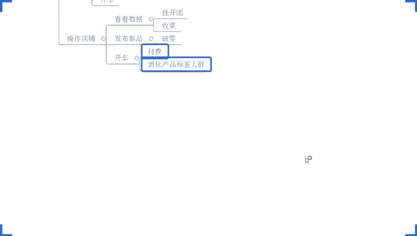
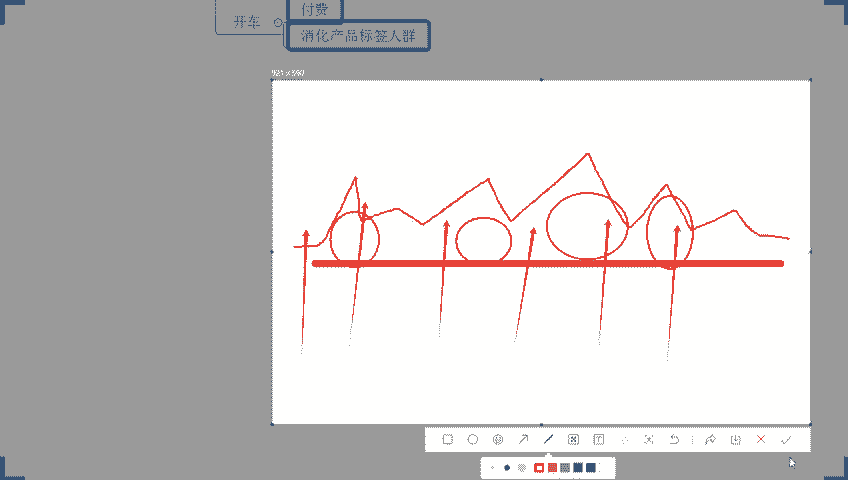
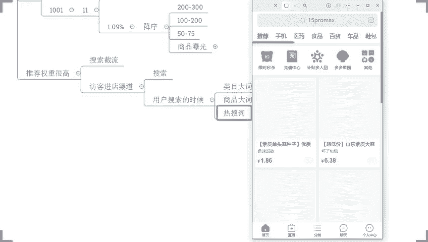
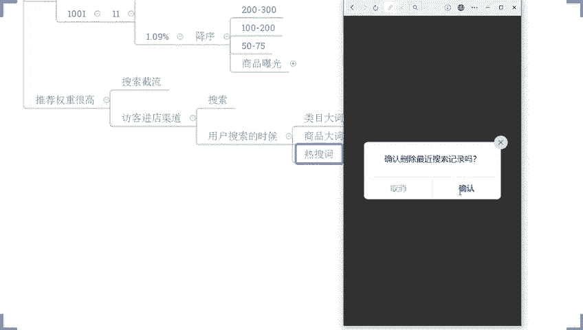
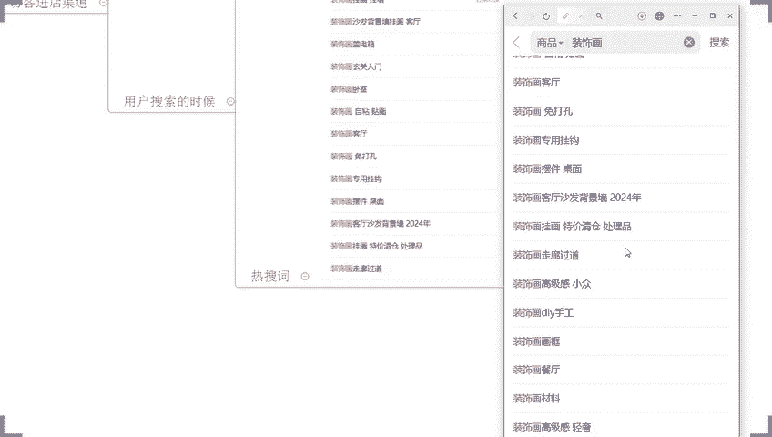
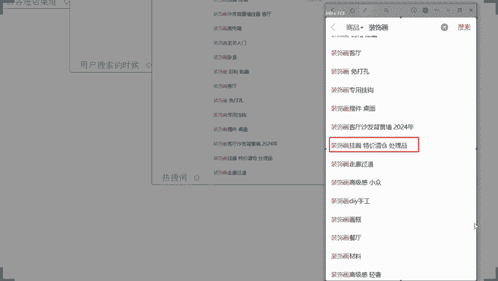
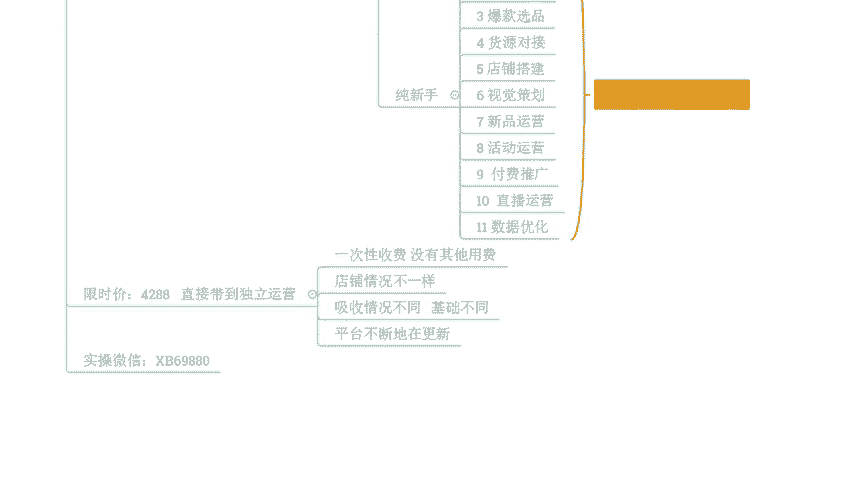

# 【拼多多运营】2024年最系统的全套拼多多运营教程，适合所有拼多多开店新手小卖家自学，10年资深运营师手把手教你从0到1起店实操。 - P49：49-拼多多搜索截流黑科技 新品快速拉升曝光 - 拼多多运营教程_ - BV1H62ZYREs4

Hello， hello， hello。呃，撤下麦啊，梅子啊，好久不见好久不见啊。呃，这边所有的在直播间的小伙伴们能够清楚的听到我的声音的，能够看到我这边电脑桌面的声音方面。如果说都没问题的话。

现在呢可以公屏上来来扣一个一好吧，来确认一下啊，呃，都没问题吧。来各位呃，能听到声音吧。😊，声音跟方面没问题的，小伙伴们啊，公屏上动起来啊，小一扣起来好吧。😊，OK没问题，对不对？好，那就行啊，那就行。

呃，那么还是老规矩啊，正式的直播时间呢在我们两点钟开始啊，还有一点点时间啊，我们呢一起等一等那些还在路上的小伙伴们啊，顺便呢把我们直播间的一些小的要求呢先说一说好不好？啊。

今天呢有看到有很多这一个新的面孔啊，也有很多老面孔在啊，OK的啊。那这些规矩呢，先大家讲清楚啊，免得等一会我们直播的时候呢。发生一些不愉快好不好？那首先第一个点啊，各位在整个直播过程中的话啊。

第一个要求那希望呢大家能够做到一个事情就是。积极互动。好吧，当我分享完某一个知识点的时候，当我跟大家确认是否能够听明白，能够听懂的时候，如果说你能够听明白，能够听懂，到时候记得公屏上扣个一回复我一下。

如果说是不清楚，没有你没有理解，没有明白，也可以直接说马上把问题提出来，我们马上解决，好不好？这一点的话非常非常重要，所以希望大家能够继续互动啊，因为如果说你不跟我讲，只是我单方面的在输出的话。

我也不清楚你的技收情况怎么样，对吧？我也不知道你的一个这个掌握程度怎么样，啊，我只能说以为你明白，以为你懂了。然后往后去讲，但是呢可能你真的根本就没有理解。

那么到后面呢可能所有的内容你是没有办法去吸收没有办法理解，没有办法去操作的。所以这样呢对我们店铺运营来讲的话，其实整个的分享就是没有任何意义的。好吧，所以这点呢希望大家能够明白。那同时呢在直播过程中呢。

我个人呢。不会说是像类似那些所谓的老师一样啊，去单方面的去输出具体啊似的去讲一些内容。所谓的东干货，对吧？没有意义啊，那我更多的呢可能会以提问的方式来进行。因为说白了有很多东西呢，我单方面去输出的话。

你们可能很难去很很难去吸收理解，很难去把这个东西搞明白，但是呢带着问题去思考。这样的话，你的一一个理解，你的吸收情况会更好一点。同时呢那么呃跟着问题去思考呢。

也可以帮我们去呃更好的去把这个思维逻辑给它理顺啊，所以这里呢也希望大家能够注意一下啊，那么这些呢也都建立在大家积极互动的前提之下，所以这个呢希望大家能够明白，那除了之外呢还有一点就是说在直播过程中的话。

我也清楚啊，可能很多小伙伴呢会有到自己的一些问题啊，会有到一些疑惑，对吧？也会想说那西楼我们能不能相互。交流探讨一下，对吧？把这些问题给他理顺一下啊，这个我我这个我也清楚啊。但是这里呢我要说一下。

就是说直播呢它本身时间有限，对吧？我不可能说呃，把时间专门的给到某一个人去解答问题，这个也不太现实，对吧？所以说在直播过程中的话，如果说你是有当前内容相关的问题啊，这种疑问啊，那么我们可以马上提出。

马上解决。如果说是不相关的问题呢，OK你先忍住啊，你先把这个问题记录下来，你先给他记好了，然后等到下播之后呢，单独提问都没问题的。好不好？所以这点呢也希望大家能理解啊。因为本身我们直播间的话。

人说实话啊，说的不多说了不少。但是呢如果每个人问一个问题。如果这个问题还跟我们今天分享内容不相关的话，那可能我们整个的内容是没法去分享的这是第一点。第二点呢，我们很多小伙伴呢可能也会技术比较薄弱一点。

对吧？可能还是属于一个没有做店的一个纯新手的一个状态。如果说是一些呃这个操作方面的一些各种各样的一些问题穿联在里面的话，可能他们没有办法吸收理解啊，所以直播时间的话。

我更多希望是能够把这个有限时间利用起来，能够去分享出更多东西，让大家能够去更好掌握店铺操作。好吧。那么这是第二个点啊，各位如果说这个没问题，O能够明白，能够理解的话，公屏上呢可以扣个2好不？

希望大家能够配合一下啊。所有人动起来哈所有人动起来。然后呢，除了这两个点之外呢，还会有到最最最最重要的一个事情。在我们店铺运营过程中的话，有很多人呢也会花费很多的时间精力去看所谓的干货视频。

看所谓的直播，对吧？包括我们今天的直播也是一样的，但是呢这里我要强调一个事情，什么呢？店铺操作啊很重要。那我们店铺的数据，对吧？像比如我给你们看一下，像这些店铺啊，那这些店铺数据也是一样的道理。

它不是说去看视频看出来的，或者是听直播听出来的对吧？我们任何人的店铺数据呢，它是我们去操作做出来的我们不去做我们店铺是不可能提高，不可能提升的对吧？所以说如果今天啊那么有分享这个内容呢。

是你自己没有做到位的。OK后面的话，我希望你能够在店铺操作过程中运用起来。啊，能够去什么去实操。你如果说不去实操，不去操作，不去使用，OK你听再多，你看再多都等于你。好吧。

那么这个是我们直播的一个小小的要求或者一个期许吧啊，三个点。当然了也有小伙伴可能是来的比较晚，刚来的啊，那么这几个点的话可能也没有听明白，没有听完整啊，但是问题不大啊。

因为这个目前为止的话也不是特别重要啊，重要的是一会儿我们在直播分享过程中呢，我希望大家能够去把这个思路跟上，能够去真正意义上的去有所提高，这个就很好的，好吧？那么呃也有小伙伴可能是第一次来，对吧？呃。

然后呢是不知道我是谁的，有没有我看一下啊。😊，我看一下有多少人啊，是第一次来的啊，公屏上来打一个第一次或者是扣个一，好吧，来，我确认一下哈。😊，动作快啊，如果是第一次来直播间的，然后呢。

或者是不知道我是谁的啊，是不清楚的，公屏可以打个一。好。OK呃，jason啊，然后还有这个呃清风雨猫啊，文静不文禁自评。运林枫叶啊都是低起来啊O那么第次来这个小伙伴的话，后面的话注意喽，好不好？

积极互动。然后呢呃问题如果是有的话，马上提出马上解决。但是前提条件是这个问题是我们当前内容相关的问题啊，那么另外一点的话，我是谁不重要。好吧？我是谁不重要。你也只要知道我是戏楼就可以了好吧？

那我也不用去给你们讲太多所谓的啊我的一些成功的经历之类的，没有必要没有意义，对吧？重点你要知道一个事情就是我是戏楼，然后呢你能在我这里通过我的分享能够有到帮助，有的提高就足够了，好不好？

那么呃整个的店铺操作呢，其实有很多很多的玩法啊，千奇百怪的玩法都有的。那包括我在日常的一些视频里面，包括我在日常的一些直播里面啊，有的时候分享出来很多。那么这里呢我要强调一个事情啊。

有很多人呢也愿意自己去操作，对吧？去尝试啊，但是呢可能有很多小伙伴呢去做完之后呢，发现有。😊，效果，但是效果并没有那么特别的理想，甚至有的小伙伴可能去做了，对吧？那么可能也会发现哎。

我做完之后发现好像没有什么太大的一个作用，对不对？那这里呢我也要顺便说一嘴啊。那在直播分享过程中也好，在视频分享中也好，我不会去给他尝一首留一首的这个了解我的人都知道，像别的地方那些所谓的老师什么的啊。

给你们去这个分享视频啊，做直播呀，可能更多的是在各种各样的打广告，对吧？给你们晒数据啊装逼对吧？但在的直播间的话，我更多的是讲干货，我不会去给你们讲太多没有用的东西或者没有意义的东西，对吧？

那么但是呢整个的内容分享呢也不见得所有人去做都可以得到一个很好提升。为什么？因为我们每个人的情况不一样。我们每个人店铺操作一个数据不一样，对不对？同样的玩法可能在别的类目是可以使用的。

在另外的内目可能是不实用的，所以我们在做店铺的时候呢，你一定要考虑清楚这个方法适不适合自己。啊，这个很重要啊这个很重要好不好？那同时呢那在做的过程中呢，我们要真正意义上去掌握它，吃透它。

去理解到它的核心逻辑是什么。这样子你去做的时候呢，才会有到更加好更加直观的效果，对吧？有很多人可能说听直播的时候看视频的时候觉得哎自己好像很懂了，对吧？但是呢只是说听到了这个逻辑能够明白这个逻辑而已。

但是很难去运用到自己店铺去进行一个分析去使用它。然后在做的时候呢，就会发现一个问题，就是做的时候啊无法无法下手，或者是做的时候呢，感觉怎么做怎么都别扭啊，我不知道今天直播间面有没有这种人啊。

有的话公屏打个6好吧？有的话公屏打个6好吧？就是听的时候啊，或者看我视频的时候，或者听的时候呢听直播的时候呢会觉得哎好像这思路呢就很清晰很这个顺畅。但是在做的时感觉好像是没有办法去很好的落地对吧？

有的啊有的像院星兴旺啊刷奶啊梅子啊置评啊，也都这种情况。😊，啊，还有这个运林啊，那这个东西很正常啊，这个我也说一下，因为很多时候呢我分享的时候，我是尽可能的去给大家详细的去讲解了，这个是这个是没问题的。

对不对？但是啊有一个点很关键，就是说你们每个人所能够去接收到所能够去理解到的，能够去消化到的部分只是你自己认知范围内的，你能够理解的。啊，或者是你听到的这些东西，只是你自己去呃吸收到的部分。

还有更多可能我讲的东西，我表达的东西，可能你根本就没有理解到，或者是你没有真正意义上去掌握它，就会导致说你在运用过程中出现一些问题。所以在直播过程中呢，我反复强调，你们一定要积极互动。

并且哪里不清楚不确定的地方呢，一定要第一时间告诉我好吧，这个非常非常关键啊，好不好？OK那么今天要分享内容呢叫做拼多多搜索节流黑科技新品快速去拉升曝光啊。😡，那么方法呢也是我们战略的方法，对吧？

包括像我自己，包括像跟着我12岁小伙伴，很多人我们都用这个方法啊。那么这个方法呢，其实在做的时候呢，并不是特别的复杂，特别的难。但是呢却会有很多人在做的时候呢，会陷入一些误区啊。

这点我先打打给大家打个预防针啊，所以大家如果一会儿在听的时候呢，有哪个地方不确定的地方呢，一定要第一时间跟我讲跟我确定一下，好不好？那在知识分享之前呢，我也顺便说一个，最近我发现一个问题吧，好不好？

最近呢我发现一个一个情况，就是有很多人呢。😊，就是对于店铺操作来讲的话，就是。会非常非常的一个怎么说呢？呃，就是想法非常的奇特吧。可能明明自己店铺什么都没做，然后呢，却抱怨说店铺很难做，店铺做不起来啊。

呃我我这边我顺便我顺便问一下，就今天目前在我们直播间的小伙伴啊，有没有人觉得拼多多店铺难做的？😡，嗯，有没有拼觉得拼多多店铺难做的？如果有的话，打个一好吧，我先确认一下啊，来动动快啊。

觉得拼多多店铺难做的小伙伴公屏打个一。😊，OK空白觉得难做难做啊，和下做觉得难做。然后包括像清风云包，还有这个艾特啊新英旺啊，也都觉得难做啊OK呃。呃，不觉得也不会看直播了啊。OKOK啊，没事啊，好吧。

是我草率了是我草率了啊。好吧，这个问题是我问的草率了啊。那这里啊我之所以会问这个问题呢，其实道理很简单，对吧？你们觉得难做，其实原因嘛，就是因为你店铺数据没有做好嘛，是不是各位应该是这样子的吧。

那么我现在想问大家一个问题就是。😊，你为了做好店铺啊，你为了做好店铺。对吧你做了什么，这个很关键。😡，啊，你做了什么？这个很关键啊，你们可以把自己为操作店铺做了哪些事情说出来，发到公屏上。好吧？

我有我这几天有好几个人啊都跟我讲，哎，这个楼这个拼多多感觉很难做，拼多多能不能做啊，对吧？我之前可能这个店铺呢有个几单啊，我这个莫名其妙店铺访客就掉了，我之前访客有个一两千了，对吧？访客也莫名其妙掉了。

然后我就问他了，我那你店铺你是怎么操作呢，你可以说一说你的操作情况，的数据情况你可以说一说对吧？那我们来分析分析帮你去梳理一下你店铺的一个遗漏的问题是哪里，去解决解决这个问题，对吧？

然后他跟我讲我店铺就没怎么做，对吧？我就是上传产品之后呢，就放在那里，对不对？看情况，如果说是这个有必要的情况之下，我可能会偶尔去少量的去烧一这个氛推广，对吧？我都觉得很奇葩，明明店铺你什么都没做。

什么都没干啊，反而会觉得店铺很难。做呃做了很大努力一样的，对不对？OK像梅子说，哎，我做了这一个销量评价，点击收藏，还做了成绩啊，开了车，想想得到的都干了。OK啊来。

梅子啊啊有没有人跟梅子是一个样子的啊？梅子梅子他做了很多事情，对吧？做了销量啊做了销量。😡，做了评价啊做了评价。啊，做了点击啊，做了收藏啊，做了成集。啊，还去开了车。对吧做了很多东西。

但是呢店铺的一个数据呢却并不理想。有多少人跟他一样的。来，有的话，现在公屏上打一个一，好不好？速度快，我看一下，我看一下啊，我看一下，然后自评说刚上了产品还什么都不知道，不知道怎么做，对吧？好。

没关系啊，没关系，一会儿不知道怎么做的话，我们一起把它梳理好就好了。OK。OK清风雨毛也是这个情况的，对不对？好。😊，那么现在呢我来我来给你们我来给你们讲一下为什么好吧，为什么说媒子做了很多事情。

反而觉得这个就不知道做怎么做，对吧？有的时候啊我我不得不提到一个事情，就是说你们很多人。😡，啊，你们很多人做店铺呢看似很努力，看似很用心，觉得自己也觉得自己已经把所有能做的该做的都做了，对吧？

确实是这个样子的，但是大多数时候呢完全是在做一些无用功。啊，知道吧？和体验分有关吗？你是指哪一个跟体验分有关吗？你说这些做完之后跟这个店铺没没数据是吧，跟田验分有关吗？有可能有关系啊。

不排除这个不排除这个可能啊，不排除这个可能。但是大部分的情况之下，我跟大家说一下啊，大部分的情况之下跟我们体验分没有关系，只是我们操作问题，为什么这样说呢？来，对吧？我们很多人上架店铺啊。

我们很多人操作店铺，对我我给你们我给你们模拟一下你们的状态吧，你们操作店铺。😡，对不对？你们抽了店铺，哎，现在呢早上起床之后呢，就第一件事情哎，看看店铺数据，对吧？😡，啊，早上起床第一件事情看看数据。

看完数据之后发现哎，好像店铺没什么访客，没什么数据。好吧，那怎么办呢？哎，我现在呢先去做几个开团啊，挂几个这个开团放那里。😊，对吧哎挂这开团放到你啊，逛完开团之后，哎，感觉已经差不多了。哎。

我去把头两天做的单子啊，我去看看有没有需要收菜的啊，收收菜，对吧？我去把评价做一做收收菜啊，那做完这个动作之后，哎，老链接呢就维持到这个地方了，该做的东西我也都做了对吧？该做开团的做了开团，该做收菜。

做了收菜，然后再下一步呢，我需要去做点新的产品吧。我觉得我这个导致产品呢一直起不来，没办法啊，我每天呢保持一个上新，维持店铺活跃度，对吧？哎，发布新品。😊，啊，发布新品，发布完新品之后呢。

我们新品也不能什么都不干了，对不对？哎，来个破零吧，对吧？来个破0。😊，是不是来个破宁做完破零之后，哎，感觉好像我这个店铺呢之前呢有个别产品呢还是有一点点数据的对吧？啊，虽然说没什么太多成交。

但是我觉得访客还是有的。呃，我看看这个访客数据是不是能够拉大啊，能够把它做做多一点，对吧？哎，我们又来做了一些东西，什么呢？针对到一些所谓的有流量有数据的产品呢，或者偶尔会出单的产品呢。

去放大访客去开车了，对吧？就做了这些事情，然后一天到晚的去搞这些东西啊，选所谓的去找链接发布商品，然后开这个破宁开团收菜，对吧？每天都在很忙碌的出去做这个事情但是？😊，一直在做的同时呢，却并没有考虑过。

之所以我们要做的事情的目的是什么？然后这边这一个呃这个这个这个。呃，这个这个名字是是一个藏文的这个名字啊，说呃譬如说基础搞好了DHR哪些都是1分以上，开了一段时间车之后开始脱下流量和呃这个销量下滑了。

为什么啊，问了这么一个问题，呃，这个问题原因有很多啊这个问题原因很多大概率啊，大概率啊，你们也都是属于这种上来就开车的一个情况，对不对？这里我也说一下啊，这里我强专门去给他强调一下这个事情。

你们店铺操作的话，如果说没有任何的一个呃流量的基础，没有很好的流量承现能力，你上来就开车的话，你店铺一定做不起来啊，这个地方我跟他说一下啊，为什么这样讲呢？因为你上来之后呢，对，没有自然流。

那么你的所有的数据呢，都会对你的付费啊，所抢占对吧？抢占之后的话啊，那么。原本的这个自然流没有得到放大。那么我们这个付费流呢是去消化掉了我自己的产品标签人群。啊。

然后又没有办法去放大数据的这种情况之下的话，OK那么你慢慢慢慢的这个。这个产品啊啊成交一定的单量之后，你会发现这个曝光就很难获取掉了。不是我是老店铺，老链接才会这样，这个跟老店铺老链接。

新店铺新链接都没有什么太大冲突啊，一个逻辑一个逻辑啊，好不好？这个赵文的这个这个小小伙伴啊，对吧？你这个链接呢本身标签是有限的，理解吧？标签是有限的。而你在整个运营过程中呢。

它是没有办法去获取到这个推广的数据的。😊，而你的新店铺新链接这种情况的话，它本身是有新品扶持，知道吧？所以它的人群范围会会更大一点。但是你一直推广之后，到后期它也会形成一样的一个结果。😡，啊。

我给你画个图吧，好不好？我给你们画个图啊，这个逻辑给你们画个图好了，好不？来看一下这边啊呃，假如说今天我们现在呢有一条线。😊。

这一条线呢是我们整个商品推广的时候呢，一个曝光线啊，好不好？这个是我们产品的曝光线啊。😡，来啊画一下当我产品能够在某些数据指标啊比较好的情况之下，它能够超过这条线，它就能获取到曝光。

我举个例子来假如说今天我们有一个产品对不对？唉，我们发布了啊，正常来讲，它在这个线下面对不对？它的标题呢哎比较优秀啊，能够去有到很好的产品曝光范围啊，能够去有到个别关键词呢，有到一个比较高的产品权重。

于是乎呢它会突出来一截，对吧？然后呢在后面呢我们还会有到某些属性，对不对？哎，它也能够去到很好权重，所以呢它也会冒出来一截，包括说我们的价格啊很低很低很低，有到很好的价格竞争力。好，它又会去冒出来一截。

对不对？啊，再往后呢可能我们还会有到啊我们的新品标呢得到一部分推荐啊，或者是我们的新品权重得到部分推荐。好到最后呢就是这个样子啊，那么上面这一个部分啊，这几个突出来的部分呢是能够去获取到曝光的。😊，啊。

是呃这这侧面没有了啊，这几个突出来的部分呢是能够获取到曝光的。而突出来的同时呢，它的曝光数据是有限的。注意曝光不等于访客啊，曝光不等于访客，但是这个时候可能我们产品是有曝光。

只不过呢没有很好的点击数据对不对？那于是乎呢我们访客很少的情况之下，我觉得哎我去开车吧啊，我去开车吧啊，我开车了，那么开车的时候呢，这商品的曝光呢是整体啊所有数据所有的维度都往上去拉的啊。

所有维度往上拉。那么就会形成一个状态就是它会从最底下啊这个部分往上提往上提高往上提高往上提高，对不对？虽然说看似我们整个商品的曝光增加了，但是相对的后期付费的这个曝光会把原本的所有的自然曝光付费掉啊。

这个覆盖掉，各位能理解吗？😊。

能理解吗？这个时候我们原本的自然报告就就会被覆盖掉。能理解的话，现在公民打一。😡，啊，能理解的话，公民打义啊。那么整个覆盖掉之后呢，我们自然流它就会损失掉自然曝光，也不会有到自然访客。

也不会有到自然转化。当自然数据它没有进入店铺的时候呢，所有数据成为付费数据。这个时候我们的自然访客就不会被放大。我们后期也不会有自然流。当你去依赖付费的时候呢。

OK后期呢整个付费就会一直陷入一个投放的过程中。一旦你停止付费投放，你的曝光就没有了。一旦我们商品的标签权重损失掉。OK那么这个时候呢，你的付费曝光也会减少。啊，复议包括也会减少，好吧。😊，啊。

出现这种情况，怎么处理提升我们商品权重啊？提示我们产品的曝关人群啊，对不对？这个没有什么特别的一个一个一个操作啊。然后像这个呃，这个这个赵文这个这个小伙伴，你因为你这今天这个问题啊，是水负费流的问题啊。

因为你今天提的这个问题是付费流的问题。所以说这个呃内容的话，今天我们先不着急，下播之后，你可以单独找我好不好？没问题吧。理解吧？OK okK okK啊。好，那么呃现在的话我们就开始往后去分享啊。

往后去分享啊。那我现在问一个问题啊，我希望大家如果说有在正式的，有在直播间里面在认真听的小伙伴呢，能够去认真思考一下这个问题啊，能够去认真思考一下思考一下这个问题好不好？那我们产品在日常的运营过程中啊。

我们产品在日常运营过程中啊，听清楚了啊，听清楚了。😊，商品的考核数据啊，对于考核数据来说啊。啊，对于考核数据来说，那么商品的考核数据第一个考核数据是什么？有没有人不知道的？啊，如果说是有知道的小伙伴呢。

可以把答案发公屏上。如果说是不知道的，可以打个问号，好不好？然后这边这个我我点个名啊。呃，赵总来，你知道吗？第一个数据是什么？知道吗？如果知道的话，公屏打出来啊，还有像我们的这个呃听海呀，对吧？呃。

和下呀，对不对？还有我们的E呀，来啊，你们几个呢也都算是老熟人了，对吧？可以说一说啊，可以说一说。😊，OK啊，梅子是有有讲到说哎，点击率啊，点击率okK还有没有别的不懂答案的？还有没有别的补充答案的？

然后金肤羽猫说是点击率点击量访客，然后这个亦说是商品的基础信息，然后星星望说是这个曝光OK啊OK啊，很多不同答案的。然后这个赵卓。来。你可以说一下啊你可以说一下好吧呃，你怎么你怎么想的这个问题你知道吗？

这个答案知道吗？😡，如果说不清楚可以打问号啊。如果说不清楚，可以打问号。😡，收藏量也算吧，对吧？清风女猫说OK啊，小创是不知道，对吧？心存善念说权重啊，我的天，你们这个越来越离谱了啊。呃。赵卓。

你你是你是不知道吗？如果不知道可以打问号啊，如果不知道，可以打问号，好吧，不清楚打问号。😡，这个问题应该对你来说是可以理解的呀。OK啊，空格说是这个点击曝光和销售额。好，行，OK。啊。

OKOK啊啊有很多小伙伴说了很多答案，那也有很多小伙伴不知道对吧？打了一个问号啊，打了一个问号没问题啊，没问题。那么既然是这个样子的话啊，呃。

那我们就先把这个关于我们产品啊在进行运营过程中考核的第一组数据，先说一说，这个是我们大多数人会忽略掉的一个东西啊，这个是我们大多数人会忽略掉的一个东西。刚刚其实你们有的小伙伴已经把答案说出来了，对不对？

像这个梅子啊，包括像我们的清风与猫都有提到过一个词，叫做点击率。😊，啊，要点击率。其实这个东西就是我们在商品考核过程中考核的第一组数据。啊，这就是我们在评商品考核中考的第一个数据啊。

有没有人有没有人这个想知道为什么。或者有没有人觉得哎，不可思议，觉得这个完全不法理解的。嗯。有如果有的话，给他解释一下为什么。好吧，如果有的话，给他解释下为什么。😡，如果说都清楚呢，我们就直接跳过。

因为这个其实点进去比较简单，我也不想去说浪费太多时间去纠结到这种问题。好吧。但是呢有一个非常重要的一点，什么呢？就是因为你们很多小伙伴呢在做店铺的时候呢，会习惯性的做一个事情，就是上架商品之后呢。

就上来就先去做什么所谓的销量啊，所谓的评价啊。😡，啊，所谓的销量，所谓的评价对吧？去做这些事情，然后呢却往往忽略了点击率的一个一个重要性啊，就会导致我们在整个商品权重考核过程中呢，你会处于一个被动状态。

很多时候我们店铺做不起来的原因，可能就是这些细节部分。你在你在操作的时候呢啊能够能这个忽略掉了一些核心考核因素。啊，不做没数据，没权重。应该是先测图吧呃，我的天。嗯，我我我确认一下啊我确认一下。

需要需要把这个逻辑给他家讲一下，然后讲讲这个操作吗？😡，需要的话，公民打个18吧，我确认一下吧。😡，因为点击率这个逻辑其实是相对比较简单的对吧？呃，如果说大家都清楚，都知道，那么我们就可以跳过的。

就我刚讲的呃，如果说都需要的话，可以打个一，我看一下有多少人。O还还不少啊还不少，包括小创啊小创也不知道对吧？也想知道是吧？OK的啊。呃，其他人呢O星星旺啊也是想知道的啊，玉林还有千啊，小峰志评院啊。

长记性啊，文静啊，O呃，其他人呢其他这些没有打问号小伙伴如果说都知道都清楚，都没问题的话，现在请你们打一个6，可以吗？😊，刚刚没有打过一的小伙伴们啊，如果说都清楚，都不需要知道的话，可以打一个6。呃。

那么这里呢我要我要说一个事情啊，兄弟们嗯在直播间里面的话啊，我不希望说存在这种呃既。什么都不懂。😡，又不愿意去沟通的人。对吧不要搞得你在直播间里面呃想要去提升，还要我求着你一样的啊，这就没有任何意义了。

好不好？如果是这种情况的话，完全可以退出去，不用在直播间里面没关系，对吧？我也不想去浪费时间，对吧？😡，理解吧？所以这点的话，希望大家能够去理解一下。

如果说你真的是认认真真想要在直播间里面去有所提高的话，请你最少保证一点你能够做到最起码的尊重啊。在我问问题的时候呢，你能够积极的回复我一下，对吧？如果说确实这个是你感兴趣的内容，哪怕你不感兴趣，对吧？

当我跟你确认的时候是不需要的时候，你也可以跟我说一说。是不是这是最起码的吧？呃，如果说不需要的话，直接退出去就好了。好不好？如果说是想要在直播间里面有到提高的话，那么请你记得当我问问题的时候积极回复我。

😡，这是最起码的一个，我在这里巴拉巴拉的讲，对吧？你在那跟大爷一样，是不是？😡，我懒得伺候你啊，好不好？我懒得伺候你。理解吧。我我觉得我说的这个不过分吧，兄弟们。😡，啊，如果说觉得哎，确实是个道理的。

觉得不过分的，公们打个6好不好？😡，因为去其实说实话，我平时也比较忙，我也懒得去花时间去给你们做直播。这个我实话实说。我每天做直播的话，也都是抽出时间来跟跟干嘛一样挤出时间来的，你知道吧？

所以我不希望说在直播间里面浪费时间没有意义啊。😡，然后呃看啊已经有两个人退出去了啊，赶紧啊呃不愿意在直播间里面互动的，不想听的，赶紧退出。好吧，当你们都都走该该走的都走完啊，然后我们再继续往下讲。😊。

如果说你OK现在不退出的话啊，一会儿你跟我说呃，这个西楼，你问问题，我不想打字，不想跟你说话，对吧？那你就等着挨骂吧，好吧，我这个人不惯着你的，对不对？我也没必要惯着你是吧？😡，好吧，OK啊。

那直接开始了啊直接开始了。刚刚这个点的话，其实有很多人小伙伴说是想要了解一下是吧，为什么？😊，其实道理很简单，对不对？当我们产品在呃。呃，可以可以，没问题没问题啊没问题啊没问题啊。呃。

那么当我们在进行店铺操作的时候呢，其实道理很简单，产品在进行一个平台收入之后呢，是会得到一个基础曝光的，对不对啊，是会得到一个基础曝光的啊。那么这个基础曝光呢？😊。

根据我们产品的呃所谓的商品的基础的数据，基础信息不同，对吧？得到的基础权重也是不一样。这个是会有到一定的数据的。那么这个数据呢，它是根据我们产品特性来的。如果说我们今天产品都是新品。

如果说我们今天产品都差不多，那么大概率来讲的话，我们产品得到的这个所谓的基础曝光，它的数据也不会有太大差异。啊，它的数据量啊数据量。不会有太太大差异，对不对？因为我们产品的这个相似度比较高。

包括我们产品的所谓的技术权重也都是一样的嘛，对不对？那么在这个过程中，平台它不可能说让我们所有的商品都展示在同样的位置。平台呢在前期操作的时候呢，会进行一个新品推荐，对吧？这个推荐的时候呢。

会让我们的商品啊去进行一个随机的展示。比如说今天啊你的商品在这个位置展示一会儿啊，然后过了一会儿我的商品在那里展示一会儿，对吧？然后你的产品呢在某某人群那展示一定的数据量。

那我的商品又去那个地方展示一定的数据量，对不对？它针对到相同的啊，比如说我们产品权重相同的话，它针到相同的一个啊相同的。😊，人群啊相同的。展示位置对不对？进行展示。展示之后呢。

这个数据量出来就会成为我们后期考核的一个重要核星啊一个重要的数据啊，那么这个数据呢就是我们讲到的产品的曝光，对不对？曝光的考核呢，它不是说考核曝光量，曝光量多少的话。

这个东西在前期的时候是没有办法去衡量的，对吧？也不会去考核，因为这是系统给我们的，但是曝光之后产生的数据是可以考核的，什么数据呢？就是我们刚刚提到的点点击率，对吧？假如说今天我们有两个产品，对不对？

一个是我们这个呃路人甲的对吧？产品A好吧？一个是我们这个呃清风与猫的对吧？产品B好不？那么这两个产品呢分别呢都能够得到相同的一个曝光数据啊，一个人得到了一000的曝光，好不？我们现在做一个假设啊。

这个曝光量其实并不大啊，但是我们可以做这么一个假设，我们来我们来进行一个评评判啊，那么商品A呢在进行1000。曝光获取的这个过程中呢，是能够去有到10个人啊，打个比方，10个人完成了这个点击动作的。

他能拿到10个访客啊，他能拿到10个访客。那么换句话说呢，他的点击率呢就是1%。啊，就1%好不好？然后呢，这个商品B呢啊它的这个图片呢做的相对来说可能比较优秀一点，对不对？它有啊100个人啊。

打个比方啊，假如说有100个人啊。今天他就比较猛啊，有100个人点击了他的产品，好不好？他的点击率多少呢？10%。😡，啊，10%啊，这个时候这个数据呢可能比较极端啊，这两个数据可能比较极端，一个特别高。

对吧？一个特别少啊。那么这个时候各位我就想问一句，如果说平台真的有出现这样的一个商品情况。那么在后期的时候，我们的商品，谁他在进行推荐的时候会更靠前是A还是B。然后运营枫叶说曝光有多少，我们可以看到吗？

这个看不到啊这个看不到。所以说我刚刚一开始就说了啊，这个东西我们看不到的，我们现在可以做一个假设，假设是什么呢？产品的形态是一样的，产品的状态是一样的。😊，对不对？

然后他们得到曝光呢也应该是差不多相同的，至少在理论上来说是这样子的，对不对？OK那么呃刚刚呢你们给到我答案呢，B啊啊非常统一，都是B有没有有没有不同答案的？有没有不同答案的？啊，然后这个易和夏啊。

还有武志阳，还有这个宋新成啊，还有这个呃。原位是吧啊，相濡以沫来可以说一说你们的答案，没声音了。啊，有声音吗？有声音吗？有是吧？OK啊啊，吓我一跳啊，吓我一跳啊，我的天。😊，啊，有有有是吧？

OK有就行啊，有就行。那个空格啊空格你看一下，其他小伙伴都说是有的啊，然后你看看是不是你设备问题啊，好吧，看看你你你设备问题是不是啊，好吧，这个给我给我下下下堆写来了啊。好，我不跳啊，我不跳，我飞啊。

我飞啊。😊，OK啊，应该用的是移动是吧？啊，移动的话你要移动起来啊，用移动的话，你要移动起来。😊，是吧最近有个梗啊要移动起来啊，是吧？用移动电话要移动起来啊。那么这个店铺操作来讲的话，刚刚我们也提到过。

对不对？出现这种情况呢，肯定是商品B，它的权重会更高。那么为什么呢？因为商品B它的点击率更高，对吧？点击率更高啊，点击率啊，点击率啊更高，然后呢，这个时候就会平台就会判定说这个商品呢它的一个平台。😊。

用户的斜动高。好吧，是这样子的。所以这个时候后期呢平台为了得到更好的产品的点击反馈，跟用户的体验，就会把更多的这种数据表现好的产品推送出去啊，让他们拿到更多的数据，那么这个时候呢，他点击率高。

访客多转化的概率其实也会更高的，是不是？所以是这么一个情况的啊，那么包括像我们操作这些小伙伴店目你们可以看到啊，从这个店目来，对吧？一个纯新店来的啊，各位有看得到公屏打一，好吧好？有看到到公屏打一。

对不对？有看到公屏打一啊，纯新店来的，对不对？早期的时候呢，我们也都是去重点去关注我们点击率的一个提升，😊，啊，当我们点击率提升之后，我们用户精准，我们整体的产品转化高，对不对？

这个时候我们才能够去反馈快速拉伸。看到没有啊？转化率做到21%，看到没有啊，当然了这个店铺呢客单价不高11块多，1块多的客单价一天做2700多单好。但是同样的一些客单价稍微高一点的，对不？

一样的方式都可以去用得到啊，像这个店铺看到没有？转化率也做到11%点几啊啊，对，这这个这个是新店来的，看到吗？前面是零访客啊，零数据的新店来的做起来看到没有？没，所以店铺的话。

其实像你们很多人觉得哎这个店铺新店现在是不是不好做，是不是不能做，不至于关键是方式方法问题啊，那么在这个时候各位如果说你现在去做新店去做新品的话，那么前期时候一定要记得先去把你的点击率做上去。

先去把你的曝光数据做上去。这个很关键啊，而不是说上来直接盲目的去做你的所谓的销量所谓的转化，这个没有意义，好吧。前面7天的时候呢，各位我说一下。😊，平台的考核呢，它是有侧重点的。啊，平人考核啊。

尤其前7天啊前7天。😊，那么这个时候本身我们商品是新品，所以他不会说上来直接考核我们的坑产，考核我们的产品的这个呃。🤧嗯。他不会考我们的坑场，不会考我们的转化啊。然后这小龙说看不见曝光率啊，这个怎么做？

OK不着急，我现在跟你们讲啊，我现在跟你们讲啊，前面7天的时候呢，听清楚了。😡，这个时候呢重点是以点击啊点击的一个人气来进行考核啊，人气进行考核好不好？人气进行考核。然后呢。

这一个考核权重部分呢占了60%。啊，占60%，然后呢，再就是我们的销量啊，再就是我们销量啊，这个部分只占了40%啊，只占了40%。而点击人气板块的话，它包括我们商品的点击率啊，以及我们的点击量。😊，啊。

你们不说怎么做吗？来，我们现在就展开来说一说，把把它怎么去做说一下啊。那么然后呢，销量板块呢，大家这里还有会还会的这个搜索热度啊，还会搜索热度，刚漏掉一个搜索热度啊，热度啊，这个是在最前面的位置啊。😊。

这在最前面个位置，对不对啊？OK这里啊，然后呢，销量板块的话，一个是我们订单量啊，单量啊，就是我们实实在在的这个销量了啊。另外呢还有就是我们的转化率啊，还有就是我们的坑产啊，还有我们坑产。

还有我们的UV价值，对不对？还会有到我们的同比市产率。😊，好吧，还有同比市长率啊，那么这个部分啊这个部分啊可以看到，如果说你先上来直接就去做所谓的销量，所谓的转化率的话。

它只是在40%的考核范围里面的一个小一个小的分支，就算是你做到顶破天了，也就只有40%的权重，考核占比只有40%。但前期你把人气板块做到位的话，它是能拿到60%的。如果说你只做销量，我只做人气。

在前7天的时候，我仍然会比你权重更高。各位这个逻辑明白的话，公民现在打个一啊，具体怎么做，我会讲，大家不用着急啊，具体怎么做，我会讲，大家不用着急，现在把这个逻辑先搞清楚好吧，所有人动起来啊。😡。

OK啊，都能明白就行啊都能明白就行。所以这个时候如果说我只做了人气，你只做了销量，那我的排名会比你更高更靠前。但是如果说我做了人气也去做了销量的话，那么我基本上就可以碾压你了。😡，是这样的一个情况啊。

那么刚刚你们也说了，哎，楼，但是你说了这个事情有点奇怪啊，你都不知道曝光多少，你怎么去做这个事情啊，对不对？曝光是多少，我都不知道我怎么去做这个东西啊，我没法做来注意看啊，曝光是多少。

我可我我可可不可以不知道的情况下去做，可以没问题，它不存在说任何冲突，好不好？我举个例子给大家看一下啊，现在假如说我现在呃商品呢是商品A好不好？我们现在的商品呢是商品A啊，我把这个商品A。

我我给这个拿拿个拿下来啊，放下来，我们单独来看一看啊，我们现在单独来看一看来，现在呢我们店铺呢是商品A好不好？这个一00是我们的曝光，但是我们是看不到的，对吧？这个东西我们看不到，啊，这个我们看不到。

各位思路先跟上好不好？先不要去提目的问题，你先把思路跟上，当我把这个板块讲完你们再来针对性的提问题。😊，可以吗？自评好不好？思路先跟上啊，思路先跟上好不好？来，兄弟们这个部分是不是看不到？如果是的话。

现在公屏打个一，动作快啊，思路跟上啊。这一个部分的话一定要把这个所有的细节搞清楚。😡，好，OK这个部分是我们看不到的，对不对？我们也不知道它是一个未知数啊，好不好？😡，O。来。

那么现在呢我们自己店铺有多少访客，你知不知道这个产品有多少访客，你知道吗？各位。😡，嗯，我们现在我现在发布了一个产品，这个产品发布出去之后，我们有多少访客知不知道？知道的话，我给打一个知道啊。

不知道打不知道。😡，OK这个是知道的，对不对？好好好，现在啊我们既然说知道了我店铺的访客，对吧？我们不知道我的店铺的这个呃曝光，我也不会知道我的店铺的点击率，点击率我肯定也不知道对吧？

因为点击率是我的访客除以我的曝光得到的，对不对？所以这个时候其实这里面呢是有两个数据，我是不知道的，一个是我的曝光，一个是我的点击率啊，但是有一个非常现实的问题。😡，我不知道我的曝光。

不知道我的点进率的时候，我只要访客增加，我仍然可以去控制，或者可以去提高我的店铺的一个整体点进率。给大家举个例子，现在啊我们这个100是我们假设的啊，我们就拿它来来来举例子。

那么如果说今天我们店铺访客是10个，我这个新链新链接发布出去，有10个访客，有10个人能看到我的产品啊，那么我的点击率1%。那这个时候假如说。我在这个基础之上，10个人浏览我的商品。

我有10个访客的基础之上，我现在去找一个人来完成这一个店铺商品的浏览，让它变成11个人。😡，那么这个时候是不是等于说我点击和我的曝光都变多了？啊，OK你先去吧啊，你先去吧啊。来，各位没问题吧。

这个时候我的点击和我的曝光是不是都变多了，我的点击变成了11，我的曝光变成了1001。各位没问题的话，公屏打一啊，这一个部分没问题，公屏打一。😡，OK那么现在我的。点击率是多少，有没有人去帮我算一算啊。

现原本我的点击率是1%，现在我的点击率是多少，反正是多少，我不管绝对会比1%要大，对吧？要大于1%，是不是要大于。😡，啊，1%。是不是啊当它大于1%的时候，我想问大家一个问题，它的权重是否有增加。

我们在进行商品考核的时候，如果说是商品A原本的这个数据和现有的数据来对比的话，那么它是多少？它是不是有增加1。09是吧？OK啊，我写一下吧，1。09%啊，1。09OK。😡，来是不是大于分之1？

那现在我再问一次，好吧，那商品A现在在我们找到一个人去浏览之后。😡，他的商品权重。和原本来对比是变高了还是变低了，认为变高了的打一个6，认为变低了的打一个2，好不好？😡，OK啊，答案还是比较统一的啊。

答案还是比较统一的对吧？都认为是变高了，对吧？那么这个答案对不对呢？当然对对吧？这个没毛病啊，这个没毛病。所以说如果说今天我想要去提高我商品的权重，我的曝光是多少的情况下，我不知道。

我想去增加我商品的点击率，我想增加我商品的点击人气，那么O你就可以让我们商品呢得到更多的访客点击，这个是我们可以自己认为控制的，我可以找我的朋友，找我的老顾客都可以啊，都可以啊，都可以操作这个事情。

至于说这个东西要做多少，对吧？那么刚刚也有小伙伴在问啊，这个呃我们这个数据要怎么做啊，做了什么样子对吧？做多少去对吧？有小伙伴在问啊，很纠结啊，一直纠结这个问题。那么这里呢我也说一下。

这个是没有一个明确的标准的，没有固定的数据的。😊，啊，那么我只能这样说。这一组数据的考核的话，多多益善。是不是？那么呃比如说今天我们的竞争对手他做了一个，我可以我去做两个，我去做3个。

那我的权能就会更高。我的竞争对手没有做，我去做了一个，我的权能就会更高。如果说我的竞争对手做了10个，我做100个，我的权能会更高，对吧？所以这个数据是没有一个明确的标准的啊。

而且大多数人可能是不会去做的。所以你去做，肯定会比你不做强，哪怕你只做了一个，对吧？也比你什么都不做要好的多，😡，啊，至于做多少呢？这里我给大家讲一下我自己的一个方式，好不好？像我自己带实操的小伙伴。

包括我自己前期我在做的时候啊，那么呃这个东西呢，当然这个东西听清楚了啊，结合我们自己实际情况，啊，你有经济条件的对吧？你可以去多做一点，你可以找一些资源去做的，没问题。你如果说呃经济条件比较弱的。

你找你的朋友去做的对吧？数据量做的少一点，也可以做反正你做的都比不做强啊，自己大家记一下啊，我自己在做的时候呢，前期我是做一个降训啊，我自己是做一个降训，你们可以参考一下啊。😡，我自己是做一个这样去啊。

刚开始的时候第一天呢我会先去做1个200啊，我自己是这样子啊，到300啊。然后第二天呢我会做100到200啊，第四天呢我会做到50到75啊50到75这样子的啊，这是我这是我自己的一个一个习惯啊。

这是我自己的一个习惯，前三天我会这样去做，后面第四天我就基本上不做了啊，后面第四天我就我就基本上不做了啊。然后这个时候呢，后面第四天的时候正常来说都会有到一个真实的自然曝光，商品曝光啊。

就会比较多的一个曝光进来啊，基本上这个样子的，资源可以分享一，肯定有的，有我肯定有啊，有我肯定有啊，但是我不确定你们有多少人想要对吧？啊，如果说想要的小伙伴可以公屏打个话，我看一下好吧，我看一下啊。

如果有想要的话，公民可以打个，我看一下啊。😊，OK啊，你看啊我就觉得吧你们这些人真的是很现实啊。回答问题的时候，我让你们扣个数字什么的，就没这么快啊，感觉你们就是有有好处的时候，马上就冒出来了，对不对？

😡，啊，这个也可以当然可以啊当然可以啊当然可以。😊，OK啊那这样子啊这样子啊，呃我这个人呢我也说实话，我不是那种小气人，对吧？啊，那些不愿意在公屏互动的小伙伴呢。

其实刚刚那会儿基本上被我已经给他喷走了啊，剩下的呢也都是愿意去互动，愿意去认真去分享去提高的对吧？所以呢这一点的话，我也愿意分享给你们，这个没毛病啊，但是有一点啊，我我要我要说一下啊。

有一点我要说一下啊，听清楚了，你们自己拿去用就可以了，不要外传。😊，好不好。啊，如果说OK没问题的话，现在再一次公屏上呃扣个一啊。😊，确认一下好吧。OK啊好，记住你们的承诺啊，我是愿意信任你们的。

希望你们不要辜负我好不好？因为这个东西是为你们自己好啊，这个东西是为你们自己好啊，因为什么呢？因为如果说类似这种资源用的人多了之后肯定会影响品质的，你知道吧？所以这个点的话。

我希望大家能理解你们给到我这个承诺去这样去做，不是为了帮我是为了帮你们自己好不好？所以这点的话，你们自己心里面有数啊，不要觉得哎呃我这个拿到手里面就是我的我想怎么弄怎么弄，对吧？我到处给别人用啊，啊。

没有意义，好不？来啊我把这个资源微信发出来啊，资源信发出来，你们稍等一下，资源微信啊，我去找一下啊。😡，OK啊，这边啊来。😊，啊，来，这是这源微信你们可以自己加啊，微信号我也发到公屏上啊，这边。😊，来。

这是微信号这是微信号，这是微信啊二维码啊，你们可自己加啊，然后公屏上我也发一下啊。呃，然后可以自己加啊，然后10秒钟时间吧啊，该加的赶紧加，然后来不及的小伙伴呢，赶紧截个图先啊好不好？呃，我先喝口水啊。

我先喝口水啊，搞定的小伙伴公屏打个6啊，已经加的小伙伴公屏打个6好吧，动作快。😊，啊，我加了是吧？OK啊，行，时间差不多到了吧，10秒钟间该够了啊，10秒钟间该够了啊。如果再没加了。

就是你们自己手术问题了啊。好吧，我水也喝完了。行了行了行了行了啊。好呃，然后整个的操作的话，我说一下啊，那如果说你资金充裕呢，做多一点。如果说资金少，你少做一点啊，可以去做一做，对你店铺是有帮助的。

好吧。像我自己带实操小伙伴的话，我给你们看一下，其实很多都有用这个玩法去玩的啊，等一下啊，呃。😊，我给你们找一个非常经典的一个店铺啊，好吧，我给你们找一个非常经典的一个店铺啊。

也是近期的一个一个一个小伙伴啊，我给你们找一个啊。来，各位有看到现在公屏上可以打个一，好不好？有看到现在公屏打个一啊，有看到现在公屏打个一。😊，啊。有很多的小伙伴啊，就是我们前期操作的时候呢。

也都是用这个玩法去做的。看到没有？上来之后看到没有？最早是临访客的一个新店来的啊，最早是临访客的一个新店来的，对不对？然后呢，我们都会用到这个方法去操作。看到没有？

上来之后呢先去做了一波人气啊做了一波这一个商品的点击，把这个产整个产品的一个曝光拉上去，这个点击权重拉上去，当这个产品在做了这个动作之后，首先你们要知道一点啊，这个商品的热度会很高，对吧？

它的热度会很高，商品的热度会很高啊。不管是这个搜索板块也好，还是点击热度好，它会都会很高。会告诉平台我们这个产品有很多人喜欢然后呢，作为新品板块来说，因为它的一个对标商品的话是相同的新品嘛，对不对？

它是同样的人群同样的展示位置的一些新的产品。那么这个时候我们产品整体的点击率很高。所以这个时候呢后期整个商品的推荐权重。😊，啊，推荐群众啊。会很高啊，然后整个商品的曝光范围会变大啊。

那么这个时候增加税据数据之后呢，我们整个的访客也会也会增加。好不好？就有了这样的一个情况。就是前期的时候，我们前面几天呢去做一个铺垫之后，后面的话看到没有？

到后面的话就是已经停止我们所谓的去做人气板块的操作之后啊，商品他的访客是开始慢慢稳定，必开始提升的。😊，而且各位注意啊，这个只是新品啊，这只是新品。好吧。那么做完这个动作之后呢，整个商品开始提升。

到后期的话，因为用户的点击率高，那么整个商品呢也会形成一个非常好的标签人群。😊，那么整个商品呢，如果说你在能够配合到一些所谓的呃新品的一些活动啊，一些优惠一个这个玩法，一些打法呀，商品转化率也很高的。

看到没有？这个店铺上来之后呢，转化率做到百分之十几16对吧？那么整体的转化上来之后，反馈也是快速拉伸，不断的提高的。前面这个阶段啊，因为它还没有太多的基础相量跟评价，看到没有？

这个阶段因为没有太多的基础相量跟评价，所以这个时候呢商品的数据成长其实很缓慢，它是一个非常稳定，非常非常平稳的一个过程，对吧？但后面这个时候呢。

它的订单已经出现了比较多的评价比较多的一些数据这个进来之后啊，产品转化开始拉升之后，看到没有？整个数据就快速增长，是这样子的啊，所以我们操作的时候呢，你们可以借鉴这个玩法去玩啊。

那同样的这个店铺呢也就我刚刚讲的用到这个方式去做的啊那么这里呢大家去搞清楚这个事情就可以了。那么另外还有一点呢，就是说我们在操作的时候呢，你不是说只去做了这个动作就。😊。

所以其实有很多很多东西是我们需要去做的，需要去操作，需要去铺垫的对吧？产品永远是核心。记住了啊，产品永远是核心，但是选择做什么产品是我们运营决定的。所以很多时候我一直讲产品占60%，运营占30%。

剩下10%靠运气。但是60%的产品部分是我们运营决定的，相当于我们运营要占据90%的部分。😡，各位能理解吧？所以店铺的操作的话，产品靠运营决定运营决定成败。好不好？如果说你不懂运营的话。

你只是去盲目操作，去混混这个混时间评论器，你肯定很难做起来的。而我们刚刚讲到的，除了这些操作之外，还有很多的细节。为什么这样说呢？来给他说一个非常非常现实的问题。我们产品是不是只要有点击就够的。😡。

一定不够，对吧？包括我刚刚也说了，我们产品在这个经营过程中呢，在这个期间啊，看到没有？在这个期间你是需要去操作我们商品的基础权重技术数据的，让后期我们产品有到一个比较稳定的一个呃比较好的数据反馈。

我们好的销销量数据，好的这一个呃评价。😡，啊，当然啊这些数据怎么来？看你们自己啊，像梅子啊，我说实话啊呃，有多少人跟跟现在跟梅子有一样的疑惑的。来，有的话，现在公平声打个问号，好不好？😡，如果有的话。

公民现在打个问号。😡，啊，各位来这么快啊，跟梅子一样，现在有这个疑惑的公屏打个问号。😡，是不是说哎那我们还是得去补单，做销量做评价呀。OK各位兄弟们，记住了，如果说你做店铺，你只知道。😡，补单的话啊。

那么你的成长一定有限。店铺操作呢有很多种方法，我们要知道一个事情，就是我现在这个阶段，我们刚刚讲到的，我是需要去做出评价来，我需要去做出销量来，对吧？这个没毛病。

但是我们做出来这个东西不是代表说一定就是我自己去补的。😡，补只是一个手段。各位能理解吗？不只是一个手段，你要知道一件事情，你产品现在是有曝光的。如果说你能够在这个曝光里面能够去引导真实转化。

那么这个才是很厉害的。各位能理解吗？当有了知识转化之后，我们商品才能够去有到一个相对比较不错的后续的一个呃更好的标签人群才能够像这个店铺一样，对吧？能够把转化拉高，所以这个是很关键的一个点。好吧？

那么怎么去做这个呃真实转化啊，这个我在呃下一次啊，呃，专门给大家讲一下啊，只不过今天我们先给大去打一个预防预防针啊，那么今天我们先把前期的一个另外一个部分给大家讲清楚。因为这个是基础。

如果说这个基础没有的话，那么后面的所谓的所谓的这个转化的引导，所谓的这个订单的引导都等于您什么东西呢？曝光啊曝光。前面呢我们做了这个呃所谓的呃操作我们产品的。😡，访客来拉伸基础的权重，对吧？

提升我们产品的这个人气来获取到推荐曝光，对不对？这里啊推荐权重变高，拿到推荐曝光，这个只是一方面。另外一方面呢，我们还要去操作一个东西，让我们产品形成一个很好的流量垄断的构成。什么方式呢？来听清楚了。

搜索金流啊搜索金流啊，注意这个不是你们平时听到的那些所谓的去刷关键词，或者那些所谓的高价这一个爆款截流的一些低价玩法，好不好？听清楚了啊，这个不是这个东西啊，是什么呢？来，我说一个东西，产品的访客。

通过什么渠道进入我们店铺的啊？如果说今天我们作为一个消费者，我想要去买一个产品，通过什么渠道找到这个商品是最快速最方便最精准的。来，各位说一下。😡，啊，是哪一个？O梅子说搜索对吧？搜索ok搜索。😡。

搜索好，这一点的话我相信是不存在任何争议的，一定是搜索啊新存商店没有没有或者推荐这个东西，没有或者啊没有或者就是搜索。因为我作为消费者，我主动去找到某一个产品。

我去通过搜索关键词去找这个是搜索端口来的啊，一定是搜索一定是搜索。但是各位要知道一点啊，我们平台的这些用户在进行商品搜索的时候，他搜的词是什么词。😡，啊，用户搜索的时候。收了块键你知是什么事？😡。

肯定是我们所谓的一些类目词大词，对吧？一些所谓的商品的大词。啊，所谓的热搜池。对吧我举个例子好了哎，你们你们做什么产品的？来，我问一下。😡，你们做什么产品呢？我们来举个例子好不好？你们做什么产品？

我们来举个例子来呃发公屏上啊，发公屏上，你们做什么产品呢？来发公屏上啊，具体产品的关键词啊发出来啊。OK心存善链说装饰化。😡，好吧，装饰画啊，来来来来来来来来来所有人啊，所有人现在公屏上打个一，好吧。

所有人现在公屏上打个一。😊，啊。OK我们现在不用纠结你们你们自己现在目前做什么的了啊，我们就说装饰化。因为装饰画这一个新春商年它是第一个发出来的啊，那方法比较重要啊，做什么产品，我们拿什么举例子。

这个其实是小事情来的，好不好？这很关键。来，我现在去打开拼多多啊，我现在去打开拼多多啊，我们现在去搜索一下关键词装饰画。😊。

好，假如说我今天我要去买装饰画啊，我作为一个消费者，我要去买装饰画。现在我想问大家一个问题，我会不会就是说直接去搜索这个关键词装饰画。😡，这是我如果说想要去买装饰画，肯定啊最快捷的方式，对不对？

这个是这个是不存在争议的嘛，对吧？那么这个时候呢就会有到一个问题。这个装饰画呢会有到很多很多其他的一些所谓的属性，所谓的修饰词，所谓的这些其他的一些这个呃长尾词在我们的下拉框里面，对不对？

可能啊里面有符合我需求的啊，我可能就需要的是自粘的贴画，或者我需要的是免打孔的啊，或者是我需要的是这种呃这个放到走廊过道的对吧？它有呈现的位置，它有这个呃使用的方式啊，对吧？

它有各种各样的一些关键词在里面。😊，对不对？它有各种各样的关键词在里面啊。那么最大的词呢是装饰化。其次呢，我会根据装饰画这个所所谓的这个推荐关键词呢去找到符合我自己需求的去点击搜索，对吧？

这是我们正常的一个操作。但是这个地方我说一个事情。这些词如果说用户去搜索，我们作为一个新店，作为一个新品能收到我们吗？嗯，我们能够有到一个比较好的排名，拿到很多的曝光吗？嗯。😊，不能对吧？不能。

那既然不能我们的商品拿不到这个保王怎么办？我们能不能去有到一个很好的用户的一个呃这个呃进店，有的很精准的访客不太现实，不可能甚至是对吧？可能我们更多的时候呢，我们产品展示的位置特别靠后。

或者是极个别的时候呢会进行一个推荐，展示在一个比较靠前的位置。但是这个靠前的位置呢，它却并不精准。😡，啊，知道吧？所以说是这么一个情况的啊，好吧，所以说这个情况的，好吧？然后像在新春三店啊。

这个地方来明白的话啊，现在可以公屏上打个一啊，新春三店啊，这个点的话，我相信你应该是能够清楚的，是不是？那在这个过程中的话，我们怎么办？嗯，刚刚还记得吗？我们现在前期的时候做了一个事情，做了什么事情啊。

我们前期的时候呢去做了一个操作叫做提升我们商品的人气，其中有一个环节叫做商品的搜索热度，对吧？其中一个环节叫做商品的搜索热度，那么这个时候我想问大家一个问题啊，如果说今天我们的商品啊。

如果说今天我们的商品被人用关键词搜索，疯狂的搜索，疯狂的点击这个搜索的量比较大。😊，啊，搜索的量大啊，并且呢点击率很高。那么这关键词后期我们的商品能不能得到一个很好的展示？一定是能的。啊，一定是能的。

所以说有的时候我们想要去做我们产品的权重，不一定非得去做所谓的刷单，知道吧？😡，逻辑搞清楚之后呢，你们才能够有到更好的方法。但是这里有到一个问题，一个小小的bug，对吧？虽然说这种情况之下。

我们有机会得到曝光，但是这些关键词同行都在用它的难度是不是很大，让我们产品被收到，并且有到很大量的数据进入我们店铺，它的难度真的很大。😊，是不是这个时候就好比说呃，我们这个呃吃饭一样的对吧？

我们还是小孩子，我们吃一碗饭就吃撑了，吃不下，我们可能只能吃半碗饭。但是人家是一个成年人，一顿能吃三碗大米饭，对吧？你你跟他能比吗？你说你的搜索量大，你能再你再大能有多大，你能有别人大吗？😡，你不能。

那怎么办呢？来，各位认真看啊。所以这个时候呢我们就可以做一个另外的小的骚操作。这个骚操作呢，别的地方你们是一定听不到的。甚至我可以这样说，你们在其他地方你们去花钱，你们都听不到，好不好？

所以这个时候以下我要讲的这个部分，大家一定要认真听。😡，现在已经准备好的小伙伴，公屏上六打一波，好吧。这个部分的话就很关键了啊。当然如果说呃你没有听出听清楚，没有听明白，没有理解到，你可以直接跟我讲啊。

我我尽可能的给你们讲的详细一点。😡，好吧，OK啊，那么什么操作呢？来，各位，我们还是回到这个界面来。现在呢我我问大家一个问题啊，我问大家一个问题，现在呢你没有到一个关键词，比如说像这个啊。

比如像这个装饰画挂画特价清仓处理品啊，那么这样的关键词，如果说是你正常去通过输入方式去搜索的话，你会这样输入吗？各位觉得会的，扣一，觉得不会的扣2。😊。

嗯，来。这样的关键词你会去输入吗？

不会对吧？那么他为什么会出现在这个位置呢？如果说你都不会去搜这个关键词的话，他为什么会出现在这个位置呢？跟特价不特价没关系啊跟特价不特价没关系啊。那我说一下啊，我说一下。

因为这个词在跟我们装饰画这个关键词，它有到一个比较高的相关性。搜索装饰画的人，有很多人对挂画，对特价清仓对处理品这样的一些信息是感兴趣的，有很好的商品需求。于是乎呢平台也会把这样的词。

这样的属性加入进来，进入到下拉框。这个是通过需求来的啊，这通过需求来的。那么这个需求通过什么样的方式来体现，一个是搜索，对吧？一个是转化。各位。能理解吗？一个是搜索，一个是转化啊。

它通过这项的东西来来体现出来的啊，通过这样东西来体现出来的。那么如果说今天我们有一个产品啊，也是装饰画啊，这个装饰画呢，我我们来我们来看看这里面有些哪些词啊。😡，啊。

OK啊假如说啊假如说啊各位啊假如说今天我们有一个这个装饰画，我我我不知道你们有没有有没有知道的，类似那种呃类类似那种这个钉子，然后呃拉铁丝牵出来这种画啊去做出来这种画。

我不知道你们知不知道有没有人知道的啊，有没有人知道的，有的少公屏打个一啊，有多少公屏打个一。😡，啊，小宋知道对吧？OK这个欣欣也知道啊，呃，然后有很多小伙伴可能不知道，对吧？那没关系啊。

我们就举个最通俗易懂的吧。假如说今天有一个有一幅装饰画，这幅装饰画就是十字绣，好不好？这时候这幅装饰画呢就是十字绣。😊，好不好？假如说现在我们有一幅装饰画，这幅装饰画呢就是十字绣。😡，可以吧，好吧。

我们举个例子，打个比方啊打个比方，现在啊现在我们有这么一幅装饰画。😡，或者说我们对我们这个装饰画呢给它做了一个定义。这个定义呢是跟我们装饰画的风格，或者是它的一个展示的环境。

或者它的一个特性来进行一个描述的。但是呢它绝对是符合装饰画的一个定位的。于是乎我们把它放到上去啊，放上去。那么放上去之后呢，在这个关键词里面，在这所有的关键词里面是没有它的一个所谓的。

我们给它定位的这个关键词的。比如说十字绣这个词啊，于是乎呢我的产品呢，我就用到。装饰画。十字绣对吧？装饰画十字绣摆件桌面，装饰画、十字绣、免打孔、装饰画、十字绣、客厅、装饰画、十字绣、走廊过道。各位。

我把这些词跟十字绣所进行关联。各位，这个时候这个逻辑现在是能够听明白的，公民打印啊，我把我的十字绣这个词放进去了。然后呢，我的标题里面是包含其他的这些关键词的。😡，啊，我的标题里面是包含其他关键词的。

然后呢，其他的所有关键词呢也都是平台所谓的热搜词，只不过多了一个所谓的冷门词十字绣这个词，这个是别人没有在用的，是我自己在用的啊，至少在装饰画这个领域里面是我在用的啊。那么这个时候我用到这个词之后。

这个词本身是没有人在搜索，搜的人很少，对吧？搜的人很少。那这个时候如果说今天我去有到很多人搜索装饰画十字绣这个词。这个时候这个词它变得是不是就有到很高的需求？啊，有很多人搜索，并且进行了商品的浏览点击。

对吧？那么这个时候这个词也会变得有到很好的需求。各位。来同意的话，公屏打个6啊。同意的话，公屏打个6。😡，那假如说在这个有很好的收入的时候呢，还会有人去成交，那么这个词的需求就会变得更高，对不对？好。

现在问题来了啊，我们一开始说的这些关键词对吧？啊，所谓的什么装饰画、免打孔、装饰画、客厅、装饰画、走廊过道，我们如果直接用这些词收我们产品可能收不到。

但是如果说我们是装饰画、十字绣、走廊过道、装饰画、十字绣啊，客厅装饰画、十字绣、餐厅装饰画、十字绣DIY手工。😊，那么我们商品就可以被收到，对不对？所以在前期的时候，刚刚我们回过头来看到这边啊。

就像这个店铺一样的。如果说我在这个阶段啊，我在前面这个阶段，我用到这些人去帮我去提升我商品的人气的时候，是通过这些词来完成搜索的，并且通过这些词来进行一个订单的提交的。

那么这个时候这些关键词就会变得很好的热度，并且被平台所记录进来。当它的数据量达到一定数据的时候，O这些词呢也有机会进入到我们的下拉框。比如说我们做装饰画的话，它可能直接进入装饰画这个领域里面会很难。

但是如果说是装饰画客厅，对吧？这个时候可能十字绣这个词就会出现在这里面。因为这个词后面这些词它可能本身就没有什么太大数据。那么这个时候这个产品进来之后，这个词进来之后，用户看到这个词的概率就会比较高。

而且搜索它的概率比较高。而搜索这个关键词的人呢，也都是对我们产品有很好的需求的人。😊，于是乎呢，他们在后期的用户精准度上是可以得到保障的，也可以得到转化。各位，现在这个逻辑没问题。公民打一好不。

这个逻辑没问题，公民打一。并且来说还有一点啊，那么这些关键词呢是因为同行没有在用，我在用，对吧？所以这个时候呢，这些关键词我们操作的时候呢，相当于我自己就可以形成一个垄断。嗯。所以这就是差距。好吧。

这就是差距。很多时候你们在说店铺操作很难，店铺操作就是没有办法得到访客。有的时候是因为你不会做，知道吧？如果说你上来去做一些所谓的平台大慈热势的话，你跟同行竞争你能竞争得过吗？你竞争不过，知道吧？

你竞争不过。😡，当然呢，你如果说哎我确实我产品有很好的优势，我能够去通过价格优势，把我的产品的其他这方面的这个权重流失弥补起来，我去操作，可以，没问题。但是大概率你是做不到的，对不对？😡。

但是我们有更多其他的方法去帮我们完成我们平台的流量获取，完成我们产品的曝光获取，得到更好的转化，得到更多订单。所以店铺操作有的时候难，并不是真的难，而是因为你自己不会。😡，那么现在我想问大家一个问题。

啊，现在我想问大家问题，你还认为你对于店铺操作来讲的话，你觉得难是因为你做了很多你要做的，做了之后没效果吗？😡，嗯，来各位来。😊，现在啊我再问一下，你们觉得目前来说你的店铺。😡，数据差。是你做了很多。

啊，努力很努力了。啊，很努力了。没有效果吗？嗯。你们可以说一下啊，觉得是的，可以打个一，觉得不是打2。好吧，更多时候其实根本就不是说你真的有多努力，你真的做了很多，是因为你根本就没有做到位，知道吧？

你做都做偏了，你路的走偏了。😡，理解吧。你已经走偏了，然后呢，你做的这些所有东西其实都是无用工。😡，你能有效果吗？你有效果才有鬼。😡，是不是啊没有方式方法，像新上面，你现在还是这样子，也没有方式方法吗？

啊，你现在也是没有方式方法吗？然后梅子说感觉只一点点就能突破啊，呃，还是有点迷，没关系啊，没啊，可以多多了解一下啊，现在好多了是吧？好多了的话，加油吧啊，正像你自己的话。

之前也是讲说呃这个想要去好好去提升的，对不对？但是呢可能在这个跟合伙人的沟通方面出现一些问题。反正我是觉得吧，如果说你后面真的想要提高的话，O的，可以好好去沟通沟通，可以直接跟实操的好吧？

然后像这边的话，像这个新希望说还是有这个老师带着才好O了啊。这里我也说一下啊，如果说你们现在是属于这种情况的，就真的啊自己目前是没有方法的。😊，对吧然后整个操作呢也没有经验。😡，对吧同时呢。

在操作方面也没有资源。对吧属于这种三无商家的对吧？你如果真的想要好好做点想把店铺做起来，OK的啊，可以跟着来实操好不好？跟着来实操的话，起码一点啊起码一点你可以减少这个资金的浪费啊，然后减少时间浪费。

😊，啊，可以减少走弯路，好不好？😊，像你们自己做店铺的话啊，就是很简单。那么所有的这个操作人呢都是凭着自己的感觉去做的，浪费时间，浪费资金，对不对？那如果说跟着实操的话。

起码有一点像很多的这些所谓的你们不知道的，你们没听说过的方式方法，我可以带你们去做啊，是这样。如果说有兴趣小伙伴呢工应可以打个6啊对，是要收费的。但是的话不是说你愿意花钱就可以了。运林啊。

如果说有兴趣小伙伴工龄可以打个6啊，我跟他说一说这个实操方式，包括说一些要求啊，先说一下符合我条件我才会收的啊。如果不符合条件，那抱歉啊，多少钱我都不收的这个是一个最起码的要求啊，最起码的一个标准啊。

因为我需要对你们负责，要对我自己负责好不好？O啊然后这个金风猫啊运林还有新情旺有还有这个梅子那么可以认真听一下啊，以认真听一下。首先第一个问题啊，就是说如果说你真的是想好好去做店对吧？

当然长期做店不是那种做的好玩的啊，可以长期做店的啊，不是说。😊，就是一时冲动啊，就是想试试水这种感兴趣，想试试水啊，玩一玩的这种么啊，你可以跟来实操啊。同时呢你是能够去有到一个比较好的执行力的啊。

能够去好好落地执行的啊。😊，啊。不是那种就是啊这个声林打闭连连上网的这种的可以来啊，可以跟着实操。同时呢还有一点就是你能够在我们白天时间，像周一到周六啊，周一到周六白天时间啊。

也能够抽出一个小时以上时间。跟着实操的对吧？比如说像我们啊早上你有空O抽出时间来，我们来沟通店铺的操作方面的问题。然后你去捞底咨行，或者我们下步有时间，我们可以下步沟通，对任何时间都可以。

那么整个的这个时间要求的话，我听清楚了，不需要你说是一个小时完整时间，顺便花时间就可以的。如果说O这些都没问题，公民可以打个一好不啊，清风与毛没问题吧？清风羽毛没问题吧，还有我们的这个玉林，还有新兴旺。

还有杰son啊，还有我们的梅子没问题吧，O清风羽猫没问题啊，新兴旺也没问题O那么这个没问题的话啊，森也没问题好O啊，那么接着往下啊，我再来说一说啊，我再来说一说啊，ok艾也没问题是吧？好。

那我再来说一说啊，除了这方面之外的话，😊，那么根着实操的方式听清楚了啊，方式方面你们要搞清楚，你们要听懂啊，听明白才行的啊，方式啊，实操方式啊，实操方式。实操方式啊。那么听清楚了啊。

不需要你去看视频看资料啊，不是看视频。😡，看资料好吧，那么而是干嘛呢？而是直接干嘛针对到。😡，你店铺针对你个人情况。啊，然后进行单独指导。啊，进单录知道，好吧。什么意思呢？OK听清楚了。

你把你的子账号开给我。😡，啊，你把你的指账号开给我啊，然后呢我会针对到你的店铺，带着你一起我们去分析啊，分析什么呢？分析我们的店铺有什么问题。😊，啊，分析完这部问题之后。好，针对到这个问题呢。

我们需要做什么？我们为什么要做这个？😡，然后我们怎么去做？我会把这个给你讲的很清楚，然后再按照给到你的方式方法去落地执行。操作过程中有任何不理解的地方。直接反馈跟我讲，我再跟你说怎么去玩。

包括说在你操作之后，对不对？因为子账号在我手里，我会看你的操作数据，对吧？然后如果说数据上有什么问题，我们可以及时调整查缺补漏。😡，好吧，其时调整参有不，这个是实操啊。

这是实操OK那么这个针对到是我们有店铺有数据的一些小伙伴啊。那如果说你是纯新手。😊，啊，如果说你是纯新手啊，来看一下，那么你还没有开店呢。OK首先呢我们带着你一起做一个动作，叫做市场分析。😊，啊。

就是市场分析啊，那我们去搞清楚我们想要经营的这个平台，我们想要经营的这个品类，我们想要经营的这个产品，它能不能做它的市场体量大不大？它能够卖多少东西出去，能不能赚到钱，把这个搞清楚，搞清楚之后。

接着再往下呢，我们做竞争分析。😊，啊，我们做竞争分析，我要搞清楚我的竞争对手是谁啊，他是怎么操作的。那么他的优势是什么？那我如果去做的话，我应该如何去跟他竞争，我应该怎么去做好我产品的定位，对吧？

这个是我们需要去了解的一个事情，做完之后好，我们再来去做我们的产品的什么爆款定位啊，爆款选品啊，选品吧啊，直爆款选品吧。那么做完爆款选品。好，我已经知道了，我要找什么样的产品，我去找找到之后。

我们怎么去跟我们的供应商谈判。😡，货人对接怎么对接？我们去怎么怎么去啊怎么去洽谈啊，哪些细节要注意什么？怎么去找艺术货源。好，这个我带着你去完成。同时做完这个动作之后，好。

我们继续往下去做我们的店铺搭建啊，我们怎么去做我们店铺搭建，怎么去做我们上面的布局，把这里面搞清楚。做完之后呢，我们的视觉策划应该怎么去完成。😊，我怎么去突出我产品的卖点。

怎么去突出我的这个呃产品的一些差异化的东西，怎么去让我产品变得有到更好的点击率。怎么去策划我产品的一些活动图片。😡，等等啊，这东西搞定搞定之后，再往后呢，就是我们的新品操作。啊，做完新品操作之后。

OK的。再往后呢，我们就要去针对到我们的数据进行分析优化啊，包括说我们可能还会涉及到一些活动提报。😊，啊，活动运营对吧？活动运营。那么包括说我们后面可能还会涉及到一些付费推广。😊，啊。

甚至说我们还可能会涉及到我们的直播运营啊，那么再再往后呢，可能我们还会涉及到我们的数据优化啊等等。这所有的细节都是我带的实操。换句话说，你如果说有基础，我们针对店铺直接来。如果说你没有基础零基础。

从零开始。😡，好不，那么这个是实操方式来，各位实操方式。如果说也没有问题的小伙伴，公民和现在打一个6好不好？来清风羽毛、新兴旺、梅子杰s、运林艾特谷志阳啊，实操方式如果说没有问题，公民可以打个6好吧。

来动动快啊，那么这个是我们具体的要求跟这一个方式啊，那么这些如果都没问题好，那么可以跟着实操啊，福利也是啊福利也是啊星星旺也是啊啊，很多小伙伴都是没问题的，对吧？时间跟方式都没问题。好，那么我说一下啊。

比戴运音靠谱多了那开玩笑的对吧？那开玩笑的。那这里呢我说一下啊，整个实操方式，我说一说，因为我不是那种培训教学更有菜的对吧？所以说呢他的一个这个要求也会比较多一点啊，像我们的时间要求方面这些东西啊。

也会比较多一点，这个也是没办法的事情啊，那么如果说可以做到的，那么可以来，但是同样的道理啊，那么这个也是要收费的而这个费用的话呃不会说是特别的便宜，但是你也放心不会特别的变态特别的贵啊，那么目前来讲。

😊，的话整个的实操来说，限时价啊听清楚了啊，限时价。啊，限时价好不好？限时价4288啊，限时价4288啊，这个是实操费用啊，这个是实实操费用。然后呢，整个实操呢是直接什么直接带到。😊，独立运营的。

什么独立运营呢？就是说你能够自己独立去完成店铺操作，你能够脱离我的帮助之后，清楚的知道店铺在不同的阶段，在不同的情况之下应该去做什么，怎么去做这个叫独立运营，并且在独立运营之后。

如果说店铺有什么这个呃新的一些玩法出现了啊，或者是有这个什么新的一些问题出现了OK随时找我，相当于呢我就是你的店铺顾问啊。那么后期而且是不需要任何二次收费的啊。时间方面啊，时间方面我说一下啊。

这个费用的话，我听清楚啊，不是说一个月还是总的啊，是直接一次性收费，4288，后续没有任何其他收费的。😡，玉林明白扣1啊，包括说我们其他小伙伴好不好？像这个呃五只羊对吧？梅子啊，玉林、金牛旺、福狸。

还有我们的这个金龙鱼猫和下啊，还有月亮啊节省好不好？那么这个费用的话，一次性收费啊，后续是没有其他任何收费的，好不好？包括你独立完之后的呃这个店铺指导这一块的话也是免费的，不需要你二次收费啊。

所以这点了解清楚啊，那么费用啊，这里我写一下吧，我写一下啊，一次性收费，没有其他啊收费啊，没有其他费用啊，没有其他费用啊，这样写吧。😊，啊，没有小费好不好？这里给大家写一下啊。

所以这一方面时间方面我说一下呃，小创问了一个问题，说哎有没有时间限制啊？来，各位有多少人跟小创一样有这样的一个疑问的？😊，来公屏上可以打个6，好吧？来啊，首先啊先我先回答一下小创这个问题啊，清风啊。

稍等一下啊啊，我相信你们有很多小伙伴们可能会想说，哎，那西楼你带实操的话，这个是贷多久呢？是一个月两个月还是一年还是两年呢，还是多久呢？还是说终身呢？我说一下啊，本身我们每个人的店铺情况不一样啊。😊。

啊，然后呢，我们每个人的这一个吸收情况也不一样。对吧我们每个人的这个基础也不同。😡，所以这个时候你说固定的时间也不太现实，而且平台呢它也在不断的更新。啊，可能我今天带代定实操，明天可能规则规则就变了啊。

所以说实操的话，这一个时间也是灵活的啊，没有说特别多的一个限制。我们只有一个目的带到独立运营啊。然后青青讲说呃，你是带多少啊，这个这个你放心啊，亲亲啊，青亲，这个点你可以放心。

我知道你们很多人可能也会有这么问题啊，但你说西楼，那你是不是带很多人会不会带不过来啊？我说一下啊，亲亲，你可以听一下啊，那么我带人的话，首先第一点是分批次的，理解吧？😊，那么呃有的人进来之后呢。

可能他能够去独立操作，或者是能够去上路之后，对不对？不用占用我特别多的精力之后呢，我可能才会把名额空出来。当然还有就是说有人可以独立名之后，正式自己操作店铺了之后，OK名额空出来，我才会带薪的人。

这个一方面呢也是呃对你们负责，也是对我自己负责。另外一方面呢，你可以看到，像我其实很少去做直播，对吧？包括我们其他小伙伴啊，也都也都了解到了，对不对？像我的话平时就很很少去做直播的啊，那么呃。😊。

所以名额方面的话，带不过来，我是不会收的。所以这点也不用担心啊。然后像青青，你你是你的你的这个微信是哪个，我好像没见过你啊，你是用的小号进的直播间吗？亲亲，如果是的话，你可以大号找我一下啊。

或者直接加一下我的实操微信啊，包括我们其他小伙伴啊，如果说以后微信小伙伴想要实操的对吧？费用方面都没问题的，方式方面也都可以的，OK可以直接在微信上找我。如果说没有我微信的啊，可以直接加我的实操微信。

😡，啊，没有我微信的，可以加我其的微信啊。😡，没有微信加我1的微信啊，是他微信啊呃叉B。😡，69880啊，这是我的微信啊，这是我的微信好吧？呃，就同个微信啊，那名字好像不太一样啊啊名字好像不太一样啊。

呃，我我对你好像没没什么太多印象啊，我不知道是是是这个平时我们沟通比较少什么情况啊O啊来以我微信的直接微信找我没有微信的可以加我微信啊，差评9880啊，这是我微信啊，大家可以加一下。

然后呢还有像这个清风说的这个问题啊，清风说黑五类好吗？来清风在的话公屏打一。清风在的话，公屏打一清风。😊，啊。金方如果在的话，公们打一。😡，OK啊黑5类这个东西呢，我讲一下啊，你们很多人去做。

之所以觉得它不好做，是因为你们可能在前期做的时候呢，没有办法去快速的提升我们产品的访客，能够去把我们产品的标签拉起来。所以就会导致一个问题就是你店铺数据量很小。同时呢你可能你会想着说去做付费。

但是又做不了。一旦做付费的话，马上就会被查，是不是啊？是的话，公屏打一。清风。😡，如果受到国民党一。那么整个的操作来讲的话，其实说实话啊，不管你是做这个呃黑虎类，又或者做其他产品的话，听清楚了。

我带实操啊都是做自然流为主的，理解吧？啊，理解吧啊，虚拟的可以吗？可以啊，可以啊，可以没问题的啊，可以。那么这个呃操作方面的话啊操作方面的话啊，像我们整个的一个玩法的话，听清楚了。

快速的去通过我们刚比如说今天我们分享的这个呃收索节流的玩法，去做我们产品关键词去做我们产品的收索卡位去进行一个流量垄断。那我们自而然成整个商品的访客是比较多的。到后面的话。

整体的访客呃精准转化也会比较高。所以说这些东西都是我们需要去做的一个事情。包括说我们在操作的时候，对不对？如何去做我们的一个竞争的一个截流也是需要去操作的。那么这些每一个细节我都在里么去做，好不好？

你们可以看到像这些店铺来。😊，可以看到像这些店铺对不对？这个是这个是做爱住啊，爱条的啊，我不知道你们有没有人知道的啊，做爱住艾条的来，对吧？这个产品的话，同质化特别严重。其实像类似这种产品的话。

跟我们大多数的黑5类也都差不多了，同质化很严重，关键是很集中，是不是？而且的话头部商家的销量就其实都很高的竞争压力其实很大的那一样的，看到没有？用到方法的话，也可以正常的去快速打爆，对不对？

从原本的零访客做到109000多访客啊，4000多访客对吧？呃，这个预包装食品没问题的啊，来预包装食品对不对？我给你们看这个店铺啊。😊，我给你们看看这个店铺啊，预包装食品对吧？呃，这一个来这一个。来。

融资预包装食品看到没有？看到没有？这个店铺就是就说预包装食品的。那么早期的时候呢，他自己店铺访客在5000左右啊，还有点波动的时候，看到没有？当时呢他也听了我一段时间直播了。

当时他整个的一个这个店铺呢也是提升了一部分，对吧？但后面的话反馈波动比较大，他也着不住了啊，最后来找我跟着实操，看到没有？也是能够快速拉升起来，好吧？像融资本身你已经听我直播也蛮长时间了，也是老熟人了。

说实话一直拖下去没有任何意义，店铺是不可能得到提高的，是不是？包括像我们的清风雨包啊，包括像我们的这个小创啊，包括像我们星星旺啊，其实都是老熟人来的，对不对？都可以直接跟着实操的，我觉得啊？

像这个运营说多久可以出效果。我说一下啊。😡，这个没有固定的。😡，对吧如果说我现在连你的产品是什么，我都不知道，我连你的店铺经营的情况我都不知道，我连你的操作情况我都不知道，我连你的客人价我都不知道。

我上来就跟你说哎。😡，兄弟，你店铺一个月能卖多少单，你觉得现实吗？不太现实，对不对啊，但是啊我这里讲一下，如果你正常的去落地操作，能够把执金带上的话我可以看到啊，像这些店铺对吧？啊。

基本上呢一两个月时间店铺都是能够步入正轨的。😡，前提条件是你能够去听我的去操作，而不是说在那里等着什么都不做，好不好？玉林正常来讲的话，两个月左右店铺能步入正轨。如果说你的产品好。

如果说你的这个吸入到位，执行到位的话，其实时间会更短的。你可以看到像这个店铺新店来的看到没有？来这个玉林包括说我们其他小伙伴好不好？包括我们其他小伙伴来有看到公民打一好不好？有看到为民打一。

零访客的新店来的呀，对不对？零访客的新店来的呀，对吧？从临访客直接干到多少。😡，一天12000的访客转化了21。05%，好不。😡，看到没有？所以说很多时候方式方法很重要啊，你们很多人就纠结说。

哎这个东西能不能做那个东西能不能做，你首先得会做，你会做什么都好做。你如果不会做的话，什么都是等于零是不是啊，是不是然后这个金风雨吗？样确定时仓吗？

包括像我们的信金旺还有像我们的梅子还有新春善恋还有河下啊如果确定的话，公民可以打个6好？还有小创啊，还有我们的这个青青啊，还有我们的融资啊，好吧？新城善恋啊，如果确定跟时的话，公民可以打个6好吧？

然后呢我把这个呃可以直接微信找我，或者是也可以直接在这个公民打6之后呢，我直接去微信找你也可以的啊玉林这边是确定是吧那我把这个付款方式发给你啊，然后搞定之后呢，截图给我，后我把信息定记表发给你之后填好。

我们就下播直接开干啊，然后融资说聚水潭上的产品可以吗？😊，K呃，这里我也顺便提一句吧，有很多人喜欢去用到聚体团去发布商品去去操作啊。那么这种方式呢怎么说呢？什么样的渠道，什么样的方式去找到我们的货源。

这个不重要。😊，做要的是犯式方法，理解吧？聚水潭。😡，可以成为我们货员的对接渠道，可以从我们找产品的一个渠道。但是我们在操作的时候，一定是要脱离出来去用到一些更加好的方法去运营啊。然后呃操作的话。

我说一下啊，金风本身我自己做了十多年电商了啊。如果说你有什么其他一些电融平台的一些问题，想要跟实操，想要了解，想要咨询，ok没问题，也可以找我啊，这都可以的啊，这都没问题的啊。然后这个呃确定的话啊。

金风云猫，你可以直接微信跟我讲啊，或者是你可以说一下，你具体是哪些哪些平台在做都可以啊，都可以好吧？好不好？然后新城三连说哎这个系统我的产品图片还没做完呢，来新春三连我想问一句。😊。

对于我们店铺操作来讲的话，图片重不重要？来，你认为图片重要吗？😡，你可以说一下啊，你认为图片重要吗？😡，嗯，你认为图片重要吗？😡，重要吧啊把把去掉啊重要的很啊把把去掉啊，重要的很。

那我之前也跟你说过这个事情的，我不知道你还记不记得我之前跟你说过的，视觉的输出很重要。😡，我们如何通过视觉的输出去让我们产品变得更加的优秀，能够去吸引到更好的点击。

让我们产品通过差异化来获取到更好的用户关注度，对吧？通过我们的一个卖点的一个提炼，来让用户觉得我们产品呢更加的优秀，来说服消费者在我们内部成交，这个很重要。而这些是我们需要去策划的。😡，你如果自己去做。

我跟你讲大概率的话，你可以把这个图片做的很漂亮，很美观。但是注意了图片的策划，它不是说是视觉的问题，它也更多的是运营的问题，是运营指导视觉，懂吗？如果说你没有卖点支撑，你图片做的再漂亮。

你不可能有很好的点击，明白吗？明白扣个一。所以说针对你现在这种情况的话，我说实话你自己去做图的话，大概率做出来的图片是没有用的。😡，是一个浪费的时间，浪费资金的一个过程。懂吗？

那我们结合到这个呃QFAPB的一个模型，去进行我们用户卖点的分析，来完成卖点提炼，再去操作。这个时候图片的一个呃卖点输出很清楚，才能够具有到很好的点击很好的反馈，很好的转化，知道吧？😡，理解吧啊。

你这个啊是什么？嗯，你这个啊是什么？😡，你这个R是什么？嗯，所以说我啊可以很负责的告诉你，因以你目前的这样的一个呃一个情况的话。😡，其实跟着实操是对你来说最好的一个结果，理解吧？那所有的视觉策划。

所有的这些这个卖演提炼部分啊，那我带着你去完成它啊，盗的图会被比较吗？当然。😡，当然啊这这都不用问啊，这都不用问啊，你还在问这个问题，那我只能只能只能这样说了啊。😡，你还是真的太基础了啊。

呃都是自己做的图。这这这个图片啊，这个图片呃，你盗图也好，你自己做图也好。😡，都是需要去策划的，理解吧？不是说图片我是自己做的图，他就是优秀的图。😡，啊，你自己做的图呢，可能说原创度比较高。

但是并不代表说你做的图就是好的，理解吧？😡，这个能理解吗？所以这方面我们是需要结合到数据分析，结合到市场分析，结合到竞争分析来进行一个我们卖点的体验，结合到我们视觉的一个策划的啊，是这样子的。

而这部分的话，可能对于你来说，目前的话你是很难去把控到的。😡，好吧，然后这个呃金风雨嘛，我这个你你怎么想的呢？😡，你怎么想的呢？要不要跟你实操，如果要的话，公屏可以打个一，或者直接微信回我一下啊。

然后像这个新春三年，对吧？咱们也都是老熟人了，对吧？你觉得我说的有道理，你觉得是是这个逻辑的，OK的，可以直接来啊，也可以公屏扣个一啊，可以公屏扣个1。我觉得不用去纠结了浪费时间没有意义啊啊。😡。

没有意义好不好？然后这一个梅子搞定了是吧？OK啊，我看一下啊，刚刚一直在公屏上看，没注意看手机啊呃OK啊呃梅子啊，恭喜梅子啊，恭喜梅子啊，成功了下个名额，好不好？加入C油实操。😊，好吧。

恭喜恭喜我们的梅子啊成功拿下一个名额，加入17度时槽啊，然后梅子我把这个信息登记表发你了啊，梅子啊，我把信息登记表发你了啊，你填写一下啊，填写好之后呢，回应给我，然后下播之后呢，我们直接开整好不好？

下播之后我们直接开整啊，好不？然后这个这个这个这个呃青青哎，青青你怎么想着呢？😊，今青，你怎么想的呢？😡，嗯，青青，你怎么讲的呢？😊，呃，对，纸张号先开好啊，纸证号先开好，然后下播之后。

我们直接开始了啊。😊，还有像我们的这个小创，对吧？还有我们的这个融资啊，和下对吧？啊，都可以说说你们目前的一个情况，一个一个想法啊。哇，还有谁在模仿我的名字啊？😊，直播间里面还有人在播放我的名字啊。

也叫西楼啊。我的天，你们这些家伙真的是太调皮了啊，然后。😡，然后这个。新春上面啊，新增上面啊，你这边可以说一下你的想法啊，如果确定跟他持仓的话，可以公屏打个一啊啊早就该浪费两个月时间是吧？那肯定的啊。

其实像你的话之前也说过的，你之前做了很多这些操作啊，很多时候呢我我有的时候就像你们很多候我都不忍心去说你们一样的，知吧？明明知道这个东西是错的。明明知道这个东西呢做了就没有效果。

你非得去试试来试去之后发现呢钱花了，对吧？店铺呢还差点量了，对不对？就没有意义嘛，对吧？啊，不过没准啊为时不晚，现在呢回头是啊，对不对？我们抓紧时间去操作可以的。像现在目前这个时间的节点的话。

真的很关键的啊，因为现在呢马上这个618的一个影响就已经结束了啊，现在基本上流量已经开始恢复了啊，已经开始恢复了。所以在这种情况之下的话，我们在抓紧时间去操作，然的话等到后面所有人在动的时候。

我们再去做的话，可能我们的一个基争环境就会变得更加更加的恶劣，更加激烈一点操作的一个投入成本会更高。😊，然后志评说前期准备1万够吗？看情况啊，你如果跟着实操的话是没问题的啊，这点我有信心。

如果说你自己去做的话，我说实话志评以你目前的运营能力，我我讲真的啊，这一万你可能泡都报冒一个就没了啊。这个是实话实说，好吧？啊，反正跟着我实操来来讲的话，1万块钱是没问题的啊。不志评啊。

本身你对这个我的了解应该是已经蛮多了。我们其实沟通也不是说一次两次了，对吧？😡，呃，本身呢你的店铺你的商品的方法这个方面，包括说这个产品方面我都觉得没问题的，可以直接操作OK的啊。然后这个融资说呃这个。

😊，呃，宠物食品可以说吗？融资。我讲真的啊，你现在已经很久了，我如果记得没错的话，你你是最早是4月份啊加到我的，对不对？已经有两个多月了。😡，对吧已经两个多月了，就以你目前这样的一个情况。

还在纠结这个可不可以做，那个可不可以做，你干脆不要做了。我说实话啊，没有意义啊没有意议。😡，我就说一句，这个品类存在它一定是有道理的，理解吧？😡，存在及合理嘛，对不对？如果说别人可以做，为什么你不能做？

😡，你去看一看啊，如果说你还有对这种这种问题有疑问的话，你去看一看好不好？在你的这个店铺后台里面，你去看一看，在店铺营销里面有到一个啊爆款竞价，你去看一看，你试一搜这个产品。

你看一看有多少爆款有多少数据，一天卖多少单，好不好？这个问题你就不会问了。所以你们可不可以做，当然可以做了，对不对？来。😡，融资有在认真听的话，现在公屏扣个一，好不好？融资有在认真听的话。

公屏扣个一好不好？融资如果说现在有在认真听，公屏扣个一来，我给你看一下宠物用品，是不是前几天就有一个啊呃目前是已经独立运营的一个一个哥们儿啊来。😡，有看到这个店铺的话，来，现在打个6好不好？

有看到这个店铺，现在打个6啊，这个店铺做这个冻干的，我不知道我不知道你知不知道啊，冻干啊也是属于这个宠物用品，猫粮啊，猫粮类的啊，冻干啊，看到没有？😡，一天卖5000多单，你说可不可以做。

你说可不可以做嗯，你说可不可以做？😡，当然可以做，对吧？所以说你们很多时候我感觉就就很奇怪啊，莫名其妙陷入一些特别特别。😡，奇葩的一个这个一个现象里面去纠结一些没有必要纠结的问题，对不对啊？

那当然啊这里我要说一个事情啊，前提天间是你会做啊，你如果说不会做的话，对吧？😡，干脆还是就不要做了啊。因为像你目前两个月还能问出这个问题的话，大概你做这个产品，你你也是没有思路，没有方法的。

如果说你有思路有方法，你绝对不会问我这个问题，好不好？龙资，如果说你真的是想去做好这个店铺的话，OK的，可以跟着实操。😡，好不，具体做什么产品来看到这边具体做什么产品，做什么类目。

做什么样的一个方式去操作，对吧？怎么去搭建我们店铺，怎么去搭建我们产品，怎么去做我们的视觉策划，怎么去做我们的活动。

怎么去做我们的产品的一个付费推广等等这每一个细节我带着你去实操好如果觉得O啊有兴趣的话，觉得没问题，公屏你打个一？已经这么久了完全没必要去浪费时间当然如果说你还是说哎还想自己去操作，自己去试试，没关系。

你自己试无所谓啊，无所谓啊，对吧？就像我们讲的，有的时候呢你调合理了，对吧？我想拉你一把，你手都不适应一下啊，你手都不适应一下，你说我怎么拉你，我拉不到你，我帮不到你对不对？那只能只能没办法。

只能看着你自生自灭了啊林啊搞定吧有看到啊林我把这一个信息定表发你了我把信息定表发你了啊，填写一下啊已经发了已经发了，你填写一下，填写好之后呢回给我啊填写好之后回给我后另外。😊。

再把你的这个子账号啊设置好，好吧好？下播之后呢，我们就直接直接开始好吧，下播之后我们直接开始啊，OK了啊，然后像这个。😊，呃。呃，对这个这个这个这个叫叫叫什么来着？我看一下啊，叫什么来着。😊，呃，节是。

一审人在吗？😡，啊，结使不在啊就使不在了啊啊OK啊，然后这个呃和下。😊，何夏，你现在店铺怎么样？何夏？啊，现在内部怎么样？也是变化不大是吧？O其实也是已经不短时间了，对吧？我我觉得讲真的啊。

如果说你再这样去浪费时间的话，真的就就比较麻烦了，对不对？呃，就像我一直强调的这个事情一样的。现在的话，马上这个大促的影响已经完全结束了。其实你们有看到我相信你们应该有关注到吧？

现在大盘的数据已经开始回升了，各位有没有有看到大盘数据开始往上涨的小伙伴公屏打个一好不好？包括像和下呀，包括像我们其他小伙伴有没有看到过。就目前像你的这个同行的平均同行优秀是已开往上涨了。

对吧这是什么意思？这是大盘已经开始回升了，如果说在这个阶段上，你还没有去跟上数据没有去把店铺操作起来的话，后面平台的其他商品其他的竞争对手已经开始大量的开始操作，你再去追很难的。😊，啊，很难提升的对吧？

而且到时候你的这个投入成本会几何倍数的增长，你花费的时间，花费的精济会大大增加。好吧？所以像何下，如果说你现在还是这种情况，没有一个好的方法去操作，店铺变化也不大。而我的建议啊，抓紧时间跟你是操板。

你不要去等待，不要去纠结了，好不好？你再纠结再等待的话，其实说实话改变也改变不了什么东西。😡，是不是？没错吧，你说呢所以不要去再一直等一直拖，等那么久拖那么久，对你的店铺帮助。

对你的这个能力提升是没有任何意义的啊。😡，是不是像我们做店铺嘛，就跟跑马拉松一样的对吧？你你跑得快不一定能赢，但是你跑的慢一定是输，是不是？没错吧？那我们现在就是在抢跑的阶段上。

如果说你现在没有一个好的方法就快点跑起来，快点动起来的话，OK你等你的同行进去了，你突然等你的突然操作了，你再去做的话，那抱歉了啊，机会不大了，是不是你整个的一个投入呢可能就浪费掉啊，O呃。

志评价了是吧？ok我通过一下啊，通过一下啊呃，志评这边确定知道吗？😡，如果是的话，公屏打个一啊，我把这个付款方式直接发你啊。😡，OK了OK了啊啊，已经发你了已经发给你了啊，然后搞定之后截图给我啊。

然后合算你这边呢，对不对？怎么想的呢？还是继续自己自己摸索吗？如果是的话，打个一啊如果是的话，打个一啊。如果是想跟着十三的话，打个6好不好？😡，啊，可以可以这一个抓紧时间确定一下啊。

O ok ok ok啊那我知道了我知道了啊，可以的可以的可以的呃，等你好消息啊，等你好消息好吧？好下啊O啊，然后志斌搞定截图给我啊，这里这里呢我们就不不浪费时间了啊。然后呢。

这个时间方面大家自己心里面有个数就可以了啊，大家心里面有个数就可以了，我们就不去纠结了啊。然后这个抓紧的时间吧，反正不管你要不要跟实操，那么现在抓紧时间把店目操作起来。不然的话，你后面很麻烦的啊。

你整个的一个时间浪费到的话，是很难去追回来的啊。这里我强调了很多次，好不好？大家自己有心里面有个数就可以了。那么今天的直播呢就到这里先啊，各位我们现在见啊，拜拜。😊。

