# 【拼多多运营】2024年最系统的全套拼多多运营教程，适合所有拼多多开店新手小卖家自学，10年资深运营师手把手教你从0到1起店实操。 - P50：50-拼多多新手开店必备 排名算法深度解密 - 拼多多运营教程_ - BV1H62ZYREs4

Hlo hello hello。😊，呃，测下麦啊，这边所有的在直播间的小伙伴们能够清楚听到我声音的话啊，能够看到我这边桌面的话啊，声音啊。啊，声音啊没有吵。好，画面啊。都没问题。公民扣一好吧。

来动作快啊，这边所有的小伙伴动起来啊。OK啊，老欧又来了啊，可以的啊。好，还有这个支出也来了啊，可以可以可以啊。很多这个熟悉的人啊啊很多熟悉的人可以的可以的给大好呃。

那么今天的话还是老规矩直播呢在我们两点钟正式开始啊，还有1分钟时间那在开始之前呢把我们这个直播间的小规矩呢先说一说，因为确实呢也有很多小伙伴是第一次来对吧？那把这东西搞清楚之后呢。

也能够让我们在后面的这个分享中呢更加的顺畅一点啊。那呃首先第一个点啊，各位还是那句话，如果说你在直播过程中的话，有什么问题不清楚的，记得第一时间提出第一时间解决，我们一定要把这个互动的过程呢。

节奏打的快一点哈，一定要这个有什么不清楚的呢，直接问啊，这是第一个点啊。那哪里不清楚。😊，啊，哪里不清楚啊。直接问好吧，不要拖沓啊啊，前面几次直播分享呢都有很多小伙伴唉。😊，西楼。

你讲的这个东西是什么什么什么对吧？你讲的这东西是什么什么什么啊，下播之后一堆问题问出来啊，搞得我都很尴尬，对吧？每次那些同样的问题，其实在直播间里面都是有反复确认过的。

但是呢还是会有这种小伙伴在直播过程中呢，我也不知道是出于什么原因，是害羞呢，还是干嘛呢，对吧？搞不清楚啊，所以。大家如果说有不清楚的，记得第一时间提出，咱们第一时间解决啊。当然了，还是那句话提问可以。

但是问题仅限啊当前内容。相关的好吧，这个是一个非常重要的点。因为我们很多小伙伴呢都会有各种各样的问题。那么。如果说每个人提一个问题，我花个一两分钟来解答一下，对吧？

那可能会导致我们整个的时间呢是没有办法去把我们想要分享内容全部讲完的。所以这一点啊需要大家能够去理解啊，好不好？那么这个呃一切说这个老师带学员嘛，感觉老师后面指导他实我说一下啊，不用教我老师啊。

叫我细楼就可以的啊。然后呢我是有带实操坐垫的。我这边不是培训教教学这样的啊，是带实操，好不好？那今天呢可以先认真听，如果确实觉得合适啊，可以直接跟着来好不好？一切没问题，扣个一好不好？

然后伯爵讲这个拼多多的算法是如何做的O伯爵不着急，这个问题呢，刚好是今天要分享内容，对不对？我们会详细的给大家分享拼多多的算法到底怎么算的好不好？这个点的话不用着急啊，然后像这个机器人说做沙发。

我这样做沙发的啊，你找人补单的话，可以做可以啊可以，这个没问题。啊，只要真实不流就可以的啊，好不好，谢见。😊，那么刚刚讲到的这一个问题呢，大家先记住了啊。所以说如果说是有什么不清楚不明白的地方呢。

记得第一时间告诉我。当然了，如果说是有一些其他不相关的问题，比如说像刚刚你们问的这些问题啊，如果是跟我们担心内容不相关的话，在我直播过程中我是不会解答的啊。等一会儿的话，我会呃这个呃就专门抽出时间来。

如果说大家有什么其他疑问呢，可以跟大家讲解啊，这个没关系。那除了这个地方之外呢，还有到一个点，就是说大家一定要什么呢？积极互动，好不好？😡，这是一个非常非常重要的事情。因为如果说你不跟我讲你的情况。

你不跟我说你的情况，我是没有办法了解的对吧？当我确认你是否是能够听懂的时候，一定记得告诉我。😡，好不好，然后这个说为什么补单总是掉销量，那不是很正常吗？对不对啊，被过滤掉也有可能呢。

再加上你这个本身销量在一定时间之内它都会被清洗掉的呀，对吧？好吧，这个是很正常的事情啊，比如说像我们去改销量，对不对？打个比方，我们改销量啊，改完30天之后，它不是又调回去吗？对吧？很正常啊。

这个再上不过的，那么宠物用品最近是不是数据下发很严重。怎么说呢？在整个的这个电商板块来讲的话，其实各个品类近期数据都会呈现出一个下降啊。最近这一个星期，从6月19号开始啊，都会往下掉的啊。

就会往下掉的啊，那么这个掉到正常的，因为整个的一个平台的大盘呢受到活动影响，好不好？那刚读几天就掉啊，那这是被过滤掉了啊，这是被过滤方法问题吧，这个我也不知道你怎么操作的对吧？

然后那大家如果说在整个的直播过程中记住了啊，那当我去跟大家确认是不是能够听明白的时候呢，一定记的第一时间告诉我答案，您能够明白，那么直接扣一，不明白的话，到时候可以怎我讲啊，我再跟大家分享的没问题的。

另外有一点的话，我在直播过程中呢是习惯性的通过提问的方式进行的啊。啊，提问方式。因为你们很多小伙伴呢可能这个思维比较活跃。也有很多小伙伴呢可能这个确实在整个的运营思维上呢比较混乱啊。

所以说我会通过提问的方式来帮他梳理啊。所以当我提问的时候呢，也请大家积极的去回答我好不好？那么还有到最重要的一个点。😊。

如果说今天我分享到的内容是你们自己目前店铺操作没有做的啊没有做的那确实呢也是适合你的。记住了，一定要去什么实操，好不好？一定要去实操。因为你如果说不去做，对你店铺是没什何帮助的。

哪怕你听了再多的什么所谓的视频，所谓的直播都没有意义，好不好？然后这个国潮说最近呃都是一一天几单，有的时候还会报名，新店两三个月，我的天。😡，郭超呃，我不知道你具体目前的一个操作情况怎么样的。

我也不知道你有你是怎么做的。但是按照你说的这个情况的话，那绝对是操作有问题的啊，这是肯定的。我就这么给你解释吧，如果说你什么都不做啊，听清楚了啊，各位我毫不夸张的说啊，你。😡，什么都不做。😡，啊。

听清楚，你如果什么都不做，你只是去发布商品的话。😡，啊，只是发布商品。那但凡你发布商品的这个水平高一点，但凡你能够正常的去做好数据分析，找到这些潜力爆款去发布商品。

那么你的访客也不只说呃那么点也不只说呃有的时候一天几单或者是报零，他肯定也都会稳定出单的，知道吧？拼多多就这么神奇，它就是一个突然特别快，而且特别猛的一个平台。呃，我们今天直播间里面有没有这种人。

你店铺操作上来讲的话，你没有做任何其他操作，你也不懂什么去做付费推广，也不懂什么去做销量，也不懂做评价。你都是在每天稳稳定的维持去上新产品，有没有？然后呢，每天是能够去有到一定的单量在出的。

有没有这种小伙伴，有的话，公屏上打个6好不好？好不好？如果说有这种小伙伴公屏打个6好不好？我看一下，OK来看到没有？我，看到没有？😡，你看支出啊，随缘还没子对不对？他们都是这种的，他们哪怕什么都不做。

都会有单子。那所以你现在这种情况的话，我可以肯定操作有问题。好吧，我不知道你到底怎么操作的这也是我们大多数人的一个通病，可能大多数小伙伴呢觉得自己有在很努力。😡，啊，觉得自己很努力，对吧？

可能做了自己能做的所有东西。但是呢整个店铺操作呢却是没有得到。任何的反馈的。啊，这是很很现实的一个问题，很常愧的问题。因为自己没有一个完整是对吧？O啊，目前几乎也是什么都没做O那这就很正常了呀，对不对？

如果说你自己什么都不做的话，偶尔能够出单，对吧？访客不多，偶尔能够出单，这个也是正常的一个情况，对吧？所以我们店铺呢你不能说是什么都不做，什么都不管，一定是要去运营去操作的，知道吧？

所以这是一个非常现实的问题，你不去努力，你不去做，你肯定得不到结果的，好不好？O啊时间呢还有一分多钟啊，时间还有一分多钟。那么刚刚呢我说了这三个注意事项啊。

大家如果说是啊能够明白能够理解也能够去配合的话，不明上单来扣一个一好不？倒计时一分钟，然后我们就正式开始分享了。😊，okKOOK啊，感谢各位的配合啊。那么今天的话啊分享内容是什么呢？来注意看啊。

叫做新手开店必备。😊，排名算法深度解密啊。那今天的话就重点来聊一聊算法问题，来聊一聊我们平台的推荐访客问题，好不好？刚刚不是有小伙伴说吗，哎，那这个算法到底怎么应该怎么去做，这个不需要我们做什么。

这个只需要我们去了解清楚它的一个算法机制之后，了解它的一个推荐机制之后，然后配合着去正常完成我们店铺运营就可以了。不需要我们。过多去干预他什么东西，知道吧？啊，OK那这个玩法呢也是我们自然流的操作方式。

😡，所以如果说你目前对于自然流的操作是不理解，不明白，不懂的。那么今天呢一定要认真听。好不好？我相信啊通过今天的分享呢，你能够具有到一个更加完整的操作思路，能够帮你把整体的运营的一个逻辑梳理的更加清晰。

这样呢你整个操作店铺呢在后期的时候呢，你会有到更加完善的操作方法，能够拿到更好的数据，好不好？O啊，时间已经到了啊，时间到了，我这边呢先把这些全部先删掉先啊，O那么开始正式分享啊，但是呢还是那句话。

我分享呢是有点小怪癖的，对不对？我不会去给你们直接讲什么，我不希望说在我的直播间里面呢，是我自己单方面的在输出是一个填压式的一个啊分享啊，而是什么呢？而是我们相互之间形成一个交流跟探讨，好不好？

所以说上来先我要问大家一个问题，好不好？所以今天上来先我要问大家一个问题啊，这个问题呢。😊，如果说你真正意义上去了解过运营，或者是你又在经历过店铺操作，或者是你有在深度思考过我们运营的一个逻辑的话。

你们应该都能够回答出答案的啊。那么这个问题呢，我希望是那些真的不知道的不懂的不会的小伙伴给到我一个反馈，告诉我，你真的不知道我要看看你们的一个基础情况到底怎么样，好吧，什么问题呢？

OK那么当我们今天开始店铺操作的时候，我们的产品发布了。对吧这个时候平台会针对到我们的商品进行考核。那么考核的第一个数据项是什么？啊，第一个数据啊是什么？各位来这个问题有没有人不知道的？注意啊。

你们要审题啊，有不有不知道的。如果说不知道的小伙伴公屏上呢来打一个问号，好不好，我看一下好吧，有没有不知道的。😡，不是吧。呃，意思极简，你你你你还不知道啊，你这个有点不太对劲啊，你你你注意什么啊？😡。

你也做店铺做了有那么几个月了，对不对？你说你这个不知道，我就觉得有点有点过分了啊，稍微有点过分啊，好不好？😡，呃，其他人呢？啊，梅子说基础信息不对啊不对啊。来有没有来有没有说是呃知道答案的。

刚刚没有打问号，小伙伴可以把答案发出来，我看一下哈啊，我我点个名吧我点个名吧，这个呃罗杰。😊，啊，杰罗杰罗不好意思啊不好意思看错啊，杰罗啊杰杰罗啊叫成罗杰去了，我的天，真的是啊疯了啊。

来杰罗知不知道答案的？😊，因为你没有打问号嘛，对吧？刚好呢我也看到你啊，一眼看到你了啊，而且你今天直播间来来的时间也是比较早的啊，很早就来了啊。所以问一下这个问题，这个问题知道答案吗？如果知道的话。

公屏上把答案发出来，好不好？😡，喂喂喂，兄弟们，不要这样子啊，呃，那些没打问号的小伙伴们也都不知道吗？难道嗯。😡，来，我问一下啊，少霞。😡，少霞。来。你知道吗？😡，OK风度说了，哎，点击收藏和加购啊。

风度有这样一个答案告诉我们啊，他说点击。收藏加购。啊，这是我们风度这样说的啊，我觉得还不错啊。风度呢虽然说这个答案呢不是很标准，但是已经很接近了啊，已经很接近了啊，好不好？来呃，这样子吧。

我也不为难你们了啊，我也不为难你们了。那么现在的话既然说呃大部分的小伙伴都不清楚，都不知道的话，那我们现在呢就要思路跟上了，好不好？其实很多时候我们很多小伙伴店铺做不起来。

并不是因为说这个店铺操作有多难，知道吧？并不是因为说店铺操作有多难，而是因为什么呢？而是因为你自己真的没有去认真思考过这一个平台的这些逻辑。😊，知道吧？然后呢，可能对于电波操作呢。

就是一个比较呃糊囵的一个一个在你心目中的一个框架而已。你没有认真思考过具体每一个细节点是什么？然后像一切说总体评分吧啊，不对啊，然后少下说曝光吧，不对啊。然后这个王思山说价格标题图片不对啊，好吧。

那到底是什么呢？来各位，我们一起来模仿一下这个整个的产品或者整个的店铺运营的过程，好不好？在我们经营的这个过程中，具体流量的来源到底怎么来的，好不好？首先第一件事情看清楚了啊。首先第一件事情。

我们现在呢先去发布了一个产品。对吧各位发布产品是我们的第一步，对不对？当我们发布产品之后呢，okK这个时候平台呢就会进行我们商品的收入。对吧它会进行商品收入。商品收入的时候呢。

会根据我们所谓的标题、图片属性、价格等等这些信息呢来完成一个基础权重的一个获取，对吧？技术群众啊，这个是我们产品的基础信息啊，也是你们之前提到过的一个东西，对吧？技术信息啊。

那么这里面呢有包含到我们产品的标题。包含到我们产品的图片，包含到我们产品的属性，包含到我们产品的价格啊等等各种各样的东西啊。在这里面，这是我们在产品发布过程中就具备的一些东西啊。

那么当我们平台在我们发布商品之后完成收入的时候，OK这个时候呢好有用户来到了我们平台。😊，有买家来了，对不对？那这个买家呢，他要干嘛呢？他要去找到一个产品，找到他需要的产品。各位。😊，在这个过程中。

我想问一下。😡，作为消费者，我们可以换位思考一下。如果说是我们自己今天我要去买一件产品，买一件东西，那么送通过什么样的方式去快速找到我自己需要的，大家可以说明一下吧，这个地方应该都知道吧。

通过什么方式啊？OK搜索对吧？好，这个时候用户呢来到了我们的平台。😡，他想要去购买一件产品。那如果说他去首页慢慢找，去类目页慢慢找，肯定很慢。于是乎呢，他会输入关键词进行搜索。对吧输关键词进行搜索啊。

那么搜索之后平台会根据这一个关键词啊，平台根据关键词来进行商品的抓取。好吧，会根据这一个商品来进行抓取啊。那么抓取完成之后。所有的符合这个关键词搜索条件的商品会进行排序。对不对？会进行排序。啊。

那么排序之后呢，用户通过这个所谓的排序看到不同的产品。然后他可能说有看到一件心仪的产品啊，有看到这些心仪的产品之后呢，他进行了一个点击。啊，他进行了一个点击，那么点击之后呢，就进入到这个店铺。

形成了一个访客，对吧？最后呢，他觉得哎这个产品还不错啊，他比较喜欢，于是乎呢他就下单了。对吧当然也有可能说哎我先收藏一下，我再去看看别的产品啊，可能这个你说也会收藏。也有可能说他看了之后觉得哎。

好像我可以再去看看别人的店铺，别人的产品，我再对比一下，于是乎呢他也去到别的地方去看看了，对吧？流失掉了，也有可能，对吧？这是一个完整的行为，各位，这个过程大家认可的话，供应上打一个6，好不好。😊。

OK啊L说了很多东西啊，什么这个呃第一页图片的文字啊，还有这个呃像拍拍图像素啊啊搜索啊啊O啊，说了很多东西啊，这些东西呢可能呃没有听过我视频的，没有看过我直播的可能小伙伴都都不明白的啊。

但是今天我们要分享这个东西呢，跟这个没有太大关联啊，大家可以认真听一下啊，先不着急好，这个过程说，既然大家都能够认可的话，那么现在我们就来分析分析了，好不好？在这个整个的排名过程中注意了啊。

我们产生的第一个数据是什么。😊，我们店铺在这个过程中产生的第一个数据是什么？😡，来，我们认真看一看这个这个流程这个过程啊，我们现在平台对于我们商品运营来讲产生的第一个数据是什么？点击是点击吗？

有多少同多少小伙伴同意是点击的OK风度提到了曝光啊，风度提到了曝光来。😡，同意是点击的扣一啊，同意是曝光的，扣2好不好？动作快。😡，OK啊，更多小伙伴呢同意是曝光啊。那这里我也说一下。

确实当我们店铺运营的时候呢，在这个过程中其实产生的第一个数据是曝光啊，产生第一个数据是曝光，对吧？他要抓取到我们产品。但是这个地方各位兄弟啊，各位老板注意了。产生曝光之后，曝光数据呢是不会进行考核的。

那考核的第一个数据是什么呢？😡，考核的第一个数据是我们的点击率，记住了。来。点击率为什么这么重要？😡，道理很简单。啊，当理很简单。那如果说今天我和你啊我们都去发布了一个产品，一个是产品A啊。

一个是产品B好不好？那么这个时候呢，这两个产品呢都能够通过平台完成基础权重考核，获取到这个产品的曝光，得到抓取，对不对？这个时候这两个产品呢会有到不同的曝光数据。当然呢，如果他们两个产品相似度极高。

权重也差不多，人群情况也差不多，价格也差不多，可能他们的曝光也会非常接近啊，都有可能啊，那么我们现在先假设假设这两个产品它拿到的曝光数据是一样的啊，如果说今天商品A拿到了一万曝光。好不好？

商品B呢也拿到了一万曝光。😊，那么在这个过程中，商品A它能够去得到相对更高的点击，得到更高的点击率。那么这个时候平台会认为商品A更被买家喜欢。至少来说，在相同的对应的推荐曝光里面。

商品A得到的用户喜爱度是更高的。于是乎在后期进行产品排名的时候，商品A是会优先展示的。各位，这个逻辑大家认可同意，能够确定明白的话，公民扣个一。如果说不明白，我可以给大家举个例子。

给大家去打个比方算一算都没问题的啊，这都很很简单的东西啊，应该还是好理解的啊。当然呢这个也不排除一些比较新手的小伙伴呢，对于这种问题呢，可能比较纠结，对吧？可能转不过这个弯也都很正常啊。

这个也没什么不好意思的啊，兄弟们好不好？OK啊，能够理解，对不对？好，那所以在这个时候，如果说我们想要去拿到一个好的店铺数据，那么在前期的时候，我们需要重点优化，提高我们产品的点击率，对吧？

当我们点击率提高了相同的曝光。😊，相同曝光啊，我们点击率更高。那么我们的访客更多。访客更多的话，那如果说我们产品能够有到一个稳定的点击OK那我的订单也就更多。订单更多的话，我的产出就更高啊。

那同时呢我们有到一个相对比较不错的产出，有到更加稳定的产出之后呢，我们整体的权重也会更高，对不对？但是呢如果说我们在整个过程中，我能够去把我的转化率在优化的更高的话，okK那我的整体的UV价值也会更高。

或者说我在整个过程中，我没有办法去提高我的转化率，但是我能够不断的优化我的客单价的话，那么我的UV价值也会更高。那我们整个商品的权重，自而然就也会更高。当然呢，这一段话可能说的比较快啊。

有的小伙伴可能技术比较薄弱，可能没有办法那么快的理解或者吸收。没关系，我把这些数据给给它写出来好不好？首先第一项呢考核我们的什么点击率。😊，对吧点击率产生的同时呢它就会影响到我们的访客。啊。

于前我们访客听懵了是吧？没关系啊，那么在访客有了之后，如果说有人下单对吧？就会形成转化率。😊，那同时呢，这个转化率呢也代表的是我们的销量，我们的订单数。对不对？同时这些人下单的时候呢。

也会有到一个客单价。啊，平均每个成交的人，他们成交的金额是多少，对吧？那么在与此同时的话，我们这些人一共成交了多少钱，他的总体的交易额是多少，对不对？那么产生了这个交易额之后，我一共有多少访客。

那么这些访客平均每个人为我店铺带来的成交额是多少？那么这个东西呢也是UV价值？啊，这些所有的数据在我们整个店铺运营过程中呢，它都是会进行考核的。每个数据是一环扣一环的。啊，每个数据是一环扣一环的啊。

那么这一趴如果说有哪个数据指标不理解的，不明白的，现在公屏上抓紧时间提问啊，给大家时间。如果说能够明白能够理解啊，或者说是呃现在是呃能够明白这个逻辑的也都可以的。那么我们直接就往后讲了啊，就好不好。

这个节奏要拉快，因为今天的内容其实还有很多的细节的分享在后面啊，比较干的部分啊，这个呢只是一个前期的相当于是一个基础逻辑的一个建立吧，好不好？所以这一点的话，大家把这个节奏拉快一点来啊。

这些有朋友谁哪个地方不清楚。😊，如果都没问题的话，公屏上打个一好吧，现在你自己当前情况是都没问题的，打个一，有哪里不清楚的，赶紧把这个疑问发出来。😡，然后王思说，整体提升点击和销量就能带动其他数据提升。

对吧？OK那我这里解释一下啊，来当我有了曝光的时候，对不对？当我有了曝光的时候啊。😊，当我有了曝光的时候，那么当我这个曝光来到我们的这个产品，那我的点击率增加啊，那我的访客是会同步增加的，对不对？

因为我们的点击率呢是我的访客除以我的曝光计算的，好吧，因于价值没明白是吧？没关系啊，来这一个。点击率增加，我的访客会增加。没问题，扣1。来，兄弟们动作快啊。点击率增加，相同曝光访客会增加。

OK没问题的话，请公屏扣1啊。好，当我访客增加的时候，这个地方我们做几个假设啊，假设。我的转化率不变。好吧，现在我的访客增加了啊，访客它是在增加的。😊，啊，访客增加啊，现在假设我的转化率不变。

那么访客增加的话，我的订单量也会增加。是不是当我订单量增加的话，那么我们的产品它的总的销量会增加，同时它的交易额也会增加。而我们的客单价基本上呢，它不会有太大的偏差，对吧？所以这个时候呢。

我们整体的店铺权重因为我的访客增加，带动了我的订单增加，带动了我的交易额增加。所以这个时候我整体的权重也会增加。那如果在这个过程中，我不仅仅能够提升访客，我还能提升我的转化率。啊，转化率也增加了。😊。

对吧那我这个时候我的整体的订单量是不是变得更多了？而转化率增加的话，哪怕我们的客单价不变的情况之下啊，转化率增加。这个时候呢我的订单增加。😡，我的转化率不变啊，我的订单增加。同时呢我们的呃交易额增加。

那么这个时候呢，我们。总体的交易额和我的总的访客，它的一个比值也会增加。那我们的UV价值是什么意思呢？这里顺便解释一下啊，就是说是我们的交易额去除以访客数。啊，房客树。举个例子啊。

今天我店铺呢有100个访客。😡，啊，我店铺有100个访客，那么这100个访客呢，我一共成交了1单啊，每个人平均的成交金额呢是10块钱啊，每个人。平均成交金额40块钱。换句话说呢。

总的成交额呢是100块钱。啊，总的成交额是100块钱，那么我的UV价值也就是100除以100等于1啊，100除以00等于1。但是呢今天我们有另外一个人，比如说是这个呃郭关阳好不好？关阳啊，就你了。

好不好？你现在店铺呢一样的是100个100个这个访客啊，100个访客。那么你的这个用户呢一共成交了1单啊，跟我单量是一样的。但是呢你平均每个人成交的金额呢是20块钱，啊，你每个人成交的是20块钱。

你店铺总的交易额呢就变成200了，对不对？而200除以100的话是2。😊，你每个用户进来你店铺产生的平均的这个价值就更大。平台也会认为你的店铺呢对流量的一个把控，对流量的一个效率利用的更高。

于是乎呢我们两个人在进行对比的时候，因为你的UV价值更高，平台会判定你的店铺的权重也会更高。来，各位能够明白公屏扣1。能够明白共同可以啊，动动快啊。啊，王世山能懂吧？😡，还有我们的这个呃关阳啊，能懂吧？

OK关阳能能能能明白啊。😊，OK王石战等你们啊，OK那么这个时候呢，你想想你店铺如果说是在销量上更多，在单量上更多，在成交额也会更多，在平均的客单价也会更高。在你整体的预惠价值也会更高。

那你说你的权重不高，谁高呢？要是不高，这是不是没天你了，对吧？所以我们在操作的时候，就是一环各一环的在不断的让我们数据变得更加庞大啊，来放大它。那前期最开始我们要获取到的数据，现在我问一下，是什么？

如果说今天我要去做一个店铺？😊，新店好吧，或者新品。那么最开始我们要打造的第一个数据是什么？😡，来，兄弟们。回到刚刚这个话题里面来，对不对？我们我我们往上来看一看啊，我们往上来看看，继续给你们看一看啊。

那在这个过程中，我们需要打造的第一个数据是什么？😊，只是人说点击其他人呢有没有不同意见？😡，其他人有没有不同意见？😡，然后志评说销量，然后这个信希旺说点击有没有不同意见的？目前在我哎好。

有有正确答案出来了啊，曝光啊曝光前期点击虽然说是我们考核数据的第一个数据，但是曝光才是我们要打造的第一个数据，懂吗？点击啊是考核的第一个数据。但是我们要打造的。第。一个数据是曝光。

你产品如果说没有曝光的话，你是不可能有点击的。各位能理解吧？所以它是一个因果关系，你有了曝光，你才会有这个点击。你没有曝光，你是不可能用点击的。那么曝光怎么获取？😡，嗯，曝光怎么获取的各位。

前期一开始的时候我们要得到曝光，对不对？我们讲了平台会给到我们推荐曝光，会给到我们一个基础权重是吧？各位没错吧，那这个东西它是可控的吗？😡，来。

我们前期所谓的系统收入之后的基础权重会给我们拼进行一个商品曝光。那么这个曝光是不是可控的？嗯，各位可控吗？认为可控的话扣一，认为不可控扣2。😊，嗯，来动作快啊。😊，认为可控的扣一，认为不可控的扣2。

你看看啊你看看这个时候大家可能就很多小伙伴就已经开始陷入迷茫了。哎，可控还是不可控，对吧？啊，很多小伙伴说可控，也有很多小伙伴说不可控，对吧？会比较懵，这个时候完蛋了。我我感觉这个选择题都这么难搞。

对吧？这个这个怎么搞啊，对不对？各位？其实如果你真正意义上有去认真分析，认真去理解这个逻辑的话，在我们前期的时候，这个所谓的系统给到我们的基础权重这一部分的这个基础曝光，它实际上是不可控的？😊。

我们没有办法去说呃让系统给到我们说多一点曝光或者少一点曝光，或者比别人更多的曝光。这个基术权度是不可控的。😡，当然，我们可以把我们能够去拿到的基础曝光做到最大，对吧？我们说我们把我们图片做到更好。

做到原创性，我们把我们的标题做的更好，能够覆盖到更多的关键词，能够跟我们产品的高度符合，我把我的价格设置成一个热销价格段，能够去匹配到更好的这个价格人群，能够得到一个更好的价格竞争力，对吧？

这个是我们可以做到的，但是具体它能做到多少，还是系统收了算吧？我们相当于是什么呢？就跟这个农民种地一样的，看天吃饭，对吧？老天爷赏饭吃呢，你多一点，老天爷也不赏饭吃，对不对？你就没饭吃。😊，能理解吧？

所以这个问西它是不可控的那我们有没有办法让这个东西变得可控呢？😡，这个是一个问题。各位有没有人想知道怎么让这个数据变得可控，或者是怎么去控制这个数据，有没有？我看看啊有多少人是有这个想法的。

或者是有这样的一个兴趣的。有的话小手动起来啊，公屏打个6好不好？让我看到你们这个这个热情好不好？OK啊，还不错还不错啊还不错啊。至少来说的话，今天的话还是有在证人听我分享的啊，这点我觉得还是不错的啊。

非常棒啊非常棒。好，OK那。😊，我们做好了这个基础曝光，当我们产品能够在整个经营过程中拿到更好数据的时候，这个时候平台就会自然而然的为我们放大数据，这是一个前提条件，对不对？那这个曝光怎么去做呢？

OK我们来说一说哈。有一个逻辑，我先要告诉大家，我们产品啊我们产品。😡，他在进行平台推荐的时候，其实会考虑外部因素。什么叫外部因素呢？你产品本身是否具备一个很好的平台的引流能力。这是外部因素。

什么意思呢？举个例子吧，今天啊假如说我们的产品在平台上上传之后呢，什么东西都没有，就是靠平台来进行所谓的推荐，完成所谓的曝光。那么你就是在内部获取流量，是不是？各位这个逻辑能懂吧？

但是如果说今天我们能够为平台创造流量，我们可以帮平台完成外部的引流。对吧比如说我有在做线下推广，我有在做呃这个多多进宝的推广，我有在做其他一些渠道的一个引流，为平台带来更多的用户。这个时候这个样的产品。

你们觉得谁会更被平台喜欢？是在内部享受平台推荐的呢，还是具备外部引流能力的呢？这两个答案大家可以选择一下一和二是吧，一和二。你们可以设身处地的想想，如果说你是拼多多平台，你会给谁更多推荐。

你会认为谁更好。😡，OK啊，答案出席的统一啊，这一次没有任何疑义啊，都是扣的2，对吧？好，非常不错啊非常不错。好，那么现在就问题来了。😊，如果说我今天上传了一个产品，你也上传了一个产品，你在平台等流量。

我再通过外部为平台引流，平台会判定我的商品比较优秀，对不对？那么在这个过程中，如果说我产品同时能够有到一个非常高的搜索热度，非常好的用户点击非常好的用户的收藏，甚至会有转化的话。

那么自然而然我一定会比你有到更加好的推荐权众，一定可以得到比你更多的好的排名。对吧这个是肯定的啊，那我们怎么去做这个事情呢？😡，看清楚啊，这里我说一下，那在我们整个产品的经营过程中呢。上架商品之后啊。

上架商品之后，OK我现在呢先去做了一个事情。比如说我去找了我的七大姑八大姨，对不对？哎，我说这个不好意思，我今天呢这个自己做一个店铺。我店铺里面呢啊发布了一个新的商品啊，大家可以帮我看一看。

参考参考啊啊，包括讨论讨论这个款式怎么样，或者帮我看一看这个产品怎么样，对吧？我也不说让他买，让他干嘛的，我只是通过让他们来帮我看我的产品。这个过程中呢可以制造出我们的引流效果，对不对？这是第一点啊。

这是第一点，第二点呢会有到非常好的用户的一个这个浏览的一个状态，因为这些人会进来看啊，甚至会反复看。😊，各位，这个逻辑如果说没问题的话，公民扣1。啊，这个逻辑如果说觉得没问题，公民可议。方法简单吗？

方法简单吗？对，分享到其他平台去跳转啊，可以的，没问题啊没问题。好。那么这个是从外部引流，对吧？那我们怎么去放大内部流量呢？这是一个关键，对不对？没错吧，如果它只是外部引流的话，内部流量没有放大。

其实也没有意义，对不对？我们要做的是外部跟内部同时开花。外部其实其实没有太大意义。它是一个很少量的一个诱因而已。就像我们呃去吃药，对吧？它是一个药引子。

让我的产品和那些只能在内部引流的产品呢做好一个区分，它只是一个药引子，让平台知道我有引流能力，仅此而已。😡，能够理解吧？那么在内部的因素上来讲的话，我也要有这一个非常不错的一个选择呀。

有到一个不错的一个流量啊，对不对？那么这个过程怎么办呢？我们直接干嘛呢？直接去找人在内部完成搜索。啊，通过大量的搜索。来增加我们产品的搜索热度。搜索热度这个词大家听过吧啊，相亲相爱一家人还是有点用的。

是不是？😡，我发现啊呃你讲到这个啊呃，我发现真的所有人的所有人的这个。😊，家人群啊就是什么相亲相爱依，家人呢，或者什么什么某某家族是吧？是吧？是不是这样子啊，你们你们是不是这样子的。

你们的群是不是这样子啊，反正我们家的这个这个家庭成员的这个群啊，也是叫相亲相爱一家人。😊，我就觉得真的是啊这个感觉所有的家长都是同一个家长培训出来的一样的啊，对吧？😊，要么是什么某某是一家人，对吧？😡。

嗯。是不是？OK啊呃，这个搜索热度啊，刚才问到的，你们还没回答我呢。😡，这都知道是什么东西吧。😡，搜索热度知不知道什么东西？😡，哎，我这边是卡了吗？😡，我这边好像公屏卡了一下啊，现在这个画面都不动了啊。

等一下等一下，我看一下啊，我看一下啊。我看看什么情况，我这边好像公屏卡住了啊啊，你们你们你们谁在的，公屏上现在数字扣起来，扣个一，我看一下啊，我看一下是不是卡了，还是怎么回事。😡，哎呦，完蛋啊。

这个这个你们现在在抠吗？我的天。呃呃，界面卡了啊，等一下等一下啊，稍微等一下吧，我我现在没法跟你们互动啊，稍微等一下，等个等个ok啊，错来了错来了，我的天，一下弹出这么大一堆啊。

我刚刚不知道是网络问题还是什么情况啊，页面卡了一下啊，页面卡了一下OK啊，然后呢这个我往上翻一翻啊，你们刚刚有没有说到这个搜索热度的问题。我看一下啊，O啊，一切说这个朋友帮忙在内搜索。

不下单会增加流量的吧？会。😊，会啊会这样的话可以增加我们收入热度，对不对？那如果说今天我们来举个例子，有一个产品啊，听清楚它是一个新品。😊，它是一个新品，对不对？有一个产品，它是一个新品。

那么另外呢一个产品也是新品啊，一个是新品A啊，一个新品A啊吧？一个是新品B啊，一个新品B啊，这两个产品呢是一样的，是一样的啊，是一样的。其中呢商品A呢会被不断有人去收到它去浏览它。

商品B呢一直以来都没有曝光，没有数据。😊，或者他们俩的基础曝光是一样的，但是商品仍然会多出额外的很多的搜索。很多人浏览，那么这个时候这两个啊这两个啊在这个板块上。😡，啊，对，刚才不就用到是吧。

问了点上了对，没错了啊，这个时候看下来看到没有啊？商品A和商品B啊，商品B和商品A呢它们两个是相似商品同款啊。那么商品B呢，它只有平台的基础曝光，但是商品A呢会多出额外的很多的搜索数据。😊。

那么这个时候我想问一下各位。平台对这两个商品进行考核的时候。他会认为谁。更值得被推荐。更值得这个拿到更好的排名。所以A还是B。啊，A是B。为什么是A？😡，因为A有到大量的人去搜索它，对不对？然后呢。

A这个产品呢会有到很高的浏览数据，搜索数据，它的产品热度会很高。那么这个热度高的时候呢，不仅仅能够在推荐上得到加权。在我们整个商品的首页等等这些资源位里面也可以得到加权。包括我们人群扩大之后呢。

整个商品呢也可以得到非常大量的一个这个产品曝光。好吧，所以这是一个非常非常重要的事情哈。好OK。😊，呃，对，所索人大家有机会下单没错啊没错啊。O那么现在开始了啊，到了真正意义上的核心了啊。

刚刚呢我们讲到这个地方，基本上呢前期的这个逻辑关系应该讲的很清楚了。现在我们就来说一说通过什么样的方法来提升我们姓名群重来打造出一个前期能够快速去获取到曝光的一个操作玩法。好吧，你们可以看一下啊。

这店铺啊，来我给你们看一下这个店铺啊。😊，来啊，对对，不是这个点这个地步啊，各位有看到这个数据的小伙伴呢，公屏上打个一，好不好？来动的快啊，所有人动起来啊，所有人有看到的话，打个一啊来。😊。

这个店铺是一个新店啊这个店铺是一个新店，最早临访客的一个新店啊，做什么产品呢？我给你们讲一下啊，做的是那个枸杞啊，枸杞啊呃，宁夏中明那边的啊枸杞啊。那么这个店铺呢。

当时就是用到了今天我现在要分享这个方法在做。😡，你们可以看一下，从零访客干到1万访客一天卖1400单，转化率13。41%47的客单价。这个客单价在这个品类里面已经算高的了。

而且它转化率还很高看到没有啊那么访客精准重要性很大。另外一点的话，前期如何去快速获取曝光拉伸数据也很重要。好吧，今天我就把这个店铺前期操作的一个玩法分享给大家啊，大家一定要认真听啊，如果你没有认真听。

如果说你没有听到，你听差了，那抱歉啊，只能怪你自己了啊，这这个店铺是我在实操的一个店铺啊，是我在实操一个店铺啊，O像这个店铺也很多好吧？像这当然不仅有这种纯新店啊，也有一些这个有技术有数据的店铺。

像这个店看到没有，上面2000多访客吧，也是干到了900多访客一天啊，今天700多单，对不对啊，160的一个客单价，看到没有？像这个店铺来。😊，呃，也是从零开始的新店110的客单价，看到没有？

一天也是干到了900多单。一天的话，从零访客干到90多访客，看到没有？😡，9。82的转化率啊9。82的转化率对不对？都有的都有的，不同客单价都有的啊，这个玩法呢也是适用于各个品类的一个玩法。

因为它是结合到我们产品的底层的算法来的。😡，不同的客单架，不同的这个算法，不同的这一个玩法都可以的啊。呃，实3啊不着急啊不着急。我先把这个讲完，如果说你觉得确实你有需要跟着实操直接来，好不好？不着急。

没有不用这么着急的。一会儿我会把知识能分享完先那分享完之后呢，你确实觉得唉戏都还不错，有点东西对吧，有点本事，那呃你确实有需要，那么你可以直接跟着实操，好不好？这个先不着急，好不好？来。

所有人现在啊公屏上打个6好不好？所有人现在注意啊，公屏打不开始了啊，好不好？开始了啊，大家注意力集中啊，好不好注意力集中。😊，那整个的操作的话，我说一下啊，听清楚了。

这个操作的话是需要我们结合到很多的细节来完善的。它不是说单纯的去做了一个事情就可以，好吧，那么它的一个操作啊，具体操作的实施呢，4天啊4天的操作。😡，啊，具体操作时施4天操作啊，第一天是准备工作啊。

第一天准备工作啊，第一天啊第一天。第一天啊这样子啊这样子我写了第一天。啊，第一天准备工作啊，然后呢，后面操作是3天啊，第二天。第三天。第四天。啊，这这三天呢是操作时间啊操作时间。那么准备工作要干什么呢？

听清楚了，这一天呢我们需要去找到10个人。😡，啊，这10个人呢最好是你的老客户，如果没有老客户，OK你找到符合你产品的购物人群的10个朋友或者10个亲戚。😡，这个能够做到的话，公屏上打个一。好吧。

10个人啊10个人。啊，10个人这一天先找10个人。当然呢我也说一下啊，那有些伙伴可能说，哎，洗头呃，我也去想找到10个人，但是呃找到这个10个人呢，确实也比较麻烦一点，能不能少一点。

那这里我也顺便提一嘴，最少5个人好吧，最少5个人啊，最少5个人啊，一般10个人就可以了，不用太多。啊，不用太多。那么10个人是一个比较比较好的一个数据啊，我们在后面操作的时候已运用上啊这10个人。

那呃如果说你有更多，那最好的啊，如果说你有更多，那最好的啊，当然呢店铺操作呢也不是说只有这一个方法啊，只不过今天我刚好是分享这个方法给到大家。运营方法有很多啊运营方法有很多。

其实更多时候呢我们需要结合到产品实际情况来去选择去策划我们自己店铺的一个运营方案啊，只不过今天大家都在，那么刚好这个方法呢适合到所有的平台，所有的品类，所以我分享出来好吧，大家可以做一个参考啊。

那么这10个人呢，我刚讲到的对吧？首先呢老客户优先。😊，如果没有老客户找到符合购物人群的。购物人群的啊标签号。啊，到10个啊，那么这10个人呢，我们做一个排序啊，做一个编码啊，做一个编码。嗯。

那么呃就从数字来编码啊，010203啊，04050607080910啊10个人。那么这10个人呢，可能呃这个第一个人可能就是你的这个前女友，对吧？前女友。是不是第二个人呢，可能是这个前女友的妹妹是吧？

啊啊，然后呢，第三个人呢，可能是前女友的姐姐，好吧。😊，然后再往后呢，可能是前女友的这个妈妈，对吧？喂，不是你们把前女友老公都薅出来有点过分了吧，好不好？

我们找一定是找到这个符合我们购物人群的这样的一个账号，对吧？你说男性跟女性差的还是蛮大的啊，好吧。😊，前女友闺蜜是吧？啊，闺蜜啊闺蜜啊闺蜜啊，反正就这个意思了哈，就这个意思啊，前女友啊闺蜜。😊，啊。

闺蜜啊闺女去了啊，闺蜜啊闺蜜。😊，均理的出来了啊。好，那么后面这个呢可能就是我们现任啊现任女友的啊，现任女友的。😊，一家人都不放过对啊啊，前女友的闺律也就是现任女友是吧？禽兽啊，真的是啊。好。

我们现在来个现任啊，现任啊，好吧，这是现任啊啊，以此类推啊，以此类推，好不好？这个我就不去打字了，好不好？我就不去打字了啊，大家知道什么意思就可以了吧，好不好？😊，非得都是女的吗？😡，呃。

你是说你的驴友费的是女的，还是说这些人费的是女的？😡，啊，你可以你可以你可以解释一下啊，这个相濡呃，这是相濡以沫嘛，是吧，是不是相濡以沫啊，你你你给我解释一下是你的前女友是必须是女的。

还是说这个这些人必须是女的。😊，😀。嗯。哎呦，我的天。😊，我跟你讲啊，如果是前女友的话，你随意啊，你可以找男的找女的都行啊。那如果说我们去我们去找人做这个事情的话啊，呃，尽量的是标签统一一点，最好啊。

最好是这样子啊啊，我我啊写的这个都是女的是吧？OK啊，写的这个都是女的啊，这个不是说一定是女的啊，我们现在是说的是我们的标签用户啊要一致，这个意思啊，好不好？啊。

如果说我的产品是购物人群是女性购物人群啊，如如果说我们的购物人群是女的啊，那我们现在找的。😊，这个能找女的啊，如果实在找不到没事啊，男的也行啊，好不好？实在找不到男的也行好不好？这个这个没关系啊。

这个没关系，来能够理解啊，现在公屏上打个一好不好？来这一趴啊这一趴啊这个人啊这个逻辑关系都能够明白的话，公屏打个一好不好？😊，标签一致啊标签一致。然后呢呃这一个后面的我就不去打这个字了啊。

你们知道这些数字是干嘛的就行了啊，好不好？你们知道这个数字干嘛就行了啊。OK那么找到这些人之，这个时候还没完啊，开始我们正式的准备工作，听清楚了。😊，准备工作呢，这个时候呃开始的时候呢。

我们现在呢找到这10个人之后呢，我们再去找出5个关键词啊，5个关键词啊，5个啊五个去了啊，5个啊。5个关键词。那么这5个关键词呢，记住了是符合产品的热搜值。那么这些词呢，一开始的时候呢。

我们可以在搜索下拉框去确认好。好吧，这个是我们一开始要确认好的啊，这是我们一开始要确认好的。来这个能够明白的话，公民打一。😡，常委持优先啊常委持优先。这个能够理解公民哪一。有不懂的可以马上问啊。

好OK啊，都能都明白是不是？好，那就行啊。那在这个过程中，我们确认了5个关键词啊，常尾词是哪一类。😊，嗯，这样这样给你解释吧呃，我们现在呢，比如说。比如说啊我们现在做的是这个衣服，是连衣裙啊。

打个比方连衣裙。这个是一级词啊，这个是我们主持一级词。然后呢，往后去延伸的时候，比如说他会有到这个。雪纺连衣裙好不好？雪纺。雪纺连衣裙啊，等一下这里这里我要删掉去啊。OK这个是一个二级值，对不对？

再往后二级值以后的所有词，其实我们都可以把它归类为长尾词。啊，二级词以后，所有的这些带有精准属性的一些常的长一点词啊，都可以把它归为归类为是这个长尾词。包括说有的时候二级值。

我们也可以把它归为归类为长尾词，好不好？这个其实没有一个特别明确的一个限制，必须是怎么样子，没有的啊，没有的啊，其实很多时候看品类，它就有区分的。当然呢如果说你是一些细分类目啊。

它本来就没有什么关键词的话，O那么你找你几个大词也都是可以的啊，这个我们可以灵活一点啊，长位词优先而已啊，优先而已啊，好不？懂懂什么叫优先啊，不是说大词热词就不能做，不是说不能做啊。

而是我们要有到一个优先级啊，各位来它按效冲签，明白扣一。😊，啊，潘肖松贤这个逻辑能够理解扣一OK啊，没问题是吧？好，那我们继续啊。那有了这5个词之后啊，这里我把这个词呢也写写上来啊。

我把这个词也写下来啊。😊，关键词一关键词2。关键词3。关键词。4。关键词5啊5个关键词啊。好，各位当我确认好这5个关键词的时候，记住了，这5个关键词是跟我产品高度符合的。

是我一开始在使用写作标题的时候就用到的。😡，听清楚啊，这是前提啊这是前提。那么这个时候我们让这10个人啊，让这10个人让这个前女友前女友的妹妹，前女友姐，前女友的闺蜜对吧？

让这10个人一起分别去搜索这5个关键词。啊，10个人去搜索5个词，然后搜索这5个词的时候呢，不要去点击任何的产品。啊，不要点击任何产品，然后呢，把这些搜索结果页呢，尽量的把这些商品谁是谁记下记下来。

好吧呃，给他演示一下吧。好吧，给他演示一下这个部分给他演示一下。可能你们嗯有的时候可能光是这样去讲，可能还是有点不太明白，对不对呃，你们做什么产品的呀？😊。

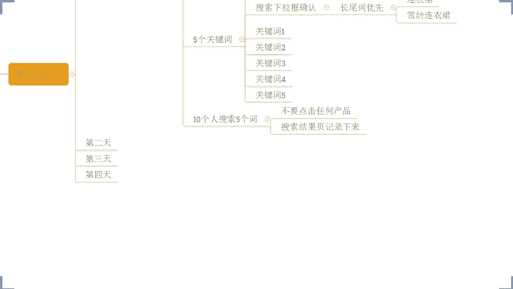

你们做什么产品的呀？我们来我们来举个例子吧，好吧。😡。

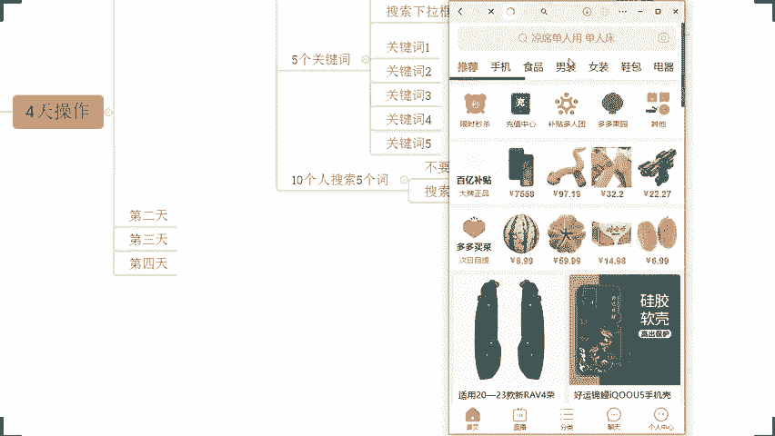

你们说什么产品的？😡。

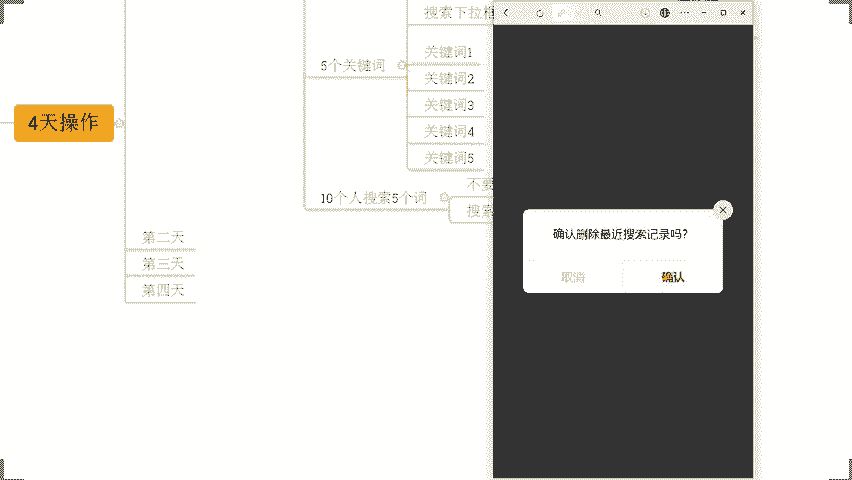

沙发除了沙发呢，猫砂啊猫砂吧，猫砂吧，猫砂啊，猫砂来。😡，啊，这下面呢这个就是我们的下拉框池。这下面就是我们的下拉光池，好不好？有看到吧？这是我们的下拉光池。我们在这里面呢来找到一些这个呃常尾词。

我们刚刚讲的，对不对？比如说猫砂批发40斤除臭特价清仓，猫猫砂除臭清香型室类无尘对吧？猫砂批发100斤特价，猫砂膨胀啊，膨润土猫砂好不好？类似这些词，我们现在去搜索啊，我搜索了这个词啊，打个比方。

我搜索的这个词。😊。

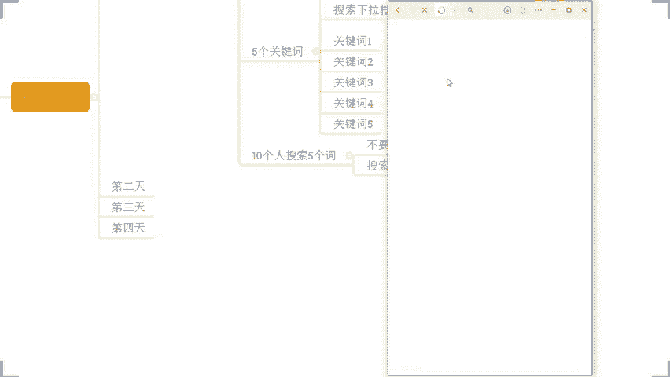

来，这是我的第一个关键词，对不对？O我搜索了在搜索的时候，这个地方呢就是我的搜索结果页。在搜索结果页里面呢，我们不要去点击任何的产品，我们先来看一看都有些什么东西，好不好？

这里是它它这些产品这是什么东西，对吧？我们先收的时候对吧？我们先看一看大概都是谁是谁啊，那么搜完之后，如果说在这个界面上你不确定你甚至可以干嘛呢？可以通过销量排序去看去确定啊，也可以的，也可以啊。

这样也可以啊，注意这样也可以那销量排序呢，可能它更加好的可以屏蔽掉一些这一个呃千千面的一个部分啊。所以说在某些时候呢，它可能更加精准一点啊，好不好？所以也可以啊。

来我们刚搜了一个猫砂批发40金除售特价新仓，对不对？搜了这么个词，那现在呢我再去搜一个词猫砂。😊。

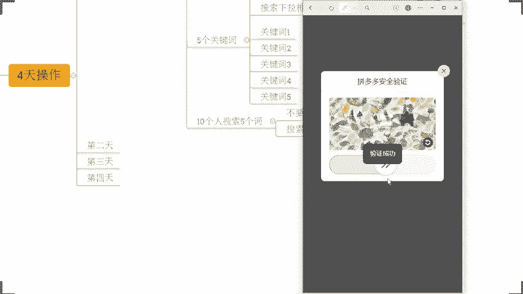

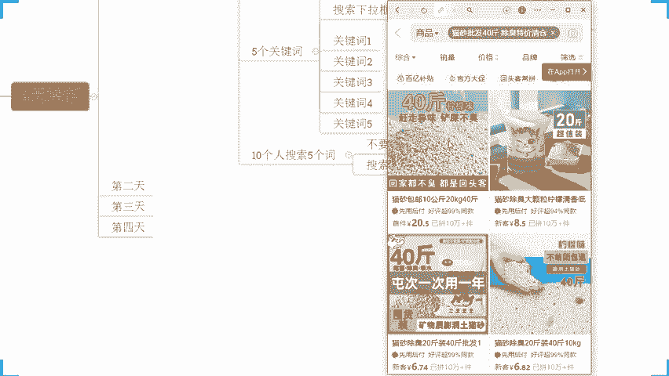

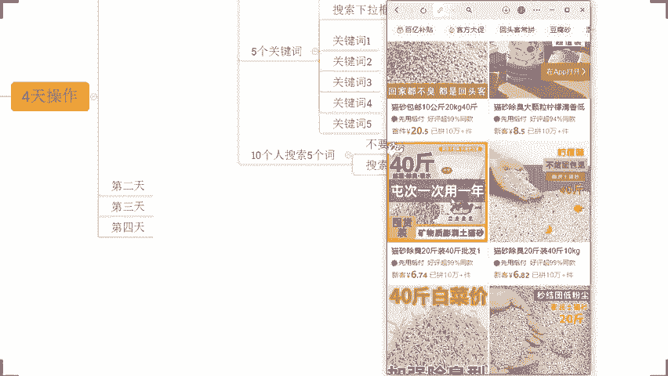

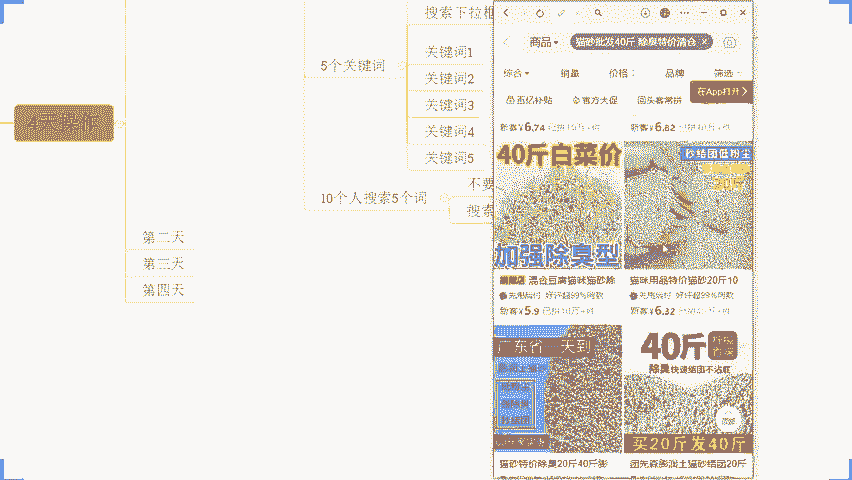

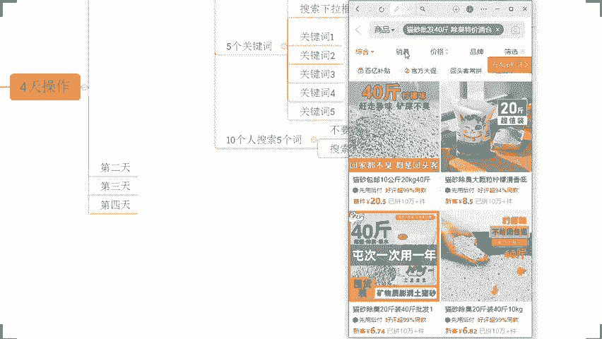

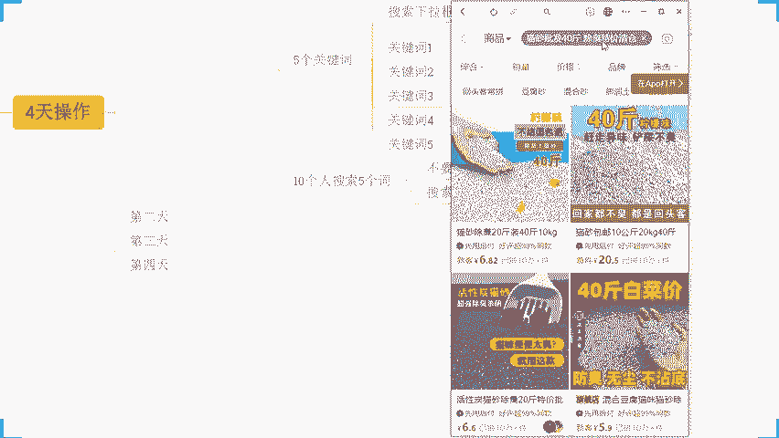

啊，搜索哪个词呢？我们来搜索一个猫砂除臭清香型，室类无尘，好不好？来，我们来搜搜完之后，同样的结果，对不对？哎，这个产品其实之前我们有看到过，对不对？各位，没错吧，这个产品之前我是有看到过的，对不对啊。

然后我们再通过销量排序看一看。好，这些我们刚刚之前好像都看到过，对不对？好，O那么。😊。

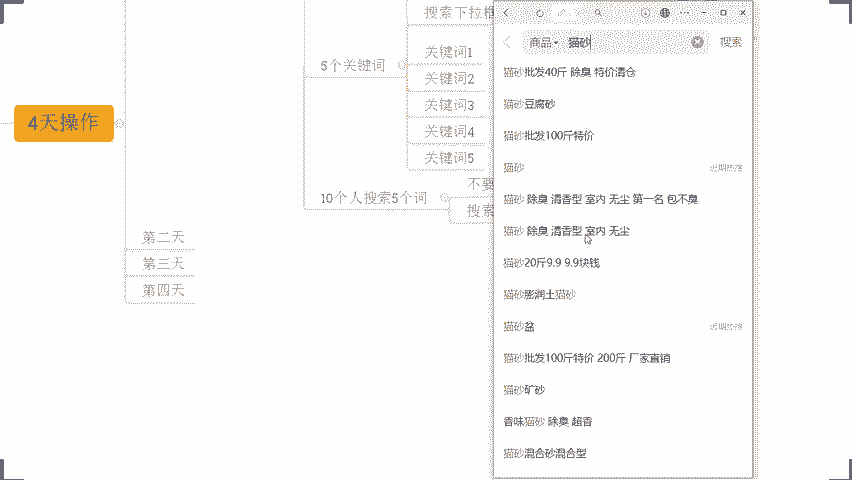

在用到不同的关键词都能够收到的5个产品，每个人都能够去看得到或者重复率很高的产品。我们把它记录下来，没问题，公平打一啊，这个操作方式没问题，公平打一10个人。

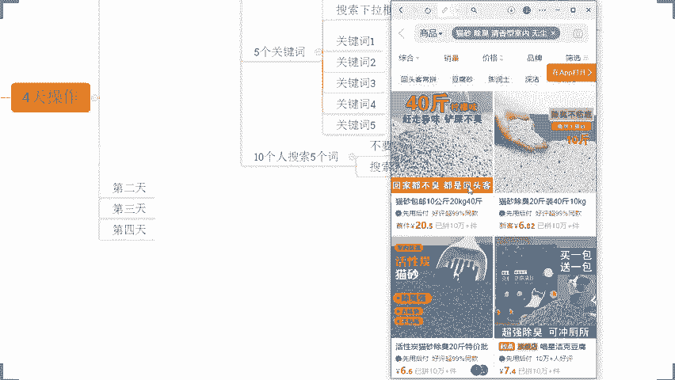

分别搜索。分别。搜索5个词，找出重复率高的5个产品。卡了吗？卡了吗？卡了吗？现在好不好现在好不好，现在还卡吗？😡，现在还卡吗？卡了是吧，现在好了是吧？OK啊，现在好了啊，刚刚这一部分有没有听到啊。

刚刚这部分有没有听到？😡，刚刚这部分有没有听到？😡。

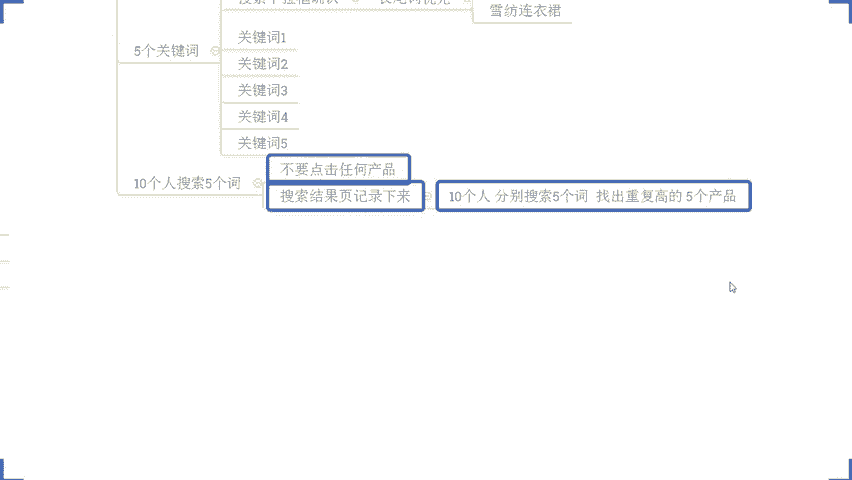

有没有听到？😡，没听到。我刚才演示的时候，你没有看到吗？我通过两个关键词，我去演示两个词啊。😡，没听到我的天，好尴尬啊。😡，我尴你尬啊呃，看见了是吧，十3看见了是吧啊，看到了声音有点卡是吧？

OK没关系啊，那我说一遍我说一遍啊，那我现在呢就刚刚这个操作方式，我找到这10个人呢，分别去搜索这5个关键词，然后把这些重复的出现的频次很高的产品，最好是每个人每个词都能看到的5个产品，找出来。😡。

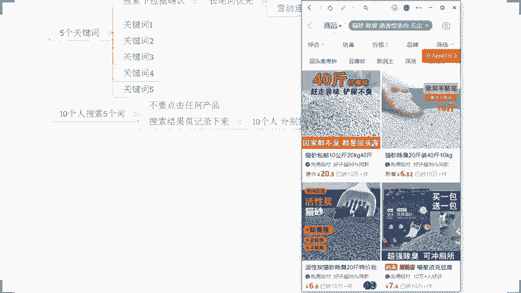

这些产品的话，它之所以能够每个人每个词。都能收到。一定是高权重的产品。这一点毋庸置疑。没错吧，这点是没错的吧。😡，所以有了这些产品之后呢，后期我们去操作的时候呢。

也能通过这些产品来帮助我们完成流量的获取啊，这是第一个啊。第二个呢，这些产品用到的这些词呢都是符合我产品的精准产尾词。所以这个时候呢这些产品和我的产品一定是一个竞争关系的。换句话说。

需要我上品的人可能跟需要这上面的人，他们是一样的人。各位能理解吧？我们的用户是一致的。各位没问题，这个部分没问题的话，公屏上现在打个一。😡，好，OK啊，没问题就行啊。那么继续继续啊继续继续继续啊。

那现在呢这个是准备工作啊，这个准备工作准备工作到这一步呢完成了一部分啊完成了一部分。😊，什么平台呀，我的天啊，你们跟他讲一下吧啊，什么平台好不好？😡，拼多多呀，兄弟，你你你这个什么时候来的，刚来吗？😡。

来啊，这个是这个是这一部分啊，这是这一部分。😡，刚才你给哦。这个不重要啊这个不重要啊这个不重要，这是直播的一个端口而已啊，这不重要啊，重要的是你来听到直播就可以了，好吧。😡，来啊呃在这里啊可以看到啊。

对于我们整个的操作，在这部分啊，这10个人现在开始第一天的正式的操作了啊，听清楚这一天这10个人干嘛呢？当我们把所有的词所有的这个呃产品都准备好之后，好，10个人找出来。😊，那。

这个是呃准备动作的嘛重要的一步。啊，重要操作给你们打个标记啊，重要操作。那么这10个人啊，这10个人啊，这10个人走过来之后，看到没有？找到这关键词了之后，OK。😡，每个人用到一个关键词来。

一和二用到关键词一好不好？然后一三跟四用到关键词2好不好？然后呢，再往后依此类推，看清楚了啊，看清楚了，以此类推好不好？你们后面操作的时候呢，按照这样的方式去分配就可以了，可以直接去套用哈。

那么10个人用到5个词，每两个词啊，每一个词分配两个人，然后去搜索浏览一个产品。😊，啊，搜索这样一个产品啊，那么这里呢我我我我也顺便写一下啊。😡，正品一啊正品一，然后竞品2。竞品3。竞品是。

竞品5OK那么这个时候呢，前面这些人呢就每个人去浏览一个商品。好吧，每个人去浏览一个商品啊，看清楚这个排序啊，看清楚这个排序好吧，来以此类推往后。😡，呃，最后一个人看到没有？

第10个人用关键词五呢去浏览商品一啊，竞品一好不好？就这样去做。那么这个时候呢，每个词和每个产品和每个人都形成了一个对应关系。各位？

这个动作呢本身第一点这些搜索人群呢是跟我们产品的标签人群一致的需求人群一致的。然后我们再通过这些人呢，完成这些关键词搜索，会打上一个需求标签，对不对？完成搜索之后呢，再去浏览这些竞争对手商品。

可以加深这个产品的一个标签，也可以加深我们这个用户的一个标签。能明白公名打一。😊，啊，能明白公民党意。交叉感染是吧？OKO ok啊啊，这个词用的很到位啊，交叉感染啊。那么在这个时候呢。

这些词这些人还有这些商品相互之间也都会形成一个权重的相互叠加的过程啊，好不好？是这样子的OK这是我们正常的前期准备工作第一天。然后接着各位准备了啊，开始正式操作啊，正式操作。😊，正式第一天。好吧。

因为前面是准备工作第一天嘛啊，前面准备工作第一天。😡，这个我刚刚一开始都说过的，是我们一开始在准备策划商品的时候就准备好的。因为我们的词首先它是符合我产品的，而且是我标题包含的，理解吧？😡。

后面的话你把这个词这些东西前期都已已经布局完了之后，你再去找人去做这个动作就可以了。好吧。那么这个时候注意了啊，第一天开始啊，第一天开始第一天呢第一步啊第一天第一步。😡，那么我们找到这10个人回来啊。

找到这10个人回来，还是通过找到这个关键词。嗯。可以啊可以多加几个啊可以多加几个，这个看你自己啊，可以这个可以看你自自己啊，词可以多加啊，但是词加太多没有必要啊，加太多没有必要。

因为你你首先你的权重要集中，这样才能够更加快速去爆发，知道吧？OK看到啊这边首先第一步啊，10个人回来对不对？早上的操作，第一步，第一天第一步啊，第一天第一步啊，10个人回来。

通过这些关键词对应的关键词去搜索搜索的时候呢，直接去搜索浏览我们的产品。😊，啊，搜索浏览我们的产品啊，好吧，搜索浏览我们的产品。😡，啊，听到没有？搜索浏览我们的产品。😡，各位记住了没有？

记住扣公公屏扣1啊，记住公屏扣1。如果说你说SO我直接用这些关键词搜不到怎么办？好，没关系，你可以把链接发出去，让他们先去做一个浏览行为，打上标签再去搜索，OK没问题。

或者说可以把我们的冷门词加进去做搜索也可以啊，把冷门词加进去做搜索，也可以啊啊，搜不到啊。这里我写一下搜不到。😡，先。通过链接。嗯，有了。达标签。或者加长尾词啊，加这一个冷文词。家能门次啊。一起搜索。

然后再去搜这些问题，最终我们一定要有到这个关键词的足迹。有就OK了。好吧，有就OK了啊。那么这个动作是干嘛呢？这个动作这里我说一下啊，第一天呢我们这些人搜索了关键词，对吧？我们之前已经搜了很多次了嘛。

5个关键词搜过了，他打上了一个搜索需求标签。然后我们去浏览的竞行对手。这个时候呢，我们这些人呢会有到一个非常强的购物标签。😡，那么这个时候这些人再到第二天一大早之后，先来浏览我们商品的话。

可以让我们的商品得到一个更高的产品标签。😡，对人民白公民打一。啊，能明白公平打印。那么这个时候呢，有了这样的标签之后，接着我们再进行第二步好不好？接着我们再进行第二步。对。

把购物标签打在我们自己商品上面来。对，没错啊，第二步，那么这个时候第二步的时候呢，同样的这10个人啊，同样的这10个人继续去浏览谁，浏览我们的竞争对手，浏览一次就可以了。简单浏览啊，不用深度浏览啊。

简单浏览就进去一下就出来。😊，简单浏览。啊，进去一下就出来。然后另外呢，安排两个人去做一次下单，不付款。或者是下单之后再退款也都可以了。那么这个时候呢安排哪两个人呢？安排我们的这个一和三啊。

安排我们的一和三啊。啊，安排我们的一和三啊，这两个人下单不付款。啊，安排这两个人下单不付款啊。那么这个时候我们这两个人呢分别是去做了一个关键词一和竞品一的一个操作，以及关键词二和竞品二的一个操作。

各位能明白公民党一啊，这部分能明白公民党一。这个是我们第二步操作啊，这是我们第二步操作。😡，那么这一部分操作之后呢，OK我给大家讲一下干嘛的啊，这一部分操作是把我们的产品再一次和这些竞争对手形成关联。

因为这些用户已经来过我们的店铺了。😡，让平台知道喜欢这些产品的人，他对我们商品有高需求，同时呢让我们的产品呢和这些产品发生关联。😡，啊。

那么让平台认为我们的人群又是可以得到一个高度契合的一个一个一个表现啊，这是第二步。那同时呢完成一个下单不付款的操作啊，这个时候我们后面做一个铺垫，什么铺垫呢？继续往下看。接着第三步。啊，这是第三步。

第三步这10个人。回来浏览我们的产品啊，浏览我们产品。那么这个浏览过程中的话啊，听清楚了。反复浏览。啊，反复浏览，每隔一个小时来一次。那么这个动作干嘛呢？OK我们这些人反复的在浏览的时候。

他是通过搜索端口来的，对不对？可以增加我们产品的搜索热度。浏览的时候呢也可以增加我们的商品热度。所以这个动作是在增加我们产品的什么。嗯。😊，这样我们产明什么？😡，有没有人知道的？😡，热度对热度啊。

那么这个热度增加的同时呢，我们的推荐权重也会变得更高。什么是点击率下拉框？你这个问题是怎么冒出来的，我的天。😡，嗯。呃。呃，你你再说一下吧，你你是问的什么问题，我我没有没有搞明白啊。😡，呃。

missr少啊是你你说的是什么，我我没有太理解你的这个问题。😡，提升的是点击率。点击率肯定也可以提高提高的啊，点击率肯定也可以提高的啊。那重点是在于说热度啊点击率提高，搜索热度增加，产品热度增加。

知道吧？它是多方面多维度的产生的啊，它多维度产生的啊，能不能做测图之后主链接之后再去做这些问可以啊，这个看你自己啊，你自己安排啊，你自己安排。因为像这种东西的话，其实我在前期的时候。

像我带实操小小伙伴啊给你看一下好吧？像我带实操的小伙伴的话，其实我们一开始呢在上架商品之前，对吧？我会把关键词啊，把冷门词啊，把我们所有这些所谓的图片呢进行完整的策划，策划完成之后呢。

我们再去做这个事情的。如果说你是非标品啊，如果说你是非标品，那么做好这个爆款分析直接做如果说你是标品的话，O的，你可以做一做这个所谓的测图策款标品其实没有存在说策款的问题就在于测测图啊。

那么这个东西的话就在于说你的策划能力啊，像我自己的话，其实这方面的话嗯。😊，怎么说呢？基本上不用说特别去浪费时间去花功夫去做这个东西。因为其实通过数据分析都可以得出答案的啊。好了啊，那我们继续啊。

各位继续啊。😊，呃，对，竞争对手啊，这里啊竞争对手啊，看到没有？竞争对手店铺啊，这里是竞竞竞品啊，看到没有？然后接着往下啊，每隔一个小时来一次，对不对？好，OK再往下记住了，到了我们的下午。😊。

五六点钟了，对吧？或者到了我们晚上了，反正你在这个今天晚上啊10点钟之前。😡，啊，晚上啊晚上10点之前吧。晚上10点之前啊，看清楚晚上10点之前做一个动作，什么动作呢？

让这两个在别人店铺下单不付款的人回来我们店铺进行成交。😡，来。能够明白现在公民打一。在同行的这个店铺里面下单不付款的这两个人跑到我们店铺里面来完成对应的关键词搜索成交。OK这一个动作是干嘛的呢？😡。

那么让平台知道喜欢同行爆款的这个人，他在我们店铺成交了。在同行店铺下单的人流失到了我们店铺，告诉平台，我们虽然说是个新品，但是在某些方面来讲啊，比我们的这个产品啊。

比我们这个竞争对手比我们市场的爆款更优秀，更受买家喜爱。10点钟之前去做就好了啊。对，不能超过晚上12点啊，肯定是不能超过的啊。一般10点钟之前去做啊，10点钟之前去做好不好啊，你可以下午有时间下午做。

但是你一定要是有到一个非常高频次的搜索浏览之后再去做啊，这样的话权度会更高一点。😡，OK这一个操作方法过来的话，那我们既可以增加我产品的点击率，又可以增加我产品的搜索热度，商品热度。

又可以增加我产品的什么坑产，又可以增加我产品的转化，同时可以把我们订单的这个呃进店的一个流失，拿到我们店铺来蹭到一个所谓的推荐群众的一个一个呃这个曝光。各位能理解吧？它是一秒多得。😊。

啊呃这这个一时多了啊一鸟多得去了啊，一举多得啊，真的是啊什么鬼东西啊，一鸟多得什么鬼啊，OK啊，这个逻辑现在大家觉得OK能够明白啊。😊，能够理解国民大一竞品是不是一模一样的啊不是一模一样的啊。😡。

你要首先知道一件事情啊，我们的搜索词一致就够了啊，搜索词一致就够了啊。可能这个竞争对手呢，他跟我们产品的价格段差不多，但是绝绝对不是同样的产品啊，绝对不是同样产品。但如果说是价格段一致是最好的。

价格段差不多，大配不大，其实都可以的啊。😡，OK这是第一天啊这是第一天。那么接着往后第二天啊，这里我也说一下啊，正式操作第二天，这里我直接复制吧啊，正式操作第二天啊来正式操作。第二天的话啊。

这里我改一下字啊，第二天我就不去打字了啊，比较慢比较麻烦啊。那么前面这个第一步操作浏览我们的产品，这个动作就不要了啊，第一步第一天的第一步就不要了啊，浏览我们产品那一步就不要了。

上来直接先去浏览我们的竞争对手，之前成交的这些人还可以来浏览，没问题。但是第二天的时候呢，要找到三个人下单不付款。😊，那么这三个人是谁呢？😡，0507，还有09。好吧，那么换句话说，这是谁呢？

是我们的关键词三和竞品3关键词四和竞品4关键词五和竞品5这三个词，这三个商品又发生了前一天同样的事情，对吧？然后我们再来一次同样的操作，对不对？唉，让这些人呢在做完反复浏览之后啊，到我们的店铺去成交。

😡，相当于什么意思呢？第二天的时候，我们的商品已经通过所有的关键词和所有的这个竞争对手发生的最直接的一个竞争关系。什么竞争关系？😡，订单流失。各位能够理解的话，公屏上打个6。好，那么这是我们第二天。

对不对？那第三天怎么办？😡，第三天简单了第三天简单了。第三天我们既然去做的话，OK只一样的方式去做就可以了，对吧？让我们这些人呢变成5个，哪5个人嗯。02。您是。06。08。10啊。

让这5个人来到我们店铺完成这个操作啊，继续恶心同行。对，没错啊，就这意思啊，那么继续去抢流量啊，继续抢流量。这个时候通过这样的操作的话，只需要3天。

那么平台就会判定说哎我们这些爆款商品里面呢有到一些新品呢，是呃同样的人群，他们很喜欢的。那么他的转化也很高，我会给他额外的扶持来进行测试，得到更多曝光。那如果我们在前期策划的时候呢。

我的主图策划的不算是特别差劲，对吧？我的价格段也是比较合理的，那么自然而然整体数据会不断放大。各位觉得干不干？啊，觉得干不干。来整个的操作的话，我可以这样讲，哪怕啊我跟你我跟你们说一下啊。

哪怕你真的找不到人去做成交，你只是去做这个牛览啊，你只是去做一个牛览进店浏览，我们自己店铺的话，我跟你们说一下，访客都可以增加的。呃，之前之前我分享过这个玩法啊，当时有个哥们叫王高明。

他当天就去做了这个事情，他店铺是做家具的啊，他就这么做家具的，做那个实木床的啊，当时那个哥们做实木床的，平时就没访客的。😡，几乎是零每天出去几乎是零零访客。当天他做了这个事情，没有成交，他只他没有成交。

他只做浏览这么个事情。然后当天晚上店铺访客涨到了80多，而且成交了两单。😡，当天晚上就来找我了，西楼哦你这个方法真的不错呀，对吧？呃，但是这个呃如果是操作成交会更好一点。因为我看见比较高。

我怕我操作成交的话，这个投入成本会比较大啊，所以我没有成交，我只是去做了这个牛览，我没问题，你哪怕只做牛览也可以的，也可以拉权重的啊。那最好呢是有成交都是可以的，对不对？

他后来说哎做一段时间时候发现确实这个东西感觉还是要这个有人带，确实还不错一点，对吧？不能跟着实操的啊，老链接老链接也可以啊，不过要调整一下啊，老链街要调整一下啊。因为你老链接可能在某些方面来讲的话。

权重已经流市掉了，已经成为一个死链接了，这样是不行的啊那如果说今天啊对吧？像之前呢像这个十三呢，包括说像我们的这个。😊，呃。这个这这个这个叫叫叫叫什么来着？啊，国潮啊对吧？有很多小伙伴之前这样讲说哎。

这个西龙，你这里能不能这个呃这个教我对吧？能不能带我去做啊，有没有课程，对吧？我今前讲了对吧？我这边呢不是这个麦克做培训的啊，我是带实操的。

如果说你们今天在直播间小伙伴们确实呢自己是有兴趣想要去好好把进目做起来的，那么自己呢在目前运营的能力上面呢有所欠缺的O的啊，可以直接跟着实操，好吧，有兴趣的小伙伴呢可以在公屏上打一个8，好吧。

有兴趣的可以打个8。然后我来说一说具体的这个要求啊，跟这个呃费用方面的东西啊，因为本身带实操的话，我不可能说什么人都收，这是肯定的啊，这是肯定的啊，同样的跟着实操的话，这个东西也是要收费的是吧？

他不是免费的啊，它不是免费的。所以如果有兴趣呢，我们可以直接讲啊，然后跟他说一说好吧O这个上啊还有这个自出啊，还有随缘啊，还有MX啊13亿啊没纸啊O都是有兴趣吧？那我先说一下吧，我先说一下。😊，啊。

那跟着实操的，听清楚了，有些人他是不适合的。哪些人呢？如果说你现在你说你做拼多多店铺，你只是说好玩啊，你只是说好玩啊，随便试试啊，随便试试啊，这种情况下的话，就不用来跟着实操的啊，没有意义啊。

如果说你真正意义上是把这个拼多多店铺当做一个事业的。😡，啊，当做一个事业的啊。是想要去好好把它做好的，能够长时间去坚持去做的。OK这种可以来好吧。同样的，如果说你只是哎这种呃好高骛远的。😡。

想着什么一夜暴富的。😡，这种不要来，好吧，那么一定是这种呢脚踏实地的愿意实实在去操作的啊，能够执行力带上的这种人可以来啊。😡，啊，找到实地的这种可以来啊，好吧，这种就不要来啊，这种就不要来。😊，啊。

这种是可以来的啊，可以来。😊，那同时呢这里我要说清楚，跟着实操呢，那么在时间方面我是有要求的。因为你们跟实操的话，不是让你们去看视频看资料，而是干嘛呢？而是针对到你们的这个呃店铺啊，我带着你一起去分析。

找出店铺操作方面的问题。然后针对到这个问题呢，来不断的进行一个这个剖析，找出解决方案啊。所以说时间方面的话，你要每天能够抽出1到2个小时，一个小时以上吧啊，一个小时以上。😊，啊，尤其在我们周一到周六啊。

尤其我们周一到周六啊，然后这一个时间一定要抽出来的。那么如果说你在白天你说哎几楼，我没有那么多的时间，这里我也说一下啊，这个一个小时以长时间呢是碎片化身就可以了。😡，啊。

不需要说你在必须抽出那么固定的一个时间，蹲在电脑前面，一直看着电脑，对吧？不需要啊，你把这个税用化的时间抽出来，那么我们能够沟通清楚店铺操作的问题就可以了。好吧。OK啊，这个关键人说这这怎么了？😡，嗯。

啊，这是这是最起码的一个要求啊，听清楚啊听清楚啊啊不一样不一样啊不一样啊不一样。那么在整个的操作过程中的话啊，有了这样的一个先定条件，那么可以来啊，这个可以来好吧，这个可以来啊。那么这里我也说一下啊。

具体的实操方式听一下啊，那么实操的话，听清楚。如果说你是小白，你是没有开店的。😊，啊，听清楚。如果说你是小白，你是没有开店的。听清楚。首先第一件事情来。😡，干嘛呢？我带着你我们先去做一个事情。

什么事情呢？先去做市场分析，我们要搞清楚我们想经营的这个市场，它能不能做它的市场体量怎么样，它的竞争对手是谁，对吧？包括说我们做完这东西之后，完成第二步竞品分析。我们要知道我们竞争对手他卖的怎么样。

他是怎么卖的这个货，他做了什么样的活动，它的价格布局怎么样的，它的具体优势是什么，那我们去做的话，我们应该怎么去跟他竞争，搞清楚它对不对？搞清楚之后呢，接着再完成第三步，包括选品。😊。

对吧那么我们要根据我们想要去进营争这个品类，找出具有竞争力的产品，然后来进行选择，进行一个货源对接，进行一个上架，对吧？OK完成我们后期的什么店铺搭建啊，包括说我们后面呢还会有到一个产品布局。😊，啊。

包括我们产品布局环新的同时呢，我们要做好我们的视觉策划。啊，再到后面呢，就是我们的新品。运营好吧，那再到后面可能还会有到一些活动营销。😊，啊，再到后面可能还会有到什么呀这个付费推广啊。

甚至呢还会有到直播运营。😊，啊，最后还可以有到这个数据啊，这个数据维护啊。好吧，这些都是跟你实道的内容，能理解吧？每一个操作环节我都亲自带着你去做的啊，每一个操作环节我都亲自带着你去做的。

各位能理解公民打一啊，能理解公民打一啊。那如果说你说爱希喽呃，我不是这种小白，对吧？没关系啊，听清楚啊，你如果说是零基础。😡，我们重零开始。啊，你说我们从零开始啊。😡，如果说你是有基础的。

你是已经开店的OK了啊。那么直接干嘛呢？子账号给到我，我带你分析店铺，然后对症下药。好吧，然后去运营我们店铺啊，针对店铺单独指导好不？对所有的运营内容全部带在里面去实操的啊。然后像这个呃自出啊。

包括一切啊，包括实三啊，包括说我为黑暗呢，包括说这一个生于海港啊梅子啊随缘哪对吧？还有我们官阳啊都都说没问题，都清楚OK的那行啊，那这样的话啊，我再说一说具体的一个呃实操的一个费用好吧。那这些方面。

如果说方式方面也没有问题啊，包括说我们这个时间方面都没问题的话，可以这跟的实操。而实操的费用的话，听清楚目前的这一个限实价格啊。😊，啊，目前的这个限时价格呢OK4288啊，那么原价呢是6988的啊。

限时价呢目前是4288啊，比较还是比较划算的啊也不贵。那么呃整个的实操内容呢听清楚了，这个覆盖到所有的涉及到我们运营的内容，同时呢是直接什么带到你独立运营的好吧？因为每个人的这个吸收情况不一样。

每个人的基础情况也不一样，每个人的店铺情况也不一样。所以说时间方面呢是灵活的，包括说你们具体的一个吸收理解可能也会有差异，对吧？所以这个时间是灵活的啊。我说一下然后这个呃关阳啊呃郭关阳呃。

你你的微信叫什么呀？我我还没见过你哦啊，我还没见过你哦。如果说是有这个兴趣啊，对，从零开始也是4288啊，那么如果说是有兴趣的话，可以直接加到我微信啊，好吧，有我微信小伙伴确定跟的实操的话。

直接微信找我就可以了。如果是没有微信小伙伴想要跟你实操的，可以直接加我的实操微信。😊。

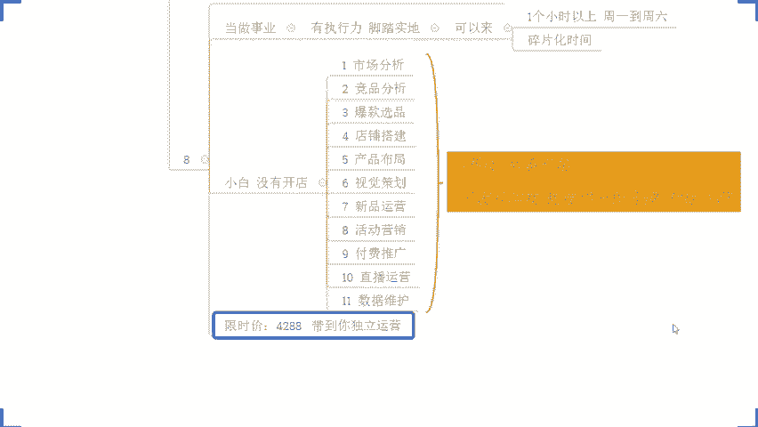

啊，可以加我的微信啊，KD32880。嗯。339880啊，说错了339880啊，这个手还是按的很诚实的对吧？但嘴巴这个面条了啊，可D39880啊，这是我的实操微信啊，这是我实在微信啊。然后呢。

呃有我这个微信小伙伴呢，可以直接微信找我就可以了，好不好？呃，这个实操的话听清楚啊，呃，这个是带到独立运营的，所以说时间方面是灵活的，没有说一个月两个月这样子的啊。十3好不好？理解吧？😊。

这个点能够理解公民打一啊这个点能够理解公民打一好吧，然后像这个呃随缘哪，包括说我为黑暗哪，一切啊，还有出自啊，还有关阳啊，还有MMX啊，还有我们的这个。😊，啊，还有我们的这个这个mr啊，对不对？

如果说想应的实操，O可以直接来，好吧？公屏上呢也有发到我的这个实操微信啊，大家有兴趣呢可以直接加啊，都是可以的好吧，有兴趣可以直接加。那包括说有这个我微信小伙伴呢可以直接在微信找我就可以了，好吧？O啊。

这边是有很多小伙伴在微信这边在问啊，在很多小伙伴在问，有很多小伙伴加我，我先通过一下啊，我先通过一下。😊，然后像这个呃。这个MMX啊在不在？MMX在不在？OK啊这样啊啊MM啊。

我说一下啊呃这个时间的话啊听清楚了。😊，带到独立运营，因为你们每个人就我刚才讲的，可能你们的基础不一样，你们的店铺情况不一样。然后呢，你们每个人的这个吸收能力也不一样，所以说时间是灵活的。

另外有一点听清楚了，独立运营之后。😡，不是我就不管你了啊，不是我就不管你了啊，而是什么呢？而是你后面有任何店铺的操作问题，或者说是有这个平台的更新，都可以随时找我。😡，理解吧？相当于我是你的店铺顾问。

只不过呢没有额外收费MX啊，能够明白公民打一。😡，啊，那个没公民打印。然后像你本身呢，也是说呃。这个时间方面是没问题的，也是想去有到一个比较好的提升啊。那么如果说方式方面都没问题的话。

那我觉得可以直接来，对吧？像这种情况的话，我觉得对你来说提升应该是比较大的啊，你说是不是？那呃还有像我们的这个呃，自自初月龄对吧？自初月宁啊，也是这样子，那志初月林在不在啊？😊，在是吧？

OK像你本身呢我说实话啊，像你本身目前的店铺操作的话，就是一个错误的方式在做。你知道吧？你一直以来呢就用到一些这个一键铺货的方式在在玩店铺。这种方式呢，在店铺运营过程中呢，本身就会有到一个问题。

就是技术权重会很低，你知道吧？所以这个时候呢你的操作在后面的话，又没有一个好的方法去跟进优化的话，你是很难得到一个很好提高的。😡，那么只会导致一个问题，就是你操作的时间浪费掉，懂吗？你会浪费时间。😡。

啊，浪费资金。啊，所有的这个呃时间成本跟资金成本全部浪费在一些没有意义上事情上面去，导致我们店铺有没有法提升，最终可能钱花了，电还黄了，知道吧？所以这种情况的话，我觉得你如果确实想好好长期做店的话，啊。

可以扣个一，好吧？你是你是打算长期做店的话，可以扣个一，好吧。😊。

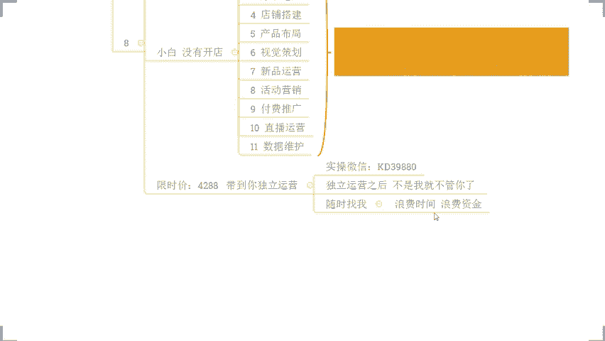

然后这个梅子说想换品可以带选品吗？选品当然可以带了，对不对啊，肯定肯定可以带的啊。OK那像自书呢也是想要重新坐店，对不对？那呃在目前来看的话，那你自己呢是没有一个完整的操作思路的。

没有方式方法的所以你一定是要需要去提升的对吧？那么目前来讲的话呃，方式方面OK吗？没问题的话，也可以扣个一，好不？就实操的方式方面，如果说OK能够接受，没问题，公屏可以扣个一。😊，OK方式也没问题。

对吧？那么时间方面的话，你确实也是有时间的嘛，对不对？也是能安排的那我觉得的话今天都可以直接来好吧？我觉得这个就是可以直接开始操作的一个事情了啊，就不用去耽搁的，你说是不是同意的话，公屏打个6好不啊。

这个支出月宁啊，同意的话可以打个6，那我们可以直接开始啊，好不好？像操作方面的话，很多时候就这样子的，更多时候呢就是效率之上，对不对？O啊？那么支出我就直接把这个呃付款方式发你啊。

然后搞定之后呢截图给我就可以了，好不好？O啊，这个HO啊红啊，安排好了，是不是O我看一下确认一下啊。😊，OK啊，恭喜这个红彤通啊，恭喜红彤通啊，成功拿下的名额加入新市操，好不好？

然后其他小伙伴如果说是有兴趣的话，可以抓紧时间安排啊。像这个植助月灵，包括像我们的这个MMX对吧？啊，还有像我们的这个啊，包括像我们的这个呃国国潮对吧？都可以抓紧时间。

其实我觉得店铺操作就是很多时候就这样子的啊，那么有的一个好的方法之后呢，能够去快速提升，对我们店铺来讲的话是更好的。然后这个13啊，你是好了，你你是已经安排了吗。😊，那我也顺便说一下啊。

今天的话给到你们名额的话，只能给5个啊，好不好？今天的话只能给到你们5个名额啊，今天的话只能给到你到给到5个名额。然后这个支出啊呃账号我已经这个发你了啊，这个付款方式我已经发你了。然后你可以安排一下。

搞定之后呢，截图给我好不好？然后领取这个信息登记表，然后红彤彤，我已经发你这个信息登记表了，填一下啊，填写好支后回单给我下播之后呢，我们就直接开干好吧，然后这个呃。😊，啊，我我看一下我看一下我看一下。

因为有的时候可能有延迟啊，可能有延迟。OK啊有看到有看到收到了收到收到到了到了啊，到了啊。呃，恭喜一下王十三，好吧，恭喜王十山好吧，成功拿下一个名额，好不好，加入修市操啊，王十三这边的话一样的啊。

我把这个信息登记表发你一下，搞定之后呢，截图给我啊，这个这个填写好之后回转给我啊，填写好之后回转给我，然后下一波之后呢，我们就直接开看啊，吓到你了是吧？你还以有转错，是不是？😊，我的天。😊。

OK啊不至于不至于不至疑啊不至疑啊OK啊，然后这个呃。😊，还有这个潘笑中钱在不在？😡，潘夏忠天在不在？然后这一个声育还想说哎，我看一下高一点，这个也一样吗？来看一下高一点。

是不是我给你看几个跟我实在小伙伴高个单的吧，好吧？😡，看完你就知道了，好吧，我也不用我说什么，这个东西其实我说再多没有意义的来。😡，这个店铺啊这个店铺1800的客人价算不算高客单？😡。

说明的高客单一天也能够卖个100多单啊，一天也能卖到100多单。但客人价高的这个产品呢，确实单量没那么多啊，这个很正常啊。来这个店铺。😊，2300的客单价一天210多单。啊，一天210多单，好吧。

可以看一下是不是高开单。所以高开能可不可以，当然可以没问题了，对不对？然后这个呃MMX你这边怎么想着呢？我微信也问你了，你可以说一下，好吧。呃，如果说方式方面没问题，时间方面没问题，对吧？

确定个人实操的话，可以公屏扣个一，或者直接微信回复我一下，好不好？😊，啊，比你高是吧？比你高的话，我觉得OK的呀，对吧？既然说这么高科能价的产品都能玩，比你客能价高的产品都能玩的话。

那么跟你一样科能价的产品的话，我觉得呃这个你这个科能价的产品的话应该是没有问题的，对不对？其实不同产品的话，有不同玩法啊，高可能有高端玩法，低个能有低能玩法，当然我们要去结合到我们市场进行分析，好吧？

这个东西都是我们需要去做的一个事情啊，然后这个呃。😊，这个这个这个这个这个这个什么来着？😡，呃，一。一。你还你这边在直播间吗？一在直播间吗？在的话扣1啊，在的话扣一好不好？😡，然后这个呃。啊。

自出自出月年。自苏月莲有有收到吧，微信消息有收到吧，收到的话啊，可以确认一下，回复一下啊。因为你这边我也我也不确定你这边到底有没有收到消息啊，你看一下微信啊，继树月莲如果有看到的话，公屏扣个一，好不好？

有听到的公屏扣个一，好不好？呃，可以抓紧安排一下。😡，OKOK啊，可以抓紧安排一下啊，搞定的话，截图给我啊，记得啊好不好，因为名额有限啊，我想不这个到时候不然说你跟别人一起去这个搞定名额，对不对？

到时候没有名额就会比较麻烦一点，对吧？啊，今天的话只会给大大家5个名额，好吧，只会给大家5个名额，现在还剩下三个啊，还剩3个好吧，然后这个呃。😊，还有我们的这个这个这个潘案肖忠前啊。

潘案肖从前在不在在的话可以扣个一。还有相濡以沫啊，相濡以沫在不在？😡，还有我们的这个国潮饮品甄选，在不在？😡，在直播间的话可以扣个一啊，好不。😡，有，有看到一个这个老熟人啊，陈林也来了啊，好吧。

有看到一个老熟人陈林也来了啊。😊，昨天今天怎么怎么怎么怎么有空的，可以的啊可以的可以的。😊，嗯。嗯。还有这个一是没在是吧，没在直播间是吧？还有这个国潮饮品呢，国潮饮品还在直播间吗？在的话扣个一啊。

还有潘永香送钱。😡，还有我为黑暗。😡，啊，5月黑2在不在？OK啊，梅子，我通过了通过了梅子，然后梅子这边是确定哥人持操吗？是的话，公屏扣个一，或者直接微信回复我一下啊。梅子。😡，OK啊呃那梅子。

我把那个付款方式发你啊，我把付款方式发你，然后搞定之后呢，截图给我好不好？然后找我领取这个信息登记表，然后我们下下播就直接开始啊，但是重新选品，重新开新店，这个没关系啊，这个没关系啊。

梅子本身我想到的就是我们店铺操作的话，每一个环节呢其实都是我带的实操的嘛，对不对？像你开新店也好，或者说你是完全零基础没开店也好，OK那么我们都会从这个市场分析竞品分析。😊。

报款就分析开始来确定我们的前期爆款，确定我们后期的经营方向，做好定位，然后我们开始一步步操作，知道吧？所以这方面不用担心，没问题的。😡，啊，像你自己去做，我说实话我反而去比较担心一点啊。

你如果说是像你自己自己内部的话，可能本身在一些操作方面呢都会走到一些弯路，是不是会有一些这个呃错误的方法？那我们在操作的时候呢，可能还要去纠错，反而会更麻烦一点。所以说纯新店来讲的话，其实更好上手一点。

理解吧？能够理解公屏打一啊，所以这一块的话不用担心啊，对吧？你重新去选品，重新做新店的话，其实我觉得这个是更好的啊，当然呢也不是说我们这一些呃有数据的老店铺就不能做啊，不是的，你们可以看到，对吧？

像这个店铺来。😊，像这个店铺对吧？原本的话是有到1个2000多访客，声音不到，对吧？而且的话呃整体数据呢在这个时候呢也是卡的很死啊，没有办法一个很好的突破。那么后期更的时的时候也可以得到提高的对吧？

包括像还有这个店铺啊，我给你们看一下。😊，看到没有？各位有看到这个店铺吗？原本访客呢在000多线不到，对吧？整个数据呢在运营过程中还会有在一些波动，看到没有？那么跟着实操之后呢。

重新拉升优化之后呢开始提升。看到没有？从原本的最巅峰的时，00多访客干到了100的访客看到没？这边啊一天啊一天一天订单话000多单是不是所以不管是哪种店铺其实都能够去很好的操作啊。

那么也是实操的魅力所在啊。当然了这里有个前提就是什么呢？就是你自己能够去真真切切的把这个店铺操作下来，能够去做地执行。那么现在这个时间来讲，我说一下啊，现在这个时间来讲，我说一下啊。

那不是说一半不一半的事情，是你们很多时候在操作的时候，你没有一个合理的认知跟这个规划，现在这个时间的话，其实很紧张的对吧？如果说你们目前是想要去好好做店的。在我们现在这个时间节点上。

一定要抓紧去发力去操作，不然的话，等到再过一段时间，我们这一个节日的一个影响，结束了，所有同行都在开始发力的时候，你再去做晚了。😊，到时候你的整个投入成本也好，你的这个运营的一个难度也好，都会大大增加。

知道吧？事半功倍，好不好？呃，事倍功半啊，事倍功半啊，说错了啊，好吧，多了我就不多解释了啊，今天的话时间也不早了，先到这里喽，好不好？如果说是想跟着实操的，直接找我就可以了，好不好？

这个是我的实操微信啊，这是我实微信啊，可以直接直接直接找我啊，好吧？各位，拜拜。😊。

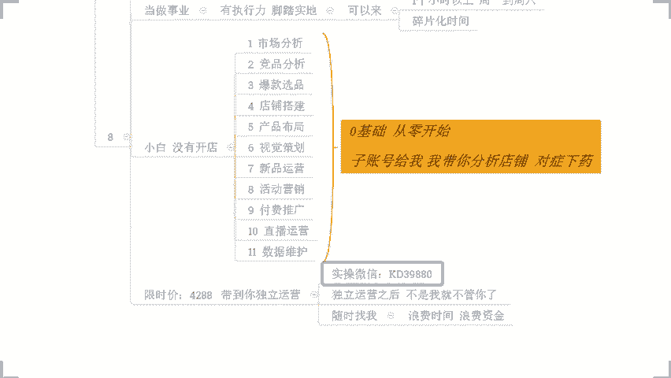