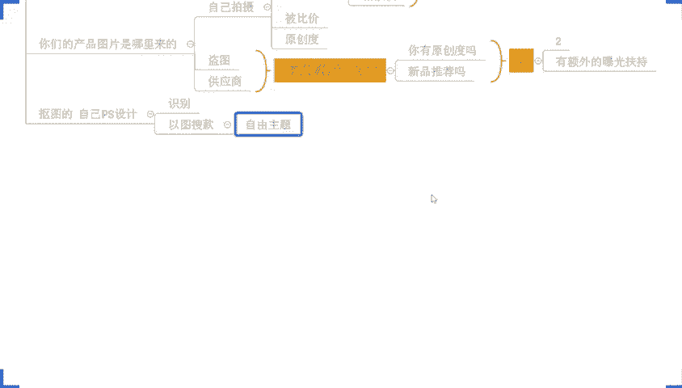
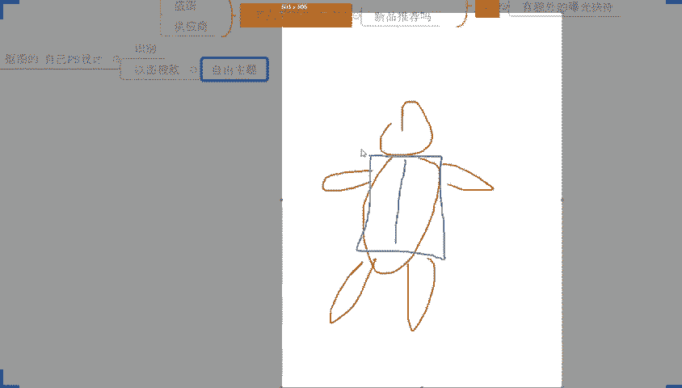
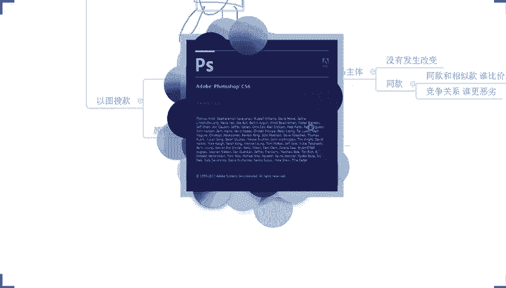
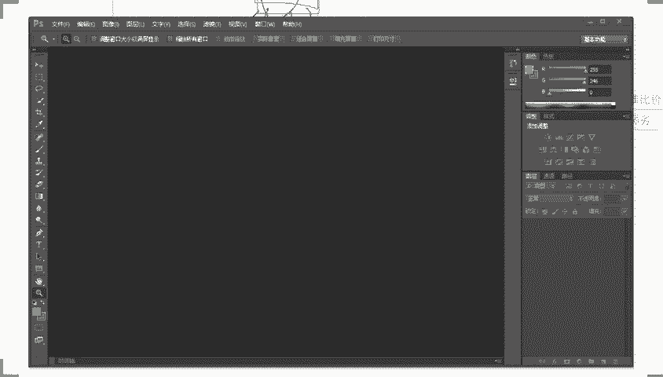
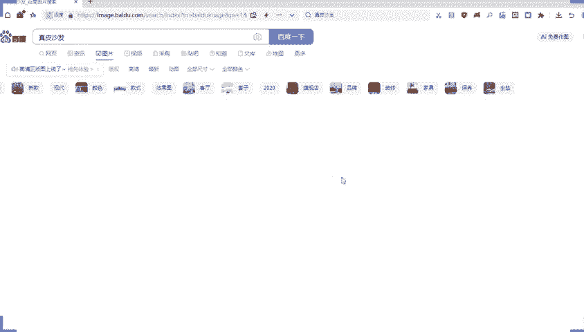
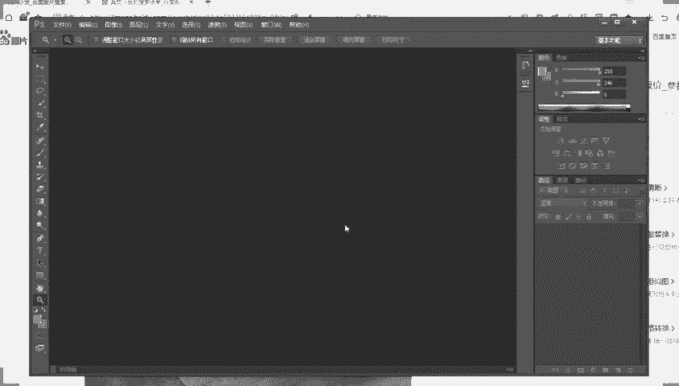
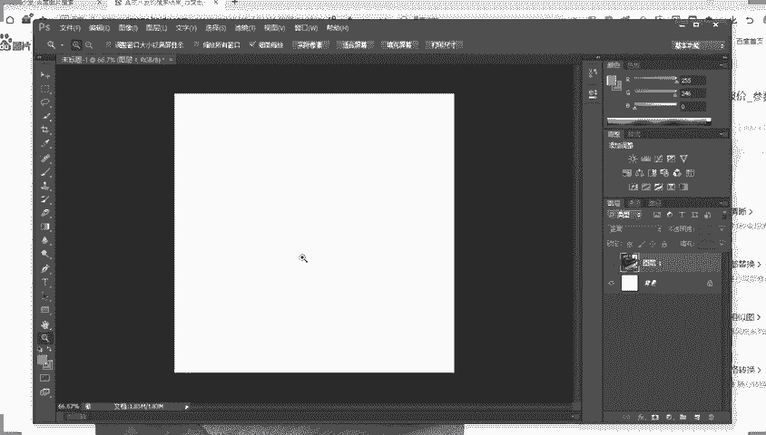
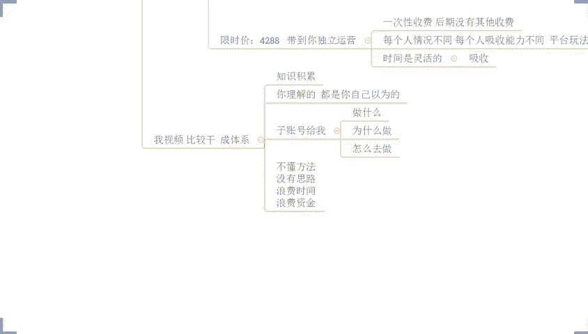

# 【拼多多运营】2024年最系统的全套拼多多运营教程，适合所有拼多多开店新手小卖家自学，10年资深运营师手把手教你从0到1起店实操。 - P51：51-拼多多新品操作8个细节 小白快速掌握核心操作 - 拼多多运营教程_ - BV1H62ZYREs4

呃，撤下麦啊，这边所有的在直播间的小伙伴们能够清楚听到我声音的话，能够看到我这边电脑桌面的话啊，公屏上来来扣一个一，好不好？来动作快啊。哎呦看到很多这个熟悉的面孔啊，哎，爽爽，今天来的挺快的啊。

可以的可以的可以的。OK啊呃，正式的直播时间呢，还有一点点时间开始啊，大家不用着急啊，我们先一起这个等一等，还在路上的小伙伴们啊，你好你好你好你好啊，OK那么呃在开始之前呢，还是按照这个老规矩啊。

先把直播间的一些小要求呢，我们先说一说，好不好？因为确实也有很多小伙伴是第一次来直播间，对吧？那避免说有一些呃不愉快发生啊，所以说我们先把它讲清楚。另外呢，这些小要求呢，也不是说为了限制大家。

其实更多是为了帮助大家更好的去呃进行一个直播，对吧？完成这一个直播的一个吸收理解，好吧？OK。😊，那么在直播过程中的话，首先第一个要求啊，第一点啊，我先说一下。那么。😡，在整个分享过程中的话啊。

我是会经常性的跟大家进行提问啊。那么提的问题是什么呢？就是说呃你们是不是能够听明白，你们是不是能够听懂，对不对？这个问题呢，也希望大家能够第一时间跟我进行确认。啊，那么能够去呃明确清楚的知道你们的情况。

对吧？如果说你能够听明白，能够听懂的话，记得告诉我一下。如果说听不明白，听不懂也记得跟我说。因为这样的话也能够去让我们去了解到大家一些情况呢来完成我们更多的分享，对吧？确实比较多小伙伴没有听明白。

没有听懂的话，O的，没关系啊，那我们可以再讲一次都是可以的。好吧，这是第点然后另外一点呢就是本身呢直播分享，它不是说上课啊，他只是一个分享而已。所以说在整个过程中呢。

我也会经常跟大家去进行一个其他问题的提问。什么问题呢，就是呃对于我们店铺操作一些这个呃思维逻辑啊或者是些具体实操的一些问题。那么你们可以把自己的实际情况告诉我。

这样呢也方便我能够去更加好的了解到你们的情况，能够更加清楚知道你们的一个这个基础情况，便于我们的分享。当然呢还有一点什么呢？就是你们本来呢。这个思维啊比较活跃，对吧？如果说我单方面的去讲。

可能很多时候你们这个动不动就不知道跑哪里去了啊。是个这个老在你面想的东西都要动不动跑哪里去了啊，那呃跟着问题去思考的话啊，你们也能够去更加好的去明白我在讲什么，能够去更好的吸收跟理解，好吧？

所以这点呢比较重要呀啊，好不？那除了这个东西之外呢？另外还有到第二个要求。对，还有很多学伙还在路上啊，不着急啊，那么第二个要求什么呢？就是说在整个直播过程中的话，大家如果有问题有疑问的话，听清楚了。

跟我们当前内容。啊，当前内容。相关的问题对吧？这种问题呢马上提出我们马上解决，好不好？这种问题马上提出马上解决啊，以便于你们更好的去吸收理解。如果是跟当前内容不相关的问题。啊，不相关的。问题啊。

这种问题呢，你先自己拿你的笔或者记在你的脑子，里，记在你的心里面都可以的。等到我正式的容分享完成，或者是等到我们下播之后，你单独提问都是可以的。啊，不要在我们分享这些内容中间去穿插一些其他问题，好不好？

因为这样的话，其实有很多小伙伴呢可能基础相对比较薄弱一点，对吧？那么这个就会导致很多这一些基术小伙伴呢，他们可能没有办法去吸收理解，好不好？OK啊，下午好下午好啊，吃过了吃过了，我的天，这个点还没吃饭。

对吧？那不太不太不太健康啊，对吧？我们一定是要这个呃在一个非常好的合理的时间里面去用餐啊，😊，啊，派大星说也是了是吧？啊，可以的啊好。😊，呃，这是我们刚刚讲的两个要求啊，还有到最后一个要求。

各位注意听了啊。最后一个要求呢是最简单也是最复杂的一个问题啊，你们你们不用叫我老师了，你们叫我泄楼就可以了啊，好不好？你叫我泄楼就可以了，叫我老师有点不太习惯啊呃，OK啊，衣也来了啊。

也是一个熟悉的小面孔啊，OK那最最重要的一个问题是最简单的一个要求啊。兄弟们听清楚。第三个点啊，如果说今天我分享的内容是你自己没有做到位的。😊，听清楚了，那么确实是自己没有做到位的。

确实是什么适合自己店铺的，那么一定要干嘛呢？去实操啊，一定要去实操好不好？因为你不去操作，不去落地执行的话，那么你听到再多的东西，你看到再多东西都等于零的。好店铺数据不是说你去看视频看出来的。

也不是你听直播听出来的，而是做出来的，好不好？这句话我经常说对不对？所以这几个要求的话，希望大家能够去配合一下好不好？来各位呃，如果觉得这几个要求不过分能够接受的话，公屏上呢打一个6可以吗？啊。

如果说能够接受啊，能够配合的话，公屏打个6好不好？然后呢，这个时间呢还有几分钟时间啊，呃，有没有是第一次来直播间的呀，啊，因为我有看到有个别行像是之前没见过的这一个面孔哈。

如果是第一次来直播间的小伙伴呢也可以打一个第一次啊呃，不对啊，这个麦了一啊，我好像之前见过你的呀。😊，啊，张工志我也见过的啊，你们你们不要搞我啊，你们不要搞我啊，对吧？啊，我我明显感觉我是有见过的啊。

😡，对吧我这个人呢虽然说这个上年纪了，对吧？但是这个记忆力呢对以前的很久远的事情呢记得不是很清楚，但对近期的还好了啊，还好啊O啊有第次来了对不对啊，那没关系啊。

那么有很多小伙伴呢也确实可能跟我呢不是特别的熟悉对吧？这个也很正常，因为你们可能大部分人呢也是看我分享的视频，找到我认识我的对吧？可能对于我是干什么的，也不是很清楚，对不对？

那这里呢我也正式的自我介绍一下啊，我不是什么老师啊，我也不是做这个培训教学的啊，你们可以叫我楼，我自己呢本就是一个商家来的。

我自己做店的时间可能相对来说比较早一点啊当然呢目前呢我自己店铺呢是给到我自己培养的这些运营呢，他们在操作，以我自己呢能够腾出手来做一些别的事情，于是乎呢就会有到这么一个代实操这么一个动作。

包括说分享这么一个一个事情哈，所以大家如果说是有什么操作方面的问题啊，者想。😊，实操店呀都可以找我，这个没关系的那呃整个店铺来讲的话啊，呃不管你是什么样类目吧啊，或多或少呢，我相信我应该都是有接触过的。

因为本身我自己做的店铺呢比较多一点啊，我自己做的像这个服装食品，对吧？还有家居，还有五金啊，我自己都在做啊，那么呃包括其他一些品类的话也这么多年过来啊也都接触过啊。

所以说呃各个品类呢也都有一些相对来说自己读到的一些见解吧。那自己呢本身最早呢是做淘系的对吧？那么在整个的这个店铺操作过程中呢，啊在最早的时候呢做这个女装啊，那13年的时候呢。

也自己呢进营的这个女装店铺呢，入选到了托盆式墙，算是有一个比较不错的一个成绩吧，对吧？那后面呢也慢慢慢慢的拓展出来的别的一些这个品类，包括说一些其他的业务出来啊，呃装饰话还能做吗？这边这个经理说。😊。

OK的，没问题啊。为什么你会觉得这个东西不能做呢？这个我就很奇怪，对吧？其实呃很多东西啊呃，他你硬要说他能不能做，一定是能做的对吧？为什么这样讲呢？因为我们去了解这个产品。能不能做？啊，能不能做？

其实呃最简单的一个方式，你看他是不是有市场，那有市场肯定就能做的对吧？而且像我们现在大多数品类的话，它整个的市场的趋势其实越来越好的。只不过有到一个问题非常严重啊，兄弟们，你们有很多人喜欢问啊。

这个能不能做，那个能不能做，对吧？真正意义上能够决定我们是不是要去做这个东西的，不是它能不能做。各位这个点大家一定要注意听啊，不是它能不能做，而是它适不适合。知道吧？

而这个适不适合呢要根据我们自身情况的，你的运营能力怎么样啊，你的产品情况怎么样，对吧？啊，你包括说你的物流啊，你的这个呃售后服务啊等等这些各种乱七八糟东西，他要综合来考量的，知道吧？😡，呃。

前期的话是使用自然牛还是做推广，一定是做自然牛啊，做啊一定是做自然流，这个就没有什么好纠结的了啊。前期。啊，一定是做自然流啊，这个就不用纠结了啊。为什么要这样讲呢？这个东西我也之前也说过，对吧？

如果说你现在做店铺呢上来就去做付费推广的话，首先第一个点啊，你的店铺呢会被平台打上一个这个标签啊，怎么标签呢？付费的标签，对吧？那么当你打上付费标签之后，后面的话你可能再去做别的产品的时候。

或者是你再去呃操作新品的时候呢，O就会导致一个问题，平台会觉得哎你就是一个韭菜，它要通过你来收割广告费，能够理解吧？于是乎呢就不会给你自然曝光啊，这是第一个但是这是第一点啊，第二点呢。

那么正常情况上来讲的话，我们产品发布之后呢，平台或多或少是有自然曝光的，对不对？那尤其是在我们在没有做这个所谓的付费推广操作之前，它或多或少会有的但是如果你去做了。付费推广。

那么付费的曝光会覆盖掉你的自然曝光。那么自然曝光所产生的这一个访客。点击啊，包括说我们后期还有可能有转化对吧？等等这些各项数据呢都会被付费抢掉去。那么抢掉去之后呢就会有到一个问题啊。

就是我们自然流没有任何数据，自然流没有数据的话，是不能被放大的好吧，能够理解吗？能够理解公屏扣一啊，这个数包括说其他小伙伴啊，如果是有这样的疑问的情况情况之下啊。

我们扣个一然后这个双重级制说开始补单做评价的话，一次性上多少比较比较比较多吗？啊，一次性上比较多吗？啊，我说一下啊，那么前期我们如果说是要去做新品，做基础项就术评价，没必要做太多，啊，没必要做太多啊。

啊，大多数品类的话，其实呃我们在做的时候的话，只需要做那么。50左右的啊评价就可以了。其中呢20条以上的工薪评价。啊，20条以上的。公薪评价啊。然后呢，整个的图文占比的话啊，做到1个7比3就可以了。啊。

做到7比3就可以了。什么意思呢？这50条评价里面有30%的是晒图评价。其中呢还有到20条呢，它是公击评价主以啊主以啊，而这些所有的评价呢，你一定要去结合到关键词。啊，这点比较关键啊，结个到关键词。

因为关键词的一个呃，露出的话，它也是会有到一个相关性的权重的。啊，相关性你权重啊，这个是有的啊，好不好？来，这个是刚刚是谁提的问来着？OK这个双层集市没问题扣1啊，没问题扣1。

然后内衣说一个店铺需要做多少链接，OK啊，你们今天问题还挺多的，我发现啊没有了。😊，啊，OK一个店铺现在需要多少链接是吧？来，我我这个前面是删条序啊，先给你们把这个问题先解答掉吧，好吧。😊，一个店铺啊。

那么需要做多少链金OK那么这个东西呢，其实没有固定的啊。首先第一点，这个东西没有固定的那根据我们自身的情况来。如果说你自己的这个运营能力比较好，你的精力比较充沛，OK那么你可以多一点。

那么机会自然也就多一点，对吧？但是注意了这个链接呢它本身不是说越多越好啊，那么它是在我们能够去维护好商品数据的前提下。啊，越多越好。能够理解吧，所以越多越好，它是有前提的。

如果说你没有办法去维护好这些链接的正常数据反馈OK那么你尽量的少一点。😡，啊，尽量少一点。而我们在链接发布的时候呢，这里我也顺便提一嘴啊。那现在呢像我们从去年的下半年开始哈，去年下半年开始。

其实对于大多数的中小卖家来说的话，已经不适合去做大爆款了。反而适合去做一些这个细分的小爆款。能够理解吧？所以在这个阶段的话，我们一定是干嘛呢？那么哪怕是同一个产品。😡，那哪怕是同一个产品。

那么这个时候呢，我们在产品一开始进行一个定位的时候呢，就要结合到什么呢？不同的价格段啊，然后不同的。使用场景。或者是哎。或者是不同的。购买人群。啊。

购买人群啊用这些具体的细节来定位我们链接来进行链接上架，做出细分。各位啊，这点大家注意一下啊，那前期一般的话我说一下，我自己会定位三个主推啊，这是我个人的情况，你们可以根据实际情况来啊。

我个人会定位三个主推。那么三个主推的时候呢，在分别呈现出不同的场景价格和人群啊，相当于每个链接会做出又三个链接出来。然后再去推这个过程的话，相当于是一个侧链接的过程。款式一开始我肯定是做数据分析。

找出的潜力爆款，但是我需要去测链接，我要搞清楚我的店铺里面到底是适合什么样的价格段，适合什么样的一个场景，适合什么样的一个人群。来，兄弟们，这一点能够明白的话，公屏扣1。如果说不清楚打个问号，好吧。

然后小王说呃，拼多上有人问店铺流量怎么做，该如何回答啊，我跟你讲，这种人就不用理他就可以了啊。这种你就不用理财就可以了。呃，好像是没没明白是吧？OK好像你没有明白的话，你下播找我吧，好吧？

这里我就不去不去多多浪费时间了啊，好不好？O啊呃，这个这这几个这个问题啊，刚刚没有没有明白，没有听懂的话，你下播找我啊，好不好啊，因为今天的话我刚刚低头一看啊，这个时间已经到了这个直播时间了啊。

不想再浪费了，对吧？呃，今天我们分享内容呢比较重要啊，叫做拼多多新品操作搭个细节对吧？小白快速掌握核心操作啊，所以今天我们讲内容比较重要啊，所以我不想去再浪费时间啊，呃，时间也差不多啊，时音差不多呃。

来现在的话我们正式的开始啊，在开始之前的话，先跟大家确认一下啊，有在认真听的，已经准备好的小伙伴们公屏上呢6走一波好不好？动作快啊，动作快。😊，那么这个时候呢我们就准备开始了。

今天的分享啊呃之前我也跟大家打过招呼的啊，那我分享呢是有很多的一些习惯的，对不对？首先呢有一个习惯就是干嘛呢？我喜欢提问对吧？而我提的问题呢，有的可能是说跟大家确认你们的一个吸收跟理解。

有的可能就是针对到我们店铺操作来的啊，那么现在呢开始正式直播。那首先呢你们就会面临着我提的第一个问题。😊，对不对？这个问题呢非常的关键啊，什么问题呢？各位对于我们现在做一个店铺来讲的话。

如果说我要去做一个。我要去做一个新品啊，我要做新品啊。那我现在去做新品的话，各位我想问大家，产品在进行平台考核过程中要进行的第一个考核项目是什么？😡，各位，这个问题我希望大家能够去思考一下。

如果说有知道答案的，把答案发公屏上。如果说完全不清楚的，不知道的，确实对这个方面没有没有一这个概念的打个问问号啊，好吧？然后呢有清楚的可以把你们自己认为对答案发出来OK这个老欧说动销。然后呢。

接着说是这个DSR啊，动销。然后还有D3。还有这一个麦克说是销量销售额啊，销售额啊，然后还有说是销量啊，4月说是销量啊，然后这个行说二0销量吗OK然后这个双层说价格率。😊，啊，价格力。

然后内衣说是价格OK。来继续还有没有不同意见的？小黄说流量啊流量啊，可以的可以的，还有吗？我觉得今天非常不错啊，各位你们的答案呢虽然说五花八门的啊，但是我觉得还是有一点不错的。

就是大家确实有在思考这个问题非常棒啊，给你们点个赞哈。呃，当然呢今天你们给到我的这个答案的话啊呃削微的啊有点不尽人意啊，但是问题不大啊，但是问题不大啊，有的问题有的这个答案呢还是比较贴近的啊。

OK宇宙鹏说是转化率。😊，来，各位还有没有不同答案的？😡，还有不同答案的？如果有不同答案的话，继续可以把答案发出来。如果说确实自己不清楚，或者是呃不知道问号打起来好不好？所有人动起来啊，所有人动起来。

因为我看到有很多人没动啊，我也不知道你们是在打字发答案呢，还是说你们确实是懒得去思考呢或者怎么样的呢啊，这里我也顺便提一句啊，如果说你真的来到直播间的，你连思考都不愿意思考的话。

你可以出去啊这样子的对吧？因为没有意义啊，因为没有意义，真的没有意义的啊啊，在我直播间的话，我我也说过，对吧？我希望呢是能够带着你们一起去思考，一起去了解到如何去发现我们运营的问题。

并且去拆分问题解决问题，而不是说在这里听我一顿的输出对吧？听我在这里输出没有任何意义的啊，好不好？O双层即使说质量分啊质量分。😊，啊，商品质量分对不对？O啊？我跟你一样啊，严谨一点吧，好吧？

商品质量分啊，严谨一点，我打上去先啊。O啊呃，目前的话有很多小伙伴呢是打了问号的啊，有看到啊，确实可能说对这方面不是很了解啊，或者是呃对这个答案呢没有感觉没有合适的一个标准答案，对不对？

啊O那么呃注意了啊，兄弟们，那现在的话如果说你真的是不清楚的，你有在认真听的啊，你甚至是已经在思考的，只不过苦思冥想没有找到答案的，那么现在一定要认真听了啊，那如果说你是刚刚已经回答过问题。

已经答过这个答案的，现在也要认真听了啊，各位你们以后啊在做店铺的时候呢，你们去想要把店铺做起来的话，那这种问题会很多。那这种问题会很多。那么如果说你们想要把店铺做好的话。

你们就一定要掌握到一个最基本的能力。😊，发现问题，然后解决问题啊。这是最基本的问题啊，这是最这是最基本的一个能力啊，不是有问题哎啊，这个问题说多了，有点有点这个呃嘴巴都瓢了哈。OK什么意思呢？各位。

你想一想，如果今天我想把店铺做起来，对不对？我就必须要卖出去货，我要把我店铺货卖出去。那我想把我的货卖出去，就一定要有人下单，那么要有人下单的话，我店铺就一定要有访客，那我店铺要有访客的话。

我店铺就一定要有曝光，对吧？那我们的曝光怎么来的。😊，是不是我们这个问题就要一步一步反推回去，找到问题的根源。而我们在解决这种问题的时候，其实也就是在针对到这些根源来找出答案啊。

我们想要我们的产品有曝光，我们就需要让我们的产品得到平台的推荐，对不对？所以在我们进行商品上架之后，平台考核的第一个项目是什么呢？各位你们刚刚讲的这些呢有些个别的呢确实是有到一定的影响的，但是不够完整。

那么有的呢却偏差的比较远了啊，哪些偏的比较呢，比如说动销DR销售额销量啊，包括像我们的这个流量啊转化率啊对吧？这个差的相对比较远一点啊啊双层级制说的这个商品质量分呢，包括价格力这个是谁说来的价格说来的？

我一下忘了啊也是双层级制说的啊，还有这个内衣说的这个价格，对不对？这两个点呢还相。😊，未来说精确一点准确一点。各位记住了啊，那这里大家注意有到一个词，我说的是考核项目啊，我说的是考核项目啊。

我我说的不是考核项啊，考核项目啊，考核项目。所以这个地方的话，其实你们给到我的标准答案，应该是什么呢？准确的说应该是我们商品的什么。😡，嗯。😊，基础信息。各位。😡，有问题吗？来觉得没有问题的公屏打一啊。

觉得没有问题的，公屏打一。那么这个相商品的基础信息是什么呢？包括我们刚刚提到的质量分呃呃这个商品质量分，对吧？我们的价格，我们的这个价格力，我们产品的标题图片，我们产品的属性等等。

这些都属于我们商品的基础信息达成考核的一个一个项目数据啊，那么当我们商品进行上传，发布到平台之后，平台会根据我们这些所谓的商品信商品信息来进行考核。考核得出呢就是我们商品的。基础权重。啊。

这部分是这样来的啊，那么这个过程呢，实际上在官方是有明文规定的。😡，啊，在官方是有明文规定的啊。如果说你对这一个项目不是很清楚的话，你可以直接在我们的店铺后台去看一看。

店铺后台里面是有对我们商品排名它的考核内容有写出来的，有规则来的啊。这个不是我自己杜撰的，也不是我自己招商举办乱说的啊，而是平台规定来的啊。如果说你们不信的，你们可以自己去看，在我们商家管理后台。😡。

有一个在左侧的下方啊，有一个这个项目叫做帮助中心啊。你们可以自己去看帮助中心里面有到一个这个呃点进去之后呢，会有到商品的这个搜索啊，商品的这个呃呃具体的这个这个项目名字我先忘了啊啊。

总之呢你们你们可以找到一个商品排名规则啊，商品排名，对吧？那么里面是有写到的我们商品的基础信息考核项目，这个称之为商品质量。啊，这个称之为商品质量，你们可以呃可以自己到时候抽空去看一看。不知道在哪里的。

到时候下播之后也可以单独问我。没关系啊，我到时候去给你们找出来给你们去截个图都可以的啊，都是没问题的啊，或者说是你们到时候觉觉得呃这个麻烦的话，你也可以直接问我要路径都是可以的，好不好？

O那么这里面呢都会写到说平台会考核到我们的商品质量，而商品质量，就是我们讲到的商品基础信息的考核是吧？

它包含的内容呢是我们商品的标题是我们商品的这个主图是我们商品的详情是我们商品的属性是我们商品的价格啊，以及呃更多其他的一些信息，包括这些信息汇总之后呢，也会得出我们商品的质量分啊。

当然呢价格项目里面考核呢也会有到价格力，对不对？包括说我们的同款比价等等这些东西也都是通过价格来的。😊，那么这一趴呢会进行我们产品的基础曝光。各位，那么现在呢我就不得不提问了。

你们觉得基础曝光它有没有多跟少的区别啊？嗯，有没有多和少的区少的区别？有没有？如果觉得有的话啊，打个有字，如果觉得没有打个没有，好不好？😡，OK啊，目前呢在公屏上反馈的呢。

大部分呢是说有有个别的小伙伴呢说是没有的啊啊OK啊，这个点的话，我我就我就不得不说一句话了啊，兄弟们呃，按照正常逻辑来讲的话，这一趴你们应该所有人打的都是有才对啊，好吧？按正常情况应该是这个样子的。

但是你们居然还有个别小伙伴打的是没有啊，这个我就觉得比较诧异的啊，那这里我说一下啊，答案一定是有的，有多跟少的区别的，一定是有的。什么意思？我给他举个例子啊，今天假如说。😡，呃，这样子吧，我我问一下啊。

我问一下这个洗晨曦。你做了什么产品，来，你说一下。😡，你做了什么产品？😡，你说一下啊你说一下你做什么产品呃，我拿你产品来举例子来给大家说明一下，好不好？😡，那当然呢呃除了几橙希之外。

另外的像这个呃其他小伙伴打没有的小伙伴们啊一样的要注意一下啊。这个地方的话这个例子举出来的话，我希望大家能够去一一一起听啊，一起听。😊，爽爽，你怎么也冒出来了啊，这个我问洗晨曦呢，对吧？😡。

洗晨希说没有啊，他第一个说没有的啊，非常的坚定啊。呃，当所有人都说有的时候，他说没有啊，所以我这个地方就比较好奇他做什么产品的啊。😡，哎，怎么人呢啊？OK啊啊，厨房啊，这个卫生间置物架是吧？OK啊。

果然被我猜对了啊，跟爽爽一样，都是标品来的啊，都是标品来的。😊，OK。那么呃这个mark你呢？你做什么产品的？来，我看一下啊。😡，你做什么产品的？😡，OKmark克说女装的啊非标品啊非标品。😡，好。

各位兄弟们啊，注意了注意了啊。呃，刚刚呢有到一个小小的插曲，对不对？那这个问题呢，我说我们这个商品质量的考核，技术权重的考核得到的这个推荐权重是不是会有多跟少的区别。那大多数人呢是说有。

但是呢有几个别人说的是没有。那说没有的呢，有标品，有非标品，对吧？这里呢如果说是标品的呢？我还可以理解一点。如果说是非标品的这样讲，我觉得真的是很难接受啊，真的很难接受。

那为什么说标品的人可以说是没有呢？因为它产品的同质化比较严重，😊，对吧产品的同质化严重啊，那所有的产品呢它的功能，它的款式的样式其实大差不差。😡，是不是只有很小很小的微小的区别。啊，那么在这个地方呢。

那我告诉大家，我们哪怕是标品，它也是有区别的。为什么这样说呢？来，我举个例子，卫生间置物架对不对？OK那如果今天我做的是塑料的。😡，啊，我做的是塑料的啊。然后呢，你做的是不锈钢的。

那你觉得这两个产品会不会有差异？😡，一定会材质都完全不同，对不对？当材质不同的时候，我们的受众群体肯定也不一样。各位，这个应该好理解吧，对吧？我做塑料的，你做不锈钢的。那么当有用户来搜索的时候。

或者当有用户来到平台要找这个呃主这个卫生间置物架的时候，他如果对塑料制品的偏好更多，那一定是我优先展示的。如果说他对不锈钢产品的这个购物偏号更多的话，他一定会优先看到你的产品。

所以它哪怕是标品在我们材质不同，价格不同啊，包括说我们品牌不同等等各方面的因素考核下面，它也是会有差异的。所以肯定是有的啊，这个曝光的多少肯定是有差异的啊。哪怕我们是相同的产品。

那可能我们自己的价格不同，哪怕我们相同的产品价格相同，我们图片不同。😡，那也会有差异。各位。😡，理解吧？所以说我们整个的商品在这个基础权重板块上来讲，一定是会有多和少的区别，这是肯定的。

而非标品的话就更嘛更直接了，款式都不一样，哪怕我们的产品都是衣服都是连衣裙或者都是这一个T恤啊，都是牛仔裤，但是我们的款式不同。那么它的喜好，它的偏好也不一样的。那么每个产品的偏好对应的人群不同。

它的推荐也是不一样的。各位，这一个逻辑现在能够理顺的话，刚刚几个说没有的，能够理顺的话，公屏打一好不好？刚刚说没有的这几个小伙伴公民打一啊。OK了啊OK了啊，没问题啊，这能理解就行了啊，能理解就行。

因为这一趴的话，这个东西呢呃算是一个比较常识的问题。因为你们还没搞懂这个东西，我觉得觉得有点有点夸张啊，所以专门说一说这个事情啊，当然这个东西呢？那既然说它有差异，它有多跟少的区别。

那么现在我们就继续来问问题喽，对不对？哪样的产品的基础权重会给到我们更多的曝光呢，什么样的一个商品的这个呃基础信息会更加好呢？嗯，来各位一起思考一下好不好？一起思考一下。😡，适合拼多多的能卖的多的。

你这个话说的啊，滴水不漏啊，这个E是极简工厂啊，你这个话说的啊有点东西啊有点东西啊。呃，这个话说的真的是滴水不漏的啊，适合拼多多的。😊，啊，然后能卖的。啊，能卖的多的啊多的。OK然后呢。

这一个mark克说哎，有我们这个标题啊标题，然后还有主图。呃，这个靠近说非标啊飞标。呃，这个实辰浪是说高质量的。呃，洗晨希说价格便宜的。4月说低价的OK。还有吗？还有吗？

有没有有没有谁能把答答案这个说的更加具体一点，更加详细一点。😡，有没有？物美价廉啊，老欧啊物美价廉OK啊。行吧行吧行吧，就不为难你们了啊不为难你们了啊。刚刚你们回答了很多答案出来啊。

但是呢这些答案说实话啊呃或多或少呢呃有有个别答案呢，我我也会觉得还是算是比较比较贴近的吧。但是呢更多时候呢这个答案确实有点有点太过于的过于的这个这个这个这个牵强了啊，太难了，是吧？😊，太难了太难了啊。

然后这个熊四阿霸说是呃标题精准，主图优美，价格优惠。OK啊，这个这个答案呢相对来说啊可能还更加的完整一点啊。好，我把它写到这个下面来啊呃，标题精准。主图优美。啊，价格优惠。好。来。

其实我们刚刚问的这个问题呢，答案就在里面上，对吧？谜底就在谜面上啊，对吧？来。😡，商品质量考核的内容呢，刚刚有在这边写到，对吧？关于我们的标题主图、详情属性、价格等等。那我们想要让我们产品的权重高。

我们的基础信息考核的时候，我们得到的推荐曝光更多。就在这些地方下功夫吗？是不是就这地方下功夫嘛？那么每一个板块来讲的话，它都有自己啊需要去做的事情。那首先第一个点呢，我们说说属性。

首性这个东西呢一定是我们一开始在上架商品之前，我们就要去分析的。我们要搞清楚。我们经营的这个产品。啊，经营这个产品。那用户更喜欢的属性是什么？那这个什么意思呢？我举个例子啊，兄弟们呃，今天呢。

我要给你介绍一个对象，好吧，今天我要给你介绍一个对象，那么。😡，你本来可能说你喜欢这个18岁的对吧？你喜欢18岁的对吧？呃，1米7的啊，对吧？腿长1。5米的，是不是？是吧呃这个肤白貌尾的大长腿对吧？

那你很你很喜欢你说哎，西楼，你给我介绍个对象，就以这个为标准，对吧？我给你介绍了一个什么呢？😊，三十八了对吧？离婚带两娃是吧？你说你能答应吗？各位这个这个概念能能能懂吧？😡，能懂吧？

是不是跟你自己的喜好，跟你的一个需求相差甚远。那这个时候你说我们这个产品能符合用户需求吗？能得到更多推荐曝光吗？😡，各位，当然这个比喻可能不太恰当啊。

但是我觉得呃相对来说可能大家去理解起来更加容易一点啊。但是呢这个这个东西没有什么其他的恶意啊，好吧，没有什么其他恶意啊，我希望大家能够能够明白这个概念而已啊。😊，😀嗯。🤢，我的切。这个意思啊。

你这个家伙真的是啊也不是不能接受是吧？😊，行吧行吧，你你厉害啊，我只能这样说，你厉害啊，好不好？😊，啊，瘦啊，你这个表情什么鬼东西啊，真的是啊我发现真的啊捅到狼窝了。我这一说38离婚在两环。

你们这个真的是啊。😡，381个顶顶2个19。错误是啊。真的是啊，我错了我错了啊，这个这个比喻当我收回，我收回，你们刚刚没听到啊，你们刚没听到好吧，就这个意思啊。

那我们现在呢如果说一开始我要去经营这个品类的话，我要搞清楚我们的用户喜欢什么。😊，我们拿一个产品举例子好了，好不好？刚刚那个那个谁来的？mark对吧？mark呃，不是做这个服装的吗？对吧？

我我们就拿一个服装来举例子，好不好？服装这个东西大家都清楚了，大家也都会穿衣服吧，没有人不穿衣服的吧，对吧？你们你们肯定都会穿衣服了，对吧？没有谁在外面裸奔的喽，对吧？

那衣服这个东西我们就拿这个来举例子。😊，今天我假如说要去买一件T恤好不好？各位没问题吧。我我现在要去买一件T恤，好不好？那这个T恤呢会有到很多的不同的属性，颜色属性。对吧颜色属性，面料属性。啊，面料。

面料属性啊啊等等啊等等，还有各种各样乱七八糟的对吧？那假如说颜色属性今天有两个，一个是纯色的。😡，啊，另外一个呢是一些条文的。对吧另外一个是条纹的那面料方面呢，一个是这个纯棉的。😡，啊，一个是纯棉的啊。

一个是什么涤纶的。😡，好不好？我们我们假如说这个样子啊，来各位。😡，我现在呢就可以去分析清楚市场上是哪种颜色属性的，卖的更好一点，哪种面料属性的卖的更好一点。当然你说这个怎么分析啊。

一个非常非常简单的方式，各位一个非常非常简单的方式啊，大家听一下啊，什么样一个简单的方式呢？那么你可以找多几个账号。啊，你找多几个账号啊，这个账号呢是真实的买家账号啊，真实的买家账号啊，好不好？

真实的买家账号听清楚了啊，然后呢。😊，如果说你本身是男性。啊，如果说你本人是男性啊，那么你可以去搜女性，当然呢呃这这个东西呢也不排除会有到你男性的一些其他的以忘的一些这个属性会匹配过来，这个无所谓啊。

那么尽量的呢是跨性别来搜索，注意啊，尽量的是跨性别。啊，跨性别搜索。各位，当然这个跨性民搜索可能大家不明白什么意思，对不对？我给他家解释一下，如果说今天我作为一个男人，对不对？我直接去搜男士T恤。

那么他一定会按照我自己本身的一个性格标签行为标签来去给我推荐商品。各位。能够明白公民扣1。啊，能够明白对不对？好，OK那如果说我跨性别去搜索的话啊，如果说我跨性别去搜索的话。

那么这个时候他至少不清楚我要跨性别购买的商品的具体属性，它的推荐会减弱。啊，他的推荐会减弱，他会把多种的可能给到我这边。因为男人给女人买东西很多种情况的对吧？包括说女人给男人买东西也会有很多种情况。

对吧？他的一个具体的属性要求，可能跟他给自己买东西，它是不一样的，是不是？所以这种情况呢，会规避到一部分的推荐，那么得到的这个产品的展示呢，会相对的更加精准一点。那么在这个跨性别操作之后呢。

OK我们可以干嘛呢？用到销量排序。😊，啊，用到相对排序啊，注意啊，这个操作呢就可以帮助我们去完成我们刚刚讲到的这个属性分析啊。比如说今天我找了呃几个人，对不对？我去做了这个动作，我去搜了这个T恤。

然后呢，我去通过相对排序，我来排序排序完成之后，哎，我把这个整个的排名列表的商品，我给他统计一下。啊，我要统计一下。比如说今天我统计完了之后呢，我一共统计了100个产品啊，打个比方。

我按照前面排序统计了100个产品，排名里面呢呃有的卖的很多，对吧？可能越往后呢卖的越少，但是这个不重要啊，重要的是什么呢？重要的是今天我统计了100个。😡，其中呢。我发现纯色的和条纹的。

他们两个呢啊都把整个100个商品占满了，对吧？当然了，如果说我们有更多属性，那么一定是结合实际情况把它添加进去了，对不对？那现在呢纯色的。他一共有70个。啊，纯色的链接有70个，然后呢。

条纹的链接有30个。各位。我想问一下。啊，我想问一下，如果说是你现在你要去做这一个T恤，做这个衣服，你会在颜色属性上选择一个产品的话，你会去做一个主推的商品的话，你会用什么样一个属性？各位。

你们可以自己说一说，好吧，顺便呢把你们自己的这个答案啊放到公屏上啊，然后呢，为什么？😡，为什么？😡，OK纯色说啊这个这个靠近说啊纯色对吧？然后意思说纯色，然后爽爽说纯色啊，因为纯色70个对吧？

接着说纯色，然后呢，这个呃硕说纯色。OK啊，那我我我先盲猜一下啊，你们之所以选择橙色呃，纯色啊，是不是因为纯色它的一个数量占比更高。😡，然后呢，感觉呢这个市场的份额更大。没错吧，如果是的话，公民打一啊。

如果是的话，公民打一。😡，OK啊OK啊啊，非常不错啊非常不错呃，这样考虑没有问题啊，这样考虑没有问题。当然呢我相信也有很多小伙伴呢选择的是条文，只是没有好意思说出来而已。因为你们今天目前为止的话。

在公屏上跟我互动，跟我活跃的人，其实只有小部分啊，还有大部分人是没有吭声的啊，我不知道你们在干嘛啊，也有小部分人可能说哎我就要选条文。那他们选条文的目的是什么呢？条文的商品数量。😡，少竞争的对手少。啊。

也有可能会有这样选择的一个人，对不对？有没有这样选的，有的话打个2好不好？来，各位有没有这样选的呀？就刚刚没有说话的这小伙伴们，有没有这样选的，有是吧？OK啊，有你看我就说吧，我就说吧。😡，啊。

你你们你们一开始的时候为什么不说话呢？不告诉我答案呢，你看看对不对？还非得我来问啊，讨厌啊讨厌啊。😡，OK啊，那我说一下啊这两种思考方式呢，首先我说一下都没有毛病。😡，至少在目前我给出的条件里面来说。

他都是没问题的。😡，啊，他都是没问题啊，在我给出的这个答案里面啊，在给在我给出的这个条件里面，我们这样去想都是没问题的。但是有一点，如果我们真的去做的话，记住了这两种情况我们都得去做。😡。

听清楚这两种情况我们都得去做。那另外有一点呢，比较重要的一点是什么呢？如果我们要确认哪一个作为我的主推方向的话，记住，那么一定是结合的市场情况来考虑价格问题。我们在什么样的品类里面。

什么样的属性里面更加有利润，更有什么价格竞争力。如果说这个样子的话，OK我们再去做。各位能够理解的话，公屏打个6好不好？这个点如果说能够理解公民打个6。因为这样的话，我们去操作呢，我们才能更有机会。

能够覆盖到更大的市场，好不好？能够赚到钱嘛。说白了对吧？我们做店铺不是为了单纯人去做产品，目的是赚钱，所以做什么不重要，重要的是我们把钱赚到手，把店铺数据做起来，是不是啊？😡，OK好。

那我们回过头来看一看啊。所以一开始我们在做产品上架之前呢，就要去把这个东西搞定它。搞定它之后，我们在上架产品的时候呢，我们还会考虑到我们自己产品的价格啊，当然这个价格呢是结合到我们市场。

结合我们的热销价格段，结合到我们的竞争对手，我们可能有的时候也也需要去做什么仿比价之类的东西，对吧？啊，甚至呢有的时候呢我们还需要干嘛呢？还需要去做这一些这个呃比价的一个一个操作啊，跟款的一个操作。

对吧？我们就是要跟别人比较。因为我们的价格优势，对吧？那有的时候呢除了这些之外呢，我们还需要做额外的东西，什么东西呢？O这你看一看啊。😊，这两个板块标题和主图。啊，这两个板块标题和主图啊。

那么整个的产品，你在前期的时候能够做好一个好的定位，它是能够拿到更多的市场份额，能够拿到更多机会的对吧？曝光机会更多。但是我们是不是能拿到更多曝光的话，我们的标题主图还会有到一个非常重大的影响。

平台会根据我们的标题，根据我们的主图，甚至根据我们的详情来完成产品的什么。新品考核。如果说你是一个新品，如果说你是一个原创的商品，那么你得到的推荐曝告将会更多。所以我们在做的时候，那么除了属性。

除了价格还会有到我们的图片，我们的标题。标题部分的话，因为上次直播呢刚讲过，今天我们就不去重复了啊，上次直播刚讲过，今天我们就不重复了啊。如果说是上次没来的，对吧？因为也是呃一个多星期了吧，吧？

差不多快，具体哪天我忘了，反正也是有有个好好多天了啊。呃，但是如果说当时没来的小伙伴标题有不懂的小伙伴O下播之后可以找我啊，我可以单独解释一下，就没问题了。今天我们直播就不讲这个了。

因为我不太想在直播间里面去讲一些重复的东西啊。那我们今天重点先来讲一讲这个图片问题，那图片这个板块呢，也是我们需要去重点操作的一个东西。😊，各位，我现在问大家一个问题，你们的产品图片。是哪里来的？嗯。

😊，是自己拍的吗？😡，还是说是去盗图？还是说是供应商提供的？啊，同行是吧？有很多是同行的，有的是市场拿的啊，有的是自己拍的啊，个别自己拍的。然后有的人是呃拿着这个同行的啊，抠出来自己去调调改改是吧？好。

OK。😊，好，OK啊，那么大概我知道了，这里我说一下啊，我这里我说一下啊，今天的话我不管你们是呃供应商给的图片也好，还是说是自己拍摄的也好。😊，都行，无所谓啊无所谓。啊，那么这里的话我今天说一下。

你们今天一定要认真听下面我说的这个操作的话，你们一定要去做。😡，各位什么一个什么一个操作呢？我举个例子啊，如果说你是自己拍摄图片的。😡，那么你图片如果还会提供给别人使用的对吧？

因为你自己拍摄图片这种的话，大多数情况下可能自己是厂家嘛啊，一般很少有这种代发的这个小商家自己拍摄自己做图的，很少大概率呢可能自己是厂家，是不是啊？呃，刚刚这个自己拍图的是是哪哪个哥目来的？我看一下啊。

呃，即是啊，你是厂家是不是OK啊，厂家啊，OK那么这种情况之下的话，你的图片大概率呢，你会分发出去给别人使用，对不对？😡，没错吧，那这种时候如果说你自己拍摄图片自己在用了。😡，然后哎对啊，打错字啊。

自己再用。然后呢，你给出去给别人。那么就会有到一个问题，到时候呢，有很多人在用你一样的图片。是不是啊就会导致你的产品呢有很多的同款，有很多的相似款，对吧？那么你的产品呢可能就会导致一个问题。

就是你的新品标。如果说你一开始上架之后，你有新品标的话，那么你的新品标将不持久。对吧很容易就丢掉了，而且还会什么？有大概率呢，有人恶搞的话，还会被比较。😡，啊，还有被被比价啊。对吧是不是？

因为有的人他可能拿货他就拿拿的这个9块钱，他可能卖卖8块钱，有这种狠人，对吧？那这种情况下呢，你你你自己把自己坑死了，是不是？所以这种情况之下，我们自己用的图片和给别人的图片一定要区分开。😡，啊。

一定要区分开，让我们自己图片呢要保证它的原创度。啊，这样的话我们整个商品的新品推荐会更高。那么如果说你是盗图的，你是供应商提供的，你是去拿同行的图片的。各位，你们的话也要认真听了。

如果你今天你拿的图片是同行的，你是玩的。爆款截流啊，做这个进价，那我就说无所谓了，你可以用它一模一样的图片，你可以去到图都无所谓，对不对？但是如果说你不是为了去做爆款截流，不是为了去做竞价。

那么你的图片也最好不要跟它一样。😡，你可以单独拍套自己用可以吗？可以啊，可以啊，可以。那么这里的话代价就比较大了啊，这里啊代价就比较大，自己再单独另外去拍一套是吧？代价就比较大的啊，没关系啊。

先不要着急啊，等我把这这一点说完之后，我给你们讲怎么玩啊。那如果说你自己呢是刚刚我说的对吧？你是去拿同样图片的，你是到头的，你是供应商给的所有人用的都是一样的图片。各位，我想问大家一个问题。

当所有人用的都是同样图片的时候，你有原创度吗？😡，嗯。😊，你可以得到很好的新品推荐吗？各位。觉得可以吗？觉得可以的打一，觉得不可以打2啊。😡，觉得可以的打一，觉得不可以打2。😊，好，那么问题来了。

如果说你没有很好的新品推荐，你凭什么有很多曝光？😡，是不是很多时候啊，你们店铺发布商品之后，你没有曝光，可能就在于这个地方这个环节出了问题。😡，新品标有什么用？我这么跟你解释吧。呃，打个比方啊。

今天我和你的产品我们都是新品，我有新品标，你没有新品标，那么我排名可能会在很靠前的位置，而你根本看都看不到。😡，再给你打个比方，今天我的产品有新品标，你的产品没有新品标，我店铺做十单可以上首页。

你店铺做100单都上不去。😡，能明白吗？平台对新品有加权，有扶持，有额外的曝光扶持。好吧，能明白吧？精明标有什么用？OK那么现在啊思路跟上。那我刚刚既然讲了，说你们这样做的话，是没有一个很好的推荐。

没有很好的匀创度。那我们今天如果说要去做好推荐曝光，是不是就是去把我们的原创度做出来？😊，没错吧。市面上呢有很多种玩法，刚刚呢我有看到有人在说，对吧？哎，西楼，我的图片呢是我去抠图的啊，我去抠图的。😡。

啊，刻完之后呢，自己用PS去操作设计了。来，是谁来的，公民打个一。😡，这个是谁？所有图片啊所有图片最好是所有图片啊，OK是星星啊。O好来各位。😊，现在啊。我们一起思路跟上了啊，这一趴很关键很重要啊。

那如果说今天我们的产品在平台上被系统去识别。他是怎么识别的？我们有没有有没有人没有用过这个以图收款的，有没有人嗯，有没有人没有用过以图收款？😡，嗯，有没有人没有认为以图收款？啊O双层级使没用过是吧？

那么其他人应该都用过，对不对？好，如果说你没有用过的，现在可以打开你的手机去操作试试看。你会发现当你去搜，你去把摄像头放出来之后啊，你把摄像头放出来之后啊，假如说今天啊这里啊这里啊我们随便画一个啊。

我们随便画一个啊，啊，这里呢是一个一个模特啊，啊，好不好？这里是一个模特好不好啊？当然这个这个画呢稍微有点抽象啊，好不好？无所谓啊？这里有个模特啊，那假如说今天这个哥们儿呢身上穿了一件衣服好不好？哎。

我们随便画一个画一个呃蓝色的衣服啊，好不好？这个衣服呢稍微也有点抽象啊，今天假如说我们用以图收款的话啊，今天我去拍的时候，这个时候呢你会发现O他会在这个图片里面有到一个框子。

会把这一个产品主体部分给它框起来，让我们去确认。😊。

对。各位。有没有看到过这种？😡，有没有看到我这种啊，一家授本手。😡，呃，我就当你是我当你是夸我了啊，好不好？我就当你是夸我了啊。OK有看到过，是不是？好，那么这里的话我说一下。😊。

平台在进行产品识别的时候，会识别产品主体部分。对吧这个时候。😡，这句话没问题吧。😡，产品识别的时候呢，会识别的部分呢是产品的本体主体。跟我们图片其他一部分是不相关的。影响不大啊影响不大，至少来说是吧？

因为他会抓取这一个产品本身这一块。😡，单独去识别。各位来没毛病的话，公民党一好不好？😡，这一部没毛病，公民党一。😡，好，那么现在我问大家一个问题啊，我今天如果是通过抠图的形式，我把这个产品的主体部分。

包括这个模特，我抠出来，我把这个背景换掉去。😡，那么这个产品主体部分有没有发生改变？有扣个6，没有扣个8。😡，OK啊，刚刚扣6的一定没人人听啊。😊，呃，模特就别扣了是吧？OK模特扣不扣不重要。

哪怕我只扣产品主体部分，那么产品主体他也没有发生改变，对不对？它是没有发生改变的。😡，那么这个时候平台会识别成为他是什么呢？它是同款。是不是他是同款，没错吧。😡，各位。😡，同款和相似款。

你们觉得谁比价会更严重？嗯，同款和相似款。谁比价严重？同款是吧？好，OK。那么同款和相似款谁？😡，在我们的这个竞争关系里面更恶劣。同款。啊，一定是同款。好不，一定是同款。好吧。

那么这个时候既然说我去做了抠图，那么它识别出来还是同款，对我们来说有什么帮助吗？😡，各位。相当于我去干嘛呢？做了无用工。各位能理解吧，我做的是无用功。😡，啊，这样一解释，大家应该能够去理解这个概念。

对不对？这个部分呢，我们去做的这个东西，感觉自己很辛苦，辛苦去抠图去做出来一个新的图片，无用功。😡，那么怎么去做才是有效的？各位。啊，颜色叠加法好不好？这也是我自己原创的一个方法。嗯。呃。

如果是你本身就做价格竞争的话，那你做同款没问题，没毛病。😡，啊，没没问题没毛病啊，这个我刚刚之前就说过了啊，这个我刚刚之前说过了，但是会有到一个问题，就是你绝对是要有到一个价格的统治力。

不然的话你老是跟别人打价格战的话，你动不动打不过的话就很麻烦。😡，好不好？那如果我们去操作的话，有有没有什么办法可以帮我们完全杜绝掉这个东西呢？有在这里看到没有？也是叠加法。那么这一趴的话。

我就直接实操给你们免试看，好不好？😡，这一趴的话，我就十三演示给你们看啊，然后呢我就可能打字会少一点啊，大家一定要注意力集中了啊。这一个你们如果说错过的话，没看懂的话，就就比较麻烦一点啊啊。

没有第二次的啊，那整个这个方法呢听清楚了，是基于我们平台，我们互联网。😡，他对于图片识别的一个概念。来展开的互联网来说，它没有办法去正确的去呃说传达说一个图片是什么样子的。

它的所有的信息都是通过电脑语言，对吧？二进制啊吧，去识别转化成代码，对吧？转化成电脑语言C加加java对吧？来进行识别来进行编辑传输的。那么这个过程图片的识别呢，它会通过呃代码给它表达成一段代码之后呢。

说这一个呃是一个图形，那么这个图形呢是由多少个像素。构成。然后对应的每个位置的像素，对应每个位置的像素啊，它是什么样的一个颜色信息，然后通过什么样的方式来进行排列。是这样子的啊。

这句话你们可能现在没有明白，如果说你没有这个呃完全没有这个设计基础，没有这个呃图片的一个处理的一些基础的话，你可能不明白。没关系啊，没没关系，我们现在可以打开PS来看一看OK啊，老欧是明白的，对不对？

好，那就行啊，那么我们来打开PS啊，各位现在我打开的这一个工具呢是PS啊，这个是PS啊，这是PS那么。😡。

PS打开之后，我们要去做什么呢？好，现在呢我们去找到一个我们自己的产品图片啊。好不好？我们去找到一个自己的产品图片啊，呃，可以啊可以，但是你要实现出一样的操作方式啊。

你要把它这个东西做出来啊呃美图秀秀我没有我没有去用过这个方法操作啊，我不知道那个美图秀它是可不可以用到这样同样的一个方式去做。应该是可以的，应该是可以的啊。你可以看一下这个方式到底怎么玩的啊。呃。

现在呢我们去找一个图片吧，好不好？呃，你们做什么产品的呀？😡，你们做什么产品的呀？来啊，看看你们做什么产品的，好吧呃，把你们做的产品的发到公屏上。😡，OK这个意思是说我做的是真皮沙发啊OK。

我百度去搜一搜啊，我搜一张图片啊，拿了这个图片之后呢，我们来当做是我们的产品啊，好不好啊，真皮沙发啊OK。😊。

来啊，我来搜一搜啊，我来搜一搜好不好呃，真皮。沙发好，我来搜一搜好不好？呃，收到一个正品沙发之后呢，我们就拿这个来做我们的这个案例演示啊，随便找一个了，好不好？随便找一个啊呃，就就拿这个宝不好。

就拿这个来举例子吧，随便随便找一个，这个我其实无所谓的啊，随便找一个，假如说这个产品啊，这个是我们自己图片啊，好不好？各位注意力集中了啊，注意力集中了啊，假如说这个就是我们的产品，现在我把它复制一下啊。

复制一下，然后复制完成之后呢，我把这个图片呢放到PS里面来啊，好不好？我把这个图片呢放到PS里面来，看到没有？800乘800的一个标准的一个主图，好不好？那么把它放进来之后干嘛呢？

来下面是一个空白的图层，对不对？上面是我们自己产品图片，那么我现在要做一个事情，什么事情呢？把我们这个图片呢，上面再去添加一个图层。😊。

添加的这一个图层呢，颜色信息会比较丰富，图案会比较浮夸啊，好不好？线条会比较多，比较明显。什么图片呢？随便找一个啊，你们自己可以按照这个是不是去找，没有必要说找到一样的图片啊，不需要，好不好？

颜色信息比较浮夸的线条比较多的一个图片，那这是我找的。😡，这是我找的，拿到这个图片之后干嘛呢？让这个图片呢呃随便的去拖动它，让它覆盖到我整个的画布。😡，各位到这一步没问题，能够记住的公民扣1。

我随便去把这个图片拿过来啊，拖动它覆盖掉我整个画布啊，这就是比较索是吧？开玩笑，对不对？哥们可是专业的啊，来啊覆盖掉它了啊。好，覆盖掉了之后干嘛来把这一个把这一个啊看到没有？这里有个小眼睛啊。

这个小眼睛把这一个图层啊，这里这一个叫图层啊，把这一个图层它的不透明度呢调到1%或者2%啊，根据实际情况来看啊，我们先调成2%，各位呃，现在我想问大家，就是你以肉眼来观看的话。

现在这个图片跟之前有没有什么区别。😡，跟之前有没有什么区别？这个不是图中图啊，图中图还是另外的操作方式。😡，没区别是不是我告诉你区别很大啊？我告诉你区别很大啊，区别很大。肉眼来看没区别的话。

但是电脑识别的时候呢，它是有区别的。我们可以仔细观看这一个块这一块啊，来你们仔细观看这一块啊，好不好？这一块你们仔细观看，我把它放大一点点。来，有没有看到有条纹呢？😡，有没有看到有条文？😡。

有没有看到有条文？😡，有看到的扣一啊，这里有条纹有没有有看到吗？啊，来，我关一下啊，关掉打开关掉打开。😡，如果我们一开始没有看过原图的话，我可能以为它就只是一个光线，对不对？我可能以为它只是一个光线。

但是因为我看过原图，我知道这个地方是有个东西的，什么东西啊，我覆盖到的一个东西上去。😡，覆盖什么东西？覆盖了一个颜色上去。那么这个时候呢，当我把这一个图片放上去之后。啊，先是真乃神人。

是不是OK这个时候看这些小方格子呢，就是我刚讲的在电脑识别的时候呢，在互联网识别的时候呢，它的像素排列对不对？每一个像素它是在什么位置，每个像素是不是颜色，它在这个地方呢作为系统识别掉的。

当我把这个东西操作出来之后，OK虽然说我肉眼观看它没有什么太大区别，但是平台识别的时候呢，它已经不是原来图片了。😊，当平台在识别这个产品的时候呢，它也不是一样的产品。这个时候对老欧说的对。

101010011啊，已经变成了00101001了。就这个意思。所以这个时候系统识别的时候呢，不管是二进制的代码也好，还是我们在系统识别的像素信息也好，都发生了改变。所以它是可以成为一个新的图片。

这个时候呢就可以保证这一张图片的原创度。😡，那原创度有了，推荐权重也就更高。当然呢，有小伙伴可能会说，哎，那西楼这个时候我是不是就不是同款了呀啊，西楼，我这是不是就不是同款了呀？当然有这个概率啊。

但是大概率呢你是依然可以成为相似款啊依然可以成为相似款。😡，啊，依然可以成为相似款，对不对？哪怕你不是同款，你哪怕是相似款，或者哪怕你就被识代成同款也没关系，你的原创度增加了。那么你的产品权重。😡。

增加了，对不对？当你的同行都是用的图片一的时候，你一个人用的图片2，那么你就是原创，你就是牛逼。各位能够明白这个意思的话，公屏上打个6好不好？😡，OK啊，这是这个方式啊这是这个方式。

那么这个方式呢是帮我们完成我们刚刚讲到的产品的图片的一个操作，对不对？来实现我们产品图片的原创性。那么原创性变好之后呢？我们的推荐价值是不是变多了。

所以说我们刚刚讲到的回过头来再看看最最开始的东西对不对？哎，我刚刚哎等下啊，我刚刚最开始的时候，我说了一个东西，就是我们产品的运营呢？我们要去干的做的什么事情呢？我们做到的事情就是什么呢？哎。

这到哪里来的？这是你啊发现问题解决问题。😊，如果说你连发现问题的能力都没有，你怎么解决问题。如果说你只是能够去发现问题，只是能能够去提出问题，你不懂怎么解决有什么用，没有任何意义，是不是？O的。

那么今天的话这一趴的话就给你们带来了一个怎么去梳理发现问题，并且去解决问题的一个一个步骤啊，我希望的话，你们在后面的话，针对店铺操作的时候呢，也能够去按照这种方式去不断的把问题进行细分。

然后针对性的去解决问题。那现在呢我们在这这一边的话，标题我们上次直播讲到的图片这一次我们讲到的对吧？属性我们是一开始要做到位的价格我们也去做好分析。那么我们的原创度有了。

我们整体的一个商品的质量是不是变高了。😡，商品质量变更之后，我们的基础曝光是不是变得更多？嗯，这个就是我们刚刚提到的，我们多和少的区别。为什么说你们做店铺，很多时候做的时候呢，发现哎。

我今天店铺上架了呀，对吧？哎，我今天店铺上架了，上架了新品。😡，啊，上架之后呢，发现哎没数据呀，临访客。😡，为什么有可能呢？就是确实是你有曝光。😡，啊，有可能是你有曝光，但是呢你产品的图片吸引力不够。

导致你没有点击，因为你本身是一个新品，你的曝光量有限啊，那么你没有点击的话，okK那么你可能就没有访客的对吧？收图嘛？呃，我这边是有带石头的，jason我刚一开始直播时讲到的呀，是不是？😡，啊。

一开始我就讲到的呀呃下次吧下次吧啊下次吧，挂中挂下次吧啊，那么在整个操作过程中，还有就是什么呢？你能够去有到一定的这个呃曝光量的同时的话，呃确实或者是你根本就拿不到曝光，对不对？你拿不到曝光。😊。

就会导致什么呢？就会导致你这个整体图片呢，也是没有点击的。而你这个没有点击没有曝光，没有反客的话，你的数据就不可能放大。😡，所以我们坐垫的话，一定是要从源头来找起的。各位。😡，这个逻辑能不能理解？😡。

能够理解公民党一。啊，能够理解公民党一是吧？OK了啊，当然我知道啊，你们可能这个时候有很多小伙伴呢也会想哎啊那我们后面应该怎么做，这个应该怎么做？那个应该怎么做？你们每个人的问题不一样啊。

我不太确定你们到底现在目前的一个情况怎么样啊，这个没有办法去讲的特别特别详细。而且很多很多东西的话，我即使讲了之后，也没有办法去真正意义上满足到你们对不对？刚刚呢也有小伙伴在说，哎，那系统你收图吗？啊。

跟你做的话，要多少钱啊之类的对吧？也在问啊，那我说一下，如果说你真的是想要去把店铺做好了，自己没有方法的啊，自己没有方法。😡，啊，自己没有方法啊。那么可以跟着实操的。那么这个实操我先说清楚是要收费的啊。

是要收费的。如果说是呃确实自己没有方法想要去有一个人带的，有一个人去拉着你去走一段路的O的公应上可以打个6好不，确实是想要长期坐店的这种情况的话，O的，有需要的话，可以打个6啊。

那么我来说一说具体的一个呃实操方式，包括说费用啊，重要的方式啊节省啊专职方式啊，费用的话，如果说方式不合适或者是你不满足我的要求，多少钱我都不收的啊，可以先了解清楚啊。

如果说你现在说哎多少钱这个东西扯淡的，对不对？你根本就不知道是干嘛的，你来说多少钱都没有任何意义，你说是不是这个道理啊，O的啊，那么我说一下啊，我说一下啊，那呃整个的实操的话，收费的前提之下的话。

也是要满足我的要求的。如果说不能够满足我的要求，我是不收的啊，我是不收的。那么什么样的人我不收呢？听清楚了。如果说是那种想着一夜报付。😊，的对吧啊，你如果想着一夜暴富。😡，对吧然后三天打鱼。啊。

三天打鱼两天上网的这种这种啊。这种呢就不要来了啊，那我需要的是那种能够踏踏实实坐垫，能够把坐垫当做一份事业去做的人，能够长期去做，坚持去做的人啊。如果说只是说呃玩一玩试试水这种呢啊，那么就不用来了啊。

没有意议，不要浪费时间啊，没有意议啊。那么呃同时呢跟着我迟他的话，我这里说一下，那么整个的呃操作方式啊。😡，听清楚了，跟我实操坐垫的话，不是这个教育培训啊，不是教育培训啊，而是干嘛呢？

而是直接针对店铺实操。😡，啊，针对内部实操啊呃，不需要你干嘛呢？不需要你看视频。啊，不需要你什么看视频什么之类的东西啊呃直接干嘛呢？子账号给到我这边。😡，啊，我带着你一起分析店铺，对吧？

就像我刚刚说的这种，我们去什么呢？发现问题，并且什么。并且什么拆分问题。然后再解决问题啊，能够去真正意义上搞清楚我们店铺需要做什么。为什么要做这个？然后怎么去做？那快速提升文娱能力。

并且呢让我们店铺数据呢达到更高水平啊，这个是实操啊，这是实操。而整个实操的话，需要你把纸账号给我。另外的话，像我们周一到周六白天。你需要抽出一个小时以上时间。啊，跟着实操。

当然呢这个一个小时呢随便画时间就可以的啊，随便画时间就可以的。好不好？那么呃不需要说是完整的一个小时都没问题啊。来这个要求O没问题的话，公屏上可以打个6好吧，这个要求没问题，公民可以打个6啊。

方式方面啊，要求方面没问题，公民可以打个6。😊，OK的啊OK的啊呃，靠近你这边是没问题的啊。O接省也是没问题的那如果说okK呃，都是可以的话，可以直接这个呃加到我的这个微信啊，直招微信啊。

直到微信或者是有我微信的小伙伴呢也可以接微信找我啊。有我微信的小伙伴啊，有我微信的，可以直接微信找我。😊，如果没有微信的，也可以现在加一下我的石在微信啊。😡，KD39880啊，这是我微信啊。

如果说没有微信的可以加一下啊，有微信的，可以直接直接微信找我就可以了。O像4月啊、还有靠静啊，对不对？那么一样的啊呃，然后呢，对于整个的实操。那这边呢我也详细的说明一下啊，对不对？

因为也有很多小伙伴可能说你讲了这么多这一个我也不清楚到底什么情况啊。好，像这个4月也问了新手可以吗？然后这个呃H说是你来教吗？还是其他老师教。我说一下没有其他老师，我这里都没有老师。

包括我自己也不是什么老师啊，我只是带实操而已，我只是一个商家运营而已，好不？我是带实操啊，都是我亲自来的啊，都是我亲自来的好不好？没问题，公屏打一啊，所有的实操部分，我亲自来。😊。

那么每一个店铺操作环节是我带着你们一起去做的，对吧？我可以很清楚知道你店铺的操作情况，包括说你自己落地执行之后，你要给我回馈，那么操作情况怎么样？我的天呃，这个SH呃，所有一点啊，你跟我认识呢。

也不是一天两天了。😡，啊，你跟我认识呢也不是一天两天了，包括说我们之前还有通过电话，是不是？😡，我平时直播多吗？你你你你说一下，我平时直播多吗？如果你觉得多的话，打个6，你觉得不多的话，呃，打个不多吧。

好不好？😡，然后这个4月，你稍等我一下，我先把这个SH话说完，OK啊，OK不多，对吧？那我想问一下。😊，我平时不怎摸在干嘛？😡，那我告诉你不是戴世超。😡，啊，都在代实操啊，都是都都是在带实操啊。对对对。

我知道我知道。所以我我跟你讲清楚一个情况就是什么呢？我目前的一个情况到底是什么样子的？😡，平时我很少直播，都在带都在带时操。那么如果说。有名额能够空出来的情况之下，我才会去招新的小伙伴跟着实长。

如果说贷不过来，我是不会收的。😡，能够理解公民大一。另外还有一点呢，就什么呢？😡，带实操这个动作虽然说是我自己带，但是我也是分批次带的。有人跟着实操对吧？可能刚开始的时候技术比较薄弱一点。

我会花费的精力比较多一点。当我把它扶上路之后，可能我只需要分出很少精力去帮助他就可以了。包括很多小伙伴已经实操了这个独立名之后，那完全可以把名额空出来，我可以带其他新的人理解吧？而你们店铺的一个操作呢。

可能对于你们来讲是一个非常非常痛苦的事情，但是对我来讲，我只需要简单单单看一下，我可能就会很容易的找到问题的根源所在大家的人去分析问题，然后去解决问题。可能更多占用我时间的只是给你们解释而已。😡。

能够理解吧？因为你们店铺对我来说真的是太小入科了。😡，好不好？所以说这方面的话不用担心的啊，所以这方面不用担心的啊。那么呃4月啊对，经验很重要啊，方法方式方法也很重要。然后4月啊这边我说一下。

刚刚你讲到的这个新手能不能行啊。😊，啊，新手啊，我说一下新手啊，好不好？来啊，像这个呃这个这个这个呃4月啊，包括还有其他小伙伴，对不对啊？包括还有其他小伙伴，有很多小伙伴也都是新手来的。来。

有多少是新手的来公屏打个一，好不好？来，我看一下有多少人是新手的。😊，有多少人新手呢？OK意势是啊这个新星式北辰痞质是靠近式善财同指是啊。OK时辰市硕眼是啊。O好，还有这个呃4月啊，还有这个易用啊。

还有神的孩子啊，O好，这么多的这个这么多的一个新手啊。好，我那我说一下啊，这个地方大家可以认真听一听啊啊，大家可以认真听一听，好不好？大家可以认真听一听来啊，注意了，注意了啊。那么呃如果说你是新手的话。

没关系，听清楚。如果说你是新手，首先第一步跟着实操的话，来我们先去做市场分析。😊，好不好？做完市场分析之后呢，OK我们再来做我们的竞争分析。啊，我们要搞清楚我们做的这个产品。

或者我们想要去做的这个产品能不能做它有没有市场容量。😡，能够理解吗？各位能够理解公民打一啊，能够理解公民打一。然后我要知道我的竞争对手是谁，他卖的怎么样，好不好？北辰啊，那么这个就是你非常需要的部分。

当我把这些东西搞清楚之后，我知道了我的市场情况，我知我知道了我的竞争对手是谁。OK我们再完成第三步。😡，什么三包呢？爆款选品。😡，因为我要以这两项作为我选品的一个基础来确定我们的市场情况，对不对？

当我完成这部分之后啊，选品选完了啊，我要根据产品。如果说你是没有货源的对吧？哎，我们可以干嘛呢？你可以去啊对接货源。😡，如果说你是有货源的那要根据我们自身产品来结合市场，策划我们的卖点。😡，能理解吧？

所以这一步呢跟我们两种情况是不同的。如果说你自己有货源，OK我们就呃直接就呃针对货源来分析再来操作策划。如果说没有货源，那我们去找到一些爆款数据之后呢，来确认产品。像这一个呃。😊，北辰啊北辰对吧？啊。

不知道怎么选米，那么这个部分OK吧。😊，就这么来的啊就这么来的啊，当我们把这个东西搞定之后，OK我们再进行下一步，下一步什么呢啊。😡，店铺搭建对不对？我要知道我们产品的布局情况怎么样子。

我要知道我的人群是什么样子的啊，然后做完这个动作之后呢，好，我们继续往下，我要做我的视觉策划。😡，我要针对到我不同的产品，不同的人群，不同的场景来做我们产品链接的一个策划。就像我之前讲到的，对不对？

每个人的产品它的需求不一样，我们找出来之后呢，去对应好之后呢，来确定啊根据后续的数据来确定我们平台对我们店铺的推荐人群是谁，推荐曝光是什么样的。那么我们具体的曝光数据反馈怎么样啊，确认链接。

确定曝款链接，好不好？是这么来的。然后接着再往下呢，O我们后期呢做我们的新品运营，对吧？我们要发布商品去操作，对吧？去提升我们商品权重，再到后面呢，可能我们还会涉及到我们需要去做活动策划，对吧？

我们要针对到我们产品的进行活动的营销，来完成产品的转化，来完成平台的推荐权重获取。😊，啊，是这样子的是这样子的，这个才是我们需要做的一个事情。包括到后期呢，我们可能还需要更多的什么呃这个付费推广。

对不对？甚至我们还需要更多的这一个数据维护。😊，啊，是这样子的，每一个操作环节。来啊，4月说这些都是你带着做吗？好，听清楚了啊，包括像这一个猫信啊啊承包店铺可以可以实烧啊，承包店铺可以烧。

如果说你是零基础。😊，我们从零开始。啊，如果说你有基础的OK那我们直接啊这样开始啊，打错字了啊，开始哎。如果说你是有基础的OK那我们直接干嘛呢？直接针对到店铺分析。😡，直接去什么解决问题就好了啊。

是这样子的。那么每一个操作环节都是我干嘛呢？我亲自带啊，我亲自带。啊，我亲自带啊，好不好？然后这个呃刚刚有很多小伙伴呢是已经加到我的这个实操微信啊，包括有很多小伙伴在这个微信上问我啊。

这边我也是呃刚刚一直在公屏上啊，没有注意这个手机啊，一会稍微我这个通过完了之后呢会跟大家沟通啊包括说你们如果说是有这个确定想跟实操的，也可以直接给我讲啊，刚刚那些小伙伴在微信上问我说。

哎那这个店铺操作的话，费用到底怎么算的对吧？问了好几遍啊，这边我也统一一起说一说好？听清楚了。兄弟们那整个这个过程的话，其实呃你们也看到的，他跟这个培训教学这种是完全有本质区别的。

是不是他他是针对到我们店铺去分析，我们这个实际情况出发来进行店铺的一个这个操作的。所以整个的一个方式方面的话，它是有本质区别的。而费用方面的话也会有区别啊。那么可能你们在那些所谓的呃培训教学面前的话。

可能会花到去几千块钱对吧？这个。😊，是更多一点啊，那么在我这里OK的，不用担心说上万怎么样的啊，不至于对吧？那跟着实操坐垫的话，听清楚了。😊，费用不贵啊费用不贵。目前的这个限时价啊。

目前的这个限时价啊4288啊，目前限时价4288是直接什么带到。😡，你独立运营的好不？首先独立运营，我也说一下啊，就是说你能够自己独立的去操作店铺，能够清楚的知道在店铺不同的阶段需要去做什么，怎么做。

为什么做能够去把店铺做好，能够去出爆款好吧？当然了有小伙伴可能有一些疑惑说，哎，那西统你这个就没有规定时间吗？那这里我也说一下啊，对，4288啊，一次性收费啊，后续没有其他隐经收费啊，一次性收费。

后续后期啊没有其他收费。😡，呃，那么这个千也问到说S这有限制吗？这里我说一下啊，因为我们每个人的吸收情况不一样。😡，啊，每个人的情况不同。每个人情况不同啊。有的人可能有基础，有的人可能没基础，对吧？

然后呢，每个人的这个吸收能力也不一样。😡，包括说我们整个店铺呢的一个情况也不一样，对吧？平台的一些规则呢也是在不断的实施更新的。啊，评论完了吧啊，实时更新。😊。

所以说整个的这个时间的话是没有这个呃特别大的限制，是灵活的啊，时间是灵活的。好吧，目的就只有一个能够独立运营，好，能够就能够独立运营，好不好？OK啊呃这边的话有很多小伙伴呢也都是在说这个事情，对不对？

呃，还行啊，有违规还是不是还要开新店先呃我说一下啊，就啊看你的违规类型啊，看你的违规类型，如果说你是那种严重违规的话，我们开新店就好了对吧？这个东西开店也不也不是很复杂，其实也蛮简单的。

如果说一般的简单的违规对吧？很基础的东西的话，OK没问题啊，直接就可以做可以操作的啊，这个东西很正常是吧？谁的店铺没受过处罚啊，对不对？各位没错吧，有开过店的，谁店铺没受过处罚。😊，呃，OK啊。

没问题啊没问题啊，缺货嘛，这种处罚小问题的啊缺货嘛，这种处罚小问题的对吧？呃，发货超市缺货这么东西小小事情来的，不影响店铺操作啊，没问题可以做啊，可以做啊，可以做的啊，所以这方面不用担心的啊呃。

那么整个店铺来讲的话，那还是那句话，对吧？如果说你自己呢是呃不懂方法的，没有运营方思路的，确实想要程去做店好好做店的O的，可以直接跟着干啊。呃，这个猫信说找你了确定什么店铺确定啊，这个我确定啊。

这个我确定啊，看你的视频也有一段时间了，你很厉害其实还好了，我讲一下为什么说你们会觉得我看看我的视频很厉害呢？其实很简单一点，对不对？😊，我视频呢比较干。而且是成体系的。

是吧很多东西你们在别的地方可能你们去花钱买都买不到。但是我可以说出来，我可以讲出来给让你们听，就这么简单。但是这里我也说一下啊，有很多小伙伴呢也都是也正是因为这样子啊。

才会觉得哎感觉坐垫的这些基础信息呢也没有特别的复杂，对吧？这些这些这个知识点呢也很好去去找到那我为什么还要跟着你去实操啊，对我为什么还要花这个钱啊，这里我也顺便说一句啊，包括像这个很多小伙伴啊。

这里我说一下啊，确实很干尬，是不是O，感谢mark的认可啊，那有很多人呢也是看了我的视频的，包括像这些来看一下啊，来。😊，来，各位有看到吗？有看到的话，公屏打一啊，有看到的公屏打一。

像这些小伙伴也是看过我店看过我分享的视频的，也觉得哎西得啊，你确实有点东西啊。那他们为什么后面要跟着我实操呢？😡，其实我告诉大家很简单，因为很多时候哪怕我分享内容很干，哪怕我没有去给你们留一手。

但是有一个点很重要，你们在进行这些学习的时候，你们所谓的这个自己的什么知识积累的时候。😡，就会有到一个问题，你所看到的你所能理解的。😡，都是你自己以为的。啊，对吧今天我可能讲了某一个东西。

那你觉得是什么样子的啊，你以为什么样子的？但是可能我讲的其实并不是这样子的。😡，各位能理解吗？甚至于说我可能讲的是123，你只能理解到12。😡，到后面呢，你操作的时候呢，可能只操作到一，是不是？

这个时候整个店铺操作呢就会变形，你会发现可能说没有效果，甚至说你可能说完全吸收你解到了，没有问题，你都能够一比一的去复刻了，你能够吸收了。😡，啊，但是呢有到一个非常重要的点，什么呢？就是呃。

可能和我们店铺实际情况还是有出入，导致呢你可能整个操作呢也没有什么很很好的一个结果，好吧。😡，然后这个呃，爽爽。呃，这个爽爽。那么呃确定个实操的话，我把这个呃付款方式发给你啊，毕竟的话也不短了时间啊。

如果okK的话，可以扣个一。然后呢，搞定之后呢，可以截图给我截图给我就好了，好不好？然后这个一端说呃付款后如果保证后续的服务质量O一端呃，你看我视频应该蛮久的，对不对？包括说我们认识呢。

其实虽然说呃没有说算是特别的交心，特别的走心吧，但是至少来说你应该能感受到的西楼这个人有没有货，对吧？这一点你可以你可以感受到的。那我就这么给你解释吧。呃，如果说我在免费分享的视频。

免费分享的一个直播里面内容都这么干，都这么有内容的话。😊，怎么的都不可能说在我的呃，这个戴世超里面比这个更差劲吧，是不是？没错吧。没错吧，怎么地都不可能比这一个呃，免费的直播。

包括说免费分享视频更差的是吧？爽爽对我来说应该是有一定了解的，他很清楚的啊。😡，爽爽呃，怎么样确定吗？确定跟了实操的话，我直接把这个付款方式发给你搞定之后呢，直接就开整了，对吧？就不用去拖，不用去等了。

你说呢？然后这个对，接省微信找我就可以了啊，微信找我就可以了。然后这个恭喜一下猫信啊，先生啊，刚刚这个在公屏上跟大家互动啊，忘了恭喜了，恭喜下猫信啊，成功拿下一个名额加入泄入实操好不好？

所以大家可以自己抓紧时间啊。😡，ok的O的O了啊O的。😊，呃，反正你自己我觉得没有必要去拖，没必要去耽搁，对吧？本身你已经。已经有这么几天了吧，是吧，上我就是上个星期嘛，对吧？当时你讲的说是呃。

这个想想想实操嘛，对不对？😊，OK啊，4月找我了是吧？好，没问题啊，没问题呃，4月，那我直接把这一个付款方式发你了。因为刚刚你也讲了，说想跟实操对吧？对吧？我这边就比较简单的，如果说还有什么其他疑问呢。

也可以直接说好不好？啊，有什么其他一些想法也可以直接讲啊，当然呢也有很多小伙伴可能会说哎谢老我确实呢也想说是跟你实操，但是呢我还是想试试，对吧？应该也是有这种小伙伴的，是不是有很多小伙伴这样想的。

包括说有很多小伙伴这样做的啊，包括有很多小伙伴这样做的。那么呃在整个店铺操作来讲的话啊，😊，可以自己做啊，这个没毛病。那当然前提条件是你自己确实懂啊，因为我们做店铺呢毕竟都是需要投入的，是不是？

那如果说你自己本人在不是很懂的情况之下去操作的话，说白了浪费钱而已，没有任何意义，对不对？那对于店铺操作讲，就这样子的呀。如果说你自己去乱操作，自己去浪费时间的话，花一些冤枉钱啊，走一些冤枉路。

那就没有任何意义了。😡，OK啊，4月已经发你了啊，4月已经发你了啊呃，搞定的话截图给我，然后呢把这个呃我发你信息登记表，然后呢，我们我们下播直接直接开看了啊，然后这个阶神搞定了是吧？okK我看一下啊。

看一下啊。😊，OK有收到啊有收到啊呃，恭喜一下杰son啊，恭喜一下杰son啊，那么拿下一个名额，加入新的时长好不好？呃，包括这个AU说哎，那现在坐垫晚不晚了，西哥okK来，现在坐垫晚不晚是吧？

我给你看一下吧，好吧。😊，来呃，这个有看到吧，有看到吧？各位有在直播间的能看到这个店铺的公屏打个一好不好。😡，有在直播间的能看到这个店铺的公屏打个一。😡，能看到这个数据的，公你打个一。好，OK。😊。

okK ok okO啊，能看到是不是好，那就行啊，来晚吗？纯新店来的喽，对不对？纯新店来的喽，从零开始起步操作的了，晚吗？那拼多多目前来讲的话，在各个电商平台来说。😊，体量是最大的。

数据成长趋势也是最好的。起量也是最快的，就这么简单。😡，是不是如果你觉得你想要去做电商，OK那么一定要做拼多多，如果你觉得说拼多多能不能做，那一定能做，就这么简单。只不过关键在于说是你会不会做仅此而已。

是不是？包括像各位小伙伴有很多啊，也都是原来做其他平台也在做的，或者是其他平台都在做的。但是目前来讲，真实意义上做的好的，也是拼多多这个平台，因为拼多多平台确实这样子的，它能够有到更好的数据啊。

就这么简单好不好？然后这个。😡，呃，爽爽啊爽爽。爽爽来OK在是吧OK啊啊，刚刚刚刚一开始我也说过的啊，刚刚一开始我也说过的是吧？首先第一个啊，首先第一个，那么。😡，带不带得过来这个问题呢。

我之前有讲到过的，本身我带人实操分批制的，这个能理解喽。😡，比如说今天那么我带几个小伙伴一起加入职操，那么他们我先给他们扶上路。😡，他们能够去自己走稳脚步之后，我可以分出一部分精力之后。

我才会去啊有到新的人进来。包括说有人能够独立运营之后，把名额空出来，我才会去把名额放出来。招心的人这一点能够理解公民打一。😡，所以说对于这样的一个情况的话啊，是不存在说是贷不带得过来这一说的啊。

那另外的话还有很多小伴说，哎，西楼啊，我也担心啊，担心这个这个呃，你你这个呃是割韭菜的怎么办，对吧？我索先给你们说的很透彻一点。😡，那首先第一点。

如果说我是那种麦克做培训的割韭赛肯定没没没有这个任何怀疑了，对吧？说割就割了，对不对？但是啊。😡，但是听清楚了听清楚了。那我带的是实操，什么是实操，是实打实的拿到纸账号，针对店铺去分析。

告诉你你现在的短板是什么。针对到这个问题呢，我们去找出问题的核心点是什么？解决方案是什么？我们为什么去做做什么？😡，爽爽，包括说像靠近能够理解的话，公民打一。😡，好吧啊，4月啊。

我把这个信息登记表发你啊，填写一下，然后回传给我好吧好，我发你了，发你了啊，然后下播之后我们直接开干就可以了。好不？爽爽能理解吧？如果说这个方式还存在说是割韭菜呀或者是怎么样的，那我觉得真的没话说了。

😡，对吧那另外一点的话啊，你说这个呃费用贵而啊，我相信啊呃可能也有很多其他小伙伴也会这样想，哎呃西楼，我在别的地方听说他们这个呃这个培训机构对吧？教学机构2000多3000多对吧？就可以的。

为什么你要4000多万，我说一下我原价啊，我原价是。😊，6988的。啊，原价688的，现在的48只是限时价。那么这个实操方式来讲的话，大家能感受到的他需要耗费的时间精力有多少？因为我也不会太多的。

所以说这个价格其实根本就不贵。这一点大家搞清楚，价格跟价值的问题应该不需要我去重复。😡，如果说你真的想提升你的运营能力，只看重价格的话，那我觉得意义不大的。😡，各位。靠近啊，包括爽爽啊，同意吗？😡，呃。

这一个鉴于说多久可以出效果，鉴于。再给你解释吧。😡，但凡有谁能跟你说，你一个星期做成怎么样，一个月做成什么样的，绝对是骗子。😡，能够同意吧。😡，啊，能理解吧？这种绝对是骗子啊。

真正意义上操售店铺一定是根据实际数据来的。那么这里我给你们讲一下，大概我这边的一个情况，基本上呢两个月左右呢，店铺是能够步入正轨的。😡，至于店铺能达到什么样的一个数据。那么一定是结合到我们自身的情况。

结合到我们操作情况来的啊，包括你看到我这边代试车的小伙伴，有的可能一天对吧？3000多单，有的可能一天也只有1000多单。有的可能一天只有几百单啊，店铺数据也是不一样的，能理解吧？因为产品不同。

操作不同，经营的一个呃这个能力不同，包括说付出的一些这个其他的东西也不一样，对吧？经历不一样，是不是也是有差异的，能理解吧？我能保证的呢就是说你能够有到更好的效更好的这个呃效率。

更高的一个这个操作操作方法，更好的操作方法，好不好？然后这个呃一顿好运。😊，一顿好运啊，来来来，有听到扣1啊，一顿一顿好运，有听到扣1。OK啊，那我说一下啊，一顿好运。😡，我最不怕的。😡。

就是像你这样的新手不懂啊，怕跟不上这种的这种问题在我这里不存在。😡，为什么呢？我跟你讲一下啊，如果说你是去这种呃培训教学，对吧？给你上课这种的OK的。你可能说听一堂这个所谓的课程，看一次所谓的直播。

那么啊你可能说还要靠自己去理解自己去吸收，是不是你可能很多东西你还记不住，甚至你完全不懂在说什么，没错吧，你的效率会非常非常低，是不是这样子，但是你要知道一个东西，跟着我是实操坐垫。😡，能理解吧？

什么叫实操坐垫？实操坐垫就是什么呢？就是说你把子账号给我。😡，对吧我呢带着你一起来分析店铺。那我会跟你讲，哎，这种情况之下我们是怎么分析的？这种情况之下，我们店铺问题是什么？那针对到这种问题。

我们应该去做什么？😡，然后我们为什么要做这个？然后我们怎么去做？把这个逻辑给你搞清楚之后呢，再把操作方案会给到你手里面。😡，如果说你还没明白哪里不清楚，我们再事无巨细的去详细去讲解，理解吧？

所以我刚刚也说到过，其实真正意义上在我代时操里面耗费时间的，不是说我们去针对店铺分析或者怎么样的，这种对西占不了我多少时间，真正占占我时间浪费我时间呢，更多的是跟你们沟通问题。😡，理解吧。

能够去事无巨细的把所有细节给你们讲清楚，这个可能会比较耗费我时间。而我带实操的目的就在这个地方。而为什么说很多小伙伴，很多小白选择更任我实操也支是这个原因。

他脱离了原本要靠自己去摸索这样的一个比较浪费时间的一个方式，而是真正意义上结合到我们店铺情况，来给到我们更加优优秀的一个更加直观的一个操作方法，能够快速提升我们运能力，好吧。😡，所以这方面来讲的话。

你是完全不用担心说跟不跟上的问题。对？就像我刚才讲的对吧？那每一个操作环节，这些所有的细节我都会带着你去实操。😡，能够理解公民打一一吨。啊，能够理解公民打一。所以说这方面的话，你不用担心的。😡，啊。

我最我最喜欢的其实就是呃确实相对比较基础一点，比较小白一点这种的我更加喜欢一点，我反而不喜欢那些就是觉得自己很懂的那种，说什么还就是可他解释半天很费劲，不愿意听的那种的，我我反而更反感一点，理解吧？😡。

然后这个呃，倩余说没有方向，不知道每天做什么OK没有方向，不知道每天做什么，跟人来实操啊，对吧？其实很简单，那你自己什么都不懂的情况下，你肯定不知道的。😡，是不是？那么如果说你是一个纯新手。

你完全是一个迷茫的状态。你不知道店铺考核的内容是什么，你也不知道你店铺现在缺的是什么。😡，对吧但是跟着实操的话，我会带着你去分析啊，注意到我们店铺来呀，每一个细节。😡，因为我刚讲到的。是不是我会告诉你。

哎，现在我们店铺这个情况是什么样的一个情况，我们需要去做什么？我们为什么做这个，我们怎么去做？😡，那么这样自而然，你整个操作效率就会更高，理解吧？😡，来啊呃这个。嗯就说哎前期准备1万购吗？足够了啊。

我只能这样说，足够了，对吧？你不用去说是想的特别花钱怎么样的。之所以你们很多人做店铺觉得花钱花的很多。其实最大的原因就是因为你们不懂方法。😡，对吧然后呢，你不懂方法的时候。😡，啊，你不懂方法啊。然后呢。

你整个操作呢就没有思路。那就容易干嘛呢？浪费时间。浪费资金。那所有的操作呢，在这个浪费里面度过的。而你各时操呢不一样，你可以完整的去有到一个更加成体系的方法，能够有到更好的方式，是不是？OK啊。

然后这个爱恋呃是确定个人时长吗？如果是的话，公民可以打个一，或者直接微信给我回复一下，好不好？爱恋啊，因为刚加过来啊，爱恋。😊，好吧，又刚交过来的，然后呢，阿我记得是这个做灯具是吧？没错吧。

也干了一个小两个月了。那么一直以来呢店铺的提升也是非常缓慢的。其实我觉得OK的啊，这对于店铺来讲的话，像灯具品类的话本身是属于一个呃其实更多意义上讲半标品来的操作起来的话能够去有到更好的卖点刻画的话。

操作起来的话是OK的啊。那这样子啊呃。😊，这个阿丽，我直接把那个付款方式发你咯。😡，啊，我直接把付动方式发你了，然后呢，搞定之后呢，就直接截图给我好不好？然后填写好这个信息登记表，我们就直接开始了。

好吧。😡。

