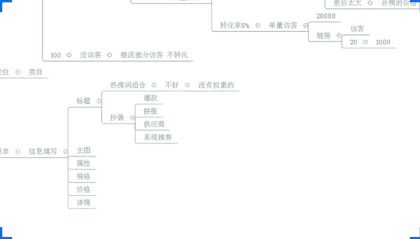
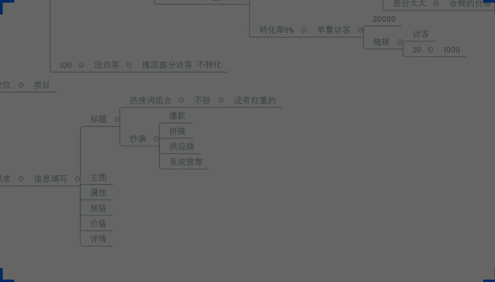
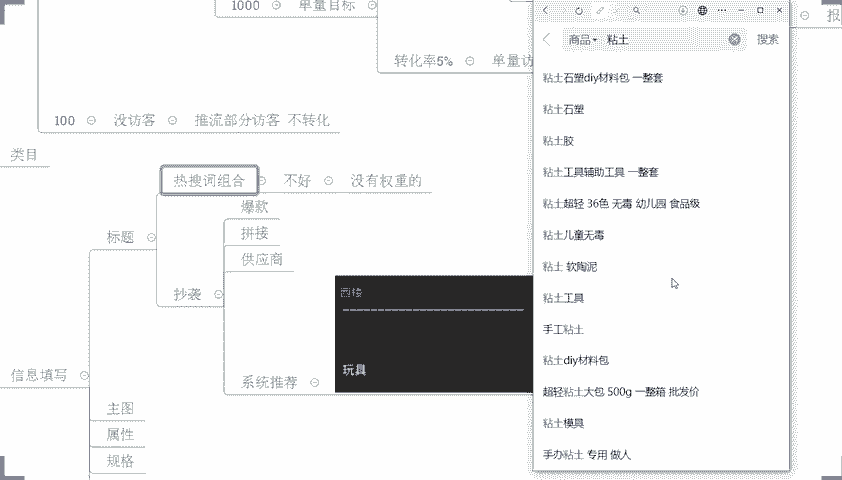
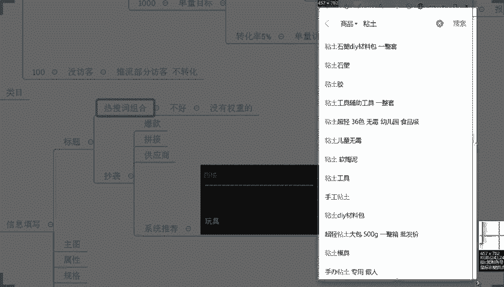
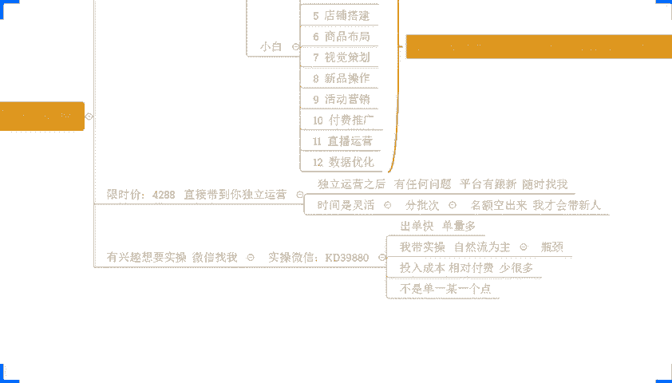

# 【拼多多运营】2024年最系统的全套拼多多运营教程，适合所有拼多多开店新手小卖家自学，10年资深运营师手把手教你从0到1起店实操。 - P52：52-拼多多小白攫取自然流量 中小卖家逆袭必备 - 拼多多运营教程_ - BV1H62ZYREs4

hello hello hello。😊，呃，撤下麦啊，这边所有的在直播间小伙伴们能够清楚的听到我的声音，能够看到我这边电脑桌面的话啊，声音方面如果都没问题呢，公屏上扣一个一，好吧，动作快啊。

我们先来确认一下。来，兄弟们。都没问题吧。OK啊，没问题就行啊没问题就行呃，在正式分享之前呢，还是老规矩啊，先把我们这个。直播间那些小小的要求呢，先说一说啊，这个免得我们后面的话听的不是很清楚吗。

其他人呢？声音清楚吗？声音清楚吗？其他人声音清楚吗？清楚是吧。呃，有杂音吗？还是怎么回事？大小合适吗？声音大小合适吗？OK啊，可以了是吧？啊，那应该应该是你自己设备的问题啊，应该是你自己设备的问题。

我因为我没动啊，因为我没动啊，OK呃，还是刚刚说的啊，那么。😊，调大点音量是吧就可以了是吧？OK啊行行行呃，因为我们这个直播间的话，其实有很多的这个新人，也有很多的这个呃老朋友，对吧？

所以呢呃每次开播之前呢还是老规矩啊，我们先把这个直播间的一些小姐的要求呢说一说啊，这样子呢避免我们在直播过程中呢发生一些这个影响我们节奏或者是一些不愉快的一个一个事情啊，那么哪些要求呢？O首先第一点啊。

兄弟们听清楚了啊，是哪里是吧？我是戏楼啊，我是戏楼。好啊，既然说有人质问字啊，哪里的话，一会儿我也顺便做一个自我介绍吧啊，免得你们说哎听完这整堂的直播呢，我感觉还是有点东西的对吧？但是我不知道是谁啊。

就很尴尬啊，O首先第一个要求啊，听清楚。那么在整个直播过程中的话啊，大家注意了，一定要干嘛呢？积极互动。😊，好吧，那我在分享过程中呢，有一些习惯啊，我习惯了是干嘛？提问。😡，那么我每次提到的这些问题呢。

一定是跟我们店铺操作息息相关的。而且呢大家的一个思维呢一般来说都会比较活跃一点，对吧？所以说你们跟着问题去思考的话，这样子对你们的吸收理解来说也会非常的有帮助。那么同样的，每次我分享完某一个内容之后呢。

我也会跟大家确认是吧，大家。能不能听懂？如果你能够听明白，能够听懂的话，记得到时候呢扣一回复我好不好？如果听不明白，没有理解O你也可以直接跟我讲。西楼，你刚刚讲的这个东西我没有听明白，我没有听懂，对吧？

如果确实很多人不清楚的话，没问题，我可以再讲一次，再给大家分享一遍都没问题的啊。那如果是极个别小伙伴的话，O那我也可以技术知道是谁，然后呢，我们可以这个下播之后单独交流都是可以的，好吧？

但是你不要说在直播间里面不吭声，对吧？你说哎我就在这里跟大爷一样，对吧？问我问题我也不回复啊，问我能不能理解，我也不说到下播之后呢，问题一大堆好出来问我，对吧？这种情况我是不爱搭理你的，好不好？

所以大家既然说来听直播的话，一定要有到一个正确的态度啊，这个是一个非常重要点啊。😊，OK这是第一个点。然后呢，第二个点，那么在我们整个直播过程中呢，还有一个问题是什么呢？

就是我知道你们今天呢可能也会有很多小伙伴呢是已经做店的，也会有很多小伙伴呢。还没有坐垫，对吧？那么没有坐垫的小伙伴呢，可能说对于店铺招作呢有很多很多的困惑，很多很多的不理解。那么包括已经坐店的小伙伴呢。

也会有到特别特别多的一些问题。但是这里我要说清楚一件事情啊，在直播间的话，你们可以提问。但是呢，这个问题啊仅限当前内容相关的问题。好吧，这一点大家能够去配合一下，是最好的。为什么这样说呢？因为。

就像我刚刚讲的有很多小伙伴可能呢是零基础的，还没有开店的对吧？也有可能小伙伴可能是开了一段时间店铺的，有一定自己的理解的。那么每个人呢都有每个人具体的问题，每个人呢都有每个人不同的情况。

那么你们每个人的问题呢，可能呃在呃大多数情况下可能是相通的但是也不排除说有的小伙伴呢可能基础会比较薄弱一点。那么呃你的问题分享出来之后呢，我们去解答的话，可能会导致很多小伙伴不理解。

我们需要有到一个完整的连贯的思路，对吧？不然说这边提一个问题，我分享一下，讲一讲那边提一个问题，我分享一下讲一讲，那我们整个时间是不够的。而且呢我们需要把完整的东西分享出来啊。

这样子大家才能更好的细收理解，好不好？所以这是第二个点，然后呢还有呢就是第三个点啊，第三个点呢也是非常关键的那如果你现在已经在做店铺了。如果你现在店铺操作呢是没有思路的。😊，那同时你在操作店铺的时候呢。

我分享的内容你是没有做到位的。啊，刚好呢这个情况呢也确实符合你的店铺实际情况。那么记得一定要什么去实操。好吧？因为再好的店铺数据呢，不是你去听直播，听出来的，也不是你看视频看出来的而是我们做出来的。

对不对？包括像我这里有很多小伙伴跟着实操做店，那么他们店铺数据，包括像这种可以看到啊，从零开始起步的店铺对吧？一个纯新店来的，一步一步提升起来，他也不是说看视频看出来的，而是做出来的，对不对？

包括像一些店铺呢，他们可能有一些数据了，有些基础了，那么能够去得到提高，也不是说去看视频看出来的，而是做出来的。所以这一点的话，希望大家能够理解啊。如果说你只是为了听而听的话。

那么没有必要完全可以去打两把游戏，对不对？刷两部剧对吧？更爽一点，好不？所以这几个点呢能够希望大家理解一下啊，如果ok没问题的话，大家可现在可以公屏上呢来扣一个一啊，如果说这个点没问题呢。

可以扣一个一啊，好吧。😊，嗯。OK啊呃反复横调没问题，对吧？诸哥没问题，空格没问题，随心随风啊风飞没问题啊。OK啊，好，没问题啊。既然说大家都没问题的话，那么就还是老规矩了。刚刚提到过的一个自播介绍。

对不对？啊，免得你们说哎这个人是谁的，我不清楚啊，这是哪里啊，我也不知道对吧？O了，那我呢叫西楼啊，大家可能认识我呢，就从我分享的视频开始的，对不对？那之所以大家过来跟我沟通交流呢。

也是因为可能觉得我分享内容比较干，对吧？确实呢有点东西，愿意呢跟我去交流沟通，想要去提升，对吧？这个我觉得非常好的当然呢。😊，那么我自己呢也不是什么这个所谓的培训机构老师，对吧？所谓的什么啊教育家啊。

不是啊，哪有这种东西来扯淡啊，我自己呢也就是一个老电商人啊。我最早呢是08年开始从事电商工作的，也有十来年了，对不对？😊，那么呃1年呢开始自己是从独立运营店铺了啊，那么13年呢我自己呢也是比较幸运啊。

那一年呢我自己经营的淘宝女装店铺呢是进入了top强啊那同时呢在这个时候呢也做了一定的原始积累到15年的时候呢也受邀在淘大做了一些分享。

那当年呢也评选为了优秀讲师那么也慢慢慢慢的接触到了更多的一些圈子跟人脉啊，为我后期的一个发展呢做了一些铺垫。17年呢也是做了我们拼多多店铺啊，那么拼多多店铺呢当年的营业额呢就做到了8700万啊。

算是还是比较比较成功的吧，算是啊那么也是这一年17年时候呢，一家港交所上市公司呢要求这个我啊做了他们的这个电商顾问哈那19年的时候呢，在全国电商大赛呢被评选为了认证讲师。

那20年呢在成都移动电峰会被评选为了电商经营人物top122年的时候呢，华南电商协会也授予了我。😊，一个荣易副会场的一个称号啊强哎还好啦还好啦，其实我很不愿意去说这些。

其实你们如果说是呃最近一段时间有经常跟我沟通交流的，或者是有关注过我很多次直播的小伙伴呢可能很少有看到我去说这些东西啊，因为我其实不愿意讲这些东西啊，只不过今天刚好有人问啊，这个是哪里？这是谁？

多说爱听是吧，怪不得老师的这个视频那么多干货啊不用叫我老师啊叫我游就可以了啊怎么说呢？其实干货这个东西的吧，在我这里从来不缺啊，这个是实话那么你们也会发现像我分享很多东西的话。

你们在别的地方可能是花钱去买那些所谓的培训机构的VIP课，你都别人听到啊，确实是这样子。但是货在干，你们也要去做啊，还是那句话，你不去做都等于您的啊，好不好？

那我自己呢尤其擅长的呢是这个整体运营策划U优化以直通车板块啊那么经营的品类也很多啊，包括像我自己呢有在做的店铺呢。😊，像这个服装、食品、五金、家居、数码，我都有来做啊。

那同时呢我接触过的品类也非常非常多，算是各个品类吧，都需要心得啊。如果说你们有什么样的一个产品，有什么样的问题，其实都可以跟我交流沟通的啊，这个我觉得OK没问题的啊。好，那说我是谁。😊。

继续说说今天我们分享内容，好吧，今天分常分享的内容呢就是说拼多多小白攫取自然流量，中小卖家利息必备的一个玩法啊。😡，那么这个内容呢可能在这里呢，大家还是有到呃很多很多的疑问对吧哎。

到底是什么东西讲的什么什么这个呃什么什么内容对吧？不是很清楚啊，其实呢也就是我们自然流量的一个作玩法。因为我不清楚你们具体的一个情况，所以我要围绕这个主题来分享更多的关于自然流的一些操作方式。

然后这个艾特说呃很有问题啊，很有问题是哪里有问题啊，可以说说没关系啊，时间呢还有一点点啊，还有一两分钟时间，那我们就直接开始了，两点钟开始了，对不对？你还有哪里有问题可以直接说啊，都是OK的。

怎么攫取自然流对吧？自然流现在可以玩吗？O啊，好，那还有没有什么其他问题，然后一会我统一回答好吧O。😊，如果没有什么其他的疑问啊，上了产品不知道干啥事情。😡，OO啊行行行啊。

怎么截取自然流然后这个自然流还可以玩吗？上产品之后不知道干啥，对吧？呃，自己的货但是没有图怎么做对吧？不付费，完全没有流量啊，上链接之不知道怎么做，不知道你们选品好啊，行，大家的问题呢，我记一下啊。

我记一下一会呢我尽可能的啊把大家把这一些问题给梳理一遍啊。那么在正式分享之前的话，我先把你们把这个问题先过一过吧，好不好？来来来来来，我先确认一下吧，有多少小伙伴目前是已经开店的，扣个一好不好？

还没有开店的，可以扣个零啊，我先确认一下啊，我先确认一下来来来来呃，了解一下你们的情况啊，这样也方便我们分享啊。O呃，反复跟调已经开店了对吧？然后呢是这个像这个拍案啊，是没有开店啊。

还有其他各位小伙伴是没有开店的O的啊。😊，刚刚我看到了什么刚刚我看到了什么，刚刚我看到了这个艾特说带足地板，我交钱。😊，艾啊不着急不着急啊，你可以先听一听啊，你可以听一听啊，多做了解啊。你这样子太冲动。

太盲目，我觉得反而不好，这样子我反而不敢收你，你知道吧？因为我说实话啊，因为我说实话我带我带人实操的话，确实是有带的，也确实要收费，但是不是说你们愿意花钱，我就收的啊，这个我讲真的对不对？

如果说我只是说单纯的去为了收钱而收钱的话，我觉得这个事情去做没有意义了啊，大家可以先听完我的分享，觉得确实适合你，确实值得你去跟着我实操坐店，O可以来，好不好？这个心随风飞，还有这个艾特没问题的话。

打个6好不好？来，你们两个你们两个真的是啊太调皮了啊。😊，我这真的是服啊，O ok啊。😊，啊，找了个运营，让你一直烧钱是吧？OK呃，怎么说呢？方法不同吧，可能只能只能这样讲，顶不住是吧？OK没问题啊。

那现在大家思路收一收好吧，那我现在呢先给大家解答一下你们刚刚的问题啊。第一个问题就是最严重的问题吧，可能就是你们说啊上架产品之后不知道要做什么。😊，上架产品啊。上架产品啊不知道做什么。

这个可能是最严重的问题啊。然后呢，还有人说的是这个自然流能不能做自然流怎么做？怎么做啊？OK那么今天我们主要的核心问题就是这个问题啊，自然流能不能做怎么做啊？然后呢呃其次就是我们上架产品的问题啊。

然后还有就是刚刚有小伙伴说，那么我们这个产品呢啊我自己的货，但是我没有图。😊，OK啊，那这些都是小问题啊，我讲真的啊，这些东西都是小问题。那首先第一个点，我们先把这个问题先给他理理顺啊。呃。

有多少人是上架产品之后，不知道做什么的，现在可以一起公屏上打个一或者打个问号都可以的啊。我先确认一次啊，有有遇到这种问题的人有多少，我先看一看。😊，喂，还不少啊还不少啊。OK啊哇，战争与和平啊。

你你都是这个老熟人了啊，你居然跟我讲，你扣个一啊，拉出去打打一顿啊，好吧，先把这个战争与和平拉出去打一顿啊，这个调皮啊，对吧？你居然你居然跟我说，你不知道做什么啊，你这对得起我这么久的这一个分享嘛。

对不对？你看我的这个视频也看了蛮多，看我的直播也看了蛮多次了，我对你有印响的啊，我对你有影响的啊，你不是第一次来啊，你居然说不知道做什么啊，真的是啊有点过分了啊，😡，O。😊，来来来啊，注意啊注意啊。

兄弟们来，那上架之后不知道做什么。其实这个东西呢根源问题是什么？是你自己没有一个完整的运营思路，你没有目标。😡，对吧你没有目标。😡，当然呢，刚刚我有看到说哎，那为什么说不知道做什么呢？我们可以做动销啊。

对吧？这个是谁说的来的？我看一下啊，馒头啊，馒头来馒头扣个一啊，来，兄弟们有跟馒头一样想法的，可以扣个一。😡，有跟馒头一样，想把它可以扣个一，做动销对吧？刚刚说哎，上了之后不知道做什么。

馒头说了一个做动销啊，对吧？这个还有什么好好好去纠结的，有跟他一样，想把他扣个一，好吧。😡，啊，景色什么是动销是不是OK啊，动销具体是什么啊，这个不清楚，没问题没问题没问题啊。行行行行行行。

OK那我大概知道了啊，我大概知道知道了你们的一个情况了。OK啊，就跟这个YO说的一样啊，做S单啊，做S单啊，所谓的动销呢，其实就是去做销量啊，做销量。😊，所谓的动销呢就做销量啊，我们把这个产品。

或者把我们整个店铺的商品呢通过人工的方式去完成销量的增长，对吧？我们说的这个文雅一点啊，因为有的词呢是违禁词嘛，不能说啊，大家理解一下，那我们如果去做了这个动作的话啊，就会导致一个问题。兄弟们。

如果你上来就去做这个事情，兄弟们啊，听清楚啊，听清楚，现在这个才是重点啊，这个不是做多做少的问题，不是你懂不懂的问题。兄弟们，这里有一个非常严重的事情，大家有到一个正确认知，我们做店铺可以去做这个事情。

😡，啊，我们可以做这个事情啊，先我说说一下啊，但是你做店铺不是只做这个事情。😡，明白吗？这个我这个东西很关键啊很重要啊，大家一定要有这个这样的一个一个概念啊。什么意思呢？各位我举个例子。

今天假如说啊我现在店铺是零访客，对吧？你们可能大多数新店刚开始操作的时候都是零访客，对吧？那么这种情况之下，如果说你去做销量，可不可以做。😡，能不能做？各位，你们说一下啊，然后乐乐说这个DSR要做吗？

不用做，前期不用不用直接去做这个东西啊，没必要啊没必要。😡，OK可以做对不对？没问题啊，这个可以做可以做啊，完全没问题。那我可以做啊，这个没问题啊。那如果今天我通过这样的操作，哎，我确实我做了动销了啊。

我店铺呢也确实能够有到正向的反馈，我的访客增长了。今天我的访客100个了。😊，我要继续做吗？😡，我要继续做吗？做多少先不着急啊，换到码啊，先不着急，我先帮你们把这个思路纠正过来。先啊。

那如果说今天我的访客不是您访客了，我是100个访客了，我还能继续做吗？缓缓是吧？okK那我现在店铺没有转化，要不要做？我先问一下，我店铺没有没有转化，要不要做。😡，如果没有没有转化。

你后面房客肯定会掉的，你要不要做？😡，要不要说各位要的打个要啊，不要的打个不要。😡，OK要做是吧？好，我们继续做啊，继续做。好，继续说之后，确实哎我们做了之后有效果呀。我确实我的反馈还在涨啊，对吧？哎。

我现在反馈涨到1000了。😡，啊，我现在反馈涨到1000了。我转化率很低，我现在转化率不够，还不够，我转化率才1%不到。😡，啊，正常来讲，我这个商品我起码要有5%的转化率啊，打个比方啊。😡，那。

打个比方啊，我现在转化率起码5%才能达标。那我先问一下，你们要不要做转化？😡，还继续吗？继续的打个一啊，继续的打个一。😡，继续做是吧？😡，OK继续做，没问题。继续做啊，我们扣个一啊，继续做。

继续做的话啊，今天假如说我们访客做到一万呢？😡，假如说啊我们访客做了1万，我们还是没有访客。😡，啊，我们还是没有访客，你做不做？😡，我们啊我们还是没有转化啊，不是不是没有访客，我们我们有一万访客啊。

还是没有转化，我转化率很低，1%不到了。😡，啊。对，有访客有访客，但是没有转化啊没转化。😡，不做啊，有人说做有人说不做。O我告诉大家。😊，这个时候你去做你都做不过来。😡，我告诉你，你做你都做不过来。😡。

所以说你们在做店铺的时候呢，往往很多小伙伴的思路就是有问题的，你知道吧？如果我是你们听清楚，如果我是你们啊，确实我可能会去做销量啊，这个没毛病，我们前期可能要少量的做一些基础销量技术评价，这个没有问题。

但是如果我真的去做这个事情，听清楚了啊，我可以做。😡，但是我要有度。啊，我要有度，什么叫有度呢？嗯，有度就是我要知道什么时候我该做什么时候不该做，我做多少为止，我就不能再往下做了。😡，能理解吧。啊。

乾隆开始烧钱了是吧，你正常啊正常，你还你还有一大截路要走啊，我跟你说，现在才刚开始啊。😡，那我们如果今天通过做销量的方式来拉伸权重。对吧我访客出来了，这个时候首先第一件事大家搞清楚什么呢？

我们所谓的店铺访客。😡，是因为我们的所谓的商品数据，店铺数据得到了系统的推荐，满足了系统的要求给到我们的访客，各位没问题吧。那么这个时候所谓的这个满足系统考核要求数据呢是假的呀。嗯，他是假的对吧？

他假的的时候呢，有一个问题，他一定不是那么的精准。如果精准的话，你就不可能说只是自己做数据，而没有真实访客转化，而没有大量的高转化率的一个数据。各位，这个逻辑如果大家认可的话，公屏扣个一。😡。

对吧如果说今天我就有访客，他不转换，一定是不精准啊。😡，但是如果我还一直维持着不精准的访客，让他继续变得更多，变得更大，那我店铺一直不精准。😡，你能有后续有到一个什么样的一个一个机会吗？没有的对吧？

没有的，你想想，如果今天我们真的到1000个访客了，店铺转化率1%都不到，你还使劲的去做销量。😡，一天你得做多少啊？10间里得做多少啊？一个月你得做多少啊？各位算过这个账没？如果说我们一直这样去做。

那你店铺还能健康吗？你不可能健康。那做销量的目的是什么？做销量的目的是前期的。😡，基础数据是不是？让我们基础数据达标得到平台的认可。平台进行推流之后，我们是要进行真实转化的。如果说你不能真实转化。😡。

那么一定是我们的运营方式有问题，要么是产品有问题，要么是我们的营销策略有问题，要么是其他问题都有可能。我们要解决这些问题才能继续往下走。各位认可吗？认可的话，公屏打个6。😡，如果这个逻辑大家认可的话。

我们打个6。所以说这就是问题啊，你们很多时候做店的时候呢，就会陷入一些误区啊，这个就是一个最大的误区。然后就有很多小伙伴说，哎，那我要做多少，我怎么做，这个都不是重要的，这个都不重要，知道吧？

重要的是我们要做什么。各位来回过头来看一看啊，刚刚我们不是说吗？那么我们之所以会觉得上架商品之后，你没有一个完整的思路，没有一个方法，你不知道做什么，是因为你没有一个整体的思路，对吧？你没有目标。

那我们什么样的目标是我们要去做这个事情，各位很简单，那我今天我开了一个店铺，我希望我店铺能够达成什么样的数据，或者我当前我要定出一个我自己通过数据分析。😡，了解到的一个能够去实现的一个真实数据。

让这个数据作为我的目标，我要通过哪些数据优化来达成它？知道吧？比如说啊我们举一个简单的例子，今天我做服装的啊，打个比方啊，我做服装的那我希望我一天能够卖个10千0单，对吧？我希望我一天能卖1000单。

那么这1000单我们是卖什么款，这些款在同行在我们平台上，他们能不能卖得动，他们一天能卖多少，我要去做一样做这样的分析吧，对吧？如果说我卖的这些款确实在市场上？😡，卖得动。啊，我确实在市场上卖得动呃。

不负沙华，其他问题在下播之后单独问吧，好不好？这个时候就不要不要问一些其他不相关的问题了啊，好不好？这个时候解答起来会比较比较麻烦一点啊，会影响我们其他小伙伴的一个观感的，感谢理解啊，如果能够理解的话。

扣个一啊。如果不理解的话，你稍微忍耐忍耐啊，感谢配合，感谢配合啊。O那这个东西如果我们的同行他卖得动，我们去做，那我们能拿到什么样的数据，我们也要有个目标，对不对？😊，那么。😡。

这个目标怎么拆分是我们前期必须做的事情。如果说你今天是运营的。那么你们一定会听说过一句话，你们的老板会跟你说，哎，你出一个运营计划啊，或者你出一个运营方案来，对吧？我们制定一个计划来，对吧？

如果说你自己是老板，你自己是创业者的身份，你想要去做一个事情的话，你也要有计划，这个很重要。我们今天首先要把这个搞定它搞定好这个之后，你就可以知道你每个阶段要做什么该做什么，而不是说我上架产品之后。

就不知道做什么好吧？那么我们应该做什么呢？O就我们刚刚说的这个例子，对不对？我希望我一天能够卖一0千单，好吧？这是我的单量要求，或者我的单量目标吧，好不？那我有了这个目标之后，我要结合到大盘数据分析。

结合到我们竞争对手的分析来确定一个我们自己达成这个目标的具体每一组数据的一个。😡，具体的目标啊，那么一00单的销量啊我们举例子啊，你们如果说哎今天我是新手，我的目标不高，我可以少一点无所谓啊。

这个东西我们可以把这个逻辑理顺就好了哈。那么其实100单真的也不算什么了啊，也不算什么。在拼多多来说，真的兄弟们，你们要知道拼多多的核心呢，它就是出单快。😡，啊，单量多。啊，出单块啊。单量大单量多啊。

你们可以看看这个点不来。😡，有看到这个店铺的扣个一好不好，有看到这个店铺扣个一来顺来有看到吗？有看到扣个一好吧，有看的扣个一啊，有看的扣个一。😡，来，你说一000单很多吗？其实一0单也还好。

你看这个店铺零访客的新店有没有临访客的新店啊，从最早临访开始做的，对不对？到后面的话，一天多少1400多单，13。41%的转化率对吧？10800多的访客40多克能奖，对吧？

而且这个店铺我告诉大家做什么的哈？这个店铺做的是枸杞。😡，枸杞这种东西，这个客单价已经算很高了，兄弟们知道吧？你们如果说对这个产品不了解，你们可以去搜索看一看这个客单价在这一个类目里面已经是很高很高了。

😡，一天也能卖10千0单，所以说还好啦，对吧？所以一000单这个目标其实还好了。我觉得呃如果我们去做店铺的话，一定要有到这样的一个一个目标才是一个合理的。

或者才是一个呃更健康的目标啊O我有朋友挺需要的是吧？我的天怎么我突然感觉画风变了啊，这家伙真的是啊不要把我的这个思路带偏了啊啊不要把思路带偏了。文具也还好啊，对？文具啊这个艾啊这里我顺便多说一嘴吧。

艾啊文具呢其实你可以把它定位成是这个学生用的跟办公用的这个办公的一个一个这个文具，对不对？把它细分开来去操作。那么针对到不同场景，不同的这个无中生有。😊，薪水丰飞啊，你这个家伙真的傻。

瞬间把我把我逗乐了。😊，我我受不了受不了。😊，我送了啊呃。😊，把我把我把我整的怎么会啊？😊，你这个你这个无助C又整出来，这我不会了啊。😊，哎呦，给我缓一缓平静一下平静一下啊。😊，呃。

然后然后刚刚说的这个文具，对不对？你把它细细细分成这个呃学生用的文具跟这个办公的对吧？然后细分人群细分场景，然后呢做多链接的操作。那么这个多链接怎么做呢？不同的人群啊，不同的人群，不同的使用场景。😊。

啊，不同的使用场景。再加上呢不同的价格知道吧？去做。比如说我最最这个最低价的SQ呢用一支的笔对吧？做引流SQU做低价SQU然后呢可以做1支装的、20支装的做其他的链接。

然后一支装的里面呢是包含我们10只装、2支装的对吧？然后我们可以在不同的价格段里面，不同的人群里面，不同场景里面都有到覆盖。😡，能理解吗？能理解扣1。同时每个价格段我建议呢你可以做到三个链接左右的样子。

这样去操作呢，其实在后期呢会有到更好的效果。因为你的这个产品呢，它属于半标品来的，半标品的话搜索值很集中。知道吧？所以我们要去通过这个多链接的方式来做吸分人群去冲量。因为你如果去做大爆款的话，难度太大。

投入成本太高。这样的话是不利于你的你的这个提升的啊。包括像你们刚刚讲的这个摆件哪，对不对啊，玩具呀其实也都差不多。不过玩具类目的话也会遇到更多的玩法啊。呃，馒头说这个低价SQ被驳回，说低价牛怎么办？呃。

你们低价引流SQ被驳回的话，操作问题啊。😊，操作问题啊，我只能这样说。那么呃这个的话，在我们刚刚讲到的这个应用场景里面去做的话，对不对？我用到多个产品去多个链接去发布的时候，一定会涉及到低价引流。

但是低价引流的话，大多数人都会面临着一个问题，就是被驳回，是因为你直接设置的价格太低了。😡，然后差价又太大了。知道吧？就会导致这么一个情况。那么这种情况怎么办呢？OK我们低价的这个SKU。

你发布在合规的价格段啊，合规的价格啊不是价格段啊，发布之后你上线了，上架了之后，你再去报活动。😡，啊，这个像现实性能够知道吧？限实性能够。可以去针对到单个SQ进行打折。对，打下来就可以了。

这样的话啊基本上是没问题的啊，基本上没问题的啊。然后这个健康类产品。啊，这个看你具体什么产品啊，这个很多的啊，像这个童书童书跟这个差不多，跟这个玩具类目差不多，跟这个文具类目也差不多的啊。😡，呃。

穿戴家怎么开车，开车这个东西先不讲啊，先不说啊，这个东西今天不今天不说开车啊，兄弟们今天不说开车啊。😊，今天说自然牛啊，今天我们就只说自然流啊，O扯得有点远啊，我们回过头来，刚才我们不是讲到嘛，对吧？

这个操作方式，那我要去做这个事情，那当我确定好我的链接之后，确定好我的这个目标之后，我们去上架操作，对不对？上架的时候我们去做的话，我们要清楚的知道我们的转化率，我是大概在什么位置的。

这个是我通过市场分析可以知道的各位能理解吧？比如说市场我的同行转化率在5%ok我把目标呢先定到5%，我要以这个目标来作为我的初始运营的一个计划啊，那如果今天我的这个目标单量是1000单。

那我的转化率定到5%的话，O那我们就可以反推得到我的反客要多少各位没问题吧。市场咋分析，这个先不着急把思路理顺啊，把思路先理顺好不好？具体的一些小的细节点，一会我们有时间我们会具体讲啊，大家不用着急啊。

😊，不用着急好吧，来，没问题吧。😡，来这里啊1000单是我的目标，对不对？转化率呢，我知道了5%，那我以5%的这样的一个数据呢来反推算出来，我达成这个单量，我需要的访客有多少。各位。

你们可以帮我算一下吗？5%的转化率，我要1000单的话，要做多少访客。😡，来。这个数据大家会不会算？如果说不会算的，打问号啊。如果会算的话，把答案发公屏上。😡，不能算。😡，不是吧。不是吧，这个。😊。

这个心随风心随风飞啊，你你这个不应该啊，对吧？你做灯具的，按照正常来讲的话，做灯具的一帮老板啊，真的是很厉害的，我都我都很清楚的，对吧？你不会说这个不会玩，这不太至于啊，对吧？

OK这个其他小伙伴有帮我算出来说是2万，对吧？好。😡，2万访客。Ha。2万访客是吧？OK2万访客的话，那既然说我有这个目标之后啊，我需要达成这个单量，我可以去做到这一个呃5%转化率。我需要两万访客的话。

好，那我再把这2万访客打散我们的链接。需要去分摊承接这些流量。啊，那这里2万好高，是因为我们发现我们的转化率比较低，对不对？那假如说我能做了10%转化率呢？😡，对吧那我是不是只要一万了？😡，对不对？

那我如果说能做到20%转化率呢？😡，那我这里是不是就只要5000了呀？😡，对吧所以我们要去辩证的去看这个事情。😡，啊，是不是很高啊，估计手机得响一天。😊，Okay。😊，其实其实也还好啦其实也还好啦。

其实转化率这个东西啊，后面我会跟你们分享怎么去玩哈，怎么去提升。其转化率对我来说并不是什么特别大的难事啊。你们可以看到这个店铺来，各位有看到这个店铺吗？来这个店铺有看到没有？😊，你看到没有。

访客呢17000啊，没有刚刚我们说2万那么多啊，没有没有我们刚刚说2万那么多他一天能做3200单啊，一天做3200单，看到没有？那么他的一个转化率呢，18。64%啊，18。64%看到没有？

所以转化率我们也是可以去操作优化的对吧？怎么去让我们的数据变得更好，怎么样去引导我们真实用户转化，怎么去拉伸我们商品数据，这个是我们后期要去调整优化的部分，前期我们先可以不用着急。

不用那么不用那么去想那么多都没关系的啊，知道吧？这个都是O的，这个还好啊，18。64%还好了。我自己的食品店铺啊，这个杨龙啊，我跟你讲我自己的那个食品店铺转化率30%几。😡，啊，常年都是30%几。

那个内目根本就不用去做任何的费予推广啊，完全是这有。😡，因为转化率已经够高了，在同类型的商这个商品里面的话，算是常年霸榜吧啊，基本这样子的。因为我转化率够高，因为我能够去把这个数所有的数据直接入来。

知道吧？所以平台会给我推牛啊，具体什么我就先不说了啊，这个东西不能透露太多啊。😡，Okay。😊，来啊，我们继续往下啊，那既然说今天我能够去做到。😡，假如说20%转化率的话，我需要5000访客。

那我今天如何去把这5000访客做出来，对不对？我们有多少个链接？😡，每个链接我要去承接多少那个访客啊，对吧？我们有多少链接，我们这里每个链接要承接多少访客？假如说我有10个链接。😡，啊，不是黑虎的啊。

不是黑虎的。假如说我有10个链接，这每个链接我都能够拿到500个访客。😡，啊，每个链接我能拿到500访客过分吗？😡，各位我我说一下这个过分吗？😡，一个链接500访客过分吗？不过分嘛，对不对？

所以你们一开始说哎2万访客好多呀，感觉完全没没机会做不起来，感觉好恐怖啊，其实不过分也不过不恐怖，对不对？我们还是回过头来。如果是5%的转化率，对不对？2万访客的话。😡。

对吧我们一个链接也就两000网客嘛。😡，对吧这个根本就不多。如果说你说哎2000访客对我来说太难了。那我做多点链接，每个链接我都能够去做个1000访客行不行啊？我做20个链接，对吧？

每个访每个链接1000访客行不行？当然也行啊，对不对？前提条件是我们能够去把这些数据做好之后，能够有到一个好的转化，对吧？这个是很关键一个点。那么这些数据我们把它拆分出来之后，那我们怎么去上架产品。

怎么去做店铺，到后期的话，我们怎么去把访客拉伸上来，怎么去营销，怎么去进行转化，这些才是关键，而不是说我们怎么去做销量，我们要做多少销量，这些都不是什么重点。😡，能理解吧？

那么这个地方呢可能还是有很多小伙伴不理解，哎，我现在怎么做呀，对吧？你说了半天，我还是不知道我应该做什么呀，我应该怎么去做销量，我应该怎么去做评价呀，对吧？😡，我应该怎么去出单，怎么去拉权重啊？😡。

这里我告诉你，你如果只想着去做销量，做评价的话，真的对，就像艾说的一样的，一点用都没有，毛用都没有。😡，知道吧？你们有很多人店铺有没有这种情况，就是哎，今天你店铺可能有个100来访客，对吧？

有没有这种情况呢？有个80个访客，你说我去做点销量，把这个权重拉一拉，把访客拉上去。😡，做完之后发现没反看了，有没有？😡，有没有这种情况，有的公民打一。😡，如果有的话，公屏打一。😡，有吧。

有OK行是这样子，环保就是这样子，是不是啊？其实这个东西就很正常。为什么呢？因为我们讲你去做的这种事情，它不是平台给你推流的真实访客进行转化的。那么这个时候呢，你推流部分。😡，他不转化。😡。

你说平台还会给你推牛吗？平台又不是傻子给了你机会，你不中用啊，他还给你机会干啥呢？是不是有个例子我经常举啊，对吧？呃，女朋友跟你一起出去玩，说哎，这个亲爱的我今天没有带钥匙，回去太晚了，进不去房门。

我可不可以跟你睡一晚上，对吧？啊，你说没问题，我去给你开个这个酒店啊，你去酒店住，对吧？😡，好解决这个是件小事情，对吧？给了你机会你不纵容，那能行吗？是不是该上的时候，你得上啊，是不是你该转化。

你得转化呀，就这么简单的那你如果不转化这式用户的话，OK了，完蛋。😡，啊，完蛋。那怎么行啊？对吧？OK那我们现在回过头来继续往下说啊，继续往下什么说说什么呢？就是我们战略能不能做怎么做的问题。

战略能做一定能做啊，这些跟着我实销的店铺，这些跟着我实销的店铺都是做战略的，这个店铺做女装的啊，这个店做女装的，7。91的转化率转化率不高啊，这个店铺做是这个呃。😡，拖把啊拖把14。991的转化率啊。

16000的访客一天的话，2400多单，是不对？所以他们都是自然流啊，他们都是自然流。OK那自然流怎么做？这里很关键一点啊，这里有很关键一点啊。那么其实很多时候之所以你们的流量上不来。

之所以你们的转化没有，是因为你们在一开始的时候啊，是因为你们在一开始的时候，你们的定位就出了问题。😡，啊，甚至于很多时候你们连发布商品都不会。😡，你们有没有人？😡，不信的。包括上面这个事情很简单。

对不对？你们有没有人不信你们不会的，如果有的话，打个一啊。如果有的话打个一。😡，哎，你们你们得不信啊，对吧？你们你们如果都信的话，那我我就没法继续往他说了，对吧？你们得让我装起来，对吧？😡。

这一波要配合一下啊，对吧？要让我装起来，到然我怎么装啊，对吧？😊，呃呃，发布商品不是很简单吗？OK啊不信是吧？OK啊好。😊，跟机位上面没关系啊跟纪位上面没关系啊，这波上不起来。😊，哎呀，这个是调皮啊。

这是不会发布是吧？好，没问题啊没问题啊。啊，这里我说一下啊呃，为什么我会说这个事情啊，因为你们大多数人做店铺呢，就是这样子的。你们你们所所谓的这个发布商品呢，只是按部就班的，按照所谓的系统的要求，对吧？

😊，你们所谓的发布商品呢，就是按照系统的要求，把这些商品信息啊，把这商品信息啊，然后填进去就完了。😡，对吧这种方式肯定是不对的。各位能懂吗？如果说我们发布商品只是填写系统要求的信息的话。

那么你这个发布商品有什么意义呢？没有任何意义。😡，各位，这句话可能大家很难理解啊，不着急，我马上就给他家解释一下，好吧，发布商品呢有很多东西要写，对不对？我们有内目要选择，对吧？我们有这个标题要写。😡。

我们有这个主图要上传啊，我们有这个商品属性要填写。我们还有商品的规格啊，我们的这个库存，我们的价格对吧？我们还会有到商品的这一个详情，对不对啊，基本上重要的东西就这些了。那么这么多东西要写。😡。

按照系统要求写就可以了吗？当然不是，那怎么写，这很关键内目这个我现在就不去解释啊，这个后期的话，如果说我们去做细分链接的话，我会再次去分享给大家去给大他家讲啊。这些板块我们先不讲，我们来讲讲标题。

各位标题部分大家会写吗？😡，嗯，标题部分大家会写吗？😡，会的这个这这卖讲，我我真真实地的问啊，大家不用去配合我了啊，会的就去扣个一，不会的就扣个2，好不好？这个地方我实事求是啊。

我们就不用去让我装不装饰装的问题了哈，对吧？😡，OK啊，有人是会的，有人是不会，有人打了一个3，你这个三是个什么鬼啊，会了扣一不会了扣2啊，你这个你这个三是既会又不会是吧？😊，啊，调皮啊这个。😊。

这个派大星啊，你就调皮啊，对吧？会超是吧？行行行行啊。😊，啊，杨乾龙，你这家伙真的是啊我我敢打赌啊。你之前我几次直播分享的时候一定没人能听啊，好吧，一定没有人能听。😡，你如果说只是会抄的话。

那么肯定是不对的啊。那呃这里的话我就先把这个标题，既然说大家很多人都不会啊，我先把这个标题说一说吧。因为你们其实有很多人说会也也根本就不会的啊，也根本就不会的。😡，呃，为什么这样说呢？来，我给他看一下。

好吧。这个店铺啊这个店铺刚刚我也说到过女装的，对不对？女装的。😡，这个店铺卖拖把的啊，卖拖把的。😡，这个店铺卖的是这个洗鞋神器，就是那个泡沫的那种啊，泡沫的刷小白鞋那种泡沫的啊，好吧。

然后还有这个店铺刚刚也提到过的对吧？一个纯新店做枸杞的啊，那么这些店铺呢跟我实操的时候呢，我们都会有到一个小操作。对于标题写作方面啊，我们都会有到一个小操作啊。那么这个小操作呢。

是你们可能在其他地方听不到的。😡，甚至你们在其他地方花钱都听不到啊，这一点我可以肯定。😡，因为至少在目前为止，我没有听说过别人给你们分享过这个东西，我也没有见过有谁讲过这个东西。😡。

在电商圈子里面有很多的操作，是别人不会去跟你讲的。😡，知道吧？你花钱别人都不跟你讲的东西。😡，所以今天的话以下这一趴这个东西大家一定要认真听。😡，那么这里我提醒大家啊，认真听啊。如果一会儿你没有听到。

你听漏了。😡，兄弟们，你的损失，你听没有你没有没有听懂，你可以问我。如果你说你没有听懂，你又不跟我说，你到时候说哎，记楼，你能不能再跟我讲一下这个东西，我不知道，抱歉啊，不要找我啊。我反复强调一下。

这个东西很干很重要啊很干很重要啊。OK那么大多数情况之下呢，你们去写标题呢。😡，稍微懂一点的人啊，可能是用到一些热搜词。对吧来进行组合，没错吧，这个是算是比较懂的了啊。然后不懂的呢。

纯新手呢可能就是抄袭。😡，对吧找到一些爆款的。😡，直接就这个呃原原封不动的抄过来，然后呢，有的可能还稍微这个呃这个矜持一点，对吧？可能这个标题。😊，啊，截取一点。啊，另外一个标题。再截取一点对吧？

然后拼起来啊拼接一个。对吧这个是这个是不会写的。😡，然后呢，还有呢，就是可能说完全不去写的。😡，就直接干嘛呢？供应商给的这一个资料啊，直接去使用。😡，对吧。😡，没错吧。😡，然后上照片会有推荐。

我都直接用的OK啊好，然后还有就是系统推荐啊，系统推荐啊。OK这些其实都不算会写标题啊，这些都不算会写标题，稍微会写一点标题的，可能就呃这实是组合了，这个算是比较会的了啊。

那么呃这个操作方式呢对不对肯定是对的啊，我不能说它错啊，我不能说它错，他肯定是肯定不能说是错的啊，肯定不能说它错的啊，这种方式一定不是错的，但是它不是好的啊，但它不好。😊，什么意思呢？各位。

我举个例子啊，今天。😡，大家可能都知道我叫谢楼，对吧？😡，那也都知道西楼坐垫呢有两把刷子，对不对？你说哎，既然说叫西楼可以有两把刷子，我去把我的这个昵称，把我的名字也改成西楼。那我是不是就有两把刷子呢？

😡，你可能一把都没有，对吧？😡，所以你做标题的时候，你去抄袭也好，你单纯的去组合热搜食也好，你能用到的这些词是你那些所谓的高权重商品都在用的，你用可以，但是你是没有权重的。😡，各位，这个逻辑能懂吧？

如果能理解公平答一。好吧，如果这个逻辑能够理解公民打一，所以你去抄袭也好，你去用这些所谓的热诗词也好，你可以用。但是你用的时候你是没有权重的，这个很关键。😡，啊，这个很关键啊，那怎么做呢？来各位。

我们我们我们拿一个产品来举例子好不好？各位没问题吧。呃，你们是做什么产品的？现在呢可以这个等一下啊，一会儿呢我在公屏上呢画一条线啊，我我喊321啊，大家可以可以自己呢在公屏上刷起来啊，我喊321。

我把我我画的这条线呢，在公屏上发出来，在我线下面的第一个这个产品呢，我就拿来做我们的分享的案例啊，好不好？呃，各位准备好啊，呃，你们可以你们先不着急发啊，你们听我喊321再发都可以的啊，好不好？

或者你们看你们可以直接刷起来吧，你们再刷起来。因为有的时候有延迟啊，可能我发出来之后呢，我的这个声音还没出来啊，都有可能啊，O呃3。😊，2。一。OKOK啊，行行行行行啊。

可以听了可以听了可以停了可以停了可以停了，可以停了。兄弟们停了，我找不到线了啊，我找不到线了，你们不要刷太多了啊，亲爱的啊，你们真是牛逼啊啊，牛逼插真真牛逼啊，你们别刷了别刷了。

我受不了了我发现我给自己挖了个坑啊，啊，下次我还是扫码吧，你们这样搞受不了啊啊，我我我找到线了，我找到线不要刷了，不要刷不要刷，大家停一下。😊，喂。哎呀，我服了。😊，我服了啊啊。

停一下停一下停停停停真停一下，真停一下，你们再这样，你们再这样，我真的找不到了啊。OK呃，等我截个图啊，我哎，我的我的天。😊。

我截图的时候又被弹走了啊，你们你们稍微等我一下啊O啊，我截个图啊，我我截出来啊，截我截出来啊来我截出来了啊，在我线下面啊，在我线下面啊，这一个空白空白说玩具啊，空白说玩具啊，好不好？

O ok ok你们今加真调皮啊啊，讨厌啊讨厌啊，不要这么皮啊，不要这么皮，你们该该听话一点。有的时候啊你们这样搞拖拖拖拖乱节奏了，效率会很低的。兄弟们产品有的时候是什么不重要啊，重要的方式方法啊。

好不好？大家大家不要这么这么的这么的着急生怕刷不到自己的，是不是O啊来啊思路思路跟上啊，兄弟们现在公屏打个一好不？公屏打个一思路跟上了啊，思路跟上我们我们以玩具来举例子啊，我们以玩具来举例子啊？

现在思路跟上啊，你们做什么产品的不重要重要的是现在我们所有人都是做玩具的，好不好？我们把思路给他理顺。😊。

没问题吧，这个很关键啊呃空白。你做玩具做多久了？😡，你做玩具做多久了？😡，啊，大人玩具乾隆啊，你这个家伙真服啊，真的是啊我们直播间有女孩子啊，不要这样子啊，一年是吧？OK一年的话也算是小有经验了吧。

对不对？呃，刚好呢我之前是有带过做玩具的啊，刚好我之前是带过做玩具的，我给你看一下，也是一个新店啊，也是个新店，我给你找一找啊，之前那个做玩具的店铺啊来。😊，当时呢也还是也是这个数据还做的蛮不错的。

算是这个店铺做的是积木啊，这个店铺做的是积木啊，做的是积木玩具啊，可以看到啊呃，当时呢做到的是50多开原价，一天呢1000多单，然后13。27的转化率啊。这个店铺早期的时候，各位。可以看一下啊。

这个店铺早期的时候呢，他数据很差劲，一直起不来。我给你们看看它转化率啊来。😡，有看到扣1有看到扣一来，兄弟们有看到扣一啊，有看到扣一。他早期的时候访客上不来的啊，访客上不来的，一直很难上来啊。

跟着实操之后呢，我们重新做了一些调整优化，之后把转化率拉上去了啊，看到没有？转化率从原来的4点几5点几啊，拉到了十几啊，拉到十级，也正是因为这个操作啊，它的整体数据才上来的，看到没有？转化上升之后呢。

它的访客是在不断上升的啊，到后期转化啊差不多在111号左右的时候，转化达到了顶峰，访客开始疯涨的，看到没有？所以我们想要做店铺的话，转化率是核心，知道吧？这个点的话，大家记住了啊，转化率是核心。

也要一定要去有到一个很好的流量呈现能力跟这个流量的一个消耗能力，不然的话没有用的啊，O那么回过头来，我们来说一说玩具我们怎么去做标题，好不？来那么呃这个空白你做的是什么玩具。😊，玩具是一个大类嘛，对吧？

我们具体一点啊，具体的产品说出来啊，我们来找一找，我们来去看一看哈。😡，啊。黏土是吧，OK。好。okK粘土啊，来各位。😊，我们去做标题的时候呢，刚刚我说了有很多种方式，对不对？

有很多人呢可能会选择用热搜词来进行组合，对吧？也有很多人选择用到呃所谓的爆款链接进行抄袭，找到几个产品进行粘贴，是不是？然后呢，有的人可能是直接在系统里面去呃找到一些推荐词使用的，对不对？

那么我建议大家我们都可以试着去尝试用热词进行组合啊，好不好？这是没毛病的啊，那目前来讲的话，拼多多平台官方后台呢是没有关键词数据给到我们的。但是这个下拉框时呢。

一定是我们当前这个关键词相关词里面热度比较高的词数据比较大的词啊啊，这个这个在这个电脑上的话，你直接打开网页就可以了呀。啊，你直接打开网网页就可以了。呃，我。我是啊我我给你看一下啊，我是怎么怎么弄的啊。

来，你看到没有？我是直接在我的微信里面啊，我是直接在我的微信里面把这个链接直接点开的啊，直接点开就可以了啊。O是这样子操作的，你可以可以自己操作试试看啊，直接把网页打开就可以了啊。那么啊没有网址的话。

你下下播之后可以找我都可以了啊。好吧，没有网址下播之后找我就可以了。那这个地方呢我们重点说一说这些下拉框词是我们当前这一个关键词粘土这个关键词，它的相关关键词，这一点大家有没有意见，没有意见的话。

打个6好不好？如果这一点没有意见，打个6。😊，这些下面这些关键词啊，这些所有的关键词都是跟我们粘土这个词相关的，关联性很高的词，对不对？关联性很强的关键词，对吧？这个大家没意见吧。😡，嗯。啊。

我有很多个微信啊，是这样子的，我的天。😡，我的而且我这边双频来的啊，而且我你们跟我说什么我都知道的啊，所以不用说担心说加里不是我不至于，对吧？啊，哪有这种说辞的来啊可以看到这边啊。😡，可以看到这边啊。

兄弟们动作快啊动作快啊。那么在我这里的话，我们可以看到所有的关键词是在我们下拉框会进行展示的。这个是我们刚讲的所谓的搜索热度高的一些系统词，对不对？推荐词。那么这些词为什么会出现在这个地方。各位。

我问一下这些词啊，这些词为什么会出现在这个地方？

大家可以说一说你们的想法。😡，来。这个问题大家思考一下。😡，搜索的人多啊，大家都在搜OK。只有这样吗？😡，只有这样的吗？用的人多啊，做关键词权重高是吧？好，OK来啊，各位。😡，这里我说一下啊。

他不是说单纯的收的人多，仅此而已。😡，那么刚刚这个YO说用的人多啊，其实不够精准啊，应该是购物人群多。所以他这些词能够出现在这个地方的话，搜索的人一定很多，热度一定很高，这个没毛病。但是对这些。

关键词的产品有需求的用户也很多，知道吧？用户需求高于一切。😡，那为什么这样说呢？来，我们举个例子。😡，如果说今天我自己去搜索黏土这个产品关键词。我会搜什么，各位。😡，我会说什么？嗯，我说什么？

我一说连土对不对？😡，或者我回收儿童玩具粘土，对吧？😡，没错吧，但是像这种词我会收吗？比如说呃，粘土超轻36色五桐幼儿园食品级我会收吗？我自己主动搜索的时候我会收吗？😡，这种词我相信99。

99%的人都不会收。😡，至少来说我们不会主动输入他，对不对？😡，没有人会输入这么复杂的一个关键词，但是系统会出现它为什么？因为对这种产品有需求的人也会很多。各位没毛病吧？😡，对这种产品有需求的人会很多。

对不对？然后呢，这个时候平台就会把这些词收入起来之后，按照一定的算法来进行排序推荐，把一些用户需求高的时呢展现在更靠前的位置，让我们方便去选择。对，进行点击，然后搜索。那么这个是我们做的一个事情。

这个也是系统做的一个事情。那么这个地方就有一个问题了。我用到这些关键词是不是我的同行也都在用？来。觉得是的，扣一，觉得不是的，扣2。这些关键词都是一些大词热词算的算起来，对不对？那么我相信啊我要用的话。

我同样肯定都会在用的。😡，没错吧，那么这里问题来了？如果说这些词，因为它的搜索量大。😡，因为他的需求高出现了。😡，啊，然后呢，我的同行。都在用。我用了这个关键词。

比如说啊今天我用的这个粘土超清无毒幼儿园晨光第一名啊，打个比方啊，打个比方，对，翻来覆去都这一思，是不是OK啊，没问题。来啊，如果今天我用了这个词。😡，我们的系统。当有人点击这个词搜索的时候。

平台会不会根据这个词来进行商品排序？会吧。那么我如果说是一个新品。我排名会不会特别靠后？一定会。知道吧？一定会，因为什么呢？因为平台进行商品排序的时候。😡，它是根据关键词的权重来的啊。

这个权重指的是我们当前这个商品在这一个关键词下面的数据反馈。我们没有数据呀，你就没有权重啊，你没有权重，你凭什么排名在别人有数据的上面前面呢？😡，是不是啊？没有没有道理啊，这也不科学呀。😡，是不是？

当然呢不排除在我们的新品推荐位。会有曝光啊，这个不排除。但是我们不考虑新品推荐位的时候，我们生品排名一定会特别靠后。😡，所以这个时候我们说我们用到这下拉框尺来进行组合，对吧？

比如说我我现在随便的来举举个例子吧，不好？我也不知道我们具体产品是什么样子的啊。那我今天我们就拿这一词来来组合一下，对吧？哎，现在呢我的核心关键词呢是粘土。😡，对吧然后呢。

我们这个呃联土呢还有一个别称软陶泥，对不对？我把这个软陶泥直接写进来。😡，那这个时候呢，这个词呢就可以覆盖掉我们的呃粘土这个词，覆盖掉软陶泥这个词，覆盖掉粘土软陶泥这个词，对不对？把它做进来。

然后再是儿童。无毒。啊啊，什么大包。超清对吧？啊，500克。对吧一整箱。批发价。啊，等等啊，按照这种方式，我把这些下拉框里面符合我产品的词把它做进来，对吧？这个就是我们所谓的利用下拉框词进行组合。

当是组合的时候呢，我们可能还会参考到哪些词放在前面，哪些词放在后面啊，那么也会考虑到我们这个呃语句的一个连贯性，对不对？但是这样的组合，就像我说的，它也没有权重的，它没有权重的话，我们会有曝光吗？

我们曝光会多吗？不会太多。😡，我们也不会说能够很轻易的获取的访客，对吧？哪怕我们今天我说我上架之后，我去做销量。😡，同行都有在卖，而且他卖的还不错。你通过这些词，哪怕你直接通过这些词去做关键词的产出。

你也不会有太好的权重，你也不会有太高的数据。为什么？因为你的数据可能没有同行多，是不是？😡，那你成交了一单，别人成交了十0单，你能比吗？你比不了，那怎么办？各位，这里就涉及到了我今天我说的那个我自己。

包括说我带实操小伙伴，我们都在用的一个骚操作啊，你们在别的地方听不到的，花钱都听不到的东西，好吧，现在啊。😡，在认真听的啊，公屏上6扣一波，好吧，直接开始啊，好不，六扣一波，直接开始啊，我看一下啊。

把你们的热情拿出来好不好？来动作快。😡，嗯。哎，有5楼那么骚。可以的啊，来啊开始了开始啊。😊，来。今天呢我写了一个标题，这是我的产品，我的标题，对不对？那我的这个产品，我的这个标题呢，我在发布的时候。

我也是通过我们的下拉框去进行组合的。但是在组合的时候，在进行这一个发布之前呢，我这个标题是不完整的。😡，我那个标题呢，它的字数。我不会去写满30个字，我会空出2到3个字来。各位注意了啊。

我会空出2到3个字来。😡，啊，2到3个字。好吧，我会空出来啊，我的标题我不会写写完整30个字，我会空出2到3个字。😡，这个字呢不用写太多，不用空太多。就留那么2到3个字的位置就可以了。然后呢。😡。

你要给我们这个产品。😡，下一个定义。什么叫下一个定义呢？我举个例子啊，大家可能就会很好理解呃，有多少小伙伴是对女装有了解的，是女孩子的，或者是有卖过女装，有接触过女装的，公屏打个一。😡。

有接触过有了解过或者是女孩子，后面打个一啊。😡，没接触过，不了解是吧？没关系啊没关系啊。那么这里的话，我给你们讲一个一个一个东西就知道了。😡，呃，在我如果我没有记错的话啊，在17呃。

18年的时候18年的时候啊。😡，当时呢有一个颜色。啊，有一个颜色特别的火，一直火到了现在，还有人在收，还有人在用什么颜色呢？叫做。😡，牛油果绿。这个词听过的公民党一啊，公民党6吧啊。

这个词听过的公民党6有知道的，有听过的公民党6。😡，OK很多人知道啊很多人知道，那么各位牛油果绿。😡，你说以前。😡，这么多年了，有这个概念吗？😡，牛油果绿这个颜色之前一直这么多年有这个概念吗？没有。

对吧？😡，但是18年莫名其妙这个词就特别火。当然呢也也也脱离不了这些所谓的这个网络达人，他们的一个助力，对吧？天天在说这个刘油果利怎么怎么地怎么怎么地啊，然后呢，就有很多人去啊做这个词啊，因为刘油果贵。

😡，牛油果其实还好，也不算贵啊，也不算贵。呃，然后呃没见过没见过你去搜一搜牛油果绿啊，是什么绿就知道了。那当时呢就有很多这种呃裙子啊，很多这种这个衬衣呀，很多这种打底呀，都是牛油果绿。

然后这个词呢也特别火，搜的人也特别多。那么在没有这个颜色，没有很火之前。😊，别人都是绿色，对吧？都是说的是绿色。😡，有这个词之后呢，所有人都用了这个词。什么意思？就是因为有人对这个绿色下了一个定义。

这个就叫夏定义。啊，它定义为牛油果绿，然后牛油果绿呢在所谓的这些人心目中就成为了一个所谓的流行的一个趋势。是不是？然后呢就会有到很多人哎觉得这个颜色不错，或者是他有到这样的一个固定需求之后。

就去搜牛油果绿、牛油果绿连衣裙、牛油果绿T恤、牛油果绿打底衫，对吧？然后呢就会有到很火的一个热度。那这个时候如果说各位我们把这个逻辑鉴立一下啊，当初你如果是在做服装。你们的同行用的都是绿色这个关键词。

如果你用的关键词是牛油果绿的话，你们觉得会怎么样？😊，来。你们会不会就是一场拖天的富贵呀？😡，有没有？😡，对吧炸了啊炸了那一波破天富贵，但是当时你没接住啊。😡，肯定会呀肯定会呀，因为。😡。

同行没有用的时候，你去用的这个词。然后呢，很多人去收的时候，收到的产品都是你的。你说你不火谁火，你不报谁报，你如果不报，这个没天理。😡，是不是这个逻辑？那么这跟我刚刚讲的这个有什么关系呢？来。

我们刚才不是讲吗？我在我的标题里面空出2到3个字。😡，对吧干嘛呢？给我的产品下一个定义。😡，下一个什么定义呢？我们不是这个呃粘土啊，软陶泥吗？对不对？我们不是个产品吗？那这个产品有什么特性？

跟我们的使用？😡，或者是购买。能够相关的，我们把它做这么一个定义，对吧？呃，这个粘土。他是呃这个小孩子用对吧？小孩子玩啊，做造型的做造型的，对不对？然后呢呃可以做一些这个。😡，呃。

你藕啊或者说什么东西啊，那我们今天就给他做一个定义。那这个定义呢，我们需要结合到产品的实际情况来，它不是说我们随随便便张口就来了，或者随便取一个就可以的。一定是要不脱离我们产品，对吧？比如说绿色。

它叫牛油果绿。😡，各位逻辑能懂吗？😡，逻辑能懂吗？逻辑能懂的话，公屏打一。😡，这个逻辑如果说能懂到公民打赢。okK ok ok ok啊，没问题是吧？能懂是吧？好，那就行啊。那今天我们就来看一看啊。

当前在这一些热搜池里面啊，当前在这些热搜池里面有超清有无毒啊呃有食品级可食用，你这个就验过分了啊，我记。😊，你这个可实用经点过分了，你这个别人是这个玩插边啊，你这个是作死啊。😊，你可实用。

你这个怎么滴也说不过去嘛啊。😡，我先跟你嘴你塞一块啊，真的是啊。😊，无毒啊无毒是吧？OK啊无毒已经有了啊，无毒已经有了，看到没有？这里面是有无毒的，看到没有？有无毒的啊啊，无毒有的啊有的。😊。

对吧然后呢我们可以看一看啊，这里面都有一些什么词，然后这里面哪些词是跟我们产品相关的。然后我们可以去拓展一些修饰词出来的，懂吗？哪些是跟我们这个词跟我们这个产品相关的。然后去拓展修饰词。啊。

那这里呢我我讲真的啊，你让我一下张口就来，我确实做不到啊。大家把这个思路了解清楚就可以了。那么有了这么一个词之后，一致是吧，一致我看有没有啊，一志应该是有的啊，一志应该是有的。😡，啊。

一直还没有啊一直还没有，但是一志这个词虽然说可能没有进入到这个地方来，但是肯定是有的啊，肯定是有的。我们来我们来看一看啊，意志。😡，哎，一怎么不见了啊，这里啊找半天找不到他啊。😡，哎怎么不出来呀。

怎么不出来，一直没有吗？难道？😡，我这个输入法有毛病啊，打这个粘片打不出来。😡，哎，意志有的看到没有？有人是有在用的，但这个词应该确实用的人不多啊，这个词应该确实用的人不多啊，可以看到没有？😡。

看到没有？因为这个词它没有什么下拉框词啊，好吧？它没有什么下拉框词。那么我们可以这种思路来裂变啊来来操作来做出修饰起来。那么现在我们就假如说吧哈，我们现在就假如说打个比方，抑知这个词是没有人用的啊。

抑制这个词是没有人用的。😡，我这年批什么情况啊，这种常用识居然还跑到最后面去了。来啊，意志啊。😡，粘土啊，打个比方啊，现在这个词是没有人在用啊，好不好？那现在呢我把它做进我的标题里面去，好不好？

我把它做进我的标题里面去。各位注意了啊，所有人注意了啊，那我上架商品之后，如果说我去做这个什么呃粘土软陶泥粘土儿童无毒这种词我干不过我的同行，对不对？😡，没错吧，那今天我就做意制粘土。😡，益制粘土。

儿童。无毒。我就做。😡，一字粘土啊复制吧，这个复制方便一点。然后阮陶离。是不是我说这样子，各位。😡，能够明白吗？做这种词的话，这个时候因为意志这个词同行用的人很少。😡，几乎没什么人用。

所以这个时候我去使用的话，那么我产品被收入被抓取的概率会大大增加。我的排名会相对很靠前。各位能明白，公民先在打个一。😡，但是啊这里又有一个问题，那既然说这种词都没有什么人收，我去捉他干什么呢？😡。

是不是我做他也没什么意义呢啊，字数不够无所谓啊，这里我是随便举个例子啊，这里字肯定肯定是没写完的啊。好吧，这里字我们没写完肯定是肯定是不够的啊。我只是举个例子啊，随便写了一下啊。那么现在啊有一个问题。

我用了这种关键词，我把它做进我的标题里面去了啊，我这里放我先把它放进去啊。我把它做进我的标题里面去了。😡，那么。没有人收。虽然说有人收能收到我，但是没有人收，那怎么办？😡，我要让人去搜我的产品啊。

对不对？啊，找人去做搜索，我不是找人去做搜索这么简单，我是要让别人去搜，让谁去搜，让我们的真实用户搜，让哪些人搜，让这些搜黏土的人去搜，知道吧？我要让我的产品关键词呢进入到这一个界面里面来。

哪个关键词啊。😡，意志粘土。能懂吗？我让意智粘土进入到这个界面来。😡，啊，我要让他进来，那怎么进来呢？OK的。😡，我让我的这一个用户啊。搜索。意制粘土。啊，我让我的用户呢去搜索一纸粘土。

如果今天我打个比方，有很多的人去搜这个词。有多少个呢？比如说有1000有2000，甚至更多啊，连续几天都有很多人去收这个词，并且有人通过这个词去成交。那么而在我们这个下拉框里面啊，比如说这个手工粘土啊。

打个比方啊，手工粘土一天只有200个人收啊，我们只是举个例子啊，但是它不可能说只有这么点啊，我们举个例子，假如说它只有200个人收，然后呢，成交量也很少。今天我们抑制粘土这个词，一天有1000个人收。

而且有成交，连续3天。😡，抑制粘土这个词会不会出现在手工粘土的位置，把它挤掉去。各位，你们觉得会不会？会的话扣一，觉得不会的扣2。会。答案是肯定的啊，会啊，那么关键词的数据记录考核3天。

这是这是平台规定的啊，系统考核周期3天，3天之后一定会进行一个大大量刷新的啊。那么这个时候如果我们进来OK的，那么一定是可以提到它的那这个时候各位，如果我们进来之后，同行又都没有用这个词。

而我们在用的话。😡，我想问一下，是不是就等于说我刚刚讲到的那一波拖天的富贵呀？😡，来。那么。今天如果说你觉得刚刚这一部分你确实有了解到，有听明白，对你来说有用的话，公屏打个6好吧。但这个很难去做事实吧。

其实还好啦其实还好啦。其实还好吧。啊呃，怎么找到收黏土的人？哎呀。收粘土的人不是我们去找的，是系统自动就有的，知道吧？那么收粘土的人呢是真实用户，他去搜的时候，我们的词让他出现了这个位置。

然后让用户点击我们这个词来完成进电。前期我们在没有进来的时候呢，是我们去做这个粘土一制一制粘土这个词。好吧，那么这个词是我们自己去做热度，做搜索量去做转化啊，做数据来的。

所以你们平时在做的时候是怎么做的呢？你们平时在做的时候，你们是干嘛呢？你们是去按照平台的一些所谓的要求，所谓的一些这个呃推荐去做一些系统的关键词，对吧？去迎合系统去做这个事情，对吧？去按照规则去做。

OK的。那么我在这里呢，我是给自己给我自己的产品创造了一个规则。各位能明白这个差距吗？所以就是因为这样子，那我们的差距就产生了。😡，我一开始要跟很多人去竞争，而且竞争对手都是一些头部商家，我打不过。

那怎么办？我自己开辟一条赛道出来，我自己跟自己玩儿。同时我让系统跟我一起玩，我把那些所有人都丢开。😡，当然这个时候有人说，哎，那西楼我上来就做这样的词很难做呀，对不对？我做不动啊，OK这里各位听清楚了。

看一下这边，那如果今天我直接去做黏图这个词，我确实可能难度会比较大。😡，但是这里我说一下，那我们做的时候，我们不一定说一定要去做这个大词。对你看啊，现在任就在问了，那做多少词呢？要找多少人呢？

阿板也在问这个事情，找的这个人找做的这个量，这个我没有办法给到你们一个明确的一个数据。这个我说声抱歉啊，我只能把这个方法给到你们，为什么说我不能给到你们一个明确的数据呢？首先第一个产品不同。😡。

他的数据是不一样的。第二个，我们操作的词不同，它也是不一样的。就比如说今天我如果去做抑制粘土，我要直接把这个抑制粘土做到粘土的下拉框，它难度其实很大。但是呢如果今天我做的关键词是什么？我们我们换一个词。

对不对？比如说我换一个这个呃粘土，儿童无毒，好不？😡，我假如换了一个粘土儿童无毒，我做这个词后面的一个呃这个关键词。比如说我做成意制粘土儿童无毒。我做这样的词的话，它进入了这里的位置的话。

难度就会小很多。各位能明白的意思的话，公应词打打个6，数据量也会小很多。所以说我没有办法给到你们一个明确数据啊，那如果你们确实说哎西楼，我觉得你有点东西，我觉得你还是不错的，有点货的对吧？

你这个方法我觉得嗯还不错，我想去做OK你可以自己去尝试一下，去玩玩，没问题。那如果确实自己搞不定它，对吧？也想去用的话，OK的，可以跟着实操，你的产品应该怎么去布局规划，需不需要做这个怎么去做。

那么这些跟着实操我都会带着你去玩啊。😡，对，这个人你都要去找的，你做多少做多少，这个人都要去找的啊，对。😡，这个肯定的啊，肯定要去找这个人的。好吧。那么来啊呃实实操怎么收费的啊，这边OK啊。

那这里我问一下吧，好不好，我问一下你们有多少人，目前就是确实自己呢呃没有方法。😊，啊，没有方法，然后想要长期坐垫啊。😡，然后呢，确实是呃有兴趣那个实操的。可以扣个6啊可以扣个6啊。我看一下。

如果说是这样的话，可以扣个6啊。那我说一说具体的时间跟要求好不好？OK啊，这个王啊，还有这个呃心随风飞，还有艾特啊派大星啊，okK还有这个YOO啊，还有这个徒步好okK。😊，那这里啊我说一下了啊。

我说一下啊，我先说一说这个呃具体的要求吧。满足要求的话，你们可以来啊。大家注意一下啊，首先跟着我实操的话，听清楚了，我这里不是培训。😊，啊。不是代运营。好吧，那么跟着我实操的话，也不是让你去什么。

不是上课啊，看视频。看直播而是什么呢？而是。石超。什么是实操呢？就是说你把子账号开给我。😡，明白吧，然后呢，我针对你的店铺啊。我们一起去分析，我们搞清楚我们店铺的问题是什么。然后啊我们需要做什么？

然后怎么做？各位，这个是实操。而在这个过程中的话，必须是能够有到良好执行力的。如果说你是那种三天打鱼，两天晒网的，或者说想要去一夜报富等种的，不要来。😡，同时如果说你没有时间了。

你真的完全一点时间都没有的不要来。那么起码一点啊，你这个周一到周六。啊，白天啊能够抽出一个小时。啊，跟着实操啊，最起码的要求。如果说okK这个没问题的话，公屏打个一。

然后我再具体说一说我们实操的一个细节。那么如果合适啊，可以直接来都OK了啊。好吧，O啊呃这个时间都没问题的，对吧？3个小时都可以的，是不是O啊，时间方面的话，我说一下啊，这个呃碎便画的都可以的。

不需要说完整的一个时一个小时都没问题的啊。然后整个的这一个操作呢，这边我说一下啊，如果说你是心用小白。😊，啊，如果说你是新主小白啊，那么这里可以可以听一下啊，那么怎么玩的呢？首先我带着你干嘛呢？

我们去做市场分析啊，第一步。😊，我们做市场分析，我们要清楚知道这个产品能不能做这个市场体量有多大。😡，对吧把这个搞清楚之后呢，OK我们来确定第二步竞争分析。我们要知道我们的竞争对手是谁，我们的同行是谁。

他们卖的怎么样，他们通过什么方式在经营，我们把这个分析清楚啊。😡，这个搞清楚之后，我们再来进行第三步卡了吗？😡，来，不卡的扣个一啊不卡的扣个一啊，能听到不卡的扣个一。😡，能听到不卡的扣个一。OK好。

那就行啊。然后这个时候呢我们做完这个东西之后，再进入到第三步啊。第三步是什么呢？第三步就是ok我们进行我们的爆款选品啊，我们怎么去做我们的爆款定位，怎么去选品，对不对？我们要做什么样的产品。

那么这个产品它做爆的概率哪个更高？我们的主推是什么？如果油品的话，ok不着急，没关系，我们进入到后面啊，我们怎么去做我们的什么商品定位啊，这个是我们油品每品都要去做的事情，对不对？我们怎么做这个定位。

做完定位之后，我们开始我们店铺的搭建？😊，啊，当然这个是纯新手啊，店铺搭建啊，那么店铺搭建完成之后，我们再做我们的商品布局。我们如何去设置我们的产品结构，如何去设置我们的SKU如何去做我们的价格定位。

这个是在我们商品布局要去完善的一个过过程啊。做好这个东西之后，OK再往下，我们做我们的视觉策划。😡，我们怎么去做我们的主图，我们主图应该怎么去设置卖点，设置营销池，能够更好的吸引消费者。

能够更好的去引导点击，达到更好的点击率，引导更好的用户，引导更基准的用户，来帮助我们后期进行转化。那么这个是我们的这一步要做的事情。包括说我们在转化方面，如何通过我们的视觉操作来进行更好的转化引导。

这个也是我们要做的事情。做完这个动作之后，好开始我们产品上架。😡，上架之后进行新品操作，我们怎么去写标题，我们怎么去设置我们的价格SQ的一个布局。我们怎么去写我们的这一个属性，我们怎么去选择类目。对。

当然了，选白小白当然可以来了，对不对？这里就是说小白嘛，对吧？那做完这个动作之后，OK后期我们如何去进行什么呢？活动营销，对吧？做完活动营销之后，我们后面后期可能还需要去什么？做付费推广啊，啊。

甚至我们可能还要去什么呢？做这个直播。😊，啊，直播运营对吧？甚至我们后期还可能需要去干嘛呢？针对到我们的数据。进优化啊等等。这每一个操作环节都是直接一步一步跟着做的啊。当然呢，如果说你是已经开店的。好。

那么就得我之前讲到了，我们直接针对店铺分析，然后找出问题。然后针对问题。啊，去进行解决。那么这些呢都是我们实上的一个具体内容啊，卡了吗？卡了吗？现在卡了吗？😊，借卡吗？啊，没有吗？😡，不卡是吧啊。

不卡就行不卡不卡不卡就行啊啊，可能是有的时候个别小伙伴他的一个啊网络不是很好啊。那么这个是我们实操的一个内容啊。那如果说实操方面啊，这些都没问题的话，ok的那我再来说一说我们具体的啊费用。

包括说具体的一个时间，好吧？那呃对于这个费用的话，大家看到啊，因为本身我带实操的话，这一个呃相对来说花的这个精历的话是会比较多的啊，而且的话整个过程其实是蛮蛮多内容蛮繁琐的。所以说费用方面的话。

不会说像你们看到那些所谓的培训机构那样那么便宜啊。那我的原价是比较高的。不过目前的限时价呢还是比较亲民的啊。当前的这一个限时价呢。😊，只要4288。啊，这个事业8包呢是直接带到你独立运营的。😡。

什么叫独立运营？就是说你能够去自己脱离我的帮助之后，清楚的知道店铺在不同的阶段需要去做什么，面临不同的问题，我们应该做什么，并且能够很好的解决啊，能够把我们的数据做出来，能够去成接爆款，这叫独立运营。

而且另外一点，独立运营之后，并不是我就不管你了啊，独立运营之后。😡，有任何。问题或者平台有更新。随时找我。啊，相当于呢我就是你店铺顾问这个形式。😡，各位，没问题吧。如果说okK呃，实操的方式啊。

包括费用方面呢都没问题的话，可以扣个一好吧。然后呢呃我说一说这个具体的一个这个呃方式啊，这个这个这个呃值值得信任吗？呃，CIC啊，你觉得我能信任，你就信任，你觉得我不能信任就不用信任啊，这个很很正常啊。

很正常。那这里呢我要告诉大家什么呢？你们。😡，根据自己实际况来就好了，有需要的可以来啊，有需要可以来啊。这个不强求。那呃你如果说觉得我现在对我不是很了解，你觉得我还不足以支撑你的信任，那没关系。

你可以自己再去呃多了解了解，或者多去观望观望都是可以的啊，他把你信用很高。我的天。😡，啊，那么呃。😊，这个这个脑洞有点大啊这个脑洞有点大，反正反正就这样子的对吧？那么在我这里如果说呃是有兴趣的话。

可以来啊可以来啊呃，时间限制时间方面的话，我说一下，因为每个人的吸收情况不一样，包括说我们平台呢也都是有变化的，对不对？它是在实时更新的。所以这时间呢没有特别的限制，是以我们独立运营为为导向的啊。

理解吧？这个时间是灵活的啊，时间是灵活的啊，那我们也更多的希望呢是以尽快最快的速度呢去把我们店铺操作起来，能够掌握好我们店铺的操作一个呃一个一个水平，对不对？提高之后呢去做好店铺，就这么简单。

其实这一点的话啊，我们呃整个的一个过程的话，就这么就这么一个情况，就是你们也希望能够尽尽快的去提升运营能力，把店铺做好啊，然后呢我呢也希望你们能尽快的把店铺操作起来之后呢。

我能够去带更多小小伙伴就这么简单，毕竟我在实操呢也是精力有限的嘛，对不对啊，所以说我不可能。😊，说是呃招太多的人啊，那么只能说是有人能够去出师之后，能够去读立营之后，我才能扣出名额来。

其实像呃杨青龙知道的对吧？杨青龙说能不能用这个花呗啊，然后还有这个艾特说能不能先交给押金。那我这里呢费用都是一次性的啊，费用都是一次性的这个at啊费用都是一次。就像我带你实操一样的啊。

就我带你实操一样的，我不可能说是给你尝一半是吧？给你留一手对？这不太现实，对？那乾隆啊那么直接这个微信啊，直接微信找我吧啊，直接微信找有兴趣想跟实操小伙伴可以微信找我啊，有兴趣啊，想要实操。😊。

微信找我啊，如果说。😡，没有微信小伙伴啊，如果说没有微信小伙伴啊，可以直接加我的实招微信。😡，啊，有我微信的就不用加了啊，因为微信有的时候你们加太多的话，我就得分开不同账号去去这个沟通交流的啊。

是这样子没有我实操微信的小伙伴啊，没有我微信的可以加我实在微信啊。KD39880啊，这个是我的实操微信啊，没有我微信的可以加我微信啊。那有我微信的人呢可以直接微信找我就可以了啊。像这个呃这个派大星啊。

我的这个信芝麻信用700。😊，我的天，你们这些都是人才啊，然后像这个。😊，好。😮，好，你之前说这个进入第二阶段要多久，你说的这个第二阶段是什么？😡，你说这个第结论是什么呀？不是了解啊不是了解啊。😡。

然后这个姚青龙啊，我微信找你啊，我微信找你了啊。😡，🤧嗯。韩海在吗涵还在吗？😡，嗯，你是艾特啊，你是艾，不是行啊，行也是你吗？😡，OK啊，王琦娇了是吧？OK啊哇。😊，你们这突然一下这么几个加伙的呃。

我等一下，我一个一个通过啊，一个通过啊。OK完，我先通过一下啊，O。😡，啊，好，我通过了啊通过了啊，王确定收日时仓吗？如果确定的话，公屏可以扣个一啊，或者直接在微上给我扣个一都可以的啊。然后没问题的话。

我就把这个付款方式发给你啊，没有问题，我就把付款方式发给你啊。然后这边还有很多啊，像这个简啊CJOQ啊，还有青州啊，还有这个句号啊，都在加我啊，我先通过一下啊，我先通过一下啊。

然后呃你们你们几个是在直播间的吗？😡，你们几个是在直播间的吗？😡，在直播间的话扣个一啊，在直播间的话扣个一呃，然后谁心随风风飞说，哎，可以赚到钱之后再购买。我天心随风飞啊，你这个完全是一个白条心理嘛。

对不对？我的天。😡，对吧你不能说哎这个西楼呃，这个我我现在孩子要上大学，对吧？我要上清华北大啊，那我先先这个去读书，对吧？考上清华北大之后，我再交这个幼儿园再交小学的学费，对吧？这个不太现实，你说呢？

是不是你说是不是这个道理啊，你说是不是这个道理，是吧？这个不太不太合适啊，对吧？这个不太合适啊，然后这个简。😊，简是在直播间的吗？呃，是确认过的13吗？是的话可以扣个一啊，简能听我声音吧。😡。

我又看到你的直播间啊。😊，OK啊啊，确定个实兆的话，我把这个付款方式发给你啊。好吧，确定个实的话，我把付款方式发给你啊，就这么我就这么这么简单的啊。然后王琦我已经发你了啊。😡，OK的啊呃。

轻州也是是吧OK轻州也是是吧？😡，O，那我我直接把这个还是那句话啊，我把付款方式发给你，然后呢，你搞定之后呢，截图给我好不好？还有减啊，发给你你们之后呢，搞定之后截图给我，然后呢。

我把信息登记表发你之后填写好，我们下播直接开干啊，就这么简单啊。然后像这个这个这个这个句号还有这个CJQ啊，要时3的吗？啊，CJQ要吗？钱总我自己亲自带啊，我自己亲自带啊，带实操肯定我己亲自带的啊。😡。

好吧，这点你可以放心的啊。那包括像你们平时跟我沟通也都很清楚的呀，对不对？我也不会说是甲属喻人。因为这个东西呢，我要对你们负责，要对我自己负责，是不是这个事情的话呃，来不得半证虚假的没错吧。

OK了啊呃这个青州。😡，金州啊，确认一下吧，确认一下啊。如果能听到我声音的话啊，我看一下我看一下啊，金州，因为直播间里面我没看到你人啊，我不知道你还在不在啊。😡，呃，我不知道哪个是你啊。

也可能你们是这个名字有有有变过，有改过啊啊，我不确定是不是你啊呃，是的话，可以可以扣个一啊。然后晋童说这么多人你带的过来吗？我的天呃，这个金童晋童。😡，啊，听童啊，OK也得说这个事情啊。

这么多带的过来吗？我说一下啊，首先第一件事情，我代实操的话啊。😊，是分批式的，对不对？那有人能够去独立营之后，名额空出来。我才会带新人。啊呃，乾龙知道的杨先龙来，我有多久没直播了，你跟他说一下。

你跟他说一下，我有多久没直播了。😡，你跟你跟他说一下，我有多久没直播了，你很清楚的了，对吧？因为你已经不是一次两次听我直播了，有多久了，有差不多有个十多天了吧。😡，是不是？有有十多天了有十多天了啊。

差不多十多天了，我记得是。😊，对不对？而且平时我也很少做直播，哪怕我平时有名额的时候，我很困的时候，我也很少做直播。为什么？因为我大多数时候呢都会去这个呃。😡，这个这个这个呃代持商时间会很紧张。

所以我很少做直播。啊，所以我很少做直播，对吧？如果我没记错的话，上次应该是4号啊，上次直播应该是4号对吧？我如果没记错的话啊，上次应该是4号直播啊，是这样子的。所以那么。😡，有了人能够独立运营。

我才会放心的名额出来。这一点大家知道对吧？另外一点的话。😡，就像我讲的，像我做电单这么多年，你们可能觉得很难的事情。你们觉得很难操作的东西，对于我来说，可能就是眼睛一瞟就能知道的。😡，明白吧？

所以对于店铺操作来讲的话，虽然说很多东西很复杂很麻烦，但是呢是对于你们对于我告诉你们，让你去解决它很麻烦。但对于我来说很简单，所以很多时候你们店铺呢它的问题的梳理，对吧？

发现问题解决问题这个过程对我来说很很容易就把这个时间很短时间就处理掉，只不过可能要花费比较多时间来帮你们去梳理它。但是这个梳理的话，其实只是针对到新人会麻烦一点。如果跟了我一段时间的小伙伴的话。

那本身是有一定基础的话，接收起来就会比较快。O啊，不好意思不好意思，我刚刚这个跟跟公屏聊天，没时看手机啊，OK啊呃这个。😡，啊，玩啊有收到我看一下，有收到有收到啊，我把这个信息信息资本发你了啊。

信息地表我发你啊，然后填写一下啊，填写分享给我啊。😊，啊，恭喜我。😊，恭喜王姐啊，好吧，恭喜王啊，成功拿下一个名额，加入其车实操。好吧。然后这个乐说跟你实操的话，那多久可以出师？我说一下啊。

可以看到这些店铺来。😊，可以看到这些店铺来好吧，来这个乐能看到吗？能看到扣1。😡，能看到可以。来。跟着实操的话，其实店铺操作提升其实非常快速的，对不对？当然了，这些店铺呢。

你们看到了这个数据只是有到这一个月的数据，对不对？但实际上可能他们在更前时间呢也会做了一些其他操作去做一些铺垫，对吧？但基本上啊那么两个月时间左右呢，店铺都能够步入正轨的好不好？来，像这个店铺对吧？

你也看到的一个新店来的，对不对？当然呢，如果说你们吸收效率高，操作到位的话，其实时间会更短一点啊，这个我说实话，拼多多最大的好处就是什么呢？我刚刚一开始也说过了，对吧？他最大的优势就是哎出单快。😡。

是吧出单快啊，然后单量多。所以说做店铺的话，没有你们想象的那么难，你们觉得难，只是因为你自己现在不会做啊，来这个店铺是不是从零开始，你看到的喽，对吧？临凡客呀，完全没数据的呀啊，完全没数据的呀，OK啊。

😡，所以说这样子的话，你可以有有这个充分的信心的，对不对？你只要说是不去乱操作，好吧？来了，我问一下啊，你如果说后期跟着我实操的话，能不能做到一点，就是说你不懂的地方不要自己乱操作，一定要跟我打破砂锅。

问到底，问清楚，搞明白，真正意义上理解他之后再去做，能不能做到，能做到话扣个一，你只要能保证这一点我就没问题的，好吧？新手的话，我从来不怕，知道吧？我最不怕的就是新手啊，自然牛啊，自然牛啊，😡，对不对？

我带实操的，我说一下啊，兄弟们，这里我我也重点说明一下，我带实操。😡，自留为主。啊，当然涉及到一些特殊产品对吧，确实需要去做付费的话，我们可以做付费，我也会带你们去做付费。证面我也说过，对不对？

包括付费推广，我也会带你去实操，但是一定是结合到我们实际情况来的，理解吧？😡，啊，然后这个。嗯。这个这个CJCJQ啊CJQ啊呃我微信回复你了啊，我微信回复你了啊，好吧。😡，我微信回复你了啊。

然后这个呃乐说ok的啊O的啊呃怎么跟着实操。O那这边的啊呃你直接微信找我啊，本身本身也是有微信的嘛，对吧？也也不是这个一天两天的啊，也不是一天两天的，好吧？那么那么这个可以直接直接干就好了，对吧？

我们认识也不是一天两天的，对不对？可以直接跟你们干啊，我把这个呃付款方式啊，直接微信发给你就好了，搞定之后呢，截图给我好吧？然后这个艾说有种情况是人家一直让开车。😊，这种认可吗？😡。

人家是你说的那个运营吗？😡，我我不懂你们具体的情况啊，我不懂你们具体情况对吧？我们我也不知道你们具体这一个操作的方式啊，但是我讲真的啊，我讲真的，店铺操作的话，一定不是说开车就可以的，开车是分阶段的。

什么时候开车艾特你听一下啊，OK一定是我们店铺的自然流达到了瓶颈。😡，对吧比如说我现在店铺自流达到了100003000，它一直上不去，卡在这个位置了，我再通过付费去拉伸数据扩大我们的一个访客，理解吧？

😡，理解吧。嗯。所以这个是我们需要去做的一个事情，而不是说我上个去做付费，一直做付费，没有目标去做，那是不对的啊。然后恭喜一下YO啊，跟着实操啊，加入石流实操，拿下一个名额好不好？

然后这个呃句号啊三个句号的，你你是是在直播间吗？哪个是你啊？😡，你是在直播间吗？哪个是你啊？如果在直播间的话，扣个一啊。如果在直播间的话，扣个一啊，这个句号啊，句号或者你跟我说一下，你如果在直播间的话。

你跟我微信说一下哪个是你啊。因为有的时候我分不清楚你们谁是谁。然后像这个青州青州。😡，金州在直播间吗？因为我在直播间里面有没有看到你的名字啊哦，句号我也看到你了啊，句号我也看到你了啊，我看到你名字了啊。

句号啊啊，句号我看到你了啊。😡，啊，然后这个呃句号呃这个付款方式我已经发你了啊，搞定之后呢，截图给我啊。然后呢，我把信息登息表给到你这边填写好之后呢，我们就直接开始啊。然后这个青州是谁青州是谁哇。

好几个在这边微信找我跟着实操了，然后这边你们谁谁我也分不清楚啊，青州是谁直播间里面有在吗？有在吗？如果有在的话啊，你可以这个微信啊，你可以微信跟我说一下，你是谁啊，你在直播间里面叫什么名字。

或者你在直播间里面公屏上扣个一啊，是这样子的，呃，今天多少人，今天只有5个名额啊，今天只有5个名额啊，多的不收啊，多的不收，多一个都不收，你给这个钱都不收啊。然后坐垫需要多少钱啊。

这个不到140不改名啊，我说一下。😊，我们店铺操作的话。不同产品所需要的资金成本是不一样的，这个点你要清楚一点，是不是？那你客单价不同呢，你需要的流动资金也不一样啊。那整个操作的话啊，像我们单品运营。

基本上常规产品的话啊，如果客单价不是那么特别高的产品啊，常规产品的话啊200以下客单价的话啊，O的在3000到5000足够了啊，单品运营啊，那你想把整个店盘活走的更远一点的话。

那么如果说你有资金的情况下可以投入多一点，那么也可以对吧？这个东西呢钱都有钱多的玩法，钱少有钱少的玩法，知道吧？那之所以说做自然流的好处在这地方了，做自然流它是灵活的，知道吧？做自然流呢。

我们的投入成本。😡，相对付费啊，要少很多。知道吧？然后呢，每一个环节你们也不用担心说是这个钱花的不明白怎么样的对不对？那我都会给你讲的那我们现要做什么做这个事情的目的是什么？

我们要不要做我们为什么要做我们怎么去做？所以你会很清楚我们的目的是什么，而且你不会说是属于一个迷茫的状态。那么整个操作呢你也会到一个非常清晰的思路了，O那我觉得你们容易跟实操的嘛，对不对？

像你本身的话我们我说实话很多小伙伴跟一样的可能说手里面的资金呢不是特别的多对？可能有个1万两万啊，就说多的呢有个三五万，对？那店铺操作呢很多时候呢就是这样子的，你如果自己去做的话。

这个1万2万3万5万的真的有的时候你可能自己花出去了，这个抛的明毛一个都有可能对？因为做点确实它是一个很烧钱的事情，对不对？那如果你确实自己是没有一个思路的情况之下，跟实操的话，我觉得至少说有一点吧。

可以让你少走弯路，少花万钱。😡，这是肯定的对吧？那么至于说能赚多少钱，这里我不好给你打包票，这个没办法给你打包票，对不对？你们可以看到像这些店铺对吧？哎啊，像这个店铺一天能能够干到1个呃23万对吧？

23万啊，像这个店铺一天呢也能干到个7000对吧？也能干到7600像这个店铺呢一天能干到5万多对吧？那不同店铺不同产品呢，它的一个结果肯定是不一样的那我们去做的话，我不能说保证你能赚多少，但是一点来说。

店铺一定比你自己做的好。然后你自己做可能没有什么太好的一个效果。那跟着做的话，至少来说成功率会大大增加啊，我跟你讲，代玉营是坑啊，这个东西我这说很多次啊，我跟你讲一个一个一个操作啊。😡。

之前这个之前这个呃很多小伙伴找那种代运营，就是那种什么免费代运营对吧，不收你这个服务费的，只收提点的，对不对？然后呢，这个做好之后呢，再再收费这种的那最后呢也都会不了了之的。

因为他可能有到很多后面的套路来割你，你知道吧？啊，OK然后这个钦州。😡，钦州啊，还有这个句号啊，还有减啊，怎么样？有听到的声音吧？有听懂的话啊，可以抓紧安排一下啊。当然了，如果说还有什么其他的疑问啊。

也可以直接说好不好？呃，这个三个句号啊，三个句号还有青州还有减搞定之后呢，截束给我啊，抓紧时间，如果说是有什么其他疑问的话，刚刚也讲到对吧？可以直接说没关系的那对于整个店铺操作来讲的话。

其实很多时候就这样很现实，对不对？像这个朱哥说这个库存的话，要自己买还是这个买商品囤货呢，我说一下朱哥，我们正常操作店铺的话啊，都可以去做一定代发的，前期都是做一定代发，对不对？

像这些小伙伴也都是一定代发来的那这个时候呢我们自己做一定代发呢，没有那么多的库存压力，也会更加灵活一点，也没有那么多的操作风险，所以说完全可以去把店铺操作起来，有到一定体量之后再去想办法去解决库存问题。

再去说囤货啊或者偏量采购啊，来减少我们的成本啊，都是可以的理解吧？😊，朱葛没问题扣1啊。朱葛，然后这个。呃。被他啊被他。😡，啊，就像我刚才讲的。对吧微信微信我也找你了对吧微信我也找你了，对吧？

就像我之前讲到的，对不对？那我们现在这种情况的话，就这样子的，反正呃我是觉得啊我是觉得你现在这个情况的话是可以直接跟着实操的，反正看你自己啊，你如果说ok没问题的话，可以直接来你说呢就不用浪费时间。

因为本身你自己的一个资金的话，就像我讲的不是特别的充裕，不是特别多啊，没有说到那种真的呃多了可以去拿钱砸的一个地步。那如果你这样去盲目的去操作的话，最后只能说是打水漂的。

甚至说可能泡不会冒一个这种我见的太多太多了，知道吧？完全没必要啊，那这个既然说想可以直接来，光想没有意义，知道吧？光想没有意义的啊，那对于整个店铺操作来讲的话，像这个很多小伙伴就没有自己的思路去乱操作。

最后呢发现就是钱花定黄了，是不是恭喜乐啊恭喜乐功来名额好吧，加入实操。然后呢这边的话今天的名额的话，就只剩下两个了啊。😊，就实现两个了啊，你们可以抓紧时间啊，你们可以抓紧时间，所以说这样子喽，对不对？

我觉得直接可以开始的。你说呢嗯行呃这个艾啊你你觉得呢你如果觉得确定O的话，可以直接扣个一啊，咱们就直接开，我把付款方式发给你之后呢，我直接开干就可以了啊，知道吧？那可以干就好了啊，那就干就好了啊。

那干就完了，对不？那我把付款方式发给你啊，直接干就完了就不墨迹了，对不对？店铺操作的话，就这样子的，有的时候都要多一点果诀得啊，啊，我跟你讲，你目前的这个这个资金的话是O的，但是你自己去做肯定是不够的。

我跟你这样说吧，所以不用担心资金方面的话，而且是流动的我觉得O的啊，反正操作方面来讲的话，你做文讯嘛，对不对？啊，O的，没问题的啊。😊，然后你可以说一说你具体的这个微信微信我问你了啊，微信我问你了。

你可以说一下啊，具体的一个一个数据是多少啊，我也可以帮你分析分析啊，我也可以帮你帮你分析分析。但是按照你刚刚公屏上说的那个的话，我觉得是O的，没问题的啊，好吧那么这个4月说出屏出不了啊。

这怎么办我的天4月啊，那我只能这样讲，那不同类目呢它是不一样的。有的类目它可以出品，的出不了屏的啊，包括说出品呢有很多方式对不对？像我们做批发呀，我们去做一些这个进宝啊，我们做直播间。

做这个果园呢各个渠道，包括说我们各个这种账号方式操作的金额都有啊，包括做这个呃改价单啊都都有啊，这种方式很多啊，我不知道你具体是什么产品什么情况，以没办法给你一个明确的建议。

反正你下播可以找我吧你下播可以找我啊好吧，你这个问题下播再再说。😊，okK了啊呃还有哪些小伙伴在直播间呢？在的话可以公屏打个一。😊，在的我给你们打个一啊。😡，OK啊呃，这个CJQ啊。这节Q呃。

刚刚呢这一个呃微信我也跟你讲了，对不对？我觉得可以直接下个决定的啊，就不用耽搁的。虽然听一点，店铺操作的话就很现实。就我刚刚讲的这个情况，对吧？也有很多人觉得哎我想自己先尝试一下。

看看按照你的方式能不能好好把它店铺做起来啊，万一我预气好做起来呢，我是不是可以省一笔钱，但是我讲清楚啊，大多数时候呢，像这种想法的小伙伴呢，注做店铺的都是会亏本的。为什么呢？因为我讲真的啊。

哪怕我讲直播，我讲我去分享给这些东西啊都很干了，也跟你们讲的很详细，但是真对在店铺操作的时候，它不是单一的某一个点就可以了。😊，知道吧？它需要一个完整的运营逻辑以及具体的一些细节处理。

如果这些东西你没有掌握到，你不会的话，O你是没有办法去好好进营店铺的。就会导致我们整个店铺呢在做的过程中越离这个越偏越远，包括一些细节你把控不到位的话，那么很多时候呢也会没有办法达到一个好的好的效果。

知道吧？像我带实操的这些小伙伴，你觉得他们为什么跟着实操，为什么说他们跟着实操之后效果会好，会这么快的提升，其实说白了很多方法，我在这个分享的时候也会提到，对不对？但是有到一些具体的细节。

针对到店铺中的商品的一些细节，我没有办法在直播里面分享，我只能拿到产品拿到店铺之后去分析去讲解，知道吧？这是第一个点，第二个点的话，跟着实操呢，还有更多的一些玩法，更多的一些这个数据的一个操作。

那么你自己做的时候可能会做的这个比较差劲，对吧？或者做的不到位，那我拿到直商号之后呢，可以去。😡，监督你的数据可以去帮你去把控这个大方向，帮你去什么扫雷，让你少走弯路。你如果说做的不好的地方呢。

可以查缺补漏，能够理解吗？所以这个也是我们很多小伙伴愿意跟我实操的原因。😡，那么你们自己在做店铺的时候呢，可能你们也觉得哎呃确实写了我听你的这个直播也好，听你的视频也好，我学到了很多我我搞懂了很多东西。

我觉得很有货。但是你会发现很多时候呢，你在操作的时候呢，你还是有的时候会比较迷茫。你不知道做什么。为什么？因为你直播也好，你看视频也好，你所以为你听懂的部分，只是你以为的。你所以为的这些东西呢。

都只是你自己认知范围内的，很多东西超出你理解范围的，超出你认识的东西，你是没有办法去吸收，没有办法去消化的，就会导致我们整个操作会变形。😡，就这么简单，好不好？😡，简你这边是呃。

具体有什么问题可以直接说简简你在直播间嘛，对吧？😡，哎，检钱好像是没在了啊，OK姐没在了啊。然后这个呃CJQ啊CJQ啊，你这边呢是什么情况？😊，可以说一下啊可以说一下啊，可以确定一下。😡，okK啊。

然后这个艾特啊艾特啊。😊，反正我们就微信沟通了啊，然后这边其他小伙伴啊，还有没有什么其他疑问的啊，名额不多了啊，今天的名额不多了啊，后面的话什么时候能够放出名额我不确定啊。

然后你们自己真的是有兴趣想跟实操的话，可以抓紧时间也可以把这个名额先定下来都没问题的啊。像这个空白呀，像这个诸葛呀，还有像这个徒步啊，其实我真的很多人看的很眼熟啊，对？直播间里面也不是一生冷事的。

像战争与和平啊，吧？也都是老熟人是不是？那如果说自己操作店铺没有思路的话，真的可以直接去好好跟着实操的啊，多的我就不去多说什么了吧啊然后今天的直播就行到这里了。如果说是有兴趣想跟实操的啊。

可以直接来好吧没有有微信的可以加我微信KDC880啊，刚刚这个拿下名额的小伙伴们号给到我这边啊，然后我们直接开始了。今天的直播呢就到这里，我们下来见各位，拜拜。😊。

