# 【拼多多运营】2024年最系统的全套拼多多运营教程，适合所有拼多多开店新手小卖家自学，10年资深运营师手把手教你从0到1起店实操。 - P53：53-拼多多小白逆袭绝招 搜索截流实操玩法 - 拼多多运营教程_ - BV1H62ZYREs4

Hello， hello， hello。呃，撤下麦啊，这边所有的在直播间的小伙伴们能够清楚听到我声音的，能够看到我这边电脑桌面的啊。声音后面如果没有问题的话，公屏上扣一个一，好吧，来，所有人动作快啊。

动起来好不好？都能听到吧。OK啊。啊，今天是个好日子啊，对吧？感谢各位来到我的直播间，对不对？也祝大家节日快乐，好不？OK啊，当然呢今天是节日，对不对？所以呢也给大家准备了一些。😊，这个节日的福利啊。

当然福利是什么呢？一会儿我跟大家讲哈，大家不用着急。那呃还是老规矩啊，既然说大家声音都没问题，画面都没问题的话，我还是先把我们直播间的一些小规矩说一说，好不好？呃。

这样呢能够让我们在后面的直播里面呢更加的顺畅，好吧好？😊，OK首先呢对于我们整个的店铺操作来讲的话啊，呃我知道大家呢会有到很多很多的问题啊。那么对于店铺操作方面的问题呢。

如果说啊今天你自己300多个月的宝宝是吧？300多斤的宝宝吧，你是。😡，如果说你是有这种店铺操作方面的问题的话啊，我说一下呃，没关系，那么我们可以相互交流沟通，对不对？呃，但是啊今天在直播间的话。

那么大家如果有问题呢，仅限啊。当前内容啊相关的问题。好吧，那如果是跟我们今天分享内容不相关的问题呢，那可以等到我下播之后单独提问，或者是干嘛呢？或者是这个呃等会儿我正式内容分享完成之后单独提问都可以。

好吧，这是第一个点啊，第一个点啊，那这样的话，我们在整个的交流过程中呢，整个内容呢才会更加的完整，更加的流畅啊，因为我们直播间其实呃不光是有已经开店的小伙伴，可能还有很多小伙伴呢是还没有开店的，对不对？

呃，那么有在准备开店，或者想要了解开店的啊，那如果说我们的问题呢就东一个西一个去分享去讲解的话，那么对于他们来讲可能很难去吸收理解。同样的，那么本身我们直播间的时候，这个人呢也不算少，对吧？

如果每个人一个问题，那我解答个一两分钟，今天的话可能整个时间就过去了，对吧？那我们真正想要去分享内容呢可能就没有办法去正常分享啊，所以说为了更好的。帮助到大家了解到更加完整的、更加成体系的内容呢。

那么大家可以配合一下啊，那么这是第一个点。第二个点呢，就是在整个直播过程中呢，希望大家能够做到一个事情，就是什么呢？积极互动。那我在分享某一个知识点的时候，对不对？你有不清楚的，你有不明白的。

马上提出马上解决。同样的，当我分享完之后，我也会跟大家进行确认。哎，你是不是能够听明白你是不是能够听懂。你如果说能够听明白，能够听懂的话，也要第一时间跟我讲，告诉我，对吧？如果听不明白，听不懂。

okK也跟我说。那听不明白，听不懂的话，我再次去给大家分享都没问题的那如果说。你听不明白，你又不告诉我，那我是不知道的，我只能当做你是能够听懂的。😡，对吧但是这样的话。

如果说你真的没有听懂到后面的更多内容，你是没有办法去理解的。所以这个就会导致你可能整个的直播时间就浪费掉了。所以这方面的话，希望大家能够去注意啊。另外一点呢就是。希罗的直播间里面的话啊。

首先不是去给大家上课啊，所以我更多的是去把我自己坐垫的一些心得经验分享给大家，是以分享为主。那么为了帮助到大家去更好的了解清楚我们坐垫的思路，更好的去吸收的话啊，那我在分享过程中呢也会经常的提问。

所以说如果大家在整个过程中啊面对这些问题的话，我希望大家能够去认真思考，并且积极回复我。好吧。那么这是我们直播间最最重要的两个点啊。然后还有一个点呢，就是靠你们自己的啊，什么东西呢？那如果今天分享内容。

确实呢你自己没有做到位。啊，是你店铺呢缺少东西，对吧？那么这个时候呢。一定记得去实操。啊，严记的去实操啊。那么店铺的数据呢，不是你去看视频，看出来的，也不是你去听直播听出来的，而是做出来的，对不对？

包括像这边有很多小伙伴跟着我去十操做店的是吧，那么这一店铺的数据呢？之所以能够去上升，能够去到后面做到一个比较高的销量，比较高的销售额，比较好的转化。他们也不是说看视频看出来的，听直播听出来的。

而是去做出来的。是不是店铺数据啊永远是我们通过自己努力去做的，而不是等出来，而不是看出来的啊。OK这几个点呢给大家提个醒就可以了啊。那能不能做到做的什么样子，这个只能看你们自己对不对？

如果自己呢确实没有办法去很好的落地。确实在店铺收入上面呢，有些短板需要补充，对吧？或者是自己没有思路的话，OK后面有需要啊，那么也可以找我实操，好吧？呃，今天要分享内容呢？

叫做小白逆袭绝招搜索截流实操玩法啊，是这样子的。呃，转化。访客低转化高应该怎么调呃，之前有3%左右转化，现在没有访客，开车也开不动，转化6%了。啊，你这个问题问的我就很尴尬啊呃。

这里的话我我顺便提一嘴啊。那我知道啊大家可能在店铺操作的时候呢，会有很多的困惑啊。但是呢你们很多人对于店铺操作来讲的话，整个的思路是一个非常混乱的一个状态。包括像大牛，对不对？

你在进行这样的一个问题提问的时候呢，你连你的必要条件都没有说清楚，我是没有办法帮你判断的那首先第一个点。你的。转化之前是3%，现在是6%是上涨了，对吧？那正常逻辑来讲的话。

你的转化上升一定会带动你的店铺权重上升。但是为什么说你的访客下降了？那你访客下降的原因是什么？你之前的流量入口是哪里？你之前是开车带来的访客呢，还是说你是自己做自然流的访客呢？这个东西先搞清楚。

然后再针对到你访客下降的原因，一步一步去分析。如果说你的访客本身一开始是自然流的对吧？那么转化有在增长，但是访客下降。那么我们首先来关注几个点。第一个是不是因为。活动影响对吧？目前来讲的话。

大促已经已经跑起来了，对不对？那如果说你自己的这个访客呈现出一个下降的状态，是不是因为受到了大盘的活动影响导致的啊，那么这个要搞清楚，如果是OK那。去把活动做起来，同时去做付费。啊。

这是一个一个一个需要需要我们注意的事情。那另外一点呢，那之前我们的转化是低的，现在转化是高的那我们整个的交易额的情况呢是否有在增长。我们整个交易额整个的UV价值跟之前对比是否是稳定的或者是属于上升的。

如果整个的交易额UV价值它是处于一个下降趋势的话，O尤其是UV价值啊，那么这个时候呢有可能你转化上升的同时呢，因为你的客单价下降，导致你的UV价值下降，而没有办法去提高权重。大里能够理解的话。

扣个一好吧。所以这个东西呢是一个非常复杂的呃需要我们具体数据具体分析的一个事情，不是说单独的我只考虑某一个点。其实你们大多数人做店铺之所以做不好。这里我跟大家说一下啊，你们大多数人做店铺啊。

你们之所以做不好，我说一下，就是因为你们能理解的啊，你们能看到的只是啊只是你自己以为的。好吧，所以这个就很关键。我们很多人做店铺呢，就是没有办法去很好的把整体的思维给他整理清楚之后，把它理顺他。

只是盯着自己认为的那个东西，比如说大牛就盯着他自己的转化，对吧？那么。你的转化上升的整体单量比前几天还少，是因为同时你的访客有在下降，是不是？没错吧。那么你就要去考虑你的流量来源啊，还是那个问题。

就我感觉你的这个这个店铺肯定是出了什么大问题啊，肯定出了什么大问题。不然的话，你不会莫名其妙的调访客。那么访客下降转化在提升，在稳定增长的话，其实这个是某种意义上来说，如果说你能够后面维护好的话。

它是一个好事情。因为什么呢？因为你的流量精度啊。流量精度啊。更高了啊更高。但是如果说你没有办法去把这个访客拉上去的话，慢慢慢慢的。因为你的访客越来越少，你的单量越来越少，你整体的产出也会越来越少。

而这个过程中，虽然说你的UV价值可能还是比较稳定的一个状态，但是你也没有办法去得到一个好的突破。知道吧？他是一个怎么说呢？相当于是一个呃，本来我们说做店铺嘛数据累积权重累积是一个滚水球的状态，对不对？

而你这个是什么呢？雪球在慢慢融化，越来越小越来越小越来越小，知道吧？所以这是一个一个非常重要的事情啊。呃，你具体的这个店铺问题呢，我们到时候下播再再再沟通吧，我要看看你的数据情况帮你分析啊。那当然了。

如果说你后面确实觉得自己操作有点跟不上，对不对？我觉得也可以跟着实操。这样子的话，对你来说会更好的。因为其实店铺操作呢不是单独的某一个问题去解决到就可以的。他是需要我们综合去考量的。

各位来呃现在啊所有人目前已经在直播间准备好的小伙伴公屏扣个一吧，因为时间已经到了啊，时间已经到了啊正式分享的时间已经到了。那么这里我们就不去纠结这个大牛的店铺的问题了啊。大我们等一会下播单独聊啊。

或者说你等一会也可以呃觉得O的话，可以直接跟着实操啊，这样觉得对你来说更好吧，好吧。😊，OK啊，行行行啊呃，那我们开始吧啊，那我们开始呃，今天分享内容呢，刚刚给大家看到这个叫做呃小白逆袭绝招啊。

搜索截流实操玩法。那么呃回到我们刚刚在讲的这个事情里面来，对吧？这个东西我就觉得我我应该给你们讲完，把这个把这个东西啊，就是说你们很多人做店铺呢，还是就是我说的那个东西，对吧？你只是在做你以为的。

你只能理解只能看到你以为的，因为你本身你们大多数人呢，你们所认为的电商，或者你认为的你所掌握的啊，你所掌握的电商的运营啊，就是一个比较碎片化的。😊，那么没有一个完整的思路。啊，没有完整的思落啊。

那这种情况呢就会导致一个问题，就是你们做店的手段呢往往会比较局限性很高，很单一啊，而且呢容易陷入一些误区啊。包括像我上次直播的时候有跟大家提过事情，对不对？我说你们做店铺啊，你们在做这个新品的时候啊。

你们做新品的时候，或者是你们现在呢店铺整体的数据在下降的时候。哎，你们会做什么？然后很多人第一时间想到就什么呢？哎，我去做销量，我去做订单。😡，对吧哎，我去做销量啊，我把销量做上去，我把权众拉上去啊。

都想的这么简单。但是呢上次我希我我也相信啊啊通过我上次的分享呢，也帮大家把整个思路给大家梳理了一下，对不对？我们做店铺，如果说你只是想着去做销量，去做评价，对吧？那一定是不对的。😊，呃。

上一次关于我们这个呃。新品的操作逻辑啊没有没有没有听到的，因为我不确定今天在直播间里面有没有新人啊。😡，如果有的话，我把这一个逻辑先给大家理一理，把我们新品的群重考核先理一理啊。这样子理顺之后呢。

可能我们整个的后面的分享，后面的一个系数会更加好一点啊。来，有没有上一次没有听到我们新品的新品的考核呃因素的？啊，很新的信人是吧？OK啊，没着木说，哎，很新的信人啊。😊，O。呃，来。那么大家认真听了啊。

现在就直接开始了。那如果说还是那句话有没有听明白，没有听懂的地方，记得第一时间跟我讲啊，我希望呢我们今天的一个效率会更高一点。因为今天本身是过节嘛，对吧？那我们一定要有到一个这个节日的氛围啊。

我们要这个激情失色，对吧？要这个把这个热情给它拿起来啊，同时呢还有就是什么呢？啊，今天我也跟大家说了，对吧？有给大家准备一个小福利啊，当然呢，这个具体是什么？等一会儿我说好不好，不着急啊不着急。😊。

那么对于我们新品的考核啊啊，这个凤机说听到了有点忘了啊，没关系没关系没关系啊，那我们继续把这个问这个没有听过的啊，我们就温习一下，没有听过的那我们就呃直接认真听啊。那对于我们新品的考核的话。

其实我们呃先不用去管平台说了什么，对吧？我们可以先自己去把整个的呃所谓的流量的一个呃进店的过程。😊，啊，我们把整个的用户进店的一个过程，我们把它梳理一遍，我们把它给理一理，对吧？OK来。

各位我们模拟一下啊，一起来模拟一下啊。今天啊假如说。😊，有用户啊有一个这个买家啊有一个买家啊。啊，有一个买家，现在呢他想要在拼多多平台上去买东西。买的什么东西呢？这个咱们先不管它啊，呃。

可能是你们自己经营的产品啊，比如说什么这个衣服啊、裤子啊、鞋子啊、帽子啊、包包啊，对不对？哎，可能是这个调味料啊、面条啊、小零食啊啊，这个呃电风扇呢，对吧？都有可能随便什么都不重要啊。

重要的是这个哥们啊，他来到了我们拼多多平台。😊，那他打开了。拼多多，那么他打开拼多多之后，他如果想要去购买一个产品，各位这个时候我们一起来。大胆的猜测一下他会做什么。嗯，他会做什么？这个时候他会做什么？

😡，这个哥们儿来到了拼多多啊，他进到拼多多平台，打开拼多多多了，他想要去买一个产品啊。比如说我们举个例子嘛啊，假如他要买一件衣服吧，好吧啊，假如他要买件衣服OK。😊，好，他会去搜索，对不对啊。

刚刚你们也说他会搜索啊，这个时候呢，他就会去在我们的搜索框里面去输入关键词。啊，输入关键词啊，输入这个关键词之后呢，进行搜索啊进行搜索。那么搜索的时候，这个时候平台啊拼多多平台啊。就会根据这个关键词啊。

根据这个关键词来进行商品抓取。对不对？那么把这些商品抓取到之后，然后再根据所谓的产品权重推荐权重来进行商品的排序。是不是啊这个时候呢就有产品会排到前面，有产品会排到后面啊。那么我们这个人啊这个买家呢。

他看到了一个产品，哎，他觉得还不错。然后呢，他点击了他。😊，那么点击的这个产品呢，就是我们的产品啊，打个比方啊，他点击了它啊，点击了之后呢，哎进入这个店铺之后呢，就形成了一个访客，对吧？形成访客之后。

他觉得这个产品好像还不错啊，价格呢也很合理啊，觉得自己也挺满意的啊，款式也还不错。哎，图片也挺漂亮的啊，感觉都还非常满意啊，于是乎呢他就啊购买了，他下单了啊，他购买了。😊，这个时候就会形成转化。

是不是各位整个这个过程没毛病吧。😡，整个这个过程大家熟悉吧，我我相信啊，即使说你现在还没有开店，你应该也购过户，对不对？你应该也买过东西啊，在什么平台上买其实都都不重要。😡，但是一定买过对吧？

那么这个过程是不是这样子的？大家如果说没有异议的话，公屏上扣个一好不好？这个过程如果说大家都同意都没有异议，认为是这样子的，公民可以扣个一。😡，OK你莎说啊是这样子的，战争与和平说是这样子的哈。😊，啊。

吃布丁的胖丁说，哎，收货不满意退货。😊，😀ううふ。😊，哎，你真的是啊。😊，这大过节的对吧？你非得少大家信，对吧？好不容易店铺里面有个订单，你还给来个退货，对吧？拉出去砍了啊，好不好？

把这个胖丁啊拉出去砍了啊。😊，啊，这个过程大家很熟悉了，对吧？觉得也都是这样子的，没问题了啊。那现在呢就有一个点了，各位。😊，在这个过程中，实际上就会存在我们所认为的啊。什么什么不能把哪个去掉。

把把哪个去掉？呃，空宇是说的说说的是什么啊，这个是赵宇啊，赵宇啊，是是这个就是念赵吧是吧，我记得好像是是吧？😡，啊，一直在飘吗？😡，你们你们是看到有水印是吧？😡，啊，忍耐一下吧，忍耐是吧。

这个下波再调吧啊，我现在不知道怎么去，不知道怎么回事啊，我现在不知道怎么回事啊，下播再调吧啊，下播再调啊。😊，OK啊，继续吧继续吧啊，给我整的我都不知道是说啥啊。来啊继续啊，这个过程呢大家是很清楚的。

没错吧。那么在这个过程中呢，就有到一个问题了，就会进行我们所谓的产品的数据考核，对吧？这个过程中它也会进行考核的。😊，不是说根据我们考核因素来排序，排序完了之后就不考核了，对吧？

而在这个过程中也考核的那现在我想问大家一个事情，在这个过程中有哪些数据会参与到考核？嗯，有哪些啊，大家可以这个畅所欲言啊，认真的思考一下啊，认真思考一下。来。哎，怎么没反应啊？怎么这个问题很难吗？

应该不至于吧。okK啊，大牛说啊有这个销量数据，有评价啊，有销量数据啊，销量。啊，有评价。哎，有这个呃木说有SKU啊，有评价，有销量啊，这里有了东东西我就不写了啊。然后大牛还说有收藏数据啊，收藏。啊。

有价格。还有吗？我点个零吧啊，我看你们这个回答的这个效率太低了啊。如果说不知道的，可以打问号好不好？呃，来黄某人对吧？咱们也是老熟人了，来，你说一说这个地方有什么考核，你说一下啊，凤七说一下好不好？

lisa也可以说一下啊，还有这个家战争与和平阿波罗，你们几个一起来啊，把你们知道的答案发到公屏上，如果不知道打问号，如果不清楚打问号，好不好？所有人动起来啊，不要给我偷懒哈。😊，对吧不要偷懒啊。

那哪怕你不知道你打个问号，我也觉得很好的。因为这样的话，至少来说我可以清楚的知道你们的一个状态，方便我跟大家进行分享，好不好？对，情趣大情趣大王来了啊。😊，黄黄某山啊黄某生你已经出名了啊。

在直播间里已经出名了，都知道你是这个情绪大王了啊。😊，OK成交是吧哦，成交我们就当做是销量吧，好不好？订单量销量版，我们当做是好不好啊，好吧好？呃，来还有没有别的呀？如果没有的话，打问号啊，动作快。😊。

不要不要在直播间里面一声不吭的啊，偷懒，好不好？所有人给我动起来啊。如果说不知道打问号。😡，知道的发出来好吧，OK啊好呃，目前呢打问号的有很多了啊。😊，我觉得这个的话就就比较麻烦了啊。

你们你们今天这这个基础啊明显就感觉有点弱呀，什么什么情况啊啊，包括像阿波罗啊，应该不至于啊，应该应该不至于啊。😡，对吧这都是老熟人，我觉得应该好歹应该是有点底子的啊，包下凤期对吧？应该都是有点底子的。

怎么会这样子？哎呦，基础西发那是吧啊，我的天。啊，这个有点有点尴尬啊，那那没没办法了，那我只能把这个稍微给大家讲的详细一点了啊。因为这个东西本来我说嗯过一过就算了，对吧？没想到你们这样子的呃。

那我直接讲吧，我就不我就不问了啊。😊，那在我们整个商品的考核过程中，这个过程没有什么毛病，对不对？但是有一个点大家注意了，如果今天我们做的是新品啊，如果说我们今天做的是新品，听清楚了。

这个时候一开始给我们曝光的时候啊，它给到我们的不是产品的所谓的权重啊，给到的曝光，而是推荐曝光。啊，而是推荐曝光啊，它是这么来的。那么商品上架。啊，听清楚啊，商品上架啊，这个时候呢平台会进行商品的。

这个呃这个这个这个怎么说收入啊，这叫收入啊，这个这个部分叫收入啊。这些商品的收入啊，收入的过程呢会根据我们商品的标题，根据我们商品的价格，根据我们商品的属这个属性啊。属性啊，然后根据我们商品的主图。

根据我们商品的详情啊。啊，等等啊，这些乱七八糟的东西，也就是我们商品发布的时候，本身就有的这些东西完成基础权重考核。那么这一个技术准准考核得到之后呢，平台在新品推荐的时候呢，就进行一个基础曝光。好吧。

这个时候进行基础推荐基础曝光。那么这个基础推荐基础曝光呢是基于我们所谓的商品质量。啊，商品质量大家记住了，不是说我们这个产品的使用寿命怎么样，它用的什么材质，它的这个呃品质好不好？不是的啊。

而是我们刚刚讲到的这些东西，我们商品的基础信息。各位能够记住的公屏扣1啊，这个是我们商品考核的一个数据啊，这个是我们商品考核的一个数据。那么考核完这个数据之后，听清楚了，如果说我是新品。

我没有什么店这个商品的数据的话啊，听清楚，我现在还没有所谓的转化所谓的订单，对吧？这个东西我都没有，那么在这个时候呢，同样都是新品的时候，那难免我们要分出个高下来，对吧？

不可能所有的新品都一样的去推荐吧。这个不可能。所以说在针对到基础群众考核的时候，会根据我们商品的质量来进行一个排序。但是不排除我们有相似款产品的商品质量差不多相同。各位没毛病吧。啊。

这个时候如果说产品不同。产品不同啊呃，你做的产品呢是一个潜力爆款啊。啊，你做的产品是闲例爆款啊，我做的就是个垃圾款啊，我做的。😡，垃圾款啊垃圾。对吧那这个时候一定是你的商品权众更高，你的排名更高前。

对吧？但是不排除有相似款或者是同款。没错吧，所以这个时候呢，如果只是靠商品质量来排序，显然是不够的那怎么办呢？就会进行第二次的考核。啊，就会进行第二次考核，考核什么东西呢？考核的是我们的。店铺数据。啊。

考的是我们店铺数据。那么店铺数据是什么呢？店铺数据就是我们所谓的店铺的啊店铺的这个层级。店铺的这个DSR。啊，包括说我们的3分钟人工回复率。啊，30天投诉率。物流服务。异常率。啊，包括我们的各种的退款。

对吧？哎，纠纷退款呢，这个品质退款呢。对吧啊，纠纷退款。等等啊等等。各项数据啊，这个是在这个地方考核的那如果说我是新店，你是老店，你店铺里面有这些数据指标的话，就会进行考核。

而如果说我是新店我刚开一个月以内对吧？OK平台默认我是考核达标的，我的曝光是正常曝光，而你呢会把这每项数据拆分出来哎，店铺成绩是否是否达标啊，店铺的这个D1R是否达标，3分钟时人工回复率是否达标啊。

打错字了啊，人工回复率啊，是否达标，每一项单独考核，但凡有一项不达标。那么你的排名就会相对来说更靠后。那么这个就是所谓的店铺权重，也是我们所谓的新店的扶持。各位能够记住的公屏扣1。啊。

那么在这里的话我要重点提醒一下啊，因为我们如果是新店，它是默认考核达标的，所以新店的时候你没有必要去做这些东西去纠结它，你正常去运营就可以了，不要去什么做大单冲成绩之类的东西啊，浪费钱，不说没有意义。

啊，同样的还有一点呢，像我们的店铺数据板块的话，还有一个东西啊，这个东西呢其实跟我们这里也比较接近啊，就是我们的这个。呃，处罚类啊处罚类啊，这个也是我们的店铺权重的一个呃一个考核范围啊。

如果说我们店铺有这个什么呃。虚假发货呀，对吧？哎有这个呃物流纠纷呢之类导致我们那些处罚啊，有一些这个呃违规。证权。啊，有一些违规项权，那么这些东西呢也都是不用去担心的。你是新店，他们都不会参与考核。

他们也没有成绩没必要啊，成绩没必要啊。大牛呃，前几天其实我之前是跟大家说过这个事情的，对吧？呃，说这个成绩没必要去做，但是前几天啊又有一个哥们啊，又是去做了成绩。他当时做成绩呢呃，这个金额。我讲真的啊。

你们说说出来，你们可能都是都吓一跳啊，这哥们说白了他也是有钱吧啊，算是有钱吧啊。😡，你们知道他做了多少层级，你们猜一下吧啊，你们猜一下他做了多少层级，你们猜一下吧，好吧。😡，你们猜一下啊。啥叫成绩？

我的天。陈奇不知道是吧。10万啊。10万你你如果是10万的话，你觉得我我有需要专门跟你们说一下吗？他层级干干的，他是追着第五层级去做的啊，他追着第五层级去做的。啊，他就在第五层期做的。知道吧？

然后呢呃他做了有个快50个吧，他的成交额。啊，他的成交额。干了差不多快50个啊快50个。啊，快50个，然后扣点扣多少呢？小3万吧，差不多2万多小3万了啊。😊，小三外了。我我就我就当时我就懵了，知道吧？

当时我就懵了，我怎么想的呢？😡，他说他不知道有扣点，你知道吧？这个这个就很尴尬了。😡，你知道吧？他说说不知道有扣点这个事情啊，扣点扣了将近小3万啊。😡，但是呢做完这个东西之后呢。访客0啊访客0。

是吧这个要求高高，就是咱们就先不说了，没有意义的事情，你知道吧？😡，那没有意义的事情，你们很多人做店铺就是这样子的呀，明明自己又不懂，对吧？你们自己又不懂，然后又不会啊，然后瞎操作。😡。

对吧然后就瞎操作啊。😡，搞到最后呢，钱花了，垫黄了，对吧？😡，是不是是不是这样子的，很多人就这样子的，所以我就觉得很恐怖啊。😡，对吧所以这里的话我提醒一下啊，郑重提醒一下啊，你们新手开店不要去做成绩。

没有任何异义。各位记住了啊记住了啊。好吧。OK呃，这点的话我们就先不讲啊，我们继续往下说啊，就是在我们整个操作过程中，这些东西啊，店铺层级也好，我们的这1个DSI也好，通通的我们正常维护数据的时候。

它会有的，慢慢有的。😊，啊，你下降的原因不会因为这个吧，因为你刚做完，你做成绩，我跟你说一下啊，这里。😡，大牛啊，我我真不知道你干了些啥，我真不知道你干了些啥，是这样子的啊。😡，店铺层级啊。各位。

我我问一下吧我问一下吧，你们觉得店铺层级有没有用？😡，来，我问一下啊，店铺成请，你们觉得有没有用？😡，刚刚当刚刚这个也有人说成绩是什么，不是，不知道啊，没关系啊，不知道的不清楚的啊。

你可以打打一个问号啊，或者凭你感觉说出来都可以的。😡，啊，所有人动起来吧，好不好呃，我希望你们啊，因为这个是一个非常惨痛的教训啊，所以呃我觉得我应该去给大家说一说啊。

虽然说跟我们今天要分享的这个内容呢呃只是一个基础板块这一部分啊。😡，啊，不知道但多少应该有用是吧？OK啊，那个WI说哎有成绩高流量多好，OK啊，那这里我说一下吧，好不好？我说一下啊。

各位确实啊有种说法成级越高，流量越多，对吧？那为什么这样子呢？来，我给大家画一个图吧，好不好？😊。

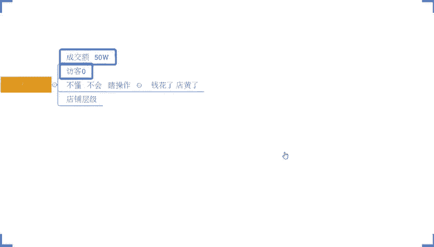

各位，我给他画一个图好吧，来。呃，假如说现在呢。这个是我们的平台的一个商家情况啊。最下面这一个这边啊，这个是第一层级啊，这是第一层级。在上面呢哎。第二层级好不，越往上面就像一个金字塔一样，对不对？越小。

😡，那么所有的这个访客啊，所有的这个商家也就越少，各位能懂吗？啊，第三层级啊，这第四层级啊，一直往上啊啊打个比方啊啊上面还有五层级。😡，对吧又生级啊。越升级啊，越往上商家越少。😡。

那么平台呢能够给到这些私商家的访客呢，却却恰恰相反啊，我画一个图。那么他是一个倒三角的样子，对吧？呃，越往下第一层级的这个店铺呢，访客越少。第二层级的人呢？访客稍微多一点啊，第三层级呢稍微更多一点。

然后第四层级。是吧第五层级。第六层级啊，越往上面的这个店铺呢，他的访客也会越多。所以说有很多人呢会愿意去做层级。他认为层级越高呢，我能够拿到访客越多，确实啊逻辑上没有错。但是之所以层级越高。

拿到的访客越多，是因为层级高的这些店铺，他本身的店铺权重高。他本身商品所覆盖到的人群大。

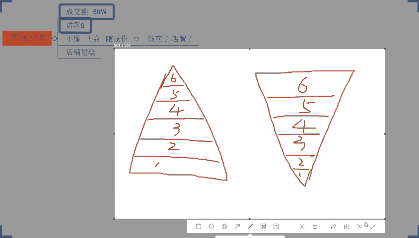

他能够拿到的数据多。各位能懂吧？而不是因为本身层绩所带来的。😡，那么成绩有没有用？当然有用。那么什么时候有用呢？各位，我说一下，我们在做店铺的时候，打个比方，我现在啊我做自流。啊。

我做自然流啊哎打错字了啊，我做自然流，我现在的访客啊。做到了5000啊，打个比方啊啊或者说我给你们看这个店铺吧啊，我给你们看这个店铺。😡，我来给你们找一找啊，这个店铺看能嗯我看能不能。呃。

我来我来看一下，是我就就近期有一个店铺的啊。来来来来来来来各位来各位有看到的话，公屏打一好不好？有看到的话，公屏打一，动动快这个店铺大家有看到没有？有看到吗？公屏打一好吧，有看到公屏打一。

兄弟们动动快啊。😡，这个店铺我跟他讲一下，他跟着实操，那么我们是有去做层级的。为什么做成绩？听清楚了啊，听清楚了。他在这个4月的上旬的时候就跟着实超的。😡，这个店铺啊这个店铺4月上旬的时候就跟了1超的。

那么早期的时候呢，店铺的整个访客很少，转化也很低。后来慢慢慢慢的啊做自然流嘛，访客上来了，对不对？但是呢他卡在这个2000访客，各位注意了没有？它卡在2000访客这个地方卡了很久上不来。

卡了很久上不来啊，那么后面呢我们是做了一个层接的一个突破。同时呢，我们也针对到这一个产品的布局做了一些调整啊。当然啊他不是说单独的去做了一个层级就完事的啊，是这样子的那做了这个突破之后。

后面你们可以看到啊，整个的访客啊，到后面呢是呈现出一个上升的。😡，那么他之所以能够去上升呢？有几个原因啊，第一个原因。啊，我把我把这个这个这个数据给他们给你们截出来啊，我把这个数据给你们截出来。

放在这边啊，在这个阶段啊在这个阶段对不对？在这之前的这个阶段啊，那么他因为受到层级限制，所以访客呢达到了一个瓶颈，这是第一个原因。第二个原因呢，本身商品的权重啊，就是整个的流量承现能力呢。

已经到达了极限，没有办法去更好的获客了啊，所以呢他的一个访客呢呈现出一个。😊，卡在这个地方上不来的一个一个倾向啊。那么后面呢层级破了啊，在这个节点上啊，在这个节点上破了层级。层级破完之后的同时呢。

对商品进行了调整。后面呢整个商品呢在转化上，在我们整个的呃坑场上在我们的销售额上也慢慢提高。后续的话，整个访客就突破了，他这么来的，所以成级有没有用，有用啊，什么时候用？当我达到了类似这种处于。😡。

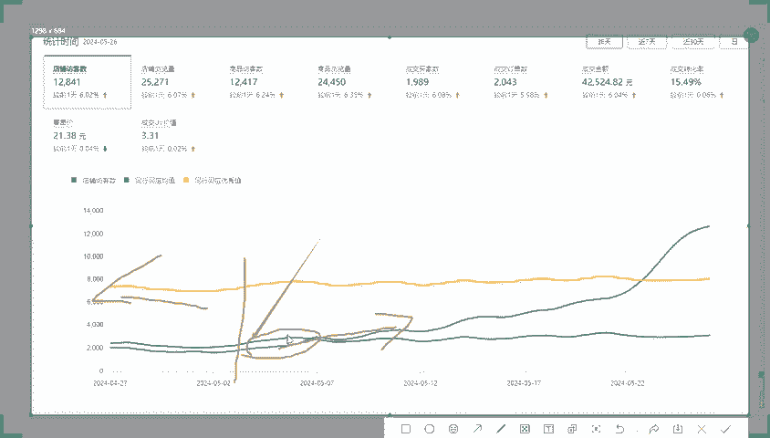

瓶颈的时候。对吧处于瓶颈的时候啊，我去什么突破用的。好吧，各位没问题，公屏打一啊，这一点能够记住能够明白的话，公屏打个一动得快啊。能够记住能够明白的话，这一点呢我们就过去啊，刚好呢这个地方呢层绩是什么？

它就是我们的这一个店铺30天的一个交易额啊，当他考核的时候呢，考核的30天的日均交易额。其实你可以理解为店铺的交易额越多越高，你能够去达到的一个成级也就越高，好吧？而成绩越高呢。

我们店铺所存在的一个这个圈层呢也就越高啊，就好比说我们人对吧？有这个百万富翁有千万富翁有亿万富翁，对不对？那不同的人是不同的圈层一个意思的啊，不同成绩的店铺呢也是不同的圈层，他们之间会相互竞争。

是这样子，那成级低的店铺呢永远在成级高的店铺面前呢是抬不起头的对吧？就跟我们人一样，分3。9等的。其实我们虽然说口口声声讲，人人平等。但是实际生活中，我相信大家能感受。😊，清楚了，对不对？

人就是本身369等的，有的人天生就喊第二师出身，对吧？就高人一头，你能把他怎么办，是不是？没错吧？那所以在这个过程中的话啊，我们要去提高店铺的一个一个数据的话，在某种意义上来讲，我们可以去破层级。

但是破层级之后，也就意味着你的竞争环境更恶劣。那么这个也是我们大牛有可能导致他的数据下降的一个原因。因为他破层级之后呢，他的竞争对手变强了，把他的流量抢走了。😡。

但是呢它本身在流量这样的一个承现呢又比较弱，所以呢访客就没有办法去突破，反而是不断的流失啊，就有这个原因有可能的啊，这个不排除这种可能啊，我们做事情严谨一点啊，那目前是有这种可能性。

那我们要去做一些分析啊。OK那回过头来，我们继续说啊，就在我们整个店铺操作过程中呢，我们的店铺数据和我们的处罚类呢，这两个板块呢，它只管降权，不管加权。啊，他指降权啊。不加权。什么意思呢？

如果说你考核达标，你是可以正常曝光的。你考核不达标，抱歉就会限制你的曝光。😡，各位能理解吧？这个点如果说okK没问题的话，再一次公屏上啊打个6吧，好不好啊，因为你们老是一直打一的话。

我就分不清是个是是什么情况了啊。你们什么时候说的话我都不知道了啊。😡，OK啊，能记住就行啊，这点能记住了。OK我们就往下当这个时候完成考核了，对不对？我们产品呢拿到了这个基础曝光。

形成了产品的一个这个展现。再往后呢，okK就会形成下一步考核，什么考核呢？😊，商品数据。啊，商品数据商品数据是什么呢？商品数据就是我们产品的销量，我们产品的转化率。我们产品的收藏，我们产品的上架时间啊。

这个是官方给我们的答案啊。那么在销量里面呢，其实又分很多的细节，我们的具体的单量啊，也就是我们所所所理解的具体的这个销量吧啊，我还是写销量吧，这样子好理解一点啊，在我们这个时候考核销量啊。

同时呢会考核我们产品的什么呢？产出我们的GMV对吧？哎，会考核我们的UV价值会考核我们的哎UV价值啊，UV价值啊，会考核我们产品的什么这个呃同比增长率。😊，啊，等等这些东西都会进行考核的。包括像收藏率。

对吧？我们也会考核收藏量，会考核收藏的转化，对吧？而收藏板块也是一样的道理，对不对啊，都是会考核的啊，那么这么来的，而在这个过程中，这里的商品数据考核，在考核之前，实际上还会考核别的东西。

考核什么东西呢？各位往上面来看一看啊，在我们最开始用户进到我们平台的时候，进行搜索平台根据产品的关键词进行推荐，对吧？这个时候有到一个数据是我们在下面所有的考核过程中没有提到的。😊，各位是什么？

大家注意观察，注意看啊，在这边是有答案的，认真思考，把答案发在公屏上。啊我把这个稍微收一收吧吧，那这里挡着了很看的很难受啊，下单吗？下单不就是转化不就是订单不就销量吗？认真思考一下啊。

在这边是有一个数据呢，是我们下面讲到的这些权重考核里面是没有的，没有提到的。来，动作快啊，这个这个部分我希望是你们能够去找到答案的啊。这个部分我希望是你们能够找到答案的。

如果说你们刚刚已经认真的听完我分享的东西，你还没有找到答案的话，那我只能认为大家今天的这个。😡，注意力不够集中，不够认真了啊。不是啊，大哥，你们你们是准备把这所有东西说一遍，靠拆吗？😡。

你们主备所有东西哎。😡，不错啊，风不错啊，可以啊，风啊，还是有人在认真看认真听的啊，点击率啊点击率是没有讲到的。啊，点击率啊。那么点击率它也是我们商品权重考核中的一个重要的指标。虽然说我们商品数据里面。

它只考核到我们的销量转化上架时间收藏，但是转化率实际上也是在我们的商品数据板块里面的。只不过他没有在平台的呃所谓的这一个考核规则里面去体现出来。好吧，而点击率的权重有多高呢？在我们商品前期的时候。

它比我们的销量权重还高。我给大家举个例子好不好？今天假如说有两个产品。啊，封啊风上传的一个产品好不好？然后呢，黄某人。也上传了一个产品。都是一件肚兜啊，对吧？都是一件肚兜啊。

然后风的这个产品呢非常不错啊，图片呢非常的好看啊，营销也做的非常好啊。那么它整个产品呢也拿到了推荐曝光，推荐曝光多少呢？有1000个。😊，好不好？有1000个，然后呢，整个的商品呢。

因为它的一个准备很好，它的产品很好啊，图片都很好，做的都很到位。所以呢有很多人去点击它，比如说有100个人点击。😊，这个时候呢，他的点击率呢就有多少呢？10%对不对？而黄某人呢可能做的就比较草率了啊。

哎他就只是说产品先上架，后面再去再去看啊，所以呢他没有去做特别多的一些这个呃。准备吧啊没有做更完善的准备吧。所以他的图片呢可能相对差一点啊。然后呢，他的图片呢呃只有50个人去点他的这个产品呢。

只有50个人点。那么他的点进率呢只有5%。😡，各位。😡，这个时候我想问大家，那如果你是拼多多平台。你自己在进行商品考核的时候，那么封这个产品呢，我们称它为商品A好不好？那么黄某人这个产品呢是商品B好吧。

那你会让谁的产品排名更高些，是A还是B？😡，你们说一下啊你们说一下。😡，你们说一下是A还是B。😡，这两个产品目前都是新品，都没有成交。啊，肯定是B呀。黄某人是因为这是你的产品，是不是啊，讨厌啊。

这个睁着眼睛说瞎话啊，拉出去啊，先打5市大板啊，这肯定是A呀，对吧？为什么是A？因为A的这个产品呢？用户点击率更高啊，平台的会认为他的用户喜爱度更高嘛，是不是？😊，那么这个时候有人可能会说了，哎。

没关系啊，我也不管他的这个点击率多少，我有成交啊，对吧？哎，我商品币，我有成交，我卖了一单。😡，啊，我卖了一单啊，我有成交。😊，对吧我有成交，哎，我有2%的一个转化率。😊，啊，有2%的转化率，我有成交。

😡，那我应该是权重更高的吧，告诉你们兄弟们不对啊，不对，为什么这样说呢？来给大家解释一下啊，在前期新品的时候，我们的商品权重考核它是有占比的啊，有占比的，有分配的。😡，那新民考核吧我再写吧，新民考核。

那么西门烤鹅呢主要烤核的板块呢是人气权重。以及我们的商品数据。啊，它是有这两方面去考核的啊。那么人际群重里面呢，有我们的商品的点击率，有我们商品的点击量。啊，点击量啊，还有我们商品的搜索热度。啊。

麦克阿瑟都出来了是吧？😊，呃，卖情趣用品没人卖得过我，除非那个人叫黄某人，我的天。😊，可以啊可以啊，放心啊，我觉得你适合去做自媒体啊，做段子啊，好不好？你这个梗啊一个接一个的可以的可以的啊。

然后这个呃这是我们的人体权重考核，对不对？那商品数据里面呢，就我们刚刚讲这些东西啊，都会考核进去的对吧？它在这里面会考核。那如果我今天只做了一个所谓的转化率只做了一个所谓的销量。

这些销量这些转化率达不达标是一回事，就算是它达标了，它也只是某一个点达标了，更多东西它达标吗？不一定对吧？那其中呢人气权重的考核占比呢，60%以上啊，这里我刚说一下，它是在前期占比更大的。😊。

换句话说呢，商品数据只有40%，甚至40%不大。啊，那你在这里面你这里如果是有一个数据达标，比如说销量达标，其他东西你不达标的话，你只是在40%的占比里面拿到了一点点分数。但是我在这边啊。

我能够点击率达标的话，这就拿了大头了，这起码就有30分。😡，这起码就是30分啊，这里我说一下啊，这起码就是30分。那这两个呢，20%加上10%。啊，加上10%，他这么来的，好吧，那你在这里面的话。

你单独某一个数据达标的话，你怎么干，你都不太可能干得过我30%的权重占比了。😡，各位。😡，这一趴能够记住的公屏上6走起来啊，这个很关键哈这个很关键。那我们在整个操作的时候，这个地方既然说这么关键。

我们应该怎么去做？OK听清楚了。前期操作的时候呢，我们一定要去干嘛呢？一定要去做好我们商品的人气，一定要去做好我们产品的什么点击，所以这个部分呢需要我们去做好我们产品的图片啊。

要让我们图片呢有到一个很好的吸引力。啊，这是第一个点，第二个点，我们的图片做的再好。我因为不知道平台给我的曝光是多少，我也没办法去确定我的点击率是多少，所以这个时候呢我们只能干嘛呢？听天由命。

但是被动接受这些东西呢，一定不是作为一个资深合格运营的一个套路，对不对？那我们得去做点什么？做点什么呢？那做点什么做点点击，好不好？什么意思呢？来，假如说今天。😡，我们回过头来，我是黄某人，你是风。

你做的商品A啊是这么一个情况，对不对？我也不知道平台给了我的曝光有多少，我也不知道平台的点击率有多少。但是我知道现在我的店铺呢只有50个人浏览。😡，现在我的商品只有50个访客，我很不满意，对吧？

黄某仁很生气，后果很严重怎么办？哎，我找了200个人对吧？我找了200个人啊。😡，干嘛浏览我的商品好不好？我找了200个人，浏览我的商品啊，没有去打架的意思啊，我们找了200个人过来，哎，浏览我的商品。

这个时候呢我们的哎找了找了150个宝不好，200个，这个数字有点不太吉利啊。😡，对吧200个这个数字有点不太经理了啊。我假如说我找了这个150个人过来，对吧？哎，这个时候呢我的访客干到200去了。😊。

各位没问题吧，我找了150个人过来啊，我的访客干到了200。那么我虽然说不知道我的曝光有多少，我虽然说也不知道我的点击率多少，但是这个时候我的点击率一定会比原来高，一定会比原来高，对不对？

因为我的访客变多了啊，那我们可以拿这个数据来做一个参考算一算，大家知道的啊，原本是1000个曝光，我找了150个人浏览的时候呢，同时他还会产生曝光，对不对？他的曝光率就是1000150啊，1150。😡。

啊，1150，然后呢，200个点击啊，那么这个时候200个点击除以1150，对吧？大家帮我算一下吧，多少。有没有人士帮我算一下，应该在十5往上了啊，这个这个这个点击率啊，应该在15往上啊。

应该在15往上了啊啊，你们你们谁如果说有空啊，帮我算一下啊，反正这个地方肯定大于15%的。😡，啊，大于。15%啊，具体多少我就不去算了啊，好吧，具体多少我就不去算了啊。那这个时候各位我想问大家一个问题。

😡，C权重更高是A还是B？啊，17%是吧啊，17。3是不是OK17。3啊。😊，这个时候谁权重更高A还是B啊？😡，嗯，A还是B。BOK啊，对吧？就这个B啊就这个B啊，权重更高。

那这个东西就是我们前期在做的时候需要去注意一个事情，也是你们很多人做店铺没有做到位的地方。你们很多人做店铺呢上来就是干嘛呢？做销量做评价，但是却忽略了这些东西就会导致什么呢？导致你做了之后没有用。

为什么没有用，因为你的权重占比低，你做的再好，你顶多拿到40%权重。但是我在前期操作的时候呢，我已经把这60%拿到手里面了。😡，平台考核的时候呢，优先考核的就是人气。在前期的时候啊，所以这个时候呢。

我能够拿到更多推荐曝光。😡，那么你只能在我后面跟着混饭吃，我在前面吃肉，你在后面喝汤，我连汤都不跟你喝酒的时候。嗯。我要是能找150个人天天砍一刀，可以啊，可以砍一刀啊，可以砍一刀啊啊，当然了。

我今天我也说了，对吧？今天我也说了，我说了今天会给到你们一些这个小福利，对吧？那既然说大家今天对吧六一啊，专门跑过来一起跟我在直播间里面在这里对吧？呃，聊天啊，吹牛打屁，对不对？啊，听我分享。

那么O也给大家一个小福利，什么福利呢？我知道啊你们很多人在坐店的时候呢，缺乏很多资源，对不对？就是说难听一点嘛，三无商家。😊，没方法，没资金，没资源，坐垫就靠运气，对吧？没关系啊。

那我知道你们这个情况之后呢，OK今天呢也给到你们这么一个小福利，什么福利呢？啊，150个人不太可能的啊。那么这个资源啊，我可以分享给你们。😡，啊，我我可以把这个资源给到你们。😡，好吧。

资源我会给到你们啊。当然同样的，包括像今天跟着实操的小伙伴呢，我还会额外的给到你们另外一个福利啊。至于什么福利，一会再说啊，那这个资源如果说你们有需要的，公屏上可以打个6啊。

就是我自己包括像我在实操的小伙伴啊，我们自己在前期的时候去做这个人气权重的时候呢，需要用到的一个资源啊，那么这个资源呢把我们去拉伸我们店铺的这个呃整体的点击量，拉升我们整体的这个点点击率，对不对？

包括提升我们产品的收入热度意义非常非常重大啊，那整个店铺呢也能呈现出一个非常快速的增长，好吧？所以这个资源的话，讲真的啊，正常来讲，我是不愿意给到太多人的。因为知道的人多了之后呢，难免会有说嗯。😊。

慢慢慢慢的这个资源品质会下降嘛啊OK啊，今天大家都扣6了，对不对？呃，扣6的小伙伴啊，那我说一下啊，大家记住了，资源你们拿到手里面去之后呢，自己用就可以了。😊，不要外传。好不好？

那么这一点的话大家一定要记得啊，自己用就可以了，不要外穿啊。然后我把这个资源呢呃发在公屏上啊，我把资源发在公屏上啊，大家可以自己去这个呃加一下啊。😊，来啊，那可以自己加一下啊，这个是资源的这个呃。资源。

微信啊进微信。OK这支援微信啊呃可以自己扫个码啊，可以自己扫个码OK啊呃，这个是微信号啊，大家可以自己加啊，这援微信啊。😊，啊，可以自己加啊。😊，okK给你们10秒钟吧，你们该加的自己赶紧加啊。

然后我先喝口水先哈，好不，我先喝口水啊，大家该该加的赶紧加啊。😊，需要的都赶紧加啊。😡，不啊，我的天，你能不能你能不能正经点啊，靠点虎行不行？真的是啊这么这么严肃的一个事情，被你瞬间一说。

我的天感觉档次一下下来了啊。😡，是吧臭流氓啊。真的是啊服你了。强都不服就服你啊。😡，我的天。嗯，O啊都加入吧。😊，都家了吧。都加了吧，如果都加了啊，我我就把这个收起来了啊，都加了，我就收起来了啊。好吧。

都加了，我就收起来了啊，就不放在这里了啊，好不好？😊，呃，加了的公屏上扣个一啊，我我看一下都加了的话，扣个一啊，加了的话扣个一。😡，啊，免得等一会你说哎，7楼我没加上，你再给我看一下，对吧？太麻烦了啊。

一次你们加好之后，赶紧收起来就好了。😡，OK啊O没有还没有加上的，可以先截个图啊，可以先截个图啊，等一会你们再加就可以了。OK啊，肯定没那么快的，你们这么多人加他，对不对？肯定没那么快通过的啊。

OK行了行，这样啊，收写了收写了啊，不给你们看太多啊，好吧，O ok ok啊。😊，好，行行行行行，好，那这个东西呢，我跟大家讲一下啊，你们去自己做店铺的时候呢，我也说清楚一件事情。

就是这个刚刚我给大家讲的这个数据呢，你们可以自己去做。那做多做少呢，跟我们的产品啊是有息息相关的一个联系的，知道吧？产品的呃这个品类小，你可能做的少一点都没关系，频率大的话，你可能需要做的多一点啊。

那具体。😡，做多少这个东西我没有办法给到你们标准答案。但是你们可以去参考一下啊，我自己啊，包括说我带实尚的小伙伴们啊，大多数的品类。😡，基本上呢我们都是做了一个降序操作啊。啊，我们都做了一个降序操作啊。

啊，那么这个降去怎么降的呢？第一天可能我会先去做个200到300啊。第二天呢我可能做个100到150。啊，第三天呢我可能就做50到100啊，我们一般这样玩的啊，你可以看一下，像这个店铺来。

我给你们看一看这个店铺吧。哎，在在哪里这。呃，不是这个店铺啊。啊，这里啊这里来各位有看到的话扣一啊，有看到的话扣1。😊，有看到的吗？扣一来跟的快这个店铺单有看到扣个一啊，有看到扣个一啊。

这个店铺是一个从零开始的纯新店啊，从零开始的纯新店，看到没有？他当时做的时候就是用到这个方法去做的，前期先去做了这个产品的什么点击人气板块啊，去操作，过了几天啊，前面做了三天啊。

过了几天之后呢就停掉去了，访客慢慢是进来的啊，进来之后呢，数据不断的在拉伸啊，当然这个过程呢有去做了一些其他的操作啊，当然具体什么操作呢，我稍后会跟大家分享的，大家家不用着急啊，那这个操作过后呢。

整个店铺呢是呈现出一个非常快速的往上升了一个趋势的。到后面的话一天访客的做到100看到没有？一天订单是2000多单啊，那么转化率呢是8。02啊，转化率是8。02啊，兄弟们好吧，你们没有看错啊。

所以说好的方法有多重要啊，能够具有好的方法能够去认真去执行的话，O的，其实店铺操作没那么难啊，因你们很多人觉得店铺。😡，难其实还是说你们不会而已啊。O啊，那我们接着往下啊，这个板块做完之后。😡。

那至少来讲，我的商品的初期的推荐权重会被扩大，对不对？但是扩大归扩大，我们还得去干嘛呢？还得去拉伸我们更好的一个什么搜索截流的一个效果，对吧？那怎么去做呢？

来注意现在开始正式的一个这个截流的一个操作了啊，这个部分的话非常非常关键啊。这个步骤啊这个步骤非常非常的关键啊，各位来所有人有在认真听的话，公屏上溜走一波好不好？那么这一趴如果说你没有认真听。

等一会儿你说哎，其喽，我没有听见，你再说一遍好不好？抱歉啊，不可以啊，不可以啊，所以这一趴的话，你们自己认真听就可以了啊。每次当我提到你需要认真听的时候，一定是重点内容。

这个如果说你们是有关注过我直播间的，有听过我多次直播的，应该都很清楚的。我直播间里面从来不缺干货。😡，西楼跟别的那些所谓老师，所谓的培训机构的这些讲师不太一样，对不对？本身我是带实操的。

所以我的直播我只讲干货，我也不会许给你们讲一半留一半。但是你们自己如果说对自己不负责任的话，那么是你自己的问题了，就不怪我好不好？OK了啊，OK了啊。那我们开始喽。那首先呢在我们整个的操作过程中。

我们需要去干嘛呢？😡，把我们的产品上架之前呢去做好一个准备动作。啊，准备动作啊这个准备动作呢一天时间啊，这一天时间干嘛呢？听清楚各位啊，听清楚。那么在这个过程中呢，我们需要去找到什么找到10个人啊。

我们需要找到10个人，10个人，各位能不能找到能找到的扣个一，好不好？😊，能找到的扣个一啊，那么这10个人你找到之后啊，尽量的是你的老客户，老客嘴都瓢了啊，老客户啊老客户啊。

那这个老客户呢如果说你没有没关系啊，去找那些符合你商品购物人群的人也是可以的。啊，你的朋友都是可以的，只要没有跟你有这个直接的资金往来，没有在同一个wifi下出现过啊，存在过这个使用到拼多多进行购物啊。

或者是交流啊啊这种都O的啊。同相互之间呢没有这个呃微信的一个交易记录啊，不要去做微信交易记录就可以了啊。那这个过程中，我们呃可以理解是标签号啊，可以理解是标签号啊。

这个过程中我们找到这10个人呢把这10个人呢，干嘛呢？做一个。😊，编号啊把这10个人做一个编号，编号的话就01到呃0203040506070809啊。最后到我们的什么10啊，10啊。

打个比方啊这些人是谁呢？这些人分别就是我们的呃刘一，对吧？分别就是我们刘一啊，然后呢是我们的陈二啊陈二。😊，啊，承认啊，然后张三啊。😊，啊，这个我就打上去啊，让你们更好理解一点啊。然后你是对吧？😡。

然后还有这个王五张六对吧？啊，王五照六啊。还有我们的这个孙妻啊孙妻。还有周八。59。啊，59啊，还有我们的证实啊证实啊，就这10个人啊，这10个人这是我的好兄弟啊，这是我的好兄弟啊，我把他找过来啊。

我们我们把它找过来啊。😊，啊，把它找过来啊，找过来是干嘛呢？好，我们现在就让他们去做一个事情，做什么事情呢？去搜索关键词。那么这关键词是什么呢？来搜索关键词。关键词呢是符合我们产品的。啊，热收时。啊。

热手词这个词呢，我们找5个。啊，找5个啊。那么这个词呢，是一开始我们在写标题的时候就要坐进我们标题里面去的啊。然后呢，这些词我们找出来之后呢，就可以用这个东西去呃，直接去去搜索图片好使吗？

什么图片好使吗？搜索关键词啊，搜索关键词啊，你看符合产品啊，这里写写错字了啊，符合。收图片不行啊搜图片不行，搜关键词啊收关键词搜关键词记住了啊，搜关键词啊，再强调一遍啊。

那这5个关键词呢是符合我们商品的。一开始我们就去做标题的时候，做进我们标题里面的啊。那呃这个关键词呢，一般来说我们可以直接什么直接在下拉框。找啊，直接就下来框找啊，那么关键词这里我就不去一一的去细说了。

我就直接呃用这个文字代替了啊，关键词。一啊一直到关键词。2。关键词3啊关键词四关键词5好不好？OK这10个人分别去搜索这5个词，不要去点击商品啊，不要去点击商品。那么在搜索这5个词的同时。

我们尽量的去找到有这么5个产品。找出5个产品啊，这5个产品最好什么样子呢？就是说我通过不同的人搜不同的词都能看得到的。啊，我搜不同的词，不同的人去搜都能看得到啊，这是最好的找5个这这种产品。

那么这里这五个产品是什么呢？我告诉大家，这里这五个产品一定是跟我们商品高度符高度这个呃贴合的啊，相似款或者同款。因为这些词本身是我的关键词。那五个词都能搜得到，同时被不同的人收到。

那么说明他们就是我们未来的竞争对手，他们就是我们这个产品品类里面的龙头老大，因为他在针对到不同的值收的时候，都能被排名靠靠前。各位能够明白，能够理解公平打一。如果说不清楚的话，直接讲啊。

这一步能不能理解能不能懂啊，这一步能不能理解能不能懂，能懂的话，扣1。所有人动起来啊，你要是现在不说，一会儿你跟我说，你没听懂，那抱歉了啊，一边凉快去好吧，一边凉快去啊，没空搭理你啊。😡，OK啊。

都没问题吗？可以是吧？可以就行啊可以就行啊。哎呦，这个胖迪啊啊，这个可以是吧？啊，这个这个可以用的非常不错啊，到位啊，八0得板是吧，是这样说的吧，是不是八0得板了啊，是这样讲的，呃，好像是成都话吧。

是不是？😊，虽然说我这个是呃成都话不标准，但是呢还懂一点的啊，还懂一点的啊。😊，来啊呃继续往下啊继续往下啊。那对于整个的店铺操作来讲的话，这个地方啊这个地方我们把这个动作做完之后干嘛呢？认真看啊。

认真看啊，注意了啊，动作关键的动作来了啊，这个时候我们让这10个人啊，我们让这10个人我我把它复制下来，我们让让这1个人干嘛呢？通过不同的关键词去进行浏览，然后浏览对应的不同的产品啊，好不好？

比如说我们用到这个呃留一啊，留一和留二啊，留一跟刘二呢分别去搜索关键词一好不好？那么这5个产品呢，我这里写一下吧呃，商品。😊，竞品吧啊写个竞品吧。竞品。哎。😊，怎么啊，竞品啊竞品一啊，然后竞品。2。

竞品3。信不行是。竞品嗯啊OK这个这个地方啊大家注意看啊，让刘一搜索关键词一浏览竞品一好不好？然后呢，让乘二搜索关键词一，浏览竞品2。然后呢，让我们的张三浏览啊搜索啊搜索关键词2好不好。浏览竞品2。

让你是搜索关键词2好不好？然后呢去浏览竞品3啊，浏览竞品3以此类推啊以此类推啊以此类推。然后呢，这下面呢就是我们的呃关键词3对吧？关键词是。啊，关键词符啊，我就把这里直接写下来了啊。😊。

然后这边的话就是我们的呃竞品三对吧？然后竞品4。然后敬平武。各位，最后一个是精品级。问一下大家吧，好吧，看看你们悟性怎么样。最后一课啊证实。😡，用关键事物浏览精瓶级。哎，还不错啊还不错啊。

什么自己的浏览自己在干什么？浏览竞品一呀，对吧？浏览竞品一啊啊，冰啊、lisa还有战争啊，还有风啊、大牛啊、布丁啊，我觉得都还不错的啊，我觉得还不错啊，柠檬我也觉得不错啊，可以的啊，那这个动作做完啊。

这个是为了让我们这些人有到更好的商品需求标签啊。😊，那有了更好的商品需求标签啊。同时呢让我们的这些词和商品啊有。更好的观联。方便我们后期来截取权重，好吧，这个动作可以看到啊，对不对？呃。

商品一和商品二竞城竞品一竞品2啊跟关键词一都是有关联的，对不对？都有关系啊，那么他们是分别被两个人去浏览的。然后呢竞品二呢又跟又有又让这个关键词和关键词发生的关系，对不对？啊，以此类推。

他们每个词每个人每个商品都有相互之间有关联有关系啊，间接和职接的关系吧，都有吧啊，反正这样子啊，O这一个动作做完，接着做完之后干嘛呢？听清楚正式操作啊，交叉感啊，可以这么理解啊，交叉感染啊，不错啊。

这个总结很到位啊，交叉感染啊。😊，那。再往下啊再往下啊，就是我们正常的在我们店铺操作了啊，各位注意了啊，一共3天啊。😊，一共3天啊，各位最听啊，第一天。😡，好，在我们店铺操作第一天，第一个步骤。啊。

第一步我们干嘛呢？我们让这10个人过来。还是通过这对应的关键词去浏览啊去搜索搜索什么呢？各位注意这一天第一步，首先让这些人通过关键词去搜索谁，搜索我的商品，我自己。当然有人会问，谢佬，我的商品是新品。

收不到怎么办？😡，如果收不到。两个方法都可以用。第一个方法，先去搜图片。啊，搜有图片去浏览我们商品，然后再来输入关键词。第二个方法。搜冷门子。啊，搜冷门词，先让这些人进来我们店铺。

有上有有到一个标签之后，再去搜索啊，搜索这些关键词。但最终一定要通过这些关键词完成浏览。各位没问题，公屏上打个一。这一步没问题，公民打一。嗯。OK啊，没问题，对不对？接里呢。其他人呢？OK啊，都没问题。

对不对？好，我们继续往下啊，那这一步做完之后干嘛呢？听清楚注意看了啊，进行第二步。😊，啊，进行第二步啊，你怎么能收不到自己的是吧？OK这两个方法去用一下啊，试试看啊。第二步。😊，啊，第二步啊打错字了啊。

第二步啊。😊，第二步啊，那这些人搜索完我们商品之后干嘛呢？好，我们再去到同行啊，再去到我们的竞争对手家里面去啊去浏览一次。所以这一次的浏览呢啊这个呃简单浏览就可以了。什么叫简单内容呢？

就是我随便点进去看一下就可以了。😡，啊，随便点击去看一下就可以了。好吧，这个就可以了啊。然后同时有一个事情是什么呢？其中安排两个人去下单，不付款。啊，然后呃或者是下单之后再退款。都可以啊。

那么这两个人呢，比如说。这个一啊比如说一和我们的这个呃这个三啊，这两个人啊一和3。啊，也就是我们的刘一张三啊，刘一跟张三这两个人去做这个动作啊，做这个动作，然后做完之后进行第三步啊，进行第三步。😡。

第三步呢还是这些人还是这些词啊，然后呢去干嘛呢？注意看不是浏览同行了啊，是浏览我们。原来我们商面啊，每隔。一个小时一次啊，做一个反复的浏览啊，来增加我们商品的搜索热度跟粘性。

来提高我们商品的人气推荐权重。各位。这个操作搞定之后，接着在我们的下午或者是晚上自己安排，让一和三啊让一和三干嘛呢？来到我们店铺进行一个。下单付款。好，OK第一天操作完成。各位。😡，整个操作能看懂吧。

能不能看懂？能不能看懂？这个操作呢？首先第一件事情干嘛呢？给我们商品打上了需求标签。因为头一天这些账号呢已经去浏览了这些产品，对不对？它有了商品需求标签。那么第二天的时候来到我们店铺。😡，进行浏览。

让我们的商品呢打上了标签。同时呢通过这些关键词呢，在同行进行浏览之后呢，进行订单的提交。这个动作呢是为了后面给我们这个店铺来进行截流，做一个么铺垫。那么这个铺垫过程中呢。

我们商品因为有到这些人反复的浏览。所以关键词的搜索热度会很高，产品的搜索人气会很高，商品的整体的这个热度会不断的在增加。同时呢我们产品呢在这个过程中呢会有到一个非常高的粘系。啊，用户联性会很高。

那用户之后在同行下单不付款，跑到我们店铺成交之后呢，又会有到一个订单的流失进店啊，那么会截取到这个转化流量。这个时候整个商品就可以直接带动我们整个的呃店铺访客的增长，推荐曝光的增长。好吧。

10个人就够10个人就够啊，当然。😊。

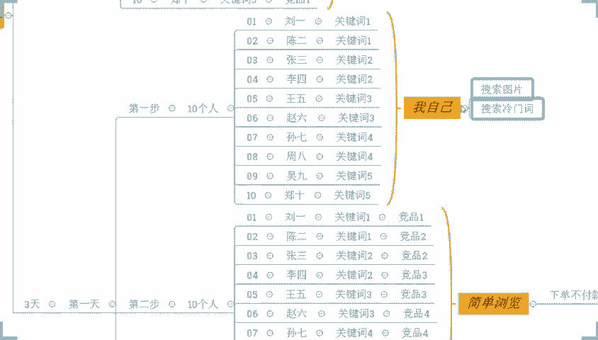

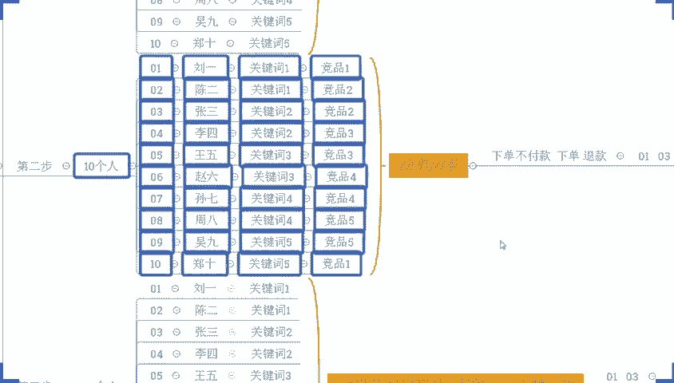

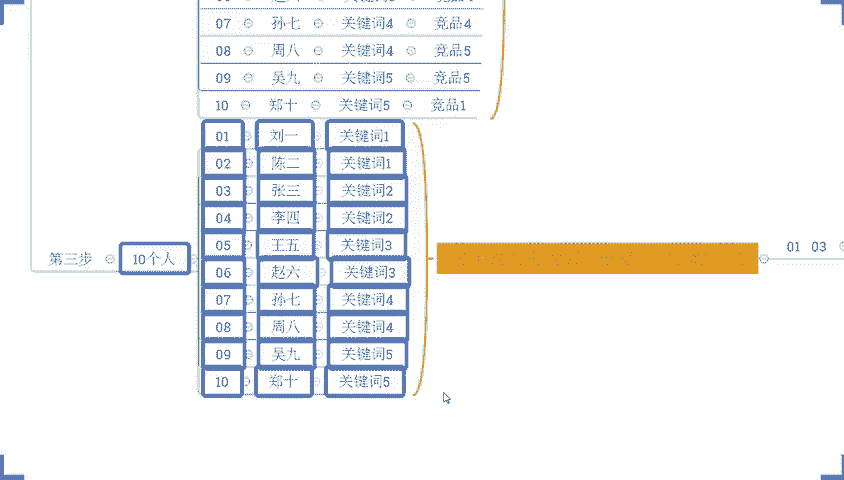

你如果说你说我把我去找100个人可不可以？可以。😡，啊，可以啊，这个数据体量越大啊，肯定是这个呃整体的一个争议越好的。但是一般啊10个人就可以了啊，反正我自己的话操作新品，我一般就配配10个人就可以了。

😊，呃，这就是讲的打标政流吧，你算是吧算是吧，可以这么理解吧，大牛啊，算是吧。😡，啊，那么这个过程中啊这个过程中呃对建立了一个真实的需求，然后呢，让他让这个需求到了我们自己店铺。

同时呢这个时候平台就会判定哎，对这些产品有需求的人，对我们的商品也会有需求，各位能懂吗？而这些商品是谁？这些商品是我们这个品台里面的一些大佬，他们卖的都很好。他们的权重很高。他们通过各种各点都能收到。

但是这个时候因为我们有了这样一个截流之后，平台就会判定哎，对这些商品有需求的人对我们这个新品也非常感兴趣，甚至更喜欢我们的新品。

于是乎在首页在搜索页在相似商品页或者在我们的这个其他的推荐页面都会进行推荐。各位能懂吗？😡，这是第一天。然后第二天跟我们第一天其实差不多，无非就是这里的人改变去啊啊改变去啊。那么对啊消耗大额的点击啊。

然后成交我们成成为我们自己的一个销量啊。然后在我们这里的话啊，第二天注意听了啊，这里我就不去再写了太多懒得写啊。第二天的时候呢，就不是一跟三了啊，第二天的时候呢是哎05。😡，0709啊这三个人啊。

050709这三个人去做这个事情。然后最后一天呢是。02。040608105个人啊，5个人。对，就是让系统认为我们更受欢迎。那么这个时候通过第一天和第二天的操作的话。

我们每个词每个竞争对手我们都会去薅一遍，对不对？第三天的时候呢，我们再把所有的词所有的这个呃竞争对手全部薅一遍。😡，那么整个操作结束，这个操作呢，我们可以去啊重复进行都没问题的。

操作一次隔一天再操作一次隔对吧？3天一个一个轮回，相当于4天一个轮回吧啊，因为我们有一天准备准备动作嘛啊4天一个轮回，4天一个轮回，我们可以持续做的没问题的。但是一般情况下。

我们前期做一个轮回到两个轮回就可以了。啊，像这个店铺来。就这么玩的。啊，就这么玩的。好吧，怎么样？各位。😡，干不干？😡，觉得今天怎么样？老人机也可以用啊，老人机也可以用啊，老人机也可以用。

各位今天的内容干不干？😊，how他们是how他们的权重啊，我的天。啊，how他们的权重啊。how他们的推荐曝光啊，how他们什么啊，干嘛OK啊，这里我也说一句啊，兄弟们。

我我再给大家说一句掏心窝子的话啊，你们呢有很多人。😡，可能每天呢会去看很多的这些所谓的干货啊，比老看妈还干。呃，这个就是自然流的操作之一啊这个就是自然流的操作之一啊，具体做多少个轮回，你自己去想。

自己去做好不好？一般来说我刚提到的做一个轮回到两个轮回新名就足够了啊，你可以自己根据实际情况来调整，这个没有固定的啊，没有固定的。那么有很多人就会去看很多所谓的这么干货啊，这里我说一下啊，好不好？

大家认真听啊，大家认真听，有很多人每天可能看很多很多的视频，看很多很多的什么直播，看很多很多干货。然后呢，今天好像觉得哎这个还不错哟。啊，这个不错。😡，啊，去试试啊去试试。对吧然后明天呢就觉得哎。

好像这个也不错啊。😡，又去事试。啊，又序事实啊。然后试来试去呢，发现一个问题。店铺一点效果都没有。有没有这种人啊，大牛说跟你跟你这个话这个收费怎么收多少钱啊，不着急，大牛啊先听一下，先听一下，好吧。来。

各位，你们有没有这种人啊，有没有这种人，如果有的话，扣个一好吧？如果有的话，扣个一啊，我看一下啊，我看一下。😡，那么。😡，报我的身份证了啊，马克就这样子是吧？OK那我说一下，兄弟们。😊。

虽然说今天我跟大家分享的内容很干，我可以保证很负责任的说我没有去给大家长一点啊，我已经讲的很详细了，算是已经把每一个细节都掰开了。如说人来讲了，但是并不代表你去做了就有效果。这个我先跟他家说清楚。

当然不是说这个玩法不好，不是说这个方法有问题，方法有没有问题，大家可以看到的。😡，这些店铺都用这个玩法啊，这个你凡客的新店有用这个玩法，反客直接干了1000。😡，对吧所以方法肯定是没问题的。

但是有一个点什么呢？就是在做的过程中呢？这些方法到底有哪些细节是你需要提前去做之前都准备好的，或者是你本身具不具备这样的条件去做，我们要搞清楚。如果说你本本身就不具备这个条件。

本身你的很多细节都没有做到位，你哪怕去做了，你可能也没有办法得到一个很好效果。😡，知道吧？所以这是很关键一个问题。而你们大多数人做店铺呢，就是纯粹的属于是什么闭门造车，想一出是一出。没有一个完整的思路。

也没有去做任何的细节的一个分析，对吧？然后去做做完之后呢，就发现哎好像没有什么用。😡，这就很尴尬啊，浪费钱，不说浪费时间，时间是追不回来的。好不好？那么如果说这里啊我说一下，像这个呃大牛一样的啊。

你们如果说是有像大牛一样的这小伙伴，对不对？确实呢自己对于店铺操作来讲是没有方法的啊，你没有方法啊。😡，啊，没有方法。然后没有思路。啊，然后没有经验。想要去提高的好不好？公屏上可以扣个一。

可以直接跟着实操好不好？跟着实操的话，那么这样的话，至少来说你有方法啊，然后有思路。😡，啊，有经验。那么这些你都能有有了这些东西之后呢，对于整个店铺操作来讲的话，OK的，你就可以干嘛呢？减少。😡。

时间的浪费。嗯，减少。资金的让费。啊，减少机会的浪费。那么你的坐垫成功率呢就会大大增加，好吧？OK的啊，像这个马克、HO啊，还有这个柠檬、西瓜，还有大牛都是想跟着吃操，对不对？OK没问题。

那么这里的话我说一下，虽然说我是有带实操，但是我带实操也不是说你们愿意花钱就可以的，我是有要求的啊，我是有要求的，什么要求呢？听清楚了，如果说你是那种这个做的好玩的，想的是吃水玩玩看的这种的心态的。

不要来我不带浪费时间没有意义啊，你真正意义上是想把坐垫当做一个什么长期的事业的啊，这种你可以来啊。同样的，那么你对于店铺操作呢，你是愿意去什么投入，愿意去花时间花精力的啊，你每天能够抽出一个小时时间的。

😊，啊，在我们这个周一到周六时间里面啊，你能够抽出这一一个小时时间在排点里面，对不对？我们进行店铺的这个操作交流沟通。然后你去努力执行的，如果说okK这个没问题，那么你们可以扣个6好不好？

马克、HO、柠檬、西瓜、大牛，如果这些都没问题，是吧？你是长期坐店的，并且时间方面没有问题的话，可以扣个6，好吧。😊，OK啊OK啊OK那么呃这肯定呢现在几十万都进去了是吧？OK没问题啊没问题啊。😊，啊。

这个放木说开了6年，现在就上一个品，办公室做好了，会员货源找好了，就等发财了。😊，店付操作啊，其实哪有这么简单的，对不对啊，哪有那么简单的啊，对不对？就想着是开了店就能发财，对不对？没有那么简单啊。

我们还是需要去有到一些这个投入，包括说我们需要有的一些方法的啊啊，只是开个店的话，那么有的时候你不一定说真的是能够去做的很好，有的时候你甚至可能是会亏损的对吧？我们要正确认知。

那如果你真的是想去好好做好的话，O方式方法缺不了，你自己没有的话，O跟着来实操。好吧，那既然说刚刚你们讲时间方面，包括说这个要求都能满足的话，好，那我说一下这个实操的方式跟费用好不好？那么听清楚了啊。

跟我实操做店的话，不是培训教学。😊，好吧，不是培训教学，听清楚了啊，而是干嘛呢？而是针对你个人，针对你店铺。单独指导啊单独指导好不好？来。到。什么叫单独指导呢？OK你把你的子证号给到我这边。😡。

你把你的子账号给到我这边，对不对？我带着你呢一起，我们来分析哎，现在这个店铺是什么问题。这个店铺目前这样的问题呢，我们需要去做什么？我们为什么要做这个我们怎么去做？我们把这个东西搞清楚，搞清楚的同时呢。

OK你可以去了解到我们店铺操作逻辑，并且掌握到不同阶段。不同情况下，我们需要去做的东西，同时呢能够去把我们的数据呢达到快速提高的一个一个效果。😊。

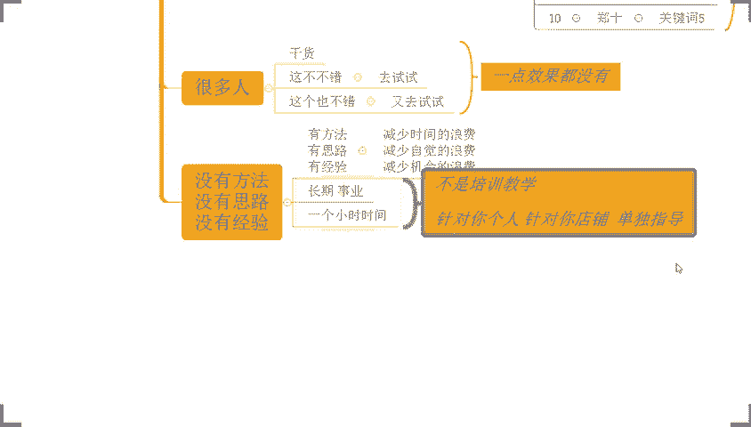

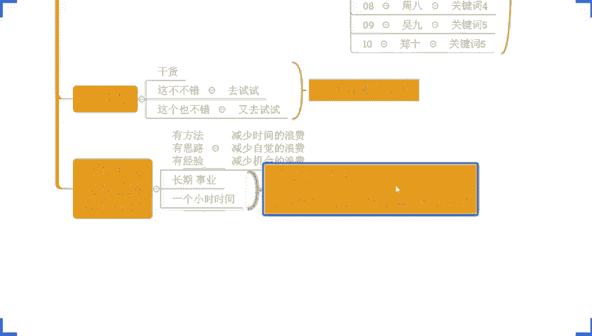

好吧，这个是实操方式。如果说你是纯新手。😡。

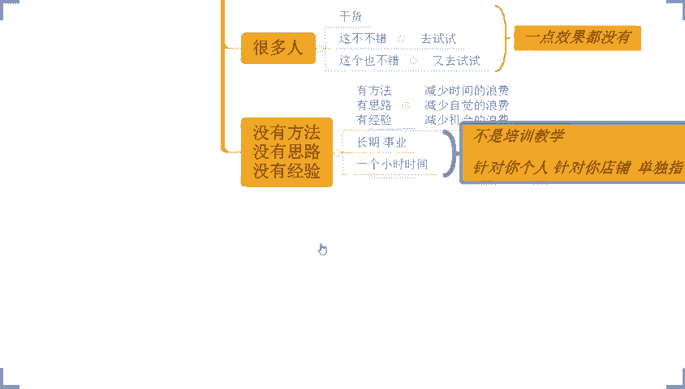

啊，如果说你是纯新手，OK的。首先呢我带着你干嘛呢？第一步对吧？做市场分析。😡，我们先搞清楚什么市场可以做，什么产品可以做，对吧？做完市场分析之后呢，我们来我们来做我们的什么竞争分析。😡，啊。

我们要搞清楚我们的竞争对手是谁，他们每天的一个相应情况怎么样，我们跟他对比，我们是不是有竞争力。如果说okK没问题。好，我们做好第三步，对吧？怎么呢？爆款选品。😡，我们把我们产品确定下来。

确定下来之后okK的，我们再去干嘛呢？再去开我们的店铺，对吧？做我们的店铺搭建。做好店铺搭建之后呢，我们要把我们产品的布局做好。😡，我们做什么样的一个价格段，做什么样的一个人群，把这些所有东西搞清楚。

搞定它搞定之后，okK我们再来做我们产品的什么呢？视觉策划。啊，这个策话，然后这边也就是说我们有产品是你会带着我去选择吗？你看到这里边的对吧？OK的啊，OK的，对不对？包括像我们的这个木，对吧？

来整个这个过程你做6年应该是应该是呃这个逻辑应该能够理解吧，对不对？所以我们坐垫的话其实有很多的细节需要去做的做的这个东西的啊。那么店铺操作的话，像这个马克也问到说，这个阿里的无货员还能做吗？

一定代发很正常的。😊，很多店铺跟我实在小伙伴也都是一件代发起来的。来。这个店铺做蚊帐的一键代发的。当你前期的时候，你没有办法去有到一个很好的这个产能的时候，对不对？没有很好的一个数据的时候。

做一键代发一定是最保险的。😡，那么这样子呢，我们可以减少我们的仓储压力，资金压力。我们的经营风险会很低。当我能够体谅之后，我们可以去跟厂家达成深度合作。自然而然我们整个的一个店铺呢也能快速起爆。

包括说我们的一个增长趋势呢，也会比较稳定一点，不会说空中楼阁一样的啊，而且呢心里会线面会有底，不会那么慌，知道吧？那么做好这些东西之后，后面呢，我们再去做我们的产品上架。😊，啊，好吧。

这就做我们产产品的上架啊，呃做6年别的是吧？OKOK啊，好好好好好，开了6年是吧啊，我以你干了6年啊，对吧？产品上架到这边的话，okK我们再后面呢去做我们的产品权重。😊，啊，再往后呢。

我们去做我们的什么活动营销。啊，再往后面呢，我们做我们的什么呢？哎付费推广啊，包括说我们还会去做我们的哎数据维护啊等等。这所有的东西都是带着实操的。啊，带着实操好不好？那如果说呃你自己对于电摩操来讲。

没有方法，没有思路的可以来好不好？然后马克讲说，哎呃我做这个阿里代发的话，价格太贵了。那么有很多种情况啊，这个马克有很多种情况。首先要么就是你自己的产品的市场选择有问题。要么是你选择的这个选品有问题。

对接的厂家有问题，对吧？这些问题可能有很多，那么你如果说跟着实操的话，这些方面都不会都不会是都不是什么问题的啊。那首先市场的方面呢我会带着你去分析。那么竞争方面我会带着你分析。

包括说选品方面我会带着你去分析，包括我们会员对接上面怎么去找到优质的这个艺术会源，怎么跟会员谈判，至于每一个细节我都会带着你去实操。😊，你自己去做的话，产品定位如果说有问题，你找到这个产品啊又不对。

那你说你去做确实很难，对不对？但是如果有我带着你去做的话，OK那整个过程的话说难听一点，你想走弯路都难。为什么说很多小伙伴做店铺，他明明听我的直播，看我的这个视频都能学到很多很多东西。

为什么选择跟我实操啊，对吧？像这些店铺来这个店铺之前的时候反客一天有4000多啊，看到没有？各位能没能看到这个店铺之前反客一天也有4000多，那他为什么跟我实操啊？😡，他自己不会做吗？会做。

因为他知道跟我做齐量会做的更大，更有机会。他选择跟得来，对不对？所以这也是为什么很多小伙伴选择更实操的原因。因为实操的话，你哪怕啊自己操作的时候，有哪些执行不到位的地方，我也会帮你去及时指正，对吧？

让你去少走弯路，知道吧？能够去更高效的一个做点一个操作方式啊，然后这个西瓜找我来是吧？O呃，西瓜你这边是确定更个实操吗？是的话，扣个一啊。😊，希望你平时去你面的时候吗？😡，呃，是的话可以扣个一呃。

马克说无货源的话要要投多少钱呃，我说一下马克，那跟着呃实操的话啊，这个费用之外呢，额外的你再准备到这个呃3到5000足够了啊，当然呢也要看我们产品，如果说你是做想去做一些高客单的。

可能这个流动资金需要会多一点啊，好不好？OK啊呃西瓜啊O那我把这个付款方式发给你。然后顺便我说一下啊，这个呃这个费用啊，费用我这边我顺便说一下啊，费用。那么今天在直播间里面啊，跟着实操小伙伴们。😊。

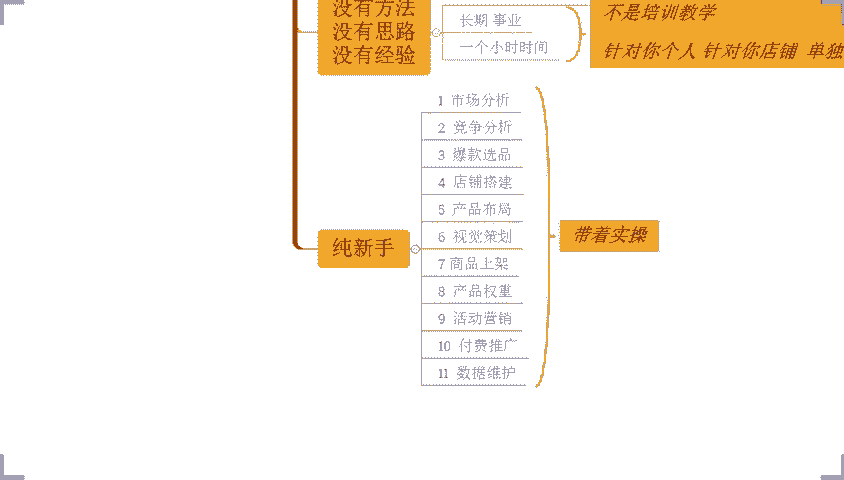

现实下。啊，限时价啊只要428万啊只要488啊。那同时呢今天跟着实在的小伙伴们额外的我再赠送你们300的。😡，啊，价值300的这个流量积分啊，不要说300分了啊，就是你们今天想要的这一个资源啊。

价值300的积分，到时候你们跟着知道的话，你去注册完账号，我帮你充进去啊，就这么简单好不好？直接给你们上300啊，相当于什么呢？相当于4288的基础上直接给你们减了300之后呢，就是3988，好不好？

这里送啊，今天啊仅限今天啊仅限。😡，今天啊前几天送。300元。流量。流量啊积分好吧，仅限今天啊，如果说OK的，可以来啊。这么点马克，你以为坐垫需要多少呢？其实之所以你们坐垫花的成本高。

是因为你自己不会做，你花了很多冤枉钱，你知道吧？坐垫有了方法之后，有了这个方这个好的一个经验去支撑之后，那么其实店铺操作的投入，并没有你想要那么夸张的，知道吧？能够理解吗？马克，那么这个西瓜啊。

我已经发你了啊，我已经发你了啊，然后你安排一下搞定之后呢，截图给我，然后呢，领取信息登记表好不好？啊，同样的这个呃目。😊，不。😡，呃，你你这边怎么想的呢？呃，就是刚加的那个资源这个上。对对对对。

就是刚加的那个资源啊，我直接送你们300300元的啊，我直接送你们3元，我帮你们充进去就好了。好吧，账号到时候给我，我给你们充进去就好了。😡，呃，不同的时间段，我手里有不同的农作物可以可以。

可以啊可以来龙作物是吧，龙作物是吧，我给你看一下啊，这个店铺就这个店铺。😡，就这个店铺来来来来来来来，西瓜，这个店铺做的就是那个玉米啊，这个店铺做的玉米。😡，呃，这个费用是一个月的吗？哪个费用。

你说这个实操的费用吗？这个费用啊，对不好意思啊，我刚刚忘说了啊，这个费用一次性收费。😡，后期没有其他费用。啊，直接干嘛呢？带到你独立运营。😡，来，马克能理解吧，直接带到你独立运营，好不好？所谓的独立营。

就是你可以自己脱离我的帮助之后去完成报款打造。😡，OK啊呃，恭喜一下西瓜啊，恭喜西瓜成功拿下一个名额，好不好？西瓜。呃，然后呢我把这个信息登记表发你啊，你去填写一下回头给我。然后另外的话。

你把那个呃等一会你注册好的这个人气账号发给我一下，我去帮你充钱，好吧，我就帮你充钱，好吧啊，西瓜呃，怎么呃大刘跟着实超的话，你直接这个微信跟我讲就可以了啊。如果说没有我微信的小伙伴啊，没有我微信的。😊。

啊，没有微信的啊，在这里我就不打字啊，直接加我的实操微信，实操微信啊，实操微信啊，直接加我实操微信啊KD39880啊，直接加我的实操微信啊，没有我微信的小伙伴直接加我的实操微信跟我讲，哎，西楼。

我要跟你实操就可以了。好吧。然后如果说是有我微信的小伙伴呢，你可以直接在微信上找我哎，跟我说要实操，或者你在公屏上跟我说都可以的啊，那我这边呢刚好电脑是双屏我也看得到的都没关系啊。

那包括说整个的操作方面呢，如果说有不确定的。哎，你说楼，我不知道这个实操方式怎么样子的。我不知道这个我这产品能不能跟着你实操没关系都可以说啊，都可以说好吧，像马克那么呃费用方面都清楚了吗？

方式方面费用方面都清楚了吗？马克。😊，来，马克都清楚的话，扣个一啊。如果说你觉得呃还有什么地方不明白的话，也可以直接讲。如果说呃其他方面都没问题，都能够理解啊，方式方面费用方面，时间方面都能接受的话。

可以扣个一，好吧。😊，嗯。然后这个呃。啊，这个。西瓜啊西瓜，你把信息登记表填一下，然后回回传给我。然后呢，你把你的这个人气账号注册好之后发给我，我去帮你充钱啊，我就帮你充钱啊。😡，呃。

我怎么感觉我要把我的运营小品开掉啊，我说一下木呃，这个东西怎么说呢？嗯，我讲真的啊，我不管你自己是要培养运营还是去孵化团队，你自己首先得懂，同意吗？同意的话扣个一。😡，因为如果说你自己不懂的话。

那么你后面其实很难做到一个长期发展的。😡，为什么呢？因为这些人他不可能啊一直以来啊能够去呃，有到一个相对来说比较稳定的一个一个一个一个情况吧。对吧所以你目前来讲的话是需要什么呢？自己要提升。

包括说你要让你的这个小妹一起提升，然后呢让他来给你赚更多的钱。然后你能够有到一个更好的把控力，能够掌握这个店铺的操作，我们可以就是作为老板啊，这个我说说实话作为过来人啊，作为老板，你可以不是非常的精通。

但是你一定要懂，你认为呢？那同样的，作为你的运营，他一定要非常的精通，有擅长的一个方向，能够帮你去把这个店铺做好。你认为呢？不然的话那么就没有意义了。是不是这道理。😡，然后这个马克呃在上班还没准备好。

想先学学离职再做。马克呃我讲真的，不管你是呃想去做电商还是怎么样子的对吧？呃，还是说你是想要去做一个副业，还是说想要会未来为你的这一个呃有到一个更好的或者更多的一个选择打基础。其实你现在完全可以去做。

我个人建议啊，你现在做会比你后面所谓的离职之后去做要更好。因为你现在去做的话，有工作支撑，那么店铺你的一个吸收到位的话，那么能够有到一个过渡过程中，对吧？你不会心里那么慌，店铺好了之后，我可以马上离职。

你也有到一个很好的发展，对不对？甚至说后面你这个呃店铺做起来之后，你自己当老板是吧？更好的一个方式，吧？多个选择。哪怕你后面说这个工作我还能接着做，我觉得也还好，我能够兼顾，那么多一个收入也是可以的。

是不是？你说是不是所以你这样的一个情况的话，呃，为了更好更稳定的发展的话。😊，所我觉得现在去做会不会更好的是吧？有更好的一个这个机会，有更好的发展条件，是不是？所以这个才是我们需要去做的一个事情。

都是成年人，我们应该思考的相对来说更全面一点。马克，你觉得我说的有道理的话，扣个一好不好？然后这个呃你比如说现价产品会不会玩法很多局限性啊，看你操作了，你如果会操作，其实这是优势来的啊。

副业做不了之前做过必须扣分哎呦。😊，客服板块啊，马克，我们有机器人，知不知道啊？😡，你说的这个问题都不是问题啊，兄弟。😡，客服本块我面的机器人，所以这个可以直接做的啊。OK啊，恭喜一下大牛啊。

恭喜一下大牛成功拿下一个名额，好不？加入稀罗时杀。大牛呃，我把这个信息登记表发给你啊，你填写一下，填写好之后呢，回成给我好不好？啊，同样的还是那句话啊，然后呢把你的这一个呃人气积分账号啊。

注册好之后发给我啊，发给我啊，然后帮你充钱啊，帮你充钱好吧好？OK呃，今天的这个福利我讲真的还是算不错的啊，还算不错的呃，这一个马克，包括说像我们的木我觉得你们不用去纠结的，完全可以直接干的，对不对？

😊，就你一直纠结来追去没有意义的那我们店铺操作来讲的话，其实你们所担忧的这些问题呢，很多时候就不是问题。就像这个马克担忧的这个呃没有时间去经营他打理他，对吧？马克一天一个小时能抽出来吗？应该没问题吧。

这个一个小时不需要你是完整的一个小时，随便花的时间就可以了。就像我们今天如果说你跟着我实操的话，我我们现在直播这个时间，其实我们就可以去聊店铺操作问题，你就不用去浪费时间来听直播或者怎么样的对吧？

然后呢，整个操作呢，我们可以花其他时间去把这个店铺操作落地下来就可以了。而店铺的所谓的客服工作的话，机器人可以搞定他的，好不好？😡，所以你所担心的这些问题的话都不是问题啊，都不是问题。好不好？

这个马克啊，那这个柠檬啊现在试了差不多两个月，完全没有头绪。我跟你讲柠檬，因为你就像我说的，你本身自己没有方法，没有思路啊，你去试你去你去摸索。

完全就是跟这个盲人摸象一样的吧瞎子过河一样的走一步看一步有什么意义呢？那你没有一个完整的思路的话，你的所有的操作都是什么呢？都是在一个被动的状态进行的。😊，啊。

那么这种情况你是没有一个前瞻性的那你整个操作呢就会说处于一个什么一个劣势的状态，你没有去提前布局，知道吧？啊，之前就是像你之前讲的，到处看到处去，这种的话怎么说呢？我们我们有句话啊，叫西引榔头东一棒槌。

对吧？是不是这样说的，所以这种操作方式的话，你想想嘛，你就不要说你做店铺了，你就说做点别的东西，那也不对的，是不是这种状态你觉得能对吗？能做好事情吗？肯定做不好的呀，😡。

是不是你需要的是一个完整的操作方式，把你这个所有的这种碎片化的东西呢给你理清完整的思路给你建立起来，然后去操作，好吧，柠檬。呃，现在是抽抽没课的啊，这个HR既然说你能够抽没课的时间看我视频，一样的。

可以抽没课的时间跟着实操，对吧？你还是大学生，是不是来，我给你看，我给你看一看啊，我给你看一看这个这个哥们啊，我给你看一看这个哥们儿啊，大学生来的啊，我给你给你看一下啊，好不好？

我给你看一下这个哥们儿大学生来的啊，我给你找一找啊，这个这个店铺案例啊，我给你找一找啊，这个店铺的话也是个大学生来的。😊，啊，这个哥们儿的话，真的我我我说实话啊，我自己做店铺这么多年。

包括说我自己也创业这么多年，我很少有见到这么努力这么用心的年轻人啊，好不好？来等一下啊，有点这个是比较早时间的一个店铺了啊，一个数据了啊。OK啊，在这里啊在这里来。😡，各位。😡。

有看到这个数据的公屏扣1，好吧，所有人动起来啊，所有现在在直播间的小伙伴有看到这个数据的公屏扣个1。我跟他讲一下这个店铺这个老板的一个一个一个情况哈，哇，真的很不容易啊，真的很不容易啊。

那么这个这个店铺啊，这个老板啊大学生来的。😡，就像就像这个HO1样的啊，就课间时候啊抽空的时候去去提升一下自己，去充实一下自己啊。他你知道每天多坑吗？我都觉得真的佩服的不行不行的啊，他每天但凡是有时间。

但凡是没有课，他都在做兼职。😡，不是在做兼职，就是在做兼职的路上可以这么说。那我就问他哎，兄弟，你你怎么这么拼啊，对吧？我很少像年轻人这么拼啊，他讲。😡，我不拼不行，我家里呢条件不好，农村人啊。

我自己呢马上也要毕业了，毕业之后呢，对吧？谈了女朋友也想要结婚啊，但是呢结婚的话可能买房彩礼压力会太大。家里面本来条件就不好。我读大学就是借钱读的。我不希望我成为家里的负担。

我希望我能够通过我的努力给我自己创造一个美好的未来。我也不希望未来我的孩子跟我一样生活过的这么拮局。当时我一听我的天这个这个哥们无敌了，个有这样的一个冲劲有这样的一个这个决心，你说做什事情做不好。

刚好啊他这个确实做的蛮不错的？刚好确实做的蛮不错的啊，看到没有？一个新店来的啊，有新店来的直接干到了咔咔咔直接往上冲啊，这年初的时候啊干到了8000多访客，看到没有？一天1900多单22。

07的转化率啊，20多他做的是那个卡纸卡纸就是那个做那个折纸的这种卡纸啊啊来这个是他的这个转化率看到没有？转化率看到没有看到没有？整个转化啊，那么当然也是有方法的，这个就不去说那么那么多了啊。

那如果说你自己啊有这个需要的，想要去提高的，对不对？也确实想要去认真坐店的O的。😡，可以来啊，刚分手对吧？你朋友跟别人跑了啊，要赚钱或者钱。😊，啊，哎就那这样这样子的话，我觉得OK的啊，对吧？

俗话说的好嘛，这个情场诗意，对吧？😊，赌场得意。那我们今天全场失意，商场得意一下，好不好？可以直接去干起来啊，就不用去拖沓，好吧？那时间方面能够能不能抽出一个小时随便化段时间就可以了。

我们沟通清楚店铺的操作，然后去安排落地，可不可以做到，可以做到扣个一啊，可以做到扣个一好吧？时间方面啊你比如说现在有空，我们现在沟通，你说现在哎不好意思，了，我现在有点事情，你去忙别的。没关系。

但是你等一会抽出时间来，我们继续沟通，把店铺操作的内容聊清楚，聊透，并且呢把问题找出来之后呢，做做好这个落地方案的一个执行，有没有问题，没问题，扣个一啊，没问题扣个一。😊，要求有没有问题？如果说没问题。

可可以。😡，好吧。OK的OK的那就行那就行啊那就行啊。那么呃，方式方面，资金方面O不OK如果OK的话，扣个一。😡，阿琼。来实操方式啊实操方式，还有这个资金方面O不OK？😡，呃。

木说资金方面多少叫方便啊呃是他自己啊他自己这个呃，我是说他自己啊，对于这个跟据实操的费用方面啊是这样子HO这边是这样子的。呃，至于你这边木这边啊呃，本身你自己是老板呢，这方面你肯定没问题的啦，对吧？

这方面的担忧都多余多余的啊，就真的是啊我的天。😡，对吧这方面你肯定多余的担忧的啊，所以呃没问题的话，时间方面，方式方面，资金方面都没问题的话，那就直接干就完了，是不是呃？

H且我把这个付款方式发给你好不好，搞定之后截图给我就直接开整了，多的就不多说了啊。然后这个呃。😊，还有这个这个这个。叫战争的战争与和平啊，战争与和平啊，我我找到你我我看到你很多次了啊。

我看到你这个呃很很多次了啊，这个这个这个你是你是哪个呀？你你微信找我一下吧，你用微信吗？因为我在微信上还没见过你。😡，我的微上好像没有见过你啊，你可以没有的没有的话，你可以加一下啊，你可以加一下好吧啊。

这是我的实在微信啊。你没有的话，你可以加一下。既然说你听我直播的话啊，那我相信你绝对是，而且不止听了一次的话，绝对是觉得哎楼确实有点东西的啊，详细这个呃自己有点提升的，对不对？

那么可以直接加我微信加一下啊，我们可以多沟通啊，多沟通好吧？这样的话，这个呃整个的一个店铺操作也好啊啊，沟通方面也好，都会更加方便一点啊，就不至于说像现在这样子，对吧？

你可能自己还是在那里处于一个闭门造车的一个状态，对吧？那我觉得这样子没有意义的啊，呃，然后这个目。😊，木呃，本身你自己呢呃，我们俩之间呢，其实呃，我讲真的感官都是OK的啊。

就是你觉得确实泄毒也还是有东西的对吧？有点货的。然后你确实呢目前你这个一个状态呢也是要去提高的。呃，我个人建议的话，你可以直接跟着实操的。就不用去再自己去摸索，再自己去这一个试错的对吧？

因为本身你自己去试错，自己去摸索的话，说白了店铺操作的投入很多时候可能远比跟着实操的这个费用要多的多的是不是像你们大多数人的话啊都会想着说我自己去做的话，我自己去试的话，万一我试好了，万一我做好了，哎。

我是不是也可以去省这部分费用的话，O的。但是大多数小伙伴我讲真的啊去所谓的去试所谓的去摸索所谓的去操作的话，最终的结果就只有一个的就是就我之前说的那个事情对吧？哎钱可能也花下去了。

店铺呢也没有做起来是吧？那这样的话就没有什么太大的意义的啊，那店铺操作来讲的话，方法很重要。方式很重要，机会也很重要。有的时候你自己错过了这个机会呢。

那么下一次的时候就不知道什么时候了啊呃看下微信老公商量了嗯 ok ok啊柠檬的啊没问题啊没问题檬那我把这个付款方式发给你我付款方式你啊。

搞定之后呢截图给我还是那句话啊啊恭喜一下这个红彤彤啊H恭喜红彤彤啊拿下一个名额加入操那么今天的话我们就先到这里了？像这个战争与和平啊风啊，还有木啊。

还有像这个s风度啊马克呀你们自己的话如果说对于方面还有什么不清楚的地方呢，有兴趣可以直接找我如果说有什么方面问题的话啊，也可以直接找我都可以的那么今天的话就先这样啊，因为确实啊这个时间也不早了。

那么我们下期再见啊，不？各位我们拜拜。😊。

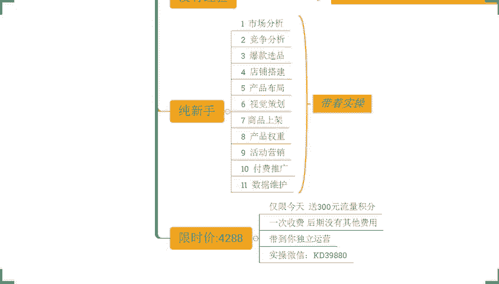