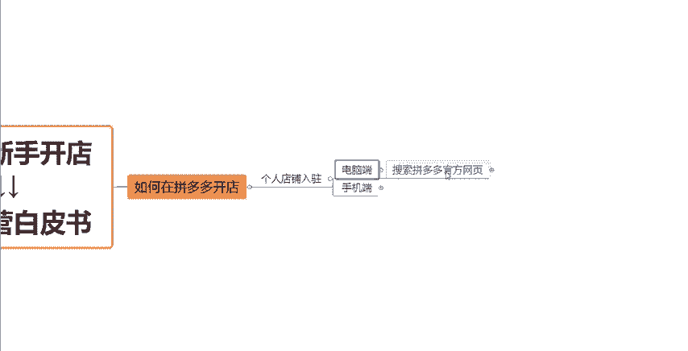
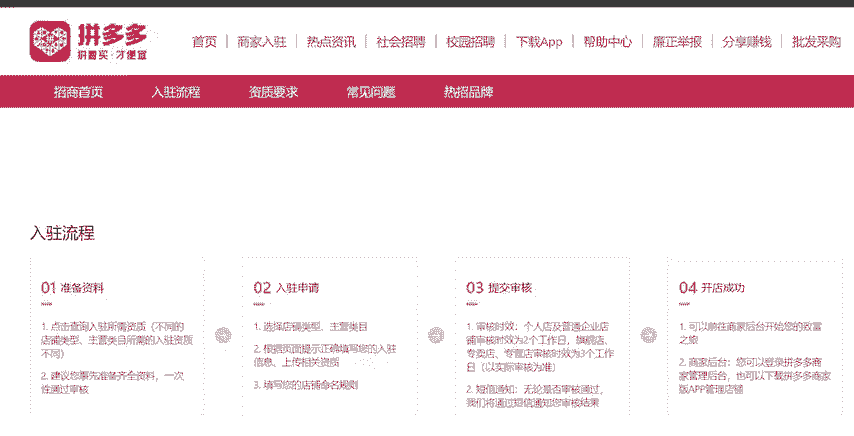
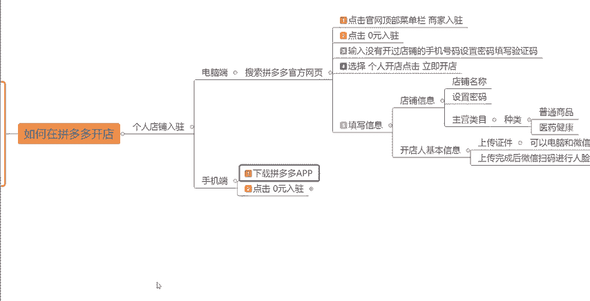
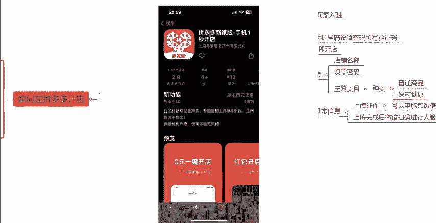
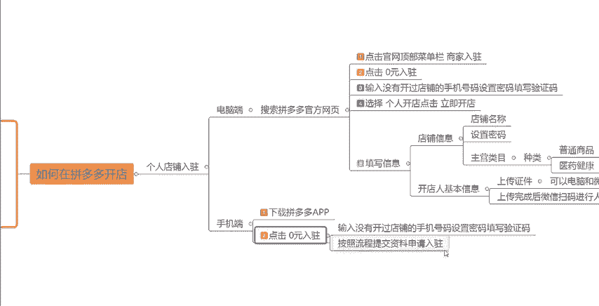

# 【拼多多运营】2024年最系统的全套拼多多运营教程，适合所有拼多多开店新手小卖家自学，10年资深运营师手把手教你从0到1起店实操。 - P5：05-如何在拼多多开店 - 拼多多运营教程_ - BV1H62ZYREs4

hello，大家好，那么我们今天呢继续学习拼多多新手开店实操运营白皮书当中的这一期课程啊。那么今天这一期视频呢要跟大家讲关于我们如何在拼多多啊新手如何去入驻这个店铺啊，今天要跟大家来聊一聊这个问题。

具体的操作流程是怎么样的那比如说如果说我想在这个拼多多上开一个店铺啊，那我肯定得先搞清楚我通过什么样的一个方式去入驻这个平台，对不对？通过什么样的方式去开店。那么我们先来看一下啊，首先呢开店的话呃。

比如说我们是分为个人店铺跟企业店铺啊，不同的店铺类型，它的这个入驻方式其实是一样的。只不过说你提交的这个材料啊，一些需要的资质，可能说有一点点不同。那么我们今天呢就以个人店铺入住来给大家举个例子啊。

那如果说我们是个人店铺入驻的话。它分为两个端口可以完成这个入驻操作啊。第一个是电脑端，一个是手机端，这两个地方都是可以的啊。那先跟大家讲一下关于电脑端的一个入驻流程。

首先呢电脑端我们可以先去搜索在网站上搜索拼多多这个官方的一个首页。然后在首页官网的顶部的菜单栏当中，大家可以看到有一个商家入驻的这个页面啊。那么我们直接点击商家入驻就会呃进入到这个页面当中来。

那么在这个页面呢，我们要先填写一个就是我们从来没有开过店铺的一个手机号码，然后我们设置一个这个店铺的一个密码。然后输一下你收到的这个验证码，点击0元入驻啊，这个就可以了。之后呢。

我们还需要选择一下店铺的一个类型啊。大家可以看一下官网。其实他把这个入驻的流程，其实很详细的给我们写出来。

对啊。前面呃首先我们需要先准备一些资料啊，比如说你要入驻的什么店铺类型，你是开个人店还是企业店，然后你要做什么样的一个类目，对吧？主营类目的不同，然后有一些入住的这个资质啊，材料啊，也会有一点点区别。

所以说你们先根据你们自己的一个实际情况，把这一个入驻的准备资料先准备好。然后就是来到刚才的那一个页面啊，点击入住申请，然后直接提交审核就可以了啊。主营类目的话，这个地方其实之前的视频跟大家讲过了。

分为两个，一个是普通商品，一个是医药健康，这里跟大家重点说明一下，如果说你还没有确定好，你就是你这个店铺之后要卖什么的话，那么一律去选择普通商品就可以了。因为你选择普通商品的话。

后期比如说我们要再想要去做这个呃医疗啊健康之类的。呃。你可以在后续去提交对应的所需要的一些资料，然后还是可以换这个类目的。但如果说你前期选择的是医药健康的话，后面你就没有办法去更换。

没有没有办法去经营的这一点大家注意一下啊，然后就按照官方要求的这些。这些流程啊去提供一下你们的这一个资质材料。比如说身份证的一个照片啊，或者说这个营业执照的一些照片啊，然后你的一些身份信息啊。

这些全部的把它上传完就可以了啊，就可以了。然后个人店铺的话，下店一般会比较快，两个工作日之内一般都能够入驻完成。然后如果说是旗舰店专卖店专营店的话就会稍微的长一点，三个工作日以内啊，就会入驻完成的。

所以说这个拼多多的这个开店呢还是非常非常的简单的。这个是电脑端的一个就是。

入驻的一个流程啊，入驻的一个流程。第一个总结一下，点击官网的顶部菜单栏商家入驻，然后点击0元入驻，然后输入一下你的手机号码，填一下这个设置一下密码，填一下验证码就可以了。点击0元入驻，然后立即开店。

然后填写你的个人信息。店铺信息，你需要填写的是这个呃设置一下你的这个店铺名称，然后设置店铺密码，然后选择主营类目啊，就是刚才跟大家讲的那两种普通商品跟医药健康，然后你的开店人的基本信息，把它上传一下。

就是你的这个身份证的一些照片啊，然后营业执照营业执照的一些照片。然后上传完之后啊，它会弹一个二维码出来，你需要用你的这个微信去扫描那个二维码，他会让你做一个人脸识别的一个呃这个实名认证，好吧。

然后实名认证完之后呢，就可以就完成了。这个是电脑端的啊，然后手机端的话也是非常的简单啊。手机端呢就需要大家。在你们自己的这个手机上手机上面的这个应用商城去下载一个这个东西。拼多多商家版啊。

去下载一下这个软件。下载完之后呢，你们打开会看到这样的一个页面啊，然后同样的我们也是点击0元开店，点击完之后呢，一样的输入一个没有开过店的手机号码，然后把这个验证码啊，把验证码填写一下。

然后立即开店就可以了。后面的话它也会让你去上传一些这个资料啊，这些认证，大家可以看到个人店或者个体工商户，或者说你要开旗验店，那么不同的这种店铺类型所需要提交的一些资料呢就不同。好吧。

根据大家你们自己的一个个人情况去选择就可以了。然后点击入住。点击完入驻之后呢，它会让你那个上传一下你的这个身份证的正反面，然后去设置一下你的这个店铺名称，然后再下一步去做这个人脸的验证啊。

同样的这几步操作流程啊，你去做下。

来之后啊，你的这个店铺呢也就入驻的完成了。然后这些东西全部提交完之后呢，你就需要。等待啊等待就可以了。一般就是两个工作日以内啊还是非常快的。好吧。

那么这个呢就是我们呃如何在这个拼多多上去开店的一个入驻流程啊，希望大家能够学会，然后感谢大家的一个观看。如果说大家还有什么其他的地方不明白的，欢迎大家来评论去找我跟我交流沟通啊。

然后我也可以抽空去帮大家解决一下大家的问题，诊断一下店铺。好吧，感谢大家感谢大家的一个观看。

