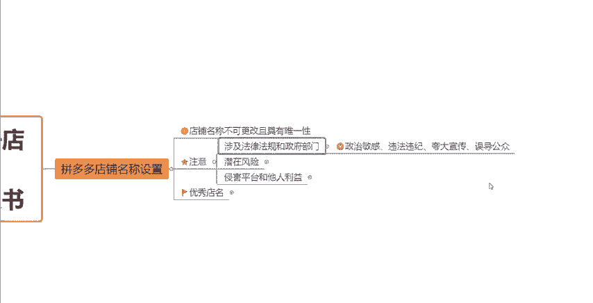
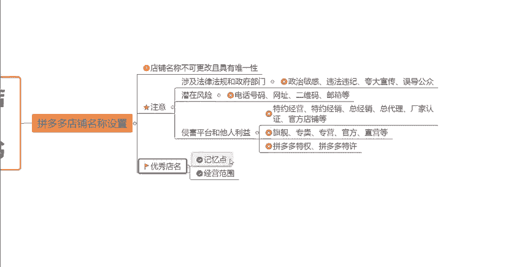

# 【拼多多运营】2024年最系统的全套拼多多运营教程，适合所有拼多多开店新手小卖家自学，10年资深运营师手把手教你从0到1起店实操。 - P6：06-拼多多店铺名称设置 - 拼多多运营教程_ - BV1H62ZYREs4

hello大家好，那今天呢我们来继续学习拼多多新手开店实操运营白皮书当中的这个第六个内容啊。第六个内容今天要跟大家讲的是我们的这个拼多多店铺名称设置方面的一些问题啊。因为这个店铺名称呢。

对于我们后续店铺的一个经营的一个影响，其实还是有占一定的这个比重的。所以说如果我们一个好的店铺名称啊，它是可以更好的帮我们做到一个用户的这个留存啊，包括一些老客户的这个关注啊，老客户的回购啊。

都是可以起到一个非常不错的一个效果的啊。那么我们来看一看啊，就是店铺名称的一个取名的技巧，以及他所需要注意的一些点到底是有哪些啊。首先我们在取名称的一个时候啊，注意一个事情。就是店铺名称。

它是不可以更改的啊，在正常的情况下是不可以更改的。而且具备唯一性。

就是说如果说在拼多多这个平台上已经有店铺是使用的这个名字的话，那我我们就不能再用了啊。那同时呢如果说我们的一个店铺啊，就是产品发布之后产生的产生的这个订单产生的销量。

那么订单的这个店铺的名称也是不可以被更改的。所以说大家在一开始的时候啊，就一定要去确定好明确好，就是你店铺后续的一个经营方向，然后根据你的这个经营方向呢去取一个这个店铺名称把它确定好。好吧。呃。

因为你的这个店铺的经营方向跟这个名称，如果说差十万八千里的话，或者说之间没有什么关联的话，这个也不太好，不太利于这个买家对于你的这个店铺产生一定的这个印象。好吧，那么同时呢我们的这个店铺名称。

取名字的时候，需要哪注意哪几个点呢？首先第一个就是涉及法律法规和政府部门啊。

这种一些敏感的词汇啊，违禁的词汇，这些是不能够使用的啊。因为它本身就有很强烈的这种政治敏感啊，违法违纪，或者说是一些夸大宣传，然后或者是一些误导公众的一些后果啊。

所以说呃同时呢它也是这种存在潜在风险的一些内容。这个我们是绝对绝对不能在店铺名称设置当中去把它体现出来的啊。包括说我们的一些个人的这种联系方式啊，电话号码呀，或者说等等等等这种一些个人的信息啊。

我们都是不能够去把它体现出来的。好吧，然后第三点呢就是侵害平台和他人利益的一些这种关键词，也是够也是不能用的啊。比如说你开的是一个这种个人店铺，或者说是这种个体工商户的店铺。

或者说你开的就是一个呃普通的这种企业店铺。那么你可能说哎想要在名称上钻一点这种流空子啊。

啊，你可能说自己想取一个叫某某旗舰店，对吧？你不是旗舰店，但是你想想要取一个这样的一个名字啊，而包括说你们可能说有的是什么这种分销商啊，或者说是一些经销商。

那么你也想要去把它就是体现出这种旗舰店的那种感觉啊。所以说。这些呢都是不允许的啊，都是存在违规的。呃。你如果说是以上刚才我说的那几种类型的话，那么像一些特约经营啊，特约经销啊。

然后总经销总代理厂家认证啊，官方店铺啊，还有包括你什么在你的店铺名称当中说什么旗舰啊、专卖专营官方直营啊等等啊，或者说一些拼多多特权拼多多特许，这些都是违规的啊，都是违规的。好吧。

所以说大家要尽量避免这几个点啊，避免这几个点。那么呃我们了解了就是注意的这几个事项了之后呢，那我们如何去取一个优秀的店铺名称，对不对？首先呢你的店铺名称，它一定要有这个记一点啊，记一点，什么叫记一点。

就是一个买家在你的店铺当中买了东西，或者说没有买东西，但是他只是看到了你的店铺，他是很容易能够记下来的。那么下一次呢可能说呃我当时没有买你这个商品。

因为可能说我想在过段时间买，我或者说我想在货比三家一下。然后回过头来呢，它是很容易想起你的这个店铺名称的。那么他就可以直接通过搜索你的店铺名称，然后进到你的店铺当中来。所以说啊这你的店铺名称啊。

一定要有记一点，要很好记好吧，那第二个呢就是一定要标注清楚你的这个经营范围啊，就是当一个消费者看到你的店铺名称之后，他能够一眼就知道就是你的店铺是卖什么的这是一个呃最好的一个状态啊。

但是如果说本身一开始比如说我们大家没有呃刚刚开店，没有说明很明确我之后要卖什么，明确我自己的一个经营范围。那这个点你就不要去考虑了啊，你就只去考虑这个记点这个问题就可以了。好吧。

如果说你已经明确了你之后要卖什么，已经明确了你的经营范围了之后呢，O你可以按照你的卖之后要卖的这些产品，按照你的这个经营的范围来去。

取这一个这个店铺的名称，好吧？或者说呃比如说做一些小的操作啊，蹭一蹭同行的流量，对不对？比如说我们是做这个卖抽纸的，卖纸巾的，对不对？那你抽纸当中啊很有名的那些品牌，比如说哎清风，对不对？

那我们如果说也是卖纸的那我们蹭一下流量的，我们不一定叫清风，我们我们可以叫什么叫抹风啊，什么什么风啊，对不对？那这个就是蹭一些品牌名字的这种小技巧啊，所以说大家可以多去想一想。

那么你在蹭这样的一个流量的时候呢，你的店铺可能说也会更容易被搜索到。那这样子的话可以帮助我们店铺在前期啊获得一些额外的这种推荐和曝光，懂不懂？好吧，那以上呢就是关于我们店铺取名方面的一些小技巧啊。

一些小小的一个分享，希望对大家有所帮助啊。如果说大家还有一些其他的方面不。

懂的地方或者说你们在自己坐店的过程当中有遇到任何的问题呢，大家都可以来评论区找我啊，然后我可以呃帮大家解决一下这些问题。好了，这期视频就到这，感谢大家的一个观看。

