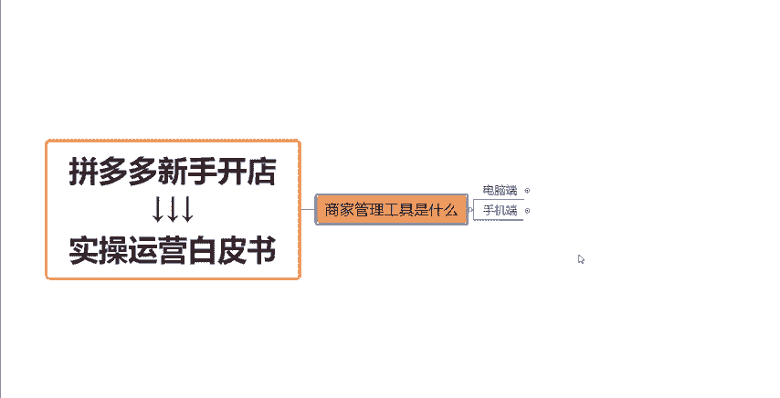

# 【拼多多运营】2024年最系统的全套拼多多运营教程，适合所有拼多多开店新手小卖家自学，10年资深运营师手把手教你从0到1起店实操。 - P7：07-商家管理工具是什么 - 拼多多运营教程_ - BV1H62ZYREs4

hello大家好。那么这一期视频呢我们来继续学习拼多多新手开店实操运营白皮书系列课程当中的呃这样的一期内容啊。那么今天要跟大家分享的是关于我们这个拼多多的商家管理工具的一个讲解啊。嗯。

如果说我想要在拼多多上开一个店铺。首先呢我得搞清楚我用什么样的一个工具，对吧？来管理来就是运营我的店铺，那么基于这一点呢，拼多多这个平台它还是比较人性化的啊，它有推出到两个这个端口，一个是电脑端。

一个是手机端这两个端口啊。那么这两个端口呢，它都可以帮助我们来完成这个店铺运营。但是呢这里我要提醒大家一下，如果说你想要经营店铺的话，那么最好还是要有一台电脑啊。

那么我们在电脑端的一个操作店铺是会更加的方便的。而且有一部分功能的话，只有在我们的电脑端才能够完成操作的。手机端是没有办法操作的。好吧，所以说这个点大家可以。

注意一下。那么如果说我通过电脑端去操作的话，呃，也有多种方式是可以进行这样的一个店铺管理的。一个呢就是去电脑上下载一个我们的这样的一个呃拼多多的这个商家的这个呃这个软件啊，这个软件下载这样的一个应用。

呃，我们直接去拼多多官网就可以下载啊，然后下载完安装之后登录你的店铺啊，登录完之后，就是这样的一个界面啊，就是这样的一个界面。你可以扫码登录，也可以通过你的这个账号跟密码登录都可以的啊。

那么这种情况下展默认展示的是这个工作台的一个界面。这个时候是我们的这样的一个呃客服接待的一个窗口啊，大家可以看到现在镜头前面这个是客服的一个窗口。

那么再往下呢会有一些这个订单的大家可以看到啊一些呃订单的一些这个信息啊页面啊，然后再再下面来这个呢就是店铺的一些呃。

商品啊一些商品的这种管理管理的一个后台。比如说呃在售中有哪些下架的有哪些，对吧？然后在这边也可以去发布一些新商品，这个是这个商品管理的一个页面。然后再下面呢就是店铺数据的一些方面的一些这个东西了。

那么呃如果说我们想要进入到管理的这个后台完整的一个后台啊，我们可以在左下角这个地方，大家有没有看到有一个首页这样的一个按钮，点击之后呢，我们就可以进入到啊我们整个店铺的这样的一个管理后台了。

大家可以看到在这个后台当中啊有非常非常多的一个工具，大家可以看一下。像顶部呢这个地方呢就是我们的这个店铺的logo啊，店铺的名称头像啊，这些东西啊，然后在这个地方呢就是一个搜索框。

那如果说我们平时在运营店铺的过程当中遇到的一些店铺操作问题呢，我们就可以直接通过这个搜索框来去呃找到一些官方的这种回答啊，这种解决方法。好吧，那如果说我要找一些某些功能。我不知道它在哪里，对不对？

那通过这个搜索框也可以去找到这个功能啊。

然后我们再往下呢，就是像这个地方啊，就是一些消息啊，站内信啊这个地方就是平台它有时候会给我们发一些这个店铺的一些通知啊，或者说如果说你店铺有一些违规信息之类的东西啊，那么都会给你发这样的一个消息。

或者说站内信啊，在这个地方可以去阅读，可以去查看的好吧。

然后我们再看一下左边这些啊，比如说我们的这种发布管发货管理啊，包括售后管理啊、商品管理啊，然后推广的推广的这个界面啊，然后一些数据中心的这样的一个页面啊，都是在我们左侧都是在我们左侧呃。

有非常非常多的一个工具啊。那么在这边提醒大家一下啊呃比如说这个东西啊这个物流工具啊。

物流工具的话，大家可以每天去检查一下啊，每天去检查一下，就是你们的这个呃订单的情况啊，还有你们有一些异常订单啊，你们每天一定要及时的跟进是吧？在发货管理订单查询这个地方，如果说有一些呃订单。

比如说发货要超时了呀，或者说一些中转要超时了呀，这个大家每天啊之后的话，都要重点的去留意去检查一下，一定要及时跟进啊。因为拼多多这个平台很容易会出现一些店铺违规啊，因为订单的这种延迟的原因啊。

到时候出现了违规或者说被罚款，这个就不太好了。好吧，然后我们再往下啊，像这个是我们的一个售后的一个管理平台啊，那么在这里面呢我们可以设置好一些我们店铺售后的一些对接工作，对吧？

包括说呃拍下之后啊拍下之后呃，比如说。

我已经发货的一些订单啊，然后设置一些仅退款啊，或者说我们呃比如说客有的买家他会申请这个仅退款，对不对？那么我们就可以在这个地方去设置这种自动驳回啊，自动驳回这样的一些操作一些功能啊。

然后我们再往下呢，就是我们的这个商品管理页面了，像我们发布新商品。就是在这个地方可以通过这个按钮去发布我们的产品。然后在我们的这个商品列表里面呢，大家也可以看到是可以去发布这个机会商品的啊，机会商品的。

那么一般情况下呢，也建议大家通过我们商品列表当中的这个机会商品按钮去发布这个机会商品。这样的话我们的产品在上架之后，它的一个基础的权重会高一些。然后我们在这个商品素材当中呢。

呃可以去比如说去帮我们做一些图片啊，然后去帮我们抠一些白底图啊，或者说测图啊，一些功能呢，就是在这个里面就是在这些工具就是在这个里面大家可以去呃学习一下。

然后再往下就是我们平时用到的一些这种推广工具推广平台啊，平时在操作店铺引流的时候会经常用到的。比如说我们的这个全站推广标准推广或者说直播推广啊。

有一些明星店铺啊等等这些功能都是我们的这些推广工具。然后我们再往下呢就是一个店铺的整体的这个数据中心啊，平时看一些商品的数据啊，或者说店铺整体的数据啊，交易数据啊，服务的数据啊，都是在这个里面，好不好？

然后再往下是我们的这个店铺营销啊，店铺营销，比如说我们的一些店铺的活动设置啊，还有一些包括这个优惠券，对吧？大家可以看到，像一些优惠券，店铺的满减活动或者说要设置这个限时限量购啊，跨店满减啊。

跨店满返啊等等等等。这些活动的这种工具都在这个地方啊，都在这个这个地方里面。

然后大家也可以去先去多多熟悉一下这个里面这个里面啊，然后我们再往下大家看到这个地方啊，有个叫做多多客服啊，多多客服这个地方。呃，我们可以在比如说你开了一个新店，对不对？

那么我们可以在这种呃客服工具当中去设置一些这种呃自动的回复话术啊，自动的回复话术。比如说呃这个。消费者啊点提了哪些问题，然后这种踩中了哪些关键词的这种字眼啊。

那么我们的这个机器人呢就会自动的去给到我们的这种消费者去给他一个回复啊，去回复他，好吧，然后再往下呢就是我们的这个多多进宝啊，多多进宝这个页面。多多进宝的话，就是我们针对产品进行推广的一个渠道了啊。

很多小伙伴呢对于这个多多进宝的一个概念还不是特别理解。其实大家可以这样去想一想啊，就是多多进宝呢，他就相当于一些这种呃二道贩子啊，他就帮我们的产品去推荐给他的一些渠道，他的一些这种私域的一些人群。

然后去进行销售。啊，他如果说他那边卖出去了，那么会有产生一定的这个佣金啊。

然后到目前的话呢，拼多多它其实就已经。这个多多进宝啊，它其实已经演变成了一个去帮助我们去提升这个DSR的一个工具了啊。所以说这个点呢大家也可以去这个了解一下啊，了解一下。

如果说你们的这种产品是一些日生活日用品啊，一些快消品，一些客单价稍微的低一点的这种产品，那么多多进宝其实就比较适合。如果说不是这种产品，或者说一些卖的这种客单价比较贵的啊，那么多多进宝可能就不太适合啊。

可能效果就不太好，就不太建议去做这个东西了。好吧，然后再往下呢就是我们的这个采购管理啊，批发采购啊，采购订单呢，这个其实就不不多跟大家介绍了。因为一般来讲我们个人开店啊，用不到这个地方好吧。

用不到这个地方。呃，像这些呢就是我们店铺后台的一些这种管理工具啊，管理工具。所以说都在这个地方，那么大家在开完你们就是在开完自己的店铺之后。

后呢不要就是盲目的去上架产品去操作啊，弄这弄那的，就很心急的样子。我还是建议大家就是在你们正式运营之前啊，就把这个店铺的这个管理后台这些操作这些端口路径。好好的全部去熟悉清楚。

一个一个的到底去认认真真的去看一下，就是这些功能到底应该怎么样去使用，对不对？把这些搞懂了之后啊，我们再来运营店铺会更加的这种清晰，更加上手会更加快一点，好不？那么这就是我们店铺后台的一些操作啊。

一些路径，一些端口。那如果说呃大家还有不清楚的地方，就是比如说某些功能还不知道到底怎么去使用的话呢，大家可以在评论区找到我。然后我来教一下大家，这个都是没有任何问题的。好吧，那么今天的这期视频呢。

就先到这，感谢大家的一个观看。

