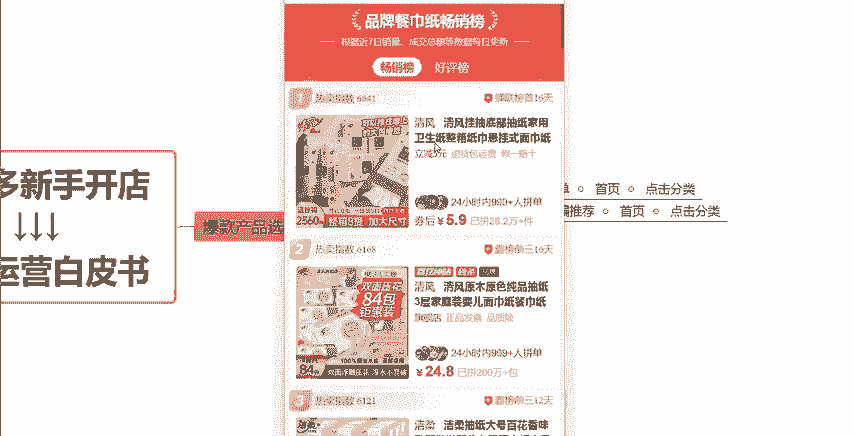

# 【拼多多运营】2024年最系统的全套拼多多运营教程，适合所有拼多多开店新手小卖家自学，10年资深运营师手把手教你从0到1起店实操。 - P9：09-爆款产品选品渠道 - 拼多多运营教程_ - BV1H62ZYREs4

hello，大家好，今天我们来聊一聊关于我们拼多多新手开店实操运营白皮书系列课程当中的一个选品渠道的一个话题啊。呃上一期视频呢我们讲到了就是我们在运营店铺之前选品方面的一些思路啊。

我相信大家对于这一个选品思路方面还是会有一定的这个初步的清晰认知，对不对？我们选品的话选的不仅仅是产品啊，其实选的是这个什么选的是需求，选的是消费者的需求，选择的是市场的竞争度啊。

那如果说我去做一个产品的话，我一定是选择那些什么相对来讲竞争不会特别特别大，没有那么的激烈的这种这种赛道。那或者说我会去选择一些我的产品呃，它的这种竞争力会比较强的这种产品，对不对？那这这样的一些产品。

我去做的话，我的这个店铺的一个提升。我的数据的提升才会呃更快更好一点，能够做到事半功倍，对不对？所以说那么选品的。

渠道到底有哪些呢？就是今天这期视频要来教给大家的啊呃，我们可以先看一下啊，给大家呃总结分为了两个选品的渠道。一个是首页类目排行榜小编推荐。第二个是短视频平台以及其他的一些电商平台。先跟大家讲第一个啊。

就是我们通过拼多多的这个站内选品的话，我们可以通过这个拼多多平台，它给我们的一些这个榜单啊，榜单大家可以看一下，我跟大家说一下在哪些地方啊。比如说我们在这个拼多多上买东西的时候啊，经常啊。

比如说我想买纸，那我点击纸之后啊，我经常会。

会看到一些什么呢？会看到一些在这些地方啊呃，像这个是没有的啊。那比如说。

我点分类，然后随便点一个卫生纸啊，卫生纸。

然后我按照销量排序。来在这个地方，我随便点击一个产品进去。点击完之后，大家可以看一下这个地方有没有看到品牌餐巾纸畅销榜。这个地方呢它就叫做榜单啊，就叫做榜单。

那这个路径在这边啊，然后点击榜单之后呢，它其实这个拼多多这个平台它就已经自动的帮我们把这个注意啊，是这个类目啊，品牌餐巾纸这个类目当中它的一个卖的最好的一个榜单就给到我们了。所以说通过这个里面呢。

我们就是我们一个重要的参考依据啊。通过这个里面，我们可以快速的去确定去锁定到一些就是市场销量比较好的啊，或者说平台推荐度比较高的一些产品，那除了这个畅销榜，我们也可以看好评榜啊，对不对？

好评榜就是买家对于哪些产品，哪种类型的产品好评度是比较高的啊，这个是卖的比较多的。通过这两个榜单呢，我们就可以去做一个参考，对不对？如果说我的产品跟它是同类型的，或者我可以做到比它更具有性价比。

那是不是就代表我能够我也可以去做上这种排名，做上这种榜单，对不对？基本上这个产品的销量跟转化，你就不需要太过于担心了，理解吧？不需要太过担心了。所以说通过这个方式啊，通过这个指令。

我们可以去对于这个产品，对于这个市场去做一个初步的分析啊，做一个初步的分析。

然后第二个呢就是小编推荐啊，小编推荐在首页分类啊也是一样的啊，也是一样的。大家同可以通过这些地方啊，通过这些地方看到没有？这个行家心得啊，行家心得这些这些地方啊，通过这些地方啊，我们就可以去去看到啊啊。

去看到有哪些就是在不同的分类当中哪些这个商品的热度是比较高的啊，哪些商品的这个销量是比较好的对吧？那这些商这些产品的话一样的，我们进行分析之后，我们就可以得到这整个市场的一个竞争的一个情况啊。

那这些东西我们分析完之后呢，我们再根据我们产品的一个什么，根据我们产品的实际成本啊，包括说我们的一些渠道啊等等这些东西来分析判断一下，就是这个产品适不适合做，对吧？或者说适不适合我去做。

那我已经有产品的之后，那这个时候我可以去对比一下，对吧？呃。

析一下这些同行，分析一下这些竞品啊，他们的优势在哪里。那我的优势在哪里？我可以做一些什么样的一个调整，可以比他们更具有性价比，对吧？这是我你们要做到的一个这个的运营策略啊，运营策略。

那这第一个呢就是通过我们拼多多站内的一个平台去分析一下啊，哪些产品可以做啊，哪些产品数据比较好。那第二个就是我们的一个站外的一些平台啊，包括说短视频的平台，包括说其他电商的一些平台。短视频平台。

大家比较熟知的就是现在的啊抖音快手这两个，对不对？

这两个的话，大家在这两个渠道上可能会经常有看到一些。这种嗯网红产品对吧？网红爆款啊，或者是一些热度比较高一点的啊，或者说一些新奇特的一些产品，对吧？那这些产品呢我们去做也是可以的。呃。

那么因为它呢它的这种产品啊，它的起量是非常非常快的。它是这种爆发的，哎，突然就火了，一下子几千上万的一个销量。所以说你你们大家如果说想要去做这种网红同款网红爆款的话，那么时间节点，这个就非常重要。

你们要能够把控在这个产品，刚刚起量的时候，也就是说第一波风口的时候，整个市场竞争还没有那么的强。那么在这个节点你去操作是比较容易做起来的。如果说大家都已经卖爆了，这个产品已经在市场上卖烂了。

那这个时候你说哎我再去跟一下这个网红爆款，这个肯定就是不行了的，懂不懂？好吧？所以说你想做网红爆款的话。时间节点很重要。这个对上的你就去做错过了，你就不要做了。好吧，那除了这个地方呢。

还有包括我们一些其他的平台，包括我们的这个呃淘宝啊、京东啊，对不对？在这些平台上啊，我们也可以去找到一些这种活动商品，找到一些这种爆款商品，或者说是一些季节性的这种商品，对吧？以他们为导向。

然后我们来快速确定我们的这个产品，快速确定我们的这个运营方向。我们把这些产品啊先确定下来之后，然后我再回到我们的这个市场当中，回到我们的这个类目当中去做一下这个竞品分析，去做一下这个市场调研，好吧。

那这些市场啊在他的这个产品销量都是ok的情况下，那我们再去重点去操作，如果说整个行业啊，包括一些做的好的这种竞品。这些同行。他们的这种整体的市场销量都不太好的情况下，我们就不要去做了。好不好？

O那以上呢就是我们关于。选品渠道的一个分享啊。如果说大家还有什么想要了解的，大家还有什么不懂的，欢迎大家来随时的跟我交流沟通，在评论区都可以找到我的。好吧，然后这期的视频就先跟大家分享到这。

感谢大家的一个观看。

