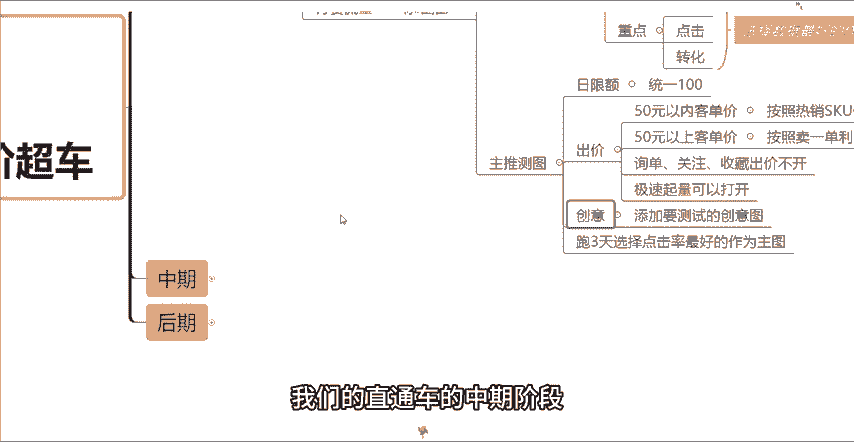
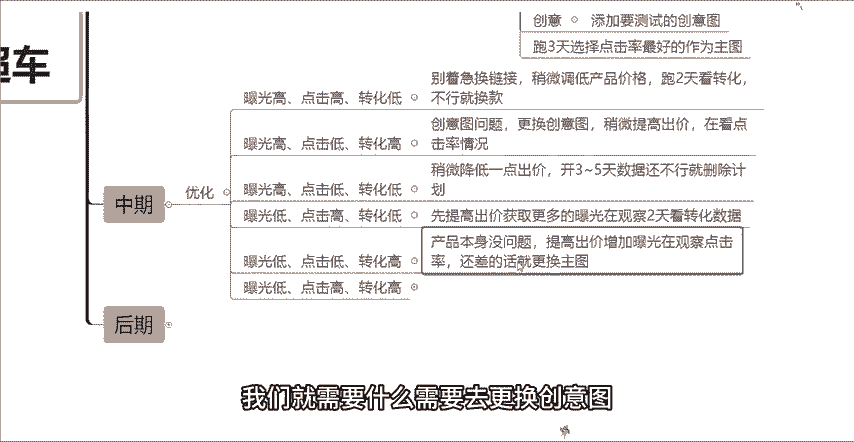

# 【拼多多运营】2024拼多多最新实操技巧，拼多多新手开直通车“3大重要阶段”一定要搞懂，新手开店拼多多运营实操教程！附带运营资料！ - P1 - 拼多多运营实操教程 - BV1qvsoekEt2

做拼多多啊，开直通车从来就没有所谓的固定的公式。首先直通车呢它是一个变量的因素。就算你把两个一模一样的产品放在直通车当中，同时去开，给他同样的日线额，同样的出价，他俩的表现呢，数据都有可能不同。

所以根本不会存在什么一成不变的直通车操作。那么直通车到底应该怎么去开呢？这一期视频我会一个视频带你搞懂。那么想要真正搞懂拼多多直通车的这个小伙伴呢可以先关注点赞收藏起来，耐心的看完今天这期视频。

时间会有一点点长啊，那么如果说一遍没有搞懂搞懂的小伙伴呢，也可以多看几遍。那么这一期视频啊，我给大家分为了三个阶段来讲，初期中期和后期一一次性给你讲清楚啊。呃，如果说你掌握了这个方法呢。

那么你的直通车绝对就算入门了。好吧，那首先啊初期开直通车。

它只有一个目的就是测试链接啊测试链接。但是测试链接呢它又有两种测试方法，不一定是完全靠直通车。我们可以用自然流量去测，或者用付费流量，就是用直通车去测自然流量的话怎么去测呢？就是在我们的这个店铺后台。

然后有一个数据中心，我们点击商品数据之后，就可以看到在这个地方，你可以看到你的这个店铺当中上架的所有的链接，他们的这个商品访客数啊，然后成交件数成交金额以及这个转化率，还有商品的收藏用户数。

这些数据呢在这个地方都能够看到。那么你就可以通过这些比如说访客数据订单以及转化率以及收藏来分析哪一些链接或者哪一个链接，它是表现比较好的，它是能够有潜力作为主推链接的那但是这边地这个地方呢。

会遇到一个问题啊，就是很多新店啊上架之后，产品是很难获得这个自然流量的对吧？那就算有一点点自然流量，相对来讲它的这个流量的精准度也是不太够的。所以说啊如果我们前期用新店啊。

然后用自然流量来测试主推链接的话，相对来讲是很麻烦的啊，那么这个时候呢我们就会选择用直通车来进行测试。直通车测试的话，我们一般是开标准推广进行测试。那么我们在店铺的后台找到推广平台，点击标准推广。

在这个地方呢，我们点击这个添加推广商品。那么我们就可以把所有的就是我们要测试的这样的一个链接，把它添加到我们的这个计划当中。那么我们需要给这些产品啊设置好这个日线额，设置好它的。

出价啊，是少它的出价。那么具体怎么去设置呢？这边跟大家具体讲一下啊。首先日线额在测试阶段呢，我们可以统一的给它出价100块钱就可以了。在这个地方指定预算，直接设置100元。然后每一个链接啊都是一样的啊。

你都给它设置100元。然后成交出价呢，这边有一个公式，大家可以记一下。如果说你的这个产品的客单价是在50块钱以内的，那么你就可以按照你的热销SQU的价格去出价。

如果说你的这个成这个客单价是在50块钱以上的呢，你就可以按照卖一单的利润来进行出价。然后这个是成交出价的一个设置啊。然后下面还有询单出价收藏出价跟关注出价，这三个目标啊，我们都是不开的，好吧。

都是不开的。然后下面这个即速起量呢是可以打开的啊。

极速起量可以打开的。按照这样的一个设置，我们的这个测试计划呢就设置好了。然后我们可以跑3到5天来看数据啊，跑3到5天来看数据来进行判断哪些链接它的表现是比较好的那如果说你做的是这个大类目。

那比如说什么叫大类目呢？比如说我们的这个服饰鞋包啊，还有像一些快消品日用品，这种就是在整个拼多多平台上，它的这个体量是很大的。然后这个店铺以及同行是特别特别多的这种呢我们就把它叫做大类目，大类目的话。

一般来讲我们拿300到500个点击量，就是足够可以判断的。如果说你是小类目就是一些比较冷门的，然后同行做的比较少的，相对来讲就是这个销量没有那么高的呢？这种就叫做小类目。

小类目的话基本上100到300个点击量就可以去判断的。然后最简单的一个判断的一些参考依据呢，就是你的这个。的曝光量，然后你的这个点击量，然后你的这个转化啊，选择数据最好的来作为主推链接。

因为你添加了多个链接进行测试，只有你的这个链接能够拿到曝光，能够就简单来讲就是能够烧出钱呢，能够拿到点击了，甚至还有转化了，这个才代表就是说平台它认可了你的这一条链接是吧？认可了你的这个产品。

然后认可了你的这个价格，它才会给到你曝光，给到你流量，给到你转化。好吧。然后我们把这几个数据指标做一个分析，然后把最好的拿来作为我们的这个主推链接就可以了啊，作为主推链接就可以了。然后呃谁高就选谁嘛。

然后开车放量的话，我们一般都是先开这个标准，然后再开全站服饰鞋包除外啊，然后服饰鞋包的话是可以。直接的去开全站的啊，直接去开全站的。这一次呢我们就先讲这个标准计划的一个测图啊测图。

首先呢我们按照上面的这个方式啊，按照上面这个方式一样的。可以去这个创建一个计划啊，创建一个计划。就是我们先把主推链接给选出来之后，用这条主推链接，我们重新的去创建一个计划。日线额还是100。然后出价呢。

跟这上面一样的，知道吧？你看一下你的这个链接的客单价是在50以内呢，还是在50以上呢，就按照不同的这个条件啊去出价。然后下面的这个询单关注收藏同样的也是不开。然后集数起量呢也是可以打开。

然后计划创建好了之后啊，来我给大家看一下。比如说。

比如说这一条计划是我们创建的这个测图计划。然后我们点击这个地方有一个更多更多点击创意啊，点击创意。然后在这个地方我们点击编辑创意啊，点击编辑创意。在这个地方有一个这个创意图库啊。

我们可以点击编辑或者添加创意图库。然后在这里面我们需要去勾选。我们需要去测试的这样的一些图片啊，测试的图片，勾选完之后，然后这个计划我们就创建好了，创建好了，同样的也是要跑三天啊，跑3天。

然后我们去看数据表现，看数据表现是什么呢？就是看点击率，我们选择点击率，选择数据最好的来作为我们的这个主图就可以了。知道吧？

选择两个链接啊，两个计划。第一个计划是为了选出主推链接。第二个计划是测试这个主图，测试点击率好吧，然后这一步做好了之后啊，这个就是我们的一些初期的操作。初期操作之后做好了之后。

我们就进入到了我们的直通车的中期阶段。这个阶段呢是以优化为主啊，以优化为主来教大家几个优化的公式啊，大家记清楚就可以了。

如果说当你的这个计划。曝光高点击高，然后转化呢比较差的情况下，你这个时候不用着急着去换链接，知道吧？别着急着换链接，有可能是什么？有可能是我们的这个产品的价格定价稍微的有一点点高。

我们可以稍微的去把产品的价格调低一点点，然后再跑两天看转化。如果说数据如果说转化率有所提高，但还是不太理想的话，那么我们可以再稍微的降低一点点链接，那直到降低说哎你的这个链接可能说都没有利润了，对吧？

没有利润空间呢，转化还是不好，那你就去换款啊，就换款就可以了。这是第一种情况，第二种情况，当你的曝光高，但是点击比较低，然后转化还可以的情况下呢，这个时候啊基本上是你的这个创意图出现了问题。

那么你就需要去更换你的创意图，更换完创意图之后呢，稍微。

的把出价提高一点点，知道吧？把出价提高一点点，再来看我们的这个点击率的情况，这是第二种啊。那么第三种，当你的曝光高点击低，然后转化也低的情况下，这个时候先稍微的把我们的这个降这个出价降低一点点。

然后再去开3天左右再看数据。如果说数据表现还是很差的话，把这个计划删除掉就可以了啊，删除这条计划。那么第四种情况，当我们的曝光低点击高转化低的情况下呢，我们可以先适当的提高一点直通车的出价啊。

因为我们的出价提高了。那么就我们就可以获得更多的一个曝光量，因为我们的直通车排名会靠前一点，获取到更多的曝光之后呢，我们再来观察两天，看一下这个转化率的数据有没有好转啊，有没有。

好转看一下转化数据。

然后第五种情况，当我们的这个曝光低，但是点击也低，但是转化高的话呢，就说明什么就说明我们的产品是没有任何问题的。产品本身是没有问题的。这个时候我们要做的呢，就是把我们的直通车出价给相对提高一点点。

增加先增加我们的这个链这个计划的曝光量，然后我们再来观察点击跟点击率的情况，如果说点击还是比较差，我们就需要什么需要去更换创意图，更换主图了，知道吧？然后最后一种情况，当曝光比较低。

但是呢点击跟转化都比较好。这种情况下证明什么证明我们的产品本身跟我们的这个主图跟我们的创意图方面都是没有任何问题的。这个时候啊，我们只需要先把我们的计划的日线额相对的提高一点点。

或者把我们的直通车的出价。

给提高一点点来增加我们的这个曝光量就可以了啊，就可以了。那么这就是我们直通车计划的几种优化的方式。那么你们在开车的过程当中呢，也可以根据这几种情况去找一下你们对应的是遇到的哪种情况。

然后所对应的一个调整的方法，好吧，调整的方法，那么直通车优化好了之后啊，我们就进入了直通车的后期阶段呢，后期阶段主要的核心是什么，就是托价啊，托价开始托价实现低价卡排名抢流量的一个目的。

那么这个期间有一个核心，核心是什么呢？就是我们需要根据日限额的消耗速度啊，来进行托价。这个阶段重点看的就是日限额的消耗速度，不要看什么，不要看曝光，也不要看点击也不要看转化，只看日限额的消耗速度。

如果说日限额的消耗。

速度越快，那么证明我们可调整可托价的这个幅度也就越大。如果说日限额消耗的速度越慢的话，那么代表我们可调整的这个幅度就越小。那给大家举个例子啊，举个例子，比如说刚开始的阶段，对吧？

我们的这个直通车的出价是10块钱，那么我们的日限额是300块钱。那么这种情况下，我们发现哎我们的这个计划烧到了什么，烧到了当天晚上比如说10点11点甚至12点烧到了很晚才才结束才烧完。

那么这种情况下能托价吗？能调整吗？不能知道吧？这种情况下，你的这个计划的权重还没有跑起来，还没有提高，你就不能进行托价。如果说你托价的话，你就会发现你的这个计划跑不动的，知道吧？只能这样先这样开着。

先多跑几天，把我们的这个直通车的计划，权重给累积一下。

之后再来调整啊再来调整。

然后等你的这个日限额的消耗速度变快了之后，你再来拖价。那当我们发现哎我们的直通车烧到，比如说烧到了下午啊，四五点五六点钟，我们的这个日限额就能够烧完。这个时候啊就代表着我们可以去拖价了。

那么托价大家也要注意注意一点点啊。

你的这个幅度要稍微的小一点，知道吧？那给家举个例子，比如说我们目前的出价是10块钱，然后日限额是300块钱。当我们的这个计划烧到下午日线额就烧完了。那么在第二天的时候呢。

我们就可以把日限额提高到330块钱。然后我们的出价呢可以降到9块钱，知道吧？这是什么样的一个幅度比例呢？就是10%，我们的日线额可以提高10%，然后出价可以降低10%，按照这样的一个幅度调整幅度去调。

知道吧？如果说你一一次性比如说把我们的日限额调到400，然后出价降到8块，降到7块，那么你的这个计划肯定就跑不动了，你的这个计划就废了，知道吧？慢慢的降降10%就可以了。

那如果说你发现你的日限额消耗的速度特别快，比如说消消耗到烧到中午，日限额的就。

完了这个时候呢，你的这个幅度就可以更大一点。比如说你第二天你的日限额可以调到360块钱，然后你的出价可以降到8块钱。这个时候呢你就可以按照20%的幅度去调整，知道吧？去调整，然后调整完之后啊。

调一次你就观察一下，后面一天，后面两天它的烧的速度，如果说你发现哎日限额的这个调整完日限额的这个消耗的速度明显变慢了，你就不要调整了，知道吧？就不要调整了，停止托价。如果你发现哎它还是烧的比较快，对吧？

你就可以继续的调啊，继续调，直到调整到什么，调整到你这个计划呢，你我们的这个目标的预期能够达到我们的目标的预期，那么你的这个计划呢，就基本上不用动了，好吧。

就基本上是盈利是一个健康的这个直通车的一个状态了，好吧，这就是。

托架的一个核心以及托架的一个方法啊一个方式。那么看到这里还有什么不懂的小伙伴呢？可以在评论区关注留言，666找我领取一份我给大家整理的店铺的综合运营大礼包。然后如果说关于直通车方面。

你们还有任何不懂的地方，比如说初期你有哪里不懂，中期你有哪里不懂的，或者后期你有哪里不懂的，都可以在评论区找到我，找我咨询一下，我都会给你一一的去做解答。这边呢给大家准备了将近100份的一个文档。

可以帮他更好的了解我们拼多多运营拼多多能够提高大家运营水平。如果大家需要的话，评论区找我领取。

